# dbo.edit_header_$sp

**Database:** auditworks_external  
**Server:** bedrockdb01  

## Architecture Diagram

```mermaid
flowchart LR
    SP["dbo.edit_header_$sp"]
    ORG_CHN(["ORG_CHN"]) --> SP
    ORG_CHN_APLCTN_USG(["ORG_CHN_APLCTN_USG"]) --> SP
    ORG_CHN_WRKSTN(["ORG_CHN_WRKSTN"]) --> SP
    audit_status(["audit_status"]) --> SP
    auditworks_parameter(["auditworks_parameter"]) --> SP
    auditworks_system_flag(["auditworks_system_flag"]) --> SP
    common_error_handling__sp(["common_error_handling_$sp"]) --> SP
    create_register_status__sp(["create_register_status_$sp"]) --> SP
    create_store_status__sp(["create_store_status_$sp"]) --> SP
    delete_details__sp(["delete_details_$sp"]) --> SP
    duplicate_transaction(["duplicate_transaction"]) --> SP
    dw_dblink_peripheral(["dw_dblink_peripheral"]) --> SP
    dw_store_master(["dw_store_master"]) --> SP
    dw_store_status(["dw_store_status"]) --> SP
    edit_copy_input_tables__sp(["edit_copy_input_tables_$sp"]) --> SP
    edit_date_tracking(["edit_date_tracking"]) --> SP
    edit_header_duplicates__sp(["edit_header_duplicates_$sp"]) --> SP
    edit_skip_duplicates__sp(["edit_skip_duplicates_$sp"]) --> SP
    edit_store_date_list(["edit_store_date_list"]) --> SP
    parameter_general(["parameter_general"]) --> SP
    sa_rejection_reason(["sa_rejection_reason"]) --> SP
    store_audit_status(["store_audit_status"]) --> SP
    transaction_category(["transaction_category"]) --> SP
    transaction_header(["transaction_header"]) --> SP
    transaction_series(["transaction_series"]) --> SP
    transaction_series_lookup(["transaction_series_lookup"]) --> SP
    transl_transaction_hdr(["transl_transaction_hdr"]) --> SP
    transl_transaction_line(["transl_transaction_line"]) --> SP
    translate_error(["translate_error"]) --> SP
    work_delete_detail(["work_delete_detail"]) --> SP
    work_ownership_edit(["work_ownership_edit"]) --> SP
    work_recurring_transaction(["work_recurring_transaction"]) --> SP
    work_sa_rejects_edit(["work_sa_rejects_edit"]) --> SP
    work_tran_header_edit(["work_tran_header_edit"]) --> SP
```



## Table Dependencies

| Referenced Table |
|---|
| ORG_CHN |
| ORG_CHN_APLCTN_USG |
| ORG_CHN_WRKSTN |
| audit_status |
| auditworks_parameter |
| auditworks_system_flag |
| common_error_handling_$sp |
| create_register_status_$sp |
| create_store_status_$sp |
| delete_details_$sp |
| duplicate_transaction |
| dw_dblink_peripheral |
| dw_store_master |
| dw_store_status |
| edit_copy_input_tables_$sp |
| edit_date_tracking |
| edit_header_duplicates_$sp |
| edit_skip_duplicates_$sp |
| edit_store_date_list |
| parameter_general |
| sa_rejection_reason |
| store_audit_status |
| transaction_category |
| transaction_header |
| transaction_series |
| transaction_series_lookup |
| transl_transaction_hdr |
| transl_transaction_line |
| translate_error |
| work_delete_detail |
| work_ownership_edit |
| work_recurring_transaction |
| work_sa_rejects_edit |
| work_tran_header_edit |

## Stored Procedure Code

```sql
CREATE proc [dbo].[edit_header_$sp] 

@process_id binary(16),
@user_id	int,
@edit_timestamp float,
@transaction_count numeric(12,0) OUTPUT,
@errmsg varchar(2000) OUTPUT,
@request_type  tinyint = 1,
@store_count  numeric(12,0) OUTPUT,
@edit_process_no tinyint = 1

AS

/* 
PROC NAME: edit_header_$sp
DESC: EDIT - build transaction_header table and create audit status rows. Flag duplicates 
	     and create sa_rejects for invalid store-reg-dates. sa_reject_qty and duplicate_qty
	     in audit_status are set in edit_phase2 unless user is trickle in which case phase1 
	     will calculate these as well. If duplicate transactions are processed, the transactions 
	     which are sa_rejections will be reprocessed rather than flagged as duplicates.
	     If @request_type > 1, then need to set column processing_request in edit_store_date_list to identify
	     which store-reg-dates to process when phase2 is executed at the end of the phase1 batch.
	     XACT_ABORT ON is required for scaleout when writing to cross-server views.
	     Called by edit_post_$sp.      

*** Need to script with ansi_warnings and ansi_nulls on


HISTORY:  
Date     Name           Def# Desc
Jan10,14 Paul         148739 Use try .. catch
May14,13 Paul         143853 Call scaleout_populate_dw_tb_$sp when old transaction_dates <= last_date_closed are encountered
				in order to ensure that dw_store_status will exist when old dates are edited.
May13,13 Paul         143865 scaleout: allow claiming ownership of a store when only missing/unused/closed registers exist
Oct18,12 Vicci        138998 When removing translate_error also correct audit_status since Edit Phase2 does not recalculate translate reject quantities.
Feb20,12 Paul       1-48FEQB scaleout: avoid incorrect error message
Nov18,11 Paul         129920 When reprocessing sa rejected transactions, remove any previously existing related translate errors
Oct27,11 Paul       1-47OYN1 scaleout: log a warning for each store-date that was processed on the wrong peripheral. Use destination_instance_id.
May13,11 Paul         127064 replaced double quotes with char(39)
Oct27,10 Paul         121798 avoid changing dw_store_status if store_status = 2 (dayended) or higher, added retry loop
Sep07,10 Paul         119817 scaleout: turn on xact abort setting only when needed since it aborts error logging,
				and log additional scaleout messages to smartload log
Jul27,10 Paul         118378 log a message to smartload log when duplicate transaction headers are encountered,
				added SQL2005 try .. catch around insert to avoid aborting proc in SQL2005.
May31,10 Paul         117568 port update of edit_date_tracking from Oracle.
May18,10 Vicci        117409 For the option to discard prior-to-live non-closeout transactions dated after last date closed, don't keep closeouts 
                             dated earlier than the date immediately preceeding live, and discard prior to live transactions even if for invalid store/reg/date.
Jan08,10 Vicci        115175 Support option to discard prior-to-live non-closeout transactions date after last date closed.
Jan07,10 Vicci        115118 Added sequential_series_present to allow for determination of whether transaction missing needs to be evaluated.
Feb19,09 Vicci      1-3JIN15 Ensure newly arrived closeout is recognized by auto-phase-2-completed dates processing.
Jan12,09 Paul         107351 corrected scaleout logic
Apr25,08 Paul          98023 Uplift 1-3WGK0B to SA5
Jan11,08 Paul          94350 Do not reset dw_store_status to 1 for invalid dates (when store-date already archived)
Oct25,07 Paul          13800 Updated comments to explain @request_type functionality
Mar27,07 Paul        DV-1356 apply 84714 to SA5
Jan09,07 Paul          81764 improve dw_status logic, apply 78965 to SA5
Oct25,06 Phu           77931 Fix outer join for SQL 2005 Mode 90.
Mar16,06 Paul        DV-1331 apply 67999 to SA5
Jul13,05 Paul        DV-1295 Add nolock hints
Mar21,05 Sab	     DV-1218 Added logic for scaleout to populate dw_store_status and dw_store_master.
Dec13,04 Seb         DV-1191 Added logic for scaleout
Dec07,04 Paul        DV-1181 apply 1-14UFHY to SA5, add nolock hints
Sep23,04 David       DV-1146 Use user_id
May17,04 Maryam      DV-1071 Use ORG_CHN_WRKSTN, ORG_CHN tables, receive @process_id
Apr16,04 Sab	     DV-1068 Remove old media rec logic
Apr17,08 Paul       1-3WGK0B update new columns in edit_store_date_list to reduce multistream timing issues
Mar27,07 Vicci         84714 Reject as duplicate transaction already in transaction header under replacement transaction series.
Dec13,06 Vicci         81260 Retrofit DV-1202.  Log lookup_transaction_series.
Nov30,06 Vicci         78965 Pass open date to create store status as well as open_to_receive when
                             stock or payroll or system transactions present.
Feb21,06 Vicci	       67999 Distinguish workstation closeouts from store-closeouts
Nov03,04 Shapoor    1-14UFHY Avoid store/dates get left locked by edit in multi-stream environment. 
Oct15,04 Maryam        42166 superceded by SA5  
Mar25,04 Daphna        26338 set completion_date_time correctly for closeout_flag =2
Oct14,03 Maryam        16484 reset @errmsg after getting the message status already exists.
Jun19,03 Winnie		9250 Media Reconciliation enhancements.
Apr23,03 Paul        1-KO2HY populate till_no
Mar04,03 Vicci          6493 Support multiple registers in same batch for request-type 2.
Dec04,02 David C     1-GKO3D If request_type=4 then run phase2 for completed store/dates.
Oct16,02 Winnie	     1-FGPA6 Set sa_reject if no lines for a transaction.
Oct03,02 Phu         1-FS4UT To determine transaction dates (logical trading dates) based on:
                             1) POS dates
                             2) Two closeout trans within closeout ranges for the same S/R/D 
Mar22,02 Paul        1-BUVZ9 insert tender_total as zero, remove join to transl header
Dec12,01 Phu         AW-8575 Logical trading dates
Nov26,01 Winnie	     1-969YY Add logic for R3 error handling to pass @edit_process_no to procedure
Nov06,01 Sab		8900 TRANSL edit changes for Sybase
Oct07,01 Winnie		8748 Add logic to count the number of store/date processed 
Oct17,01 Winnie		8852 For multistream, when inserting rows into edit_store_date_list and get duplicate
                  key, bypass it.
Jul10,01 ShuZ           8274 Home delivery handling
May08,01 Sab		7600 For multistream, when inserting rows into header and get duplicate key, try again
Apr20,01 David M	7587 Missing transactions by transaction Series version 1.0, removing
                            code for last_transaction_no. 
Jul16,01 Winnie		8284 To compensate in 2.46.25 for functionality lost as a result of
			     7587 for those running a front-end earlier than 2.50
Mar13,01 Winnie		7305 Reject transaction whose transaction number already exist for the same store/register/
  			     date combination.
Dec13,00 Paul		7108 Properly create sa rejects when after midnight trans are encountered
Nov20,00 Maryam         6795 tax_override_flag will be inserted as 1, but later on the insert to transaction_header
                             it will be set to 0. Only used to eliminate from the insert 
                             the transl_tax_override_details which the translate had left 
                             up to the edit_header_$sp to evaluate, for example sends to a store
                             in the same jurisdiction or returns from a store in the same jurisdiction etc
Nov10,00 Paul		6990 Fixed Def# 6932. Set edit_progress_flag = 0 when not trickle.
Nov01,00 Sab		6932 Set edit_progress_flag to 1 only for trickle_poll = 2
Oct11,00 Paul		6825 Reset date_reject_id on change of register,
				 change order by in cursor, remove temp table
Oct03,00 Paul		6776 Set status_already_existed flag in edit_store_date_list
Sep25,00 Maryam         6729 Modify to set the tax_override_flag properly.
Aug04,00 Maryam         6595 Correctly move transaction to previous sales date when 
                             closeout_flag = 0
Aug02,00 Phu		6475 Correct if reject: Merch/Fee without Jurisdiction Tax-Rate
Mar15,00 Paul		5724 Add new option to allow setting the transaction_date for trans
				after midnight to the previous day even if no close trans is present.
Mar01,00 Phu		5900 Change @@fetch_status > 0 to @@fetch_status <> 0 for MS SQL compatibility
Jul23,99 Daphna F	5026 Added call to delete_detail_$sp instead of deleting
				and setting off delete trigger on transaction_header	
Apr16,99 Louise M.	4526 New code to support trickle edit.
Aug14,98 Paul S.
Jan09,97 Paul S		author  version 1.19 

*/ 


DECLARE
	@dblink_name			nvarchar(128),
	@db_name				nvarchar(30),
	@completion_date_time		datetime,
	@cursor_open			tinyint,
	@date_rejects_exist		tinyint,
	@date_reject_id			tinyint,
	@default_post_midnight_time	int,
	@default_pre_midnight_time		int,
	@destination_instance_id		int,
	@duplicate_count			int,
	@edit_progress_flag		tinyint,
	@entry_exists			tinyint,
	@errmsg2				nvarchar(2000),
	@errmsg3				nvarchar(255),
	@errline				int,
	@errno				int,
	@exist				smallint,
	@input_id			numeric(12,0),
	@instance_id			int,
	@last_date_closed			datetime,
	@logical_trading_date_enabled	tinyint,
	@max_entry_date_time		datetime,
	@max_date			smalldatetime,
	@message_id			int,
	@msg_counter			int,
	@object_name			nvarchar(255),
	@open_date			datetime,
	@open_to_receive_date		datetime,
	@operation_name			nvarchar(100),
	@process_name			nvarchar(100),
	@processing_request		tinyint,
	@reject_recur_tran		smallint,
	@register_no			smallint,
	@rows				int,
	@sa_rejection_flag		tinyint,
	@scaleout_flag			int,
	@set_tax_override_flag		tinyint,
	@status_already_existed		tinyint,
	@status_reject_reason		tinyint,
	@store_completion_date_time	datetime,
	@store_no			int,
	@store_entry_exists		tinyint,
	@sql_command			NVARCHAR(500),
	@trace_msg			nvarchar(255),
  	@tran_date			smalldatetime,
	@trans_count			int,
	@transaction_date			smalldatetime,
	@trickle_polling_flag		tinyint,
	@trickle_counts_flag		tinyint,
	@sequential_series_present		tinyint,
	@discard_prior_to_live_date	smalldatetime

SELECT  @edit_progress_flag = 0,
	@trickle_counts_flag = 0,
 	@entry_exists = 0,
 	@date_rejects_exist = 0,
 	@msg_counter = 0,
 	@store_count = 0,
 	@transaction_count = 0,
	@process_name = 'edit_header_$sp',
	@message_id = 201068;

/* TODO: Can likely remove XACT_ABORT setting on and off after all procs are modified to use try catch everywhere
         or could use just one set on and one set off for the entire proc when scaleout_flag = 1.
         Would need to confirm by testing in a scaleout environment to verify that the try catch fires on a cross-server query. */

BEGIN TRY

SELECT @errmsg = 'Failed to create a temp table.',
          @object_name = '#str_date',
          @operation_name = 'CREATE';

CREATE TABLE #str_date (
	store_no	int,
	sales_date	smalldatetime,
	date_reject_id	tinyint);

CREATE TABLE #edit_hdr_closeout_reg (
  transaction_date smalldatetime null,
  store_no int not null,
  register_no smallint not null,
  completion_date_time datetime null,
  closeout_flag tinyint not null );

CREATE TABLE #edit_hdr_date_store_reg (
  transaction_date smalldatetime not null,
  store_no int not null,
  register_no smallint not null,
  date_reject_id tinyint not null,
  distinct_status tinyint not null,
  reg_pre_midnight_time int null,
  reg_post_midnight_time int null,
  reg_pre_midnight_date_time datetime null,
  reg_post_midnight_date_time datetime null,
  completion_date_time datetime null,
  store_completion_date_time datetime null );

  SELECT @operation_name = 'SELECT',
         @errmsg         = 'Failed to determine whether or not a live date has been specified for the purpose of discarding non-closeout transactions dated after the last date closed but prior to the live date',
         @object_name    = 'auditworks_parameter';

SELECT @discard_prior_to_live_date = par_value
  FROM auditworks_parameter
 WHERE par_name = 'discard_prior_to_live_date'
   AND COALESCE(LTRIM(par_value), '') <> '';

  SELECT @errmsg = 'Failed to read table parameter_general.',
         @object_name = 'parameter_general';
SELECT @trickle_polling_flag = ISNULL(trickle_polling_flag,0),
       @last_date_closed = last_date_closed
  FROM parameter_general;

  SELECT @errmsg = 'Failed to select reject_recurring_trans_number from auditworks_parameter',
         @object_name = 'auditworks_parameter';
SELECT @reject_recur_tran = CONVERT(smallint, par_value)
  FROM auditworks_parameter
 WHERE par_name = 'reject_recurring_trans_number';

  SELECT @errmsg = 'Failed to select default_pre_midnight_time from auditworks_parameter',
         @object_name = 'auditworks_parameter';
SELECT @default_pre_midnight_time = CONVERT(int, par_value)
  FROM auditworks_parameter
 WHERE par_name = 'default_pre_midnight_time';

  SELECT @errmsg = 'Failed to select default_post_midnight_time from auditworks_parameter',
         @object_name = 'auditworks_parameter';
SELECT @default_post_midnight_time = CONVERT(int, par_value)
  FROM auditworks_parameter
 WHERE par_name = 'default_post_midnight_time';

  SELECT @errmsg = 'Failed to select scaleout_flag from auditworks_system_flag',
         @object_name = 'auditworks_system_flag';
SELECT @scaleout_flag = CONVERT(int,flag_numeric_value)
  FROM auditworks_system_flag
 WHERE flag_name = 'scaleout_flag';
SELECT @rows = @@rowcount;

IF @rows = 0
  BEGIN
    SELECT @errmsg = 'Invalid setup. Missing scaleout_flag.',
	   @object_name = 'auditworks_system_flag';
    GOTO business_error;
  END;

    SELECT @errmsg = 'Failed to select instance_id from auditworks_system_flag',
           @object_name = 'auditworks_system_flag';
SELECT @instance_id = CONVERT(int,flag_numeric_value)
  FROM auditworks_system_flag
 WHERE flag_name = 'instance_id';
SELECT @rows = @@rowcount;

IF @rows = 0
  BEGIN
    SELECT @errmsg = 'Invalid setup. Missing instance_id.',
	   @object_name = 'auditworks_system_flag';
    GOTO business_error;
  END;

/* The trickle_counts_flag is used to indicate whether the s/a and i/f rejects have been
   calculated for the store/reg/date. */
IF @trickle_polling_flag >= 2
  SELECT @trickle_counts_flag = 1,
	@edit_progress_flag = 1;

 /* Note: tax_override_flag will be inserted as 1, but later on the insert to transaction_header
    it will be set to 0. Only used to eliminate from the insert the transl_tax_override_details which the
    translate had left up to the edit_header_$sp to evaluate, for example sends to a store
    in the same jurisdiction or returns from a store in the same jurisdiction etc */

  SELECT @operation_name = 'TRUNCATE',
          @errmsg = 'Failed to truncate work_tran_header_edit.',
          @object_name = 'work_tran_header_edit';
TRUNCATE TABLE work_tran_header_edit;

   SELECT @errmsg = 'Failed to truncate work_recurring_transaction (initial).',
          @object_name = 'work_recurring_transaction';
TRUNCATE TABLE work_recurring_transaction;


-- duplicated rows in GOH will cause this error trap to fire
 SELECT @operation_name = 'INSERT',
 	@errno = 0;
 BEGIN TRY

INSERT work_tran_header_edit (
	store_no,
	register_no,
	entry_date_time,
	transaction_no,
	transaction_series,
	transaction_date,
	date_reject_id,
	transaction_category,
	orig_transaction_category,
	edit_timestamp,
	transaction_time,
	closeout_flag,
	duplicate_flag,
	sa_rejection_flag,
	cashier_no,
	tax_override_flag,
	employee_on_file_flag,
	transaction_void_flag,
	tender_total,
	deposit_declaration_flag,
	pos_tax_jurisdiction,
	employee_no,
	tax_jurisdiction_store,
	status_reject_reason,
	row_sequence_no,
	reg_pre_midnight_time,
	reg_post_midnight_time,
	transaction_remark,
	line_exists,
	till_no,
	lookup_transaction_series,
	open_date,
	open_to_receive_date)
SELECT
	th.store_no,
	th.register_no,
	th.entry_date_time,
	th.transaction_no,
	th.transaction_series,
	CONVERT(smalldatetime, CONVERT(char(8),th.entry_date_time,112)), -- removes time
	0,
	COALESCE(tc.transaction_category, 0),
	th.transaction_category,
	@edit_timestamp,
	DATEPART(hh,th.entry_date_time) * 100
           + DATEPART(mi,th.entry_date_time),
	th.closeout_flag,
	0,
	0,
	th.cashier_no,
	1, -- tax_override_flag will be set to 0 on later insert into Transaction_header
	0,
	th.trans_void_flag,
	0,
	th.deposit_declaration_flag,
	th.pos_tax_jurisdiction,
	th.employee_no,
	th.tax_jurisdiction_store,
	@status_reject_reason, -- zero
	th.row_sequence_no,
	COALESCE(CONVERT (int, SUBSTRING((CONVERT(nvarchar, r.BSNS_DAY_END_RNG_START_TIME, 8)),1,2) + 
	                     SUBSTRING((CONVERT(nvarchar, r.BSNS_DAY_END_RNG_START_TIME, 8)),4,2)), @default_pre_midnight_time),
	COALESCE(CONVERT (int, SUBSTRING((CONVERT(nvarchar, r.BSNS_DAY_END_RNG_END_TIME, 8)),1,2) + 
	                     SUBSTRING((CONVERT(nvarchar, r.BSNS_DAY_END_RNG_END_TIME, 8)),4,2)), @default_post_midnight_time),
	th.transaction_remark,
	0,
	th.till_no,
	COALESCE(ts.transaction_series, th.transaction_series),
	CASE WHEN (COALESCE(s.OPEN_DATE, s.OPEN_TO_RCV_DATE) > @last_date_closed) 
             THEN COALESCE(s.OPEN_DATE, s.OPEN_TO_RCV_DATE)
             ELSE NULL
        END,
        CASE WHEN (tc.system_transaction_category IN (203, 204, 205, 206) 
                   AND s.OPEN_TO_RCV_DATE > @last_date_closed 
                   AND (s.OPEN_TO_RCV_DATE < s.OPEN_DATE OR s.OPEN_DATE IS NULL)) 
             THEN s.OPEN_TO_RCV_DATE 
             ELSE NULL
        END
  FROM transl_transaction_hdr th WITH (NOLOCK)
       LEFT JOIN transaction_category tc WITH (NOLOCK) ON (th.transaction_category = tc.transaction_category)
       LEFT JOIN ORG_CHN s WITH (NOLOCK) ON (th.store_no = s.ORG_CHN_NUM)
       LEFT JOIN ORG_CHN_WRKSTN r WITH (NOLOCK) ON (th.store_no = r.ORG_CHN_NUM AND th.register_no = r.WRKSTN_NUM)
       LEFT JOIN transaction_series_lookup ts WITH (NOLOCK) ON (th.pos_transaction_series = ts.pos_transaction_series 
                 AND th.transaction_series = ts.default_transaction_series);

  SELECT @transaction_count = @@rowcount;

 END TRY
 BEGIN CATCH;
   SELECT @errno = ERROR_NUMBER();
 END CATCH;

 IF @errno != 0
    BEGIN
     IF @errno = 2601 /* trap duplicates. index x1 is dropped by edit_post_$sp before this insert and recreated afterwards */
       BEGIN
	SELECT @trace_msg = CHAR(13) + CHAR(10) + ':LOG && removing duplicated transactions : ' + CONVERT(char, getdate(), 8);
	PRINT @trace_msg;

         SELECT @errmsg = 'Duplicate transactions in batch could not be bypassed. Transactions were not processed.',
                  @object_name = 'edit_skip_duplicates',
                  @operation_name = 'EXEC';
         EXEC edit_skip_duplicates_$sp @edit_timestamp, @transaction_count OUTPUT,
	      @errmsg3 OUTPUT, @edit_process_no, @default_pre_midnight_time, @default_post_midnight_time;
       END; -- 2601
     ELSE
       BEGIN
        SELECT @errmsg = 'Failed to insert work_tran_header_edit',
               @object_name = 'work_tran_header_edit',
               @operation_name = 'INSERT';
        GOTO business_error;
       END;
    END; -- IF @errno != 0

  SELECT @errmsg = 'Failed to insert into table #edit_hdr_date_store_reg (1)',
         @object_name = '#edit_hdr_date_store_reg',
         @operation_name = 'INSERT';
INSERT INTO #edit_hdr_date_store_reg (
  transaction_date,
  store_no,
  register_no,
  date_reject_id,
  distinct_status,
  reg_pre_midnight_time,
  reg_post_midnight_time )
SELECT DISTINCT
  CONVERT(smalldatetime, CONVERT(char(8),entry_date_time,112)),
  store_no,
  register_no,
  date_reject_id,
  0,
  reg_pre_midnight_time,
  reg_post_midnight_time
FROM work_tran_header_edit WITH (NOLOCK)
WHERE reg_pre_midnight_time <> 2359
   OR reg_post_midnight_time <> 0;
   
SELECT @logical_trading_date_enabled = SIGN(@@rowcount);

IF @logical_trading_date_enabled > 0
BEGIN
  SELECT @errmsg = 'Failed to insert into table #edit_hdr_date_store_reg (2)',
         @object_name = '#edit_hdr_date_store_reg';
INSERT INTO #edit_hdr_date_store_reg (
  transaction_date,
  store_no,
  register_no,
  date_reject_id,
  distinct_status,
  reg_pre_midnight_time,
  reg_post_midnight_time )
SELECT DISTINCT
  CONVERT(smalldatetime, CONVERT(char(8), DATEADD(dd, -1, entry_date_time), 112)),
  store_no,
  register_no,
  date_reject_id,
  0,
  reg_pre_midnight_time,
  reg_post_midnight_time
FROM work_tran_header_edit WITH (NOLOCK)
WHERE transaction_time <= reg_post_midnight_time

  SELECT @errmsg = 'Failed to insert into table #edit_hdr_date_store_reg (3)',
         @object_name = '#edit_hdr_date_store_reg';
INSERT INTO #edit_hdr_date_store_reg (
  transaction_date,
  store_no,
  register_no,
  date_reject_id,
  distinct_status,
  reg_pre_midnight_time,
  reg_post_midnight_time )
SELECT DISTINCT
  CONVERT(smalldatetime, CONVERT(char(8), DATEADD(dd, 1, entry_date_time), 112)),
  store_no,
  register_no,
  date_reject_id,
  0,
  reg_pre_midnight_time,
  reg_post_midnight_time
FROM work_tran_header_edit WITH (NOLOCK)
WHERE transaction_time >= reg_pre_midnight_time;

  SELECT @errmsg = 'Failed to insert into table #edit_hdr_date_store_reg where distinct_status = 0',
         @object_name = '#edit_hdr_date_store_reg';
INSERT INTO #edit_hdr_date_store_reg (
  transaction_date,
  store_no,
  register_no,
  date_reject_id,
  distinct_status,
  reg_pre_midnight_date_time,
  reg_post_midnight_date_time )
SELECT DISTINCT
  transaction_date,
  store_no,
  register_no,
  date_reject_id,
  1,
  DATEADD(mi, (reg_pre_midnight_time/100)*60 + reg_pre_midnight_time%100, transaction_date),
  DATEADD(mi, (reg_post_midnight_time/100)*60 + reg_post_midnight_time%100, DATEADD(dd, 1, transaction_date))
FROM #edit_hdr_date_store_reg WITH (NOLOCK)
WHERE distinct_status = 0;

  SELECT @errmsg = 'Failed to delete table #edit_hdr_date_store_reg where distinct_status = 0',
         @object_name = '#edit_hdr_date_store_reg',
         @operation_name = 'DELETE';
DELETE FROM #edit_hdr_date_store_reg
WHERE distinct_status = 0;

-- Get closeout register from audit_status and set it in current batch
    SELECT @errmsg = 'Failed to set completion_date_time in #edit_hdr_date_store_reg from audit_status',
           @object_name = '#edit_hdr_date_store_reg',
           @operation_name = 'UPDATE';
UPDATE #edit_hdr_date_store_reg
  SET completion_date_time = a.completion_date_time
  FROM #edit_hdr_date_store_reg e, audit_status a WITH (NOLOCK)
 WHERE e.store_no = a.store_no
  AND e.register_no = a.register_no
  AND e.transaction_date = a.sales_date
  AND a.date_reject_id = 0
  AND a.completion_date_time IS NOT NULL; 

    SELECT @errmsg = 'Failed to set store_completion_date_time in #edit_hdr_date_store_reg from store_audit_status',
           @object_name = '#edit_hdr_date_store_reg';
  UPDATE #edit_hdr_date_store_reg
  SET store_completion_date_time = s.completion_date_time
  FROM #edit_hdr_date_store_reg e,
	 store_audit_status s WITH (NOLOCK)
  WHERE e.store_no = s.store_no
  AND e.transaction_date = s.sales_date
  AND s.date_reject_id = 0
  AND s.completion_date_time IS NOT NULL;

  -- Get closeout register from current batch
    SELECT @errmsg = 'from work_tran_header_edit, for closeout_flag = 1 or 2',
         @object_name = '#edit_hdr_closeout_reg',
         @operation_name = 'INSERT';
  INSERT #edit_hdr_closeout_reg (
	store_no, register_no, transaction_date, completion_date_time, closeout_flag)
  SELECT
	e.store_no, e.register_no, e.transaction_date, MIN(h.entry_date_time), 1
    FROM #edit_hdr_date_store_reg e WITH (NOLOCK), work_tran_header_edit h WITH (NOLOCK)
   WHERE h.store_no = e.store_no
     AND ((h.register_no = e.register_no AND h.closeout_flag = 1)
     OR h.closeout_flag = 2) 
     AND h.entry_date_time > e.reg_pre_midnight_date_time
     AND h.entry_date_time < e.reg_post_midnight_date_time
     AND (h.entry_date_time <= e.completion_date_time OR e.completion_date_time IS NULL)
     AND (h.entry_date_time <= e.store_completion_date_time OR e.store_completion_date_time IS NULL)
  GROUP BY e.store_no, e.register_no, e.transaction_date;

  SELECT @rows = @@rowcount;
  IF @rows > 0
  BEGIN
      SELECT @errmsg = 'Failed to set completion_date_time in #edit_hdr_date_store_reg from current batch',
             @object_name = '#edit_hdr_date_store_reg',
             @operation_name = 'UPDATE';
    UPDATE #edit_hdr_date_store_reg
      SET completion_date_time = t.completion_date_time
      FROM #edit_hdr_date_store_reg e, #edit_hdr_closeout_reg t WITH (NOLOCK)
     WHERE e.store_no = t.store_no
       AND e.register_no = t.register_no
       AND e.transaction_date = t.transaction_date
       AND t.closeout_flag = 1;
  END; -- @rows > 0

    SELECT @errmsg = 'from work_tran_header_edit, for closeout_flag = 2',
           @object_name = '#edit_hdr_closeout_reg',
           @operation_name = 'INSERT';
  INSERT #edit_hdr_closeout_reg (
    store_no, register_no, transaction_date, completion_date_time, closeout_flag)
  SELECT
    e.store_no, e.register_no, e.transaction_date, MIN(h.entry_date_time), 2
    FROM #edit_hdr_date_store_reg e, work_tran_header_edit h WITH (NOLOCK)
   WHERE h.store_no = e.store_no
     AND h.closeout_flag =2  
     AND h.entry_date_time > e.reg_pre_midnight_date_time
     AND h.entry_date_time < e.reg_post_midnight_date_time
     AND (h.entry_date_time <= e.store_completion_date_time OR e.store_completion_date_time IS NULL)
  GROUP BY e.store_no, e.register_no, e.transaction_date;

  SELECT @rows = @@rowcount;
  IF @rows > 0
  BEGIN
      SELECT @errmsg = 'Failed to set store_completion_date_time in #edit_hdr_date_store_reg from current batch',
             @object_name = '#edit_hdr_date_store_reg',
             @operation_name = 'UPDATE';
    UPDATE #edit_hdr_date_store_reg
       SET store_completion_date_time = t.completion_date_time
      FROM #edit_hdr_date_store_reg e, #edit_hdr_closeout_reg t WITH (NOLOCK)
     WHERE e.store_no = t.store_no
       AND e.register_no = t.register_no
       AND e.transaction_date = t.transaction_date
       AND t.closeout_flag = 2;
  END;

    SELECT @errmsg = 'Failed to set transaction_date in work_tran_header_edit from #edit_hdr_date_store_reg',
           @object_name = 'work_tran_header_edit',
           @operation_name = 'UPDATE';
  UPDATE work_tran_header_edit
     SET transaction_date = (SELECT MIN(e.transaction_date)
                               FROM #edit_hdr_date_store_reg e WITH (NOLOCK)
        WHERE h.store_no = e.store_no
            AND h.register_no = e.register_no
                                AND h.date_reject_id = e.date_reject_id
                                AND ( (h.entry_date_time <= COALESCE(e.completion_date_time, e.store_completion_date_time)
                                       AND COALESCE(e.completion_date_time, e.store_completion_date_time) IS NOT NULL)
                                     OR
                          (h.entry_date_time < e.reg_post_midnight_date_time
                                       AND COALESCE(e.completion_date_time, e.store_completion_date_time) IS NULL)
                                    )
                             )
    FROM work_tran_header_edit h, #edit_hdr_date_store_reg e WITH (NOLOCK), transaction_series t WITH (NOLOCK)
   WHERE h.store_no = e.store_no
     AND h.register_no = e.register_no
     AND h.date_reject_id = e.date_reject_id
     AND h.lookup_transaction_series = t.transaction_series
     AND t.logical_trading_date_closeout = 1
     AND ( (h.entry_date_time <= COALESCE(e.completion_date_time, e.store_completion_date_time)
            AND COALESCE(e.completion_date_time, e.store_completion_date_time) IS NOT NULL)
          OR
           (h.entry_date_time < e.reg_post_midnight_date_time
            AND COALESCE(e.completion_date_time, e.store_completion_date_time) IS NULL)
         );

    SELECT @errmsg = 'Failed to set transaction_date in work_tran_header_edit from #edit_hdr_date_store_reg',
           @object_name = 'work_tran_header_edit',
           @operation_name = 'UPDATE';
  UPDATE work_tran_header_edit
     SET transaction_date = (SELECT MIN(e.transaction_date)
                               FROM #edit_hdr_date_store_reg e WITH (NOLOCK)
                              WHERE h.store_no = e.store_no
                                AND h.register_no = e.register_no
                                AND h.date_reject_id = e.date_reject_id
                                AND ( (h.entry_date_time <= e.store_completion_date_time
                                       AND e.store_completion_date_time IS NOT NULL)
                                     OR
                                       (h.entry_date_time < e.reg_post_midnight_date_time
                                       AND e.store_completion_date_time IS NULL)
    )
     )
    FROM work_tran_header_edit h, #edit_hdr_date_store_reg e WITH (NOLOCK), transaction_series t WITH (NOLOCK)
   WHERE h.store_no = e.store_no
     AND h.register_no = e.register_no
     AND h.date_reject_id = e.date_reject_id
     AND h.lookup_transaction_series = t.transaction_series
     AND t.logical_trading_date_closeout = 2
    AND ( (h.entry_date_time <= e.store_completion_date_time
            AND e.store_completion_date_time IS NOT NULL)
          OR
           (h.entry_date_time < e.reg_post_midnight_date_time
            AND e.store_completion_date_time IS NULL)
         );

END; --IF @logical_trading_date_enabled

IF DATEADD(dd, -1, @discard_prior_to_live_date) > @last_date_closed
BEGIN
    SELECT @errmsg = 'Failed to remove prior to live transactions other than closeouts from the day before live from work_tran_header_edit',
           @object_name = 'work_tran_header_edit',
           @operation_name = 'DELETE';
  DELETE work_tran_header_edit
   WHERE transaction_date < @discard_prior_to_live_date
     AND transaction_date > @last_date_closed
     AND (closeout_flag = 0 OR transaction_date < DATEADD(dd, -1, @discard_prior_to_live_date));

    SELECT @errmsg = 'Failed to void lines of prior to live closeout transactions',
           @object_name = 'transl_transaction_line',
           @operation_name = 'UPDATE';          
  UPDATE transl_transaction_line
     SET line_void_flag = 1
    FROM work_tran_header_edit wh
   WHERE transl_transaction_line.store_no = wh.store_no
     AND transl_transaction_line.register_no = wh.register_no
     AND transl_transaction_line.entry_date_time = wh.entry_date_time
     AND transl_transaction_line.transaction_series = wh.transaction_series
     AND transl_transaction_line.transaction_no = wh.transaction_no
     AND wh.transaction_date < @discard_prior_to_live_date
     AND wh.transaction_date > @last_date_closed;

END;  --IF dateadd(dd, -1, @discard_prior_to_live_date) > @last_date_closed

IF @scaleout_flag = 1
BEGIN
  /* Get consolidated server connection information */
    SELECT @errmsg = 'Failed to retrieve connection information for consolidated server',
           @object_name = 'dw_dblink_peripheral',
           @operation_name = 'SELECT';
  SELECT @dblink_name = dblink_name,
	 @db_name = database_name
    FROM dw_dblink_peripheral
   WHERE instance_id = 0; -- value 0 is for the consolidated server

  SELECT @rows = @@rowcount;
  IF @rows = 0
    GOTO business_error;
END; -- If @scaleout_flag = 1

/* This cursor logic will populate the table dw_store_status and create the rows for new dates (if not already populated).
   Ownership of the store-dates will be claimed later. */

    SELECT @errmsg = 'Failed to open date_crsr',
          @object_name = 'date_crsr',
          @operation_name = 'OPEN';
DECLARE date_crsr CURSOR FAST_FORWARD
FOR
SELECT DISTINCT transaction_date
  FROM work_tran_header_edit WITH (NOLOCK)
 ORDER BY transaction_date;

OPEN date_crsr;
SELECT @cursor_open = 3;

IF @scaleout_flag = 1
  BEGIN
	SELECT @trace_msg = CHAR(13) + CHAR(10) + ':LOG && executing scaleout_populate_dw_tb_sp : ' + CONVERT(char, getdate(), 8);
	PRINT @trace_msg;
	SET XACT_ABORT ON; /* required for cross-server execution */
  END;

WHILE 1=1
BEGIN
  FETCH date_crsr INTO
	@tran_date;

  IF @@fetch_status <> 0
    BREAK;

  IF EXISTS (SELECT 1 FROM dw_store_status
             WHERE sales_date = @tran_date AND store_status >= 1)
    SELECT @exist = 1;
  ELSE
    SELECT @exist = 0;

  IF @exist = 0 OR @tran_date <= @last_date_closed -- need to create an entry for each store
  BEGIN

   IF @scaleout_flag = 0
   BEGIN
	  SELECT @errmsg = 'Failed to INSERT into dw_store_status (2)',
		 @object_name = 'dw_store_status',
		 @operation_name = 'INSERT';
    BEGIN TRAN /* mass insert rows for all stores when editing a date for first time */
       INSERT INTO dw_store_status (
		store_no,
		sales_date,
		store_status,
		instance_id,
		source_media_rec_recovery_id)
	 SELECT c.ORG_CHN_NUM,
		@tran_date,
		0,
		0,
		0
	   FROM ORG_CHN_APLCTN_USG u, ORG_CHN c
	  WHERE c.ACTV = 1
	    AND c.ORG_CHN_NUM = u.ORG_CHN_NUM
	    AND u.VLDTY = 1
	    AND u.APLCTN_ID = 300
	    AND NOT EXISTS(
	      SELECT 1 FROM dw_store_status dw
	       WHERE dw.sales_date = @tran_date
	        AND dw.store_no = u.ORG_CHN_NUM);
     COMMIT TRAN;
   END -- @scaleout_flag = 0
  ELSE
   BEGIN
	/* In a scaleout environment, execute the scaleout_populate_dw_tb_$sp proc on the consolidated server
	   in order to efficiently populate the tables dw_store_status and dw_store_master. */
     BEGIN TRY
	SELECT @errmsg = 'Failed to EXECUTE scaleout_populate_dw_tb_$sp',
		@object_name = 'scaleout_populate_dw_tb_$sp',
		@operation_name = 'EXECUTE';
     SET @sql_command = N'EXEC ' + @dblink_name + '.' + @db_name + N'.dbo.scaleout_populate_dw_tb_$sp ' + 
		   CONVERT(nvarchar(14),@instance_id) + N',' + CHAR(39) + CONVERT(nvarchar(30),@tran_date) + CHAR(39);
     EXEC sp_executesql @sql_command;

     END TRY
     BEGIN CATCH;
	SELECT @errno = ERROR_NUMBER();
	GOTO business_error;
     END CATCH;

   END; -- else of If @scaleout_flag = 0

  END; -- If @exist = 0 OR @tran_date <= @last_date_closed

END; -- WHILE 1=1

IF @scaleout_flag = 1
  BEGIN
   SET XACT_ABORT OFF; /* reactivate error trapping */
  END;

CLOSE date_crsr;
DEALLOCATE date_crsr;
SELECT @cursor_open = 0;

SELECT @errmsg = 'Failed to open cursor work_header_crsr',
          @object_name = 'work_header_crsr',
          @operation_name = 'OPEN';
DECLARE work_header_crsr CURSOR FAST_FORWARD
FOR
SELECT w.store_no,
       w.register_no,
       w.transaction_date,
       MAX(e.completion_date_time),
       MAX(e.store_completion_date_time),
       MAX(w.entry_date_time),
       w.open_date,
       w.open_to_receive_date, 
       MAX(ts.sequential)
  FROM work_tran_header_edit w WITH (NOLOCK)
       LEFT JOIN #edit_hdr_date_store_reg e WITH (NOLOCK) ON (w.store_no = e.store_no
                                                              AND w.register_no = e.register_no
                                                              AND w.date_reject_id = e.date_reject_id
                AND w.transaction_date = e.transaction_date)
       LEFT OUTER JOIN transaction_series ts
         ON w.lookup_transaction_series = ts.transaction_series
 GROUP BY w.transaction_date, w.store_no, w.register_no, w.open_date, w.open_to_receive_date
 ORDER BY w.transaction_date, w.store_no, w.register_no;
 
OPEN work_header_crsr;
SELECT @cursor_open = 1;

WHILE 2=2
BEGIN

FETCH work_header_crsr
INTO	@store_no,
	@register_no,
	@transaction_date,
	@completion_date_time,
	@store_completion_date_time,
	@max_entry_date_time,
	@open_date,
        @open_to_receive_date,
        @sequential_series_present;

IF @@fetch_status <> 0
  BREAK;

        SELECT @status_reject_reason = 0,
		@date_reject_id = 0,
               @errmsg = 'Failed to execute stored procedure create_store_status_$sp (prev date)',
               @object_name = 'create_store_status_$sp',
               @operation_name = 'EXECUTE';
        EXEC create_store_status_$sp @process_id, @user_id, @store_no, @transaction_date,
	    @date_reject_id OUTPUT, @status_reject_reason OUTPUT,
	    @errmsg3 OUTPUT, @edit_timestamp, NULL,
	    @store_completion_date_time = @store_completion_date_time,
	    @max_entry_date_time = @max_entry_date_time,
	    @open_date = @open_date,
            @open_to_receive_date = @open_to_receive_date;

        SELECT @store_count = @store_count + 1;

           SELECT @errmsg = 'Failed to execute stored procedure create_register_status_$sp',
                  @object_name = 'create_register_status_$sp',
                  @operation_name = 'EXECUTE';
        EXEC create_register_status_$sp @process_id, @user_id, @store_no, @register_no,
	    @transaction_date, 0, @date_reject_id OUTPUT,
	    @status_reject_reason OUTPUT, @errmsg3 OUTPUT, @edit_timestamp,
	    @completion_date_time = @completion_date_time,
	    @edit_process_no = @edit_process_no;

        IF @errmsg = 'status already exists'
          SELECT @status_already_existed = 1,
                 @errmsg = NULL;
        ELSE
          SELECT @status_already_existed = 0;

        IF @status_reject_reason >= 1
          SELECT @sa_rejection_flag = 1;
        ELSE
          SELECT @sa_rejection_flag = 0;

        IF @status_reject_reason >= 1 OR @date_reject_id > 0
        BEGIN
            SELECT @date_rejects_exist = 1,
                   @errmsg = 'Failed to update work_tran_header_edit (prior transaction_date)',
             	 @object_name = 'work_tran_header_edit',
                   @operation_name = 'UPDATE';
          UPDATE work_tran_header_edit
             SET date_reject_id = @date_reject_id,
                 sa_rejection_flag = @sa_rejection_flag,
                 status_reject_reason = @status_reject_reason
           WHERE store_no = @store_no
             AND register_no = @register_no
	    AND transaction_date = @transaction_date
             AND (open_date = @open_date OR (open_date IS NULL AND @open_date IS NULL))
             AND (open_to_receive_date = @open_to_receive_date 
                  OR (open_to_receive_date IS NULL AND @open_to_receive_date IS NULL));
        END; -- If @status_reject_reason >= 1 OR @date_reject_id > 0

        SELECT @store_entry_exists = 0,  --store level, defect 8274
	      @errmsg = 'Failed to determine previously set processing status for store',
	      @object_name = 'edit_store_date_list',
	      @operation_name = 'SELECT';
        SELECT @processing_request = MAX(processing_request)  --defect 6493
          FROM edit_store_date_list WITH (NOLOCK)
         WHERE store_no = @store_no
           AND transaction_date = @transaction_date
           AND date_reject_id = @date_reject_id;

        IF @processing_request IS NOT NULL -- then
          SELECT @store_entry_exists = 1;

        SELECT @entry_exists = 0;  --register level
        IF EXISTS ( SELECT 1
           FROM edit_store_date_list WITH (NOLOCK)
          WHERE store_no = @store_no
            AND register_no = @register_no
	    AND transaction_date = @transaction_date
            AND date_reject_id = @date_reject_id )
          SELECT @entry_exists = 1;

        IF @entry_exists = 1 -- 1-14UFHY
          BEGIN 
	        SELECT @errmsg = ' Failed to reset posted_flag edit_store_date_list',
	                @object_name = 'edit_store_date_list',
	                @operation_name = 'UPDATE';
           UPDATE edit_store_date_list
             SET posted_flag = 0, -- not processed yet
		batch_process_no = @edit_process_no,
		batch_started = getdate(),
		sequential_series_present = CASE WHEN @sequential_series_present >= 1 THEN 1 ELSE sequential_series_present END
           WHERE store_no = @store_no
             AND register_no = @register_no
             AND transaction_date = @transaction_date
             AND date_reject_id = @date_reject_id;
          END;

/*      If @request_type > 1 (except 6) then phase2 will only process rows from edit_store_date_list
	where processing_request = 1 and edit phase2 will be executed at the end of the phase1 batch.
	@request_type 6 was already reset to 1 (process all rows) in calling proc.

	If @request_type = 4, only set @processing_request to 1 if either @completion_date_time or @store_completion_date_time
	  are not null, i.e. a closeout transaction exists for the store-reg-date or store-date due to a prev edit batch.
	If @request_type in (2,3,5) then unconditionally set @processing_request to 1.
	@store_entry_exists = 0 when store-date did not already exist in edit_store_date_list with processing_request > 1. 

	processing_request can be null for a regular edit because all rows will be processed when @request_type = 1.
*/
	IF @request_type <> 1 AND @store_entry_exists = 0
           AND (@request_type <> 4 OR COALESCE(@completion_date_time, @store_completion_date_time) IS NOT NULL)
	    SELECT @processing_request = 1;

      IF @entry_exists = 0 
          BEGIN
	 BEGIN TRY
           INSERT edit_store_date_list (
		store_no,
		transaction_date,
		date_reject_id,
		register_no,
		edit_timestamp,
		trickle_counts_flag,
		status_already_existed,
		processing_request,
		completion_date_time,
		batch_process_no,
		batch_started,
		sequential_series_present )
           VALUES (
		@store_no,
		@transaction_date,
		@date_reject_id,
		@register_no,
		@edit_timestamp,
		@trickle_counts_flag,
		@status_already_existed,
		@processing_request,
		IsNull(@completion_date_time, @store_completion_date_time),
		@edit_process_no,
		getdate(),
		@sequential_series_present );
           SELECT @errno = 0; 	
	 END TRY
	 BEGIN CATCH;
	  SELECT @errno = ERROR_NUMBER();
	 END CATCH;
            /* trap dup error and continue in order to handle possible multistream timing scenario */
          IF @errno != 0 AND @errno != 2601
             BEGIN
              SELECT @errmsg = 'Failed to insert edit_store_date_list (prior)',
                     @object_name = 'edit_store_date_list',
                     @operation_name = 'INSERT';
              GOTO business_error;
             END;
          END;
      ELSE 
      BEGIN  -- handle another possible timing issue
          SELECT @errmsg = 'Failed to update edit_store_date_list (prior)',
                 @object_name = 'edit_store_date_list',
                 @operation_name = 'UPDATE';
        UPDATE edit_store_date_list
          SET trickle_counts_flag = CASE WHEN @trickle_polling_flag >= 2 THEN @trickle_counts_flag ELSE trickle_counts_flag END,
               completion_date_time = IsNull(@completion_date_time, @store_completion_date_time),
               processing_request = @processing_request
         WHERE store_no = @store_no
           AND register_no = @register_no
           AND transaction_date = @transaction_date
           AND date_reject_id = @date_reject_id;        
      END; -- Else of If @entry_exists = 0   

END; /* While 2=2 */

CLOSE work_header_crsr;
DEALLOCATE work_header_crsr;
SELECT @cursor_open = 0;

/* flag duplicate transactions */
   SELECT @errmsg = 'Failed to update work_tran_header_edit (duplicate_flag)',
          @object_name = 'work_tran_header_edit',
          @operation_name = 'UPDATE';
UPDATE work_tran_header_edit
  SET duplicate_flag = 1 + th.sa_rejection_flag
  FROM work_tran_header_edit wh, transaction_header th WITH (NOLOCK)
 WHERE th.transaction_date = wh.transaction_date
   AND th.store_no = wh.store_no
   AND th.register_no = wh.register_no
   AND th.entry_date_time = wh.entry_date_time
   AND th.transaction_no = wh.transaction_no
   AND (th.transaction_series = wh.transaction_series 
        OR th.transaction_series = wh.lookup_transaction_series)  --84714
   AND th.date_reject_id = wh.date_reject_id;

SELECT @duplicate_count = @@rowcount;

IF @duplicate_count > 0
  BEGIN /* create duplicates */

    /* if duplicates already exist, don't create more */
      SELECT @errmsg = 'Failed to delete work_tran_header_edit (duplicates)',
             @object_name = 'work_tran_header_edit',
             @operation_name = 'DELETE';
   DELETE work_tran_header_edit
     FROM work_tran_header_edit wh, duplicate_transaction dt WITH (NOLOCK)
    WHERE duplicate_flag = 1
      AND dt.transaction_date = wh.transaction_date
      AND dt.store_no = wh.store_no
      AND dt.register_no = wh.register_no
      AND dt.date_reject_id = wh.date_reject_id
      AND dt.transaction_no = wh.transaction_no
      AND dt.transaction_series = wh.transaction_series
      AND dt.entry_date_time = wh.entry_date_time;

   IF @transaction_count != @duplicate_count /* not all tran in batch are duplicates */
     BEGIN
         SELECT @errmsg = 'Failed to insert duplicate_transaction',
                @object_name = 'duplicate_transaction',
                @operation_name = 'INSERT';
      INSERT duplicate_transaction (
		store_no,
		register_no,
		transaction_date,
		date_reject_id,
		entry_date_time,
		transaction_series,
		transaction_no,
		cashier_no,
		transaction_category )
      SELECT
		store_no,
		register_no,
		transaction_date,
		date_reject_id,
		entry_date_time,
		transaction_series,
		transaction_no,
		cashier_no,
		transaction_category
        FROM work_tran_header_edit WITH (NOLOCK)
	WHERE duplicate_flag = 1;
     END; /* @transaction_count != @duplicate_count */

   /* avoid processing duplicate transactions ( except sa_rejects ) */
      SELECT @errmsg = 'Failed to delete work_tran_header_edit (duplicate_flag = 1)',
             @object_name = 'work_tran_header_edit',
             @operation_name = 'DELETE';
   DELETE work_tran_header_edit
   WHERE duplicate_flag = 1;

   /* Delete any existing sa rejected transactions in order to allow reprocessing and re-evaluating them */
      SELECT @errmsg = 'Failed to delete work_delete_detail (rejected transactions)',
             @object_name = 'work_delete_detail',
             @operation_name = 'DELETE';
   DELETE work_delete_detail
    WHERE process_id = @process_id;

      SELECT @errmsg = 'Failed to insert work_delete_detail (rejected transactions)',
             @object_name = 'work_delete_detail',
             @operation_name = 'INSERT';  
   INSERT work_delete_detail (process_id, transaction_id) 
   SELECT @process_id, th.transaction_id
     FROM work_tran_header_edit wh WITH (NOLOCK), transaction_header th WITH (NOLOCK)
    WHERE duplicate_flag >= 2
      AND wh.store_no = th.store_no
      AND wh.register_no = th.register_no
      AND wh.transaction_date = th.transaction_date
      AND wh.date_reject_id = th.date_reject_id
      AND (wh.transaction_series = th.transaction_series OR wh.lookup_transaction_series = th.transaction_series) 
      AND wh.transaction_no = th.transaction_no
      AND wh.entry_date_time = th.entry_date_time;

   SELECT @rows = @@rowcount;
   IF @rows > 0 
   BEGIN
	   SELECT @tran_date = MIN(transaction_date)
	     FROM work_tran_header_edit wh WITH (NOLOCK)
	    WHERE wh.duplicate_flag >= 2;
	    
	/* delete translate errors for existing sa rejected trans (cannot join using transaction_id) */
	     SELECT @errmsg = 'Failed to adjust audit status translate reject count for translate_errors (rejected transactions) about to be deleted',
	            @object_name = 'audit_status',
	            @operation_name = 'UPDATE';
	   UPDATE audit_status
	      SET translate_error_qty = CASE WHEN audit_status.translate_error_qty - q.translate_error_qty_del < 0 THEN 0 --safety precaution since date-reject-id handling is not exactly perfect.
	                                     ELSE audit_status.translate_error_qty - q.translate_error_qty_del END 
	     FROM (
	   SELECT wh.store_no, wh.register_no, wh.transaction_date, wh.date_reject_id, COUNT(DISTINCT te.translate_error_id) translate_error_qty_del
	     FROM work_tran_header_edit wh WITH (NOLOCK), translate_error te
	    WHERE wh.duplicate_flag >= 2
	      AND te.transaction_date >= @tran_date /* use starting date for performance */
	      AND wh.store_no = te.store_no
	      AND wh.register_no = te.register_no
	      AND wh.transaction_date = te.transaction_date
	      AND (wh.transaction_series = te.transaction_series OR wh.lookup_transaction_series = te.transaction_series) 
	      AND wh.transaction_no = te.transaction_no
	      AND wh.entry_date_time = te.entry_date_time
	    GROUP BY wh.store_no, wh.register_no, wh.transaction_date, wh.date_reject_id ) q
	    WHERE audit_status.sales_date >= @tran_date
	      AND audit_status.store_no = q.store_no
	      AND audit_status.register_no = q.register_no
	      AND audit_status.sales_date = q.transaction_date
	      AND audit_status.date_reject_id = q.date_reject_id;

	     SELECT @errmsg = 'Failed to delete translate_error (rejected transactions)',
	            @object_name = 'translate_error',
	            @operation_name = 'DELETE';
	   DELETE translate_error
	     FROM work_tran_header_edit wh WITH (NOLOCK), translate_error te
	    WHERE wh.duplicate_flag >= 2
	      AND te.transaction_date >= @tran_date /* use starting date for performance */
	      AND wh.store_no = te.store_no
	      AND wh.register_no = te.register_no
	      AND wh.transaction_date = te.transaction_date
	      AND (wh.transaction_series = te.transaction_series OR wh.lookup_transaction_series = te.transaction_series) 
	      AND wh.transaction_no = te.transaction_no
	      AND wh.entry_date_time = te.entry_date_time;

	     SELECT @errmsg = 'Failed to execute delete_details_$sp (rejected transactions)',
	            @object_name = 'delete_details_$sp',
	            @operation_name = 'EXECUTE';	      
	   EXEC delete_details_$sp @process_id, @user_id, 0, 1, 4, @edit_process_no, 1;

   END; -- If @rows > 0
  
END; /* create duplicates */

/* set tax jurisdiction if necessary */

IF EXISTS (SELECT 1 
             FROM work_tran_header_edit WITH (NOLOCK)
            WHERE tax_jurisdiction_store IS NOT NULL --
               OR (pos_tax_jurisdiction IS NOT NULL AND pos_tax_jurisdiction <> ' '))
       SELECT @set_tax_override_flag = 1;

IF @set_tax_override_flag = 1
  BEGIN             
        SELECT @errmsg = 'Failed to update work_tran_header_edit (tax_override)',
               @object_name = 'work_tran_header_edit',
               @operation_name = 'UPDATE';    
    UPDATE work_tran_header_edit
       SET pos_tax_jurisdiction = ss.TAX_JRSDCTN_CODE
      FROM work_tran_header_edit wh, ORG_CHN ss WITH (NOLOCK)
     WHERE tax_jurisdiction_store >= 0
       AND tax_jurisdiction_store = ss.ORG_CHN_NUM;

        SELECT @errmsg = 'Failed to set tax_override_flag to 0.',
               @object_name = 'work_tran_header_edit',
               @operation_name = 'UPDATE';
    UPDATE work_tran_header_edit
       SET tax_override_flag = 0
      FROM work_tran_header_edit wh, ORG_CHN ss WITH (NOLOCK)
     WHERE tax_override_flag = 1
       AND wh.pos_tax_jurisdiction = ss.TAX_JRSDCTN_CODE
       AND wh.store_no = ss.ORG_CHN_NUM;
  END;  /* @tax_override_flag = 1 */

/* Check if any recurring transaction exist if the sa_rejection_flag =0 */

IF @reject_recur_tran = 1
   BEGIN --  we use row_sequence_no but in oracle we use transaction_id
         SELECT @errmsg = 'Failed to insert work_recurring_transaction',
                @object_name = 'work_recurring_transaction',
          @operation_name = 'INSERT';
    INSERT INTO work_recurring_transaction
               (store_no,
                  register_no,
                  transaction_date,
                  transaction_no,
		  row_sequence_no)
           SELECT store_no,
                  register_no,
                  transaction_date,
                  transaction_no,
                  MIN(row_sequence_no)
             FROM work_tran_header_edit WITH (NOLOCK)
            WHERE sa_rejection_flag =0
         GROUP BY store_no, register_no, transaction_date, transaction_no
    HAVING COUNT(transaction_no) > 1;
      
    SELECT @trans_count = @@rowcount;
     
     IF @trans_count >= 1 
       BEGIN
	   SELECT @date_rejects_exist = 1,
		   @errmsg = 'Failed to update work_tran_header_edit (sa_rejection_flag)',
	            @object_name = 'work_tran_header_edit',
	            @operation_name = 'UPDATE';
         UPDATE work_tran_header_edit
            SET sa_rejection_flag = 1,
                status_reject_reason = 14
           FROM work_tran_header_edit wt, work_recurring_transaction wr WITH (NOLOCK)
          WHERE wt.store_no = wr.store_no  
            AND wt.register_no = wr.register_no
	    AND wt.transaction_date = wr.transaction_date
            AND wt.transaction_no = wr.transaction_no
            AND wt.row_sequence_no <> wr.row_sequence_no;           
       END; -- If @trans_count >= 1

        SELECT @errmsg = 'Failed to update work_tran_header_edit (sa_rejection_flag = 1)',
               @object_name = 'work_tran_header_edit',
               @operation_name = 'UPDATE';
     UPDATE work_tran_header_edit 
        SET sa_rejection_flag = 1,
            status_reject_reason = 14
       FROM work_tran_header_edit wt, transaction_header th WITH (NOLOCK)   
      WHERE th.store_no = wt.store_no
        AND th.register_no = wt.register_no
        AND th.transaction_date = wt.transaction_date
        AND th.transaction_no = wt.transaction_no
        AND th.date_reject_id = 0
        AND wt.sa_rejection_flag = 0;

    SELECT @trans_count = @@rowcount;
    IF @trans_count >= 1 
	 SELECT @date_rejects_exist = 1;	

END; -- If @reject_recur_tran =1 

   SELECT @errmsg = 'Failed to INSERT into #str_date',
	  @object_name = '#str_date',
	  @operation_name = 'INSERT';
INSERT INTO #str_date (store_no, sales_date, date_reject_id)
SELECT DISTINCT store_no, transaction_date, date_reject_id
  FROM work_tran_header_edit WITH (NOLOCK);

/* Claim ownership of those store-dates that are not already owned by another peripheral.
   If existing store_status = 0 (no data yet) and the no trans have been edited for the store
   then allow current peripheral to claim the store-date. */


IF @scaleout_flag = 0 -- THEN
  BEGIN
	   SELECT @errmsg = 'Failed to UPDATE dw_store_status',
		  @object_name = 'dw_store_status',
		  @operation_name = 'UPDATE';
	UPDATE dw_store_status
	   SET store_status = 1,
	       instance_id = @instance_id
	  FROM dw_store_status s, #str_date sd WITH (NOLOCK)
	 WHERE s.store_no = sd.store_no
	  AND s.sales_date = sd.sales_date
	  AND s.store_status < 1;
  END
ELSE
  BEGIN
	   SELECT @errmsg = 'Failed to truncate work_ownership_edit',
		  @object_name = 'work_ownership_edit',
		  @operation_name = 'TRUNCATE';
	TRUNCATE TABLE work_ownership_edit;

	   SELECT @errmsg = 'Failed to populate work_ownership_edit',
		  @object_name = 'work_ownership_edit',
		  @operation_name = 'INSERT';
	INSERT INTO work_ownership_edit (store_no)
	SELECT DISTINCT store_no
	  FROM work_tran_header_edit;

	SELECT @trace_msg = CHAR(13) + CHAR(10) + ':LOG && evaluating scaleout ownership : ' + CONVERT(char, getdate(), 8);
	PRINT @trace_msg;

	/* Flag any stores that are already owned by another peripheral and for which transactions already exist.
	   This will still allow claiming stores for which only missing/unused/closed status rows exist. */
	   SELECT @errmsg = 'Failed to UPDATE work_ownership_edit',
		  @object_name = 'work_ownership_edit',
		  @operation_name = 'UPDATE';
	 UPDATE work_ownership_edit
	   SET instance_id = 999
	   FROM work_ownership_edit we, dw_store_master dm
	  WHERE dm.store_no = we.store_no
	    AND dm.instance_id != @instance_id
	    AND dm.instance_id >= 1
	    AND dm.trans_exist = 1;

	/* If ownership of a store/date whose missing/unused were logged on another peripheral is about to be claimed,
		then mark the date as needing missing/unused reevaluation on the current instance */
	    SELECT @errmsg = 'Failed to DELETE edit_date_tracking',
		  @object_name = 'edit_date_tracking',
		  @operation_name = 'DELETE';
	  DELETE edit_date_tracking
	   WHERE sales_date
		IN (SELECT DISTINCT s.sales_date
			FROM dw_store_status s, #str_date sd
			WHERE s.instance_id <> @instance_id
			  AND (s.store_status = 0 OR s.instance_id = 0)
			  AND (s.sales_date = sd.sales_date
			  AND  s.store_no =  sd.store_no
			  AND  sd.date_reject_id = 0)
			  AND s.store_no NOT IN (SELECT store_no
						FROM work_ownership_edit
						WHERE instance_id = 999));

	   SELECT @errmsg = 'Failed to UPDATE dw_store_status (scaleout)',
		  @object_name = 'dw_store_status',
		  @operation_name = 'UPDATE';
	  BEGIN TRY
	   SET XACT_ABORT ON; /* required for cross-server execution */

	 /* Claim ownership of store-dates in current edit batch
	    for stores that are not owned by other peripherals */
	 UPDATE dw_store_status
	   SET store_status = 1,
	       instance_id = @instance_id
	  FROM dw_store_status s, #str_date sd
	 WHERE s.store_status < 2
	   AND (s.store_status = 0 OR s.instance_id = 0)
	   AND sd.sales_date = s.sales_date
	   AND sd.store_no = s.store_no
	   AND sd.store_no
	       NOT IN (SELECT store_no
			FROM work_ownership_edit
			WHERE instance_id = 999);
	 END TRY
	 BEGIN CATCH;
	   SELECT @errno = ERROR_NUMBER();
	   GOTO business_error;
	 END CATCH;

	 SET XACT_ABORT OFF; /* reactivate error trapping */

  END; -- else of @scaleout_flag = 0 (ownership)

IF @scaleout_flag = 1
BEGIN

  /* Avoid processing any store-dates that are already owned by another peripheral server.
     If trans are received for store-dates owned by other peripherals then move them
     to the other peripherals via the input tables on the dw server */
  -- Scaleout cursor: could possibly use work table to further improve performance

    SELECT @errmsg = 'Failed to open str_date_crsr',
          @object_name = 'str_date_crsr',
          @operation_name = 'OPEN';
  DECLARE str_date_crsr CURSOR FAST_FORWARD
  FOR
  SELECT DISTINCT wh.store_no, wh.sales_date, dw.instance_id
    FROM #str_date wh WITH (NOLOCK), dw_store_status dw
   WHERE wh.store_no = dw.store_no
     AND wh.sales_date = dw.sales_date
     AND dw.instance_id <> @instance_id;

  OPEN str_date_crsr;
  SELECT @cursor_open = 2;

  WHILE 3 = 3
  BEGIN
    FETCH str_date_crsr INTO
	@store_no,
	@transaction_date,
	@destination_instance_id;

  IF @@fetch_status <> 0
    BREAK;

  SELECT @msg_counter = @msg_counter + 1;
  IF @msg_counter <= 10
    BEGIN
	SELECT @trace_msg = CHAR(13) + CHAR(10) + ':LOG && Moving store ' + CONVERT(varchar,@store_no) + ' : ' + CONVERT(char, getdate(), 8);
	PRINT @trace_msg;
   END;

     SELECT @errmsg = 'Failed to execute edit_copy_input_tables_$sp',
	    @object_name = 'edit_copy_input_tables_$sp', 
	    @operation_name = 'EXECUTE';
  BEGIN TRY
    SET XACT_ABORT ON; /* required for cross-server execution */

    /* copy the data for that store/date to the input tables on dw. pass destination instance_id */
    EXECUTE edit_copy_input_tables_$sp @store_no, @transaction_date, @destination_instance_id;

   END TRY
   BEGIN CATCH;
     SELECT @errno = ERROR_NUMBER();
     GOTO business_error;
   END CATCH;

  SET XACT_ABORT OFF; /* reactivate error trapping */

   SELECT @errmsg = 'Failed to DELETE #str_date',
	    @object_name = '#str_date',
	    @operation_name = 'DELETE';
  DELETE FROM #str_date
   WHERE store_no = @store_no
     AND sales_date = @transaction_date;

  /* Delete the transactions from work_tran_header to avoid processing them */
     SELECT @errmsg = 'Failed to DELETE work_tran_header_edit',
	    @object_name = 'work_tran_header_edit',
	    @operation_name = 'DELETE';
  DELETE FROM work_tran_header_edit
   WHERE store_no = @store_no
     AND transaction_date = @transaction_date;

  /* Delete the rows from audit_status */
     SELECT @errmsg = 'Failed to DELETE audit_status',
	    @object_name = 'audit_status';
  DELETE FROM audit_status
   WHERE store_no = @store_no
     AND sales_date = @transaction_date;

  /* Delete the rows from store_audit_status */
     SELECT @errmsg = 'Failed to DELETE store_audit_status',
	    @object_name = 'store_audit_status';
  DELETE FROM store_audit_status
   WHERE store_no = @store_no
     AND sales_date = @transaction_date

  /* log a warning message to process_error_log */
  BEGIN TRY
    SELECT @errmsg = 'WARNING: Edit redirected a store that belongs to a different peripheral server.';
    EXEC common_error_handling_$sp 4, 201740, @errmsg, 3, 201740,
	@process_name, @object_name, @operation_name, 1, @edit_process_no, 0, null, 0, @store_no,
	     @destination_instance_id, @instance_id, @transaction_date, null, null, 0, @process_id, @user_id;
   END TRY
   BEGIN CATCH;
     SELECT @errno = ERROR_NUMBER();
     SELECT @errmsg = 'Failed to log scaleout store-date warning',
	    @object_name = 'common_error_handling_$sp',
	    @operation_name = 'EXECUTE';
     GOTO business_error;
   END CATCH;

  END; -- while 3=3

  CLOSE str_date_crsr;
  DEALLOCATE str_date_crsr;

  SELECT @cursor_open = 0;

   BEGIN TRY
  SET XACT_ABORT ON; /* required for cross-server execution */

 /* Indicate that this server last processed these stores
    and claim ownership of the remaining stores in work_tran_header_edit going forward.
    Also turn on data_exists flag to maximize performance. */

  UPDATE dw_store_master
    SET instance_id = @instance_id, trans_exist = 1
   WHERE store_no IN (SELECT DISTINCT store_no
		   FROM work_tran_header_edit);
   END TRY
   BEGIN CATCH;
    SELECT @errno = ERROR_NUMBER();
     SELECT @errmsg = 'Failed to UPDATE dw_store_master',
	    @object_name = 'dw_store_master',
	    @operation_name = 'UPDATE';
     GOTO business_error;
   END CATCH;

   SET XACT_ABORT OFF; /* reactivate error trapping */
END; -- scaleout_flag = 1

IF @scaleout_flag = 1
  BEGIN
   SET XACT_ABORT ON; /* required for cross-server execution */
  END;

/* insert any rows that are not already there (including invalid stores).
   Retry on duplicate error to handle possible multistream timing scenarios */

WHILE 4=4
BEGIN
	   SELECT @errmsg = 'Failed to DELETE #str_date (2)',
		  @object_name = '#str_date',
		  @operation_name = 'DELETE';
	DELETE #str_date
	  FROM #str_date s, dw_store_status ds
	 WHERE s.store_no = ds.store_no
	   AND s.sales_date = ds.sales_date;

	  SELECT @errmsg = 'Failed to INSERT dw_store_status (4)',
		  @object_name = 'dw_store_status',
		  @operation_name = 'INSERT';
	 BEGIN TRY
	  INSERT INTO dw_store_status (
		store_no,
		sales_date,
		store_status,
		instance_id)
	  SELECT DISTINCT store_no,
		sales_date,
		1,
		@instance_id
	   FROM #str_date WITH (NOLOCK);
	  SELECT @errno = 0;
	 END TRY
	 BEGIN CATCH;
	  SELECT @errno = ERROR_NUMBER();
	  IF @errno != 2601
		GOTO business_error;
	 END CATCH;

	IF @errno = 0
	  BREAK;

	WAITFOR DELAY '0:0:02'; -- wait 2 sec before retry
END; -- While 4=4

IF @scaleout_flag = 1
  BEGIN
   SET XACT_ABORT OFF; /* reactivate error trapping */
  END;

BEGIN TRANSACTION;

 BEGIN TRY

  INSERT transaction_header (
	store_no,
	register_no,
	transaction_date,
	date_reject_id,
	transaction_series,
	transaction_no,
	entry_date_time,
	cashier_no,
	transaction_category,
	transaction_void_flag,
	sa_rejection_flag,
	deposit_declaration_flag,
	closeout_flag,
	tax_override_flag,
	pos_tax_jurisdiction,
	edit_progress_flag,
	edit_timestamp, 
	employee_no,
	transaction_remark,
	till_no)
  SELECT
	store_no,
	register_no,
	transaction_date,
	date_reject_id,
	transaction_series, 
	transaction_no,
	entry_date_time,
	cashier_no,
	transaction_category,
	transaction_void_flag,
	sa_rejection_flag,
	deposit_declaration_flag,
	closeout_flag,
	0, --tax_override_flag
	ISNULL(pos_tax_jurisdiction, '     '),
	@edit_progress_flag,
	@edit_timestamp, 
	employee_no,
	transaction_remark,
	till_no
   FROM work_tran_header_edit WITH (NOLOCK);
   SELECT @errno = 0;

 END TRY
 BEGIN CATCH;
   SELECT @errno = ERROR_NUMBER();
 END CATCH;

  IF @errno != 0
  BEGIN
    IF @errno = 2601 /* trap error due to duplicated header rows and try to remove the dups */
      BEGIN
	ROLLBACK TRANSACTION;
	  SELECT @errmsg = 'Duplicate transactions in batch could not be bypassed. Transactions were not processed.',
	         @object_name = 'edit_header_duplicates_$sp',
                 @operation_name = 'EXECUTE';
	EXEC edit_header_duplicates_$sp @errmsg, @edit_progress_flag, @edit_timestamp, @edit_process_no;
	 /* now continue processing */
      END;
    ELSE
      BEGIN
	SELECT @errmsg = 'Failed to insert transaction_header',
	  @object_name = 'transaction_header',
               @operation_name = 'INSERT';
	GOTO business_error;
      END;
  END; -- IF @errno != 0

  SELECT @errmsg = 'Failed to update work_tran_header_edit (transaction_id)',
         @object_name = 'work_tran_header_edit',
         @operation_name = 'UPDATE';
UPDATE work_tran_header_edit
   SET transaction_id = th.transaction_id
  FROM  work_tran_header_edit wh, transaction_header th WITH (NOLOCK)
 WHERE wh.store_no = th.store_no
   AND  wh.register_no = th.register_no
   AND  wh.transaction_date = th.transaction_date
   AND  wh.date_reject_id = th.date_reject_id
   AND  wh.entry_date_time = th.entry_date_time
   AND  wh.transaction_series = th.transaction_series
   AND  wh.transaction_no = th.transaction_no
   AND  th.edit_timestamp = @edit_timestamp;

COMMIT TRANSACTION;

IF @date_rejects_exist = 1
  BEGIN /* create rejections */
      SELECT @errmsg = 'Failed to insert sa_rejection_reason',
           @object_name = 'sa_rejection_reason',
             @operation_name = 'INSERT';
   INSERT sa_rejection_reason (
 	transaction_id,
	line_id,
	violated_sareject_rule )
   SELECT DISTINCT transaction_id,
	0,
	status_reject_reason
     FROM work_tran_header_edit wh WITH (NOLOCK)
    WHERE sa_rejection_flag != 0;
  END; /* If @date_rejects_exist = 1 */

   SELECT @errmsg = 'Failed to insert work_sa_rejects_edit',
          @object_name = 'work_sa_rejects_edit',
          @operation_name = 'INSERT';
INSERT work_sa_rejects_edit (
	transaction_id,
	rejection_reason,
	transaction_category )
SELECT
	transaction_id,
	6,
	orig_transaction_category
  FROM work_tran_header_edit WITH (NOLOCK)
 WHERE transaction_category = 0;


RETURN;


business_error:   /* Business Rule handler. */

	SELECT @errmsg2 = @errmsg;

	/* Could include similar cleanup code to system error trap when needed (example is from move_store_$sp).
	   However, could also exclude the cleanup code here since the outer system error catch should fire again after the exec below. */

	EXEC common_error_handling_$sp 4, @errno, @errmsg, 0, @message_id, @process_name,
	     @object_name, @operation_name, 1, @edit_process_no, 0, null, 0, null, null,
	     null, null, null, null, 0, @process_id, @user_id;
	  /* Note: when the exec above raises an error, that action also fires the system error trap (below) */
	RETURN;
END TRY

BEGIN CATCH; -- trap system errors
    /* common error handling. Appending proc name here because a rollback could occur if called within a transaction. */

        SELECT @errno = ERROR_NUMBER(),
		@errline = ERROR_LINE();

        SELECT @errmsg = CONVERT(nvarchar, @errno) + ':' + @process_name + ':' + CONVERT(nvarchar, @errline) + ':'
               + COALESCE(@errmsg, ' ') + ':' + ERROR_MESSAGE();

	 /* this condition will only be true when raise error in traps above fire this general catch */
	IF @errmsg2 IS NOT NULL
	  SELECT @errmsg = @errmsg2;

	IF @cursor_open = 1
	  BEGIN
	   CLOSE work_header_crsr;
	   DEALLOCATE work_header_crsr;
	  END;

	IF @cursor_open = 2
	 BEGIN
	   CLOSE str_date_crsr;
	   DEALLOCATE str_date_crsr;
	 END;

	IF @cursor_open = 3
	 BEGIN
	   CLOSE date_crsr;
	   DEALLOCATE date_crsr;
	 END;

	EXEC common_error_handling_$sp 4, @errno, @errmsg, 0, @message_id, @process_name,
	     @object_name, @operation_name, 1, @edit_process_no, 0, null, 0, null, null,
	     null, null, null, null, 0, @process_id, @user_id;

	RETURN;
END CATCH;
```

