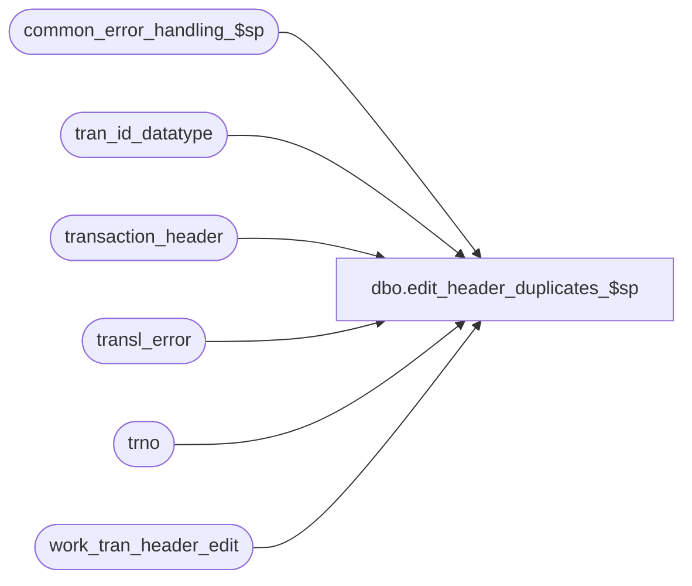

# dbo.edit_header_duplicates_$sp

**Database:** auditworks_external  
**Server:** bedrockdb01  

## Architecture Diagram



## Table Dependencies

| Referenced Table |
|---|
| common_error_handling_$sp |
| tran_id_datatype |
| transaction_header |
| transl_error |
| trno |
| work_tran_header_edit |

## Stored Procedure Code

```sql
create proc dbo.edit_header_duplicates_$sp 

@errmsg nvarchar(2000) OUTPUT,
@edit_progress_flag tinyint,
@edit_timestamp float,
@edit_process_no tinyint = 1

AS
/* Proc Name: edit_header_duplicates_$sp
   Desc: EDIT - Handles a timing issue in multistream edit since edit_header_$sp aleady detects duplicate transactions.
		Avoids duplicate error when the same tran exists in more than one batch and the batches are getting 
		edited at the same time. We don't need to delete from all of the 15 detail tables
		since the inserts to most of the detail tables join to work_tran_header_edit.
   Called by edit_header_$sp.

HISTORY
Date     Name           Def# Desc
Dec05,14 Paul          94103 use try catch
Nov03,11 PaulS        130914 prevent dup on insert error in edit_header_$sp when lookup_tran series is not null
Apr28,05 Paul        DV-1234 expand transaction_id to use tran_id_datatype
Dec13,04 Maryam      DV-1191 Improve performance.
Apr24,03 Paul        1-KO2HY populate till_no
Feb24,02 ShuZ        1-IVZSB Decrease the value of i_transl_error_msg less than 100 characters
Apr25,02 Sab         1-CMNA9 Prevent duplicate error in header when processing identical transactions for multistream edit
Mar22,02 Paul        1-BUVZ9 remove join to transl_transaction_hdr
Nov26,01 Winnie      1-969YY Add logic for R3 error handling to pass @edit_process_no to procedure
Nov06,01 Sab            8900 TRANSL edit changes for Sybase
Sep18,01 Paul           8726 use datetime for @entry_date_time
May07,01 Sab            7600 Multistream mod to remove duplicate rows since data exists for both streams
*/

DECLARE @cursor_open		int,
	@entry_date_time		datetime,
	@errmsg2			nvarchar(2000),
	@errline			int,
	@errno			int,
	@register_no		smallint,
	@retry			tinyint,
	@rows			int,
	@store_no		int,
	@transaction_no		trno,
	@transaction_id		tran_id_datatype,
	@transaction_series	char(1),
	@transl_error_msg 	nvarchar(100),
	@message_id		int,	
	@object_name		nvarchar(255),	
	@operation_name		nvarchar(100),
	@process_name		nvarchar(100);  	
	

SELECT @cursor_open = 0,
       @process_name = 'edit_header_duplicates_$sp',
       @message_id = 201068,
       @retry = 1;

BEGIN TRY

/* If no duplicates can be seen, then wait for the commit by the other stream */

    SELECT @errmsg         = 'Failed to select from transaction_header',
           @object_name    = 'transaction_header',
           @operation_name = 'SELECT';
     
WHILE @retry <= 5
BEGIN
   IF EXISTS (SELECT wh.transaction_id
		FROM work_tran_header_edit wh WITH (NOLOCK), transaction_header th WITH (NOLOCK)
	       WHERE th.transaction_date = wh.transaction_date
		 AND th.store_no = wh.store_no
		 AND th.register_no = wh.register_no
		 AND th.entry_date_time = wh.entry_date_time
		 AND th.transaction_no = wh.transaction_no
		 AND ISNULL(wh.lookup_transaction_series, wh.transaction_series) = th.transaction_series
		 AND th.date_reject_id = wh.date_reject_id)
	BREAK;

   WAITFOR DELAY '0:0:02'; -- 2 seconds
   SELECT @retry = @retry + 1;   
END;

    SELECT @errmsg         = 'Failed to open cursor dup_header_crsr',
           @object_name    = 'dup_header_crsr',
           @operation_name = 'OPEN';
DECLARE dup_header_crsr CURSOR FAST_FORWARD
FOR
SELECT wh.transaction_id,
	wh.store_no,
	wh.register_no,
	wh.entry_date_time,
	wh.transaction_series,
	wh.transaction_no
  FROM work_tran_header_edit wh WITH (NOLOCK), transaction_header th WITH (NOLOCK)
 WHERE th.transaction_date = wh.transaction_date
   AND th.store_no = wh.store_no
   AND th.register_no = wh.register_no
   AND th.entry_date_time = wh.entry_date_time
   AND th.transaction_no = wh.transaction_no
   AND ISNULL(wh.lookup_transaction_series, wh.transaction_series) = th.transaction_series
   AND th.date_reject_id = wh.date_reject_id;

OPEN dup_header_crsr;
SELECT @cursor_open = 1,
  @transl_error_msg = 'Duplicate transactions exist for both edit streams. Only one of them will be processed.';

/* Delete all except first ocurrence of each duplicate transaction.
   No need to use transaction control because an abort will cause a cleanup of all details for the batch. */

WHILE 1=1
BEGIN

  FETCH dup_header_crsr INTO
	@transaction_id,
	@store_no,
	@register_no,
	@entry_date_time,
	@transaction_series,
	@transaction_no;

  IF @@fetch_status <> 0
    BREAK;

    SELECT @errmsg         = 'Failed to delete work_tran_header_edit',
           @object_name    = 'work_tran_header_edit',
           @operation_name = 'DELETE';
  DELETE work_tran_header_edit
   WHERE store_no = @store_no
     AND register_no = @register_no
     AND entry_date_time = @entry_date_time
     AND transaction_no = @transaction_no
     AND transaction_series = @transaction_series;

    SELECT @errmsg         = 'Failed to insert transl_error',
           @object_name    = 'transl_error',
           @operation_name = 'INSERT';
  INSERT INTO transl_error (
		store_no,
		register_no,
		entry_date_time,
		transaction_series,
		transaction_no,
		line_id,
		transl_reject_reason,
		output_file_code,
		posting_end_date_time,
		transl_error_msg)
	VALUES (@store_no,
		@register_no,
		@entry_date_time,
		@transaction_series,
		@transaction_no,
		0,
		2601,
		'H',
		getdate(),
		@transl_error_msg);

END; /* While 1=1 */

CLOSE dup_header_crsr;
DEALLOCATE dup_header_crsr;
SELECT @cursor_open = 0;

  SELECT @errmsg = 'Failed to INSERT transaction_header (recovery)',
         @object_name = 'transaction_header',
         @operation_name = 'INSERT';
INSERT transaction_header (
	store_no,
	register_no,
	transaction_date,
	date_reject_id,
	transaction_series,
	transaction_no,
	entry_date_time,
	cashier_no,
	transaction_category,
	transaction_void_flag,
	sa_rejection_flag,
	deposit_declaration_flag,
	closeout_flag,
	tax_override_flag,
	pos_tax_jurisdiction,
	edit_progress_flag,
	edit_timestamp, 
	employee_no,
	transaction_remark,
	till_no  )
SELECT
	store_no,
	register_no,
	transaction_date,
	date_reject_id,
	transaction_series,
	transaction_no,
	entry_date_time,
	cashier_no,
	transaction_category,
	transaction_void_flag,
	sa_rejection_flag,
	deposit_declaration_flag,
	closeout_flag,
	0, --tax_override_flag
	ISNULL(pos_tax_jurisdiction, '     '),
	@edit_progress_flag,
	@edit_timestamp, 
	employee_no,
	transaction_remark,
	till_no 
  FROM work_tran_header_edit WITH (NOLOCK);


RETURN;

	
business_error:   /* Business Rule handler. */

	SELECT @errmsg2 = @errmsg;

	EXEC common_error_handling_$sp 4, @errno, @errmsg, 0, @message_id, 
	@process_name, @object_name, @operation_name, 1, @edit_process_no;
	  /* Note: when the exec above raises an error, that action also fires the system error trap (below) */
	RETURN;
END TRY

BEGIN CATCH; -- trap system errors
    /* common error handling. Appending proc name here because a rollback could occur if called within a transaction. */

        SELECT @errno = ERROR_NUMBER(),
		@errline = ERROR_LINE();

        SELECT @errmsg = CONVERT(nvarchar, @errno) + ':' + @process_name + ':' + CONVERT(nvarchar, @errline) + ':'
               + COALESCE(@errmsg, ' ') + ':' + ERROR_MESSAGE();

	 /* this condition will only be true when raise error in traps above fire this general catch */
	IF @errmsg2 IS NOT NULL
	  SELECT @errmsg = @errmsg2;

	IF @cursor_open = 1
	BEGIN
	  CLOSE dup_header_crsr;
	  DEALLOCATE dup_header_crsr;
	END;

	EXEC common_error_handling_$sp 4, @errno, @errmsg, 0, @message_id, 
	@process_name, @object_name, @operation_name, 1, @edit_process_no;

	RETURN;
END CATCH;
```

