# dbo.edit_interfaces_$sp

**Database:** auditworks_external  
**Server:** bedrockdb01  

## Architecture Diagram

```mermaid
flowchart LR
    SP["dbo.edit_interfaces_$sp"]
    Ex_Queue(["Ex_Queue"]) --> SP
    common_error_handling__sp(["common_error_handling_$sp"]) --> SP
    corrected_upc_detail(["corrected_upc_detail"]) --> SP
    edit_status(["edit_status"]) --> SP
    if_authorization_detail(["if_authorization_detail"]) --> SP
    if_customer(["if_customer"]) --> SP
    if_customer_detail(["if_customer_detail"]) --> SP
    if_discount_detail(["if_discount_detail"]) --> SP
    if_interface_control_deadlock(["if_interface_control_deadlock"]) --> SP
    if_line_note(["if_line_note"]) --> SP
    if_merchandise_detail(["if_merchandise_detail"]) --> SP
    if_payroll_detail(["if_payroll_detail"]) --> SP
    if_post_void_detail(["if_post_void_detail"]) --> SP
    if_rejection_applicability(["if_rejection_applicability"]) --> SP
    if_rejection_reason(["if_rejection_reason"]) --> SP
    if_rejection_rule(["if_rejection_rule"]) --> SP
    if_return_detail(["if_return_detail"]) --> SP
    if_special_order_detail(["if_special_order_detail"]) --> SP
    if_stock_control_detail(["if_stock_control_detail"]) --> SP
    if_tax_detail(["if_tax_detail"]) --> SP
    if_tax_override_detail(["if_tax_override_detail"]) --> SP
    if_transaction_header(["if_transaction_header"]) --> SP
    if_transaction_line(["if_transaction_line"]) --> SP
    if_transaction_line_link(["if_transaction_line_link"]) --> SP
    interface_applicability(["interface_applicability"]) --> SP
    interface_applicability_mass(["interface_applicability_mass"]) --> SP
    interface_control(["interface_control"]) --> SP
    interface_directory(["interface_directory"]) --> SP
    interface_directory_lookup(["interface_directory_lookup"]) --> SP
    interface_status(["interface_status"]) --> SP
    parameter_general(["parameter_general"]) --> SP
    process_log(["process_log"]) --> SP
    settlement_service(["settlement_service"]) --> SP
    store_settlement_data(["store_settlement_data"]) --> SP
    tax_detail(["tax_detail"]) --> SP
    tax_override_detail(["tax_override_detail"]) --> SP
    transaction_header(["transaction_header"]) --> SP
    transaction_line(["transaction_line"]) --> SP
    transl_authorization_detail(["transl_authorization_detail"]) --> SP
    transl_customer(["transl_customer"]) --> SP
    transl_customer_detail(["transl_customer_detail"]) --> SP
    transl_discount_detail(["transl_discount_detail"]) --> SP
    transl_line_note(["transl_line_note"]) --> SP
    transl_payroll_detail(["transl_payroll_detail"]) --> SP
    transl_post_void_detail(["transl_post_void_detail"]) --> SP
    transl_return_detail(["transl_return_detail"]) --> SP
    transl_special_order_detail(["transl_special_order_detail"]) --> SP
    transl_stock_control_detail(["transl_stock_control_detail"]) --> SP
    transl_transaction_line(["transl_transaction_line"]) --> SP
    transl_transaction_line_link(["transl_transaction_line_link"]) --> SP
    work_interface_reject_edit(["work_interface_reject_edit"]) --> SP
    work_interfaces_edit(["work_interfaces_edit"]) --> SP
    work_merchandise_edit(["work_merchandise_edit"]) --> SP
    work_tran_header_edit(["work_tran_header_edit"]) --> SP
    work_upc_trail_edit(["work_upc_trail_edit"]) --> SP
```



## Table Dependencies

| Referenced Table |
|---|
| Ex_Queue |
| common_error_handling_$sp |
| corrected_upc_detail |
| edit_status |
| if_authorization_detail |
| if_customer |
| if_customer_detail |
| if_discount_detail |
| if_interface_control_deadlock |
| if_line_note |
| if_merchandise_detail |
| if_payroll_detail |
| if_post_void_detail |
| if_rejection_applicability |
| if_rejection_reason |
| if_rejection_rule |
| if_return_detail |
| if_special_order_detail |
| if_stock_control_detail |
| if_tax_detail |
| if_tax_override_detail |
| if_transaction_header |
| if_transaction_line |
| if_transaction_line_link |
| interface_applicability |
| interface_applicability_mass |
| interface_control |
| interface_directory |
| interface_directory_lookup |
| interface_status |
| parameter_general |
| process_log |
| settlement_service |
| store_settlement_data |
| tax_detail |
| tax_override_detail |
| transaction_header |
| transaction_line |
| transl_authorization_detail |
| transl_customer |
| transl_customer_detail |
| transl_discount_detail |
| transl_line_note |
| transl_payroll_detail |
| transl_post_void_detail |
| transl_return_detail |
| transl_special_order_detail |
| transl_stock_control_detail |
| transl_transaction_line |
| transl_transaction_line_link |
| work_interface_reject_edit |
| work_interfaces_edit |
| work_merchandise_edit |
| work_tran_header_edit |
| work_upc_trail_edit |

## Stored Procedure Code

```sql
create proc dbo.edit_interfaces_$sp 
@edit_timestamp 	float,
@edit_process_no 	tinyint = 1,
@errmsg 	 	nvarchar(2000) OUTPUT

AS

/*
NAME: edit_interfaces_$sp
DESCRIPTION:
	Updates preaudit interfaces and creates interface rejections when necessary (uses edit transl* tables).
	REMINDER: Changes to this proc should be also applied to edit_interfaces_recovery_$sp.
	Called from edit_post_$sp.

HISTORY:
Date     Name        Def# Desc
May06,15 Vicci TFS-119009 Exclude host capture (settlement from POS) lines from being treated as applicable to S/A settlement interfaces.
Feb25,15 Paul    T-105255 populate new edit_stream_no column
Jul08,14 Vicci  TFS-74694 Log cost and don't log reject 116 if reject (1, 87, 88) already logged and all interfaces with 116 already have (1, 87, 88) on.
Feb27,14 Vicci      61711 Add if_tax_detail.applied_by_line_id.
Jan09,14 Paul      148739 Use try .. catch
Jul08,13 Vicci     139695 Add unit_of_measure logging.
Aug01,12 Vicci     137364 Set transaction_series in if_transaction_header to match that in transaction_header.
Aug25,11 Vicci     129334 Don't truncate work_interface_reject_edit until after the posting has been committed since it is required by the recovery in the event of an error.
                          Relocate interface_status update to after Ex_Queue to match sequence used by other procs such as cust liab edit 
                          and avoid deadlocks.
Dec14,10 Vicci     120654 Add tax_item_group_id, originating_date, fulfillment_store_no, above_threshold_flag fields.
Oct22,10 Vicci     121969 1-45F0P4 uplift. Copy authorization_detail.offline_flag to interfaces.
Apr29,10 Paul      117332 Improve performance by removing cursor
Jul21,09 Vicci     109078 Add track_tax field to copy.
Oct22,07 Paul       93924 enhancement to update interface_control for i/f rejects when applicability_method > 1
Sep06,07 Paul       91395 apply 90444 to SA5
Oct04,06 Paul       77922 apply 77740, 77650 to SA5
Aug01,05 Tim        69753 apply 70769 to SA5
Nov25,05 Paul     DV-1324 apply 63987 to SA5
Nov01,05 Paul       62153 apply 61728 to SA5
Oct19,05 Paul       62028 added comments
Sep09,05 Paul     DV-1312 apply 41740 to SA5
Apr29,05 David    DV-1202 Log source and fulfillment store, expand transaction_id to use tran_id_datatype,
				new i/f reject type 112 (Paul), Insert if_transaction_line_link, use line_id
Jan05,05 Maryam   DV-1191 Improve performance by replacing hardcoded check variables with joins and simplifying the cursor.
Sep23,04 David    DV-1146 Use user_id
Jun28,05 ShuZ     DV-1071 Add without_receipt_flag when populating return_detail tables.
Sep04,07 Vicci      90444 Don't log defaults for pos dept class unless upc lookup division is set.
Sep27,06 Vicci      77740 Include voided transaction lines if I/F wants voided transactions
Sep26,06 Vicci	    77650 Parameterize exporting all transactions with customer number to CRM 26
Apr12,06 Vicci      70769 For the CRM interfaces based on interface applicability, 
                          if the transaction category is not defined in interface 
                          applicability then don't feed the transaction to CRM.
Nov25,05 Vicci      63987 Do not truncate encrypted reference number upon insert to if_transaction_line
Oct27,05 David      61728 Use transl_transaction_line.encrypted_reference_no.
Dec02,04 Daphna     41740 Log additional txns for CIM (IF26), same as for CPS(IF3)
Mar05,04 Phu        18459 Set status only for interfaces to which transactions are fed.
Feb09,04 Phu        21459 Default values for pos_identifier_type, pos_deptclass, upc_lookup_division for consistency with stock_control_detail
Nov17,03 Phu        15801 Populate sku_id, reason, imrd, style_reference_id, display_def_id
Sep15,03 ShuZ     1-G7A5F Remove all references to the interface_directory '... _check' 
                         fields from stored procedures/triggers and replace with usage 
     of if_rejection_applicability table.
Apr23,03 Paul     1-KO2HY populate till_no
Dec19,02 Phu         5327 Retrieve gl_effect
Aug16,02 HenryW   1-AUHY5 Added 2 new system I/F reject reasons = 110 and 111.
		 	  To correctly handle interface entries where @live_date IS NULL.
Jul23,02 Paul     1-E7L7M populate key_11 in Ex_Queue with entry_date_time
Jun26,02 Paul     1-DS8TD insert tax_override_flag with zero
Apr25,02 Phu      1-C9P5S Create entry in if_tax_detail
Mar22,02 Paul     1-BUVZ9 use tender_total from work_tran_header_edit, remove join to transl
MAR12,02 Daphna   1-BM501 correct insert to if_merchandise_detail for calculated fields 
                          ie ticket_price = CONVERT(NUMERIC(12,4), gross_line_amount/units)    
Nov26,01 Winnie   1-969YY Add logic for R3 error handling to pass @edit_process_no
Nov01,01 ShuZ        8900 TRANSL edit changes for Sybase, insert cashier into corrected_upc_detail
Sep24,01 ShuZ        8288 Add an originating_store_no to the stock_control_detail table for use
                          when head-office(or another store) enters a transacion on behalf of
                          another store.(Maryam) delete work_interface_reject_edit where sa_rejection_flag = 1.
Aug10,01 Maryam      8283 Populate memo fields in if_rejection_reason table. combined
                          if_reject_reason 7 and 8.
Jul25,01 David C     8413 Add transaction_id to if_transaction_header
Jul06,01 Maryam      8170 Fix the error trap when inserting into interface_control.
Jun06,01 Phu         7214 Check for if_reject_reason 87, 88, 89, 90
May31,01 Winnie      8019 Log pos_deptclass and upc_lookup_division to if_stock_control_detail table	 
May29,01 Paul        8030 remove insert for interfaces on hold
May18,01 Paul        7817 correctly handle void lines and error recovery
May16,01 Shapoor     7813 Add column originating_store_no to merchandise* tables to attribute 
		                the sale/return to the store where the sale originated.
May04,01 Henry       7369 Allows user-defined IF rejection reasons.
Feb22,01 DavidM      7391 Add pos_identifier and pos_identifier_type fields to if_stock_control_detail table.
			           Also removed hold_until_live_date logic.
Feb14,01 Paul        7327 Allow updating audit trail when upc_no is zero and
				      sku lookup is not used.
Nov16,00 Paul        7005 Multistream edit: do not change interface_status flag to 1
          			 if edit phase2 is still running on another stream.
Nov09,00 Paul        6939 don't insert to audit trail when upc_no was zero
Oct03,00 Maryam      6782 log customer.pos_tax_jurisdiction_code, fax, and email_address.
Jul27,00 Paul        6557 seperate if's for employee check
Jun07,00 Daphna      4857 add new reference_no_check logic
Jun01,00 John G      5678 Break down employee_no_check into component parts.
May25,00 John G      5864 Change '= NULL' to 'IS NULL' where applicable to mirror Oracle.
Mar23,00 Daphna      6086 New OUTPUT parameter @_errmsg,  Delete SA reject txns from 
                          work_interface_reject_edit
Jan11,00 Paul        5789 Remove @@transtate logic
Jan01,00 Paul        5776 Insert directly to Ex_Queue instead of to if_interface_control
Dec23,99 Paul        5536 Avoid duplicate error when customer_info_check > 0
Dec10,99 Paul        5715 add employee check logic for applicability_method = 2
Jul08,99 Paul        4889 speed improvement when appli_meth = 2
Jun23,99 Paul        4880 avoid deadlocks with dayend
Jun22,99 Daphna F    4878 go to next cursor fetch only for appli-meth = 2 allow applic-meth 
                          = 1 or 0  to post rejects added logic for tax_default_check
May19,99 Paul        4681 move card verification to edit_post_$sp
May12,99 Paul        4678 post if reject for interfaces where applic_method = 1
Mar05,99 Paul            speed improvement
Sep01,98 Paul            Author (version 1.28)

*/

DECLARE
	@applicability_method		tinyint,
	@auto_upc_correction		tinyint,
	@errmsg2				nvarchar(2000),
	@errline				int,
	@errno				int,
	@if_id                          tinyint,
	@include_all_trans_with_cust	tinyint,
	@interface_voided_transactions	tinyint,
	@last_posting_datetime		datetime,
	@live_date			smalldatetime,
	@min_transaction_date		smalldatetime,
	@prev_edit_status		tinyint,
	@phase2_in_progress		tinyint,
	@process_end_time		datetime,
	@process_no			tinyint,
	@process_start_time		datetime,
	@process_status_flag		tinyint,
	@rows				int,
	@source_process_no		tinyint,
	@transaction_count		int,
	@update_timing			smallint,
	@user_id			int,
	@void_search_param		tinyint,
	@message_id			int,	
	@object_name			nvarchar(255),	
	@operation_name			nvarchar(100),
	@process_name			nvarchar(100),
	@cost_check			tinyint,
	@cost_val_without_upc_val	tinyint;  
	

SELECT @process_start_time = getdate(),
	@process_status_flag = 1,
	@user_id = NULL, -- system
	@transaction_count = 0,
	@source_process_no = 1,
	@phase2_in_progress = 0,
	@process_no = 2, /* edit - interfaces */
	@process_name = 'edit_interfaces_$sp',
	@message_id = 201068;

BEGIN TRY

   SELECT @errmsg = 'Failed to create temp table #cps_transaction_list.',
          @object_name = '#cps_transaction_list',
          @operation_name = 'CREATE TABLE';
CREATE TABLE #cps_transaction_list(transaction_id numeric(14,0) not null, -- tran_id_datatype
	                           store_no int not null,
	                           register_no smallint not null,
	                           entry_date_time datetime not null,
           	                   transaction_series nchar(1) not null,
           	                   transaction_no int not null);

   SELECT @errmsg = 'Failed to create temp table #edit_transaction_list.',
          @object_name = '#edit_transaction_list';	 
CREATE TABLE #edit_transaction_list(transaction_id numeric(14,0) not null); -- tran_id_datatype

   SELECT @errmsg = 'Failed to create temp table #edit_if_header.',
          @object_name = '#edit_if_header';
CREATE TABLE #edit_if_header(store_no int not null,
                             register_no smallint not null,
                             entry_date_time datetime not null,
                             transaction_series nchar(1) not null,
                             transaction_no int not null,
                             transaction_id numeric(14,0) not null, -- tran_id_datatype
                             if_entry_no numeric(14,0) not null, -- if_entry_datatype
                             transaction_date smalldatetime not null);   

   SELECT @errmsg = 'Failed to insert process_log.',
          @object_name = 'process_log',
          @operation_name = 'INSERT';
INSERT process_log ( process_no, 
	process_timestamp,
	process_start_time,
	process_end_time,
	process_status_flag,
	batch_process_id )
VALUES ( @process_no,
	@edit_timestamp,
	@process_start_time,
	@process_start_time,
	@process_status_flag,
	@edit_process_no );

SELECT @min_transaction_date = min_transaction_date, @auto_upc_correction = auto_upc_correction
  FROM parameter_general;

/* Don't create if rejects for void transactions or sa rejected transactions */
   SELECT @errmsg = 'Failed to delete work_interface_reject_edit (void transactions)',
          @object_name = 'work_interface_reject_edit',
          @operation_name = 'DELETE';
DELETE work_interface_reject_edit
  FROM work_interface_reject_edit ir, work_tran_header_edit wh WITH (NOLOCK)
 WHERE ir.transaction_id = wh.transaction_id
   AND ((transaction_void_flag >= 1 AND transaction_void_flag != 8 ) 
         OR sa_rejection_flag = 1 );

/* Don't create if rejects for void lines */
   SELECT @errmsg = 'Failed to delete work_interface_reject_edit (void lines)',
          @object_name = 'work_interface_reject_edit';
DELETE work_interface_reject_edit
  FROM work_interface_reject_edit ir, transl_transaction_line tl WITH (NOLOCK)
 WHERE ir.transaction_id = tl.transaction_id
   AND ir.line_id = tl.line_id
   AND line_void_flag >= 1;
  
   SELECT @errmsg = 'Failed to truncate work_interfaces_edit',
          @object_name = 'work_interfaces_edit',
          @operation_name = 'TRUNCATE';
TRUNCATE TABLE work_interfaces_edit;

-- Populate table work_interfaces_edit with a list of live interface - transaction_id combinations
/* mass insert interfaces with applicability_method = 0, exclude voids unless the I/F wants them */
SELECT @object_name = 'work_interfaces_edit',
       @operation_name = 'INSERT';
IF EXISTS (SELECT 1 FROM settlement_service ss, interface_directory i WHERE ss.interface_id = i.interface_id AND i.update_timing > 0 AND i.applicability_method = 0 AND (i.live_date IS NULL OR i.live_date <= getdate()))
BEGIN
  --Exclude host capture (settlement from POS) lines from being treated as applicable to S/A settlement interfaces.
  SELECT @errmsg = 'Failed to (mass) insert work_interfaces_edit with HostCapture exclusions for settlement. ';      
  INSERT work_interfaces_edit (
 	 transaction_id,
	 interface_id,
	 interface_status_flag,
	 applicability_method)
  SELECT DISTINCT wh.transaction_id,
 	 ia.interface_id,
	 ia.update_timing,
	 0
    FROM work_tran_header_edit wh WITH (NOLOCK)
         INNER JOIN transl_transaction_line tl WITH (NOLOCK)
           ON wh.transaction_no = tl.transaction_no
          AND wh.store_no = tl.store_no
          AND wh.register_no = tl.register_no
          AND wh.entry_date_time = tl.entry_date_time
          AND wh.transaction_series = tl.transaction_series
          AND tl.transaction_id IS NOT NULL --  
         INNER JOIN interface_applicability_mass ia
           ON tl.line_object = ia.line_object
          AND tl.line_action = ia.line_action
          AND tl.transaction_category = ia.transaction_category
         LEFT OUTER JOIN settlement_service ss
           ON ia.interface_id = ss.interface_id
         LEFT OUTER JOIN transl_authorization_detail ad
           ON tl.transaction_no = ad.transaction_no
          AND tl.store_no = ad.store_no
          AND tl.register_no = ad.register_no
          AND tl.entry_date_time = ad.entry_date_time
          AND tl.transaction_series = ad.transaction_series
          AND tl.line_id = ad.line_id
    WHERE wh.sa_rejection_flag = 0
      AND (ia.live_date IS NULL OR wh.transaction_date >= ia.live_date)
      AND (wh.transaction_void_flag IN (0,8) OR ia.interface_voided_transactions = 1)
      AND (tl.line_void_flag = 0 OR ia.interface_voided_transactions = 1)
      AND (ss.interface_id IS NULL OR COALESCE(ad.other_id, '-') <> 'HostCapture');
END
ELSE
BEGIN
  SELECT @errmsg = 'Failed to (mass) insert work_interfaces_edit';
  INSERT work_interfaces_edit (
	transaction_id,
	interface_id,
	interface_status_flag,
	applicability_method)
  SELECT DISTINCT wh.transaction_id,
	ia.interface_id,
	ia.update_timing,
	0
    FROM work_tran_header_edit wh WITH (NOLOCK),
     transl_transaction_line tl WITH (NOLOCK), interface_applicability_mass ia
    WHERE (wh.transaction_void_flag IN (0,8) OR ia.interface_voided_transactions = 1)
    AND wh.sa_rejection_flag = 0
    AND wh.transaction_no = tl.transaction_no
    AND wh.store_no = tl.store_no
    AND wh.register_no = tl.register_no
    AND wh.entry_date_time = tl.entry_date_time
    AND wh.transaction_series = tl.transaction_series
    AND tl.transaction_id IS NOT NULL --  
    AND (tl.line_void_flag = 0 OR ia.interface_voided_transactions = 1)
    AND tl.line_object = ia.line_object
    AND tl.line_action = ia.line_action
    AND tl.transaction_category = ia.transaction_category
    AND (ia.live_date IS NULL OR wh.transaction_date >= ia.live_date);
END;

/*    mass insert interfaces with applicability_method > 0
      always insert for interfaces with applicability_method = 1 (all transactions apply).
      applicability_method > 1 only needed for interfaces that require IF rej validation  */
  SELECT @errmsg = 'Failed to insert work_interfaces_edit (all transactions)',
         @object_name = 'work_interfaces_edit';
INSERT work_interfaces_edit (
	transaction_id,
	interface_id,
	interface_status_flag,
	applicability_method)
SELECT wt.transaction_id,
	id.interface_id,
	id.update_timing,
	id.applicability_method
   FROM work_tran_header_edit wt WITH (NOLOCK), interface_directory_lookup id
  WHERE id.update_timing >= 1
    AND id.applicability_method >= 1
    AND (wt.transaction_date >= id.live_date OR id.live_date IS NULL)
    AND wt.sa_rejection_flag = 0
    AND (wt.transaction_void_flag IN (0,8) OR id.interface_voided_transactions = 1)
    AND (id.applicability_method = 1 OR id.interface_id IN (SELECT DISTINCT interface_id FROM if_rejection_applicability));

/*{ look for transactions applicable to CPS(IF3) or CIM (IF26) which are not already flagged */

SELECT @if_id = 0;

SELECT @update_timing = update_timing,
       @live_date = live_date,
       @interface_voided_transactions = interface_voided_transactions,
       @if_id = 3,
       @applicability_method = applicability_method,
       @include_all_trans_with_cust = IsNull(include_all_trans_with_cust, 0)
  FROM interface_directory WITH (NOLOCK)
 WHERE interface_id = 3;

IF @@rowcount = 0 OR  @update_timing = 0
BEGIN
  SELECT @update_timing = update_timing,
         @live_date = live_date,
         @interface_voided_transactions = interface_voided_transactions,
         @if_id = 26,
         @applicability_method = applicability_method,
         @include_all_trans_with_cust = IsNull(include_all_trans_with_cust, 0)
    FROM interface_directory WITH (NOLOCK)
   WHERE interface_id = 26;
END;

IF @update_timing >= 1 AND @include_all_trans_with_cust = 1
BEGIN
  IF @live_date IS NULL --
    SELECT @live_date = @min_transaction_date;

  IF @interface_voided_transactions != 0
    SELECT @void_search_param = 0;
  ELSE
    SELECT @void_search_param = 1; 

     SELECT @errmsg = 'Failed to insert into temp table #cps_transaction_list',
          @object_name = '#cps_transaction_list',
            @operation_name = 'INSERT';
  INSERT INTO #cps_transaction_list
         (transaction_id, store_no, register_no, entry_date_time, transaction_series, transaction_no)
  SELECT transaction_id, store_no, register_no, entry_date_time, transaction_series, transaction_no 
    FROM work_tran_header_edit WITH (NOLOCK)
   WHERE customer_info_exists = 1
     AND sa_rejection_flag = 0
     AND transaction_date >= @live_date
     AND (transaction_void_flag IN (0,8) OR @void_search_param = 0)
 AND transaction_category IN (SELECT transaction_category
                                       FROM interface_applicability WITH (NOLOCK)
                                      WHERE interface_id = @if_id);

  /* ignore transactions that were already flagged by line_object */
     SELECT @errmsg = 'Failed to delete table #cps_transaction_list',
            @object_name = '#cps_transaction_list',
            @operation_name = 'DELETE';
  DELETE #cps_transaction_list
    FROM #cps_transaction_list cl, work_interfaces_edit iw WITH (NOLOCK)
   WHERE cl.transaction_id = iw.transaction_id
     AND iw.interface_id = @if_id;

     SELECT @errmsg = 'Failed to insert work_interfaces_edit',
            @object_name = 'work_interfaces_edit',
            @operation_name = 'INSERT';
  INSERT work_interfaces_edit (
	 transaction_id,
	 interface_id,
	 interface_status_flag,
	 applicability_method)
  SELECT DISTINCT cl.transaction_id,
	          @if_id,
	          @update_timing,
	          @applicability_method
    FROM #cps_transaction_list cl WITH (NOLOCK), transl_customer c WITH (NOLOCK)
   WHERE cl.transaction_no = c.transaction_no
     AND cl.store_no = c.store_no
     AND cl.register_no = c.register_no
     AND cl.entry_date_time = c.entry_date_time
   AND cl.transaction_series = c.transaction_series
     AND cl.transaction_id IS NOT NULL --  
     AND ( telephone_no1 IS NOT NULL -- 
           OR telephone_no2 IS NOT NULL -- 
          OR last_name IS NOT NULL -- 
           OR customer_no IS NOT NULL );

END; /* @update_timing >=1 */

/*} look for transactions applicable to CPS or CIM
    which are not already flagged */

/* check for invalid merchant id's when i/f rejection rule 112 is active */

IF EXISTS (SELECT 1 FROM if_rejection_applicability ia WITH (NOLOCK), interface_directory id WITH (NOLOCK)
            WHERE ia.if_reject_reason = 112
              AND ia.interface_id = id.interface_id
              AND id.update_timing > 0)
BEGIN
     SELECT @errmsg = 'Failed to create table #settlement_list',
            @object_name = '#settlement_list',
            @operation_name = 'CREATE';
  CREATE TABLE #settlement_list (
  store_no            int not null,
  transaction_date    smalldatetime not null,
  interface_id        smallint not null,
  reject_flag          tinyint not null);

     SELECT @errmsg = 'Failed to insert #settlement_list',
            @object_name = '#settlement_list',
            @operation_name = 'INSERT';
  INSERT #settlement_list (store_no, transaction_date, interface_id, reject_flag)
  SELECT DISTINCT wt.store_no, wt.transaction_date, we.interface_id, 1
    FROM work_tran_header_edit wt WITH (NOLOCK), work_interfaces_edit we WITH (NOLOCK)
   WHERE wt.transaction_id = we.transaction_id
     AND we.interface_id IN (SELECT interface_id FROM if_rejection_applicability WITH (NOLOCK)
            WHERE if_reject_reason = 112);

     SELECT @errmsg = 'Failed to set reject_flag',
            @object_name = '#settlement_list',
            @operation_name = 'UPDATE';
  UPDATE #settlement_list
    SET reject_flag = 0
    FROM #settlement_list sl, store_settlement_data sd WITH (NOLOCK)
   WHERE sl.store_no = sd.store_no
     AND sl.interface_id = sd.interface_id
     AND (sd.store_live_flag = 0 -- will be ignored by settlement
       OR (sd.store_live_flag > 0
           AND (sl.transaction_date < sd.store_live_date -- will be ignored by settlement
               OR (sd.store_merchant_id != '0'
                   AND (sd.store_live_date IS NULL OR sl.transaction_date >= sd.store_live_date)))));

  /* flag all transactions for each store as possible rejects when the settlement data is invalid */
     SELECT @errmsg = 'Failed to insert reject type 112',
            @object_name = 'work_interface_reject_edit',
            @operation_name = 'INSERT';
  INSERT work_interface_reject_edit (if_reject_reason, transaction_id, line_id)
  SELECT DISTINCT 112, wt.transaction_id, 0
    FROM #settlement_list sl WITH (NOLOCK), work_tran_header_edit wt WITH (NOLOCK)
   WHERE sl.reject_flag = 1
     AND sl.store_no = wt.store_no
     AND sl.transaction_date = wt.transaction_date;

  DROP TABLE #settlement_list;

END; -- If exists ... 112

/* flag those rejects which actually feed an interface that cares about them */
     SELECT @errmsg = 'Failed to set interface_affected_flag',
            @object_name = 'work_interface_reject_edit',
            @operation_name = 'UPDATE';
UPDATE work_interface_reject_edit
   SET interface_affected_flag = 1
  FROM work_interface_reject_edit wr,
       work_interfaces_edit we WITH (NOLOCK),
       if_rejection_applicability ir WITH (NOLOCK)
 WHERE wr.transaction_id = we.transaction_id
   AND we.interface_id = ir.interface_id
   AND wr.if_reject_reason = ir.if_reject_reason;
SELECT @rows = @@rowcount;

IF @rows > 0   -- some txns are affected by if rejects
BEGIN
     SELECT @errmsg = 'Failed to set interface_status_flag.',
            @object_name = 'work_interfaces_edit',
            @operation_name = 'UPDATE';
    UPDATE work_interfaces_edit
       SET interface_status_flag = 99
      FROM work_interfaces_edit we,
           work_interface_reject_edit wr WITH (NOLOCK),
  if_rejection_applicability ir WITH (NOLOCK)
    WHERE wr.transaction_id = we.transaction_id
       AND we.interface_id = ir.interface_id
       AND wr.if_reject_reason = ir.if_reject_reason
       AND wr.interface_affected_flag = 1;

  SELECT @errmsg = 'Failed to determine if cost validation is active. ',
         @object_name = 'if_rejection_applicability',
         @operation_name = 'SELECT';
  SELECT @cost_check = MIN(SIGN(cst.if_reject_reason)), @cost_val_without_upc_val = 1 - MIN(SIGN(COALESCE(upc.if_reject_reason, 0)))
    FROM if_rejection_rule ir
         INNER JOIN if_rejection_applicability cst WITH (NOLOCK)
                 ON ir.if_rejection_reason = cst.if_reject_reason
         INNER JOIN interface_directory i WITH (NOLOCK)
                 ON cst.interface_id = i.interface_id
                AND i.update_timing > 0
         LEFT OUTER JOIN if_rejection_applicability upc WITH (NOLOCK)
                 ON cst.interface_id = upc.interface_id
                AND upc.if_reject_reason IN (1, 87, 88)
   WHERE ir.if_rejection_reason = 116
     AND ISNULL(ir.active_rejection_rule,1) = 1;
     
  IF @cost_check IS NULL
  BEGIN
    SELECT @cost_check = 0, @cost_val_without_upc_val = 0;
  END;
  
  IF @cost_check = 1 AND @cost_val_without_upc_val = 0
  BEGIN
    SELECT @errmsg = 'Failed to remove Cost Unknown rejects from list of those to be logged when Not on File rejects already being logged. ',
           @object_name = 'work_interface_reject_edit',
           @operation_name = 'DELETE';
    DELETE work_interface_reject_edit
      FROM work_interface_reject_edit wr
     WHERE wr.if_reject_reason = 116
       AND EXISTS (SELECT 1
                     FROM work_interface_reject_edit upc
                    WHERE upc.if_reject_reason IN (1, 87, 88)
                      AND wr.transaction_id = upc.transaction_id
                      AND wr.line_id = upc.line_id);
  END;  --IF @cost_check = 1 AND @cost_val_without_upc_val = 0
END; --@rows > 0

/* Remove entries for applicability_method > 1 except for those where interfaces were affected by i/f rejects
   since they were only needed to log i/f rejections and must not be inserted to the Ex_Queue table.
   This also shrinks the work table.  */
     SELECT @errmsg = ' WHERE applicability_method > 1',
          @object_name = 'work_interfaces_edit',
           @operation_name = 'DELETE';
DELETE work_interfaces_edit
 WHERE applicability_method > 1
   AND interface_status_flag <> 99;   

/*{ create interface rejections */
   SELECT @errmsg = 'Failed to insert if_rejection_reason',
          @object_name = 'if_rejection_reason',
          @operation_name = 'INSERT';
INSERT if_rejection_reason (
       transaction_id,
       line_id,
       if_reject_reason,
       memo1,
       memo2,
       memo3 )
SELECT DISTINCT 
       transaction_id,
       line_id,
       if_reject_reason,
       memo1,
       memo2,
       memo3
  FROM work_interface_reject_edit WITH (NOLOCK)
 WHERE interface_affected_flag = 1;

SELECT @rows = @@rowcount;

IF @rows >= 1 /* if_rejections exist */
 BEGIN
     SELECT @errmsg = 'Failed to update transaction_header',
            @object_name = 'transaction_header',
            @operation_name = 'UPDATE';
  UPDATE transaction_header
     SET if_rejection_flag = 1
    FROM work_interface_reject_edit ir WITH (NOLOCK), transaction_header th
   WHERE interface_affected_flag = 1
     AND ir.transaction_id = th.transaction_id;

     SELECT @errmsg = 'Failed to update transaction_line',
            @object_name = 'transaction_line',
            @operation_name = 'UPDATE';
  UPDATE transaction_line
     SET interface_rejection_flag = 1
    FROM work_interface_reject_edit ir WITH (NOLOCK), transaction_line tl
   WHERE interface_affected_flag = 1
     AND ir.transaction_id = tl.transaction_id
     AND ir.line_id = tl.line_id;

 END; /* @rows >= 1 if_rejections exist */

/*} create interface rejections */
    SELECT @errmsg = 'Failed to insert interface_control',
           @object_name = 'interface_control',
           @operation_name = 'INSERT';
INSERT interface_control (
       transaction_id,
       interface_id,
       interface_status_flag )
SELECT transaction_id,
       interface_id,
       interface_status_flag
  FROM work_interfaces_edit WITH (NOLOCK);

/*{ update preaudit interfaces */

/* get list of transactions to be interfaced to preaudit interfaces */
   SELECT @errmsg = 'Failed to build temp table #edit_transaction_list',
          @object_name = '#edit_transaction_list',
          @operation_name = 'INSERT';
INSERT INTO #edit_transaction_list (transaction_id)
SELECT DISTINCT transaction_id
  FROM work_interfaces_edit iw WITH (NOLOCK)
 WHERE interface_status_flag = 1
 AND applicability_method <= 1;

SELECT @transaction_count = @@rowcount;

   SELECT @errmsg = 'Failed to insert if_transaction_header',
          @object_name = 'if_transaction_header',
          @operation_name = 'INSERT';
INSERT if_transaction_header (
	store_no,
	register_no,
	transaction_date,
	date_reject_id,
	transaction_series,
	transaction_no,
	entry_date_time,
	cashier_no,
	transaction_category,
	tender_total,
	transaction_void_flag,
	customer_info_exists,
	exception_flag,
	deposit_declaration_flag,
	closeout_flag,
	media_count_flag,
	customer_modified_flag,
	tax_override_flag,
	pos_tax_jurisdiction,
	source_process_no,
	edit_timestamp, 
	employee_no,
	transaction_remark,
	transaction_id,
	till_no,
	edit_stream_no )
SELECT
	wh.store_no,
	wh.register_no,
	wh.transaction_date,
	wh.date_reject_id,
	wh.lookup_transaction_series,
	wh.transaction_no,
	wh.entry_date_time,
	wh.cashier_no,
	wh.transaction_category,
	wh.tender_total,
	transaction_void_flag,
	customer_info_exists,
	0,--exception_flag,
	deposit_declaration_flag,
	wh.closeout_flag,
	ISNULL(wh.media_count_flag,0),
	0,--customer_modified_flag,
	0, --tax_overrride_flag
	ISNULL(wh.pos_tax_jurisdiction,'  '),
	@source_process_no,
	@edit_timestamp, 
	wh.employee_no,
	wh.transaction_remark,
	wh.transaction_id,
	wh.till_no,
	@edit_process_no
   FROM #edit_transaction_list e WITH (NOLOCK), work_tran_header_edit wh WITH (NOLOCK)
  WHERE e.transaction_id = wh.transaction_id
    AND wh.transaction_id IS NOT NULL;   

/* Determine if_entry_no for interface headers just inserted. transaction_id can never
   be null in the temp table */
   SELECT @errmsg = 'Failed to insert into temp table #edit_if_header',
          @object_name = '#edit_if_header',
          @operation_name = 'INSERT';
INSERT INTO #edit_if_header
       (store_no, register_no, entry_date_time, transaction_series, transaction_no, 
       transaction_id, if_entry_no, transaction_date)
SELECT wh.store_no, wh.register_no, wh.entry_date_time, 
       wh.transaction_series, --needs to remain original one since transl_ tables have not been updated and will be retrieved further down
       wh.transaction_no,
       wh.transaction_id, ith.if_entry_no, wh.transaction_date
  FROM work_tran_header_edit wh WITH (NOLOCK), if_transaction_header ith WITH (NOLOCK)
 WHERE wh.sa_rejection_flag = 0
   AND wh.transaction_no = ith.transaction_no
   AND wh.store_no = ith.store_no
   AND wh.register_no = ith.register_no
   AND wh.transaction_date = ith.transaction_date
   AND wh.entry_date_time = ith.entry_date_time
   AND wh.lookup_transaction_series = ith.transaction_series
   AND ith.edit_timestamp = @edit_timestamp
   AND wh.transaction_id IS NOT NULL;     

/*{ create interface details */
   SELECT @errmsg = 'Failed to insert if_authorization_detail',
          @object_name = 'if_authorization_detail',
          @operation_name = 'INSERT';
INSERT if_authorization_detail (
	if_entry_no,
	line_id,
	card_type,
	authorization_no,
	expiry_date,
	swipe_indicator,
	approval_message,
	license_no,
	pos_state_code,
	other_id_type,
	other_id,
	deferred_billing_date,
	deferred_billing_plan,
	customer_signature_obtained,
	offline_flag )
SELECT
	if_entry_no,
	line_id,
	card_type,
	authorization_no,
	expiry_date,
	swipe_indicator,
	approval_message,
	license_no,
	pos_state_code,
	other_id_type,
	other_id,
	deferred_billing_date,
	deferred_billing_plan,
	customer_signature_obtained,
	offline_flag 
FROM #edit_if_header ih WITH (NOLOCK), transl_authorization_detail ad WITH (NOLOCK)
  WHERE ih.transaction_no = ad.transaction_no
    AND ih.store_no = ad.store_no
    AND ih.register_no = ad.register_no
    AND ih.entry_date_time = ad.entry_date_time
    AND ih.transaction_series = ad.transaction_series;

   SELECT @errmsg = 'Failed to insert if_customer',
          @object_name = 'if_customer',
          @operation_name = 'INSERT';
INSERT if_customer (
	if_entry_no,
	line_id,
	customer_role,
	title,
	first_name,
	last_name,
	address_1,
	address_2,
	city,
	county,
	state,
	country,
	post_code,
	telephone_no1,
	telephone_no2,
	customer_no,
	pos_tax_jurisdiction_code, 
	fax,
	email_address)
SELECT
	if_entry_no,
	line_id,
	customer_role,
	title,
	first_name,
	last_name,
	address_1,
	address_2,
	city,
	county,
	state,
	country,
	post_code,
	telephone_no1,
	telephone_no2,
	customer_no,
	pos_tax_jurisdiction_code, 
	fax,
	email_address
  FROM #edit_if_header ih WITH (NOLOCK), transl_customer cu WITH (NOLOCK)
  WHERE ih.transaction_no = cu.transaction_no
    AND ih.store_no = cu.store_no
    AND ih.register_no = cu.register_no
    AND ih.entry_date_time = cu.entry_date_time
    AND ih.transaction_series = cu.transaction_series;

   SELECT @errmsg = 'Failed to insert if_customer_detail',
          @object_name = 'if_customer_detail',
          @operation_name = 'INSERT';
INSERT if_customer_detail (
	if_entry_no,
	line_id,
	customer_role,
	customer_info_type,
	customer_info )
SELECT
	if_entry_no,
	line_id,
	customer_role,
	customer_info_type,
	customer_info
  FROM #edit_if_header ih WITH (NOLOCK), transl_customer_detail cd WITH (NOLOCK)
  WHERE  ih.transaction_no = cd.transaction_no
    AND ih.store_no = cd.store_no
    AND ih.register_no = cd.register_no
    AND ih.entry_date_time = cd.entry_date_time
    AND ih.transaction_series = cd.transaction_series;

   SELECT @errmsg = 'Failed to insert if_discount_detail',
       @object_name = 'if_discount_detail',
          @operation_name = 'INSERT';
INSERT if_discount_detail (
	if_entry_no,
	line_id,
	applied_by_line_id,
	pos_discount_level,
	pos_discount_type,
	pos_discount_amount,
	applied_flag,
	pos_discount_serial_no )
SELECT
	if_entry_no,
	line_id,
	applied_by_line_id,
	pos_discount_level,
	pos_discount_type,
        ABS(pos_discount_amount-pos_discount_amount_adj) * discount_amount_sign,
	ISNULL(applied_flag,0),
	pos_discount_serial_no
  FROM #edit_if_header ih WITH (NOLOCK), transl_discount_detail dd WITH (NOLOCK)
  WHERE ih.transaction_no = dd.transaction_no
   AND ih.store_no = dd.store_no
    AND ih.register_no = dd.register_no
    AND ih.entry_date_time = dd.entry_date_time
    AND ih.transaction_series = dd.transaction_series;

   SELECT @errmsg = 'Failed to insert if_line_note',
          @object_name = 'if_line_note',
          @operation_name = 'INSERT';
INSERT if_line_note (
	if_entry_no,
	line_id,
	note_type,
	line_note )
SELECT 
	if_entry_no,
	line_id,
	note_type,
	line_note 
  FROM #edit_if_header ih WITH (NOLOCK), transl_line_note ln WITH (NOLOCK)
  WHERE ih.transaction_no = ln.transaction_no
    AND ih.store_no = ln.store_no
    AND ih.register_no = ln.register_no
    AND ih.entry_date_time = ln.entry_date_time
    AND ih.transaction_series = ln.transaction_series;

   SELECT @errmsg = 'Failed to insert if_merchandise_detail',
          @object_name = 'if_merchandise_detail',
          @operation_name = 'INSERT';
INSERT if_merchandise_detail (
	if_entry_no,
	line_id,
	merchandise_category,
	upc_lookup_division,
	upc_no,
	units,
	salesperson,
	salesperson2,
	sku_id,
	style_reference_id,
	class_code,
	subclass_code,
	price_override,
	pos_iplu_missing,
	upc_on_file_flag,
	pos_deptclass,
	ticket_price,
	sold_at_price,
	plu_price,
	scanned,
	pos_identifier,
	pos_identifier_type,
	originating_store_no,
	source_store_no,
	fulfillment_store_no,
	cost )
SELECT
	if_entry_no,
	line_id,
	merchandise_category,
	upc_lookup_division,
	upc_no,
	units,
	salesperson,
	salesperson2,
	sku_id,
	style_reference_id,
	class_code,
	subclass_code,
	price_override,
	pos_iplu_missing,
	upc_on_file_flag,
	pos_deptclass,
	CONVERT(NUMERIC(12,4),gross_line_amount / units),   -- DEF 1-BM501
	CONVERT(NUMERIC(12,4), net_line_amount / units),   -- DEF 1-BM501
	CONVERT(NUMERIC(12,4), plu_amount / units),   -- DEF 1-BM501
	scanned,
	pos_identifier,
	pos_identifier_type,
	originating_store_no,
	md.source_store_no,
	md.fulfillment_store_no,
	md.cost
  FROM #edit_if_header ih WITH (NOLOCK), work_merchandise_edit md WITH (NOLOCK)
  WHERE ih.transaction_no = md.transaction_no
    AND ih.store_no = md.store_no
    AND ih.register_no = md.register_no
    AND ih.entry_date_time = md.entry_date_time
    AND ih.transaction_series = md.transaction_series;

   SELECT @errmsg = 'Failed to insert if_payroll_detail',
          @object_name = 'if_payroll_detail',
          @operation_name = 'INSERT';
INSERT if_payroll_detail (
	if_entry_no,
	line_id,
	employee_no,
	payroll_date,
	employee_payroll_id,
	employee_type,
	payroll_entry_type )
SELECT
	if_entry_no,
	line_id,
	employee_no,
	payroll_date,
	employee_payroll_id,
	employee_type,
	payroll_entry_type
  FROM #edit_if_header ih WITH (NOLOCK), transl_payroll_detail pd WITH (NOLOCK)
  WHERE ih.transaction_no = pd.transaction_no
    AND ih.store_no = pd.store_no
    AND ih.register_no = pd.register_no
    AND ih.entry_date_time = pd.entry_date_time
    AND ih.transaction_series = pd.transaction_series;

   SELECT @errmsg = 'Failed to insert if_post_void_detail',
          @object_name = 'if_post_void_detail',
          @operation_name = 'INSERT';
INSERT if_post_void_detail (
	if_entry_no,
	line_id,
	post_voided_register,
	post_voided_trans_no,
	post_void_successful,
	post_void_reason_code )
SELECT
	if_entry_no,
	line_id,
	post_voided_register,
	post_voided_trans_no,
	post_void_successful,
	post_void_reason_code
  FROM #edit_if_header ih WITH (NOLOCK), transl_post_void_detail pv WITH (NOLOCK)
  WHERE ih.transaction_no = pv.transaction_no
    AND ih.store_no = pv.store_no
    AND ih.register_no = pv.register_no
    AND ih.entry_date_time = pv.entry_date_time
    AND ih.transaction_series = pv.transaction_series;

   SELECT @errmsg = 'Failed to insert if_return_detail',
          @object_name = 'if_return_detail',
          @operation_name = 'INSERT';
INSERT if_return_detail (
	if_entry_no,
	line_id,
	return_reason_message,
	return_reason_code,
	mdse_disposition_code,
	via_warehouse_flag,
	original_salesperson,
	original_salesperson2,
	return_from_store,
	return_from_reg,
	return_from_date,
	return_from_transno,
	without_receipt_flag )
SELECT
	if_entry_no,
	line_id,
	return_reason_message,
	return_reason_code,
	mdse_disposition_code,
	via_warehouse_flag,
	original_salesperson,
	original_salesperson2,
	return_from_store,
	return_from_reg,
	return_from_date,
	return_from_transno,
	without_receipt_flag
  FROM #edit_if_header ih WITH (NOLOCK), transl_return_detail rd WITH (NOLOCK)
  WHERE ih.transaction_no = rd.transaction_no
    AND ih.store_no = rd.store_no
    AND ih.register_no = rd.register_no
    AND ih.entry_date_time = rd.entry_date_time
    AND ih.transaction_series = rd.transaction_series;

   SELECT @errmsg = 'Failed to insert if_special_order_detail',
          @object_name = 'if_special_order_detail',
     @operation_name = 'INSERT';
INSERT if_special_order_detail (
	if_entry_no,
	line_id,
	units,
	salesperson,
	merchandise_description,
	expecting_delivery_on,
	color_description,
	size_description,
	width_description,
	vendor_name,
	vendor_style_description,
	spo_class_description,
	vendor_no )
SELECT
	if_entry_no,
	line_id,
	units,
	salesperson,
	merchandise_description,
	expecting_delivery_on,
	color_description,
	size_description,
	width_description,
	vendor_name,
	vendor_style_description,
	spo_class_description,
	vendor_no
  FROM #edit_if_header ih WITH (NOLOCK), transl_special_order_detail sd WITH (NOLOCK)
  WHERE ih.transaction_no = sd.transaction_no
    AND ih.store_no = sd.store_no
    AND ih.register_no = sd.register_no
    AND ih.entry_date_time = sd.entry_date_time
    AND ih.transaction_series = sd.transaction_series;

   SELECT @errmsg = 'Failed to insert if_stock_control_detail',
          @object_name = 'if_stock_control_detail',
          @operation_name = 'INSERT';
INSERT if_stock_control_detail (
	if_entry_no,
	line_id,
	upc_no,
	merchandise_key,
	initiated_by_host,
	units,
	other_store_no,
	location_no,
	vendor_no,
	count_date,
	pos_identifier,
	pos_identifier_type,
	pos_deptclass,
	upc_lookup_division,
	originating_store_no,
	display_def_id,
	sku_id,
	reason,
	imrd,
	style_reference_id)
SELECT
	if_entry_no,
	line_id,
	upc_no,
	merchandise_key,
	initiated_by_host,
	units,
	other_store_no,
	location_no,
	vendor_no,
	count_date,
	pos_identifier,
        CASE WHEN upc_lookup_division > 0 THEN ISNULL(pos_identifier_type,1) ELSE pos_identifier_type END,  --90444
        CASE WHEN upc_lookup_division > 0 THEN ISNULL(pos_deptclass, 0) ELSE pos_deptclass END,
        ISNULL(upc_lookup_division, 1),
	originating_store_no,
	display_def_id,
	sku_id,
	reason,
	imrd,
	style_reference_id
  FROM #edit_if_header ih WITH (NOLOCK), transl_stock_control_detail sc WITH (NOLOCK)
  WHERE ih.transaction_no = sc.transaction_no
    AND ih.store_no = sc.store_no
    AND ih.register_no = sc.register_no
    AND ih.entry_date_time = sc.entry_date_time
    AND ih.transaction_series = sc.transaction_series;

   SELECT @errmsg = 'Failed to insert if_transaction_line',
          @object_name = 'if_transaction_line',
       @operation_name = 'INSERT';
INSERT if_transaction_line (
	if_entry_no,
	line_id,
	line_sequence,
	line_object_type,
	line_object,
	line_action,
	gross_line_amount,
	pos_discount_amount,
	db_cr_none,
	attachment_qty,
	exception_flag,
	interface_rejection_flag,
	line_void_flag,
	voiding_reversal_flag,
	edit_timestamp,
	reference_type,
	reference_no,
	unit_of_measure )
SELECT
	if_entry_no,
	line_id,
	line_id * 100 + 50,
	ISNULL(line_object_type,0),
	line_object,
	line_action,
	gross_line_amount,
	pos_discount_amount,
	ISNULL(db_cr_none,0),
	attachment_qty,
	0,--exception_flag,
	ISNULL(interface_rejection_flag,0),
	line_void_flag,
	voiding_reversal_flag,
	@edit_timestamp,
	ISNULL(reference_type,0),
	ISNULL(tl.encrypted_reference_no,tl.reference_no),
	tl.unit_of_measure
  FROM #edit_if_header ih WITH (NOLOCK), transl_transaction_line tl WITH (NOLOCK)
  WHERE ih.transaction_no = tl.transaction_no
    AND ih.store_no = tl.store_no
    AND ih.register_no = tl.register_no
    AND ih.entry_date_time = tl.entry_date_time
    AND ih.transaction_series = tl.transaction_series
    AND tl.transaction_id IS NOT NULL;   

   SELECT @errmsg = 'Failed to insert if_tax_override_detail',
          @object_name = 'if_tax_override_detail',
          @operation_name = 'INSERT';
INSERT if_tax_override_detail (
	if_entry_no,
	line_id,
	tax_level,
	tax_category,
	taxable,
	exception_tax_jurisdiction,
	tax_exempt_no )
SELECT
	if_entry_no,
	line_id,
	tax_level,
	tax_category,
	taxable,
	SUBSTRING(exception_tax_jurisdiction,1,5),
	tax_exempt_no
   FROM #edit_if_header ih WITH (NOLOCK), tax_override_detail tod WITH (NOLOCK)
  WHERE ih.transaction_id = tod.transaction_id;

   SELECT @errmsg = 'Failed to insert if_tax_detail',
          @object_name = 'if_tax_detail',
          @operation_name = 'INSERT';
INSERT if_tax_detail (
	if_entry_no,
	line_id,
	tax_level,
	tax_jurisdiction,
	tax_category,
	tax_rate_code,
	taxable_amount,
	tax_amount,
	combined_rate,
	nontaxable_amount,
	tax_amount_expected,
	tax_on_tax_level,
	tax_on_combined_rate,
	line_object_type,
	tax_strip_flag,
	gl_effect,
	track_tax,
        tax_item_group_id,
        originating_date,
        fulfillment_store_no,  --store from which transfer of ownership passed to client
        above_threshold_flag,
        applied_by_line_id,
        max_applied_by_line_id  )
SELECT
	if_entry_no,
	line_id,
	tax_level,
	tax_jurisdiction,
	tax_category,
	tax_rate_code,
	taxable_amount,
	tax_amount,
	combined_rate,
	nontaxable_amount,
	tax_amount_expected,
	tax_on_tax_level,
	tax_on_combined_rate,
	line_object_type,
	tax_strip_flag,
	gl_effect,
	td.track_tax,
        td.tax_item_group_id,
        td.originating_date,
        td.fulfillment_store_no,  --store from which transfer of ownership passed to client
        td.above_threshold_flag,
        td.applied_by_line_id,
        td.max_applied_by_line_id  
   FROM #edit_if_header ih WITH (NOLOCK), tax_detail td WITH (NOLOCK)
  WHERE ih.transaction_id = td.transaction_id;

   SELECT @errmsg = 'Failed to insert if_transaction_line_link',
          @object_name = 'if_transaction_line_link',
          @operation_name = 'INSERT';
INSERT if_transaction_line_link (
	if_entry_no,
	line_id,
	linked_line_id)
SELECT
	if_entry_no,
	line_id,
	linked_line_id
FROM #edit_if_header ih WITH (NOLOCK), transl_transaction_line_link k WITH (NOLOCK)
  WHERE ih.transaction_no = k.transaction_no
    AND ih.store_no = k.store_no
    AND ih.register_no = k.register_no
    AND ih.entry_date_time = k.entry_date_time
    AND ih.transaction_series = k.transaction_series;


/*} create interface details */
BEGIN TRANSACTION;

IF @auto_upc_correction >= 1
  BEGIN
       SELECT @errmsg = 'Failed to insert corrected_upc_detail',
              @object_name = 'corrected_upc_detail',
              @operation_name = 'INSERT';
   INSERT corrected_upc_detail (
		transaction_date,
		store_no,
		register_no,
		date_reject_id,
		transaction_series,
		transaction_no,
		entry_date_time,
		salesperson, 
		before_upc_no, 
		after_upc_no,
		ticket_price,
		sold_at_price, 
     		last_modified_date_time,
		user_id,
		function_no,
		pos_identifier,
		pos_identifier_type,
		cashier_no )
   SELECT
		th.transaction_date,
		th.store_no,
		th.register_no,
		th.date_reject_id,
		th.lookup_transaction_series,
		th.transaction_no,
		th.entry_date_time,
		salesperson, 
		before_upc_no, 
		after_upc_no,
		gross_line_amount / units,
		net_line_amount / units, 
		wt.last_modified_date_time,
		@user_id,
		1,
		pos_identifier,
		pos_identifier_type,
		th.cashier_no
     FROM work_upc_trail_edit wt WITH (NOLOCK), work_tran_header_edit th WITH (NOLOCK), work_merchandise_edit md WITH (NOLOCK)
    WHERE wt.sku_lookup_flag > 0
      AND sa_rejection_flag = 0
      AND transaction_void_flag IN (0,8)
      AND wt.transaction_id = md.transaction_id
      AND wt.line_id = md.line_id
      AND md.transaction_id = th.transaction_id;
  END; /* If @auto_upc_correction >= 1 */

/*} update preaudit interfaces */

  IF @edit_process_no > 1 -- multistream
    BEGIN
     SELECT @phase2_in_progress = edit_status,
            @last_posting_datetime = last_posting_datetime
       FROM edit_status
      WHERE edit_function_no = 5
        AND edit_status = 1
        AND edit_process_no = 1; -- check stream 1 only

     /* If edit phase2 started more than 2 hours ago then allow updating interface_status */

     IF @phase2_in_progress = 1 AND DATEDIFF(hh,@last_posting_datetime,getdate()) > 2
       SELECT @phase2_in_progress = 0;

    END; -- if @edit_process_no > 1

     SELECT @errmsg = 'Failed to update edit_status',
            @object_name = 'edit_status',
            @operation_name = 'UPDATE';
  UPDATE edit_status
   SET edit_status = 0,
       edit_timestamp = @edit_timestamp
    WHERE edit_process_no = @edit_process_no
    AND edit_function_no = 2;

/* simulate table lock on Ex_Queue
   - reduces deadlocking with dayend_post_audit_$sp */
	SELECT @errmsg = 'Failed to update if_interface_control_deadlock',
               @object_name = 'if_interface_control_deadlock',
               @operation_name = 'UPDATE';
UPDATE if_interface_control_deadlock
   SET function_no = 1,
       status_date = getdate();

   SELECT @errmsg = 'Failed to insert Ex_Queue',
          @object_name = 'Ex_Queue',
          @operation_name = 'INSERT';    
INSERT Ex_Queue (
		queue_id, -- interface_id
    		key_1, --if_entry_no
		key_2, --interface_control_flag
		key_9, -- effective_date
		key_10, -- interface_posting_date
		key_11) -- entry_date_time
 SELECT interface_id,
	if_entry_no,
	10,
	transaction_date,
	getdate(),
	entry_date_time
  FROM #edit_if_header ih WITH (NOLOCK), work_interfaces_edit iw WITH (NOLOCK)
  WHERE ih.transaction_id = iw.transaction_id
    AND iw.interface_status_flag = 1
    AND iw.applicability_method <= 1;

IF @phase2_in_progress = 0
 BEGIN
    SELECT @errmsg = 'Failed to update interface_status',
           @object_name = 'interface_status',
           @operation_name = 'UPDATE';
  UPDATE interface_status
     SET posting_in_progress = 1,
	 last_posting_datetime = getdate()
   WHERE interface_id IN (SELECT DISTINCT iw.interface_id
                	    FROM work_interfaces_edit iw WITH (NOLOCK)
                           WHERE iw.interface_status_flag = 1
                             AND applicability_method <= 1);
 END; -- if @phase2_in_progress = 0

COMMIT TRANSACTION;

TRUNCATE TABLE work_interface_reject_edit;

SELECT @process_end_time = getdate(),
	@process_status_flag = 2;

UPDATE process_log
   SET process_end_time = @process_end_time,
     process_status_flag = @process_status_flag,
     transaction_count = @transaction_count         
   WHERE process_start_time = @process_start_time
     AND process_no = @process_no
     AND batch_process_id = @edit_process_no; 

RETURN;


business_error:   /* Business Rule handler. */

	SELECT @errmsg2 = @errmsg;

	/* Could include similar cleanup code to system error trap when needed (example is from move_store_$sp).
	   However, could also exclude the cleanup code here since the outer system error catch should fire again after the exec below. */

	EXEC common_error_handling_$sp 4, @errno, @errmsg, 0, @message_id, 
	  @process_name, @object_name, @operation_name, 1, @edit_process_no;
	  /* Note: when the exec above raises an error, that action also fires the system error trap (below) */
	RETURN;
END TRY

BEGIN CATCH; -- trap system errors
    /* common error handling. Appending proc name here because a rollback could occur if called within a transaction. */

        SELECT @errno = ERROR_NUMBER(),
		@errline = ERROR_LINE();

        SELECT @errmsg = CONVERT(nvarchar, @errno) + ':' + @process_name + ':' + CONVERT(nvarchar, @errline) + ':'
               + COALESCE(@errmsg, ' ') + ':' + ERROR_MESSAGE();

	 /* this condition will only be true when raise error in traps above fire this general catch */
	IF @errmsg2 IS NOT NULL
	  SELECT @errmsg = @errmsg2;

	EXEC common_error_handling_$sp 4, @errno, @errmsg, 0, @message_id, 
	  @process_name, @object_name, @operation_name, 1, @edit_process_no;

	RETURN;
END CATCH;
```

