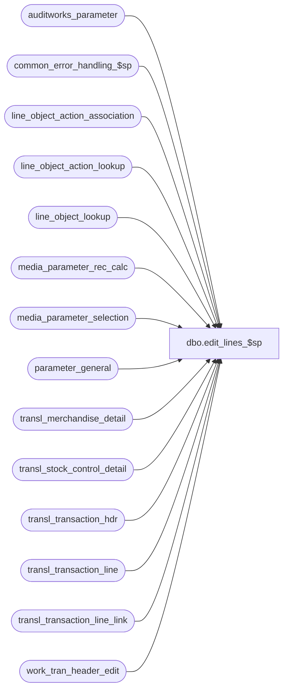

# dbo.edit_lines_$sp

**Database:** auditworks_external  
**Server:** bedrockdb01  

## Architecture Diagram



## Table Dependencies

| Referenced Table |
|---|
| auditworks_parameter |
| common_error_handling_$sp |
| line_object_action_association |
| line_object_action_lookup |
| line_object_lookup |
| media_parameter_rec_calc |
| media_parameter_selection |
| parameter_general |
| transl_merchandise_detail |
| transl_stock_control_detail |
| transl_transaction_hdr |
| transl_transaction_line |
| transl_transaction_line_link |
| work_tran_header_edit |

## Stored Procedure Code

```sql
create proc dbo.edit_lines_$sp 
  @errmsg          nvarchar(2000) OUTPUT,
  @edit_process_no tinyint = 1

AS

/* Description: build transaction lines.
    pos_discount_amount (from translate) is used for adjustments to gross_line_amount.
    pos_discount_amount in transaction_line is overlaid by edit_discount_detail_$sp.
   Called by edit_post_$sp.
   
   Note: Any change in logic for line object lookup should be reflected in mass_correct_line_object_$sp.

HISTORY
Date     Name           Def# Desc
Dec16,14 Paul      TFS-94103 use try catch
Aug27,14 Vicci     TFS-82676 Treat NULL lookup_pos_code as blank.
Jul08,13 Vicci        139695 Add unit_of_measure logging.
Nov15,12 Paul       1-49VRSA add missing error trap, use coalesce
Nov19,10 Vicci        122171 Correct lookup of type UPC to also function when product ID is found in POS Identifier.
Feb27,08 Vicci         98715 Uplift 1-3XLBPR to SA5 (Parameterize sequence of replacement line-object lookups).
Oct25,06 Phu           77931 Fix outer join for SQL 2005 Mode 90.
Jun21,05 Paul        DV-1282 moved return logic to edit_return_detail_$sp to improve performance when no returns exist
May19,05 David       DV-1263 Move lookup based on employee purchase down.
Apr29,05 David       DV-1202 Allow lookup line object action based on employee purchase, expand transaction_id to use tran_id_datatype (Paul)
Mar21,05 Maryam      DV-1202 Handle the indirect association via line links. Set discount_reversal_flag
Mar03,05 David       DV-1202 Log transl_transaction_line.auto_config_verified and check for LOAA.active_flag.
Dec13,04 Maryam      DV-1191 Improve performance.
Oct28,04 David       DV-1159 Check for ORG_CHN active flag. 
Aug23,04 Sab	     DV-1120 Remove local variable @aplctn_id and aplctn_id in auditwork_parameter since we hardcode aplctn_id to 300.
Aug06,04 Maryam      DV-1071 Remove the reference to media_parameter table.
May17,04 David       DV-1071 Use ORG_CHN table
Feb27,08 Vicci      1-3XLBPR Parameterize sequence of replacement line-object lookups.
Jan15,03 Maryam        21534 Continue to support disallowing negative counts/deposits in Ash media rec,
				avoid selecting into temp table to reduce contention
Mar21,03 ShuZ        1-JFTZE Include pos_discount_amount in the calculation of gross_line_amount in edit_lines_$sp 
Oct23,02 Winnie	     AW-8936 allow lookup line object action base on UPC and pos_deptclass.
Mar22,02 Paul        1-BUVZ9 corrected error message
Feb11,02 Henry	     1-AXV61 Do not set lookup_store if return_from_store doesn't exist. Add join to store_salesaudit.
Nov26,01 Winnie	     1-969YY Add logic for R3 error handling to pass @edit_process_no
11/27/01 David M	8885 Changed calculation of gross_line_amount to not use pos_discount_amount
			     since it should only be used to calculate net amount.
11/09/01 Sab		8900 TRANSL edit changes for Sybase
05/08/01 Maryam         6465 Correctly replace the tax line_object in the case of a return from
                             a different store.
06/15/00 Paul		6347 speed improvement to defects 6060 and 5890
05/15/00 Henry		6060 To allow negative counts/deposits or reset to 0.
03/01/00 Phu		5900 Change @@fetch_status > 0 to @@fetch_status <> 0 for MS SQL compatibility
02/15/00 Henry		5907 Corrected code, to allow line_object_lookup on (line_object+line_object_adjustment)
01/26/00 Louise		5890 Added lookup on new table department_rollout_lookup which is used 
			if parameter department_rollout_lookup_flag is turned on.
Jan06,99 Paul
Nov18,96 Paul		author

*/

DECLARE @errno			int,
	@errmsg2			nvarchar(2000),
	@errline			int,
	@rows			int,
	@message_id		int,	
	@object_name		nvarchar(255),	
	@operation_name		nvarchar(100),
	@process_name		nvarchar(100),
	@object_action_lookup_first smallint;

SELECT 	@process_name = 'edit_lines_$sp',
        @message_id = 201068,
        @object_action_lookup_first = 0;

BEGIN TRY

IF EXISTS (SELECT 1
FROM auditworks_parameter
            WHERE par_name = 'object_action_lookup_first'
              AND par_value = '1')
  SELECT @object_action_lookup_first = 1;

SELECT @operation_name = 'UPDATE',
       @object_name = 'transl_transaction_line';

IF @object_action_lookup_first = 0
BEGIN
      SELECT @errmsg = 'Failed to update transl_transaction_line (line_object_adjustment)';
  UPDATE transl_transaction_line
  SET line_object = lol.line_object,
	    line_object_adjustment = 0
    FROM transl_transaction_line tl, line_object_lookup lol WITH (NOLOCK)
   WHERE (tl.line_object + tl.line_object_adjustment) = lol.lookup_line_object
     AND COALESCE(lookup_store,tl.store_no) = lol.store_no;
END;

/* If parameter object_action_lookup_flag is on, updates line_object and 
   line_action in transl_transaction_line with those found in 
   line_object_action_lookup table */

IF (SELECT object_action_lookup_flag 
      FROM parameter_general) != 0 
BEGIN
        SELECT @errmsg = 'Failed to update transl_transaction_line (line_object, line_action) via line_object_action_lookup table';
  UPDATE transl_transaction_line
     SET line_object = loal.line_object,
         line_action = loal.line_action,
         line_object_adjustment = 0,
         discount_reversal_flag = loal.discount_reversal_flag
    FROM transl_transaction_line tl,
         line_object_action_lookup loal WITH (NOLOCK)
   WHERE tl.line_action = loal.lookup_line_action
     AND tl.line_object = loal.lookup_line_object
     AND COALESCE(tl.lookup_pos_code, ' ') = loal.lookup_pos_code
     AND loal.lookup_code_type = 0; -- for pos lookup

  IF EXISTS (SELECT 1 
               FROM line_object_action_lookup
              WHERE lookup_code_type = 1)  -- for upc lookup
  BEGIN
        SELECT @errmsg = 'Failed to update transl_transaction_line (line_object,'+
                             ' line_action) via line_object_action_lookup table transl_merchandis_detail';
        UPDATE transl_transaction_line
          SET line_object = loal.line_object,
              line_action = loal.line_action,
              line_object_adjustment = 0,
              discount_reversal_flag = loal.discount_reversal_flag
          FROM transl_merchandise_detail ml WITH (NOLOCK),
               transl_transaction_line tl,
               line_object_action_lookup loal WITH (NOLOCK)
         WHERE tl.store_no = ml.store_no
           AND tl.register_no = ml.register_no
           AND tl.entry_date_time = ml.entry_date_time
           AND tl.transaction_no = ml.transaction_no
           AND tl.transaction_series = ml.transaction_series
           AND tl.line_id = ml.line_id
           AND tl.line_action = loal.lookup_line_action
           AND tl.line_object = loal.lookup_line_object
           AND loal.lookup_pos_code = CASE WHEN ml.upc_no <> 0 THEN CONVERT(nvarchar(20), ml.upc_no) ELSE ml.pos_identifier END
           AND loal.lookup_code_type = 1;

            SELECT @errmsg = 'Failed to update transl_transaction_line (line_object,'+
                             ' line_action) via line_object_action_lookup table transl_stock_control_detail';
        UPDATE transl_transaction_line
           SET line_object = loal.line_object,
               line_action = loal.line_action,
               line_object_adjustment = 0,
               discount_reversal_flag = loal.discount_reversal_flag
          FROM transl_stock_control_detail sl WITH (NOLOCK),
               transl_transaction_line tl,
               line_object_action_lookup loal WITH (NOLOCK)
         WHERE tl.store_no = sl.store_no
           AND tl.register_no = sl.register_no
           AND tl.entry_date_time = sl.entry_date_time
           AND tl.transaction_no = sl.transaction_no
           AND tl.transaction_series = sl.transaction_series
           AND tl.line_id = sl.line_id
           AND sl.upc_lookup_division > 0
           AND tl.line_action = loal.lookup_line_action
           AND tl.line_object = loal.lookup_line_object
	  AND loal.lookup_pos_code = CASE WHEN upc_no <> 0 THEN CONVERT(nvarchar(20), upc_no) ELSE pos_identifier END
           AND loal.lookup_code_type = 1;

            SELECT @errmsg = 'Failed to update transl_transaction_line (line_object'+
                             ' line_action) via line_object_action_lookup table transl_transaction_line_link';       
        UPDATE transl_transaction_line
           SET line_object = loal.line_object,
               line_action = loal.line_action,
               line_object_adjustment = 0,
               discount_reversal_flag = loal.discount_reversal_flag
          FROM transl_stock_control_detail sl WITH (NOLOCK),
               transl_transaction_line_link k WITH (NOLOCK),
               transl_transaction_line tl,
               line_object_action_lookup loal WITH (NOLOCK)
         WHERE tl.store_no = k.store_no
           AND tl.register_no = k.register_no
           AND tl.entry_date_time = k.entry_date_time
           AND tl.transaction_no = k.transaction_no
           AND tl.transaction_series = k.transaction_series
           AND tl.line_id = k.line_id
           AND k.store_no = sl.store_no
           AND k.register_no = sl.register_no
           AND k.entry_date_time = sl.entry_date_time
           AND k.transaction_no = sl.transaction_no
           AND k.transaction_series = sl.transaction_series
           AND k.linked_line_id = sl.line_id
           AND sl.upc_lookup_division > 0
           AND tl.line_action = loal.lookup_line_action
           AND tl.line_object = loal.lookup_line_object
	  AND loal.lookup_pos_code = CASE WHEN upc_no <> 0 THEN CONVERT(nvarchar(20), upc_no) ELSE pos_identifier END
           AND loal.lookup_code_type = 1;

  END; -- lookup_code_type = 1 for upc lookup

  IF EXISTS (SELECT 1 
               FROM line_object_action_lookup
              WHERE lookup_code_type = 2)  -- for pos_deptclass lookup
  BEGIN
            SELECT @errmsg = 'Failed to update transl_transaction_line (line_object,'+
               ' line_action) via line_object_action_lookup table transl_merchandis_detail';
        UPDATE transl_transaction_line
           SET line_object = loal.line_object,
               line_action = loal.line_action,
               line_object_adjustment = 0,
               discount_reversal_flag = loal.discount_reversal_flag
          FROM transl_merchandise_detail ml WITH (NOLOCK),
              transl_transaction_line tl,
               line_object_action_lookup loal WITH (NOLOCK)
         WHERE tl.store_no = ml.store_no
           AND tl.register_no = ml.register_no
           AND tl.entry_date_time = ml.entry_date_time
           AND tl.transaction_no = ml.transaction_no
           AND tl.transaction_series = ml.transaction_series
           AND tl.line_id = ml.line_id
           AND tl.line_action = loal.lookup_line_action
           AND tl.line_object = loal.lookup_line_object
           AND loal.lookup_pos_code = CONVERT(nvarchar(20), pos_deptclass)
           AND loal.lookup_code_type = 2;

            SELECT @errmsg = 'Failed to update transl_transaction_line (line_object,'+
                             ' line_action) via line_object_action_lookup table transl_stock_control_detail';
        UPDATE transl_transaction_line
           SET line_object = loal.line_object,
               line_action = loal.line_action,
               line_object_adjustment = 0,
               discount_reversal_flag = loal.discount_reversal_flag
          FROM transl_stock_control_detail sl WITH (NOLOCK),
               transl_transaction_line tl,
               line_object_action_lookup loal WITH (NOLOCK)
         WHERE tl.store_no = sl.store_no
           AND tl.register_no = sl.register_no
           AND tl.entry_date_time = sl.entry_date_time
           AND tl.transaction_no = sl.transaction_no
           AND tl.transaction_series = sl.transaction_series
           AND tl.line_id = sl.line_id
           AND sl.upc_lookup_division > 0
           AND tl.line_action = loal.lookup_line_action
           AND tl.line_object = loal.lookup_line_object
           AND loal.lookup_pos_code = CONVERT(nvarchar(20), pos_deptclass)
           AND loal.lookup_code_type = 2;

           SELECT @errmsg = 'Failed to to set line_object, line_action via line_object_action_lookup table transl_stock_control_detail';         
        UPDATE transl_transaction_line
           SET line_object = loal.line_object,
               line_action = loal.line_action,
               line_object_adjustment = 0,
               discount_reversal_flag = loal.discount_reversal_flag
          FROM transl_stock_control_detail sl WITH (NOLOCK),
               transl_transaction_line_link k WITH (NOLOCK),
               transl_transaction_line tl,
               line_object_action_lookup loal WITH (NOLOCK)
         WHERE tl.store_no = k.store_no
           AND tl.register_no = k.register_no
           AND tl.entry_date_time = k.entry_date_time
           AND tl.transaction_no = k.transaction_no
           AND tl.transaction_series = k.transaction_series
           AND tl.line_id = k.line_id
           AND k.store_no = sl.store_no
           AND k.register_no = sl.register_no
           AND k.entry_date_time = sl.entry_date_time
           AND k.transaction_no = sl.transaction_no
           AND k.transaction_series = sl.transaction_series
           AND k.linked_line_id = sl.line_id
           AND sl.upc_lookup_division > 0
           AND tl.line_action = loal.lookup_line_action
           AND tl.line_object = loal.lookup_line_object
           AND loal.lookup_pos_code = CONVERT(nvarchar(20), pos_deptclass)
           AND loal.lookup_code_type = 2;

  END; -- lookup_code_type = 2 for pos_deptclass lookup

        SELECT @errmsg = 'Failed to update transl_transaction_line (lookup_code_type 3)';
  UPDATE transl_transaction_line
     SET line_object = loal.line_object,
         line_action = loal.line_action,
         line_object_adjustment = 0,
         discount_reversal_flag = loal.discount_reversal_flag
    FROM transl_transaction_hdr th WITH (NOLOCK),
         transl_transaction_line tl,
         line_object_action_lookup loal WITH (NOLOCK)  
   WHERE loal.lookup_code_type = 3 -- employee purchase
     AND tl.line_action = loal.lookup_line_action
     AND tl.line_object = loal.lookup_line_object
     AND tl.store_no        = th.store_no
     AND tl.register_no        = th.register_no
     AND tl.entry_date_time    = th.entry_date_time
     AND tl.transaction_no     = th.transaction_no
     AND tl.transaction_series = th.transaction_series
     AND th.employee_no >= 0;

END; -- If object_action_lookup_flag != 0

IF @object_action_lookup_first = 1
BEGIN
      SELECT @errmsg = 'Failed to update transl_transaction_line (line_object_adjustment)';
  UPDATE transl_transaction_line
     SET line_object = lol.line_object,
         line_object_adjustment = 0
    FROM transl_transaction_line tl, line_object_lookup lol WITH (NOLOCK)
   WHERE (tl.line_object + tl.line_object_adjustment) = lol.lookup_line_object
     AND COALESCE(lookup_store,tl.store_no) = lol.store_no;
END;

/* If line_amount_divider = 0, set line_amount_divider = 1 */
      SELECT @errmsg = 'Failed to update transaction_id';
UPDATE transl_transaction_line
   SET transaction_id = wh.transaction_id,
	transaction_category = wh.transaction_category,
	line_object_type = COALESCE(la.line_object_type, 0),
	line_object = tl.line_object + line_object_adjustment,
	gross_line_amount = ROUND(((gross_line_amount - pos_discount_amount) * gross_line_amount_sign
		/ (line_amount_divider + (1 - ABS(SIGN(line_amount_divider)))) ),2),
	pos_discount_amount = 0,
	db_cr_none = COALESCE(la.db_cr_none, 0),
	reference_type = COALESCE(la.reference_type, 0),
	discountable_group = COALESCE(la.discountable_group, 0),
	reference_no = LTRIM(reference_no),
	auto_config_verified = la.auto_config_verified,
	unit_of_measure = la.unit_of_measure
   FROM work_tran_header_edit wh WITH (NOLOCK)
        INNER JOIN transl_transaction_line tl ON (wh.store_no = tl.store_no
                                                  AND wh.register_no = tl.register_no
                                                  AND wh.entry_date_time = tl.entry_date_time
                                                  AND wh.transaction_series = tl.transaction_series
                                                  AND wh.transaction_no = tl.transaction_no)
        LEFT JOIN line_object_action_association la WITH (NOLOCK) ON ((tl.line_object + line_object_adjustment) = la.line_object
                                                                      AND tl.line_action = la.line_action
                                                                      AND wh.transaction_category = la.transaction_category
                                                                      AND la.active_flag = 1);

/* could possibly add a case statement to the above to prevent aborting the edit batch due to arithmetic overflows
CASE when gross_line_amount * gross_line_amount_sign > 99999999 THEN gross_line_amount
  ELSE gross_line_amount * gross_line_amount_sign END
 such a scenario would normally cause a sa reject due to out of balance for lines that have the overflow issue.
*/

-- If DO NOT allow negative counts/deposits (value=0), then reset gross_line_amount = 0
-- Used a temp table to force showplan to use indexes

IF (SELECT COALESCE(CONVERT(INT,par_value),0)
      FROM auditworks_parameter
     WHERE par_name = 'allow_negative_count_deposit') = 0
  BEGIN
	SELECT @errmsg = 'Failed to create table #negative_counts',
               @object_name = '#negative_counts',
               @operation_name = 'CREATE';
    CREATE TABLE #negative_counts(
	store_no			int not null,
	register_no		smallint not null,
	entry_date_time		datetime not null,
	transaction_series	nchar(1) not null,
	transaction_no		int not null,
	transaction_id		numeric(14,0) not null, -- tran_id_datatype
	line_id			numeric(5,0) not null);

   -- normally should find no rows in transl_transaction_line
	SELECT @errmsg = 'Failed to insert #negative_counts for negative_count_deposit',
               @object_name = '#negative_counts',
               @operation_name = 'INSERT';
    INSERT #negative_counts
    SELECT ttl.store_no, ttl.register_no, ttl.entry_date_time, ttl.transaction_series, ttl.transaction_no,
	     wh.transaction_id, ttl.line_id
     FROM transl_transaction_line ttl WITH (NOLOCK), work_tran_header_edit wh WITH (NOLOCK)
     WHERE ttl.gross_line_amount < 0
       AND ttl.line_action IN (246,247,234,249 ) --counted, deposit declared, reconciliation picked, deposited
       AND ttl.transaction_no = wh.transaction_no
       AND ttl.entry_date_time = wh.entry_date_time
       AND ttl.store_no = wh.store_no
       AND ttl.register_no = wh.register_no
       AND ttl.transaction_series = wh.transaction_series
       AND line_object_type = 6;

    SELECT @rows = @@rowcount;

    IF @rows > 0 
    BEGIN
	SELECT @errmsg = 'Failed to set gross_line_amount for negative_count_deposit',
           @object_name = 'transl_transaction_line',
           @operation_name = 'UPDATE';
      UPDATE transl_transaction_line
	 SET gross_line_amount = 0
	FROM #negative_counts nc WITH (NOLOCK),
	     transl_transaction_line tl,
	     media_parameter_selection mp	     
       WHERE nc.store_no = tl.store_no
	 AND nc.register_no = tl.register_no
	 AND nc.entry_date_time = tl.entry_date_time
	 AND nc.transaction_series = tl.transaction_series
	 AND nc.transaction_no = tl.transaction_no
         AND nc.line_id = tl.line_id
         AND nc.store_no = mp.store_no
         AND nc.register_no = mp.register_no
         AND nc.entry_date_time >= mp.effective_from_date 
         AND (nc.entry_date_time < mp.effective_until_date  OR mp.effective_until_date IS NULL)
         AND CONVERT(nvarchar, mp.media_parameter_set_no) + '/' + CONVERT(nvarchar, tl.line_object) + '/' + CONVERT(nvarchar, tl.line_action) 
             IN (SELECT CONVERT(nvarchar, rc.media_parameter_set_no) + '/' + CONVERT(nvarchar, rc.line_object) + '/' + CONVERT(nvarchar, rc.line_action)
                   FROM media_parameter_rec_calc rc
                  WHERE mp.media_parameter_set_no = rc.media_parameter_set_no
                    AND rc.rec_type IN (10, 20)
                    AND tl.line_object = rc.line_object
                    AND tl.line_action = rc.line_action);

    END;  -- IF @rows > 0

    DROP TABLE #negative_counts;
  END; -- IF (SELECT COALESCE(CONVERT(INT,par_value),0)

IF EXISTS (SELECT 1
	     FROM transl_transaction_line WITH (NOLOCK)
	    WHERE line_object_type = 6
	      AND line_action = 246)
  BEGIN
        SELECT @errmsg = 'Failed to update work_tran_header_edit media_count_flag',
               @object_name = 'work_tran_header_edit',
               @operation_name = 'UPDATE';
     UPDATE work_tran_header_edit
	SET media_count_flag = 1
       FROM work_tran_header_edit th, transl_transaction_line tl WITH (NOLOCK)
      WHERE th.store_no = tl.store_no
	AND th.register_no = tl.register_no
	AND th.entry_date_time = tl.entry_date_time
	AND th.transaction_series = tl.transaction_series
	AND th.transaction_no = tl.transaction_no
	AND tl.line_object_type = 6
	AND tl.line_action = 246;
  END;


RETURN;

	
business_error:   /* Business Rule handler. */

	SELECT @errmsg2 = @errmsg;

	/* Could include similar cleanup code to system error trap when needed (example is from move_store_$sp).
	   However, could also exclude the cleanup code here since the outer system error catch should fire again after the exec below. */

	EXEC common_error_handling_$sp 4, @errno, @errmsg, 0, @message_id, 
	  @process_name, @object_name, @operation_name, 1, @edit_process_no;
	  /* Note: when the exec above raises an error, that action also fires the system error trap (below) */
	RETURN;
END TRY

BEGIN CATCH; -- trap system errors
    /* common error handling. Appending proc name here because a rollback could occur if called within a transaction. */

        SELECT @errno = ERROR_NUMBER(),
		@errline = ERROR_LINE();

        SELECT @errmsg = CONVERT(nvarchar, @errno) + ':' + @process_name + ':' + CONVERT(nvarchar, @errline) + ':'
               + COALESCE(@errmsg, ' ') + ':' + ERROR_MESSAGE();

	 /* this condition will only be true when raise error in traps above fire this general catch */
	IF @errmsg2 IS NOT NULL
	  SELECT @errmsg = @errmsg2;

	EXEC common_error_handling_$sp 4, @errno, @errmsg, 0, @message_id, 
	  @process_name, @object_name, @operation_name, 1, @edit_process_no;

	RETURN;
END CATCH;
```

