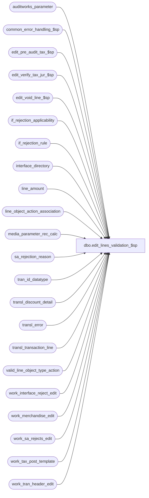

# dbo.edit_lines_validation_$sp

**Database:** auditworks_external  
**Server:** bedrockdb01  

## Architecture Diagram



## Table Dependencies

| Referenced Table |
|---|
| auditworks_parameter |
| common_error_handling_$sp |
| edit_pre_audit_tax_$sp |
| edit_verify_tax_jur_$sp |
| edit_void_line_$sp |
| if_rejection_applicability |
| if_rejection_rule |
| interface_directory |
| line_amount |
| line_object_action_association |
| media_parameter_rec_calc |
| sa_rejection_reason |
| tran_id_datatype |
| transl_discount_detail |
| transl_error |
| transl_transaction_line |
| valid_line_object_type_action |
| work_interface_reject_edit |
| work_merchandise_edit |
| work_sa_rejects_edit |
| work_tax_post_template |
| work_tran_header_edit |

## Stored Procedure Code

```sql
create proc dbo.edit_lines_validation_$sp @process_id             binary(16),
@user_id		int,
@errmsg                 nvarchar(2000) OUTPUT,
@edit_process_no        tinyint = 1

AS
/* Proc Name: edit_lines_validation_$sp
   Description: search for line voids.
    reject transactions if not in balance or invalid line object/action/tran category.
    Allow + or - 4 cents variation in transaction balance (normally zero) for trans
    with void lines and subtotal discounts to allow for translate rounding problems.
    Calculate transaction tender totals.
    sa_reject_qty is updated in edit_phase2_$sp.

  NOTE: This unicode version is suitable for both SA5.0 and SA5.1
        because @transaction_series and @validation_check don't need to be unicode

HISTORY
Date     Name           Def# Desc
Dec11,13 Vicci        148775 Correct flipped operators on pos_discount_amount update (broken on defect 8900).
Oct10,13 Vicci      1-4BH41L Avoid arithmetic overflow when quantity entered at POS is invalid (valid for smallint is [-32768, 32767]) 
                             and SQL2012 support.
Jul09,13 Vicci        139695 Take unit_of_measure into account when determining if transaction is in balance.
Nov19,12 Vicci        139802 Ensure discount amount applied recalculation logic is applied to the last transaction 
                             in the batch for which a voiding-reversal of a discount transaction line occurred.
Oct23,12 Vicci        139178 Auto-repair-discount-transaction-line amount was incorrectly setting markdowns on returns to be markups
                             when a variance existed.  Since a sign had been applied to the discount total calculation in order to handle
                             exchange transactions, this sign had to be reversed again before logging it to the discount line.
Oct28,11,Vicci        130822 Fix126275 Added missing posting_end_date_time to transl_error insert since this is a mandatory field.
Apr20,11 Paul         126275 insert to transl_error to improve performance 
Dec19,10 Paul         105313 Use unicode datatypes
Jan25,11 Paul         124176 Verify discount totals and create a translate reject when there is a mismatch in applied discounts
Nov19,09 Vicci        122171 Reject transactions with line-object-type 0 (Error) even if their auto_config_verified flag = 1.
Apr18,08 Phu           96766 Remove references to interface directory lookup table.
Nov19,07 Paul          93924 apply 1-3TY31A to SA5
Oct12,06 Paul        DV-1344 apply 75868 to SA5, retained interface_directory_lookup for efficiency
Nov02,05 Paul          62153 apply 61728 to SA5
Oct03,05 Paul          60471 apply 60822 to SA5
Jun30,05 David       DV-1285 Log S/A reject properly if entry not in L_O_A_A.
Jun07,05 David       DV-1263 Log lookup_pos_code in sa_rejection_reason for reason 6 and 19.
Apr28,05 David       DV-1202 Log S/A reject reason 19.
         Paul                expand transaction_id to use tran_id_datatype
Feb08,05 Sab	   DV-1203 prevent Error 208 at Line:248 Message:Invalid object name '#work_discounts'
Dec13,04 Maryam      DV-1191 change select into # to create table and insert.
Dec09,04 Paul        DV-1181 retrofit 1-1550TY/1-1550-TS check transaction_void_flag, add nolock hints
Sep23,04 David       DV-1146 Use user_id instead of user name.
May14,04 Maryam      DV-1071 remove the reference to register type and the join to register in the void_lines_crsr,
				 Receive @process_id and pass it to the subprocs that need them
Nov19,07 Paul       1-3TY31A correctly update discount detail in out of balance logic
Aug10,06 Daphna        75868 prevent overly large amount from crashing edit for media rec quantity
May16,06 Daphna        68317 use if_rejection_applicability to determine which validations to perform 
                             (remove references to interface_directory_lookup)
Oct27,05 David         61728 Use transl_transaction_line.encrypted_reference_no.
Sep26,05 David         60822 Log lookup_pos_code in sa_rejection_reason for reason 6.
Nov09,04 Shapoor    1-1550TS Avoid flagging post-void transaction as s/a reject when transaction lines missing
Mar25,04 Daphna        26288 Ensure recalculation of pos_discount_amount is only for
                 applied discount (not expensed)
Sep15,03 ShuZ        1-G7A5F Remove all references to the interface_directory '... _check' 
                             fields from stored procedures/triggers and replace with usage 
                             of if_rejection_applicability table.
Mar19,03 Paul        1-JNJU5 use sa reject reason 20 instead of 54
Oct16,02 Winnie	   1-FGPA6 Set sa_reject if no lines for a transaction.
				***** may need to UNCOMMENT LINE OPTION(FORCE ORDER) FOR MSSQL *****
Aug20,02 Winnie      1-D91OT To allow reference_no to be set as optional.
Apr25,02 Phu        1-C9P5S Pre audit tax
Mar22,02 Paul        1-BUVZ9 set tender_total in work_tran_header_edit
Nov26,01 Winnie	   1-969YY Add logic for R3 error handling to pass @edit_process_no
Nov09,01 Sab            8900 TRANSL edit changes for Sybase
                             treat negative discount amounts as absolute value when force
                          balancing tran with subtotal discounts and voided lines. The
                             discounts are only changed to positive later in edit_insert_header_lines_$sp.
Oct15,01 Maryam         8840 Call edit_verify_tax_jur_$sp instead of verify_tax_jurisdiction_$sp.
Aug10,01 Maryam         8283 Call verify_tax_jurisdiction_$sp when either tax_default_check
                             or exception_jurisdiction_check is turned on.
Jun21,01 Paul           8192 do not look at tax_override_flag since it is no longer set
Aug31,00 Maryam         6655 Check tax_override_flag when inserting type 8 if_reject_reason.
Jun12,00 Phu            6419 Not null columns are missing in insert #reject_list
Jun08,00 Daphna         4857 add new reference_no_check logic
Mar15,00 Paul           5852 add new option to check transaction balance on post-voided trans.
Mar01,00 Phu            5900 Change @@fetch_status > 0 to @@fetch_status <> 0 for MS SQL compatibility
Jan28,00 Paul           5893 Don't create sa rejects for translate errors (until mass correct is ready)
Dec08,99 Paul           5544 Don't create type 8 i/f rejects for tax overrides.
			       They are checked in edit_tax_detail_$sp.
Dec06,99 Paul           5711 allow + or - 4 cents variation in tran balance even if no
         		     subtotal discounts are voided as long as there are voided lines.
Nov24,99 Shapoor        5649 Explictly convert to numeric(12,4) when dividing by units.
Aug18,99 Paul           5407 create sa_rejects for all nonvoided translate errors
Nov13,98 Paul                author
*/

DECLARE
	@applied_by_line_id		numeric(5,0),
	@check_postvoid_balance		tinyint,
	@cursor_open			tinyint,
	@db_cr_none			smallint,
	@deleted_count			int,
	@discount_corrected		tinyint,
	@discount_total			line_amount,
	@errno 				int,
	@errmsg2                 	nvarchar(2000),
	@entry_date_time		datetime,
	@execret			int,
	@function_no			smallint,
	@line_id			numeric(5,0),
	@no_more_rows			int,
	@par_value			nvarchar(255),
	@prev_entry_date_time		datetime,
	@prev_register_no		smallint,
	@prev_store_no			int,
	@prev_transaction_no		int,
	@prev_transaction_series	nchar(1),
	@reference_no_check		tinyint,
	@register_no			smallint,
	@reject_reason			tinyint,
	@rows				int,
	@rows_mismatched		int,
	@rows_type6			int,
	@store_no			int,
	@tax_default_check              tinyint,
	@exception_jurisdiction_check   tinyint,
	@transaction_count		int,
	@transaction_date		smalldatetime,
	@transaction_id			tran_id_datatype,
	@transaction_no			int,
	@transaction_series		nchar(1),
	@transaction_total		money,
	@transaction_void_flag		smallint,
	@translate_msg			nvarchar(255),
	@void_count			int,
	@void_discount_count		smallint,
	@void_discount_flag		tinyint,
	@voided_line_id			numeric(5,0),
	@voiding_disc_multiplier	smallint /* normally -1 for pc, fuji */,
	@update_timing			smallint,
	@message_id		        int,	
	@object_name	         	nvarchar(255),	
	@operation_name		        nvarchar(100),
	@process_name		        nvarchar(100),
	@reject_no_lines		tinyint,
	@validation_check		nchar(3),
	@base				numeric(3,0);

SELECT @check_postvoid_balance = 0,
       @process_name = 'edit_lines_validation_$sp',
       @message_id = 201068,
       @function_no = 4,
       @base = 10,
       @translate_msg = 'Discount attachment found (with discrepancy between discount amounts) has been auto-repaired';

BEGIN TRY

SELECT @errmsg = 'Failed to create temp table #work_discounts. ',
       @object_name = '#work_discounts',
       @operation_name = 'CREATE TABLE';
CREATE TABLE #work_discounts(store_no int not null,
                             register_no smallint not null,
                             entry_date_time datetime not null,
                             transaction_series nchar(1) not null,
                             transaction_no int not null,
                             line_id numeric(5,0) not null,
	            	     applied_flag tinyint null,
	                     tot_discount_amount numeric(12,4) not null);

SELECT @errmsg = 'Failed to create temp table #tender_totals. ',
       @object_name = '#tender_totals';
CREATE TABLE #tender_totals(transaction_id numeric(14,0) not null, -- tran_id_datatype
                            tender_total numeric(12,4) not null);

SELECT @errmsg = 'Failed to create temp table #discount_totals. ',
       @object_name = '#discount_totals';
CREATE TABLE #discount_totals(
	store_no int not null,
	register_no smallint not null,
	transaction_date smalldatetime not null,
	entry_date_time datetime not null,
	transaction_series nchar(1) not null,
	transaction_no int not null,
	transaction_id numeric(14,0), -- tran_id_datatype
	applied_by_line_id numeric(5,0) not null,
	disc_line_amt numeric(12,4) not null,
	disc_detail_amt numeric(12,4) not null,
	disc_line_gl_effect smallint not null);  --139178

SELECT @errmsg = 'Failed to look up check_postvoid_balance parameter. ',
       @object_name = 'auditworks_parameter',
       @operation_name = 'SELECT';
SELECT @par_value = par_value
  FROM auditworks_parameter
 WHERE par_name = 'check_postvoid_balance';

IF @par_value = '1'
  SELECT @check_postvoid_balance = 1;

SELECT @errmsg = 'Failed to look up sa_reject_when_no_lines parameter. ';
SELECT @reject_no_lines = ISNULL(CONVERT(TINYINT,par_value),1)
  FROM auditworks_parameter
 WHERE par_name = 'sa_reject_when_no_lines';

IF @reject_no_lines IS NULL /* then */
  SELECT @reject_no_lines = 1;

/*{ process voiding lines */
  /* voiding_reversal_flag : 1= nonvoid 0= voiding reversal -1= post void reversal */
  /* use temp table to avoid cursor problems on deleted rows */

SELECT @voiding_disc_multiplier = -1;

/* don't create if_rejects for voiding lines */
SELECT @errmsg = 'Failed to delete work_interface_reject_edit (voiding line). ',
       @object_name = 'work_interface_reject_edit',
       @operation_name = 'DELETE';
DELETE work_interface_reject_edit
  FROM transl_transaction_line tl WITH (NOLOCK), work_interface_reject_edit wr
 WHERE tl.voiding_reversal_flag = 0
   AND tl.transaction_id = wr.transaction_id
   AND tl.line_id = wr.line_id


SELECT @errmsg = 'Failed to define cursor void_lines_crsr. ',
       @object_name = 'void_line_crsr',
       @operation_name = 'DECLARE';
DECLARE void_lines_crsr CURSOR FAST_FORWARD
    FOR
  SELECT tl.store_no, tl.register_no, tl.entry_date_time, tl.transaction_series, tl.transaction_no, line_id, 
	 transaction_void_flag
    FROM work_tran_header_edit wh WITH (NOLOCK), transl_transaction_line tl WITH (NOLOCK)
   WHERE wh.store_no = tl.store_no
     AND wh.register_no = tl.register_no
     AND wh.entry_date_time = tl.entry_date_time
     AND wh.transaction_series = tl.transaction_series
     AND wh.transaction_no = tl.transaction_no
     AND tl.transaction_id IS NOT NULL --
     AND tl.voiding_reversal_flag = 0 /* reversal of previous line */
   ORDER BY tl.store_no, tl.register_no, tl.entry_date_time, tl.transaction_series, tl.transaction_no, line_id, 
	 transaction_void_flag;

SELECT @operation_name = 'OPEN';
OPEN void_lines_crsr;

SELECT @cursor_open = 1,
       @void_discount_flag = 0,
       @void_discount_count = 0,
       @prev_store_no = -1,
       @prev_register_no = -1,
       @prev_entry_date_time = '01/01/1970';

WHILE 1=1
BEGIN

  SELECT @errmsg = 'Failed to fetch cursor void_lines_crsr. ',
         @object_name = 'void_line_crsr',
         @operation_name = 'FETCH';
  FETCH void_lines_crsr INTO
	@store_no,
	@register_no,
	@entry_date_time,
	@transaction_series,
	@transaction_no,
	@line_id,
	@transaction_void_flag;

  IF @@fetch_status <> 0
    SELECT @no_more_rows = 1,
	   @store_no = -1,  --139802: used to be @prev_store_no = -1
	   @register_no = -1,  --139802:  @prev_register_no = -1
	   @entry_date_time = '01/01/1970'; 

  IF ((@store_no != @prev_store_no) OR (@register_no != @prev_register_no) OR
	(@entry_date_time != @prev_entry_date_time) OR
	(@transaction_series != @prev_transaction_series) OR
	(@transaction_no != @prev_transaction_no))
  BEGIN
     
    IF @void_discount_count >= 1 /* at least one void of discount */
    BEGIN
        SELECT @errmsg = 'Failed to insert into temp table #work_discounts. ',
               @object_name = '#work_discounts',
               @operation_name = 'INSERT';
	INSERT INTO #work_discounts(
	       store_no,
	       register_no,
	       entry_date_time,
	       transaction_series,
	       transaction_no,
	       line_id,
	       applied_flag,
	       tot_discount_amount)
	SELECT store_no,
	       register_no,
	       entry_date_time,
	       transaction_series,
	       transaction_no,
	       line_id,
	       applied_flag,
	       ISNULL(SUM(discount_amount_sign * ABS(pos_discount_amount)),0)
	  FROM transl_discount_detail WITH (NOLOCK)
	 WHERE store_no = @prev_store_no
	   AND register_no = @prev_register_no
	   AND entry_date_time = @prev_entry_date_time
	   AND transaction_series = @prev_transaction_series
	   AND transaction_no = @prev_transaction_no
	 GROUP BY store_no, register_no, entry_date_time, transaction_series, transaction_no, 
	          line_id, applied_flag;

         /* ensure that tran lines match discount details */
	SELECT @errmsg = 'Failed to update transaction_line (pos_discount_amount=0). ',
               @object_name = 'transl_transaction_line',
               @operation_name = 'UPDATE';
	UPDATE transl_transaction_line
	   SET pos_discount_amount = 0
	 WHERE store_no = @prev_store_no
	   AND register_no = @prev_register_no
	   AND entry_date_time = @prev_entry_date_time
	   AND transaction_series = @prev_transaction_series
	   AND transaction_no = @prev_transaction_no
	   AND line_object_type IN (1, 2)  --139802:  fees can be discountable too!
	   AND pos_discount_amount != 0;

	SELECT @errmsg = 'Failed to update transaction_line (pos_discount_amount). ';
	UPDATE transl_transaction_line
	   SET pos_discount_amount = tot_discount_amount
	  FROM #work_discounts wd WITH (NOLOCK), transl_transaction_line tl
	 WHERE wd.store_no = tl.store_no
	   AND wd.register_no = tl.register_no
	   AND wd.entry_date_time = tl.entry_date_time
	   AND wd.transaction_series = tl.transaction_series
	   AND wd.transaction_no = tl.transaction_no
         AND wd.line_id = tl.line_id
	   AND tl.transaction_id IS NOT NULL --  
	   AND wd.applied_flag = 1;

	SELECT @errmsg = 'Failed to update merchandise_detail (sold_at_price)',
               @object_name = 'work_merchandise_edit';
	UPDATE work_merchandise_edit
	   SET net_line_amount = CONVERT(numeric(12,4),(tl.gross_line_amount - tl.pos_discount_amount))
	  FROM work_merchandise_edit md, transl_transaction_line tl WITH (NOLOCK)
	 WHERE tl.store_no = @prev_store_no
	   AND tl.register_no = @prev_register_no
	   AND tl.entry_date_time = @prev_entry_date_time
	   AND tl.transaction_series = @prev_transaction_series
	   AND tl.transaction_no = @prev_transaction_no
	   AND tl.transaction_id IS NOT NULL --
	   AND tl.transaction_id = md.transaction_id
	   AND tl.line_id = md.line_id;

        SELECT @errmsg = 'Failed to truncate temp table #work_discounts. ',
               @object_name = '#work_discounts',
               @operation_name = 'TRUNCATE';
        TRUNCATE TABLE #work_discounts;
    END; /* @void_discount_count >= 1 */

    SELECT @prev_store_no = @store_no,
	    @prev_register_no = @register_no,
	    @prev_entry_date_time = @entry_date_time,
	    @prev_transaction_series = @transaction_series,
	    @prev_transaction_no = @transaction_no,
	    @void_discount_count = 0;
  END; -- IF ((@store_no != @prev_store_no ...

  IF @no_more_rows = 1
    BREAK;

  SELECT @errmsg = 'Failed to execute edit_void_line_$sp. ',
         @object_name = 'edit_void_line_$sp',
         @operation_name = 'EXEC';
  EXEC edit_void_line_$sp @store_no, @register_no, @entry_date_time, @transaction_series, @transaction_no,
		@line_id, @errmsg OUTPUT,  @void_discount_flag OUTPUT,
		@transaction_void_flag, @voiding_disc_multiplier, @edit_process_no;

  SELECT @void_discount_count = @void_discount_count + @void_discount_flag;

END; /* While 1=1 */

SELECT @errmsg = 'Failed to close and deallocate cursor void_lines_crsr. ',
       @object_name = 'void_line_crsr',
       @operation_name = 'CLOSE';
CLOSE void_lines_crsr;
SELECT @operation_name = 'DEALLOCATE';
DEALLOCATE void_lines_crsr;
SELECT @cursor_open = 0;

/*} process voiding lines */


/* Verify that the translate has applied discounts correctly.
   Find any discount lines in tran line where the gross_lime_amount is not equal to the sum of the discount
   detail attachments for that line (applied_by_line_id). If found, then create translate/sa rejects.
   This will reduce the chance of discount detail amount mismatches that could cause intermittent out of balance
   issues in subledger and in downstream interfaces that use if_discount_detail.
   Any orphaned discount details (where no tran line exists) will be discarded later by edit_insert_header_lines_$sp. */

SELECT @errmsg = 'Failed to insert #discount_totals. ',
       @object_name = '#discount_totals',
       @operation_name = 'INSERT';
INSERT INTO #discount_totals(
	store_no,
	register_no,
	transaction_date,
	entry_date_time,
	transaction_series,
	transaction_no,
	transaction_id,
	applied_by_line_id,
	disc_line_amt,
	disc_detail_amt,
	disc_line_gl_effect)
SELECT h.store_no,
	h.register_no,
	h.transaction_date,
	h.entry_date_time,
	h.transaction_series,
	h.transaction_no,
	d.transaction_id,
	d.applied_by_line_id, 
	MAX(dl.gross_line_amount * CASE WHEN dl.db_cr_none = 0 THEN dv.default_db_cr_none ELSE dl.db_cr_none END),
	SUM( (ABS(d.pos_discount_amount - d.pos_discount_amount_adj) * d.discount_amount_sign)
	     * CASE WHEN ml.db_cr_none = 0 THEN mv.default_db_cr_none ELSE ml.db_cr_none END * -1),  --to handle exchange transactions
	MAX(CASE WHEN dl.db_cr_none = 0 THEN dv.default_db_cr_none ELSE dl.db_cr_none END) disc_line_gl_effect  --139178
  FROM transl_discount_detail d
     INNER JOIN work_tran_header_edit h WITH (NOLOCK)
        ON (d.transaction_id = h.transaction_id
        AND d.transaction_no = h.transaction_no
        AND d.store_no = h.store_no
        AND d.register_no = h.register_no
        AND d.entry_date_time = h.entry_date_time
        AND d.transaction_series = h.transaction_series
        AND h.transaction_void_flag IN (0,8))
     INNER JOIN transl_transaction_line dl WITH (NOLOCK)
        ON (d.transaction_no = dl.transaction_no
    AND d.store_no = dl.store_no
        AND d.register_no = dl.register_no
        AND d.entry_date_time = dl.entry_date_time
        AND d.transaction_series = dl.transaction_series
        AND d.applied_by_line_id = dl.line_id
        AND dl.line_void_flag = 0
        AND dl.transaction_id IS NOT NULL) -- exclude orphaned rows
     INNER JOIN valid_line_object_type_action dv WITH (NOLOCK)
        ON (dl.line_object_type = dv.line_object_type
        AND dl.line_action = dv.line_action)
     INNER JOIN transl_transaction_line ml WITH (NOLOCK)
        ON (d.transaction_no = ml.transaction_no
        AND d.store_no = ml.store_no
        AND d.register_no = ml.register_no
        AND d.entry_date_time = ml.entry_date_time
        AND d.transaction_series = ml.transaction_series
        AND d.line_id = ml.line_id
        AND ml.line_void_flag = 0
        AND ml.transaction_id IS NOT NULL) -- exclude orphaned rows
     INNER JOIN valid_line_object_type_action mv WITH (NOLOCK)
        ON (ml.line_object_type = mv.line_object_type
        AND ml.line_action = mv.line_action)
 WHERE d.transaction_id IS NOT NULL -- exclude orphaned rows
 GROUP BY h.store_no, h.register_no, h.transaction_date, h.entry_date_time, h.transaction_series, h.transaction_no,
		d.transaction_id, d.applied_by_line_id
 HAVING MAX(dl.gross_line_amount * CASE WHEN dl.db_cr_none = 0 THEN dv.default_db_cr_none ELSE dl.db_cr_none END) 
     <> SUM( (ABS(d.pos_discount_amount - d.pos_discount_amount_adj) * d.discount_amount_sign)
	     * CASE WHEN ml.db_cr_none = 0 THEN mv.default_db_cr_none ELSE ml.db_cr_none END * -1);
SELECT @rows_mismatched = @@rowcount;

IF @rows_mismatched > 0
BEGIN
	/* log translate error (without any translate error sa reject for type 202) when the sum of the discount attachments
	   for any applied_by_line_id does not match the gross_line_amount for the discount line in transaction_line.
	   bad_data_output contains the original gross_line_amount from the discount line in tran line. */
  SELECT @errmsg = 'Failed to insert for discount details. ',
         @object_name = 'transl_error',
         @operation_name = 'INSERT';
  INSERT transl_error (
	 store_no,
	 register_no,
	 entry_date_time,
	 transaction_series,
	 transaction_no,
	 line_id,
	 transl_reject_reason,  
	 posting_start_date_time,
	 posting_end_date_time,
	 transl_error_msg,
	 bad_data_output)
  SELECT store_no,
	 register_no,
	 entry_date_time,
	 transaction_series,
	 transaction_no,
	 applied_by_line_id,
	 202,
	 getdate(),
	 getdate(),
	 @translate_msg,
	 CONVERT(nvarchar,disc_line_amt * disc_line_gl_effect)  --139178
     FROM #discount_totals;

	/* For discount lines where the gross_line_amount does not match the sum of the discount attachments,
	   force the gross_line_amount in transl_transaction_line to match the sum of the discount attachments
	   by overlaying gross_line_amount in transl_tranaction_line for the affected values of 
	   applied_by_line_id. This may also trigger a type 5 SA reject (below). */

  SELECT @errmsg = 'Failed to overlay gross_line_amount (discount). ',
         @object_name = 'transl_transaction_line',
         @operation_name = 'UPDATE'; 
  UPDATE transl_transaction_line
     SET gross_line_amount = dt.disc_detail_amt * dt.disc_line_gl_effect  --139178
    FROM #discount_totals dt, transl_transaction_line dl
   WHERE dt.transaction_no = dl.transaction_no
     AND dt.store_no = dl.store_no
     AND dt.register_no = dl.register_no
     AND dt.entry_date_time = dl.entry_date_time
     AND dt.transaction_series = dl.transaction_series
     AND dt.applied_by_line_id = dl.line_id
     AND dl.line_void_flag = 0;

END; -- If @rows_mismatched > 0


/* Verify that transactions are in balance. If not, then create type 5 rejections. */
SELECT @errmsg = 'Failed to define cursor void_balance_crsr. ',
       @object_name = 'void_balance_crsr',
       @operation_name = 'DECLARE';
DECLARE void_balance_crsr CURSOR FAST_FORWARD
    FOR
 SELECT tl.store_no, tl.register_no, tl.entry_date_time, tl.transaction_series, tl.transaction_no, tl.transaction_id,
	transaction_total = SUM((gross_line_amount - pos_discount_amount) * db_cr_none * voiding_reversal_flag)
   FROM work_tran_header_edit wh WITH (NOLOCK), transl_transaction_line tl WITH (NOLOCK)
  WHERE (transaction_void_flag IN (0,8)
	OR (transaction_void_flag = 1 AND @check_postvoid_balance = 1)) 
    AND wh.store_no = tl.store_no
    AND wh.register_no = tl.register_no
    AND wh.entry_date_time = tl.entry_date_time
    AND wh.transaction_series = tl.transaction_series
    AND wh.transaction_no = tl.transaction_no
    AND line_void_flag = 0
    AND db_cr_none != 0
    AND tl.transaction_id IS NOT NULL -- exclude orphaned lines
    AND COALESCE(tl.unit_of_measure, 1) = 1
    GROUP BY tl.store_no, tl.register_no, tl.entry_date_time, tl.transaction_series, tl.transaction_no, tl.transaction_id
 HAVING SUM((gross_line_amount - pos_discount_amount) * db_cr_none * voiding_reversal_flag) <> 0

SELECT @operation_name = 'OPEN';
OPEN void_balance_crsr;
SELECT @cursor_open = 2;

WHILE 2=2
BEGIN
  SELECT @errmsg = 'Failed to fetch cursor void_balance_crsr. ',
         @object_name = 'void_balance_crsr',
         @operation_name = 'FETCH';
  FETCH void_balance_crsr INTO
	@store_no,
	@register_no,
	@entry_date_time,
	@transaction_series,
	@transaction_no,
	@transaction_id,
	@transaction_total;

  IF @@fetch_status <> 0
    BREAK;

  SELECT @discount_corrected = 0;

  IF ABS(@transaction_total) >= 0.05
     SELECT @void_count = 0;
  ELSE
  BEGIN
    SELECT @errmsg = 'Failed to count void lines. ',
           @object_name = 'transl_transaction_line',
           @operation_name = 'SELECT';
    SELECT @void_count = COUNT(line_id)
      FROM transl_transaction_line WITH (NOLOCK)
     WHERE store_no = @store_no
       AND register_no = @register_no
       AND entry_date_time = @entry_date_time
       AND transaction_series = @transaction_series
       AND transaction_no = @transaction_no
       AND line_void_flag = 1
       AND COALESCE(unit_of_measure, 1) = 1;
  END;
   /* Attempt to force balance tran containing discounts by adding the difference to 
      the last applied non-voided discount where discount >= 5 cents */
  IF @void_count >= 1
  BEGIN
    SELECT @errmsg = 'Failed to determine max non-void discount line. ',
           @object_name = 'transl_discount_detail',
           @operation_name = 'SELECT';
    SELECT @line_id = MAX(dd.line_id)
      FROM transl_discount_detail dd WITH (NOLOCK), transl_transaction_line tl WITH (NOLOCK)
     WHERE tl.store_no = @store_no
       AND tl.register_no = @register_no
       AND tl.entry_date_time = @entry_date_time
       AND tl.transaction_series = @transaction_series
       AND tl.transaction_no = @transaction_no
       AND dd.applied_flag = 1
       AND dd.pos_discount_level IN (18,19)
       AND ABS(dd.pos_discount_amount) >= .05
       AND tl.store_no = dd.store_no
       AND tl.register_no = dd.register_no
       AND tl.entry_date_time = dd.entry_date_time
       AND tl.transaction_series = dd.transaction_series
       AND tl.transaction_no = dd.transaction_no
       AND tl.line_id = dd.line_id
       AND tl.line_object_type = 1 /* merchandise */
       AND tl.line_void_flag = 0 
       AND COALESCE(tl.unit_of_measure, 1) = 1;
	
    IF @line_id >= 1
    BEGIN
      SELECT @errmsg = 'Failed to determine max applied_by_line_id. ';
      SELECT @applied_by_line_id = MAX(applied_by_line_id)
	FROM transl_discount_detail WITH (NOLOCK)
       WHERE store_no = @store_no
	 AND register_no = @register_no
	 AND entry_date_time = @entry_date_time
	 AND transaction_series = @transaction_series
	 AND transaction_no = @transaction_no
	 AND line_id = @line_id
	 AND applied_flag = 1
	 AND pos_discount_level IN (18,19)
	 AND ABS(pos_discount_amount) >= .05;

      IF @applied_by_line_id >= 0
      BEGIN
        SELECT @errmsg = 'Failed to determine GL effect. ',
               @object_name = 'transl_transaction_line';
        SELECT @db_cr_none = db_cr_none * voiding_reversal_flag
	  FROM transl_transaction_line WITH (NOLOCK)
	 WHERE store_no = @store_no
	   AND register_no = @register_no
	   AND entry_date_time = @entry_date_time
	   AND transaction_series = @transaction_series
	   AND transaction_no = @transaction_no
	   AND line_id = @line_id
	   AND transaction_id IS NOT NULL; -- exclude orphaned lines

        SELECT @errmsg = 'Failed to update discount_detail pos_discount_amount. ',
               @object_name = 'transl_discount_detail',
               @operation_name = 'UPDATE';
	UPDATE transl_discount_detail
	   SET pos_discount_amount = SIGN(pos_discount_amount) * (ABS(pos_discount_amount) + (@db_cr_none * @transaction_total))
	 WHERE store_no = @store_no
	   AND register_no = @register_no
	   AND entry_date_time = @entry_date_time
	   AND transaction_series = @transaction_series
	   AND transaction_no = @transaction_no
	   AND line_id = @line_id
	   AND applied_by_line_id = @applied_by_line_id;

        SELECT @errmsg = 'Failed to total pos_discount_amount. ',
               @object_name = 'transl_discount_detail',
               @operation_name = 'SELECT';
	SELECT @discount_total = ISNULL(SUM(pos_discount_amount),0)
	  FROM transl_discount_detail WITH (NOLOCK)
	 WHERE store_no = @store_no
	   AND register_no = @register_no
	   AND entry_date_time = @entry_date_time
	   AND transaction_series = @transaction_series
	   AND transaction_no = @transaction_no
	   AND line_id = @line_id;

        SELECT @errmsg = 'Failed to update transaction_line (discount_amount). ',
               @object_name = 'transl_transaction_line',
               @operation_name = 'UPDATE';
	UPDATE transl_transaction_line
	   SET pos_discount_amount = ABS(@discount_total)
	 WHERE store_no = @store_no
	   AND register_no = @register_no
	   AND entry_date_time = @entry_date_time
	   AND transaction_series = @transaction_series
	   AND transaction_no = @transaction_no
	   AND line_id = @line_id
	   AND transaction_id IS NOT NULL; --

        SELECT @errmsg = 'Failed to determine transaction toal net amount. ',
               @object_name = 'transl_transaction_line',
               @operation_name = 'SELECT';
	SELECT @transaction_total = SUM((gross_line_amount - pos_discount_amount) * db_cr_none * voiding_reversal_flag)
	  FROM transl_transaction_line WITH (NOLOCK)
	 WHERE store_no = @store_no
	   AND register_no = @register_no
	   AND entry_date_time = @entry_date_time
	   AND transaction_series = @transaction_series
	   AND transaction_no = @transaction_no
	   AND line_void_flag = 0
	   AND transaction_id IS NOT NULL --
	   AND db_cr_none != 0 
	   AND COALESCE(unit_of_measure, 1) = 1;
	    
	IF @transaction_total = 0
	  SELECT @discount_corrected = 1;
      END; /* If @applied_by_line_id >= 0 */
    END; /* If @line_id >= 1 */
  END; /* @void_count >= 1 */

  IF @discount_corrected = 0
  BEGIN
    SELECT @errmsg = 'Failed to insert sa_rejection_reason (5). ',
           @object_name = 'sa_rejection_reason',
           @operation_name = 'INSERT';
    INSERT INTO sa_rejection_reason (
		transaction_id,
		line_id,
		violated_sareject_rule)
    VALUES(@transaction_id,
	   0,
	   5)
  END; -- IF @discount_corrected = 0

END; /* While 2=2 */

SELECT @errmsg = 'Failed to close and deallocate void_balance_crsr. ',
       @object_name = 'void_balance_crsr',
       @operation_name = 'CLOSE';
CLOSE void_balance_crsr;
SELECT @operation_name = 'DEALLOCATE';
DEALLOCATE void_balance_crsr;
SELECT @cursor_open = 0;


/*{ create sa rejections */

/*
  Removed previous logic because couldn't determine whether missing LOAA is actually an invalid one 
  or just an entry which hasn't been replicated yet.
*/

/* type 6 rejections: invalid line object/action/transaction_category */
SELECT @errmsg = 'Failed to insert S/A reject 6. ',
       @object_name = 'sa_rejection_reason',
       @operation_name = 'INSERT';
INSERT INTO sa_rejection_reason (
	    transaction_id,
	    line_id,
	    violated_sareject_rule,
	    line_object,
	    line_action,
	    transaction_category,
	    lookup_pos_code)
     SELECT tl.transaction_id,
	    line_id,
	    6,
	    line_object,
	    line_action,
	    wh.transaction_category,
	    tl.lookup_pos_code -- used in mass_correct_line_object_$sp
       FROM work_tran_header_edit wh WITH (NOLOCK), transl_transaction_line tl WITH (NOLOCK)
      WHERE transaction_void_flag IN (0,8)
	AND wh.store_no = tl.store_no
	AND wh.register_no = tl.register_no
	AND wh.entry_date_time = tl.entry_date_time
	AND wh.transaction_series = tl.transaction_series
	AND wh.transaction_no = tl.transaction_no
	AND tl.transaction_id IS NOT NULL -- 
        AND line_object_type = 0 -- not found during lookup
	AND line_void_flag = 0
	AND COALESCE(tl.auto_config_verified, 1) = 1; -- i.e. LOAA invalid and no pending validation line object
SELECT @rows_type6 = @@rowcount;

-- type 19 rejections: line object auto configuration pending approval
SELECT @errmsg = 'Failed to insert S/A reject 19. ';
INSERT INTO sa_rejection_reason (
	  transaction_id,
	    line_id,
	    violated_sareject_rule,
	    line_object,
	    line_action,
	    transaction_category,
	    lookup_pos_code)
     SELECT tl.transaction_id,
	    line_id,
            19,
	    line_object,
	    line_action,
	    wh.transaction_category,
	    tl.lookup_pos_code -- used in mass_correct_line_object_$sp
       FROM work_tran_header_edit wh WITH (NOLOCK), transl_transaction_line tl WITH (NOLOCK)
      WHERE transaction_void_flag IN (0,8)
	AND wh.store_no = tl.store_no
	AND wh.register_no = tl.register_no
	AND wh.entry_date_time = tl.entry_date_time
	AND wh.transaction_series = tl.transaction_series
	AND wh.transaction_no = tl.transaction_no
	AND tl.transaction_id IS NOT NULL -- 
        AND tl.auto_config_verified = 0; -- line object pending approval
SELECT @rows_type6 = @rows_type6 + @@rowcount

IF @rows_type6 >= 1
BEGIN
  SELECT @errmsg = 'Failed to update transaction_line (6, 19). ',
         @object_name = 'transaction_line',
         @operation_name = 'UPDATE';
  UPDATE transl_transaction_line
     SET line_object = 0,
	 line_action = 0
   WHERE line_object_type = 0;


  /* If bad category then set original category */
  SELECT @errmsg = 'Failed to update sa_rejection_reason transaction_category. ',
         @object_name = 'sa_rejection_reason',
         @operation_name = 'UPDATE'     
  UPDATE sa_rejection_reason
     SET transaction_category = re.transaction_category
    FROM work_sa_rejects_edit re WITH (NOLOCK), sa_rejection_reason rr
   WHERE re.transaction_id = rr.transaction_id
     AND rr.transaction_category = 0
     AND rr.violated_sareject_rule IN (6,19);
END; --IF @rows_type6 >= 1

SELECT @errmsg = 'Failed to truncate work_sa_rejects_edit table. ',
       @object_name = 'work_sa_rejects_edit',
       @operation_name = 'TRUNCATE';
TRUNCATE TABLE work_sa_rejects_edit;

SELECT @errmsg = 'Failed to update transaction_header with sa_rejection_flag = 1. ',
       @object_name = 'work_tran_header_edit',
       @operation_name = 'UPDATE';
UPDATE work_tran_header_edit
   SET sa_rejection_flag = 1
  FROM sa_rejection_reason sr WITH (NOLOCK), work_tran_header_edit th
 WHERE sr.transaction_id = th.transaction_id;


/*} create sa rejections */
/*{ Calculate transaction tender totals. */

SELECT @errmsg = 'Failed to insert into #tender_totals table. ',
       @object_name = '#tender_totals',
       @operation_name = 'INSERT';
INSERT INTO #tender_totals(
       transaction_id,
       tender_total)
SELECT tl.transaction_id,
       SUM( gross_line_amount * db_cr_none * voiding_reversal_flag )
  FROM work_tran_header_edit wh WITH (NOLOCK), transl_transaction_line tl WITH (NOLOCK)
 WHERE wh.transaction_id = tl.transaction_id
   AND line_void_flag = 0
   AND line_object_type = 6
   AND COALESCE(tl.unit_of_measure, 1) = 1
 GROUP BY tl.transaction_id;

SELECT @errmsg = 'Failed to update work_tran_header_edit from #tender_totals. ',
       @object_name = 'work_tran_header_edit',
       @operation_name = 'UPDATE';
UPDATE work_tran_header_edit
   SET tender_total = tt.tender_total,
       line_exists = 1
  FROM #tender_totals tt WITH (NOLOCK), work_tran_header_edit wh
 WHERE tt.transaction_id = wh.transaction_id
   AND tt.tender_total != 0;

SELECT @errmsg = 'Failed to drop work tables. ',
       @object_name = '#tender_totals',
       @operation_name = 'DROP TABLE';
DROP TABLE #tender_totals;
SELECT @object_name = '#work_discounts';
DROP TABLE #work_discounts;

/* Verify the existence of transaction line if the sa_reject flag is on */

IF @reject_no_lines = 1
BEGIN
  SELECT @errmsg = 'Failed to update #transaction_line. ',
         @object_name = '#transaction_line',
         @operation_name = 'UPDATE';
  UPDATE work_tran_header_edit
     SET line_exists = 1
    FROM work_tran_header_edit wh, transl_transaction_line tl WITH (NOLOCK)
   WHERE wh.line_exists = 0
     AND wh.transaction_id = tl.transaction_id;

  SELECT @errmsg = 'Failed to update work_tran_header_edit. ',
         @object_name = 'work_tran_header_edit';
  UPDATE work_tran_header_edit
     SET sa_rejection_flag = 1
   WHERE line_exists = 0
     AND transaction_void_flag IN (0,8); 
  SELECT @rows = @@rowcount;
    
  IF @rows > 0
  BEGIN
    SELECT @errmsg = 'Failed to insert sa_rejection_reason (20). ',
           @object_name = 'sa_rejection_reason',
           @operation_name = 'INSERT';
    INSERT INTO sa_rejection_reason(
           transaction_id,
           line_id,
           violated_sareject_rule)
    SELECT transaction_id,
           0,
           20
      FROM work_tran_header_edit WITH (NOLOCK)
     WHERE line_exists = 0
       AND transaction_void_flag IN (0,8);

  END; -- If @rows > 0
END; -- if @reject_no_lines = 1

/*{ verify that default tax jurisdictions are on file */


-- if_rejection_reason 7:exception_jurisdiction_check, 8:tax_default_check, 86:reference_no_check 

SELECT @errmsg = 'Failed to retrieve from if_rejection_rule, if_rejection_applicability, interface_directory for if_rejection_reason = 7, 8, 86. ',
       @object_name = 'if_rejection_rule',
       @operation_name ='SELECT';
SELECT @validation_check = REVERSE(RIGHT('000' + LTRIM(STR(SUM(FLOOR(POWER(@base, CONVERT(numeric(3,0), COALESCE((((1 - SIGN(ABS(ir.if_rejection_reason - 7))) * 7) +
                                                                                                                  ((1 - SIGN(ABS(ir.if_rejection_reason - 8))) * 8) +
                                                                                                                  ((1 - SIGN(ABS(ir.if_rejection_reason - 86))) * 9)), 1)) - 7))), 3, 0)), 3))
FROM if_rejection_rule ir
WHERE ir.if_rejection_reason IN (7, 8, 86)
AND COALESCE(ir.active_rejection_rule,1) = 1
AND EXISTS (SELECT 1 FROM if_rejection_applicability ia, interface_directory id
            WHERE ir.if_rejection_reason = ia.if_reject_reason
           AND ia.interface_id = id.interface_id
            AND id.update_timing > 0);

SELECT @exception_jurisdiction_check = CONVERT(tinyint, SUBSTRING(@validation_check, 1, 1)),
       @tax_default_check = CONVERT(tinyint, SUBSTRING(@validation_check, 2, 1)),
       @reference_no_check = CONVERT(tinyint, SUBSTRING(@validation_check, 3, 1));

SELECT @errmsg = 'Failed to read update_timing from interface_directory. ',
       @object_name = 'interface_directory',
       @operation_name ='SELECT';
SELECT @update_timing = update_timing
  FROM interface_directory 
 WHERE interface_id = 12;

SELECT @update_timing = ISNULL(@update_timing, 0);

IF @update_timing NOT IN (0,3,6)
  SELECT @update_timing = 3;

IF @update_timing = 6 -- pre audit tax
BEGIN
  SELECT @errmsg = 'Failed to execute stored proc edit_pre_audit_tax_$sp. ',
         @object_name = 'edit_pre_audit_tax_$sp',
         @operation_name ='EXECUTE';
  EXEC @execret = edit_pre_audit_tax_$sp @process_id, @user_id, @edit_process_no,
       @exception_jurisdiction_check, @tax_default_check, @errmsg OUTPUT;
END;
ELSE
  IF (@exception_jurisdiction_check >= 1 OR @tax_default_check >=1)
  BEGIN
    SELECT @errmsg = 'Failed to select into #tax_post_main from work_tax_post_template. ',
           @object_name = '#tax_post_main',
           @operation_name = 'CREATE';
    SELECT transaction_id, line_id, store_no, transaction_date, line_object_type,
           line_object, class_code, gross_line_amount, discount_amount, amount_sign,
           store_tax_jurisdiction, tax_jurisdiction, style_reference_id, sku_id,
           upc_lookup_division, return_from_store, return_from_date, override_tax_category,
           tax_paid_flag, header_override_flag, all_tax_override_flag, transaction_no,
           register_no, entry_date_time, transaction_series
    INTO #tax_post_main
    FROM work_tax_post_template WITH (NOLOCK);

    SELECT @errmsg = 'Failed to execute stored procedure edit_verify_tax_jur_$sp. ',
           @object_name = 'edit_verify_tax_jur_$sp',
           @operation_name = 'EXECUTE';
    EXEC edit_verify_tax_jur_$sp @exception_jurisdiction_check, @tax_default_check, @function_no, @edit_process_no, @errmsg OUTPUT;

    SELECT @errmsg = 'Failed to drop table #tax_post_main. ',
           @object_name = '#tax_post_main',
           @operation_name = 'DROP';
    DROP TABLE #tax_post_main;
  END;

/*{ verify that reference_no's are populated where required */

IF @reference_no_check > 0
BEGIN  /* reference_no_check = 1 */

  /*{ get list of tran id, line id and reference_no */
  SELECT @errmsg = 'Failed to insert rows into work_interface_reject_edit reason 86. ',
         @object_name = 'work_interface_reject_edit',
         @operation_name = 'INSERT';
  INSERT work_interface_reject_edit (
	 if_reject_reason,
	 transaction_id,
	 line_id )
  SELECT DISTINCT 86, 
	 tl.transaction_id, 
         tl.line_id
    FROM transl_transaction_line tl WITH (NOLOCK), work_tran_header_edit w WITH (NOLOCK),
         line_object_action_association l 
   WHERE w.transaction_id = tl.transaction_id
     AND w.transaction_category = l.transaction_category
     AND l.line_object = tl.line_object
     AND l.line_action = tl.line_action
     AND l.reference_no_option = 0
     AND tl.line_void_flag = 0
     AND tl.reference_type >= 1
     AND tl.transaction_id IS NOT NULL --
     AND tl.reference_no IS NULL --
     AND tl.encrypted_reference_no IS NULL; --
END; /* reference_no_check = 1*/


/* { Prevent overly-large amount from crashing rec_edit (rec_quantity counted)
     bad_data_output contains the original gross_line_amount (quantity) from tran line. */
SELECT @errmsg = 'Failed to log TranslateError (overly-large amount). ',
       @object_name = 'transl_error',
       @operation_name = 'INSERT';
INSERT transl_error (
	store_no,
	register_no,
	entry_date_time,
	transaction_series,
	transaction_no,
	line_id,
	transl_reject_reason,  
	posting_end_date_time,
	transl_error_msg,
	bad_data_output)
SELECT DISTINCT
	wh.store_no,
	wh.register_no,
	wh.entry_date_time,
	wh.transaction_series,
	wh.transaction_no,
	tl.line_id,
	26, 
	getdate(),
	'Invalid Counted Quantity',
	CONVERT(nvarchar,tl.gross_line_amount)
   FROM work_tran_header_edit wh, transl_transaction_line tl, media_parameter_rec_calc m
  WHERE wh.transaction_void_flag IN (0,8)
    AND wh.store_no = tl.store_no
    AND wh.register_no = tl.register_no
    AND wh.entry_date_time = tl.entry_date_time
    AND wh.transaction_series = tl.transaction_series
    AND wh.transaction_no = tl.transaction_no
    AND (tl.gross_line_amount > 32767 OR tl.gross_line_amount < -32768)
    AND tl.line_void_flag = 0
    AND tl.transaction_id IS NOT NULL --  
    AND tl.line_object = m.line_object
    AND tl.line_action = m.line_action
    AND m.rec_amount_type = 2;  -- quantity
SELECT @rows = @@rowcount;

IF @rows > 0  -- rejects logged
BEGIN
  -- reset quantity counted to max
  SELECT @errmsg = 'Failed to reset gross_line_amount = 32767 or -32768 when overly-large amount. ',
         @object_name = 'transl_transaction_line',
         @operation_name = 'UPDATE';
  UPDATE transl_transaction_line 
     SET gross_line_amount = CASE WHEN gross_line_amount < 0 THEN -32768 ELSE 32767 END
    FROM transl_error le, transl_transaction_line tl
   WHERE le.transl_reject_reason = 26
     AND le.store_no = tl.store_no
     AND le.register_no = tl.register_no
     AND le.entry_date_time = tl.entry_date_time
     AND le.transaction_series = tl.transaction_series
     AND le.transaction_no = tl.transaction_no
     AND le.line_id = tl.line_id;
END; -- If @rows > 0


/* } Prevent overly-large amount from crashing rec_edit (rec_quantity counted) */
SELECT @errmsg = 'Failed to drop #discount_totals. ',
       @object_name = '#discount_totals',
       @operation_name = 'DROP TABLE';
DROP TABLE #discount_totals;

RETURN;

END TRY

BEGIN CATCH
  SELECT @errno = ERROR_NUMBER();
  IF @errmsg2 IS NULL
  BEGIN
    SELECT @errmsg2 = @process_name + ':  ' + COALESCE(@errmsg, '') + ERROR_MESSAGE() + ' Line: ' + CONVERT(nvarchar, ERROR_LINE());
  END;
  SELECT @errmsg = @errmsg2;  

  IF @cursor_open = 1
  BEGIN
    CLOSE void_lines_crsr;
    DEALLOCATE void_lines_crsr;
  END;
  IF @cursor_open = 2
  BEGIN
    CLOSE void_balance_crsr;
    DEALLOCATE void_balance_crsr;
  END;

  EXEC common_error_handling_$sp @function_no, @errno, @errmsg2, 0, @message_id, @process_name, @object_name, @operation_name, 1, @edit_process_no,  
                                 0, null, 0, null, null, null, null, null, null, 0, @process_id, @user_id;
  
  RETURN;
END CATCH;
```

