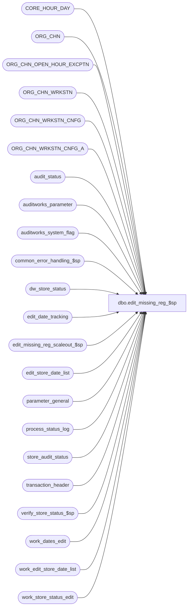

# dbo.edit_missing_reg_$sp

**Database:** auditworks_external  
**Server:** bedrockdb01  

## Architecture Diagram



## Table Dependencies

| Referenced Table |
|---|
| CORE_HOUR_DAY |
| ORG_CHN |
| ORG_CHN_OPEN_HOUR_EXCPTN |
| ORG_CHN_WRKSTN |
| ORG_CHN_WRKSTN_CNFG |
| ORG_CHN_WRKSTN_CNFG_A |
| audit_status |
| auditworks_parameter |
| auditworks_system_flag |
| common_error_handling_$sp |
| dw_store_status |
| edit_date_tracking |
| edit_missing_reg_scaleout_$sp |
| edit_store_date_list |
| parameter_general |
| process_status_log |
| store_audit_status |
| transaction_header |
| verify_store_status_$sp |
| work_dates_edit |
| work_edit_store_date_list |
| work_store_status_edit |

## Stored Procedure Code

```sql
create proc dbo.edit_missing_reg_$sp   @process_id binary(16),
  @user_id int,
  @errmsg nvarchar(2000) OUTPUT,
  @process_no smallint = 5,
  @trickle_polling_flag smallint = 0,
  @edit_process_no tinyint = 1
  
AS

  /* 
    
    Proc Name : edit_missing_reg_$sp
         Desc : To create rows with status = 5 (missing) or 900 (unused)
                in audit_status and store_audit_status when registers have no transactions for a day.
                Edit phase 1 runs this proc once per day. Called again later by Edit phase2 to ensure data integrity.
                Called by edit_phase2_$sp and edit_post_$sp (edit phase 1).

    Please ensure that the proc script contains the following at the top in order to support scaleout:
	SET ANSI_NULLS ON
	SET ANSI_WARNINGS ON 

    HISTORY:   
    Date     Name         Def# Desc
    Nov20,14 Paul    TFS-93074 use nested try..catch to trap error 2601
    Apr04,13 Vicci      143066 Remove all references to audit_status quantities (valid_qty, sa_reject_qty) for batch
                               currently being processed since they are not set yet at the time this proc is called.
    Nov16,12 Vicci      139679 Downgrade status if it is edited/verified but there are no transactions that exist. 
                               This happens when edit fails and rolls back, deleting the date affected from edit_date_tracking.
    Feb07,12 Vicci      132846 Read last_edit_date from auditworks_system_flag, not parameter_general.
    Nov25,10 Vicci      122936 Set @instance_id and correct code to look at #store_reg_list not work_store_reg_list.
    Oct25,10 Paul       121798 check for existence of dw_store_status to handle timing scenarios
    Sep07,10 Paul       119817 scaleout: turn on xact abort setting only when needed since it aborts error logging
    May28,10 Paul       117568 Increase retry of insert from 5 to 100 times.
    Apr01,10 Vicci      116915 For scaleout, don't consider a date to have been evaluated on a peripheral if dw_store_master
				 had not yet been populated and therefore missing had not yet been evaluated (day 1 of live).
    Feb25,10 Paul       116253 scaleout: when called by edit phase2, clean up possible duplicated missing status rows
    Jan08,10 Vicci      115175 Don't evaluate missing for dates earlier than the live date if a live date is specified;
    Jan08,10 Paul       115175 Ensure that all references to audit_status look only for date_reject_id = 0.
    Sep30,09 Paul       111900 speed improvement: When called by edit phase2, do a simple search for missing
				  instead of a complete re-evaluation for dates that were already evaluated
    Sep24,09 Paul       111900 scaleout: Check ownership in dw_store_master. Clean up missing for store-dates that
				  are now edited on other peripherals. Call edit_missing_reg_scaleout_$sp.
    Aug19,09 Paul       111639 Ensure that dw_store_status is populated for 'missing' registers (scaleout),
					use last_edited_date in table auditworks_system_flag (handles scaleout)
    Jul18,08 Paul      87777 apply 1-3YC7TM to SA5
    Apr29,08 Paul      98023 Uplift 1-3WGK0B to SA5
    Oct04,07 Paul      91395 evaluate missing reg even when OPEN_DATE is null
    Jan05,07 Paul      81764 Updated comments, apply 1-39RAI3 to SA5
    Apr18,05 Paul    DV-1218 pass 1 in @verify_store_status when calling verify_store_status_$sp
    Dec13,04 Maryam  DV-1191 Remove WITH (NOLOCK) from master tables.
    Nov19,04 Maryam  DV-1167 check the active flag for ORG_CHN_WRKSTN.
    Oct28,04 David   DV-1159 Handle multiple configs for the same workstations.
    Oct12,04 Maryam  DV-1146 Modify the call to verify_store_status_$sp to pass 1 for @called_by_edit.
    Jun22,04 David   DV-1071 New logic to determine closed vs missing status, use ORG_CHN table.
    May20,04 Maryam  DV-1071 Use ORG_CHN_WRKSTN instead of register. Receive @process_id and @user_id.
    Jul17,08 Paul   1-3YC7TM Avoid possible duplicate errors due to timing when running multistream edit
    Feb11,08 Paul   1-3WGK0B Handle possible multistream timing issues
    Mar20,06 Daphna 1-39RAI3 Pass new flag in call to verify_store_status
                     / 69360
    Dec16,03 Paul      19908 add locking hints for performance
    Feb27,02 Paul    1-AW7J0 limit missing calculations to previous 7 days for qa performance
    Jan18,02 Winnie  1-ABF2F Avoid inserting null to work_store_workload    
    Jan08,02 Ian K   1-9PZP0 Move missing_reg update to be outside of batch. Just once for entire day.
    Nov27,01 Ian K   1-97UU6 Edit Phase 2 batching for R3, add logic for R3 error handling 
    Nov23,01 Winnie     8846 Add logic to update process_status_log for expected_workload = 0
    Oct01,01 Winnie     8748 To log expected_workload for process_status_log
    Feb20,00 Paul       7333 Prevent updating/inserting audit_status for accepted stores
    Feb13,00 Vicci      7307 Do not evaluate missing dates prior to the open date, and do not
                             re-evaluate status records with a completed store audit status.
    Nov14,00 Paul       6948 Remove join to register table since audit_status  
                             already contains register_poll_id.
    Sep07,00 ShuZ       6654 If an edited status has no transactions, change the status back
                             to missing/unused/closed.  This fix did not work and was reversed by 7307
    Jun30,00 Paul       6286 Set trickle_in_progress_flag = 0
    May12,00 Paul       6302 Call verify_store_status_$sp.
    Apr13,00 Paul       6168 Avoid select * in exists
    Mar01,00 Phu        5900 Change @@fetch_status > 0 to @@fetch_status <> 0 for MS SQL compatibility
    Nov22,99 Paul       5645 Don't change moved/deleted to closed/unused
    May04,99 Paul       4561 Ignore dates where date_reject_id > 0
    Apr19,99 Shapoor    4459 Correctly flag registers as missing even during manual polls.
    Mar30,99 Paul S.    4352 Corrected date_reject_id
    Mar23,99 Andrew V.  4352 Edit creates missing status when old/future transaction_date
                             is processed              
             Paul S.    Author
  */

DECLARE 
  @calculation_date     smalldatetime,
  @count_flag           smallint,
  @count_store          numeric(12,0),
  @current_date         smalldatetime,
  @current_hour         tinyint,
  @cursor_SAS_open      smallint,
  @cursor_EDL_open      smallint,
  @date_evaluated	      int,
  @date_string          nchar(6),
  @discard_prior_to_live_date smalldatetime,
  @errline              int,
  @errmsg2              nvarchar(2000),
  @errno                int,
  @existing_status      smallint,
  @instance_id		int,
  @last_date_closed     smalldatetime,
  @last_edit_date       smalldatetime,
  @message_id           int,
  @min_date_in_batch    smalldatetime,
  @not_exists		tinyint,
  @number_day           smallint,
  @object_name          nvarchar(255),
  @operation_name       nvarchar(100),
  @post_midnight_time	datetime,
  @process_name         nvarchar(100),
  @retry_counter        smallint,
  @rows			int,
  @rows_inserted	int,
  @store_no             int,
  @stores_found		int,
  @status_date          smalldatetime,
  @status_flag          smallint,
  @total_retries	int,
  @trace_msg		nvarchar(255),
  @valid_qty            numeric(12,0);

  SELECT @process_name     = 'edit_missing_reg_$sp',
         @message_id       = 201068;    

  SELECT @cursor_SAS_open = 0,
         @cursor_EDL_open = 0,
         @status_date = getdate(),
         @number_day = 7,
         @count_flag = 1,
         @total_retries = 0;

  BEGIN TRY

  -- do not need to SET XACT_ABORT ON in this proc because it is not writing to cross server views
    SELECT @errmsg = 'Failed to select instance_id from auditworks_system_flag',
         @object_name = 'auditworks_system_flag',
         @operation_name = 'SELECT';
  SELECT @instance_id = CONVERT(int,flag_numeric_value)
    FROM auditworks_system_flag
   WHERE flag_name = 'instance_id';
  SELECT @rows = @@rowcount;

  IF @rows = 0
    GOTO business_error;

    SELECT @errmsg         = 'Failed to determine whether or not a live date has been specified for the purpose of discarding non-closeout transactions dated after the last date closed but prior to the live date',
           @object_name    = 'auditworks_parameter';
  SELECT @discard_prior_to_live_date = par_value
    FROM auditworks_parameter
   WHERE par_name = 'discard_prior_to_live_date'
     AND COALESCE(LTRIM(par_value), '') <> '';

  SELECT @post_midnight_time = CONVERT(datetime, '01/01/1900 ' + left(right('0000' + ltrim(par_value),4),2) + ':' + right(par_value,2))
    FROM auditworks_parameter
   WHERE par_name = 'default_post_midnight_time';

  SELECT @date_string  = CONVERT(nchar(6), @status_date, 12),
         @current_hour = DATEPART(hh, @status_date);

  SELECT @current_date = CONVERT(smalldatetime, @date_string);

  IF @trickle_polling_flag = 0 AND (@current_hour >= 0 AND @current_hour <= 17)
    SELECT @current_date = DATEADD(dy, -1, @current_date);

    SELECT @errmsg = 'Failed to select from parameter_general',
           @object_name = 'parameter_general',
           @operation_name = 'SELECT';
  SELECT @last_date_closed = last_date_closed
    FROM parameter_general WITH (NOLOCK);

    SELECT @errmsg = 'Failed to select last edit date from auditworks_system_flag',
           @object_name = 'auditworks_system_flag';
  SELECT @last_edit_date  = CONVERT(smalldatetime, CONVERT(char(8), flag_datetime_value,112))
    FROM auditworks_system_flag WITH (NOLOCK)
   WHERE flag_name = 'last_edit_date';


  IF DATEADD(dd, -1, @discard_prior_to_live_date) > @last_date_closed 
    SELECT @last_date_closed = DATEADD(dd, -1, @discard_prior_to_live_date);

  IF @last_edit_date > @last_date_closed
    SELECT @calculation_date = DATEADD(dy, 1, @last_edit_date);
  ELSE
    SELECT @calculation_date = DATEADD(dy, 1, @last_date_closed);

  /* Limit missing calculations to last 7 days plus any dates for which data has
      been edited to support qa environments. */

  IF DATEDIFF(dy, @calculation_date, @current_date) > 7
    SELECT @calculation_date = DATEADD(dy, -7, @current_date);

    SELECT @errmsg         = 'Failed to create temp table #store_reg_list',
           @object_name    = '#store_reg_list',
           @operation_name = 'CREATE';
  CREATE TABLE #store_reg_list (store_no            int           not null,
                                register_no         smallint      not null,
                                sales_date          smalldatetime not null,
                                register_poll_id    nvarchar(15)   not null,
                                status_flag         smallint      null,
                                existing_status     smallint      not null,
                                closed_date         smalldatetime null,
                                open_hour_id        binary(16)    null,
                                wrkstn_id           binary(16)    not null,
                                prnt_wrkstn_id      binary(16)    not null,
                                rprt_unsd_wrkstns   numeric(1,0)  not null );

    SELECT @errmsg         = 'Failed to create temp table #store_list',
           @object_name    = '#store_list';
  CREATE TABLE #store_list (store_no          int      not null,
                            status_flag       smallint not null, 
                            existing_status   smallint not null );

    SELECT @errmsg = 'Failed to create temp table #store_workload',
           @object_name = '#store_workload';
  CREATE TABLE #store_workload (
          store_no              int not null,
          valid_qty   numeric(12,0) not null);

    SELECT @errmsg         = 'Failed to truncate working table work_dates_edit',
           @object_name    = 'work_dates_edit',
           @operation_name = 'TRUNCATE';
  TRUNCATE TABLE work_dates_edit;

    SELECT @errmsg         = 'Failed to insert into working table work_dates_edit',
           @object_name    = 'work_dates_edit',
           @operation_name = 'INSERT';
  INSERT work_dates_edit (transaction_date)
    SELECT DISTINCT transaction_date
      FROM work_edit_store_date_list WITH (NOLOCK)
     WHERE date_reject_id = 0

  -- Fill in any system dates since last edit that are not already included in the above insert
  -- Handles the scenario where the edit was not run every day

  WHILE @calculation_date <= @current_date
  BEGIN
   
   -- If current not in work_dates_edit, then insert
   
   IF NOT EXISTS (SELECT 1 
   	           FROM work_dates_edit  WITH (NOLOCK)
   	          WHERE transaction_date = @calculation_date)   		        		 
     INSERT work_dates_edit
           (transaction_date)
    VALUES (@calculation_date);

     SELECT @calculation_date = DATEADD(dy, 1, @calculation_date);   

  END; -- While @calculation_date <= @current_date

  --
  -- Now evaluate missing for each date in work table
  --

    SELECT @errmsg         = 'Failed to declare edit_date_list_crsr CURSOR',
           @object_name    = 'edit_date_list_crsr',
           @operation_name = 'OPEN';
  DECLARE edit_date_list_crsr CURSOR FAST_FORWARD
    FOR
    SELECT transaction_date
      FROM work_dates_edit WITH (NOLOCK)
     WHERE transaction_date > @last_date_closed
       AND transaction_date <= @current_date
     ORDER BY transaction_date;

  OPEN edit_date_list_crsr;

  SELECT @cursor_EDL_open = 1;

  /* main loop by date */

  WHILE 2 = 2 
  BEGIN

    FETCH edit_date_list_crsr
     INTO @calculation_date;

    IF @@fetch_status <> 0
      BREAK;

    /* Determine whether this date has ever before been evaluated for missing registers */

    SELECT @date_evaluated = COUNT(1)
      FROM edit_date_tracking
     WHERE sales_date = @calculation_date;

    /* improve performance by only evaluating each date once during edit phase 1 */
    IF @date_evaluated > 0 AND @process_no = 4 -- THEN
	CONTINUE;

    SELECT @trace_msg = CHAR(13) + CHAR(10) + ':LOG &&: evaluating : ' + CONVERT(char, @calculation_date, 101)
	+ ' starts : ' + CONVERT(char, getdate(), 8);
    PRINT @trace_msg;

      SELECT @errmsg         = 'Failed to truncate temp table #store_reg_list',
             @object_name    = '#store_reg_list',
             @operation_name = 'TRUNCATE';
    TRUNCATE TABLE #store_reg_list;

      SELECT @errmsg         = 'Failed to truncate temp table #store_list',
             @object_name    = '#store_list';
    TRUNCATE TABLE #store_list;

    /* Populate work table */

    IF @date_evaluated > 0 AND @process_no = 5 /* THEN called by phase2 and need to re-evaluate the date */
      BEGIN
        /* If scaleout then search for any duplicated reporting of missing/unused/closed that may exist on other peripherals
	     due to edit phase 1 timing issues. If any are found then remove from the local audit_status table when 
	     the store-date is no longer owned by the current peripheral */

	IF @instance_id > 0 -- THEN
	  BEGIN
	     /* Remove missing/unused/closed for store-dates that were reported on this peripheral when another
		peripheral has since become the owner of those store-dates due to timing issues */
		      SELECT @errmsg         = 'Failed to clean up audit_status',
		             @object_name    = 'audit_status',
		             @operation_name = 'DELETE';
	    DELETE audit_status
	     WHERE audit_status IN (5,900,901)
	       AND sales_date = @calculation_date
	       AND date_reject_id = 0
	       AND (store_no) IN
	             (SELECT store_no
	              FROM dw_store_status
	              WHERE sales_date = @calculation_date
	              AND instance_id != @instance_id)
	 AND NOT EXISTS (SELECT 1 FROM transaction_header h   -- safety check
	                        WHERE audit_status.store_no = h.store_no
	                          AND audit_status.register_no = h.register_no
	                          AND audit_status.sales_date = h.transaction_date
	                          AND audit_status.date_reject_id = h.date_reject_id);
		SELECT @rows = @@rowcount;

		IF @rows > 0 -- THEN
		BEGIN
		      SELECT @errmsg         = 'Failed to clean up store_audit_status',
		             @object_name    = 'store_audit_status',
		             @operation_name = 'DELETE';
		  DELETE store_audit_status
		   WHERE store_audit_status IN (5,900,901)
        	              AND sales_date = @calculation_date
        	              AND date_reject_id = 0
        	              AND (store_no)
			    IN (SELECT store_no
			        FROM dw_store_status
		              WHERE sales_date = @calculation_date
		              AND instance_id != @instance_id);
		END; -- If @rows > 0

	END; -- If @instance_id > 0

        /* Called by edit phase2 so search only for missing registers that should now be flagged as unused
           due to processing additional phase1 batches. */
	      SELECT @errmsg         = 'Failed to get list of missing registers',
	             @object_name    = '#store_reg_list',
	             @operation_name = 'INSERT';
	 INSERT INTO #store_reg_list(
     	        store_no,
     	        register_no,
                sales_date,
                register_poll_id,
                existing_status, 
                status_flag,
                closed_date,
                wrkstn_id,
                prnt_wrkstn_id,
                rprt_unsd_wrkstns )
	 SELECT st.store_no ,
                st.register_no,
                @calculation_date,
                RIGHT ('0000' + CONVERT(varchar, r.ORG_CHN_NUM),4) + '0001',
                st.audit_status,
                st.audit_status,
                NULL,
                r.WRKSTN_ID,
                COALESCE(r.PRNT_WRKSTN_ID, r.WRKSTN_ID),
                1
           FROM audit_status st, ORG_CHN_WRKSTN r
          WHERE st.audit_status = 5
            AND st.sales_date = @calculation_date
            AND st.date_reject_id = 0
            AND st.store_no = r.ORG_CHN_NUM
            AND st.register_no = r.WRKSTN_NUM;

	/* Flag register as unused instead of missing when other registers with same register_poll_id contain data */
	      SELECT @errmsg         = 'Failed to update #store_reg_list for status_flag (900)',
	             @object_name    = '#store_reg_list',
	             @operation_name = 'UPDATE';
	  UPDATE #store_reg_list
	     SET status_flag = 900 
	   FROM #store_reg_list sl, audit_status s, ORG_CHN_WRKSTN r 
	   WHERE sl.status_flag  = 5
	     AND sl.rprt_unsd_wrkstns = 1
	     AND sl.store_no   = s.store_no
	     AND sl.sales_date = s.sales_date
	     AND s.sales_date = @calculation_date
	     AND s.date_reject_id = 0
	     AND s.audit_status >= 100
	     AND s.audit_status <= 899
	     AND sl.prnt_wrkstn_id = COALESCE(r.PRNT_WRKSTN_ID, r.WRKSTN_ID) -- same parent
	     AND s.store_no = r.ORG_CHN_NUM
	     AND s.register_no = r.WRKSTN_NUM
	     AND r.ACTV = 1
	     AND EXISTS (SELECT 1 FROM transaction_header h   
	                  WHERE s.store_no = h.store_no
	                    AND s.register_no = h.register_no
	                    AND s.sales_date = h.transaction_date
	                    AND s.date_reject_id = h.date_reject_id);

	 -- remove entries that have not changed in order to minimize processing
	      SELECT @errmsg         = 'Failed to delete #store_reg_list (900)',
	             @object_name    = '#store_reg_list',
	             @operation_name = 'DELETE';
	 DELETE FROM #store_reg_list
	  WHERE status_flag != 900;

      END; -- If @date_evaluated > 0 ...

  ELSE
    BEGIN /* evaluated = 0 so need to evaluate missing for the entire chain for @calculation_date */ 
    --
    -- Get list of live registers excluding closed stores and stores not yet opened
    --

      IF @instance_id > 0 -- THEN
        /* In a scaleout environment, get a list of stores that belong to the current peripheral */
        BEGIN
	      SELECT @errmsg         = 'Failed to execute edit_missing_reg_scaleout_$sp.',
	             @object_name    = 'edit_missing_reg_scaleout_$sp',
	             @operation_name = 'EXECUTE';
	 EXEC edit_missing_reg_scaleout_$sp 
		 @process_id,
		 @user_id,
		 @process_no,
		 @trickle_polling_flag,
		 @edit_process_no,
		 @calculation_date,
		 @instance_id,
		 @rows_inserted OUTPUT;

	 SELECT @stores_found = @stores_found + @rows_inserted;
        END;
    ELSE
      BEGIN
	      SELECT @errmsg         = 'Failed to insert #store_reg_list',
	             @object_name    = '#store_reg_list',
	             @operation_name = 'INSERT';
	 INSERT #store_reg_list (
	   store_no,
	   register_no,
           sales_date,
           register_poll_id,
           existing_status, 
           status_flag,
           closed_date,
           open_hour_id,
           wrkstn_id,
           prnt_wrkstn_id,
           rprt_unsd_wrkstns )
	 SELECT DISTINCT rg.ORG_CHN_NUM ,
           rg.WRKSTN_NUM,
           @calculation_date,
           RIGHT ('0000' + CONVERT(VARCHAR, rg.ORG_CHN_NUM),4) + '0001',
           0,
           NULL,
           ss.CLS_DATE,
           ss.OPEN_HOUR_ID,
           rg.WRKSTN_ID,
           IsNull(rg.PRNT_WRKSTN_ID, rg.WRKSTN_ID),
           IsNull(c.RPRT_UNSD_WRKSTNS, 1)
	 FROM ORG_CHN_WRKSTN rg WITH (NOLOCK),
	           ORG_CHN_WRKSTN_CNFG_A ca WITH (NOLOCK),
	           ORG_CHN_WRKSTN_CNFG c WITH (NOLOCK), 
		   ORG_CHN ss WITH (NOLOCK)
	 WHERE rg.ACTV = 1
	   AND ISNULL(rg.PRNT_WRKSTN_ID,rg.WRKSTN_ID) = ca.WRKSTN_ID
	   AND ca.WRKSTN_CNFG_CODE = c.WRKSTN_CNFG_CODE
	   AND @calculation_date >= ca.EFCTV_DATE
	   AND (@calculation_date < ca.EXPRTN_DATE OR ca.EXPRTN_DATE IS NULL)
	   AND IsNull(c.TRAN_TRNSLT_VRSN_NUM,0) <> 0  -- exclude not live
	   AND PLNG_FILE_NAME IS NOT NULL
	   AND rg.ORG_CHN_NUM  = ss.ORG_CHN_NUM
	   AND ss.ACTV = 1
	   AND (@calculation_date >= ss.OPEN_DATE OR ss.OPEN_DATE IS NULL)
	   AND (@calculation_date < ss.CLS_DATE OR ss.CLS_DATE IS NULL);

      END; -- else of IF @instance_id > 0

    -- Only revaluate store/dates with no transactions that have not been deleted/moved/set unused, 
    -- i.e. exclude those with transactions or that have a status other than missing, closed, edited, verified
    -- since a register other than the server may since have been polled, and since the
    -- user can expressly set the status to unused and would not want it reevaluated
      SELECT @errmsg         = 'Failed to delete rows from #store_reg_list',
             @object_name    = '#store_reg_list',
             @operation_name = 'DELETE';
    DELETE #store_reg_list
      FROM #store_reg_list sl, 
           audit_status st WITH (NOLOCK)
     WHERE sl.store_no       = st.store_no
       AND sl.register_no    = st.register_no
       AND sl.sales_date     = st.sales_date
       AND st.date_reject_id = 0 
       AND (st.audit_status NOT IN (5, 901, 100, 200)
            OR EXISTS (SELECT 1 FROM transaction_header h   --to handle case where store audit status became 100 but edit failed and so no transactions were brought in.
	                WHERE st.store_no = h.store_no
	                  AND st.register_no = h.register_no
	                  AND st.sales_date = h.transaction_date
	                  AND st.date_reject_id = h.date_reject_id) );

    -- Do not re-evaluate missing for any store which is accepted/completed
      SELECT @errmsg         = 'Failed to delete completed rows from #store_reg_list',
             @object_name    = '#store_reg_list',
             @operation_name = 'DELETE';
    DELETE #store_reg_list
      FROM #store_reg_list sl, 
   store_audit_status st
     WHERE sl.store_no  = st.store_no
       AND sl.sales_date          = st.sales_date
       AND st.date_reject_id      = 0 
       AND st.store_audit_status >= 300
       AND st.store_audit_status <= 899;

    -- If store was closed for a special occasion, then flag as Closed.
    -- Update all audit status to 901 if store was closed on that date 
      SELECT @errmsg         = 'Failed to set status_flag = 901 (special occasion).',
             @object_name    = '#store_reg_list',
             @operation_name = 'UPDATE';
    UPDATE #store_reg_list
       SET status_flag = 901
      FROM #store_reg_list sl, 
           ORG_CHN_OPEN_HOUR_EXCPTN cd 
     WHERE status_flag IS NULL 
       AND sl.store_no   = cd.ORG_CHN_NUM
       AND sl.sales_date = cd.EXCPTN_DATE
       AND cd.CLSD = 1;

    -- If store was opened for a special occasion, then flag as Missing. 
    -- Ignore store/dates that are opened from midnight to < the default post midnight time. 
    -- Those were store/dates opened the previous day but not closed until after midnight.
      SELECT @errmsg         = 'Failed to set status_flag = 5 (special occasion).',
             @object_name    = '#store_reg_list',
	     @operation_name = 'UPDATE';
    UPDATE #store_reg_list
       SET status_flag = 5
      FROM #store_reg_list sl, 
           ORG_CHN_OPEN_HOUR_EXCPTN cd 
     WHERE sl.status_flag IS NULL 
       AND sl.store_no   = cd.ORG_CHN_NUM
       AND sl.sales_date = cd.EXCPTN_DATE
       AND cd.CLSD = 0
       AND (cd.START_TIME <> '01/01/1900 12:00am' OR cd.END_TIME  > @post_midnight_time);

    -- For stores that are opened 7 days a week, flag as Missing. 
      SELECT @errmsg         = 'Failed to set status_flag = 5 (open 7/7).',
             @object_name    = '#store_reg_list',
             @operation_name = 'UPDATE';
    UPDATE #store_reg_list
       SET status_flag = 5
     WHERE status_flag IS NULL 
       AND open_hour_id IS NULL;     

    -- If store is not supposed to be opened on that day of the week, then flag as Closed. 
      SELECT @errmsg     = 'Failed to set status_flag = 901 (day of week).',
             @object_name    = '#store_reg_list',
             @operation_name = 'UPDATE';
    UPDATE #store_reg_list
       SET status_flag = 901
      FROM #store_reg_list sl
     WHERE sl.status_flag IS NULL 
       AND NOT EXISTS (SELECT 1 FROM CORE_HOUR_DAY
          WHERE HOUR_ID = sl.open_hour_id
            AND DAY_NUM = (DATEPART (dw, sl.sales_date) + @@datefirst - 1) % 7 
            AND (START_TIME <> '01/01/1900 12:00am' OR END_TIME > @post_midnight_time ) );

    -- Flag any status that are still NULL as Missing.
      SELECT @errmsg         = 'Failed to set status_flag = 5 (remaining missing).',
             @object_name    = '#store_reg_list',
             @operation_name = 'UPDATE';
    UPDATE #store_reg_list
       SET status_flag = 5
     WHERE status_flag IS NULL;
    
  -- Values for rprt_unsd_wrkstns:
  -- 0: Do not log missing transactions. 
  -- 1: Log server-workstation as missing (if no trnx is polled for that loop), and workstations as unused. 
  -- 2: Log server-workstation and workstations as unused. 
  -- 3: Log server-workstation and workstations as missing.
      SELECT @errmsg         = 'Failed to cleanup table (rprt_unsd_wrkstns = 0).',
             @object_name    = '#store_reg_list',
             @operation_name = 'DELETE';
    DELETE #store_reg_list
     WHERE status_flag = 5
       AND rprt_unsd_wrkstns = 0;

      SELECT @errmsg         = 'Failed to set status_flag = 900 (rprt_unsd_wrkstns = 2).',
             @object_name    = '#store_reg_list',
             @operation_name = 'UPDATE';
    UPDATE #store_reg_list
       SET status_flag = 900
     WHERE status_flag = 5
       AND rprt_unsd_wrkstns = 2;

      SELECT @errmsg         = 'Failed to set status_flag = 900 (rprt_unsd_wrkstns = 1).',
		@object_name    = '#store_reg_list',
		@operation_name = 'UPDATE';
    UPDATE #store_reg_list
       SET status_flag = 900
     WHERE status_flag = 5
       AND ISNULL(prnt_wrkstn_id, wrkstn_id) <> wrkstn_id -- register is not a parent (server) register
       AND rprt_unsd_wrkstns = 1;

    -- Flag servers as unused instead of missing where other registers
    -- with same parent workstation id contain data
      SELECT @errmsg         = 'Failed to set the status to unused where other registers with same parent workstation id contain data',
	     @object_name    = '#store_reg_list',
             @operation_name = 'UPDATE';
    UPDATE #store_reg_list  
       SET status_flag = 900 
      FROM #store_reg_list sl 
     WHERE status_flag  = 5
       AND rprt_unsd_wrkstns = 1
       AND EXISTS (SELECT 1
                     FROM audit_status s WITH (NOLOCK), ORG_CHN_WRKSTN r WITH (NOLOCK)
                    WHERE s.date_reject_id = 0
                      AND s.audit_status >= 100
                      AND s.audit_status <= 899
                      AND sl.store_no   = s.store_no
                      AND sl.sales_date = s.sales_date
                      AND sl.prnt_wrkstn_id = ISNULL(PRNT_WRKSTN_ID, WRKSTN_ID) -- same parent
                      AND s.store_no = r.ORG_CHN_NUM
		    AND s.register_no = r.WRKSTN_NUM
                      AND r.ACTV = 1
                      AND EXISTS (SELECT 1 FROM transaction_header h   
	                           WHERE s.store_no = h.store_no
	                             AND s.register_no = h.register_no
	                             AND s.sales_date = h.transaction_date
	                             AND s.date_reject_id = h.date_reject_id) );

  END; /* else of If @date_evaluated > 0 AND @process_no = 5 */


  /* In a scaleout environment, remove rows for stores that are already owned by other peripherals in order to
       avoid creating 'missing' statuses for the same stores on this peripheral.
       This will prevent this peripheral from creating new audit_status entries for such stores. */

  IF @instance_id > 0 -- THEN
    BEGIN
     /* get a list of stores that are owned by other peripherals for @calculation_date.
        Using a work table in order to avoid cross-server joins for performance. */
	SELECT @errmsg = 'Failed to truncate work_store_status_edit',
	     @object_name = 'work_store_status_edit',
	     @operation_name = 'TRUNCATE';
     TRUNCATE table work_store_status_edit;

	SELECT @errmsg = 'Failed to insert work_store_status_edit',
	     @object_name = 'work_store_status_edit',
	     @operation_name = 'INSERT';
     INSERT INTO work_store_status_edit (
      	       store_no,
      	       sales_date,
      	       store_status)
     SELECT store_no, sales_date, store_status
	  FROM dw_store_status
	  WHERE sales_date = @calculation_date
	    AND instance_id != @instance_id
            AND instance_id > 0;

     /* Remove missing/unused/closed for store-dates that were reported on this peripheral when another
	peripheral has since edited those store-dates */
	SELECT @errmsg = 'Failed to delete audit_status',
	     @object_name = 'audit_status',
	     @operation_name = 'DELETE';
     DELETE audit_status
       FROM work_store_status_edit w, audit_status st
      WHERE st.audit_status IN (5,900,901)
        AND st.sales_date = @calculation_date
        AND st.date_reject_id = 0
        AND w.store_no = st.store_no
        AND w.sales_date = st.sales_date
        AND w.store_status >= 1
        AND NOT EXISTS (SELECT 1 FROM transaction_header h   -- safety check
	                 WHERE st.store_no = h.store_no
	                   AND st.register_no = h.register_no
	                   AND st.sales_date = h.transaction_date
	                   AND st.date_reject_id = h.date_reject_id);
     SELECT @rows = @@rowcount;

     IF @rows > 0 -- THEN
     BEGIN
	  SELECT @errmsg = 'Failed to delete store_audit_status',
		 @object_name = 'store_audit_status',
		 @operation_name = 'DELETE';
       DELETE store_audit_status
         FROM work_store_status_edit w, store_audit_status st
        WHERE st.store_audit_status IN (5,900,901)
          AND st.sales_date = @calculation_date
          AND st.date_reject_id = 0
          AND w.store_no = st.store_no
          AND w.sales_date = st.sales_date
          AND w.store_status >= 1;
     END; -- If @rows > 0

  END; -- If @instance_id > 0

  IF (@process_no = 4 OR (@process_no = 5 AND @date_evaluated = 0)) -- THEN
    BEGIN
	 SELECT @errmsg = 'Failed to update #store_reg_list (existing_status)',
	             @object_name    = '#store_reg_list',
	             @operation_name = 'UPDATE';
      UPDATE #store_reg_list
         SET existing_status = audit_status
        FROM #store_reg_list sl, 
	     audit_status st -- don't use nolock here
       WHERE sl.store_no       = st.store_no
         AND sl.register_no    = st.register_no
         AND sl.sales_date     = st.sales_date
         AND st.date_reject_id = 0;
    END; -- If (@process_no = 4 OR ...

  -- change audit_status when not already correct
      SELECT @errmsg         = 'Failed to update audit_status',
             @object_name    = 'audit_status',
             @operation_name = 'UPDATE';
  UPDATE audit_status  
     SET audit_status = status_flag,
         status_date = @status_date
    FROM #store_reg_list sl, audit_status st
   WHERE existing_status  <> 0
     AND sl.store_no       = st.store_no
     AND sl.register_no    = st.register_no
     AND sl.sales_date     = st.sales_date
     AND st.date_reject_id = 0 
     AND sl.existing_status <> sl.status_flag
          -- safety check for multistream
     AND (st.audit_status = 5 OR st.audit_status > 900 
          OR NOT EXISTS (SELECT 1			
                           FROM edit_store_date_list e 
                          WHERE e.posted_flag = 0  --i.e. has begun coming in again on another stream while the phase2 was running   
                            AND sl.store_no = e.store_no
     			    AND sl.register_no = e.register_no
		            AND sl.sales_date = e.transaction_date
			    AND e.date_reject_id = 0)	);

    /* Avoid creating new missing entries for store-dates that are already owned by other peripherals.
       This prevents multiple peripherals from reporting missing for the same store-date */

    IF @instance_id > 0 AND @date_evaluated = 0 -- THEN
      BEGIN
	  SELECT @errmsg = 'Failed to delete #store_reg_list (status = 0) ',
		@object_name    = '#store_reg_list',
		@operation_name = 'DELETE';
       DELETE FROM #store_reg_list
         FROM work_store_status_edit w, #store_reg_list sl
        WHERE sl.existing_status = 0
          AND sl.sales_date = @calculation_date
          AND sl.store_no = w.store_no
          AND sl.sales_date = w.sales_date;
      END; -- If @instance_id > 0 AND @date_evaluated = 0


    /* Insert new audit_status rows */

 -- Insert status entries inside a retry loop in order to handle possible multistream timing issues
    SELECT @retry_counter = 0, @errno = 0;

    WHILE @retry_counter <= 100
    BEGIN
	 SELECT @errmsg         = 'Failed to insert audit_status',
	        @object_name    = 'audit_status',
	        @operation_name = 'INSERT',
	        @errno = 0;
       BEGIN TRY
	INSERT audit_status (
	           store_no,
	           register_no,
	           sales_date,
	           date_reject_id,
	           audit_status,
	           status_date,
	           register_poll_id )
	SELECT store_no,
	           register_no,
	           sales_date,
	           0,
	           status_flag,
	           @status_date,
	           register_poll_id
	      FROM #store_reg_list sl
	     WHERE sl.existing_status = 0
	     AND NOT EXISTS (SELECT 1 FROM audit_status st
		WHERE st.store_no = sl.store_no
		  AND st.register_no = sl.register_no
		  AND st.sales_date = sl.sales_date
		  AND st.date_reject_id = 0);
	SELECT @retry_counter = 999, @errno = 0; -- success
       END TRY
       BEGIN CATCH;
        SELECT @errno = ERROR_NUMBER(),
		@errline = ERROR_LINE();

        SELECT @errmsg = CONVERT(nvarchar, @errno) + ':' + @process_name + ':' + CONVERT(nvarchar, @errline) + ':'
               + COALESCE(@errmsg, ' ') + ':' + ERROR_MESSAGE();
       END CATCH;

       IF @errno = 2601 -- handle dup on insert timing issues during multistream edit
       BEGIN
         SELECT @retry_counter = @retry_counter + 1;
         IF @retry_counter <= 100
           BEGIN
	    -- wait 2 seconds for other stream(s) to commit their inserts and then check for existing rows
	     WAITFOR DELAY '00:00:02';
		      SELECT @errmsg         = 'Failed to update #store_reg_list (duplicate trap)',
		             @object_name    = '#store_reg_list',
		             @operation_name = 'UPDATE';	          
	     UPDATE #store_reg_list
		     SET existing_status = audit_status
		      FROM #store_reg_list sl, 
		           audit_status st
		     WHERE sl.existing_status = 0
		       AND sl.store_no       = st.store_no
		       AND sl.register_no    = st.register_no
		       AND sl.sales_date     = st.sales_date
		       AND st.date_reject_id = 0;

		  SELECT @total_retries = @total_retries + 1;
	           CONTINUE; -- try again
           END; -- If @retry_counter <= 100
       END; -- If @errno = 2601

       IF @errno != 0 -- log a system error
	GOTO business_error;

    END; -- While @retry_counter <= 100

    IF @errno = 2601 -- safety code
       BEGIN
	 SELECT @errmsg         = 'Failed to insert audit_status after retrying 100 times',
	        @object_name    = 'audit_status',
	        @operation_name = 'INSERT'
	GOTO business_error;
       END;

    --
    -- Insert missing store-dates
    --
       SELECT @errmsg         = 'Failed to insert temp table #store_list',
             @object_name    = '#store_list',
             @operation_name = 'INSERT';
    INSERT #store_list (
           store_no,
           status_flag,
           existing_status)
    SELECT store_no,
           MIN(status_flag),
           0
      FROM #store_reg_list WITH (NOLOCK)
     GROUP BY store_no;

    -- Flag any rows for which status records already exists
      SELECT @errmsg         = 'Failed to delete rows from #store_list',
             @object_name    = '#store_list',
             @operation_name = 'DELETE';
    UPDATE #store_list
       SET existing_status = store_audit_status 
      FROM #store_list sl , 
           store_audit_status st -- don't use nolock here
     WHERE sl.store_no       = st.store_no
       AND st.sales_date     = @calculation_date
       AND st.date_reject_id = 0;

    /* Batch Insert new store status entries inside a retry loop in order to handle possible multistream timing issues */
    SELECT @retry_counter = 0, @errno = 0;

    WHILE @retry_counter <= 100
    BEGIN
	   SELECT @errmsg         = 'Failed to insert store_audit_status after 100 attempts',
	        @object_name    = 'store_audit_status',
	        @operation_name = 'INSERT',
	        @errno = 0;
       BEGIN TRY
	INSERT store_audit_status (
	           store_no,
	           sales_date,
	           date_reject_id,
	           store_audit_status,
	           store_status_date,
	           trickle_in_progress_flag )
	SELECT store_no,
	           @calculation_date,
	           0,
	           status_flag,
	           getdate(),
	           0
	FROM #store_list sl
	WHERE sl.existing_status = 0
	  AND NOT EXISTS (SELECT 1 FROM store_audit_status st
			WHERE st.store_no = sl.store_no
			  AND st.sales_date = @calculation_date
			  AND st.date_reject_id = 0);
	SELECT @retry_counter = 999, @errno = 0; -- success
       END TRY
       BEGIN CATCH;
        SELECT @errno = ERROR_NUMBER(),
		@errline = ERROR_LINE();

   SELECT @errmsg = CONVERT(nvarchar, @errno) + ':' + @process_name + ':' + CONVERT(nvarchar, @errline) + ':'
               + COALESCE(@errmsg, ' ') + ':' + ERROR_MESSAGE();
       END CATCH;

       IF @errno = 2601 -- handle dup on insert timing issues during multistream edit
       BEGIN
	      SELECT @retry_counter = @retry_counter + 1;
	      IF @retry_counter <= 100
	        BEGIN
	          -- wait 2 seconds for other stream(s) to commit their inserts and then check for existing rows
	          WAITFOR DELAY '00:00:02';

		      SELECT @errmsg         = 'Failed to update #store_list (duplicate trap)',
		             @object_name    = '#store_list',
		             @operation_name = 'UPDATE';	          
	          UPDATE #store_list
		     SET existing_status = store_audit_status 
	          FROM #store_list sl, store_audit_status st -- don't use nolock here
	          WHERE sl.existing_status = 0
	            AND sl.store_no     = st.store_no
	            AND st.sales_date   = @calculation_date
	            AND st.date_reject_id = 0;

	          CONTINUE; -- try again
	        END; -- If @retry_counter <= 100
       END; -- If @errno = 2601

       IF @errno != 0 -- log a system error
	GOTO business_error;

    END; -- While @retry_counter <= 100

    IF @errno = 2601 -- safety code
       BEGIN
	 SELECT @errmsg         = 'Failed to insert store_audit_status after 100 attempts',
	        @object_name    = 'store_audit_status',
	        @operation_name = 'INSERT'
	GOTO business_error;
       END;


    /* Update store_audit_status column for existing rows in store_audit_status.
       Create dw_store_status rows if they do not already exist. */

    -- LOOP 3
      SELECT @errmsg         = 'Failed to declare store_audit_status_crsr CURSOR',
             @object_name    = 'store_audit_status_crsr',
             @operation_name = 'OPEN',
             @errno = 0;
      DECLARE store_audit_status_crsr CURSOR FAST_FORWARD
        FOR 
        SELECT store_no
          FROM #store_list WITH (NOLOCK);

      OPEN store_audit_status_crsr;
      SELECT @cursor_SAS_open = 1;
 
      WHILE 3=3 
      BEGIN
      
        FETCH store_audit_status_crsr 
         INTO @store_no;

        IF @@fetch_status <> 0
        BREAK;

	-- Ensure that dw_store_status exists
	-- would normally already exist except for newly created stores

	SELECT @not_exists = 0;
        IF NOT EXISTS (SELECT 1
		FROM dw_store_status
		WHERE store_no = @store_no
		  AND sales_date = @calculation_date)
	  SELECT @not_exists = 1;

	IF @not_exists = 1
	  BEGIN
	          SELECT @errmsg       = 'Failed to insert dw_store_status',
			@object_name    = 'dw_store_status',
			@operation_name = 'INSERT',
			@errno = 0;
	       BEGIN TRY
		INSERT INTO dw_store_status
	             (store_no,
		      sales_date,
		      store_status,
		      instance_id)
		VALUES (@store_no,
		        @calculation_date,
		        0,
		        @instance_id);

	       END TRY
	       BEGIN CATCH;
	        SELECT @errno = ERROR_NUMBER(),
			@errline = ERROR_LINE();

	        SELECT @errmsg = CONVERT(nvarchar, @errno) + ':' + @process_name + ':' + CONVERT(nvarchar, @errline) + ':'
	               + COALESCE(@errmsg, ' ') + ':' + ERROR_MESSAGE();
	       END CATCH;

	       IF @errno != 0 AND @errno != 2601 -- fall thru on 2601 to handle multistream timing scenarios
	         GOTO business_error;

	  END; -- If @not_exists = 1

          SELECT @errmsg       = 'Failed to exec verify_store_status_$sp',
                 @object_name    = 'verify_store_status_$sp',
                 @operation_name = 'EXECUTE';
        EXEC verify_store_status_$sp @process_id, @user_id, @store_no, @calculation_date, 0,
                                     @errmsg OUTPUT, 1, 1;

      END; -- While 3=3 store_audit_status loop
  
      CLOSE store_audit_status_crsr;
      DEALLOCATE store_audit_status_crsr;
     SELECT @cursor_SAS_open = 0;

      IF @date_evaluated = 0 AND (@stores_found > 0 OR @instance_id = 0) -- THEN
	/* flag date as already evaluated for missing reg */
      BEGIN
           SELECT @errmsg       = 'Failed to insert edit_date_tracking',
                 @object_name    = 'edit_date_tracking',
                 @operation_name = 'INSERT';
	INSERT INTO edit_date_tracking (
		sales_date,
		last_updated,
		status_flag )
	VALUES (@calculation_date,
		getdate(),
		0 );

      END; -- If @date_evaluated = 0

  END; -- While 2=2 (main loop)

  CLOSE edit_date_list_crsr;
  DEALLOCATE edit_date_list_crsr;
  SELECT @cursor_EDL_open = 0;


IF @process_no = 4 -- edit phase 1. Can use nolock hints since the expected workload totals are estimates.
BEGIN
  IF @trickle_polling_flag < 1 
  BEGIN
       SELECT @errmsg = 'Failed to select count(store_no) from store_audit_status',
	      @object_name = 'store_audit_status',
  	      @operation_name = 'SELECT';
    SELECT @count_store = COUNT(store_no)
      FROM store_audit_status WITH (NOLOCK)
     WHERE sales_date > @last_date_closed
       AND sales_date <= @current_date
       AND store_audit_status = 5;

          SELECT @errmsg = 'Failed to update process_status_log (expected_workload)',
                 @object_name = 'process_status_log',
                 @operation_name = 'UPDATE';
      UPDATE process_status_log 
         SET expected_workload = @count_store
       WHERE process_no = @process_no;

  END; -- IF @trickle_polling_flag < 1 
  ELSE
  BEGIN
	  SELECT @errmsg = 'Failed to insert #store_workload',
               @object_name = '#store_workload',
               @operation_name = 'INSERT';
    INSERT into #store_workload
           (store_no,
            valid_qty)
     SELECT store_no,
            ISNULL(SUM(valid_qty),0)  --assumption that transactions from 7 days ago would have already been through Phase2 and had they valid_qty set
       FROM audit_status WITH (NOLOCK)
      WHERE DATEDIFF(dd,sales_date,@current_date) = 7
      GROUP BY store_no;

    SELECT @count_flag = 2;
    WHILE 7 = 7
    BEGIN
        IF @count_flag > 3
          BREAK;

          SELECT @errmsg = 'Failed to select @count_store from #store_workload',
	         @object_name = '#store_workload',
  	         @operation_name = 'SELECT';
        SELECT @count_store = COUNT(store_no) 
          FROM #store_workload WITH (NOLOCK)
         WHERE valid_qty = 0;
 
        IF @count_store = 0
          BREAK;

          SELECT @errmsg = 'Failed to update #store_workload (valid_qty)',
	         @object_name = '#store_workload',
	         @operation_name = 'UPDATE';
        UPDATE #store_workload           
           SET valid_qty = (SELECT ISNULL(SUM(a.valid_qty),0) FROM audit_status a WITH (NOLOCK)
                             WHERE s.store_no = a.store_no
			      AND DATEDIFF(dd,a.sales_date,@current_date) = @number_day * @count_flag)
          FROM #store_workload s
         WHERE s.valid_qty = 0;
       
        SELECT @count_flag = @count_flag + 1;
    END; -- while 7=7

      SELECT @errmsg = 'Failed to select sum(valid_qty) from #store_workload',
	     @object_name = '#store_workload',
  	     @operation_name = 'SELECT';
    SELECT @count_store = ISNULL(SUM(valid_qty),0)
      FROM #store_workload  WITH (NOLOCK);

       SELECT @errmsg = 'Failed to update process_status_log from #store_workload',
	      @object_name = 'process_status_log',
  	      @operation_name = 'UPDATE';
    UPDATE process_status_log 
       SET expected_workload = @count_store
     WHERE process_no = @process_no;
     
  END; -- IF @trickle_polling_flag > 1 

     SELECT @errmsg = 'Failed to update process_status_log for expected_workload to 1',
            @object_name = 'process_status_log',
            @operation_name = 'UPDATE';
  UPDATE process_status_log 
     SET expected_workload = 1
   WHERE process_no = @process_no
     AND expected_workload = 0;

  END; -- else of If @process_no = 4

  IF @stores_found > 0 OR @instance_id = 0 -- THEN

   /* If scaleout, then only increment last_edit_date_time if proc found at least some stores to evaluate
      because the dw_store_master table will be empty until after the first ever edit batch has completed. */
  BEGIN
	    SELECT @errmsg         = 'Failed to update auditworks_system_flag',
	           @object_name    = 'auditworks_system_flag',
	           @operation_name = 'UPDATE';
	  UPDATE auditworks_system_flag
	    SET flag_datetime_value = getdate()
	   WHERE flag_name = 'last_edit_date';

  END; -- If @stores_found > 0 ...

  IF @total_retries > 0 -- THEN
  BEGIN
    SELECT @trace_msg = CHAR(13) + CHAR(10) + ':LOG &&: edit_missing_reg : insert retries = ' + CONVERT(nvarchar, @total_retries);
    PRINT @trace_msg;
  END;

  RETURN;

  
business_error:   /* Business Rule handler. */

	SELECT @errmsg2 = @errmsg;

	EXEC common_error_handling_$sp @process_no, @errno, @errmsg, 0, @message_id, @process_name,
	       @object_name, @operation_name, 1, @edit_process_no, 0, null, 0, null, null, null,
	       null, null, null, 0, @process_id, @user_id;
	  /* Note: when the exec above raises an error, that action also fires the system error trap (below) */
	RETURN;
END TRY

BEGIN CATCH; -- trap system errors
    /* common error handling. Appending proc name here because a rollback could occur if called within a transaction. */

        SELECT @errno = ERROR_NUMBER(),
		@errline = ERROR_LINE();

        SELECT @errmsg = CONVERT(nvarchar, @errno) + ':' + @process_name + ':' + CONVERT(nvarchar, @errline) + ':'
               + COALESCE(@errmsg, ' ') + ':' + ERROR_MESSAGE();

	 /* this condition will only be true when raise error in traps above fire this general catch */
	IF @errmsg2 IS NOT NULL
	  SELECT @errmsg = @errmsg2;

	IF @cursor_SAS_open = 1
	  BEGIN
	    CLOSE store_audit_status_crsr;
	    DEALLOCATE store_audit_status_crsr;
	  END;

	IF @cursor_EDL_open = 1
	  BEGIN
	    CLOSE edit_date_list_crsr;
	    DEALLOCATE edit_date_list_crsr;
	  END;

	EXEC common_error_handling_$sp @process_no, @errno, @errmsg, 0, @message_id, @process_name,
	       @object_name, @operation_name, 1, @edit_process_no, 0, null, 0, null, null, null,
	       null, null, null, 0, @process_id, @user_id;

	RETURN;
END CATCH;
```

