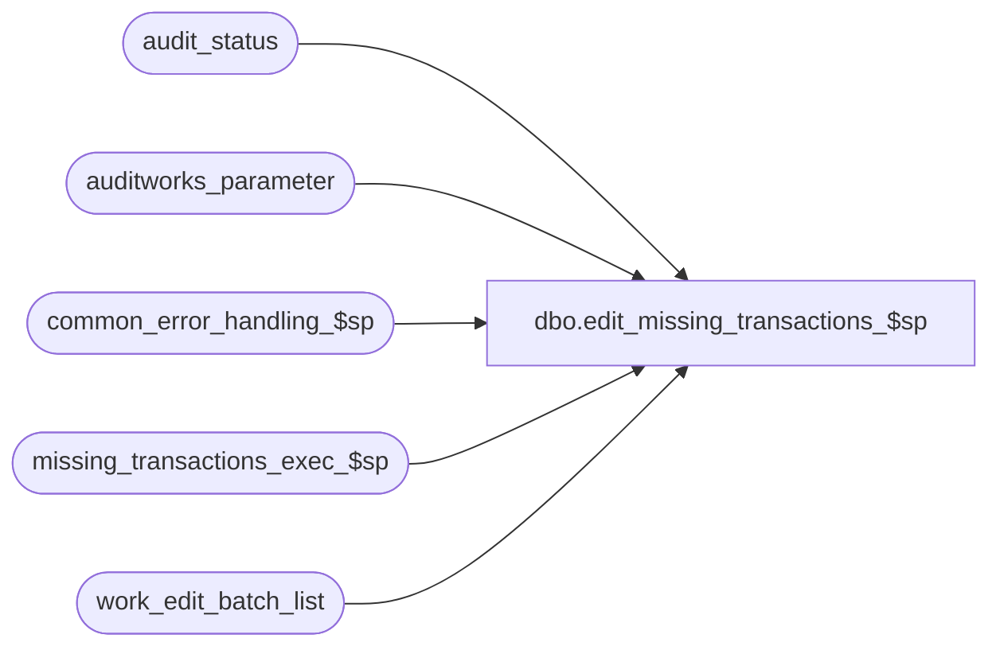

# dbo.edit_missing_transactions_$sp

**Database:** auditworks_external  
**Server:** bedrockdb01  

## Architecture Diagram



## Table Dependencies

| Referenced Table |
|---|
| audit_status |
| auditworks_parameter |
| common_error_handling_$sp |
| missing_transactions_exec_$sp |
| work_edit_batch_list |

## Stored Procedure Code

```sql
create proc dbo.edit_missing_transactions_$sp 
 @process_id      binary(16),
 @user_id         int,
 @errmsg          nvarchar(2000) OUTPUT,
 @edit_process_no tinyint = 1

AS

  /* 
    
    Proc Name : edit_missing_transactions_$sp
         Desc : To identify missing transactions in store-reg-dates
                that were just edited. Recalculates for existing store-reg-dates.
                Called by edit_phase2_$sp.

    HISTORY

    Date     Name         Def#  Desc
    Dec17,14 Paul         94103 use try catch
    Jan08,10 Vicci       115175 Don't evaluate missing for dates earlier than the live date if a live date is specified.
    Jan06,10 Vicci       115118 If the evaluation of non-sequential transaction series is turned off then don't 
                                evaluate the store/date for missing transaction if no transactions with a non-sequential
                                series have been added to it.
    Jan12,07 Paul         81764 Apply 76394 to SA5
    Jan25,04 Sab	DV-1203 Added logic for scaleout transaction_range.
    Dec13,04 Maryam     DV-1191 Improve performance. Added logic for scaleout transaction_range.
    Sep23,04 David      DV-1146 Use user_id instead of user_name. Remove reference to active flags.
    May18,04 Maryam     DV-1071 Calculate missing even when transaction for server register is in
                                different batch from other register in the loop.
    Sept05,06 Vicci       76394 Avoid deleting range for all series then only putting back series in 
                                current batch.
    Dec17,03 Paul        19908  improve performance with locking hints, move update out of loop
    Aug26,03 David  13525/11871 Add date_reject_id to Where clause of the Delete of transaction_range.
    AUG20,02 Daphna    1-BMAEV  Ensure that assigned register has status of edited(100) or
                                missing (5) when missing_qty <> 0
                                pass all_reg = 0 when edit only 1 reg for that store/date
    Nov26,01 Winnie    1-969YY  Add logic for R3 error handling to pass @edit_process_no
    Nov27,01 Ian K     1-97UU6  Edit Phase 2 batching for R3
    NOV21,01 Daphna       8952  Error Handling changes
    Nov01,01 Daphna       8629  Call missing_transactions_exec_$sp instead of calculating 
    Apr26,01 David M      7589  Missing transactions by transaction series Version 1.0 (missing handling).
                                Different cursor_open flag for all 3 cursors instead of 1 used by all 3.
    Jan30,01 Henry        6765  Create missing trxns, for the assigned register grouping (consolidated registers)
    Sep29,00 Sab          6781  Correct ISNULL code, to avoid Arithmetic Overflow problem on older Sybase versions.
    Aug30,00 Paul         6666  change some comments
    Mar01,00 Phu          5900  Change @@fetch_status > 0 to @@fetch_status <> 0 for MS SQL compatibility
    Jan17,00 Henry        5840  Recalculate missing trxns for NEXT DATE properly.
    Sep01,99 Jing         5302  Correct number of missing transactions on rollover day
    Aug11,99 Paul         5040  avoid null values
    Aug04,99 Paul         5034  speed improvement
    Jul05,99 Daphna       4907  Add logic to record missing tran between prev day last
                                and max tran on rollover day
    Sep25,98 Shapoor
             Paul               Author
  
  */

DECLARE
  @cursor_open_sr       tinyint,
  @date_reject_id       tinyint,
  @errmsg2              nvarchar(2000),
  @errline              int,
  @errno                int,
  @store_no             int,
  @transaction_date     smalldatetime,
  @message_id           int,
  @operation_name       nvarchar(100),
  @object_name          nvarchar(255),
  @process_name         nvarchar(100),
  @process_no           int,   
  @log_error_flag       tinyint,
  @eval_non_seq_range	tinyint,
  @discard_prior_to_live_date smalldatetime;

  SELECT @message_id     = 201068,
         @process_name   = 'edit_missing_transactions_$sp',
         @process_no	 = 5, --- edit
         @log_error_flag = 1;  -- called by edit smartload

BEGIN TRY

    SELECT @errmsg         = 'Failed to set @eval_non_seq_range',
           @object_name    = 'auditworks_parameter',
           @operation_name = 'SELECT';  
  IF EXISTS (SELECT 1 
      	       FROM auditworks_parameter
              WHERE par_name = 'log_nonsequential_series_range'
                AND par_value = '0')
    SELECT @eval_non_seq_range = 0;
  ELSE
    SELECT @eval_non_seq_range = 1;

    SELECT @errmsg         = 'Failed to determine whether or not a live date has been specified for the purpose of discarding non-closeout transactions dated after the last date closed but prior to the live date';
  SELECT @discard_prior_to_live_date = par_value
    FROM auditworks_parameter
   WHERE par_name = 'discard_prior_to_live_date'
     AND COALESCE(LTRIM(par_value), '') <> '';

    SELECT @errmsg         = 'Failed to open cursor store_date_crsr',
           @object_name    = 'store_date_crsr',
           @operation_name = 'OPEN CURSOR';
  DECLARE store_date_crsr CURSOR FAST_FORWARD
    FOR
    SELECT DISTINCT ed.transaction_date,	
          ed.store_no,
          ed.date_reject_id
      FROM work_edit_batch_list ed WITH (NOLOCK)
     WHERE (IsNull(sequential_series_present, 1) = 1 OR @eval_non_seq_range = 1)
       AND (@discard_prior_to_live_date IS NULL OR ed.transaction_date >= @discard_prior_to_live_date)
     ORDER BY ed.transaction_date, ed.store_no, ed.date_reject_id;

  --
  -- Identify missing transactions in valid store-reg-dates
  --
 
  OPEN store_date_crsr;
  SELECT @cursor_open_sr = 1;

  SELECT @errmsg         = 'Failed to EXEC missing_transactions_exec_$sp',
         @object_name    = 'missing_transactions_exec_$sp',
         @operation_name = 'EXECUTE';

  WHILE 1=1
  BEGIN

    FETCH store_date_crsr 
     INTO @transaction_date,
          @store_no,
          @date_reject_id;

    IF @@fetch_status <> 0
      BREAK;

    EXEC missing_transactions_exec_$sp @process_id, @user_id, @store_no, @transaction_date, 
    					null, --register_no 
    				        @date_reject_id, @errmsg OUTPUT, 
    				        1, --all_series 
                                        @process_no, null, --transaction_series,
                                        @log_error_flag, @edit_process_no, 
                                        1; --all_reg
  END; -- /* While 1=1 */

  CLOSE store_date_crsr;
  DEALLOCATE store_date_crsr;       
  SELECT @cursor_open_sr = 0;

  -- Ensure that audit_status is edited for assigned registers where missing was logged

      SELECT @errmsg         = 'set audit_status = 100 when missing_qty <> 0',
             @object_name    = 'audit_status',
             @operation_name = 'UPDATE';   
  UPDATE audit_status
   SET audit_status = 100
    FROM work_edit_batch_list ed WITH (NOLOCK), audit_status a
   WHERE ed.date_reject_id = 0
     AND ed.transaction_date = a.sales_date
     AND ed.store_no         = a.store_no 
     AND ed.date_reject_id   = a.date_reject_id
     AND a.audit_status = 900  -- unused
     AND a.missing_qty <> 0
     AND a.date_reject_id = 0;


  RETURN;


business_error:   /* Business Rule handler. */

	SELECT @errmsg2 = @errmsg;

	/* Could include similar cleanup code to system error trap when needed (example is from move_store_$sp).
	   However, could also exclude the cleanup code here since the outer system error catch should fire again after the exec below. */

	EXEC common_error_handling_$sp @process_no, @errno, @errmsg, 0, @message_id,
	        @process_name, @object_name, @operation_name, @log_error_flag, @edit_process_no;
	  /* Note: when the exec above raises an error, that action also fires the system error trap (below) */
	RETURN;
END TRY

BEGIN CATCH; -- trap system errors
    /* common error handling. Appending proc name here because a rollback could occur if called within a transaction. */

        SELECT @errno = ERROR_NUMBER(),
		@errline = ERROR_LINE();

        SELECT @errmsg = CONVERT(nvarchar, @errno) + ':' + @process_name + ':' + CONVERT(nvarchar, @errline) + ':'
               + COALESCE(@errmsg, ' ') + ':' + ERROR_MESSAGE();

	 /* this condition will only be true when raise error in traps above fire this general catch */
	IF @errmsg2 IS NOT NULL
	  SELECT @errmsg = @errmsg2;

	IF @cursor_open_sr = 1
	  BEGIN
	    CLOSE store_date_crsr;
	    DEALLOCATE store_date_crsr;
	  END;
		
	EXEC common_error_handling_$sp @process_no, @errno, @errmsg, 0, @message_id,
	        @process_name, @object_name, @operation_name, @log_error_flag, @edit_process_no;

	RETURN;
END CATCH;
```

