# dbo.edit_phase2_$sp

**Database:** auditworks_external  
**Server:** bedrockdb01  

## Architecture Diagram

```mermaid
flowchart LR
    SP["dbo.edit_phase2_$sp"]
    Ex_Queue(["Ex_Queue"]) --> SP
    ORG_CHN_HRCHY_LVL_GRP(["ORG_CHN_HRCHY_LVL_GRP"]) --> SP
    audit_status(["audit_status"]) --> SP
    auditworks_parameter(["auditworks_parameter"]) --> SP
    auditworks_system_flag(["auditworks_system_flag"]) --> SP
    calc_guided_start_date__sp(["calc_guided_start_date_$sp"]) --> SP
    calculate_timestamp__sp(["calculate_timestamp_$sp"]) --> SP
    cleanup_process_log__sp(["cleanup_process_log_$sp"]) --> SP
    common_error_handling__sp(["common_error_handling_$sp"]) --> SP
    cust_liab_processing_rule(["cust_liab_processing_rule"]) --> SP
    cust_liability_edit__sp(["cust_liability_edit_$sp"]) --> SP
    dayend_workload(["dayend_workload"]) --> SP
    edit_exceptions__sp(["edit_exceptions_$sp"]) --> SP
    edit_missing_reg__sp(["edit_missing_reg_$sp"]) --> SP
    edit_missing_transactions__sp(["edit_missing_transactions_$sp"]) --> SP
    edit_sa_rejects__sp(["edit_sa_rejects_$sp"]) --> SP
    edit_status(["edit_status"]) --> SP
    edit_store_date_list(["edit_store_date_list"]) --> SP
    edit_trickle_lock_store__sp(["edit_trickle_lock_store_$sp"]) --> SP
    edit_verify_registers__sp(["edit_verify_registers_$sp"]) --> SP
    edit_zzzz_status(["edit_zzzz_status"]) --> SP
    fix_future_dates__sp(["fix_future_dates_$sp"]) --> SP
    function_status(["function_status"]) --> SP
    function_status_rec(["function_status_rec"]) --> SP
    function_status_rec_detail(["function_status_rec_detail"]) --> SP
    if_cleanup_status(["if_cleanup_status"]) --> SP
    if_entry_datatype(["if_entry_datatype"]) --> SP
    interface_directory(["interface_directory"]) --> SP
    interface_status(["interface_status"]) --> SP
    mass_correct_line_object__sp(["mass_correct_line_object_$sp"]) --> SP
    parameter_general(["parameter_general"]) --> SP
    process_log(["process_log"]) --> SP
    process_status_log(["process_status_log"]) --> SP
    process_step_log(["process_step_log"]) --> SP
    reconciliation__sp(["reconciliation_$sp"]) --> SP
    recovery_rec_audit_status(["recovery_rec_audit_status"]) --> SP
    smartload_var(["smartload_var"]) --> SP
    start_process_log__sp(["start_process_log_$sp"]) --> SP
    store_audit_status(["store_audit_status"]) --> SP
    transaction_header(["transaction_header"]) --> SP
    update_memo_edit__sp(["update_memo_edit_$sp"]) --> SP
    work_edit_batch_list(["work_edit_batch_list"]) --> SP
    work_edit_store_date_list(["work_edit_store_date_list"]) --> SP
    work_rec_incomplete(["work_rec_incomplete"]) --> SP
```



## Table Dependencies

| Referenced Table |
|---|
| Ex_Queue |
| ORG_CHN_HRCHY_LVL_GRP |
| audit_status |
| auditworks_parameter |
| auditworks_system_flag |
| calc_guided_start_date_$sp |
| calculate_timestamp_$sp |
| cleanup_process_log_$sp |
| common_error_handling_$sp |
| cust_liab_processing_rule |
| cust_liability_edit_$sp |
| dayend_workload |
| edit_exceptions_$sp |
| edit_missing_reg_$sp |
| edit_missing_transactions_$sp |
| edit_sa_rejects_$sp |
| edit_status |
| edit_store_date_list |
| edit_trickle_lock_store_$sp |
| edit_verify_registers_$sp |
| edit_zzzz_status |
| fix_future_dates_$sp |
| function_status |
| function_status_rec |
| function_status_rec_detail |
| if_cleanup_status |
| if_entry_datatype |
| interface_directory |
| interface_status |
| mass_correct_line_object_$sp |
| parameter_general |
| process_log |
| process_status_log |
| process_step_log |
| reconciliation_$sp |
| recovery_rec_audit_status |
| smartload_var |
| start_process_log_$sp |
| store_audit_status |
| transaction_header |
| update_memo_edit_$sp |
| work_edit_batch_list |
| work_edit_store_date_list |
| work_rec_incomplete |

## Stored Procedure Code

```sql
create proc dbo.edit_phase2_$sp 
  @process_id binary(16),
  @user_id	int,
  @errmsg        nvarchar(2000) OUTPUT,
  @request_type  tinyint = 1 -- Full edit, 2 Express Add, 3 Edit from input
                             -- 4 edit_phase2 automatically runs for completed store/dates  
                             -- 5 edit_phase2 recovery for failed phase 2 of request_type (2, 3, 4)
			     -- 6 trickle audit cleanup
AS

  /*

    Proc Name : edit_phase2_$sp
    Desc      : (EDIT - Phase 2 ) to flag preaudit interfaces as complete, to flag exceptions,
                updates audit_status (quantities, status, autoaccepts) for all edited store-dates.
                Posts and then unlocks a batch of store-dates at a time in order to allow auditing
                to start even if more store-dates remain to be processed.
                Calls cust_liability_edit_$sp to post customer liability transactions.
                Runs after polling, translate(s) and edit phase1 batches have finished.
                Called by edit_post_$sp.

	Edit phase2 on stream 1 waits for other edit streams to each process a ZZZZ file in order to
	 avoid updating interface_status to complete until data has been received on all edit streams.
	 If a phase2 does not run on all streams due to polling issues or edit errors, then the next edit 
	 phase2 on stream 1 could possibly wait too long due to times in edit_zzzz_status being out of sync. 
	 
	This select will show any mismatched date-times when investigating waiting for phase2 scenarios. 

	SELECT edit_process_no, last_zzzz_date 
	FROM edit_zzzz_status  

	  To abort the wait for phase2 (workaround) and to resynchronize the times for all edit streams :

	UPDATE edit_zzzz_status 
	SET last_zzzz_date = dateadd(dd,-1,getdate()) 


Please ensure that the proc script contains the following at the top in order to support scaleout:
SET ANSI_NULLS ON
SET ANSI_WARNINGS ON 
 
HISTORY :
Date     Name         Defect Desc
May14,15 Phu          119267 Log the total wait time for other streams to finish phase 2 in multiple of 2 instead of of 5 minutes
Dec10,14 Paul      TFS-94103 remove call to edit_trickle_exceptions_$sp because each edit stream already calls it from edit_post_$sp,
                              corrected @cursor_open logic
Nov20,14 Paul      TFS-93074 prevent deadlock when updating edit_store_date_list
Oct30,14 Paul      TFS-65489 call edit_store_stream_$sp to support multistream trickle edit
Feb03,14 Vicci        149617 Don't lock store/dates which exist in function_status under a C/L mass processing function since those functions do
                             not lock store dates and therefore were not interrupted by the edit.
                             Fix 1-483Y61: fix @ParmDefinition to define @errmsg3 and correct dynamic sql call to cust_liability_unattended_$sp.
Jan14,14 Vicci/Paul   147019 Set @current_date before using it, use @errmsg3 when calling procs to avoid losing local value of @errmsg.
Dec20,13 Paul         147019 Use try catch since edit_post_$sp uses try catch.
Jun20,13 Paul         140622 Changed phase 2 wait timeout from 6 hours to 3 hours and loop sleep interval from 5 min to 2 min
Nov16,12 Vicci        139679 Also clean up orphaned status records for invalid store/registers.
Jan29,12 Paul       1-483Y61 Change calls to cust_liab_unattended_$sp to dynamic sql in order to eliminate dummy proc in SA_EDIT
Jul07,11 Vicci        128303 Don't attempt to prematurely recover media rec updates of audit-status over/shorts when the store/date is still locked
                             by the Edit (since recovery uses function 70) as may happen with request types other than 1.  Avoids extra time spent
                             on each trickle batch until real Phase2 (request type 1) occurs.
Aug20,10 Vicci        119571 Add input_id to other cust_liab_unattended_$sp call too.
Aug02,10 Vicci        119571 Add input_id to cust_liab_unattended_$sp call.
Jul23,10 Vicci        119571 Call cust_liab_unattended_$sp even if there is no data to Phase2.
Jun17,10 Paul       1-44YOPF exclude store-dates locked by dayend from media rec recovery
Jun02,10 Paul         118310 improved smartload messages, limit the number of batch messages that are logged to smartload log 
Jun01,10 Vicci        118310 Only attempt to recover left-behind status 2 store/dates ONCE (set i_recover_flag = 0);  Commit
store-audit-status unlock. In the case where a pre-existing halted process requires relocking a store/date,
                             always unlock store/date before re-locking it to avoid the store_audit_status trigger raising a 201550 error.
                             Don't attempt to fix_future_dates_$sp until AFTER the store/dates have been unlocked, since the possibility
                     of the same date also being in the current edit batch exists in which case a halted process would result.
Apr29,10 Vicci        117496 Determine whether any halted processes for the store/date being edited exist and if so don't unlock it.
Apr05,10 Vicci        115860 Since work_rec_transaction only contains transactions in the case where balancing entities couldn't
                             be locked, it is not sufficient to detect store/dates affected by hard errors.  Therefore, 
                             look at function_status_rec_detail.
Apr05,10 Vicci        115666 Call edit_verify_registers_$sp before unlocking posted_flag = 2 entries (i.e. those left behind
                             by a previously failed Media Rec posting since recovered by edit_post_$sp). 
                             Attempt to verify and unlock the left-behind records even if there are current new batch entries to be posted
                             (previously @incomplete_media_rec = 0 whenever an expect workload is present).
Jan07,10 Vicci        115118 Added sequential_series_present to allow for determination of whether transaction missing needs to be evaluated.
Dec09,09 Vicci        114698 Recover recovery_rec_audit_status entries skipped by function cleanup for having been locked by edit
Nov02,09 Paul         113453 Uplift 1-41ROAM to SA5
Aug28,09 Vicci        109078 Limit the number of order-auto-completion revalidations performed (for example don't do it 
                             if calld by edit post with request 4 but not stores have been compleed.
Aug26,09 Vicci	      109078 Tell mass correct line object it is being called by the edit to avoid it trying to lock store/dates already locked by edit.
                             Log request type to smartload log.
Jul21,09 Vicci        109078 Execute mass_correct_line_object_$sp in order to re-attempt failed order fulfillment/cancellation 
              transaction auto-completion requests.
Jul08,09 Vicci        111272 Correct call to reconciliation proc (user_id)
Jan29,08 Paul          98023 Uplift 107824, 1-3WGK0B to SA5
Oct22,07 Paul          93924 Print timings to smartload log
Aug14,06 Tim	     DV-1342 apply 73555 to SA5
Apr05,06 Paul          69688 apply 69650 to SA5, removed obsolete variables
Mar03,06 Paul        DV-1328 Apply 68461 to SA5, improved comments, error handling
Oct24,05 Paul          62153 Applied 1-36A0CF to SA5
Apr29,05 Paul        DV-1234 expand transaction_id to use tran_id_datatype
Apr07,05 Sab	     DV-1218 Scaleout -remove str/dates from audit_status and store_Audit_status that belong to other servers
Mar03,05 Paul        DV-1206 apply 47977 to SA5
Dec14,04 Maryam      DV-1191 Improve performance.
Sep28,04 David       DV-1146 Use user_id.
Sep03,04 Paul        DV-1120 update hierarchies to refresh screens
Jul22,04 Maryam      DV-1071 Remove the call to employee_update_$sp, receive @process_id and pass it to the sub procs.
Apr08,04 Sab	     DV-1068 Remove references to old cust liability, old media rec
Nov02,09 Paul       1-41ROAM log end of multistream wait to smartload log. Wait for 6 hours max.
Jan28,09 Paul         107824 trickle audit : always recalculate qty columns in audit_status to handle possible timing scenarios
Apr17,08 Paul       1-3WGK0B improve performance by purging dead rows outside the loop, avoid incorrect 'unused' status.
Mar25,08 Paul          98526 Remove call of obsolete SA3.5 customer liability proc
Apr03.07 Daphna        83875 Do not treat invalid reg as old media rec
Jan16.07 Daphna 81986 Handle multi-stream correctly
Jun14,06 Vicci         73555 Recover any orphaned (no corresponding halted process)
			     recovery_rec_audit_status entries posted since this fix was introduced
Apr05,06 Paul          69650 clarified comments, don't wait if @request_type = 6, make mssql multistream match Oracle
Feb28,06 Vicci	       68461 Don't remove audit status records for store/reg/dates that have
			     not yet had their summary statistics logged to audit status, for
			     example in the case where phase 2 is running at the end of phase1
			     in order to auto-phase2-completed store/dates but not all store/dates
			     are complete.
Oct19,05 Vicci	    1-36A0CF Remove changes introduced by defect 25434 since the defect did  
			     not apply to MSSQL (which has an edit timestamp with milliseconds)
			     and since the C/L liability posting needs to be called even in
			     trickle audit mode since a portion of its logic only executes 
			     if called by phase2 and not when called by edit_post_$sp.
Jan31,05 Daphna        47977 Recovery logic for incomplete media rec portion
Mar11,04 Maryam        25434 Do not run C/L posting if in trickle audit mode as it already ran in phase 1.
Dec29,03 Paul        DV-1007 do not delete failed media rec store-dates from edit_store_date_list.
                             If work_edit_store_date_list is empty, then return. 
Oct27,03 David         17189 Add @glc_timestamp to call to cust_liability_edit_$sp
Jul10,03 Maryam      1-KL08H Modified to receive @media_rec_not_converted and set 
                 media_rec_active_flag accordingly. Do not unlock the store/date
                             until the media rec is complete.
Mar27,03 Maryam         6248 Call cust_liab_unattended_$sp.
Oct16,02 Paul S      1-G0NHP ensure that missing calc is last step before verifying registers,
                              clean up process_step log logic
Sep26,02 HenryW	     1-EVLT5 Check if there are any future store/dates to re-validate.
Sep25,02 David C     1-FGEBU Change process step no 39 to 25.
Mar04,02 Paul S      1-BE0YK set trickle_in_progress = 0 in audit_status, corrected error trap,
				also retrofitted to 2.50
Jan25,02 Paul S      1-AIKBN removed commits and begin tran to reduce contention,
				moved delete of edit_store_date_list to end 
				of proc to reduce timing issues with multistream edit
Jan08,02 Ian K   1-9PZP0 Move missing_reg update to be outside of batch. Just once for entire day.
Nov27,01 Ian K       1-97UU6 Edit Phase 2 batching for R3, add logic for R3 error handling
Aug30,01 David C        8584 Call cust_liability_edit_$sp for R3 customer liability
Jul10,01 ShuZ           8274 Edit from input_ tables handling (Phase2 only selected store/dates)
Feb08,01 ShuZ           6600 Express Add,do not use wait logic and only set posting_in_progress
                                in interface_status when using express add logic  
Dec18,00 Paul           7110 Remove call to edit_if_rejects_$sp, do glc first 
Dec13,00 Paul           7108 Avoid leaving locked store dates if all tran went to invalid dates
Nov30,00 Paul           7009 Multistream: avoid deleting audit_status for register_dates
                                 which have not yet been processed by edit phase2.
Nov17,00 Paul           7005 update edit_status at start and end of phase2
Nov01,00 Sab            6932 Performance improvement phase2 UPDATE transaction_header
Jun08,00 Vicci          6410 Changed call to edit_glc_$sp to a call to Edit_glc_$sp
Mar01,00 Phu            5900 Change @@fetch_status > 0 to @@fetch_status <> 0 for MS SQL compatibility
Jan11,00 Louise         5790 Change code to unconditionally run a phase2 regardless of time. 
Oct28,99 Louise M.      5526 New enhancement to support Gift Card in the voucher table.
Jun01,99 Paul           4795 avoid leaving locked store_audit_status
May26,99 Louise M. 4526 new code added to support trickle edit. 
Feb17,99 Shapoor
   Paul                Author
  */

DECLARE
  @batch_process_id             tinyint,
  @batch_count			int,
  @concurrent_edit_processes    tinyint,
  @current_date		        datetime,
  @current_day_autoaccept_time  smallint,
  @current_time			smallint,
  @cursor_open                  tinyint,
  @date_reject_id               tinyint,
  @dayend_in_progress		tinyint,
  @expected_workload		int,
  @errmsg2			nvarchar(2000),
  @errmsg3			nvarchar(2000),
  @errline			int,
  @errno				int,
  @fix_future_date_required     int,
  @full_phase2_run              bit,
  @glc_timestamp                float,
  @halted_entry_date		smalldatetime,
  @halted_process_id		binary(16),
  @incomplete_media_rec         tinyint,
  @incomplete_media_rec_status  tinyint,
  @instance_id			int,
  @last_refresh_time            datetime, 
  @last_zzzz_date		datetime,
  @latest_timestamp             float,
  @max_if_entry_no              if_entry_datatype,
  @message_limit		int,
  @min_process_start_time	datetime,
  @min_transaction_date         smalldatetime,
  @phase2_recovery		tinyint,
  @ParmDefinition		NVARCHAR(500),
  @process_end_time             datetime,
  @process_no                   smallint,
  @process_start_time           datetime,
  @process_status_flag     	tinyint,
  @process_timestamp            float,
  @register_no                  smallint,
  @rows				int,
  @scaleout_flag		int,
  @sales_date                   smalldatetime,
  @sales_date_crsr		smalldatetime,
  @SQLString			NVARCHAR(500),
  @store_no                     int,
  @stream_no			smallint,
  @trace_msg			nvarchar(255),
  @transaction_count            int,
  @transaction_date             smalldatetime,
  @trickle_finished_flag        tinyint,       -- Always 1 if not trickle auditing
  @trickle_polling_flag         tinyint,       -- 0,1 = not trickle polling, 2 = trickle auditing
  @wait_counter			smallint,
  @wait_flag			tinyint,
  @ignore_missing_registers     tinyint,
  @phase2_batch_size            int,
  @batch_size                   int,
  @complete                     int,
  @sa_reject_count              int,
  @valid_qty                    int,
  @object_name                 nvarchar(255),
  @process_name                 nvarchar(100),
  @operation_name               nvarchar(100),
  @message_id			int,
  @run_cust_liab_unattended     tinyint,
  @recover_process_id		int,
  @rec_process_id		numeric(12,0),
  @recover_workload		int,
  @update_in_progress		smallint,
  @input_id			numeric(12,0); --not used by edit but required by cust_liab_unattended_$sp when called by UI.
  
  SELECT @current_date     = getdate(), 
         @process_status_flag = 1,
         @transaction_count   = 0,
         @process_no          = 5,
         @process_name     = 'edit_phase2_$sp',
         @message_id       = 201068;   -- Edit phase 2

  SELECT @process_start_time  = @current_date;
  
BEGIN TRY

  SELECT @current_time     = DATEPART(hh, getdate()) * 100 + DATEPART(mi, getdate()),
         @full_phase2_run  = 0,
	@batch_count      = 0,
         @batch_process_id = 1,
         @batch_size       = 0,
         @ParmDefinition   = N'@process_id binary(16), @user_id int, @errmsg3 nvarchar(2000) OUTPUT, @input_id numeric(12,0) OUTPUT',
         @run_cust_liab_unattended = 0,
         @incomplete_media_rec = 0,
         @incomplete_media_rec_status = 0,
         @wait_counter       = 0, 
         @update_in_progress = 0,
         @last_refresh_time  = DATEADD(dd, -1, getdate()),
         @message_limit      = 80; -- no of batches that appear in smartload log

  SELECT @errmsg         = 'Failed to read table parameter_general.',
           @object_name    = 'parameter_general',
           @operation_name = 'SELECT';
  SELECT @concurrent_edit_processes = concurrent_edit_processes,
    @trickle_polling_flag        = ISNULL(trickle_polling_flag       , 0),
         @ignore_missing_registers    = ISNULL(ignore_missing_registers   , 0),
         @current_day_autoaccept_time = ISNULL(current_day_autoaccept_time, 2100)
    FROM parameter_general;

  SELECT @rows = @@rowcount;
  IF @rows = 0
      GOTO business_error;

         SELECT @errmsg = 'Failed to select instance_id from auditworks_system_flag',
	     @object_name = 'auditworks_system_flag',
	     @operation_name = 'SELECT';
  SELECT @instance_id = CONVERT(int,flag_numeric_value)
    FROM auditworks_system_flag
   WHERE flag_name = 'instance_id';

  SELECT @rows = @@rowcount;
  IF @rows = 0
      GOTO business_error;

     SELECT @errmsg = 'Failed to select scaleout_flag from auditworks_system_flag',
	    @object_name = 'auditworks_system_flag',
	    @operation_name = 'SELECT';
  SELECT @scaleout_flag = CONVERT(int,flag_numeric_value)
    FROM auditworks_system_flag
   WHERE flag_name = 'scaleout_flag'

  SELECT @rows = @@rowcount;
  IF @rows = 0
      GOTO business_error;

  /* If running multistream edit, then wait for other streams to finish edit phase 1 before running phase2 on stream 1. */

  IF @concurrent_edit_processes >= 2 -- Multi-stream edit
  BEGIN
    IF @request_type = 1 -- normal overnight edit
    BEGIN
   
      SELECT @wait_flag = 1;

      SELECT @trace_msg = NCHAR(13) + NCHAR(10) + ':LOG &&: Edit phase 2 - Multistream Verification : ' + CONVERT(nchar, getdate(), 8);
      PRINT @trace_msg;
	
      --
      -- If other edit streams are still processing batches, then wait 2 minutes
      --
    	
      WHILE @wait_flag = 1
      BEGIN

        SELECT @wait_flag = 0, @stream_no = 2;

        WHILE @stream_no <= @concurrent_edit_processes
        BEGIN

	  SELECT @last_zzzz_date = last_zzzz_date
	    FROM edit_zzzz_status
	   WHERE edit_process_no = @stream_no;
   	  SELECT @rows = @@rowcount;

	  IF @rows = 0
	  BEGIN
	    INSERT edit_zzzz_status
	    SELECT @stream_no, DATEADD(dd,-1,getdate());
	  END

	  SELECT @min_process_start_time = MIN(process_start_time)
	   FROM process_log  WITH (NOLOCK)
	  WHERE process_no = 5
	    AND batch_process_id = @stream_no
	    AND process_start_time > @last_zzzz_date;
	    
	  IF @min_process_start_time IS NULL
	    SELECT @wait_flag = 1;
	
	  SELECT @stream_no = @stream_no + 1;
        END; -- While @stream_no <= @concurrent_edit_processes

        IF @wait_flag = 1
	BEGIN
	  SELECT @wait_counter = @wait_counter + 1;
	  WAITFOR DELAY '0:02:00'; -- 2 min
	  -- wait for 180 minutes max
	  IF @wait_counter >= 90 
	    SELECT @wait_flag = 0;
	END;
      END; -- While @wait_flag = 1

      -- LOOP 2

      SELECT @stream_no = 2;
 
      WHILE @stream_no <= @concurrent_edit_processes -- Loop 2
      BEGIN
      
	SELECT @last_zzzz_date = last_zzzz_date
	  FROM edit_zzzz_status WITH (NOLOCK)
	 WHERE edit_process_no = @stream_no;

	SELECT @min_process_start_time = MIN(process_start_time)
	  FROM process_log WITH (NOLOCK)
	 WHERE process_no         = 5
	   AND batch_process_id   = @stream_no
	   AND process_start_time > @last_zzzz_date;

	  SELECT @errmsg         = 'Failed to update edit_zzzz_status',
		 @object_name  = 'edit_zzzz_status',
		 @operation_name = 'UPDATE';
	UPDATE edit_zzzz_status
	  SET last_zzzz_date = ISNULL(@min_process_start_time,getdate())
	 WHERE edit_process_no = @stream_no;

	SELECT @stream_no = @stream_no + 1;
      END; -- While @stream_no <= @concurrent_edit_processes (Loop 2)

      IF @wait_counter > 0
      BEGIN
        SELECT @trace_msg = NCHAR(13) + NCHAR(10) + ':LOG &&: Multistream : Waited for ' + CONVERT(nvarchar, @wait_counter * 2)
	      + ' minutes until ' + CONVERT(nchar, getdate(), 8);
        PRINT @trace_msg;
      END;

    END; -- If @request_type = 1
  END;   -- If @concurrent_edit_processes >= 2

  SELECT @trace_msg = NCHAR(13) + NCHAR(10) + ':LOG &&: Edit phase 2 for request type ' + CONVERT(nvarchar, @request_type) + ' - Processing starts : ' + CONVERT(nchar, getdate(), 8);
 PRINT @trace_msg;

  IF @request_type = 6
    SELECT @request_type = 1;

  --
  -- calculate process_timestamp as month-day-hour-min-sec-millisec
  --
    SELECT @errmsg         = 'Failed to execute stored procedure calculate_timestamp_$sp',
           @object_name    = 'calculate_timestamp_$sp',
          @operation_name = 'EXECUTE';
  EXEC calculate_timestamp_$sp @process_timestamp OUTPUT;

    SELECT @errmsg         = 'Failed to insert process_log',
           @object_name    = 'process_log',
           @operation_name = 'INSERT';
  INSERT  process_log 
         (process_no, 
          process_timestamp,
          process_start_time,
          process_end_time,
          process_status_flag,
          file_name,
	  file_size,
          batch_process_id)
  VALUES (@process_no,
          @process_timestamp,
          @process_start_time,
          @process_start_time,
          @process_status_flag,
          NULL,
          NULL,
	  @batch_process_id);

    SELECT @errmsg         = 'Failed to update edit_status (start)',
           @object_name    = 'edit_status',
           @operation_name = 'UPDATE';
  UPDATE edit_status
  SET edit_status           = 1,
         last_posting_datetime = @process_start_time
   WHERE edit_function_no = 5
     AND edit_process_no  = @batch_process_id;

  IF @trickle_polling_flag >= 2
    SELECT @trickle_finished_flag = 1;
  ELSE
    SELECT @trickle_finished_flag = 1; -- If not trickle polling

  -- Validate if any future dates are now valid. First check setup in auditworks_parameter table.
 IF EXISTS (SELECT 1
  	       FROM auditworks_parameter
  	      WHERE par_name = 'fix_future_dates'
  	        AND par_value = '1')
    SELECT @fix_future_date_required = 1;
  ELSE
    SELECT @fix_future_date_required = 0;

  -- Flag preaudit interfaces as available for posting

  IF @request_type = 1
   BEGIN
      SELECT @errmsg         = 'Failed to update interface_status 1 to 2 ',
             @object_name    = 'interface_status',
             @operation_name = 'UPDATE';
    UPDATE interface_status 
       SET posting_in_progress   = 2, -- finished for the day
           last_posting_datetime = @current_date
     FROM interface_status st,
           interface_directory id
     WHERE st.interface_id   = id.interface_id
       AND id.update_timing = 1;
	     
   END;
  ELSE  
   BEGIN
      SELECT @errmsg         = 'Failed to update last_posting_datetime in interface_status ',
             @object_name    = 'interface_status (last_posting_date)',
             @operation_name = 'UPDATE';
    UPDATE interface_status
       SET last_posting_datetime = @current_date
      FROM interface_status st,
           interface_directory id	  
     WHERE st.interface_id  = id.interface_id
       AND id.update_timing = 1;
	     
   END; -- else of If @request_type = 1

  -- Grab a list of store-reg-dates to process
  -- but do not grab rows for edit batches that are in progress and have not yet completed processing.
  -- check sysdate to handle aborted batches from previous days

   SELECT @errmsg         = 'Failed to update edit_store_date_list (posted_flag = 1)',
           @object_name    = 'edit_store_date_list',
           @operation_name = 'UPDATE';  
  BEGIN TRAN /* use a lock row to prevent deadlocks */
  UPDATE auditworks_system_flag
    SET flag_datetime_value = getdate(),
        flag_numeric_value = 1
   WHERE flag_name = 'last_edit_list_update';

  UPDATE edit_store_date_list
     SET posted_flag = 1 -- flag as phase2 in progress
   WHERE posted_flag = 0
      AND (processing_request = 1 OR @request_type = 1)
   AND (batch_ended >= batch_started -- ignore any batches that are in progress
            OR batch_started IS NULL OR batch_started < DATEADD(dd,-1,getdate()));
  COMMIT;

    SELECT @errmsg         = 'Failed to truncate work_edit_store_date_list',
        @object_name    = 'work_edit_store_date_list',
        @operation_name = 'TRUNCATE';
  TRUNCATE TABLE work_edit_store_date_list;

    SELECT @errmsg         = 'Failed to truncate work_edit_batch_list',
           @object_name    = 'work_edit_batch_list';
  TRUNCATE TABLE work_edit_batch_list;

  /* Copy all unposted rows from edit_store_date_list to work_edit_store_date_list */

    SELECT @errmsg         = 'Failed to INSERT work_edit_store_date_list FROM edit_store_date_list',
           @object_name    = 'work_edit_store_date_list',
           @operation_name = 'INSERT';
  INSERT INTO work_edit_store_date_list(
              store_no,
              register_no,
              transaction_date,
              date_reject_id,
              posted_flag,
              trickle_counts_flag,
              status_already_existed,
              processing_request,
              sequential_series_present)
       SELECT store_no,
              register_no,
              transaction_date,
              date_reject_id,
              posted_flag,
              trickle_counts_flag,
              status_already_existed,
              processing_request,
              sequential_series_present
    FROM edit_store_date_list
        WHERE posted_flag = 1
          AND (processing_request = 1 OR @request_type = 1);
     
  SELECT @expected_workload = @@rowcount;

      SELECT @errmsg = 'Cannot determine whether any audit status update originating from media rec need recovery',
	    @object_name = 'recovery_rec_audit_status',
             @operation_name = 'SELECT';
  IF EXISTS (SELECT 1 FROM recovery_rec_audit_status WHERE posting_date_time IS NOT NULL)
    SELECT @incomplete_media_rec_status = 1;

    SELECT @errmsg         = 'Failed to truncate work_rec_incomplete',
           @object_name    = 'work_rec_incomplete',
	   @operation_name = 'TRUNCATE';
  TRUNCATE TABLE work_rec_incomplete;

  IF EXISTS (SELECT 1
             FROM edit_status
         WHERE edit_function_no = 70
              AND edit_status = 1) -- rows exist from previously aborted media rec posting
  BEGIN
        SELECT @errmsg         = 'Failed to insert into work_rec_incomplete',
		@object_name    = 'work_rec_incomplete',
		@operation_name = 'INSERT';
    INSERT INTO work_rec_incomplete(
           store_no,
           transaction_date)
    SELECT DISTINCT
	  fsrd.store_no,
           fsrd.transaction_date
      FROM function_status_rec fsr WITH (NOLOCK), function_status_rec_detail fsrd WITH (NOLOCK)
     WHERE fsr.function_no = 4
       AND fsrd.rec_process_id = fsr.rec_process_id;                               
 
  END; -- edit_function_no = 70

    SELECT @errmsg         = 'Failed to count rows where posted_flag = 2',
	   @object_name    = 'edit_store_date_list',
	   @operation_name = 'SELECT';
  SELECT @recover_workload = COUNT(store_no) 
    FROM edit_store_date_list esdl
   WHERE posted_flag = 2
     AND NOT EXISTS (SELECT 1
             FROM work_rec_incomplete ri
                      WHERE esdl.store_no = ri.store_no
                        AND esdl.transaction_date = ri.transaction_date);

	-- use dynamic sql so that multistream edit will compile without edit_store_stream_$sp in each stream db
   SELECT @SQLString = 'EXEC edit_store_stream_$sp',
		@object_name = 'sp_executesql',
		@operation_name = 'EXECUTE',
		@errmsg = 'Failed to execute execute edit_store_stream_$sp';
   
   IF EXISTS( SELECT 1
                     FROM smartload_var
                    WHERE var_name = 'multistr_trickle'
                      AND var_value = '1'
       AND ict_name = 'DEFAULT')
   BEGIN
     EXEC sp_executesql @SQLString;
   END;
   SELECT @SQLString = N'EXEC cust_liab_unattended_$sp @process_id, @user_id, @errmsg3 OUTPUT, @input_id OUTPUT';

-- If nothing to process, update edit_status, process_log then return.
-- work_edit_store_date_list can be empty if request_type = 4, 
-- and the store/date is not actually completed (processing_request is null).

  IF @expected_workload = 0 AND @recover_workload = 0 AND @incomplete_media_rec_status = 0 
  BEGIN
    IF @fix_future_date_required = 1
    BEGIN
      SELECT @trace_msg = NCHAR(13) + NCHAR(10) + ':LOG &&: Edit phase 2 - Fix Future Dates : ' + CONVERT(nchar, getdate(), 8);
      PRINT @trace_msg;

        SELECT @object_name = 'fix_future_dates_$sp',
	       @operation_name = 'EXEC',
	       @errmsg = 'Failed to validate for any future dates';
      EXEC fix_future_dates_$sp @process_id, @user_id;

    END; -- If @fix_future_date_required = 1
    
    SELECT @process_end_time = getdate();

        SELECT @errmsg    = 'Failed to set edit_status as complete',
	   @object_name    = 'edit_status',
	   @operation_name = 'UPDATE';
    UPDATE edit_status
       SET edit_status           = 0,
           last_posting_datetime = @process_end_time
     WHERE edit_function_no = 5 -- phase2
       AND edit_process_no  = @batch_process_id;

      SELECT @errmsg         = 'Failed to set process_log as complete',
             @object_name    = 'process_log',
             @operation_name = 'UPDATE';
    UPDATE process_log
       SET process_end_time    = @process_end_time,
           process_status_flag = 2,
           transaction_count   = 0
     WHERE process_start_time = @process_start_time
       AND process_no         = @process_no
       AND batch_process_id = @batch_process_id;

    SELECT @trace_msg = NCHAR(13) + NCHAR(10) + ':LOG &&: Edit phase 2 - Complete. Nothing to process : ' + CONVERT(nchar, getdate(), 8);
    PRINT @trace_msg;
    
    IF EXISTS (SELECT 1 
	         FROM cust_liab_processing_rule WITH (NOLOCK)
	        WHERE processing_activation_type = 0) 
	      AND @request_type = 1
    BEGIN
      SELECT @trace_msg = NCHAR(13) + NCHAR(10) + ':LOG &&: Edit phase 2 - Unattended Customer Liability Processing : ' + CONVERT(nchar, getdate(), 8);
      PRINT @trace_msg;

	-- use dynamic sql so that multistream edit will compile without CL views
         SELECT @object_name = 'sp_executesql',
		@operation_name = 'EXECUTE',
		@errmsg = 'Failed to execute cust_liab_unattended_$sp (1)';
      EXEC sp_executesql @SQLString,
		@ParmDefinition, 
		@process_id, 
		@user_id,
		@errmsg3,
		@input_id;

    END; -- If exists @request_type = 1

    RETURN;
  END; --IF @expected_workload = 0 AND @recover_workload = 0 AND @incomplete_media_rec_status = 0

-- The following is used to schedule processing at least once a night. 
-- So, only set the flag if this is a regular phase 2 (request_type 1).
  IF EXISTS (SELECT 1 
	    FROM cust_liab_processing_rule WITH (NOLOCK)
	     WHERE processing_activation_type = 0) 
	     AND @request_type = 1
     SELECT @expected_workload = @expected_workload + 1,
	   @run_cust_liab_unattended = 1;
            
  SELECT @expected_workload = ROUND(CONVERT(FLOAT,@expected_workload) * 1.25,0);

    SELECT @errmsg         = 'Failed to UPDATE process_status_log (initial)',
           @object_name    = 'process_status_log',
           @operation_name = 'UPDATE';
  UPDATE process_status_log
     SET completed_flag = 0,
	  expected_workload = @expected_workload + @recover_workload,
         completed_workload = 0,
         transaction_qty = 0,
         process_start_time = getdate()
   WHERE process_no = @process_no;

  IF @rows = 0 
    BEGIN
        SELECT @errmsg         = 'Failed to INSERT process_status_log (initial)',
               @object_name    = 'process_status_log',
               @operation_name = 'INSERT';
      INSERT process_status_log
             (process_no,
              process_start_time,
              expected_workload,
              completed_workload,
              completed_flag,
              abort_requested,
              transaction_qty)
      VALUES (@process_no,
              getdate(),
              @expected_workload + @recover_workload,
              0,
              0,
              0,
              0);
    END; -- IF @rows = 0 

    SELECT @errmsg      = 'Failed to UPDATE process_step_log (initial)',
           @object_name    = 'process_step_log',
           @operation_name = 'UPDATE';
  UPDATE process_step_log
     SET process_step_start_time = getdate(),
         expected_workload = 1,
         completed_workload = 0,
         process_step_no = 0
   WHERE process_no = @process_no
     AND stream_no = 1;

  SELECT @rows = @@rowcount;

  IF @rows = 0 
    BEGIN
     SELECT @errmsg         = 'Failed to INSERT process_step_log (initial)',
               @object_name    = 'process_step_log',
               @operation_name = 'INSERT';
      INSERT process_step_log
             (process_no,
         process_step_no,
              stream_no,
              process_step_start_time,
              expected_workload,
              completed_workload)
      VALUES (@process_no,
              0,
              1,
              getdate(),
              1,
              0);
    END; -- IF @rows = 0 

  --
  -- If using trickle auditing, then need to attempt to lock store-dates now.
  --
  
  IF @trickle_polling_flag >= 2 
  BEGIN

    SELECT @trace_msg = NCHAR(13) + NCHAR(10) + ':LOG &&: Edit phase 2 - Trickle Lock Stores : ' + CONVERT(nchar, getdate(), 8);
    PRINT @trace_msg;

        SELECT @errmsg         = 'Failed to update process_step_log to step_no 32',
 	       @object_name    = 'process_step_log',
               @operation_name = 'UPDATE';
    UPDATE process_step_log
       SET process_step_no = 32,
           process_step_start_time = getdate()
     WHERE process_no = @process_no
       AND stream_no = 1;
 
      SELECT @object_name    = 'edit_trickle_lock_store_$sp',
             @operation_name = 'EXECUTE',
             @errmsg = 'Failed to execute edit_trickle_lock_store_$sp';
    EXEC edit_trickle_lock_store_$sp @errmsg3 OUTPUT;
  
  END;  -- @trickle_polling_flag >= 2 

  -- Execute C/L posting (even when using trickle auditing because phase1 may have only partially posted C/L)

  SELECT @trace_msg = NCHAR(13) + NCHAR(10) + ':LOG &&: Edit Customer Liability Posting starts : ' + CONVERT(nchar, getdate(), 8);
  PRINT @trace_msg;

    SELECT @object_name    = 'start_process_log_$sp',
           @operation_name = 'EXECUTE',
           @errmsg       = 'Failed to execute stored procedure start_process_log_$sp';
  EXEC start_process_log_$sp 15, @glc_timestamp OUTPUT, @errmsg3 OUTPUT;

      SELECT @errmsg         = 'Failed to update process_step_log to step_no 23',
             @object_name    = 'process_step_log',
             @operation_name = 'UPDATE';
  UPDATE process_step_log
     SET process_step_no = 23,
         process_step_start_time = getdate()
   WHERE process_no = @process_no
     AND stream_no = 1;
       
  -- SA 5.x does not call old GLC.

    SELECT @object_name    = 'cust_liability_edit_$sp',
	   @operation_name = 'EXECUTE',
	   @errmsg       = 'Failed to execute stored procedure cust_liability_edit_$sp';
  EXEC cust_liability_edit_$sp @process_id = @process_id,
  			       @current_user_id = @user_id,
                               @function_no = @process_no, 
                               @errmsg = @errmsg3 OUTPUT, 
                               @log_error_flag = 1,
                               @glc_timestamp = @glc_timestamp;

      SELECT @errmsg = 'Failed to update process_log.',
             @object_name = 'process_log',
             @operation_name = 'UPDATE';
  UPDATE process_log
   SET process_end_time = getdate(),
       process_status_flag = 2
   WHERE process_timestamp = @glc_timestamp
     AND process_no = 15;

    SELECT @errmsg         = 'Failed to update process_status_log',
       @object_name    = 'process_status_log',
           @operation_name = 'UPDATE';
  UPDATE process_status_log
     SET completed_workload = ROUND(CONVERT(FLOAT,expected_workload) * 0.20,0)
   WHERE process_no = @process_no;

  SELECT @trace_msg = NCHAR(13) + NCHAR(10) + ':LOG &&: Edit Customer Liability Posting ends : ' + CONVERT(nchar, getdate(), 8);
  PRINT @trace_msg;

    SELECT @errmsg         = 'Unable to select from auditworks_parameter (edit_phase2_batch_size)',
           @object_name    = 'auditworks_parameter',
           @operation_name = 'SELECT';
  SELECT @phase2_batch_size = CONVERT(int, par_value)
    FROM auditworks_parameter
   WHERE par_name = 'edit_phase2_batch_size';

  SELECT @rows = @@rowcount;
  IF @rows = 0
    SELECT @phase2_batch_size = 500;
  
  --
  -- Set memo fields in if_rejection_reason
  --
      SELECT @errmsg  = 'Failed to update process_step_log to step_no 30',
    @object_name    = 'process_step_log',
             @operation_name = 'UPDATE';
  UPDATE process_step_log
     SET process_step_no = 30,
         process_step_start_time = getdate()
   WHERE process_no = @process_no
     AND stream_no = 1;
       
    SELECT @object_name    = 'update_memo_edit_$sp',
           @operation_name = 'EXECUTE',
           @errmsg       = 'Failed to execute stored procedure update_memo_edit_$sp';
  EXEC update_memo_edit_$sp @errmsg3 OUTPUT, @process_no;


  SELECT @trace_msg = NCHAR(13) + NCHAR(10) + ':LOG &&: Edit Phase 2 - Create missing store / register entries : ' + CONVERT(nchar, getdate(), 8);
  PRINT @trace_msg;

  --
  -- Flag missing stores/registers
  --

  IF @ignore_missing_registers = 0
  BEGIN
      SELECT @errmsg         = 'Failed to update process_step_log to step_no 29',
             @object_name    = 'process_step_log',
             @operation_name = 'UPDATE';
    UPDATE process_step_log
       SET process_step_no = 29,
           process_step_start_time = getdate()
     WHERE process_no = @process_no
       AND stream_no = 1;

       SELECT @object_name    = 'edit_missing_reg_$sp',
             @operation_name = 'EXECUTE',
             @errmsg       = 'Failed to execute stored procedure edit_missing_reg_$sp';
    EXEC edit_missing_reg_$sp @process_id, @user_id, @errmsg3 OUTPUT;

  END;  -- @ignore_missing_registers = 0

  -- Removed scaleout logic that deletes audit_status since now handled by edit_missing_reg_$sp

  SELECT @trace_msg = NCHAR(13) + NCHAR(10) + ':LOG &&: Edit Phase 2 - Processing of batches starts : ' + CONVERT(nchar, getdate(), 8);
  PRINT @trace_msg;

    SELECT @errmsg         = 'Failed to open store_list_crsr on work_edit_store_date_list',
           @object_name   = 'store_list_crsr',
           @operation_name = 'OPEN';
  DECLARE store_list_crsr CURSOR FAST_FORWARD
  FOR SELECT DISTINCT store_no
      FROM work_edit_store_date_list WITH (NOLOCK)
     ORDER BY store_no;

  OPEN store_list_crsr;

  SELECT @cursor_open = 1, 
         @complete    = 0,
         @batch_size  = 0;

  ---------------------------------------------
  -- Edit Phase 2 batching code begins here.
  ---------------------------------------------
  --
 
  -- Process stores in work_edit_date_store_list
  -- Accumulate stores until batch size (total transactions) is large enough or cursor is complete 
  --

  /* STORE LOOP */
  
  WHILE 2=2 AND @complete = 0
  BEGIN

    FETCH store_list_crsr 
     INTO @store_no;

    IF @@fetch_status <> 0
       SELECT @complete = 1;
    ELSE    
     BEGIN
      -- Count of store/register/date combinations
      SELECT @transaction_count = @transaction_count + 1; -- Count of stores      

      -- Set sa_rejection/if_rejects/valid qty in audit_status in both modes
         SELECT @errmsg         = 'Failed to update process_step_log to step_no 27',
 	     @object_name    = 'process_step_log',
                   @operation_name = 'UPDATE';  
       UPDATE process_step_log
        SET process_step_no = 27,
		process_step_start_time = getdate()
        WHERE process_no = @process_no
        AND stream_no = 1;
       
	/* Always update qty columns in audit_status even when trickle audit has already done it.
           this proc populates dates into work_edit_batch_list for @store_no */
          SELECT @object_name    = 'edit_sa_rejects_$sp',
                @operation_name = 'EXECUTE',
                 @errmsg       = 'Failed to execute stored procedure edit_sa_rejects_$sp';
        EXEC edit_sa_rejects_$sp @store_no, @batch_size OUTPUT, @errmsg3 OUTPUT;
        
    END; -- else of if @@fetch_status <> 0

    /* Once batch is large enough, then process it. Otherwise, fall through and loop again */

    /* START of processing current batch */
  
    IF @batch_size >= @phase2_batch_size OR @complete = 1
    BEGIN
      SELECT @batch_count = @batch_count + 1;

	/* Batch now contains enough transactions, so start processing the current batch of store/dates
	    in table work_edit_batch_list */
         SELECT @errmsg         = 'Failed to update process_step_log to step_no 25',
 	             @object_name    = 'process_step_log',
                     @operation_name = 'UPDATE';
      UPDATE process_step_log
        SET process_step_no = 25, -- 1-FGEBU
            process_step_start_time = getdate()
       WHERE process_no = @process_no
         AND stream_no = 1;

      -- Create exceptions where necessary in non-trickle audit mode only 
      -- If using trickle audit, then this was already done by phase 1
  
      IF @trickle_polling_flag <= 1 
      BEGIN
        IF @batch_count <= @message_limit
         BEGIN
	   SELECT @trace_msg = NCHAR(13) + NCHAR(10) + ':LOG &&:     Search for Exceptions : ' + CONVERT(nchar, getdate(), 8);
	   PRINT @trace_msg;
         END;

          SELECT @errmsg         = 'Failed to update process_step_log to step_no 66',
                   @object_name    = 'process_step_log',
                   @operation_name = 'UPDATE';
        UPDATE process_step_log
           SET process_step_no = 66,
               process_step_start_time = getdate()
         WHERE process_no = @process_no
           AND stream_no = 1;
       
	  SELECT @object_name    = 'edit_exceptions_$sp',
                 @operation_name = 'EXECUTE',
                 @errmsg = 'Failed to execute stored procedure edit_exceptions_$sp';
        EXEC edit_exceptions_$sp @process_id, @user_id, @errmsg3 OUTPUT;

      END;  -- @trickle_polling_flag <= 1 

      -- Search for missing transactions

        IF @batch_count <= @message_limit
          BEGIN
	    SELECT @trace_msg = NCHAR(13) + NCHAR(10) + ':LOG &&:       Search for Missing Transactions : ' + CONVERT(nchar, getdate(), 8);
	    PRINT @trace_msg;
          END;

          SELECT @errmsg         = 'Failed to update process_step_log to step_no 28',
                 @object_name    = 'process_step_log',
                 @operation_name = 'UPDATE';
      UPDATE process_step_log
         SET process_step_no = 28,
             process_step_start_time = getdate()
       WHERE process_no = @process_no
         AND stream_no = 1;

        SELECT @object_name    = 'edit_missing_transactions_$sp',
               @operation_name = 'EXECUTE',
               @errmsg = 'Failed to execute stored procedure edit_missing_transactions_$sp';
      EXEC edit_missing_transactions_$sp @process_id, @user_id, @errmsg3 OUTPUT;

      /* If the edit phase2 aborted previously then re-evaluate all posted store-dates that remain in edit_store_date_list */

      IF @batch_count = 1 AND @recover_workload > 0
      BEGIN
         /* Only add posted_flag 2 entries left behind from prior Phase 2 to be recovered, not those from prior batch */
        SELECT @trace_msg = NCHAR(13) + NCHAR(10) + ':LOG &&: ... Recovering from a previous abort of phase2 : ' + CONVERT(nchar, getdate(), 8);
        PRINT @trace_msg;

          /*  Add into the batch list the store/register/dates that have a posted_flag of 2 because they were 
               left behind on the previous run as a result of an incomplete Media Reconciliation posting which has since
               been recovered by edit_post_$sp;  these are now ready to have their audit status evaluation.
               These do not need to be processed by the full store_list_crsr since their stats have already been updated, 
               they just need their status to be re-evaluated and then unlocked. */
            SELECT @errmsg = 'Failed to list from edit_store_batch_list where posted_flag = 2',
                 @object_name    = 'work_edit_batch_list',
                 @operation_name = 'INSERT';
        INSERT INTO work_edit_batch_list(
               store_no, register_no, transaction_date, date_reject_id, posted_flag,
               trickle_counts_flag, status_already_existed, processing_request)
        SELECT store_no, register_no, transaction_date, date_reject_id, posted_flag,
               trickle_counts_flag, status_already_existed, processing_request
          FROM edit_store_date_list esdl
         WHERE posted_flag = 2       
           AND NOT EXISTS(SELECT 1
                          FROM work_rec_incomplete ri
                           WHERE esdl.store_no = ri.store_no
                             AND esdl.transaction_date = ri.transaction_date);
        SELECT @recover_workload = 0, @phase2_recovery = 1;
      END;  --IF @batch_count = 1 AND @recover_workload > 0

      -- Verify and auto-accept edited status dates - if in trickle mode, then will only
      -- get executed when the last end of day phase2 is run
  
          SELECT @errmsg         = 'Failed to update process_step_log to step_no 31',
                 @object_name    = 'process_step_log',
                 @operation_name = 'UPDATE';
      UPDATE process_step_log
         SET process_step_no = 31,
             process_step_start_time = getdate()
       WHERE process_no = @process_no
         AND stream_no = 1;

        SELECT @object_name    = 'edit_verify_registers_$sp',
               @operation_name = 'EXECUTE',
               @errmsg = 'Failed to execute stored procedure edit_verify_registers_$sp';
      EXEC edit_verify_registers_$sp @process_id, @user_id, @process_timestamp, @errmsg3 OUTPUT, @trickle_finished_flag;

      -- First set the posted flag in the batch to correctly reflect the status of any store dates
      -- that have been processed by any multistream phase 1 that has started after the start of edit phase2

	SELECT @errmsg         = 'Failed to update work_edit_batch_list (set posted to 0)',
	     @object_name    = 'work_edit_batch_list',
	     @operation_name = 'UPDATE';
      UPDATE work_edit_batch_list
         SET posted_flag = 0
        FROM edit_store_date_list ed, work_edit_batch_list we
       WHERE ed.posted_flag     = 0
         AND ed.store_no = we.store_no
         AND ed.transaction_date = we.transaction_date
         AND ed.date_reject_id   = we.date_reject_id
         AND ed.register_no      = we.register_no;
                            
      -- Unlock transactions in trickle audit mode. In non-trickle mode, they were never locked.
     
      IF @trickle_polling_flag >= 2 
      BEGIN
        IF @batch_count <= @message_limit
          BEGIN
	        SELECT @trace_msg = NCHAR(13) + NCHAR(10) + ':LOG &&:       Unlocking Transactions : ' + CONVERT(nchar, getdate(), 8);
	        PRINT @trace_msg;
          END;

          SELECT @errmsg         = 'Failed to update transaction_header (set edit_in_progress = 0)',
                 @object_name    = 'transaction_header',
                 @operation_name = 'UPDATE';
        UPDATE transaction_header
           SET edit_progress_flag = 0
          FROM work_edit_batch_list ed WITH (NOLOCK), transaction_header th 
       WHERE th.store_no           = ed.store_no
           AND th.transaction_date   = ed.transaction_date
           AND th.date_reject_id     = ed.date_reject_id
           AND th.register_no        = ed.register_no
           AND th.edit_progress_flag = 1;

      END; -- If @trickle_polling_flag >= 2

    --
    -- Unlock status records
    --

        IF @batch_count <= @message_limit
          BEGIN
	    SELECT @trace_msg = NCHAR(13) + NCHAR(10) + ':LOG &&:       Unlocking Store-Dates : ' + CONVERT(nchar, getdate(), 8);
	    PRINT @trace_msg;
          END  

        SELECT @errmsg         = 'Failed to open store_date_crsr on work_edit_batch_list',
               @object_name    = 'store_date_crsr',
               @operation_name = 'OPEN';
      DECLARE store_date_crsr CURSOR FAST_FORWARD
      FOR SELECT DISTINCT store_no, transaction_date, date_reject_id
          FROM work_edit_batch_list w WITH (NOLOCK)
         WHERE posted_flag > 0
           AND NOT EXISTS(SELECT 1
                            FROM work_rec_incomplete ri WITH (NOLOCK)
                           WHERE w.store_no = ri.store_no
                             AND w.transaction_date = ri.transaction_date);
                             
      OPEN store_date_crsr;

      SELECT @cursor_open = 3;

      /* STORE DATE LOOP */
 
      WHILE 3=3
      BEGIN
 
       FETCH store_date_crsr
         INTO @store_no,
	     @sales_date,
              @date_reject_id;

        IF @@fetch_status <> 0
	 BREAK;

        IF @trickle_polling_flag >= 2
        BEGIN
            SELECT @errmsg         = 'Failed to update audit_status (trickle_in_progress_flag)',
	      @object_name    = 'audit_status',
	      @operation_name = 'UPDATE';
           UPDATE audit_status
             SET trickle_in_progress_flag = 0
           WHERE store_no = @store_no
             AND sales_date     = @sales_date
             AND date_reject_id = @date_reject_id
             AND trickle_in_progress_flag != 0;      

          END; -- If @trickle_polling_flag >= 2

        SELECT @update_in_progress = 0;

          SELECT @errmsg         = 'Failed to determine first of any halted processes that lock store/dates for the store/date/date-reject that may exist',
	         @object_name    = 'function_status',
	         @operation_name = 'SELECT';
        SELECT @halted_entry_date = MIN(entry_date)
          FROM function_status
         WHERE store_no = @store_no
           AND transaction_date = @sales_date
           AND COALESCE(date_reject_id, 0) = @date_reject_id
           AND function_no NOT IN (241, 242, 243, 244, 245, 246, 247, 248, 249);

        IF @halted_entry_date IS NOT NULL 
          BEGIN  
            SELECT @errmsg         = 'Failed to determine whether any halted processes for the store/date/date-reject exist',
	           @object_name    = 'function_status',
	           @operation_name = 'SELECT';
          SELECT @update_in_progress = MAX(function_no),
                 @halted_process_id = MAX(process_id)
            FROM function_status
           WHERE store_no = @store_no
             AND transaction_date = @sales_date
             AND COALESCE(date_reject_id, 0) = @date_reject_id
             AND entry_date = @halted_entry_date
             AND function_no NOT IN (241, 242, 243, 244, 245, 246, 247, 248, 249);
          END;

	  SELECT @errmsg = 'Failed to update store_audit_status (update_in_progress = 0)',
                 @object_name    = 'store_audit_status',
                 @operation_name = 'UPDATE';  
        UPDATE store_audit_status
           SET update_in_progress       = 0, 
               trickle_in_progress_flag = 0
         WHERE store_no       = @store_no
           AND sales_date     = @sales_date
        AND date_reject_id = @date_reject_id;

	/* If a halted process exists for the store-date, then relock the store-date using the original function number.
	   This is done as a separate update due to trigger functionality. */

        IF @update_in_progress > 0 
        BEGIN
	    SELECT @errmsg = 'Failed to re-lock store_audit_status',
                   @object_name    = 'store_audit_status',
                   @operation_name = 'UPDATE';
        BEGIN TRY
          UPDATE store_audit_status
          SET update_in_progress  = @update_in_progress,
                 process_id = @halted_process_id 
           WHERE store_no       = @store_no
             AND sales_date            = @sales_date
             AND date_reject_id = @date_reject_id
             AND update_in_progress   != @update_in_progress;
         END TRY
         BEGIN CATCH;
	  SELECT @errno = ERROR_NUMBER(),
		@errline = ERROR_LINE();

           IF @errno != 0 AND @errno != 201550
           BEGIN
	    SELECT @errmsg = CONVERT(nvarchar, @errno) + ':' + @process_name + ':' + CONVERT(nvarchar, @errline) + ':'
               + COALESCE(@errmsg, ' ') + ':' + ERROR_MESSAGE();
             GOTO business_error;
           END;
         END CATCH;
        END; -- IF @update_in_progress > 0

        -- Avoid leaving locked stores when all tran went to invalid dates
    
        IF @date_reject_id > 0
        BEGIN 
          SELECT @update_in_progress = 0;

            SELECT @errmsg         = 'Failed to determine first of any halted processes for the store/valid-date that may exist',
	           @object_name    = 'function_status',
	           @operation_name = 'SELECT';
          SELECT @halted_entry_date = MIN(entry_date)
            FROM function_status
           WHERE store_no = @store_no
             AND transaction_date = @sales_date
             AND COALESCE(date_reject_id, 0) = 0;

          IF @halted_entry_date IS NOT NULL 
          BEGIN  
              SELECT @errmsg         = 'Failed to determine whether any halted processes for the store/valid-date exist',
	             @object_name    = 'function_status',
	             @operation_name = 'SELECT';
            SELECT @update_in_progress = MAX(function_no),
                   @halted_process_id = MAX(process_id)
              FROM function_status
             WHERE store_no = @store_no
               AND transaction_date = @sales_date
               AND COALESCE(date_reject_id, 0) = 0
               AND entry_date = @halted_entry_date;
          END;

            SELECT @errmsg         = 'Failed to update store_audit_status (date_reject_id)',
                   @object_name  = 'store_audit_status',
                   @operation_name = 'UPDATE'; 
          UPDATE store_audit_status
	     SET update_in_progress       = 0, 
                 trickle_in_progress_flag = 0
           WHERE store_no           = @store_no
             AND sales_date   = @sales_date
             AND date_reject_id     = 0
             AND update_in_progress = 1;        

          IF @update_in_progress > 0 
  	  BEGIN
              SELECT @errmsg         = 'Failed to re-lock store_audit_status (date_reject_id)',
                     @object_name  = 'store_audit_status',
                     @operation_name = 'UPDATE';
            BEGIN TRY
  	    UPDATE store_audit_status
               SET update_in_progress       = @update_in_progress, 
                   process_id = @halted_process_id 
             WHERE store_no           = @store_no
               AND sales_date   = @sales_date
               AND date_reject_id     = 0
               AND update_in_progress != @update_in_progress;
            END TRY

            BEGIN CATCH;
	    SELECT @errno = ERROR_NUMBER(),
		@errline = ERROR_LINE();
            IF @errno != 0 AND @errno != 201550
              BEGIN
	      SELECT @errmsg = CONVERT(nvarchar, @errno) + ':' + @process_name + ':' + CONVERT(nvarchar, @errline) + ':'
                 + COALESCE(@errmsg, ' ') + ':' + ERROR_MESSAGE();
               GOTO business_error;
              END;
            END CATCH;
          END;  --IF @update_in_progress > 0 
  
        END; -- @date_reject_id > 0

      END; -- While 3=3 End of store_date_crsr

      -- END of STORE DATE LOOP

      -- store-dates are now visible to gui

      CLOSE store_date_crsr;
      DEALLOCATE store_date_crsr;
      SELECT @cursor_open = 1;

        SELECT @errmsg         = 'Failed to select count(store_no) from work_edit_batch_list',
              @object_name    = 'work_edit_batch_list',
               @operation_name = 'SELECT';
      SELECT @rows = COUNT(store_no) 
        FROM work_edit_batch_list WITH (NOLOCK);

        SELECT @errmsg         = 'Failed to update completed_workload for process_status_log',
               @object_name    = 'process_status_log',
               @operation_name = 'UPDATE';
      UPDATE process_status_log
         SET completed_workload = completed_workload + @rows,
             transaction_qty = transaction_qty + @batch_size
       WHERE process_no = @process_no;

      SELECT @batch_size = 0;

      --
      -- Flag a batch of store-dates in edit_date_store_list as complete to avoid reprocessing
      --  after an abort of phase2
      --

        SELECT @errmsg         = 'Failed to update edit_store_date_list (posted_flag = 2)',
               @object_name    = 'edit_store_date_list',
               @operation_name = 'UPDATE';
      BEGIN TRAN /* use a lock row to prevent deadlocks */
      UPDATE auditworks_system_flag
        SET flag_datetime_value = getdate(),
            flag_numeric_value = 1
       WHERE flag_name = 'last_edit_list_update';

      UPDATE edit_store_date_list
         SET posted_flag = 2
        FROM edit_store_date_list ed,
	  work_edit_batch_list wb WITH (NOLOCK)
       WHERE ed.posted_flag = 1
         AND wb.posted_flag != 0 -- not being processed by another stream
         AND wb.store_no      = ed.store_no 
         AND wb.register_no       = ed.register_no
         AND wb.transaction_date  = ed.transaction_date
         AND wb.date_reject_id    = ed.date_reject_id;
      COMMIT;

        SELECT @errmsg         = 'Failed to set @min_transaction_date',
               @object_name    = 'work_edit_batch_list',
               @operation_name = 'SELECT';
      SELECT @min_transaction_date = MIN(transaction_date)
        FROM work_edit_batch_list WITH (NOLOCK);

      SELECT @min_transaction_date = ISNULL(@min_transaction_date,DATEADD(dd, -1, (CONVERT(smalldatetime, CONVERT(nchar(6),getdate(),12)))) );

      --
      -- Calculate guided audit start date
      --
        SELECT @object_name    = 'calc_guided_start_date_$sp',
            @operation_name = 'EXECUTE',
            @errmsg = 'Failed to execute stored procedure calc_guided_start_date_$sp';
      EXEC calc_guided_start_date_$sp @process_id, @user_id, @min_transaction_date, @errmsg3 OUTPUT;
 
      /* refresh guided audit */
      /* Limit the refreshes to once per 10 minute interval in order to avoid excessive contention.
         An additional refresh will always occur at the end of phase 2. */

      IF DATEDIFF(mi, @last_refresh_time, getdate() ) > 10 
      BEGIN
        SELECT @last_refresh_time = getdate();

        BEGIN TRY
  	  SELECT @errmsg         = 'Failed to update ORG_CHN_HRCHY_LVL_GRP',
		 @object_name    = 'ORG_CHN_HRCHY_LVL_GRP',
		 @operation_name = 'UPDATE';
        UPDATE ORG_CHN_HRCHY_LVL_GRP
           SET GRP_MBR_CHNG = getdate()
         WHERE GRP_MBR_CHNG IS NOT NULL;
        END TRY
        BEGIN CATCH;
	    SELECT @errno = ERROR_NUMBER(),
		@errline = ERROR_LINE();
	  --continue anyway since another refresh will always occur at end of this proc
        END CATCH;

      END; --IF datediff(mi, @last_refresh_time, getdate() ) > 10 

        SELECT @errmsg         = 'Failed to truncate table work_edit_batch_list',
               @object_name    = 'work_edit_batch_list',
               @operation_name = 'TRUNCATE';
      TRUNCATE TABLE work_edit_batch_list;

    END;  --  @batch_size >= @phase2_batch_size OR @complete = 1


    IF @batch_count <= @message_limit
      BEGIN
       SELECT @trace_msg = NCHAR(13) + NCHAR(10) + ':LOG &&: ... end of batch ' + CONVERT(nvarchar,@batch_count) 
	   + ' : ' + CONVERT(nchar, getdate(), 8);
       PRINT @trace_msg;
      END;

  END; -- While 2=2 AND @complete = 0 (END OF MAIN POSTING LOOP)

  CLOSE store_list_crsr;
  DEALLOCATE store_list_crsr;
  SELECT @cursor_open = 0;

  SELECT @trace_msg = NCHAR(13) + NCHAR(10) + ':LOG &&: Edit phase 2 - Batch posting ends. Total batches = '
	+ CONVERT(nvarchar,@batch_count) + ' : ' + CONVERT(nchar, getdate(), 8);
  PRINT @trace_msg;

      --
     -- Remove status records left over from
      -- after-midnight transactions moved to the previous date.
      -- Otherwise missing registers may not be reported tomorrow.
    --
        SELECT @errmsg         = 'Failed to select min_transaction_date',
               @object_name   = 'edit_store_date_list',
               @operation_name = 'SELECT';
  SELECT @min_transaction_date = MIN(transaction_date)
    FROM edit_store_date_list WITH (NOLOCK); -- get a starting date for the search

        SELECT @errmsg         = 'Failed to create temp table #status_cleanup',
               @object_name   = '#status_cleanup',
               @operation_name = 'CREATE TABLE';
  CREATE TABLE #status_cleanup(
        store_no int not null,
        register_no smallint not null,
        sales_date smalldatetime not null,
        date_reject_id tinyint not null); 

      --To handle logical trading date having moved a post midnight entries for a closed date to the next date or an edit failing and having rolled back transactions.                 
          SELECT @errmsg         = 'Failed to insert into temp table #status_cleanup',
               @object_name    = '#status_cleanup',
               @operation_name = 'INSERT';
  INSERT INTO #status_cleanup(
             store_no,
             register_no,
             sales_date,
             date_reject_id)              
  SELECT store_no,
             register_no,
             sales_date,
             date_reject_id 
        FROM audit_status WITH (NOLOCK)
       WHERE sales_date >= @min_transaction_date
         AND audit_status IN (7, 8, 100, 110, 200)
         AND valid_qty = 0
         AND sa_reject_qty = 0
         AND edited_date IS NOT NULL -- 
         AND status_set_by_user_id IS NULL;

    /* Don't delete audit_status if registers are in use by phase1 on another stream
        or if registers have not yet been phase2'd because they are not complete or if the
        auto-phase2 completed dates has therefore not processed them */
          SELECT @errmsg         = 'Failed to delete #status_cleanup (multistream)',
               @object_name  = '#status_cleanup',
               @operation_name = 'DELETE';
  DELETE #status_cleanup
    FROM #status_cleanup c, edit_store_date_list sl WITH (NOLOCK)
   WHERE c.sales_date  = sl.transaction_date 
     AND c.date_reject_id = sl.date_reject_id 
     AND c.store_no  = sl.store_no 
     AND c.register_no    = sl.register_no 
     AND sl.posted_flag   != 2;

        SELECT @errmsg         = 'Failed to delete audit_status',
	       @object_name    = 'audit_status';
  DELETE audit_status
    FROM #status_cleanup c WITH (NOLOCK), audit_status s  
   WHERE c.sales_date     = s.sales_date 
     AND c.date_reject_id = s.date_reject_id 
     AND c.store_no       = s.store_no 
     AND c.register_no    = s.register_no;

      -- Don't delete store_audit_status if any rows remain in audit_status
         SELECT @errmsg         = 'Failed to delete #status_cleanup',
               @object_name = '#status_cleanup',
               @operation_name = 'DELETE';
  DELETE #status_cleanup 
    FROM #status_cleanup c, audit_status s WITH (NOLOCK)
   WHERE c.sales_date     = s.sales_date
     AND c.date_reject_id = s.date_reject_id 
     AND c.store_no       = s.store_no; 

        SELECT @errmsg   = 'Failed to delete store_audit_status',
               @object_name    = 'store_audit_status',
               @operation_name = 'DELETE';
  DELETE store_audit_status
    FROM #status_cleanup c WITH (NOLOCK), store_audit_status s  
   WHERE c.sales_date        = s.sales_date
     AND c.date_reject_id  = s.date_reject_id 
     AND c.store_no          = s.store_no 
     AND s.store_audit_status IN (7, 8, 100, 110, 200);

        SELECT @errmsg         = 'Failed to drop table #status_cleanup',
	       @object_name = '#status_cleanup',
               @operation_name = 'DROP';
  DROP table #status_cleanup;

  /* purge posted rows now to reduce re-work in case any subsequent steps abort */
  -- Remove posted store-dates for which media rec is not incomplete
     SELECT @errmsg         = 'Failed to delete edit_store_date_list (posted_flag = 2)',
            @object_name    = 'edit_store_date_list',
            @operation_name = 'DELETE';
  BEGIN TRAN /* use a lock row to prevent deadlocks */
  UPDATE auditworks_system_flag
    SET flag_datetime_value = getdate(),
        flag_numeric_value = 1
   WHERE flag_name = 'last_edit_list_update';

  DELETE edit_store_date_list
    FROM edit_store_date_list es
   WHERE posted_flag = 2
     AND (processing_request = 1 OR @request_type = 1)
     AND NOT EXISTS( SELECT 1
                       FROM work_rec_incomplete wr WITH (NOLOCK)
                      WHERE wr.store_no = es.store_no
                        AND wr.transaction_date = es.transaction_date);
  COMMIT;
  --
  -- Determine highest if_entry_no for use by purge_queue_$sp
  --
     SELECT @errmsg     = 'Failed to determine highest if_entry_no for use by purge_queue_$sp',
           @object_name    = 'Ex_Queue',
           @operation_name = 'SELECT'; 
  SELECT @max_if_entry_no = ISNULL(MAX(key_1),0)
    FROM Ex_Queue WITH (NOLOCK)
   WHERE queue_id >= 1;

    SELECT @errmsg     = 'Failed to update if_cleanup_status',
           @object_name    = 'if_cleanup_status',
           @operation_name = 'UPDATE';
  UPDATE if_cleanup_status
     SET max_if_entry_no = @max_if_entry_no;

  SELECT @process_end_time    = getdate(),
        @process_status_flag = 2;

    SELECT @errmsg         = 'Failed to update edit_status (end)',
           @object_name    = 'edit_status';
  UPDATE edit_status
     SET edit_status           = 0, -- phase2 completed normally
         last_posting_datetime = @process_end_time
   WHERE edit_function_no = 5
     AND edit_process_no  = @batch_process_id;

    SELECT @errmsg         = 'Failed to update process_log',
           @object_name    = 'process_log';
  UPDATE process_log
     SET process_end_time    = @process_end_time,
         process_status_flag = @process_status_flag,
         transaction_count   = @transaction_count
   WHERE process_start_time = @process_start_time
     AND process_no         = @process_no
     AND batch_process_id = @batch_process_id;

  -- Clean up any log entries from a previous aborted run
      SELECT @errmsg         = 'Failed to update process_step_log to step_no 34',
             @object_name  = 'process_step_log',
          @operation_name = 'UPDATE';
  UPDATE process_step_log
    SET process_step_no = 34,
         process_step_start_time = getdate()
   WHERE process_no = @process_no
     AND stream_no = 1;
   
    SELECT @errmsg         = 'Failed to clean up process log',
           @object_name    = 'cleanup_process_log_$sp',
           @operation_name = 'EXEC';
  EXEC cleanup_process_log_$sp 5, 0;

  IF EXISTS (SELECT par_value
           FROM auditworks_parameter
              WHERE par_name  = 'log_edit_phase2_completion'
		  AND par_value = '1')
  BEGIN      
      SELECT @errmsg         = 'Failed to update interface_status 2 to 3',
             @object_name    = 'interface_status',
             @operation_name = 'UPDATE'; 
    UPDATE interface_status
       SET posting_in_progress   = 3, -- edit phase2 has completed
       last_posting_datetime = @current_date
      FROM interface_status st, 
           interface_directory id
     WHERE update_timing       = 1
       AND st.interface_id  = id.interface_id
       AND posting_in_progress = 2;

  END;  -- IF EXISTS log_edit_phase2_completion 

  -- flag guided audit as needing a refresh
    SELECT @errmsg         = 'Failed to update ORG_CHN_HRCHY_LVL_GRP (final)',
           @object_name    = 'ORG_CHN_HRCHY_LVL_GRP',
           @operation_name = 'UPDATE';
  UPDATE ORG_CHN_HRCHY_LVL_GRP
     SET GRP_MBR_CHNG = getdate()
   WHERE GRP_MBR_CHNG IS NOT NULL;

  IF @run_cust_liab_unattended = 1 
    BEGIN
          SELECT @errmsg         = 'Failed to update process_step_log to step_no 70',
          @object_name    = 'process_step_log',
          @operation_name = 'UPDATE';
      UPDATE process_step_log
         SET process_step_no = 70,
             process_step_start_time = getdate()
       WHERE process_no = @process_no
         AND stream_no = 1;
    
      SELECT @trace_msg = NCHAR(13) + NCHAR(10) + ':LOG &&: Edit phase 2 - Unattended Customer Liability Processing : ' + CONVERT(nchar, getdate(), 8);
      PRINT @trace_msg;
      
	-- use dynamic sql so that multistream edit will compile without CL views
         SELECT @object_name = 'sp_executesql',
		@operation_name = 'EXECUTE',
		@errmsg = 'Failed to execute cust_liab_unattended_$sp (2)';
      EXEC sp_executesql @SQLString,
		@ParmDefinition, 
		@process_id, 
		@user_id,
		@errmsg3,
		@input_id;

    END;  --  If @run_cust_liab_unattended = 1

  -- Defect 6600
      SELECT @errmsg         = 'Failed to update process_status_log (phase_2 completed)',
             @object_name    = 'process_step_log',
             @operation_name = 'UPDATE';
  UPDATE process_status_log
     SET expected_workload = 1,
         completed_workload = 1,
         completed_flag = 1 
   WHERE process_no = @process_no;
       
      SELECT @errmsg         = 'Failed to update process_step_log (phase_2 completed)';
  UPDATE process_step_log
     SET process_step_no = 99,
         expected_workload = 1,
         completed_workload = 1,
         process_step_start_time = getdate()
   WHERE process_no = @process_no
    AND stream_no = 1;
       
      SELECT @errmsg         = 'Failed to truncate work_rec_incomplete',
             @object_name    = 'work_rec_incomplete',
             @operation_name = 'TRUNCATE';
  TRUNCATE TABLE work_rec_incomplete;
    
  IF @incomplete_media_rec_status = 1
  BEGIN
     SELECT @trace_msg = NCHAR(13) + NCHAR(10) + ':LOG &&: Edit phase 2 - Media Rec Recovery starts : ' + CONVERT(nchar, getdate(), 8);
     PRINT @trace_msg;

       SELECT @errmsg = 'Failed to open cursor recover_media_rec_crsr',
  	      @object_name = 'recover_media_rec_crsr',
	      @operation_name = 'OPEN';
     DECLARE recover_media_rec_crsr CURSOR FAST_FORWARD
     FOR
     SELECT DISTINCT r.rec_process_id, r.process_id
       FROM recovery_rec_audit_status r
      WHERE r.posting_date_time IS NOT NULL  --to avoid recovering ancient issues
        AND (r.rec_process_id NOT IN (SELECT rec_process_id
                    FROM function_status
                                       WHERE function_no = 70)
             OR COALESCE(r.locked_by_edit, 0) <> 0)
        AND r.rec_process_id NOT IN (SELECT w.rec_process_id			--128303
                                       FROM recovery_rec_audit_status w
                                            INNER JOIN store_audit_status s
                    ON w.store_no = s.store_no
                                              AND w.transaction_date = s.sales_date
                                        AND s.date_reject_id = 0
                                              AND s.update_in_progress > 0);
                            
     OPEN recover_media_rec_crsr;
     SELECT @cursor_open = 4;

     WHILE 4=4
     BEGIN
     
       FETCH recover_media_rec_crsr INTO
  	     @rec_process_id, @recover_process_id;

       IF @@fetch_status <> 0	/* no more data */
         BREAK;

       /* Do not attempt recovery if dayend is processing a related store-date */

       SELECT @dayend_in_progress = 0,
              @errmsg = 'Failed to verify rec_process_id = ' + CONVERT(nvarchar,@rec_process_id),
  	      @object_name = 'dayend_workload',
	      @operation_name = 'SELECT';
       IF EXISTS(SELECT 1
                 FROM dayend_workload d, recovery_rec_audit_status r
                WHERE d.store_no = r.store_no
                 AND d.sales_date = r.transaction_date
                 AND d.date_reject_id = 0
                 AND r.rec_process_id = @rec_process_id)
          SELECT @dayend_in_progress = 1;
 
      IF @dayend_in_progress = 0
      BEGIN
           SELECT @errmsg = ' for rec_process_id = ' + CONVERT(nvarchar, @rec_process_id),
                @object_name = 'reconciliation_$sp',
                @operation_name = 'EXECUTE';
        EXEC reconciliation_$sp 70, @recover_process_id, @rec_process_id,
                            40, @errmsg3 OUTPUT, @user_id;
      END; -- If @dayend_in_progress = 0

     END; -- WHILE 4=4 	
     
     CLOSE recover_media_rec_crsr;
     DEALLOCATE recover_media_rec_crsr;
     SELECT @cursor_open = 0;

  END;  --IF @incomplete_media_rec_status = 1

  IF @expected_workload > 0 OR @request_type = 1  --i.e. this is a real phase2 or a phase2 of previously closed dates
  BEGIN
      SELECT @errmsg = 'revalidate failed order-fulfillment/cancellation auto-completion requests',
             @operation_name = 'EXECUTE',
             @object_name = 'mass_correct_line_object_$sp';
    EXEC mass_correct_line_object_$sp @process_id, @user_id, 2, 1;  --purpose 2 = mass revalidate order-auto-completions only, called by function 1 = edit
  END; --IF @expected_workload > 0 OR @request_type = 1


IF @fix_future_date_required = 1
  BEGIN
    SELECT @trace_msg = NCHAR(13) + NCHAR(10) + ':LOG &&: Edit phase 2 - Fix Future Dates : ' + CONVERT(nchar, getdate(), 8);
    PRINT @trace_msg;

	SELECT @errmsg = 'Failed to validate for any future dates';
      SELECT @object_name = 'fix_future_dates_$sp',
	     @operation_name = 'EXEC';
    EXEC fix_future_dates_$sp @process_id, @user_id;
  END;

  
RETURN;


business_error:   /* Business Rule handler. */

  SELECT @errmsg2 = @errmsg;

	/* Could include similar cleanup code to system error trap when needed (example is from move_store_$sp).
	   However, could also exclude the cleanup code here since the outer system error catch should fire again after the exec below. */

  EXEC common_error_handling_$sp @process_no, @errno, @errmsg, 0, @message_id, @process_name,
   @object_name, @operation_name, 1, 1, 0, null, 0, null, null, null, null, null, null,
       0, @process_id, @user_id;
	  /* Note: when the exec above raises an error, that action also fires the system error trap (below) */
	RETURN;
END TRY

BEGIN CATCH; -- trap system errors
    /* common error handling. Appending proc name here because a rollback could occur if called within a transaction. */

  SELECT @errno = ERROR_NUMBER(),
		@errline = ERROR_LINE();

  SELECT @errmsg = CONVERT(nvarchar, @errno) + ':' + @process_name + ':' + CONVERT(nvarchar, @errline) + ':'
               + COALESCE(@errmsg, ' ') + ':' + ERROR_MESSAGE();

	 /* this condition will only be true when raise error in traps above fire this general catch */
  IF @errmsg2 IS NOT NULL
	  SELECT @errmsg = @errmsg2;

  IF @cursor_open IN (1, 3)
  BEGIN
    CLOSE store_list_crsr;
    DEALLOCATE store_list_crsr;
  END;

  IF @cursor_open = 3
  BEGIN
    CLOSE store_date_crsr;
    DEALLOCATE store_date_crsr;
  END;

  IF @cursor_open = 4
  BEGIN
     CLOSE recover_media_rec_crsr;
     DEALLOCATE recover_media_rec_crsr;
  END;

  EXEC common_error_handling_$sp @process_no, @errno, @errmsg, 0, @message_id, @process_name,
       @object_name, @operation_name, 1, 1, 0, null, 0, null, null, null, null, null, null,
       0, @process_id, @user_id;

  RETURN;
END CATCH;
```

