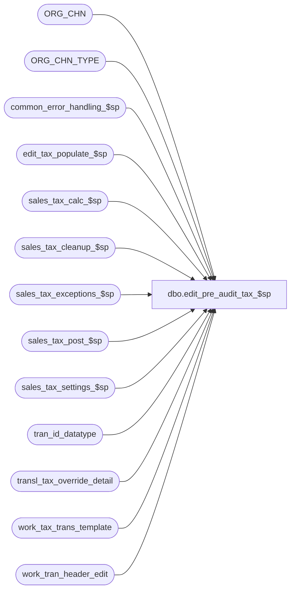

# dbo.edit_pre_audit_tax_$sp

**Database:** auditworks_external  
**Server:** bedrockdb01  

## Architecture Diagram



## Table Dependencies

| Referenced Table |
|---|
| ORG_CHN |
| ORG_CHN_TYPE |
| common_error_handling_$sp |
| edit_tax_populate_$sp |
| sales_tax_calc_$sp |
| sales_tax_cleanup_$sp |
| sales_tax_exceptions_$sp |
| sales_tax_post_$sp |
| sales_tax_settings_$sp |
| tran_id_datatype |
| transl_tax_override_detail |
| work_tax_trans_template |
| work_tran_header_edit |

## Stored Procedure Code

```sql
create proc dbo.edit_pre_audit_tax_$sp 
( @process_id                           binary(16),
  @user_id				int,
  @edit_process_no                      tinyint,
  @exception_jurisdiction_check         tinyint,
  @tax_default_check                    tinyint,
  @errmsg                               nvarchar(2000) OUTPUT
)

AS

/*
PROC NAME: edit_pre_audit_tax_$sp
     DESC: To populate, verify, calculate sales taxes
           Called by edit_lines_validation_$sp

  HISTORY:
Date     Name           Def#  Desc
Dec17,14 Paul          94103  use try catch
Sep21,09 Vicci        109078  Use transl_tax_override_detail not tax_override_detail since the latter is not yet populated.
Jul21,09 Vicci        109078  Uplift 74673 (Add col to #tax_transactions for outer join to header level tax overrides);
                              Add logging of tax-exceptions.
Apr28,05 Paul        DV-1234  expand transaction_id to use tran_id_datatype
Dec14,04 Maryam      DV-1191  Add with NOLOCK.
Sep23,04 David       DV-1146  Use user_id instead of user_name.
May19,04 David       DV-1071  Use ORG_CHN table instead of store_salesaudit
May07,04 Maryam      DV-1071  Receive @process_id and @user_name and pass it to the sub procs.
Dec19,02 Phu            5327  To call sales_tax_cleanup_$sp
Apr25,02 Phu         1-C9P5S  Pre audit tax

*/

DECLARE
	@applicability_method		tinyint,
	@class_exception_flag		tinyint,
	@errmsg2				nvarchar(2000),
	@errline				int,
	@errno				int,
	@exception_rows			int,
	@function_no 			smallint,
	@item_group_exception_flag      tinyint,
	@include_expense			tinyint,
	@include_pickup			tinyint,
	@lookup_segment_flag            tinyint,
	@log_flag			tinyint,
	@log_tax_detail                 tinyint,
	@log_tax_override			tinyint,
	@message_id			int,
	@object_name			nvarchar(255),
	@operation_name			nvarchar(100),
	@process_log_entry 		tinyint,
	@process_name			nvarchar(100),
	@process_timestamp 		float,
	@rows				int,
	@sales_date			smalldatetime,
	@sku_exception_flag		tinyint,
	@store_no			int,
	@style_exception_flag		tinyint,
	@tax_jurisdiction			nchar(5),
	@tax_rounding_method		tinyint,
	@tax_strip_flag                 tinyint,
	@transaction_id	 		tran_id_datatype,
	@transaction_count 		int,
	@trans_count 			int,
	@unapplied_discounts_exist		tinyint,
	@update_timing 			smallint;

SELECT @message_id = 201068,
       @process_name = 'edit_pre_audit_tax_$sp',
       @log_flag = 1,
       @function_no = 38;

BEGIN TRY

    SELECT @errmsg = ISNULL(@errmsg, 'Unable to execute stored proc sales_tax_settings_$sp'),
           @object_name = 'sales_tax_settings_$sp',
           @operation_name = 'EXECUTE';
EXEC sales_tax_settings_$sp @process_id, @user_id, @applicability_method OUTPUT, @update_timing OUTPUT,
     @class_exception_flag OUTPUT, @sku_exception_flag OUTPUT,
     @style_exception_flag OUTPUT, @item_group_exception_flag OUTPUT,
     @lookup_segment_flag OUTPUT, @include_expense OUTPUT, @include_pickup OUTPUT, 
     @unapplied_discounts_exist OUTPUT, @tax_rounding_method OUTPUT,
     @log_tax_detail OUTPUT, @errmsg OUTPUT, @function_no;

   SELECT @errmsg = 'Unable to select into temp table #tax_transactions.',
         @object_name = '#tax_transactions',
         @operation_name = 'CREATE';
SELECT transaction_id, store_no, transaction_date, transaction_category,
       log_tax_override, store_tax_jurisdiction, transaction_no, register_no,
       entry_date_time, transaction_series, 
       tod_tax_jurisdiction, -- 74673
       header_override_flag, -- 74673
       all_tax_override_flag -- 74673
INTO #tax_transactions
FROM work_tax_trans_template WITH (NOLOCK);

/* get list of tax transactions to be posted */
-- If ORG_CHN_TYPE.SYS_CODE in ('WEB','CTLG'), then log_tax_override = 1,
-- Otherwise log_tax_override = 2.
    SELECT @errmsg = 'Unable to insert into table #tax_transactions.',
         @object_name = '#tax_transactions',
  @operation_name = 'INSERT';
INSERT #tax_transactions(
  transaction_id,
  store_no,
  transaction_date,
  transaction_category,
  log_tax_override,
  store_tax_jurisdiction,
  transaction_no,
  register_no,
  entry_date_time,
  transaction_series,
  tod_tax_jurisdiction, -- 74673
  header_override_flag, -- 74673
  all_tax_override_flag) -- 74673    
SELECT
  wh.transaction_id,
  wh.store_no,
  wh.transaction_date,
  wh.transaction_category,
  (ABS (SIGN (CHARINDEX (T.SYS_CODE, 'WEBCTLG')) - 1)) + 1,
  ss.TAX_JRSDCTN_CODE,
  wh.transaction_no,
  wh.register_no,
  wh.entry_date_time,
  wh.transaction_series,
  MAX(tod.exception_tax_jurisdiction), -- 74673   
  1 - SIGN(MIN(tod.line_id)), -- 74673   
  1 - SIGN(MIN(tod.tax_level)) -- 74673   
FROM work_tran_header_edit wh WITH (NOLOCK)
     INNER JOIN ORG_CHN ss
        ON wh.store_no = ss.ORG_CHN_NUM
INNER JOIN ORG_CHN_TYPE T
        ON ss.ORG_CHN_TYPE_CODE = T.ORG_CHN_TYPE_CODE
      LEFT OUTER JOIN  transl_tax_override_detail tod -- 74673   
        ON wh.transaction_id = tod.transaction_id
       AND tod.line_id = 0
 WHERE wh.sa_rejection_flag = 0
   AND wh.transaction_void_flag IN (0,8)
 AND wh.date_reject_id = 0
GROUP BY wh.transaction_id,
  wh.store_no,
  wh.transaction_date,
  wh.transaction_category,
  (ABS (SIGN (CHARINDEX (T.SYS_CODE, 'WEBCTLG')) - 1)) + 1,
  ss.TAX_JRSDCTN_CODE,
  wh.transaction_no,
  wh.register_no,
  wh.entry_date_time,
  wh.transaction_series;

SELECT @rows = @@rowcount;

IF @rows = 0
  BEGIN
   DROP TABLE #tax_transactions;
   RETURN;
  END;

   SELECT @errmsg = ISNULL(@errmsg, 'Unable to execute stored proc edit_tax_populate_$sp'),
         @object_name = 'edit_tax_populate_$sp',
         @operation_name = 'EXECUTE';
EXEC edit_tax_populate_$sp @edit_process_no, @process_id, @function_no, @applicability_method,
     @class_exception_flag, @sku_exception_flag, @style_exception_flag,
     @item_group_exception_flag, @include_expense, @include_pickup,
     @unapplied_discounts_exist, @tax_default_check, @exception_jurisdiction_check,
     @errmsg OUTPUT;

  SELECT @errmsg = ISNULL(@errmsg, 'Unable to execute stored proc sales_tax_calc_$sp'),
         @object_name = 'sales_tax_calc_$sp',
         @operation_name = 'EXECUTE';
EXEC sales_tax_calc_$sp @process_id, @user_id, @function_no, @class_exception_flag,
     @sku_exception_flag, @style_exception_flag, @item_group_exception_flag,
     @tax_rounding_method, @log_flag, @edit_process_no, @errmsg OUTPUT;

-- @store_no, @sales_date: unused in sales_tax_post_$sp for edit because tax info is posted
-- from work_tax_detail / work_tax_round to tax_detail

SELECT @trans_count = 0,
       @tax_strip_flag = 0,  -- unused in this proc
       @errmsg = 'Unable to execute stored proc sales_tax_post_$sp',
       @object_name = 'sales_tax_post_$sp',
       @operation_name = 'EXECUTE';

EXEC sales_tax_post_$sp @process_id, @user_id, @function_no, @update_timing,
     @tax_rounding_method, @log_tax_detail, @lookup_segment_flag,
     @store_no, @sales_date, 1, @tax_strip_flag OUTPUT,
     @trans_count OUTPUT, @errmsg OUTPUT;

  SELECT @errmsg = 'Unable to execute stored proc sales_tax_exceptions_$sp',
         @object_name = 'sales_tax_exceptions_$sp';
EXEC sales_tax_exceptions_$sp @process_id, @function_no, @update_timing, @tax_rounding_method,
                              @log_tax_override, @store_no , @sales_date, @errmsg OUTPUT;

     SELECT @errmsg = 'Unable to execute stored proc sales_tax_cleanup_$sp',
            @object_name = 'sales_tax_cleanup_$sp';
EXEC sales_tax_cleanup_$sp @process_id, @user_id, @function_no, @tax_rounding_method,
     @edit_process_no, @errmsg OUTPUT;


RETURN;


business_error:   /* Business Rule handler. */

	SELECT @errmsg2 = @errmsg;

	/* Could include similar cleanup code to system error trap when needed (example is from move_store_$sp).
	   However, could also exclude the cleanup code here since the outer system error catch should fire again after the exec below. */

	EXEC common_error_handling_$sp @function_no, @errno, @errmsg, 0, @message_id, 
	  @process_name, @object_name, @operation_name, @log_flag, @edit_process_no, 0, null,
	  0, null, null, null, null, null, null, 0, @process_id, @user_id;
	  /* Note: when the exec above raises an error, that action also fires the system error trap (below) */
	RETURN;
END TRY

BEGIN CATCH; -- trap system errors
    /* common error handling. Appending proc name here because a rollback could occur if called within a transaction. */

        SELECT @errno = ERROR_NUMBER(),
		@errline = ERROR_LINE();

        SELECT @errmsg = CONVERT(nvarchar, @errno) + ':' + @process_name + ':' + CONVERT(nvarchar, @errline) + ':'
               + COALESCE(@errmsg, ' ') + ':' + ERROR_MESSAGE();

	 /* this condition will only be true when raise error in traps above fire this general catch */
	IF @errmsg2 IS NOT NULL
	  SELECT @errmsg = @errmsg2;

	EXEC common_error_handling_$sp @function_no, @errno, @errmsg, 0, @message_id, 
	  @process_name, @object_name, @operation_name, @log_flag, @edit_process_no, 0, null,
	  0, null, null, null, null, null, null, 0, @process_id, @user_id;

	RETURN;
END CATCH;
```

