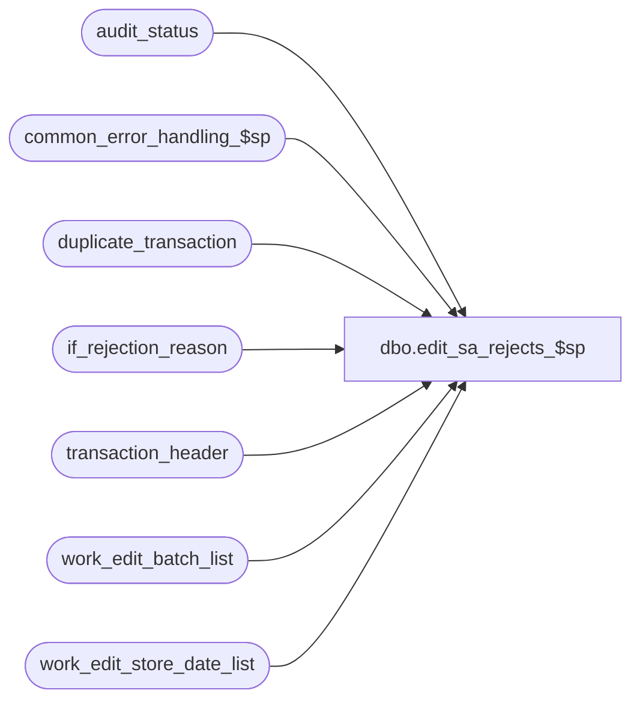

# dbo.edit_sa_rejects_$sp

**Database:** auditworks_external  
**Server:** bedrockdb01  

## Architecture Diagram



## Table Dependencies

| Referenced Table |
|---|
| audit_status |
| common_error_handling_$sp |
| duplicate_transaction |
| if_rejection_reason |
| transaction_header |
| work_edit_batch_list |
| work_edit_store_date_list |

## Stored Procedure Code

```sql
create proc dbo.edit_sa_rejects_$sp 
@store_in   int,
@batch_size int OUTPUT,
@errmsg     nvarchar(2000) OUTPUT

AS

  /* 
  
    Proc Name : edit_sa_rejects_$sp
         Desc : To set sa rejection quantity, valid_qty and duplicate_qty 
                in audit status for store-dates edited since the last edit_phase2.
                Called by edit_phase2_$sp.

HISTORY

Date	 Name          Def# Action
Dec17,14  Paul         94103 use try catch
Sep16,10  Paul        120676 Do not zero out exception_qty because phase2 does not recalculate it when trickle audit
Jan06,10  Vicci       115118 Added sequential_series_present to allow for determination of whether transaction missing needs to be evaluated.
Dec14,04  Maryam     DV-1191 Improve performance.
Apr19,04  Sab        DV-1068 Remove variable @media_rec_not_converted
Jul10,03  Maryam     1-KL08H Modified to receive @media_rec_not_converted and set media_rec_active_flag accordingly.
Jan30,02  Henry      AW-7611 Correctly resets and recalculates duplicate qty in audit_status.
Jan15,02  Henry      1-A1CTQ Correctly set the duplicate_verified flag in audit_status.
Nov27,01  Ian K      1-97UU6 Edit Phase 2 batching for R3
Dec18,00  Paul          7110 Combine queries to improve performance
Apr22,98  Paul
Jun06,96  Paul               Author 
 
  */

DECLARE 
  @errmsg2                      nvarchar(2000),
  @errline                      int,
  @errno                        int,
  @rows                         int,
  @reject_qty                   int,
  @valid_qty                    int,
  @object_name                  nvarchar(255),
  @process_name                 nvarchar(100),
  @operation_name               nvarchar(100),
  @process_no                   int,
  @message_id                   int;
  
  SELECT @process_name     = 'edit_sa_rejects_$sp',
         @process_no       = 5,
         @message_id       = 201068;

BEGIN TRY
      SELECT @errmsg         = 'Failed to create table #sa_reject_counts',
             @object_name    = '#sa_reject_counts',
             @operation_name = 'CREATE TABLE';
  CREATE TABLE #sa_reject_counts(store_no         int not null,
                                 register_no      smallint not null,
                                 transaction_date smalldatetime not null,
                                 date_reject_id   tinyint not null,
                                 sa_reject_count  smallint not null,
                                 valid_count      smallint not null,
                                 if_reject_count  smallint not null);

      SELECT @errmsg         = 'Failed to create temp table #if_reject_counts',
             @object_name    = '#if_reject_counts'; 
  CREATE TABLE #if_reject_counts(store_no          int not null,
                                 register_no       smallint not null,
                                 transaction_date  smalldatetime not null,
                                 date_reject_id    tinyint not null,
                                 nondeferred_count smallint not null);

      SELECT @errmsg         = 'Failed to create temp table #duplicate_counts',
             @object_name    = '#duplicate_counts';
  CREATE TABLE #duplicate_counts(store_no         int not null,
                                 register_no      smallint not null,
                                 transaction_date smalldatetime not null,
                                 date_reject_id   tinyint not null,
                                 duplicate_count  smallint not null,
                                 new_verified     tinyint not null);
  --
  -- Clear any existing totals. Usually there are none unless using trickle audit.
  --
    SELECT @errmsg         = 'Failed to update audit_status (qty)',
           @object_name    = 'audit_status',
           @operation_name = 'UPDATE'; 
  UPDATE audit_status
     SET sa_reject_qty = 0,
         duplicate_qty = 0, 
         duplicate_verified = 0,
         valid_qty     = 0,
         if_reject_qty = 0,
         missing_qty   = 0
    FROM work_edit_store_date_list sl WITH (NOLOCK), 
         audit_status st
   WHERE sl.store_no         = @store_in
     AND sl.store_no  = st.store_no
     AND sl.transaction_date = st.sales_date
     AND sl.date_reject_id   = st.date_reject_id
     AND sl.register_no      = st.register_no
     AND (ABS(sa_reject_qty) + duplicate_qty + valid_qty + if_reject_qty + missing_qty) != 0;

      SELECT @errmsg         = 'Failed to insert #sa_reject_counts',
           @object_name    = '#sa_reject_counts',
           @operation_name = 'INSERT';
  INSERT INTO #sa_reject_counts(
         store_no,
         register_no,
         transaction_date,
         date_reject_id,
         sa_reject_count,
         valid_count,
         if_reject_count)
  SELECT sl.store_no,
         sl.register_no,
         sl.transaction_date,
         sl.date_reject_id,
         SUM(SIGN(th.sa_rejection_flag)),
         SUM(1 - SIGN(th.sa_rejection_flag)),
         SUM(SIGN(if_rejection_flag))
    FROM work_edit_store_date_list sl WITH (NOLOCK), 
         transaction_header th WITH (NOLOCK)
   WHERE sl.store_no         = @store_in
     AND sl.store_no         = th.store_no
     AND sl.register_no      = th.register_no
     AND sl.transaction_date = th.transaction_date
     AND sl.date_reject_id   = th.date_reject_id
   GROUP BY sl.store_no, sl.register_no, sl.transaction_date, sl.date_reject_id;

     SELECT @errmsg         = 'Failed to update audit_status (sa_reject_qty)',
           @object_name    = 'audit_status',
           @operation_name = 'UPDATE';
  UPDATE audit_status
     SET sa_reject_qty = rc.sa_reject_count,
         valid_qty     = rc.valid_count
    FROM #sa_reject_counts rc WITH (NOLOCK), 
         audit_status st
   WHERE st.store_no       = rc.store_no
     AND st.register_no    = rc.register_no
     AND st.sales_date     = rc.transaction_date
     AND st.date_reject_id = rc.date_reject_id;
  --
  -- Calculate counts of if_rejections which are not deferred
  --
      SELECT @errmsg         = 'Failed to insert into temp table #if_reject_counts',
           @object_name    = '#if_reject_counts',
           @operation_name = 'INSERT';
  INSERT INTO #if_reject_counts(
         store_no,
         register_no,
         transaction_date,
         date_reject_id,
         nondeferred_count)
  SELECT rc.store_no,
         rc.register_no,
         rc.transaction_date,
         rc.date_reject_id,
         COUNT(DISTINCT ir.transaction_id)    
    FROM #sa_reject_counts rc WITH (NOLOCK), 
         transaction_header th WITH (NOLOCK), 
         if_rejection_reason ir 
   WHERE rc.if_reject_count > 0
     AND rc.store_no          = th.store_no
     AND rc.register_no       = th.register_no
     AND rc.transaction_date  = th.transaction_date
     AND rc.date_reject_id    = th.date_reject_id
     AND th.if_rejection_flag = 1
     AND th.transaction_id    = ir.transaction_id
     AND deferred = 0
   GROUP BY rc.store_no, rc.register_no, rc.transaction_date, rc.date_reject_id;

     SELECT @errmsg         = 'Failed to update audit_status (if_reject_qty)',
           @object_name    = 'audit_status',
           @operation_name = 'UPDATE';
  UPDATE audit_status
     SET if_reject_qty = nondeferred_count
    FROM #if_reject_counts rc WITH (NOLOCK), 
         audit_status st
   WHERE st.store_no       = rc.store_no
     AND st.register_no    = rc.register_no
     AND st.sales_date     = rc.transaction_date
     AND st.date_reject_id = rc.date_reject_id;

      SELECT @errmsg         = 'Failed to insert into temp table #duplicate_counts',
           @object_name    = '#duplicate_counts',
           @operation_name = 'INSERT';
  INSERT INTO #duplicate_counts(
         store_no,
         register_no,
         transaction_date,
         date_reject_id,
         duplicate_count,
         new_verified)
  SELECT sl.store_no,
         sl.register_no,
         sl.transaction_date,
         sl.date_reject_id,
         COUNT(transaction_no),
         MIN(CONVERT(tinyint,dt.verified))    
    FROM work_edit_store_date_list sl WITH (NOLOCK), 
         duplicate_transaction dt
   WHERE sl.store_no         = @store_in
     AND sl.store_no         = dt.store_no
     AND sl.register_no      = dt.register_no
     AND sl.transaction_date = dt.transaction_date
     AND sl.date_reject_id   = dt.date_reject_id
   GROUP BY sl.store_no, sl.register_no, sl.transaction_date, sl.date_reject_id;

  SELECT @rows = @@rowcount;

  IF @rows > 0
  BEGIN

  -- { Def 1-A1CTQ and AW-7611. Consolidated these 2 defects together.
  -- Need to reset duplicate_verified to 0 if new duplicates have been edited and flag has
  -- already been set to 1 through front-end auditing. Recalculate duplicate_qty as well.
        SELECT @errmsg         = 'Failed to update audit_status (duplicate_qty)',
             @object_name    = 'audit_status',
             @operation_name = 'UPDATE';
    UPDATE audit_status
       SET duplicate_qty = dc.duplicate_count,
	   duplicate_verified = dc.new_verified -- moved Def 1-A1CTQ.
      FROM #duplicate_counts dc WITH (NOLOCK), 
           audit_status st
     WHERE st.store_no       = dc.store_no
       AND st.register_no    = dc.register_no
       AND st.sales_date     = dc.transaction_date
       AND st.date_reject_id = dc.date_reject_id;
  END; -- If @rows > 0

     SELECT @errmsg         = 'Failed to determine transactions processed for batch',
           @object_name    = 'audit_status',
           @operation_name = 'SELECT'; 
  SELECT @reject_qty = SUM(st.sa_reject_qty),
         @valid_qty  = SUM(st.valid_qty)
    FROM audit_status st WITH (NOLOCK), 
         work_edit_store_date_list sl WITH (NOLOCK)
   WHERE sl.store_no         = @store_in
     AND sl.store_no         = st.store_no
     AND sl.transaction_date = st.sales_date
     AND sl.date_reject_id   = st.date_reject_id
     AND sl.register_no      = st.register_no; 

  -- } Def 1-A1CTQ and AW-7611.
  
  SELECT @batch_size = @batch_size + @reject_qty + @valid_qty,
         @errmsg         = 'Failed to create rows in work_edit_batch_list',
         @object_name    = 'work_edit_batch_list',
         @operation_name = 'INSERT';
  
  INSERT INTO work_edit_batch_list
             (store_no, register_no, transaction_date, date_reject_id,
              posted_flag, trickle_counts_flag, status_already_existed,
              processing_request, sequential_series_present)
       SELECT store_no, register_no, transaction_date, date_reject_id,
              posted_flag, trickle_counts_flag, status_already_existed,
              processing_request, sequential_series_present
         FROM work_edit_store_date_list sl WITH (NOLOCK)
        WHERE sl.store_no = @store_in;
           

RETURN;


business_error:   /* Business Rule handler. */

	SELECT @errmsg2 = @errmsg;

	/* Could include similar cleanup code to system error trap when needed (example is from move_store_$sp).
	   However, could also exclude the cleanup code here since the outer system error catch should fire again after the exec below. */

          EXEC common_error_handling_$sp @process_no, @errno, @errmsg, 0, @message_id, 
	                                @process_name, @object_name, @operation_name, 1, 1;
	  /* Note: when the exec above raises an error, that action also fires the system error trap (below) */
	RETURN;
END TRY

BEGIN CATCH; -- trap system errors
    /* common error handling. Appending proc name here because a rollback could occur if called within a transaction. */

        SELECT @errno = ERROR_NUMBER(),
		@errline = ERROR_LINE();

        SELECT @errmsg = CONVERT(nvarchar, @errno) + ':' + @process_name + ':' + CONVERT(nvarchar, @errline) + ':'
    + COALESCE(@errmsg, ' ') + ':' + ERROR_MESSAGE();

	 /* this condition will only be true when raise error in traps above fire this general catch */
	IF @errmsg2 IS NOT NULL
	  SELECT @errmsg = @errmsg2;

          EXEC common_error_handling_$sp @process_no, @errno, @errmsg, 0, @message_id, 
	                                @process_name, @object_name, @operation_name, 1, 1;

	RETURN;
END CATCH;
```

