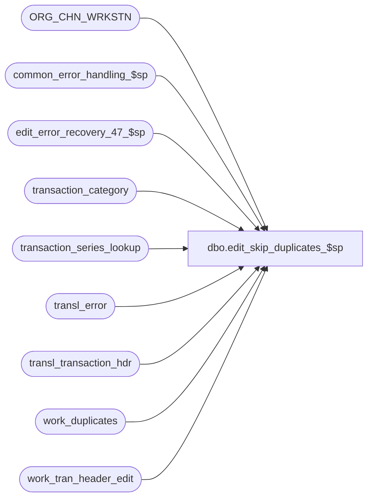

# dbo.edit_skip_duplicates_$sp

**Database:** auditworks_external  
**Server:** bedrockdb01  

## Architecture Diagram



## Table Dependencies

| Referenced Table |
|---|
| ORG_CHN_WRKSTN |
| common_error_handling_$sp |
| edit_error_recovery_47_$sp |
| transaction_category |
| transaction_series_lookup |
| transl_error |
| transl_transaction_hdr |
| work_duplicates |
| work_tran_header_edit |

## Stored Procedure Code

```sql
create proc dbo.edit_skip_duplicates_$sp 

@edit_timestamp             float,
@transaction_count          numeric(12,0) OUTPUT,
@errmsg                     nvarchar(2000) OUTPUT,
@edit_process_no            tinyint = 1,
@default_pre_midnight_time  int = 0,
@default_post_midnight_time int = 0

AS

/*
   Desc: EDIT - Discard duplicate transactions and build work_tran_header_edit work table.
   Duplicate transactions within the same batch cannot be processed because they will cause SQL
   errors in the edit due to duplicate rows returned by any joins using transaction_no. 
   Duplicates (store-reg-date-time-tran_no) are usually caused by pos/translate bugs.
   Process only the first ocurrence of a transaction within the batch
   and discard the other occurrences but log an error message to transl_error.
   Called by edit_header_$sp.

HISTORY
Date     Name           Def# Disc
Dec12,14 Paul      TFS-94103 use try catch
Oct25,06 Phu           77931 Fix outer join for SQL 2005 Mode 90.
Aug08,06 Paul        DV-1344 use batch delete for performance.
Jul26,05 David       DV-1294 Mirror changes from edit_header_$sp.
Dec14,04 Maryam      DV-1191 Improve performance.
May17,04 Maryam      DV-1071 Use ORG_CHN_WRKSTN instead of register table.
Apr16,04 Sab	     DV-1068 Remove variables @legacy_media_rec_active_flag, @media_rec_not_converted
Jul03,03 Winnie		9250 Set till_no for new media_reconciliation
Apr04,03 David          7442 Set line_exists to 0 in work_tran_header_edit
Mar22,02 Paul        1-BUVZ9 insert tender_total as zero
Dec12,01 Phu         AW-8575 Logical trading dates
Nov26,01 Winnie	     1-969YY Add logic for R3 error handling to pass @edit_process_no
Nov01,01 ShuZ		8900  TRANSL edit changes for Sybase
Sep13,01 Paul		8634 Avoid error 2601 by changing the entry_date_time from smalldatetime to datetime.
Jun29,00 Maryam         6441 Log the error message to transl_error instead of translate_error.
Aug23,99 Paul		5050 eliminate duplicate discounts

*/

DECLARE 	@entry_date_time		datetime,
	@errmsg2			nvarchar(2000),
	@errline			int,
	@errno			int,
	@rows			int,
	@transl_error_msg 	nvarchar(100),
	@message_id		int,	
	@object_name		nvarchar(255),	
	@operation_name		nvarchar(100),
	@process_name		nvarchar(100);

SELECT @transl_error_msg = 
  'Duplicate transaction encountered. Only the first occurence of this transaction will be processed.',
       @process_name = 'edit_skip_duplicates_$sp',
       @message_id = 201068;

BEGIN TRY
   SELECT @errmsg = 'Failed to truncate temp table work_duplicates',
          @object_name = 'work_duplicates',
          @operation_name = 'TRUNCATE TABLE';
TRUNCATE TABLE work_duplicates;

   SELECT @errmsg = 'Failed to truncate table work_tran_header_edit',
          @object_name = 'work_tran_header_edit';
TRUNCATE TABLE work_tran_header_edit;

   SELECT @errmsg = 'Failed to insert into work_duplicates',
          @object_name = 'work_duplicates',
          @operation_name = 'INSERT';
INSERT INTO work_duplicates(
       store_no,
       register_no,
       entry_date_time,
       transaction_no,
       transaction_series,
       trans_count,
       min_sequence_no)
SELECT
	store_no,
	register_no,
	entry_date_time,
	transaction_no,
	transaction_series,
	COUNT(store_no),
	MIN(row_sequence_no)
   FROM transl_transaction_hdr WITH (NOLOCK)
  GROUP BY store_no,
	register_no,
	entry_date_time,
	transaction_no,
	transaction_series
  HAVING COUNT(store_no) > 1;

/* report duplicate transactions */
   SELECT @errmsg = 'Failed to insert transl_error',
          @object_name = 'transl_error',
          @operation_name = 'INSERT';
INSERT transl_error (
	store_no,
	register_no,
	entry_date_time,
	transaction_series,
	transaction_no,
	line_id,
	transl_reject_reason,
	output_file_code,
	posting_end_date_time,
	transl_error_msg)
SELECT
	store_no,
	register_no,
	entry_date_time,
	transaction_series,
	transaction_no,
	0,
	2601,
	'H',
	getdate(),
	@transl_error_msg
  FROM work_duplicates WITH (NOLOCK)
  WHERE trans_count >= 2;

/* Delete all except first ocurrence of each duplicate transaction */
   SELECT @errmsg = 'Failed to delete transl_transaction_hdr',
          @object_name = 'transl_transaction_hdr',
          @operation_name = 'DELETE';
DELETE transl_transaction_hdr
  FROM work_duplicates w WITH (NOLOCK), transl_transaction_hdr h
 WHERE h.store_no = w.store_no
      AND h.register_no = w.register_no
      AND h.entry_date_time = w.entry_date_time
      AND h.transaction_series = w.transaction_series
      AND h.transaction_no = w.transaction_no
      AND h.row_sequence_no > w.min_sequence_no;

/* columns transaction_id,status_reject_reason and employee_on_file_flag are not nulls with default 0 */
   SELECT @errmsg = 'Failed to insert work_tran_header_edit',
          @object_name = 'work_tran_header_edit',
          @operation_name = 'INSERT';
INSERT work_tran_header_edit (
	store_no,
	register_no,
	entry_date_time,
	transaction_no,
	transaction_series,
	transaction_date,
	date_reject_id,
	transaction_category,
	orig_transaction_category,
	edit_timestamp,
	transaction_time,
	closeout_flag,
	duplicate_flag,
	sa_rejection_flag,
	cashier_no,
	tax_override_flag,
	employee_on_file_flag,
	transaction_void_flag,
	tender_total,
	deposit_declaration_flag,
	pos_tax_jurisdiction,
	employee_no,
	tax_jurisdiction_store,
	status_reject_reason,
	row_sequence_no,
	reg_pre_midnight_time,
	reg_post_midnight_time,
	transaction_remark,
	line_exists,
	till_no,
	lookup_transaction_series)
SELECT
	th.store_no,
	th.register_no,
	entry_date_time,
	transaction_no,
	th.transaction_series,
	CONVERT(smalldatetime, CONVERT(nchar(8),entry_date_time,112)),
	0,
	ISNULL(tc.transaction_category, 0),
	th.transaction_category,
	@edit_timestamp,
	DATEPART(hh,entry_date_time) * 100
           + DATEPART(mi,entry_date_time),
	closeout_flag,
	0,
	0,
	cashier_no,
	1, -- tax_override_flag will be set to 0 on later insert into Transaction_header
	0,
	trans_void_flag,
	0,
	deposit_declaration_flag,
	pos_tax_jurisdiction,
	employee_no,
	tax_jurisdiction_store,
	0,
	th.row_sequence_no,
	ISNULL(CONVERT (int, SUBSTRING((CONVERT(nvarchar, r.BSNS_DAY_END_RNG_START_TIME, 8)),1,2) + 
	                     SUBSTRING((CONVERT(nvarchar, r.BSNS_DAY_END_RNG_START_TIME, 8)),4,2)), @default_pre_midnight_time),
	ISNULL(CONVERT (int, SUBSTRING((CONVERT(nvarchar, r.BSNS_DAY_END_RNG_END_TIME, 8)),1,2) + 
	          SUBSTRING((CONVERT(nvarchar, r.BSNS_DAY_END_RNG_END_TIME, 8)),4,2)), @default_post_midnight_time),
	transaction_remark,
	0,
	th.till_no,
	IsNull(ts.transaction_series, th.transaction_series)
  FROM transl_transaction_hdr th WITH (NOLOCK)
       LEFT JOIN transaction_category tc ON (th.transaction_category = tc.transaction_category)
       LEFT JOIN ORG_CHN_WRKSTN r ON (th.store_no = r.ORG_CHN_NUM AND th.register_no = r.WRKSTN_NUM)
       LEFT JOIN transaction_series_lookup ts ON (th.pos_transaction_series = ts.pos_transaction_series AND th.transaction_series = ts.default_transaction_series);

SELECT @transaction_count = @@rowcount;

/* search for duplicate discounts also */
   SELECT @errmsg = 'Failed to execute edit_error_recovery_47_$sp.',
          @object_name = 'edit_error_recovery_47_$sp',
          @operation_name = 'EXEC'; 
EXEC edit_error_recovery_47_$sp @edit_process_no;


RETURN;


business_error:   /* Business Rule handler. */

	SELECT @errmsg2 = @errmsg;

	/* Could include similar cleanup code to system error trap when needed (example is from move_store_$sp).
	   However, could also exclude the cleanup code here since the outer system error catch should fire again after the exec below. */

	EXEC common_error_handling_$sp 4, @errno, @errmsg, 0, @message_id, 
	  @process_name, @object_name, @operation_name, 1, @edit_process_no;
	  /* Note: when the exec above raises an error, that action also fires the system error trap (below) */
	RETURN;
END TRY

BEGIN CATCH; -- trap system errors
    /* common error handling. Appending proc name here because a rollback could occur if called within a transaction. */

        SELECT @errno = ERROR_NUMBER(),
		@errline = ERROR_LINE();

        SELECT @errmsg = CONVERT(nvarchar, @errno) + ':' + @process_name + ':' + CONVERT(nvarchar, @errline) + ':'
               + COALESCE(@errmsg, ' ') + ':' + ERROR_MESSAGE();

	 /* this condition will only be true when raise error in traps above fire this general catch */
	IF @errmsg2 IS NOT NULL
	  SELECT @errmsg = @errmsg2;

	EXEC common_error_handling_$sp 4, @errno, @errmsg, 0, @message_id, 
	  @process_name, @object_name, @operation_name, 1, @edit_process_no;

	RETURN;
END CATCH;
```

