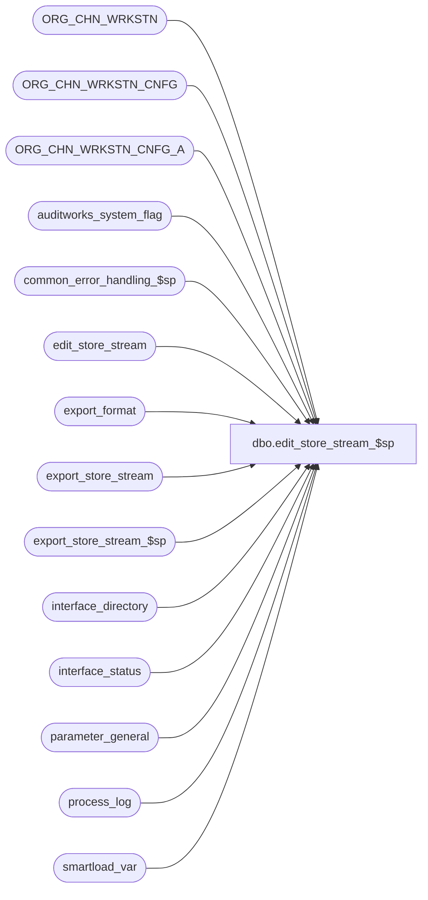

# dbo.edit_store_stream_$sp

**Database:** auditworks_external  
**Server:** bedrockdb01  

## Architecture Diagram



## Table Dependencies

| Referenced Table |
|---|
| ORG_CHN_WRKSTN |
| ORG_CHN_WRKSTN_CNFG |
| ORG_CHN_WRKSTN_CNFG_A |
| auditworks_system_flag |
| common_error_handling_$sp |
| edit_store_stream |
| export_format |
| export_store_stream |
| export_store_stream_$sp |
| interface_directory |
| interface_status |
| parameter_general |
| process_log |
| smartload_var |

## Stored Procedure Code

```sql
create proc dbo.edit_store_stream_$sp 
 AS

/* Proc Name: edit_store_stream_$sp
   Description: To populate edit_store_stream based on previously-edited transaction volumes. The table contents will later
      be exported to the c split (called by ICT_POOL when using multistream trickle edit) via ICT_EXPORT01.
      An export is only neeed when something has changed in edit_store_stream. 
     Smartload_var indicates whether muti-stream trickle edit is supported (requires using ICT_POOL) and requires the 
      following settings (is only currently supported on Windows smartload environments):
       var_value = '1' where var_name = 'multistr_trickle' 
       var_value = 'awsplit_NT.exe' where var_name = 'awsplit_cmd' 

     Any new stores will be assigned to a stream on a round-robin basis.
     If desired, it is possible to de-activate the redistribution of existing stores to streams by updating a system flag to 
       a future date : update auditworks_system_flag set flag_datetime_value = DATEADD(yy, 30, getdate()) 
                       where flag_name = 'last_phase2_exec';
     If table edit_store_stream is empty, then this proc will populate that table on a round-robin basis.
       
     In a scaleout environment, this proc will be executed on each peripheral.
   Called from edit_phase2_$sp.

History:
Date     Name           Def# Action
Feb26,15 Paul       T-105255 update last_trickle_stream_updated in auditworks_system_flag
Oct30,14 Paul          65489 rebuild edit_store_stream when number of edit streams has been changed in tm
Oct20,14 Paul          65489 improve handling of first time run and handling of new stores
Mar03,14 Paul         148151 author.


*/

DECLARE @concurrent_edit_processes smallint,
	@current_date		datetime,
	@cursor_open		tinyint,
        @errmsg	 		nvarchar(2000),
        @errmsg2			nvarchar(2000),
	@errline			int,
	@errno			int,
	@export_required		tinyint,
	@instance_id		tinyint,
	@interface_id		tinyint,
	@last_phase2_exec		datetime,
	@last_trickle_stream_updated smallint,
	@last_updated_date	datetime,
	@multistr_trickle		tinyint,
	@prev_number_of_streams	smallint,
	@rows			int,
	@sa_company_no 		int,
	@sa_company_string 	nvarchar(5),
	@store_no		int, -- T_LONG_INTEGER
	@stream_no		tinyint,
	@object_name		nvarchar(255),
	@process_name		nvarchar(100),
	@operation_name		nvarchar(100),
	@message_id		int,
	@table_empty		int,
	@update_timing		smallint;

  
SELECT @process_name = 'edit_store_stream_$sp',
       @message_id = 201068,
       @multistr_trickle = 0,
       @current_date = getdate(),
       @export_required = 0,
       @stream_no = 0,
       @table_empty = 1,
       @update_timing = 0,
       @interface_id = 36; 	

BEGIN TRY

    SELECT @errmsg = 'Failed to SELECT from table parameter_general.',
           @object_name    = 'parameter_general',
           @operation_name = 'SELECT';
SELECT @sa_company_no = sa_company_no,
       @concurrent_edit_processes = concurrent_edit_processes
  FROM parameter_general;
  
SELECT @rows = @@rowcount;

IF @rows = 0
  GOTO business_error;

IF @concurrent_edit_processes = 0 OR @concurrent_edit_processes IS NULL
  SELECT @concurrent_edit_processes = 1;

/* Verify whether system interface is active */
   SELECT @errmsg = 'Failed to SELECT from table interface_directory.',
          @object_name = 'interface_directory';

IF EXISTS (SELECT 1
   FROM interface_directory id, export_format ex
   WHERE id.interface_id = @interface_id
     AND id.update_timing = 5
     AND id.interface_id = ex.interface_id
     AND ex.export_procedure_name = 'export_store_stream_$sp')
  SELECT @update_timing = 5;

/* Smartload_var indicates whether muti-stream trickle edit is supported (requires using ICT_POOL) */

IF EXISTS (SELECT 1 FROM smartload_var
           WHERE var_name = 'multistr_trickle'
           AND var_value = '1'
           AND ict_name = 'DEFAULT')
   SELECT @multistr_trickle = 1;

IF @update_timing = 0 OR @multistr_trickle = 0
  RETURN;

/* Determine when the previous edit phase2 last completed on edit stream 1 */
    SELECT @errmsg = 'Failed to SELECT last_phase2_exec from auditworks_system_flag.',
           @object_name    = 'auditworks_system_flag',
           @operation_name = 'SELECT';
SELECT @last_phase2_exec = flag_datetime_value
  FROM auditworks_system_flag
 WHERE flag_name = 'last_phase2_exec';

SELECT @rows = @@rowcount;
IF @rows = 0
  GOTO business_error;

    SELECT @errmsg = 'Failed to SELECT last_trickle_stream_updated from auditworks_system_flag.',
           @object_name    = 'auditworks_system_flag',
           @operation_name = 'SELECT';
SELECT @last_trickle_stream_updated = flag_numeric_value
  FROM auditworks_system_flag WITH (NOLOCK)
 WHERE flag_name = 'last_trickle_stream_updated';

SELECT @rows = @@rowcount;
IF @rows = 0
  GOTO business_error;
IF @last_trickle_stream_updated = 0 /* default install value */
  SELECT @last_trickle_stream_updated = 1;

/* detect scenario where the number of edit streams has been changed in tm since the last execution of this proc */

    SELECT @errmsg = 'Failed to SELECT edit_store_stream_config from auditworks_system_flag.',
           @object_name    = 'auditworks_system_flag',
           @operation_name = 'SELECT';
SELECT @prev_number_of_streams = flag_numeric_value
  FROM auditworks_system_flag
 WHERE flag_name = 'edit_store_stream_config';

SELECT @rows = @@rowcount;
IF @rows = 0
  GOTO business_error;

IF EXISTS (SELECT 1 FROM edit_store_stream)
  SELECT @table_empty = 0;

/* If table is empty (first time used) or if a rebuild is required,
    then call export_store_stream_$sp to populate export_store_stream */


IF @table_empty = 1 OR @concurrent_edit_processes != COALESCE(@prev_number_of_streams, -1)
BEGIN
    SELECT @errmsg = 'Failed to delete all rows from edit_store_stream.',
                   @object_name = 'edit_store_stream',
                   @operation_name = 'DELETE';
  DELETE FROM edit_store_stream;

  SELECT @export_required = 1,
         @errmsg         = 'Failed to exec export_store_stream_$sp',
         @object_name    = 'export_store_stream_$sp',
         @operation_name = 'EXEC';

  EXEC export_store_stream_$sp @interface_id;

  BEGIN TRANSACTION;
    SELECT @errmsg = 'Failed to insert into edit_store_stream.',
                   @object_name = 'edit_store_stream',
                   @operation_name = 'INSERT';
  INSERT INTO edit_store_stream (
                 store_no,
                 stream_no,
                 creation_date)
  SELECT store_no,
         stream_no,
         @current_date
    FROM export_store_stream;
  COMMIT;

END; -- If @table_empty = 1


/* Insert any newly created stores using cursor, assigning streams on a round-robin basis */

  SELECT @errmsg = 'Failed to create table #edit_store_stream_list.',
                   @object_name = '#edit_store_stream_list',
                   @operation_name = 'CREATE';
CREATE TABLE #edit_store_stream_list (
  store_no    int not null);

  SELECT @errmsg = 'Failed to insert #edit_store_stream_list.',
                   @object_name = '#edit_store_stream_list',
                   @operation_name = 'INSERT';
INSERT INTO #edit_store_stream_list (store_no)
SELECT DISTINCT R.ORG_CHN_NUM
      FROM ORG_CHN_WRKSTN R,
           ORG_CHN_WRKSTN_CNFG C,
           ORG_CHN_WRKSTN_CNFG_A A
     WHERE ISNULL(R.PRNT_WRKSTN_ID, R.WRKSTN_ID) = A.WRKSTN_ID
       AND A.WRKSTN_CNFG_CODE = C.WRKSTN_CNFG_CODE
       AND @current_date >= A.EFCTV_DATE
       AND (@current_date < A.EXPRTN_DATE OR A.EXPRTN_DATE IS NULL)
       AND ISNULL(C.TRAN_TRNSLT_VRSN_NUM,0) <> 0
       AND PLNG_FILE_NAME IS NOT NULL
       AND ISNULL(R.PRNT_WRKSTN_ID, R.WRKSTN_ID) = R.WRKSTN_ID
       AND R.ACTV = 1;


/* If more than one stream will be used, then bump initial value of stream population variable so that the next stream_no that is assigned 
    will be 1 more than the last stream_no that was assigned during the last exec of this proc.
    New stores will not be assigned to stream 1 for performance reasons (since it also runs phase2). */

IF @concurrent_edit_processes > 1
  SELECT @stream_no = COALESCE(@last_trickle_stream_updated,1);

BEGIN TRANSACTION;

   SELECT @errmsg         = 'Failed to open edit_store_stream_crsr',
           @object_name    = 'edit_store_stream_crsr',
           @operation_name = 'OPEN';
DECLARE edit_store_stream_crsr CURSOR FAST_FORWARD
    FOR
    SELECT sl.store_no
      FROM #edit_store_stream_list sl
     WHERE NOT EXISTS (SELECT 1 FROM edit_store_stream st
                       WHERE st.store_no = sl.store_no)
    ORDER BY sl.store_no;
    
OPEN edit_store_stream_crsr;
   SELECT @cursor_open = 1,
          @errmsg = 'Failed to insert new store into edit_store_stream.',
          @object_name = 'edit_store_stream',
          @operation_name = 'INSERT';

WHILE 1 = 1
   BEGIN

    FETCH edit_store_stream_crsr
     INTO @store_no

    IF @@fetch_status <> 0
      BREAK;

    SELECT @export_required = 1,
           @stream_no = @stream_no + 1;
    IF (@stream_no > @concurrent_edit_processes
       OR @stream_no > 50 ) /* safety code */
      BEGIN
         SELECT @stream_no = 1;
         IF @concurrent_edit_processes > 1
           SELECT @stream_no = 2; /* only add new stores to streams > 1 */
      END;

    INSERT INTO edit_store_stream (store_no, stream_no, creation_date)
    VALUES (@store_no, @stream_no, @current_date);

   END; --WHILE 1 = 1
  
CLOSE edit_store_stream_crsr;
DEALLOCATE edit_store_stream_crsr;
SELECT @cursor_open = 0;

COMMIT TRANSACTION;

DROP TABLE #edit_store_stream_list;

-- update flag with current configured tm value for number of edit streams
   SELECT @errmsg         = 'Failed to set edit_store_stream_config in auditworks_system_flag',
           @object_name    = 'auditworks_system_flag',
           @operation_name = 'UPDATE';
UPDATE auditworks_system_flag
 SET flag_numeric_value = @concurrent_edit_processes,
     flag_datetime_value = @current_date
 WHERE flag_name = 'edit_store_stream_config';

-- update flag with last stream number used
   SELECT @errmsg         = 'Failed to set last_trickle_stream_updated in auditworks_system_flag',
           @object_name    = 'auditworks_system_flag',
           @operation_name = 'UPDATE';
UPDATE auditworks_system_flag
 SET flag_numeric_value = @stream_no
 WHERE flag_name = 'last_trickle_stream_updated';

/* If last edit phase2 was at less than 20 hours ago, then don't re-evaluate
    since multiple edit phase 2 batches could possibly be run on the same day.
   Also, don't re-evaluate the distribution of existing stores to streams when the system flag
    last_phase2_exec flag_datetime_value has been intentionally set to a future date */

IF @last_phase2_exec > DATEADD(hh,-20, getdate()) OR @concurrent_edit_processes = 1 OR @last_phase2_exec > getdate()
  BEGIN
   SELECT @errmsg         = 'Failed to set immediate_posting_requested in interface_status',
           @object_name    = 'interface_status',
           @operation_name = 'UPDATE';
   IF @export_required = 1
     UPDATE interface_status
       SET immediate_posting_requested = 1,
           last_posting_datetime = getdate()
      WHERE interface_id = @interface_id;

   RETURN;
  END; -- If @last_phase2_exec


CREATE TABLE #edit_timings (
  elapsed_sec       int null,
  transaction_count int null,
  batch_process_id  smallint);

CREATE TABLE #edit_counts (
  elapsed_sec       int null,
  transaction_count int null,
  batch_process_id  smallint);

INSERT INTO #edit_timings (
  elapsed_sec,
  transaction_count,
  batch_process_id)
SELECT DATEDIFF(ss, process_start_time, process_end_time) as elapsed_sec, transaction_count, batch_process_id
 FROM process_log
WHERE process_no = 1
  AND process_status_flag != 1
  AND process_start_time >= @last_phase2_exec;

SELECT @rows = @@rowcount;

INSERT INTO #edit_counts
SELECT batch_process_id, SUM(elapsed_sec), SUM(transaction_count)
  FROM #edit_timings
 GROUP BY batch_process_id;

/* Future improvements to load balancing logic : 

SELECT @export_required = 1

1) find the fastest stream that is not stream 1 (because stream 1 also runs phase2)
2) loop and move one store per stream to the fastest stream.
3) add any new stores to the fastest stream


The intention would be to allow one store per stream per day to change streams, so that load balancing 
would be adjusted slowly over time (after the initial run).

Complications: 
1) multiple edit phase2 could possibly run per day so it is difficult to know which phase2 should be
  used as the end point of the previous day's run.
2) would have to sum (by stream) transaction counts for process_no = 1 in process_log rather than using duration
   of the edit run, because the duration could include sleep intervals where no processing occurred.

*/


BEGIN TRANSACTION;


SELECT @errmsg = 'Failed to delete edit_store_stream',
           @object_name    = 'edit_store_stream',
           @operation_name = 'DELETE';
-- DELETE FROM edit_store_stream;

/* INSERT INTO edit_store_stream
SELECT
 FROM temp */

/* Update system flag to current datetime unless it has been intentionally 
    set to a future date in order to lock the stream distribution */

  SELECT @errmsg = 'Failed to update last_phase2_exec',
           @object_name    = 'auditworks_system_flag',
           @operation_name = 'UPDATE';
UPDATE auditworks_system_flag
 SET flag_datetime_value = getdate()
 WHERE flag_name = 'last_phase2_exec'
   AND (flag_datetime_value IS NULL OR flag_datetime_value < getdate());


COMMIT;

 /* flag latest store-stream list as available for export to ICT_POOL */

SELECT @errmsg         = 'Failed to set immediate_posting_requested in interface_status',
           @object_name    = 'interface_status',
           @operation_name = 'UPDATE';
IF @export_required = 1
  UPDATE interface_status
    SET immediate_posting_requested = 1,
        last_posting_datetime = getdate()
   WHERE interface_id = @interface_id;

SELECT @errmsg         = 'Failed to clean up temp tables',
           @object_name    = '#edit_timings',
           @operation_name = 'DROP';
DROP TABLE #edit_timings;
DROP TABLE #edit_counts;

RETURN;


business_error:   /* Business Rule handler. */

	SELECT @errmsg2 = @errmsg;
	EXEC common_error_handling_$sp 5, @errno, @errmsg, 0, @message_id, @process_name, @object_name, @operation_name, 1;
	  /* Note: when the exec above raises an error, that action also fires the system error trap (below) */
	RETURN;
END TRY

BEGIN CATCH; -- trap system errors
    /* common error handling. Appending proc name here because a rollback could occur if called within a transaction. */

        SELECT @errno = ERROR_NUMBER(),
		@errline = ERROR_LINE();

        SELECT @errmsg = CONVERT(nvarchar, @errno) + ':' + @process_name + ':' + CONVERT(nvarchar, @errline) + ':'
               + COALESCE(@errmsg, ' ') + ':' + ERROR_MESSAGE();

	 /* this condition will only be true when raise error in traps above fire this general catch */
	IF @errmsg2 IS NOT NULL
	  SELECT @errmsg = @errmsg2;

	IF @cursor_open = 1
	    BEGIN
	      CLOSE edit_store_stream_crsr;
	      DEALLOCATE edit_store_stream_crsr;
	    END;
	  
	EXEC common_error_handling_$sp 5, @errno, @errmsg, 0, @message_id, @process_name, @object_name, @operation_name, 1;

	RETURN;
END CATCH;
```

