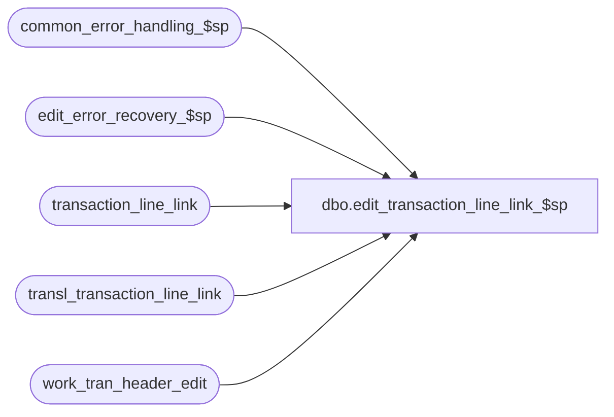

# dbo.edit_transaction_line_link_$sp

**Database:** auditworks_external  
**Server:** bedrockdb01  

## Architecture Diagram



## Table Dependencies

| Referenced Table |
|---|
| common_error_handling_$sp |
| edit_error_recovery_$sp |
| transaction_line_link |
| transl_transaction_line_link |
| work_tran_header_edit |

## Stored Procedure Code

```sql
create proc dbo.edit_transaction_line_link_$sp 


 @errmsg          nvarchar(2000) OUTPUT,
 @edit_process_no	tinyint = 1

AS

/* 
NAME:	edit_transaction_line_link_$sp
DESCRIPTION: (EDIT) to post transaction line link.
	     Called by edit_post_$sp.
HISTORY:
Date     Name              Def# Desc
Dec17,14 Paul             94103 use try catch
Jun21,05 Paul           DV-1282 return if no rows found
Mar17,05 Maryam         DV-1202 Author
*/ 

DECLARE @errno			int,
	@errmsg2			nvarchar(2000),
	@errline			int,
	@retry			tinyint,
	@rows			int,
	@message_id		int,	
	@object_name		nvarchar(255),	
	@operation_name		nvarchar(100),
	@process_name		nvarchar(100);       

SELECT @retry = 0,
       @process_name = 'edit_transaction_line_link_$sp',
       @message_id = 201068;   

BEGIN TRY
    SELECT @errmsg = 'Failed to update transl_transaction_line_link',
               @object_name = 'transl_transaction_line_link',
               @operation_name = 'UPDATE';
UPDATE transl_transaction_line_link
   SET transaction_id = wh.transaction_id
  FROM transl_transaction_line_link k , work_tran_header_edit wh WITH (NOLOCK)
 WHERE k.transaction_no = wh.transaction_no
   AND k.store_no = wh.store_no
   AND k.register_no = wh.register_no
   AND k.entry_date_time = wh.entry_date_time
   AND k.transaction_series = wh.transaction_series;

SELECT @rows = @@rowcount;

IF @rows = 0
  RETURN;


WHILE @retry <= 1
BEGIN
  SELECT @errmsg = 'Failed to insert rows into transaction_line_link',
         @object_name = 'transaction_line_link',
         @operation_name = 'INSERT',
         @errno = 0;
  BEGIN TRY

  INSERT transaction_line_link (
       transaction_id,
       line_id,
       linked_line_id)
  SELECT transaction_id,
       line_id,
       linked_line_id
    FROM transl_transaction_line_link k WITH (NOLOCK)
   WHERE transaction_id IS NOT NULL;

    SELECT @retry = 2;
  END TRY
  BEGIN CATCH;
        SELECT @errno = ERROR_NUMBER(),
		@errline = ERROR_LINE();

        SELECT @errmsg = CONVERT(nvarchar, @errno) + ':' + @process_name + ':' + CONVERT(nvarchar, @errline) + ':'
               + COALESCE(@errmsg, ' ') + ':' + ERROR_MESSAGE();
        IF @errno NOT IN (0, 2601) OR @retry > 0
          GOTO business_error;
  END CATCH;

  IF @errno = 2601 /* duplicate key */
    AND @retry = 0
     BEGIN
         SELECT @errmsg = 'Failed to execute stored proc edit_error_recovery_$sp',
                @object_name = 'edit_error_recovery_$sp',
                @operation_name = 'EXEC';
      EXEC edit_error_recovery_$sp 54, @edit_process_no;

      SELECT @retry = @retry + 1; /* retry only once */
     END;

END; /* While @retry <= 1 */


RETURN;


business_error:   /* Business Rule handler. */

	SELECT @errmsg2 = @errmsg;

	/* Could include similar cleanup code to system error trap when needed (example is from move_store_$sp).
	   However, could also exclude the cleanup code here since the outer system error catch should fire again after the exec below. */

	EXEC common_error_handling_$sp 4, @errno, @errmsg, 0, @message_id, 
	  @process_name, @object_name, @operation_name, 1, @edit_process_no;
	  /* Note: when the exec above raises an error, that action also fires the system error trap (below) */
	RETURN;
END TRY

BEGIN CATCH; -- trap system errors
    /* common error handling. Appending proc name here because a rollback could occur if called within a transaction. */

        SELECT @errno = ERROR_NUMBER(),
		@errline = ERROR_LINE();

        SELECT @errmsg = CONVERT(nvarchar, @errno) + ':' + @process_name + ':' + CONVERT(nvarchar, @errline) + ':'
               + COALESCE(@errmsg, ' ') + ':' + ERROR_MESSAGE();

	 /* this condition will only be true when raise error in traps above fire this general catch */
	IF @errmsg2 IS NOT NULL
	  SELECT @errmsg = @errmsg2;

	EXEC common_error_handling_$sp 4, @errno, @errmsg, 0, @message_id, 
	  @process_name, @object_name, @operation_name, 1, @edit_process_no;

	RETURN;
END CATCH;
```

