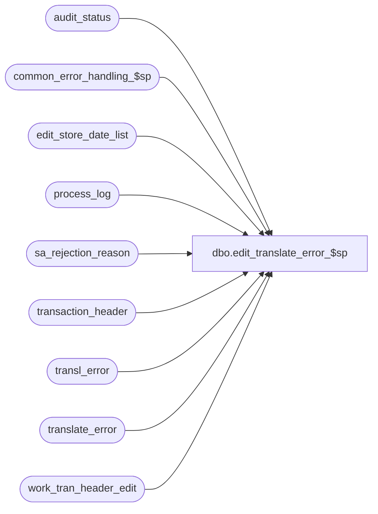

# dbo.edit_translate_error_$sp

**Database:** auditworks_external  
**Server:** bedrockdb01  

## Architecture Diagram



## Table Dependencies

| Referenced Table |
|---|
| audit_status |
| common_error_handling_$sp |
| edit_store_date_list |
| process_log |
| sa_rejection_reason |
| transaction_header |
| transl_error |
| translate_error |
| work_tran_header_edit |

## Stored Procedure Code

```sql
create proc dbo.edit_translate_error_$sp 
@process_timestamp 	float,
@file_name 		nvarchar(50) OUTPUT,
@errmsg 		nvarchar(2000) OUTPUT,
@edit_process_no	tinyint = 1

AS

/* 
PROC NAME: edit_translate_error_$sp
     DESC: post translate errors to translate_error  and translate timings to process_log.
           Called from edit_post_$sp. 

  NOTE:  This unicode version is suitable for both SA5.0 and SA5.1 .

HISTORY
Date     Name              Def# Desc      
Dec12,14 Paul         TFS-94103 use try catch
Jan22,12 Vicci           140995 Since DevStudio doesn't support with ignore_dup_key indexes, to avoid the Edit 
                                failing with a 'Failed to insert translate timings into process_log error' when a 
                                batch is re-processed, don't insert translate stats if already there.
Feb15,12 Paul          1-483Y61 update sa_rejection_flag in transaction_header due to moving call in edit_post_$sp
Jul28,11 Paul            126275 Improve performance by removing joins to translate_error (could contain many rows).
Dec19,10 Paul            105313 Use unicode datatypes for error trap
Aug08,06 Paul           DV-1344 Prevent error_qty overflow (unlikely scenario)
May04,05 David          DV-1202 Do not log S/A reject for duplicates on transl_pos_tax_detail/geninfo_detail/transaction_line_link.
Dec08,04 Paul           DV-1181 retrofit 28732/28910/28732/28909 from sa4, add nolock hints.
Sep29,04 David          DV-1146 Use new column translate_error.verified_by_user_id.
Sep09,04 David          DV-1120 Check if translate error is verified before logging SA reject   
                                Ensure audit_status updated for transaction date (business date)
                                of transl reject where possible, otherwise entry_date_time                                
Aug22,02 ShuZ           1-EXD51 Don't treated duplicate transactions caused by translate error 
                                as S/A rejects
May15,02 Henry          1-A8XPT Added DISTINCT clause when inserting into sa_rejection_reason.
Mar14,02 Henry          1-A8XPT Create SA rejects for translate errors. 
				Added transaction_date, transaction_id fields to translate_error table.
Nov26,01 Winnie         1-969YY Add logic for R3 error handling
Jun30,00 Maryam            6441 Performance Improvement. 
Jan07,00 Daphna F          5786 ensure earlier time posts as process_start_time and
				later time posts as process_end_time for translate
Dec08,98 Paul S              ?? last modified
Dec13,96 Paul S          author

*/

DECLARE @cursor_open			tinyint,
	@errmsg2				nvarchar(2000),
	@errline				int,
	@errno				int,
	@rows				int,
	@rows_sa				int,
	@store_no			int,
        @register_no			smallint,
        @sales_date			smalldatetime,
        @date_reject_id			tinyint,
	@reject_count			int,
	@object_name			nvarchar(255),
	@process_name			nvarchar(100),
	@operation_name			nvarchar(100),
	@message_id			int,
	@verified			tinyint;
	
/*{ post any error messages to translate_error */

SELECT 	@process_name = 'edit_translate_error_$sp',
        @message_id = 201068;

BEGIN TRY
  /* Create translate errors, including the duplicate types that are logged by edit procs to transl_error.
     flag translate errors on void transactions as verified since they are a non-issue for auditing. */
   SELECT @errmsg = 'Failed to insert rows into translate_error',
	  @object_name = 'translate_error',
	  @operation_name = 'INSERT';
INSERT translate_error (
	store_no,
	register_no,
	entry_date_time,
	transaction_date,
	transaction_series,
	transaction_no,
	line_id,
	transl_reject_reason,
	output_file_code,
	output_file_column,
	posting_start_date_time,
	posting_end_date_time,
	file_name,
	bad_data_pos,
	bad_data_output,
	transl_error_msg,
	transaction_id,
	verified,
	verified_by_user_id)
SELECT
	le.store_no,
	le.register_no,
	le.entry_date_time,
	COALESCE(wh.transaction_date, CONVERT(smalldatetime, CONVERT(nchar(8),le.entry_date_time,112))),
	le.transaction_series,
	le.transaction_no,
	le.line_id,
	le.transl_reject_reason,
	le.output_file_code,
	le.output_file_column,
	getdate(), /* facilitates finding the associated translate batch */
	le.posting_end_date_time,
	le.file_name,
	le.bad_data_pos,
	le.bad_data_output,
	le.transl_error_msg,
	wh.transaction_id,
	CASE WHEN (wh.transaction_void_flag >= 1 AND wh.transaction_void_flag != 8) THEN 1 ELSE 0 END,
	null
  FROM  transl_error le WITH (NOLOCK)
  LEFT JOIN work_tran_header_edit wh WITH (NOLOCK)
    ON (le.store_no = wh.store_no
	   AND le.register_no = wh.register_no
	   AND le.entry_date_time = wh.entry_date_time
	   AND le.transaction_series = wh.transaction_series
	   AND le.transaction_no = wh.transaction_no
	   AND wh.transaction_void_flag = 0 )
 WHERE  le.transl_reject_reason != 0
   AND  le.transl_reject_reason != 99;

SELECT @rows = @@rowcount;

IF @rows >= 1
 BEGIN
   /* Create SA rejection reason 8 (error in Translate). Only do this for Edit Phase1.
      Do not create sa rejects for translate errors of type duplicate since those are treated as warnings.
      No need to join to translate_error because all edit procs insert only to transl_error. */

   IF @process_timestamp != 0
    BEGIN
	SELECT @errmsg = 'Failed to CREATE S/A Rejection Reason 8 (error in Translate) ',
	       @object_name = 'sa_rejection_reason',
	       @operation_name = 'INSERT';
      INSERT sa_rejection_reason (
	     transaction_id,
	     line_id,
	     violated_sareject_rule)
      SELECT DISTINCT wh.transaction_id,
	     0,
	     8
	FROM transl_error le WITH (NOLOCK), work_tran_header_edit wh WITH (NOLOCK)
       WHERE le.transl_reject_reason NOT IN (0,99,141,142,143,144,145,146,147,148,149,150,151,152,153,154,155,156,202,2601)
	 AND le.transaction_no IS NOT NULL
	 AND le.transaction_no = wh.transaction_no
	 AND le.store_no = wh.store_no
	 AND le.register_no = wh.register_no
	 AND le.entry_date_time = wh.entry_date_time
	 AND le.transaction_series = wh.transaction_series
	 AND wh.transaction_void_flag IN (0,8);

      SELECT @rows_sa = @@rowcount;

      IF @rows_sa > 0
      BEGIN
		SELECT @errmsg = 'Failed to SET sa_rejection_flag=1 ',
		       @object_name = 'work_tran_header_edit',
		       @operation_name = 'UPDATE';
	      UPDATE work_tran_header_edit
		 SET sa_rejection_flag = 1
	        FROM work_tran_header_edit wh, sa_rejection_reason sr WITH (NOLOCK)
	       WHERE wh.transaction_id = sr.transaction_id
	         AND sr.violated_sareject_rule = 8
	         AND wh.sa_rejection_flag = 0;

	    /* now update transaction_header because edit_insert_header_lines_$sp has already inserted it 02/15 */
		SELECT @errmsg = 'Failed to SET sa_rejection_flag=1 ',
		       @object_name = 'transaction_header',
		       @operation_name = 'UPDATE';
	      UPDATE transaction_header
		 SET sa_rejection_flag = 1
	        FROM work_tran_header_edit wh WITH (NOLOCK), transaction_header th
	       WHERE wh.sa_rejection_flag = 1
	         AND wh.transaction_id = th.transaction_id
	         AND th.sa_rejection_flag = 0;

      END; -- If @rows_sa > 0
    END; -- IF @process_timestamp != 0


   /* calculate/recalculate translate_error_qty in audit_status */

      SELECT @errmsg = 'Failed to open cursor for translate_crsr',
	     @object_name = 'translate_crsr',
	     @operation_name = 'OPEN';
   DECLARE translate_crsr CURSOR FAST_FORWARD
   FOR
    SELECT DISTINCT te.store_no,
           te.register_no,
           te.transaction_date
      FROM transl_error le WITH (NOLOCK), translate_error te WITH (NOLOCK)
     WHERE le.transl_reject_reason != 0
       AND le.transaction_no IS NOT NULL
       AND le.store_no           = te.store_no
       AND le.register_no        = te.register_no
       AND le.entry_date_time    = te.entry_date_time
       AND le.transaction_series = te.transaction_series
       AND le.transaction_no     = te.transaction_no 
       AND le.line_id            = te.line_id
       AND le.transl_reject_reason = te.transl_reject_reason
       AND te.transaction_id IS NOT NULL;

  OPEN translate_crsr;
  SELECT @cursor_open = 1;

  WHILE 1=1
  BEGIN

    FETCH translate_crsr INTO
	  @store_no,
          @register_no,
          @sales_date;

    IF @@fetch_status <> 0
      BREAK;

        SELECT @errmsg = 'Failed to read from edit_store_date_list',
   	       @object_name = 'edit_store_date_list',
	       @operation_name = 'SELECT';
    SELECT @date_reject_id = ISNULL (MAX(date_reject_id), 0)
      FROM edit_store_date_list WITH (NOLOCK)
     WHERE store_no = @store_no
       AND register_no = @register_no
       AND transaction_date = @sales_date
       AND date_reject_id >= 1;  
    
        SELECT @errmsg = 'Failed to read from translate_error',
   	       @object_name = 'translate_error',
	       @operation_name = 'SELECT';   
    SELECT @reject_count = ISNULL (COUNT(transaction_no), 0),
           @verified = ISNULL(MIN(verified),0)
    FROM translate_error WITH (NOLOCK)
     WHERE store_no = @store_no
       AND register_no = @register_no
       AND transaction_date = @sales_date;
    
   IF @reject_count > 32767
     SELECT @reject_count = 32767;

     SELECT @errmsg = 'Failed to update audit_status',
            @object_name = 'audit_status',
            @operation_name = 'UPDATE';
   UPDATE audit_status
      SET translate_error_qty = @reject_count,
          translate_error_verified = @verified
    WHERE store_no = @store_no
      AND register_no = @register_no
      AND sales_date = @sales_date
      AND date_reject_id = @date_reject_id;

  END; /* While 1=1 */

  CLOSE translate_crsr;
  DEALLOCATE translate_crsr;
  SELECT @cursor_open = 0;
   
 END; /* IF @rows >= 1 */

IF @process_timestamp = 0
  RETURN;

/*{ update process_log timing statistics */
   SELECT @errmsg = 'Failed to insert translate timings into process_log',
          @object_name = 'process_log',
          @operation_name = 'INSERT';
INSERT process_log (
	process_no,
	process_timestamp,
	process_start_time,
	process_end_time,
	transaction_count,
	process_status_flag,
	file_name,
	file_size)
SELECT
	50,
	@process_timestamp,
	t.posting_start_date_time,
	MAX(t.posting_end_date_time),
	SUM(t.transaction_count),
	0,
	MAX(t.file_name),
	MAX(t.file_size)
  FROM  transl_error  t WITH (NOLOCK)
 WHERE  t.transl_reject_reason = 0
   AND  t.posting_start_date_time IS NOT NULL  	
   AND  t.posting_start_date_time < t.posting_end_date_time
   AND  NOT EXISTS (SELECT 1 FROM process_log p WHERE p.process_start_time = t.posting_start_date_time AND p.process_no = 50 AND p.batch_process_id = 0)
 GROUP BY t.posting_start_date_time;

   SELECT @errmsg = 'Failed to insert translate timings into process_log',
          @object_name = 'process_log',
	  @operation_name = 'INSERT';
INSERT process_log (
	process_no,
	process_timestamp,
	process_start_time,
	process_end_time,
	transaction_count,
	process_status_flag,
	file_name,
	file_size)
SELECT
	50,
	@process_timestamp,
	t.posting_end_date_time,  --earlier time
	MIN(t.posting_start_date_time),  -- later time 
	SUM(t.transaction_count),
	0,
	MAX(t.file_name),
	MAX(t.file_size)
  FROM  transl_error t WITH (NOLOCK)
 WHERE  t.transl_reject_reason = 0
   AND  t.posting_start_date_time IS NOT NULL   	
   AND  t.posting_start_date_time >= t.posting_end_date_time
   AND  NOT EXISTS (SELECT 1 FROM process_log p WHERE p.process_start_time = t.posting_end_date_time AND p.process_no = 50 AND p.batch_process_id = 0)
  GROUP BY t.posting_end_date_time;

/*} update process_log timing statistics */

RETURN;


business_error:   /* Business Rule handler. */

	SELECT @errmsg2 = @errmsg;

	/* Could include similar cleanup code to system error trap when needed (example is from move_store_$sp).
	   However, could also exclude the cleanup code here since the outer system error catch should fire again after the exec below. */

	EXEC common_error_handling_$sp 4, @errno, @errmsg, 0, @message_id, 
	  @process_name, @object_name, @operation_name, 1, @edit_process_no;
	  /* Note: when the exec above raises an error, that action also fires the system error trap (below) */
	RETURN;
END TRY

BEGIN CATCH; -- trap system errors
    /* common error handling. Appending proc name here because a rollback could occur if called within a transaction. */

        SELECT @errno = ERROR_NUMBER(),
		@errline = ERROR_LINE();

        SELECT @errmsg = CONVERT(nvarchar, @errno) + ':' + @process_name + ':' + CONVERT(nvarchar, @errline) + ':'
               + COALESCE(@errmsg, ' ') + ':' + ERROR_MESSAGE();

	 /* this condition will only be true when raise error in traps above fire this general catch */
	IF @errmsg2 IS NOT NULL
	  SELECT @errmsg = @errmsg2;

	IF @cursor_open = 1
	BEGIN
	  CLOSE translate_crsr;
	  DEALLOCATE translate_crsr;
	END;

	EXEC common_error_handling_$sp 4, @errno, @errmsg, 0, @message_id, 
	  @process_name, @object_name, @operation_name, 1, @edit_process_no;

	RETURN;
END CATCH;
```

