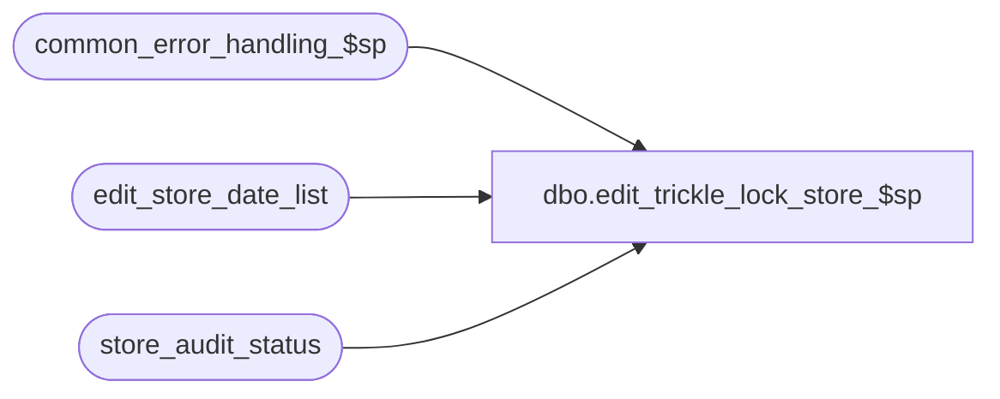

# dbo.edit_trickle_lock_store_$sp

**Database:** auditworks_external  
**Server:** bedrockdb01  

## Architecture Diagram



## Table Dependencies

| Referenced Table |
|---|
| common_error_handling_$sp |
| edit_store_date_list |
| store_audit_status |

## Stored Procedure Code

```sql
create proc dbo.edit_trickle_lock_store_$sp @errmsg nvarchar(2000) OUTPUT
AS


/* Proc Name: edit_trickle_lock_store_$sp
   Desc: Locks the stores/dates in edit_store_date_list before running phase2
       This is needed during trickle audit as the store/dates are not locked in
       phase1 in this mode.
   Called from edit_post_$sp (phase2 only).

HISTORY :
Date     Name              Def# Desc
Apr02,15 Vicci       TFS-114314 Remove begin tran / commit because a) there was only 1 statement within it and b) because the placement of the 
                                commit AFTER the catch was causing an error 3902 to be raised (after the error 201550 had been properly trapped)
                                causing the edit_phase2_$sp to fail.
Dec05,14 Paul             94103 use try catch
Sep03,10 Paul            119817 handle error 3609 raised by SQL2005, added SQL2005 try..catch to avoid displaying trapped errors
Dec15,04 Maryam         DV-1191 Improve performance.
Nov26,01 Winnie    	1-969YY	Add logic for R3 error handling
Mar01,00 Phu		5900  	Change @@fetch_status > 0 to @@fetch_status <> 0 for MS SQL compatibility
*/

DECLARE
	@cursor_open		tinyint,
	@date_reject_id		tinyint,
	@errmsg2			nvarchar(2000),
	@errline			int,
	@errno			int,
	@store_no		int,
	@transaction_date		smalldatetime,
	@object_name		nvarchar(255),
	@process_name		nvarchar(100),
	@operation_name		nvarchar(100),
	@message_id		int;

SELECT @process_name = 'edit_trickle_lock_store_$sp',
       @message_id = 201068;

BEGIN TRY
  SELECT @errmsg = 'Failed to create temporary table #trickle_edit_store_date_list.',
         @object_name = '#trickle_edit_store_date_list',
   	 @operation_name = 'CREATE';
CREATE TABLE #trickle_edit_store_date_list (
	store_no         int not null,
	transaction_date smalldatetime  not null,
	date_reject_id   tinyint  not null);
	
  SELECT @errmsg = 'Failed to insert into temp table #trickle_edit_store_date_list.',
         @object_name = '#trickle_edit_store_date_list',
   	 @operation_name = 'INSERT';
INSERT #trickle_edit_store_date_list (
	store_no,
	transaction_date,
	date_reject_id)
SELECT DISTINCT store_no, transaction_date, date_reject_id
  FROM edit_store_date_list
WHERE posted_flag = 1
ORDER BY store_no, transaction_date, date_reject_id;

  SELECT @errmsg = 'Failed to open trickle_store_list_crsr.',
         @object_name = 'trickle_store_list_crsr',
   	 @operation_name = 'OPEN';
DECLARE trickle_store_list_crsr CURSOR FAST_FORWARD
    FOR
 SELECT store_no,
        transaction_date,
	date_reject_id
   FROM #trickle_edit_store_date_list WITH (NOLOCK);

OPEN trickle_store_list_crsr;
SELECT @cursor_open = 1;

WHILE 1=1
BEGIN
 FETCH trickle_store_list_crsr INTO
    @store_no, 
    @transaction_date, 
    @date_reject_id;
    
 IF @@fetch_status <> 0
    BREAK; 

  SELECT @errmsg = 'Failed to lock store_audit_status (update_in_progress).',
         @object_name = 'store_audit_status',
   	@operation_name = 'UPDATE',
   	@errno = 0;

 BEGIN TRY
 UPDATE store_audit_status
    SET update_in_progress = 1
  WHERE store_no = @store_no
    AND sales_date = @transaction_date
    AND date_reject_id = @date_reject_id
    AND update_in_progress != 1;
 END TRY
 BEGIN CATCH;
        SELECT @errno = ERROR_NUMBER(),
	       @errline = ERROR_LINE();

        SELECT @errmsg = CONVERT(nvarchar, @errno) + ':' + @process_name + ':' + CONVERT(nvarchar, @errline) + ':'
               + COALESCE(@errmsg, ' ') + ':' + ERROR_MESSAGE();

        IF @errno NOT IN (201550, 3609, 0)
          GOTO business_error;
        ELSE
          EXEC common_error_handling_$sp 5, @errno, @errmsg, 3, @message_id, @process_name, @object_name, @operation_name, 1, 1;
 END CATCH;

 /* if store is locked, remove it store from the list of stores to be processed 
    and it will be picked up by the next run of phase2. */
 IF @errno IN (201550, 3609)
 BEGIN
    SELECT @errmsg = 'Failed to update edit_store_date_list with posted_flag = 0',
           @object_name = 'edit_store_date_list',
   	  @operation_name = 'UPDATE';
  UPDATE edit_store_date_list
     SET posted_flag = 0 
   WHERE store_no = @store_no
     AND transaction_date = @transaction_date
     AND date_reject_id = @date_reject_id;
 END; 
           
END; /* while 1=1 */

CLOSE trickle_store_list_crsr;
DEALLOCATE trickle_store_list_crsr;
SELECT @cursor_open = 0;

RETURN;


business_error:   /* Business Rule handler. */

	SELECT @errmsg2 = @errmsg;

	/* Could include similar cleanup code to system error trap when needed (example is from move_store_$sp).
	   However, could also exclude the cleanup code here since the outer system error catch should fire again after the exec below. */

	EXEC common_error_handling_$sp 5, @errno, @errmsg, 0, @message_id, 
	  @process_name, @object_name, @operation_name, 1, 1;
	  /* Note: when the exec above raises an error, that action also fires the system error trap (below) */
	RETURN;
END TRY

BEGIN CATCH; -- trap system errors
    /* common error handling. Appending proc name here because a rollback could occur if called within a transaction. */

        SELECT @errno = ERROR_NUMBER(),
		@errline = ERROR_LINE();

        SELECT @errmsg = CONVERT(nvarchar, @errno) + ':' + @process_name + ':' + CONVERT(nvarchar, @errline) + ':'
               + COALESCE(@errmsg, ' ') + ':' + ERROR_MESSAGE();

	 /* this condition will only be true when raise error in traps above fire this general catch */
	IF @errmsg2 IS NOT NULL
	  SELECT @errmsg = @errmsg2;

	IF @cursor_open = 1
	BEGIN
          CLOSE trickle_store_list_crsr;
          DEALLOCATE trickle_store_list_crsr;
	END;

	EXEC common_error_handling_$sp 5, @errno, @errmsg, 0, @message_id, 
	  @process_name, @object_name, @operation_name, 1, 1;

	RETURN;
END CATCH;
```

