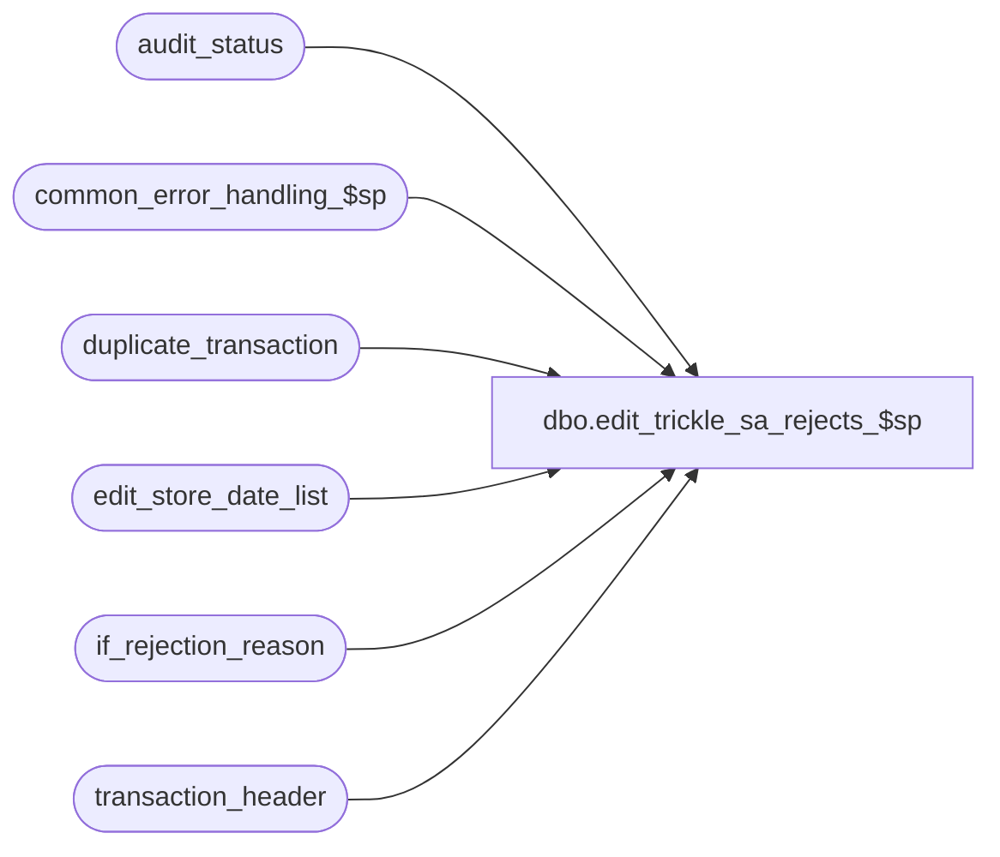

# dbo.edit_trickle_sa_rejects_$sp

**Database:** auditworks_external  
**Server:** bedrockdb01  

## Architecture Diagram



## Table Dependencies

| Referenced Table |
|---|
| audit_status |
| common_error_handling_$sp |
| duplicate_transaction |
| edit_store_date_list |
| if_rejection_reason |
| transaction_header |

## Stored Procedure Code

```sql
create proc dbo.edit_trickle_sa_rejects_$sp 


@errmsg	nvarchar(2000) OUTPUT,
@edit_process_no	tinyint = 1

AS

  /* 
    
    Proc Name : edit_trickle_sa_rejects_$sp
         Desc : To set sa rejection quantity, valid_qty and duplicate_qty 
                in audit status for store-dates trickle edited. This is done in phase2 if
                not trickle. 
                Called by edit_post_$sp if trickle_polling_flag = 1 in parameter_general.

    HISTORY:

    Date     Name         Def# Desc
    Dec05,14 Paul        94103 use try catch, process txn for current edit stream only
    Dec15,04 Maryam    DV-1191 Improve performance.
    Jan15,02 Henry     1-A1CTQ Correctly set the duplicate_verified flag in audit_status.
    Nov26,01 Winnie    1-969YY Add logic for R3 error handling to pass @edit_process_no
    Nov27,01 Ian K     1-97UU6 Edit Phase 2 batching for R3
    Dec11,00 Paul         7110 combine multiple queries into one search of transaction_header
    Mar30,00 Phu          6158 Missing group by in select .. into #new_duplicate_flag
    Apr08,99 Louise            author

  */

DECLARE 
  @errmsg2                      nvarchar(2000),
  @errline                      int,
  @errno                        int,
  @rows                         int,
  @object_name                  nvarchar(255),
  @process_name                 nvarchar(100),
  @operation_name               nvarchar(100),
  @process_no                   int,
  @message_id                   int;
  
  SELECT @process_name     = 'edit_trickle_sa_rejects_$sp',
         @process_no       = 5,
         @message_id       = 201068;     

BEGIN TRY

    SELECT @errmsg         = 'Failed to create table #tran_counts',
           @object_name    = '#tran_counts',
           @operation_name = 'CREATE TABLE';
  CREATE TABLE #tran_counts(store_no int not null,
                            register_no smallint not null,
                            transaction_date smalldatetime not null,
                            date_reject_id tinyint not null,
                            sa_reject_count smallint not null,
                            if_reject_count smallint not null,
                            valid_count smallint not null);

    SELECT @errmsg         = 'Failed to create temp table #if_reject_counts',
           @object_name    = '#if_reject_counts';
  CREATE TABLE #if_reject_counts(store_no int not null,
                                 register_no smallint not null,
                                 transaction_date smalldatetime not null,
                                 date_reject_id tinyint not null,
                                 nondeferred_count smallint not null);

    SELECT @errmsg         = 'Failed to create temp table #duplicate_counts',
           @object_name    = '#duplicate_counts'; 
  CREATE TABLE #duplicate_counts(store_no int not null,
                                 register_no smallint not null,
                                 transaction_date smalldatetime not null,
                                 date_reject_id tinyint not null,
                                 duplicate_count smallint not null);

    SELECT @errmsg         = 'Failed to create temp table #new_duplicate_flag',
           @object_name    = '#new_duplicate_flag';
  CREATE TABLE #new_duplicate_flag(store_no int not null,
                                   register_no smallint not null,
                                   transaction_date smalldatetime not null,
                                   date_reject_id tinyint not null,
                                   new_verified tinyint not null);
  --
  -- Clear any existing totals. Usually there are none.
  --
    SELECT @errmsg         = 'Failed to update audit_status (qty)',
           @object_name    = 'audit_status',
           @operation_name = 'UPDATE';
  UPDATE audit_status
     SET sa_reject_qty = 0,
         duplicate_qty = 0, 
      valid_qty     = 0,
         if_reject_qty = 0,
         missing_qty   = 0,
         exception_qty = 0
    FROM edit_store_date_list sl WITH (NOLOCK),
         audit_status st
   WHERE sl.trickle_counts_flag = 1
     AND sl.batch_process_no = @edit_process_no
     AND sl.store_no            = st.store_no
     AND sl.register_no         = st.register_no
     AND sl.transaction_date    = st.sales_date
     AND sl.date_reject_id      = st.date_reject_id
     AND (ABS(sa_reject_qty) + duplicate_qty + valid_qty + if_reject_qty + missing_qty
        + exception_qty) != 0;

    SELECT @errmsg         = 'Failed to insert into temp table #tran_counts',
           @object_name    = '#tran_counts',
           @operation_name = 'INSERT';
  INSERT INTO #tran_counts(
         store_no,
         register_no,
         transaction_date,
         date_reject_id,
         sa_reject_count,
         if_reject_count,
         valid_count)
  SELECT sl.store_no,
         sl.register_no,
         sl.transaction_date,
         sl.date_reject_id,
         SUM(SIGN(th.sa_rejection_flag)),
         SUM(SIGN(if_rejection_flag)),
         SUM(1 - SIGN(th.sa_rejection_flag))
    FROM edit_store_date_list sl WITH (NOLOCK), 
         transaction_header th WITH (NOLOCK)
   WHERE sl.trickle_counts_flag = 1
     AND sl.batch_process_no = @edit_process_no
     AND sl.store_no            = th.store_no
     AND sl.register_no         = th.register_no
     AND sl.transaction_date    = th.transaction_date
     AND sl.date_reject_id      = th.date_reject_id
   GROUP BY sl.store_no, sl.register_no, sl.transaction_date, sl.date_reject_id;

  --
  -- Calculate counts of if_rejections which are not deferred
  --
    SELECT @errmsg         = 'Failed to insert into temp table #if_reject_counts',
           @object_name    = '#if_reject_counts',
           @operation_name = 'INSERT';
  INSERT INTO #if_reject_counts(
         store_no,
         register_no,
         transaction_date,
         date_reject_id,
         nondeferred_count)
  SELECT rc.store_no,
         rc.register_no,
         rc.transaction_date,
         rc.date_reject_id,
         COUNT(DISTINCT ir.transaction_id)
    FROM #tran_counts rc WITH (NOLOCK), 
         transaction_header th WITH (NOLOCK) , 
         if_rejection_reason ir 
   WHERE rc.if_reject_count > 0
     AND rc.store_no          = th.store_no
     AND rc.register_no       = th.register_no
     AND rc.transaction_date  = th.transaction_date
     AND rc.date_reject_id    = th.date_reject_id
     AND th.if_rejection_flag = 1
     AND th.transaction_id    = ir.transaction_id
     AND ir.deferred = 0
   GROUP BY rc.store_no, rc.register_no, rc.transaction_date, rc.date_reject_id;

    SELECT @errmsg         = 'Failed to update audit_status (valid_qty)',
           @object_name    = 'audit_status',
           @operation_name = 'UPDATE';
  UPDATE audit_status
     SET sa_reject_qty = sa_reject_count,
         valid_qty     = valid_count
    FROM #tran_counts tc WITH (NOLOCK), 
         audit_status st
   WHERE st.store_no       = tc.store_no
     AND st.register_no    = tc.register_no
     AND st.sales_date     = tc.transaction_date
     AND st.date_reject_id = tc.date_reject_id;

    SELECT @errmsg         = 'Failed to update audit_status (if_reject_qty)',
           @object_name    = 'audit_status',
           @operation_name = 'UPDATE';
  UPDATE audit_status
     SET if_reject_qty = nondeferred_count
    FROM #if_reject_counts rc WITH (NOLOCK), 
         audit_status st
   WHERE st.store_no       = rc.store_no
     AND st.register_no    = rc.register_no
     AND st.sales_date     = rc.transaction_date
     AND st.date_reject_id = rc.date_reject_id;

    SELECT @errmsg         = 'Failed to build temp table #duplicate_counts',
           @object_name    = '#duplicate_counts',
           @operation_name = 'INSERT';
  INSERT INTO #duplicate_counts(
         store_no,
         register_no,
         transaction_date,
         date_reject_id,
         duplicate_count)
  SELECT sl.store_no,
         sl.register_no,
         sl.transaction_date,
         sl.date_reject_id,
         COUNT(transaction_no)
    FROM edit_store_date_list sl WITH (NOLOCK), 
         duplicate_transaction dt
   WHERE sl.trickle_counts_flag = 1
     AND sl.batch_process_no = @edit_process_no
     AND sl.store_no            = dt.store_no
     AND sl.register_no         = dt.register_no
     AND sl.transaction_date    = dt.transaction_date
     AND sl.date_reject_id      = dt.date_reject_id
   GROUP BY sl.store_no, sl.register_no, sl.transaction_date, sl.date_reject_id;

  SELECT @rows = @@rowcount;

  IF @rows > 0
  BEGIN
      SELECT @errmsg       = 'Failed to update audit_status (duplicate_qty)',
           @object_name    = 'audit_status',
           @operation_name = 'UPDATE';
    UPDATE audit_status
       SET duplicate_qty = dc.duplicate_count
      FROM #duplicate_counts dc WITH (NOLOCK), 
	   audit_status st
     WHERE st.store_no       = dc.store_no
       AND st.register_no    = dc.register_no
       AND st.sales_date     = dc.transaction_date
       AND st.date_reject_id = dc.date_reject_id;
  END; -- @rows > 0
  
  --
  -- Need to reset duplicate_verified to 0 if new duplicates have been edited and flag has
  -- already been set to 1 through front-end auditing.
  --
    SELECT @errmsg         = 'Failed to insert into temp table #new_duplicate_flag',
           @object_name    = '#new_duplicate_flag',
           @operation_name = 'INSERT'; 
  INSERT INTO #new_duplicate_flag(
         store_no,
         register_no,
         transaction_date,
         date_reject_id,
         new_verified)
  SELECT sl.store_no,
         sl.register_no,
         sl.transaction_date,
         sl.date_reject_id,
         MIN(CONVERT(tinyint,dt.verified))
    FROM edit_store_date_list sl WITH (NOLOCK), duplicate_transaction dt
   WHERE sl.trickle_counts_flag = 1
     AND sl.batch_process_no = @edit_process_no
     AND sl.store_no = dt.store_no
     AND sl.register_no = dt.register_no
     AND sl.transaction_date = dt.transaction_date
     AND sl.date_reject_id = dt.date_reject_id
   GROUP BY sl.store_no, sl.register_no, sl.transaction_date, sl.date_reject_id;

  SELECT @rows = @@rowcount;

  IF @rows > 0
  BEGIN
      SELECT @errmsg         = 'Failed to update audit_status (duplicate_verified)',
           @object_name    = 'audit_status',
           @operation_name = 'UPDATE';
    UPDATE audit_status
       SET duplicate_verified = dc.new_verified
      FROM #new_duplicate_flag dc WITH (NOLOCK), 
	   audit_status st
     WHERE st.store_no            = dc.store_no
       AND st.register_no         = dc.register_no
       AND st.sales_date          = dc.transaction_date
       AND st.date_reject_id      = dc.date_reject_id
       AND st.duplicate_verified != dc.new_verified;
  END; -- If @rows > 0

  RETURN;


business_error:   /* Business Rule handler. */

	SELECT @errmsg2 = @errmsg;

	EXEC common_error_handling_$sp @process_no, @errno, @errmsg, 0, @message_id, 
                                 @process_name, @object_name, @operation_name, 1, @edit_process_no;
	  /* Note: when the exec above raises an error, that action also fires the system error trap (below) */
	RETURN;
END TRY

BEGIN CATCH; -- trap system errors
    /* common error handling. Appending proc name here because a rollback could occur if called within a transaction. */

        SELECT @errno = ERROR_NUMBER(),
		@errline = ERROR_LINE();

        SELECT @errmsg = CONVERT(nvarchar, @errno) + ':' + @process_name + ':' + CONVERT(nvarchar, @errline) + ':'
               + COALESCE(@errmsg, ' ') + ':' + ERROR_MESSAGE();

	 /* this condition will only be true when raise error in traps above fire this general catch */
	IF @errmsg2 IS NOT NULL
	  SELECT @errmsg = @errmsg2;

	EXEC common_error_handling_$sp @process_no, @errno, @errmsg, 0, @message_id, 
                                 @process_name, @object_name, @operation_name, 1, @edit_process_no;

	RETURN;
END CATCH;
```

