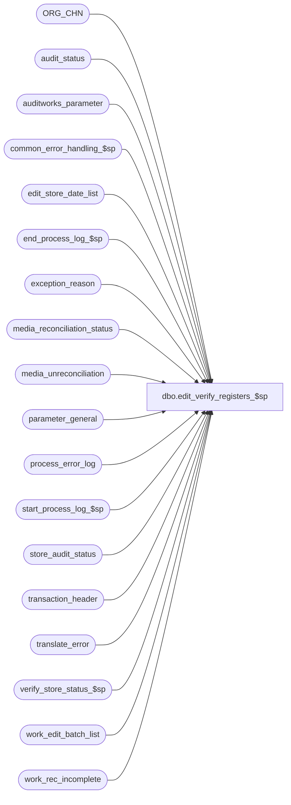

# dbo.edit_verify_registers_$sp

**Database:** auditworks_external  
**Server:** bedrockdb01  

## Architecture Diagram



## Table Dependencies

| Referenced Table |
|---|
| ORG_CHN |
| audit_status |
| auditworks_parameter |
| common_error_handling_$sp |
| edit_store_date_list |
| end_process_log_$sp |
| exception_reason |
| media_reconciliation_status |
| media_unreconciliation |
| parameter_general |
| process_error_log |
| start_process_log_$sp |
| store_audit_status |
| transaction_header |
| translate_error |
| verify_store_status_$sp |
| work_edit_batch_list |
| work_rec_incomplete |

## Stored Procedure Code

```sql
create proc dbo.edit_verify_registers_$sp  @process_id            binary(16),
 @user_id		int,
 @process_timestamp     float,
 @errmsg                nvarchar(2000) OUTPUT,
 @trickle_finished_flag tinyint /* always 1 */

AS

  /* 
  
    Proc name : edit_verify_registers_$sp
         Desc : Verify all edited store_reg_dates (status = 100).
                Set status to 200 (verified) for all that meet verification criteria.
                If autaccept_flag is on for a verified store then set status = 300 (accepted).
                Uses cursor to minimize locking.
                Called by edit_phase2_$sp.
    
    HISTORY

Date     Name           Def#  Desc
Dec02,14 Vicci     TFS-94637  Ensure store_audit_status is updated even when the batch did not contain any "audit-concern-free" store/dates.
                              Otherwise store_audit_status is left at Edited instead of Invalid Store and/or Invalid Register, for example.
Jan27,14 Vicci        141621  Leave status at Edited if unreconciled media beyond tolerance already exists.
Oct21,10 Vicci        121948  Since unreconciled FLOAT rec-type amounts are now considered activity too, ensure they
                              only prevent auto-accept if the drawer fund has changed.
Apr05,10 Vicci        115666  When re-evaluating a status > 100 that has audit-concerns, downgrade the status to 100
			      if the status is 200 (not only if it is 300).
Nov20,09 Vicci        113373  For the purpose of the Auto-Accept, ignore closeouts which do not fall within the defined 
			      pre/post midnight times when logical trading date handling is in use.
Apr25,08 Paul          98023  Uplift 1-3WGK0B to SA5
Apr05.07 Daphna      DV-1360  uplift 84045  update other registers in verify_store_status for all stores
Feb05,07 Paul        DV-1355  port 1-39RAI3 to SA5
Apr18,05 Paul        DV-1218  pass 1 in @verify_store_status when calling verify_store_status_$sp
Dec15,04 Maryam      DV-1191  Improve performance.
Oct12,04 Maryam      DV-1146  Modify the call to verify_store_status_$sp to pass 1 for @called_by_edit.
May18,04 David       DV-1071  Use ORG_CHN table instead of store_salesaudit, receive @process_id, @user_id
Apr17,08 Paul       1-3WGK0B  prevent auto-verification of store-dates that are being processed on another stream
Mar12.07 Daphna        84045  update other registers in verify_store_status for all stores
Mar20,06 Daphna     1-39RAI3  Pass new flag in call to verify_store_status
                     / 69360
Dec29,03 Paul        DV-1007  do not autoverify store-dates for which media rec posting failed, remove select into
Jul10,03 Maryam      1-KL08H  Support new auto-accept flag of 3 and 4. Modified options 1
                              and 2 to additionally verify that no reconciliations are 
                              missing for the store/date.
Jan02,03 Paul        1-HNQKP  re-evaluate translate_error_verified flag
Nov27,01 Ian K       1-97UU6  Edit Phase 2 batching for R3
Oct03,00 Paul           6776  Reevaluate exceptions_verified flag 
Jun05,00 Maryam         6244  Closeout flag of 2 is acceptable for auto-accept method 1
Mar01,00 Phu            5900  Change @@fetch_status > 0 to @@fetch_status <> 0 for MS SQL compatibility
Sep18,98 Paul
Apr21,98 Paul                 Author

  */

DECLARE

  @audit_status                 smallint,
  @autoaccept_flag              tinyint,
  @current_date                 smalldatetime,
  @closeout_exists              tinyint,
  @closeout_flag                tinyint,
  @current_day_autoaccept_time  smallint,
  @cursor_open                  tinyint,
  @date_reject_id		tinyint,
  @errno                        int,
  @exceptions_verified          tinyint,
  @latest_date_to_accept        smalldatetime,
  @media_rec_verified           tinyint,
  @opening_drawer_discrepancy   tinyint,
  @prev_sales_date              smalldatetime,
  @prev_store_no                int,
  @process_log_entry            tinyint,
  @process_no                   smallint,
  @register_no                  smallint,
  @sales_date                   smalldatetime,
  @short_by_tender_over_limit   tinyint,
  @store_audit_status           smallint,
  @store_no               int,
  @transaction_count            numeric(12,0),
  @translate_error_verified	tinyint,
  @unreconciled_media_present	tinyint,
  @update_in_progress           smallint,
  @valid_qty                    smallint,
  @object_name                  nvarchar(255),
  @process_name                 nvarchar(100),
  @operation_name               nvarchar(100),
  @message_id	                int,
  @exception_qty		smallint,
  @translate_error_qty		smallint,
  @default_post_midnight_time	int,
  @default_pre_midnight_time	int,
  @completion_date_time		datetime,
  @store_completion_date_time	datetime 
  
  SELECT @process_name     = 'edit_verify_registers_$sp',
         @message_id       = 201068

  SELECT @current_date      = getdate(),
         @errmsg            = NULL,
         @process_log_entry = 0,
         @process_no        = 84,
         @transaction_count = 0

  EXEC start_process_log_$sp @process_no, @process_timestamp OUTPUT, @errmsg OUTPUT
  SELECT @errno = @@error
  IF @errno <> 0
  BEGIN
    IF @errmsg IS NULL /* then */
     SELECT @errmsg       = 'Unable to execute start_process_log_$sp'
    SELECT @object_name    = 'execute start_process_log_$sp',
           @operation_name = 'EXECUTE'
    GOTO error
  END

  SELECT @default_pre_midnight_time = CONVERT(int, par_value)
    FROM auditworks_parameter
   WHERE par_name = 'default_pre_midnight_time'
  SELECT @errno = @@error
  IF @errno != 0
  BEGIN
    SELECT @errmsg = 'Failed to select default_pre_midnight_time from auditworks_parameter',
           @object_name = 'auditworks_parameter',
           @operation_name = 'SELECT'
    GOTO error
  END

  SELECT @default_post_midnight_time = CONVERT(int, par_value)
    FROM auditworks_parameter
   WHERE par_name = 'default_post_midnight_time'
  SELECT @errno = @@error
  IF @errno != 0
  BEGIN
    SELECT @errmsg = 'Failed to select default_post_midnight_time from auditworks_parameter',
           @object_name = 'auditworks_parameter',
           @operation_name = 'SELECT'
    GOTO error
  END

  SELECT @process_log_entry = 1,
         @latest_date_to_accept = CONVERT(smalldatetime, CONVERT(nchar(6),@current_date,12))

  SELECT @current_day_autoaccept_time = ISNULL(current_day_autoaccept_time, 2100)
    FROM parameter_general

  -- If current time < @current_day_autoaccept_time then don't allow autoaccepting sales
  -- with the same sales_date as the current system date. Prevents manual polls from
  -- autoaccepting sales for the current date.

  IF DATEPART(hh, @current_date) * 100
    + DATEPART(mi, @current_date) < @current_day_autoaccept_time
    SELECT @latest_date_to_accept = DATEADD(dd, -1, @latest_date_to_accept)

  -- Re-evaluate whether exceptions have been verified for audit_status rows
  -- which existed before the edit was run.
  -- Also correct any possible integrities related to multistream

  DECLARE reevaluate_crsr CURSOR FAST_FORWARD
    FOR
    SELECT e.store_no,
           e.transaction_date,
           e.register_no,
           e.date_reject_id,
           a.audit_status,
           a.exception_qty,
           a.translate_error_qty
     FROM  work_edit_batch_list e WITH (NOLOCK), 
           audit_status a WITH (NOLOCK)
     WHERE a.store_no             = e.store_no
       AND a.register_no          = e.register_no
       AND a.sales_date           = e.transaction_date
       AND a.date_reject_id       = e.date_reject_id
       AND (a.audit_status <= 300 OR a.audit_status >= 900) -- safety check
       AND (
            (e.status_already_existed = 1 AND (a.exception_qty > 0 OR a.translate_error_qty > 0))
            OR (a.audit_status > 100 
                AND (a.sa_reject_qty > 0 OR a.valid_qty > 0 OR a.short_by_tender_over_limit > 0 OR a.opening_drawer_discrepancy > 0 OR a.unreconciled_media_present > 0))
                )

  OPEN reevaluate_crsr

  SELECT @errno = @@error
  IF @errno != 0
  BEGIN
    SELECT @errmsg         = 'Failed to open reevaluate cursor',
           @object_name    = 'reevaluate cursor',
           @operation_name = 'OPEN'
    GOTO error
  END

  SELECT @cursor_open = 1

  WHILE 0=0
  BEGIN

    FETCH reevaluate_crsr 
     INTO @store_no,
          @sales_date,
          @register_no,
          @date_reject_id,
          @audit_status,
          @exception_qty,
          @translate_error_qty

    IF @@fetch_status <> 0
      BREAK

    SELECT @exceptions_verified = MIN(verified)
      FROM transaction_header th WITH (NOLOCK),  
           exception_reason er WITH (NOLOCK)
     WHERE th.transaction_date = @sales_date
       AND th.store_no         = @store_no
       AND th.register_no      = @register_no
       AND th.date_reject_id   = @date_reject_id
       AND th.transaction_id   = er.transaction_id
 	  
    SELECT @translate_error_verified = MIN(verified)
      FROM translate_error WITH (NOLOCK)
     WHERE transaction_date = @sales_date
       AND store_no         = @store_no
       AND register_no      = @register_no
	
    IF @exceptions_verified = 1 OR @translate_error_verified = 1
    BEGIN
      UPDATE audit_status
         SET exceptions_verified = ISNULL(@exceptions_verified,0),
             translate_error_verified = ISNULL(@translate_error_verified,0)
       WHERE sales_date     = @sales_date
         AND store_no       = @store_no
         AND register_no    = @register_no
         AND date_reject_id = @date_reject_id

      SELECT @errno = @@error
      IF @errno != 0
      BEGIN
        SELECT @errmsg         = 'Failed to update audit_status (exceptions_verified)',
         @object_name    = 'audit_status',
               @operation_name = 'UPDATE'
        GOTO error
      END
    END -- If @exceptions_verified = 1 ...

    IF @audit_status >= 200 AND @date_reject_id = 0 -- fix integrity if audit concerns exist
      BEGIN
	UPDATE audit_status
	   SET audit_status = 100
	 WHERE sales_date     = @sales_date
	   AND store_no       = @store_no
	   AND register_no    = @register_no
	   AND date_reject_id = @date_reject_id

	SELECT @errno = @@error
	IF @errno != 0
	  BEGIN
	   SELECT @errmsg         = 'Failed to update audit_status (status fix)',
	          @object_name    = 'audit_status',
	          @operation_name = 'UPDATE'
	   GOTO error
	  END

	INSERT INTO process_error_log (
		    process_no,
		    error_code,
		    error_timestamp,
		    process_id,
		    verified,
		    error_msg,
		    user_id,
		    memo1,
		    memo2,
		    memo3,
		    memo_date )
	    VALUES (
		    1,
		    201612,
		    getdate(),
		    1, -- batch_process_no
		    1, -- nsb purposes
		    'Edit_verify_registers_$sp has autocorrected an incorrect audit_status. ',
		    null,
		    CONVERT(nvarchar,@audit_status),
		    CONVERT(nvarchar,@store_no),
		    CONVERT(nvarchar,@register_no),
		    @sales_date)

    END -- If @audit_status ...

  END -- End of re-evaluation cursor

  CLOSE reevaluate_crsr
  DEALLOCATE reevaluate_crsr

  SELECT @cursor_open = 0

  CREATE TABLE #audit_status (
         store_no			int           not null,
         register_no			smallint      not null,
         sales_date			smalldatetime not null,
         audit_status           	smallint      not null,
         valid_qty			smallint      not null,
         unreconciled_media_present	tinyint       null,
         completion_date_time		datetime      null )

  SELECT @errno = @@error
  IF @errno <> 0
  BEGIN
    SELECT @errmsg         = 'Unable to create temp table #audit_status',
           @object_name    = '#audit_status',
           @operation_name = 'CREATE'
    GOTO error
  END

  INSERT #audit_status (
         store_no,
         register_no,
         sales_date,
         audit_status,
         valid_qty,
         unreconciled_media_present,
         completion_date_time)  
  SELECT a.store_no,
     a.register_no,
         sales_date,
         audit_status,
         valid_qty,
         unreconciled_media_present,
         a.completion_date_time
    FROM work_edit_batch_list e WITH (NOLOCK), audit_status a 
   WHERE (a.audit_status = 100 OR 
          a.audit_status = 200)
     AND a.date_reject_id = 0
     AND e.date_reject_id = 0
     AND a.store_no       = e.store_no
     AND a.register_no    = e.register_no
     AND a.sales_date     = e.transaction_date
     AND a.date_reject_id = e.date_reject_id
     AND sa_reject_qty = 0
     AND if_reject_qty = 0
     AND (missing_qty                = 0 OR 
          missing_verified           = 1)
     AND (exception_qty              = 0 OR 
          exceptions_verified        = 1)
     AND (duplicate_qty              = 0 OR 
          duplicate_verified         = 1)
     AND (short_by_tender_over_limit = 0 OR 
          media_rec_verified         = 1)
     AND (opening_drawer_discrepancy = 0 OR
          media_rec_verified         = 1)
     AND (translate_error_qty        = 0 OR 
          translate_error_verified   = 1)

  SELECT @transaction_count = @@rowcount, @errno = @@error
  IF @errno <> 0
  BEGIN
    SELECT @errmsg         = 'Unable to insert #audit_status',
           @object_name    = '#audit_status',
           @operation_name = 'INSERT'
    GOTO error
  END

IF @transaction_count > 0  --i.e. if there were some audit-concern-free store/dates in the batch
BEGIN

  DELETE #audit_status -- exclude failed media rec
    FROM #audit_status st, work_rec_incomplete wr WITH (NOLOCK)
   WHERE wr.store_no = st.store_no
     AND wr.transaction_date = st.sales_date
  SELECT @errno = @@error
  IF @errno <> 0
  BEGIN
    SELECT @errmsg = 'Unable to delete #audit_status',
           @object_name    = '#audit_status',
           @operation_name = 'DELETE'
    GOTO error
  END

  -- update audit_status to 200 or 300 for store-reg-dates with no audit concerns

  DECLARE audit_crsr CURSOR FAST_FORWARD
    FOR
    SELECT store_no,
           sales_date,
           register_no,
           audit_status,
           valid_qty,
           ISNULL(unreconciled_media_present,0),
           completion_date_time
      FROM #audit_status WITH (NOLOCK)
     ORDER BY store_no, sales_date, register_no
     
  OPEN audit_crsr

  SELECT @errno = @@error
  IF @errno != 0
  BEGIN
    SELECT @errmsg         = 'Failed to open audit_cursor',
           @object_name    = 'audit_cursor',
           @operation_name = 'OPEN'
    GOTO error
  END

  SELECT @cursor_open   = 2,
         @prev_store_no = -1

  WHILE 1=1
  BEGIN

    FETCH audit_crsr 
     INTO @store_no,
          @sales_date,
          @register_no,
          @audit_status,
          @valid_qty,
          @unreconciled_media_present,
          @completion_date_time

    IF @@fetch_status <> 0
      BREAK

    --141621
    IF @unreconciled_media_present = 1
     AND EXISTS (SELECT 1
                   FROM media_unreconciliation mu WITH (NOLOCK)
                        INNER JOIN media_reconciliation_status ms WITH (NOLOCK)
                           ON ms.balancing_entity_id = mu.balancing_entity_id
                          AND ms.first_unreconciled_date_time is not null AND ms.unreconciled_activity_amount <> 0 
                          AND (   ABS(ms.unreconciled_activity_amount) > ms.unrec_tolerance_amount 
                               OR DATEDIFF(dd, ms.first_unreconciled_date_time, getdate()) > ms.unrec_tolerance_days) 
                  WHERE mu.store_no = @store_no
                    AND mu.register_no = @register_no
                    AND mu.transaction_date = @sales_date
                    AND mu.unrec_activity_flag > 0
                    AND (   DATEDIFF(dd, mu.transaction_date, getdate()) > ms.unrec_tolerance_days --If the unreconciled amount for the balancing entity is NOT beyond tolerance we want the store/reg/dates that are beyond tolerance days.
                         OR ABS(ms.unreconciled_activity_amount) > ms.unrec_tolerance_amount) --If the unreconciled amount for the balancing entity is beyond tolerance we want all store/reg/dates that contributed not just those that are beyond tolerance themselves  
                )
    BEGIN
      CONTINUE; -- skip store/reg/date if unreconciled media is beyond tolerance.
    END;

    -- Change of store or date    
    IF ( @store_no != @prev_store_no OR @sales_date != @prev_sales_date )
    BEGIN 
    	       
      SELECT @update_in_progress         = update_in_progress,
             @short_by_tender_over_limit = short_by_tender_over_limit,
             @opening_drawer_discrepancy = opening_drawer_discrepancy,
             @media_rec_verified         = media_rec_verified,
             @store_completion_date_time = completion_date_time
        FROM store_audit_status  WITH (NOLOCK)
       WHERE store_no       = @store_no
         AND sales_date     = @sales_date
         AND date_reject_id = 0

      IF @store_no != @prev_store_no
      BEGIN

        SELECT @autoaccept_flag = AUTO_ACPT
          FROM ORG_CHN WITH (NOLOCK)
         WHERE ORG_CHN_NUM = @store_no

        SELECT @prev_store_no = @store_no
  
      END  
      
      SELECT @prev_sales_date = @sales_date

    END -- End of Change of store

    IF @update_in_progress > 1
      CONTINUE -- skip store if locked by a manual function

    SELECT @audit_status = 200

    IF ( @autoaccept_flag        >= 1     AND 
         @trickle_finished_flag   = 1                      AND 
         @sales_date             <= @latest_date_to_accept AND 
         @valid_qty            >= 1 )
    BEGIN

      SELECT @closeout_exists = 0,
             @closeout_flag   = 0 
       
      IF @autoaccept_flag in (1, 2) AND @unreconciled_media_present > 0
      BEGIN
        IF EXISTS (SELECT 1 FROM media_reconciliation_status m WHERE m.store_no = @store_no AND (m.register_no = @register_no OR m.register_no = 0) AND m.rec_type = 3)
           AND NOT EXISTS (SELECT 1 FROM media_reconciliation_status m, media_unreconciliation u
                            WHERE m.store_no = @store_no
     			      AND (m.register_no = @register_no OR m.register_no = 0)
     			      AND m.first_unreconciled_date_time < dateadd(hh, 6, dateadd(dd, 1, @sales_date))  --include contribution to expected of counts entered between midnight and 6AM
     			      AND (m.rec_type <> 3 OR m.unreconciled_activity_amount <> 0)
     			      AND @store_no = u.store_no 
     			      AND @register_no = u.register_no 
     			      AND @sales_date = u.transaction_date
     			      AND u.unrec_activity_flag > 0)
          SELECT @unreconciled_media_present = 0
      END  --in the case of FLOAT rec, check if unreconciled activity is <> 0
      
      IF ((@autoaccept_flag = 1 AND @unreconciled_media_present = 0)
           OR @autoaccept_flag = 3)
      BEGIN
        IF @default_pre_midnight_time <> 2359 OR @default_post_midnight_time <> 0
        BEGIN
          IF @completion_date_time IS NOT NULL
            SELECT @closeout_exists = 1, @closeout_flag = 1
        END
        ELSE  --ELSE of IF i_default_pre_midnight_time <> 2359 OR i_default_post_midnight_time <> 0
	BEGIN
          IF EXISTS (SELECT 1   --- look for any closeout flag on @register
                       FROM transaction_header WITH (NOLOCK)
                      WHERE transaction_date = @sales_date
                        AND store_no = @store_no
                        AND date_reject_id = 0
                        AND register_no = @register_no
     AND closeout_flag >= 1)
            SELECT @closeout_exists = 1, @closeout_flag   = 1

          IF @closeout_flag = 0
          BEGIN
            IF EXISTS (SELECT 1  -- look for store closeout flag on other reg
  FROM transaction_header WITH (NOLOCK)
                        WHERE transaction_date = @sales_date
                          AND store_no = @store_no
                          AND date_reject_id = 0
                          AND closeout_flag = 2)
              SELECT @closeout_exists = 1 
          END
        END --ELSE of IF @default_pre_midnight_time <> 2359 OR @default_post_midnight_time <> 0   
      END -- @autoaccept_flag = 1 or 3
      ELSE
      BEGIN
        IF((@autoaccept_flag = 2 AND @unreconciled_media_present = 0)
           OR @autoaccept_flag = 4)
        BEGIN
          IF @default_pre_midnight_time <> 2359 OR @default_post_midnight_time <> 0
          BEGIN
            IF @store_completion_date_time IS NOT NULL
              SELECT @closeout_exists = 1
          END
          ELSE  --ELSE of IF @default_pre_midnight_time <> 2359 OR @default_post_midnight_time <> 0
          BEGIN
            IF EXISTS (SELECT 1
                         FROM transaction_header WITH (NOLOCK)
                        WHERE transaction_date = @sales_date
                          AND store_no = @store_no
                          AND date_reject_id = 0
                          AND closeout_flag = 2 )
              SELECT @closeout_exists = 1
          END --ELSE of IF @default_pre_midnight_time <> 2359 OR @default_post_midnight_time <> 0
        END -- If @autoaccept_flag = 2 or 4
      END -- Else
                  	    
      IF @closeout_exists = 1
        SELECT @audit_status = 300
	      
    END -- If @autoaccept_flag >= 1

    -- check that another edit stream has not started processing the store-reg-date since phase2 started
    -- Set status for all other registers done in verify_store_status

    UPDATE audit_status
       SET audit_status  = @audit_status,
           status_date   = @current_date,
           status_set_by_user_id = NULL --
      FROM audit_status a
     WHERE a.date_reject_id = 0
       AND a.audit_status <= 300 -- safety check for multistream
       AND a.store_no       = @store_no
       AND a.register_no    = @register_no
       AND a.sales_date     = @sales_date
       AND EXISTS( SELECT *
            FROM edit_store_date_list dl
            WHERE dl.store_no       = a.store_no
              AND dl.register_no    = a.register_no
              AND dl.transaction_date = a.sales_date
              AND dl.posted_flag > 0) -- not currently in progress by phase1 on another stream

   SELECT @errno = @@error
   IF @errno <> 0
   BEGIN
      SELECT @errmsg    = 'Failed to update audit_status',
             @object_name    = 'audit_status',
             @operation_name = 'UPDATE'
      GOTO error
   END

  END -- End of audit cursor

  CLOSE audit_crsr
  DEALLOCATE audit_crsr

  SELECT @cursor_open = 0

  DELETE #audit_status

END --IF @transaction_count > 0  --i.e. if there were some audit-concern-free store/dates in the batch
  
  INSERT INTO #audit_status 
         (store_no, register_no, sales_date, audit_status,valid_qty, unreconciled_media_present)
  SELECT DISTINCT store_no, 0, transaction_date,0,0,0
  FROM work_edit_batch_list

  SELECT @errno = @@error
  IF @errno <> 0
  BEGIN
    SELECT @errmsg    = 'Failed to INSERT INTO #audit_status for all store-dates in batch',
           @object_name    = '#audit_status',
           @operation_name = 'INSERT'
    GOTO error
  END
     
  -- exclude failed media rec
  
  DELETE #audit_status
  FROM #audit_status st, work_rec_incomplete wr WITH (NOLOCK)
  WHERE st.store_no = wr.store_no
  AND wr.transaction_date = st.sales_date

  SELECT @errno = @@error
  IF @errno <> 0
  BEGIN
    SELECT @errmsg    = 'Failed to DELETE   audit_status where media rec incomplete',
           @object_name    = '#audit_status',
           @operation_name = 'DELETE'
    GOTO error
  END

  -- Set store_audit_status to match audit_status

  DECLARE store_crsr CURSOR FAST_FORWARD
  FOR
  SELECT store_no, sales_date
  FROM #audit_status WITH (NOLOCK)
  ORDER BY store_no, sales_date
  
  OPEN store_crsr
  
  SELECT @errno = @@error
  IF @errno <> 0
  BEGIN
    SELECT @errmsg    = 'Failed to open store_crsr',
           @object_name    = 'store_crsr',
           @operation_name = 'OPEN'
    GOTO error
  END
  
  SELECT @cursor_open = 3
  
  WHILE 3=3
  BEGIN
    FETCH store_crsr
     INTO @store_no, @sales_date
    
    IF @@fetch_status <> 0
      BREAK
      
     EXEC verify_store_status_$sp @process_id, null, @store_no, @sales_date, 0, @errmsg OUTPUT, 1, 1
       
     SELECT @errno = @@error
     IF @errno <> 0
     BEGIN        
       IF @errmsg IS NULL /* then */
         SELECT @errmsg      = 'Failed to execute stored proc verify_store_status_$sp'
       SELECT @object_name    = 'audit_cursor',
              @operation_name = 'OPEN'
       GOTO error
     END
	         
     UPDATE store_audit_status 
        SET update_in_progress = 0 
      WHERE store_no       = @store_no
        AND sales_date     = @sales_date
        AND date_reject_id = 0
       
     SELECT @errno = @@error
     IF @errno <> 0
     BEGIN
       SELECT @errmsg         = 'Failed to set update_in_progress to 0',
              @object_name    = 'store_audit_status',
              @operation_name = 'UPDATE'
     GOTO error
     END       
  END -- While 3=3
  
  CLOSE store_crsr
  DEALLOCATE store_crsr
  
  SELECT @cursor_open =0
  

  EXEC end_process_log_$sp @process_no, @process_timestamp, @transaction_count
 
  RETURN


error:

  IF @cursor_open = 1
  BEGIN
    CLOSE reevaluate_crsr
    DEALLOCATE reevaluate_crsr
  END

  IF @cursor_open = 2
  BEGIN
    CLOSE audit_crsr
    DEALLOCATE audit_crsr
  END
  
  
  IF @cursor_open = 3
  BEGIN
    CLOSE store_crsr
    DEALLOCATE store_crsr
  END

	  
  EXEC common_error_handling_$sp @process_no, @errno, @errmsg, 0, @message_id, @process_name,
       @object_name, @operation_name, 1, 1, 0, null, 0, null, null, null, null, null, null,
       0, @process_id, @user_id
  
  RETURN
```

