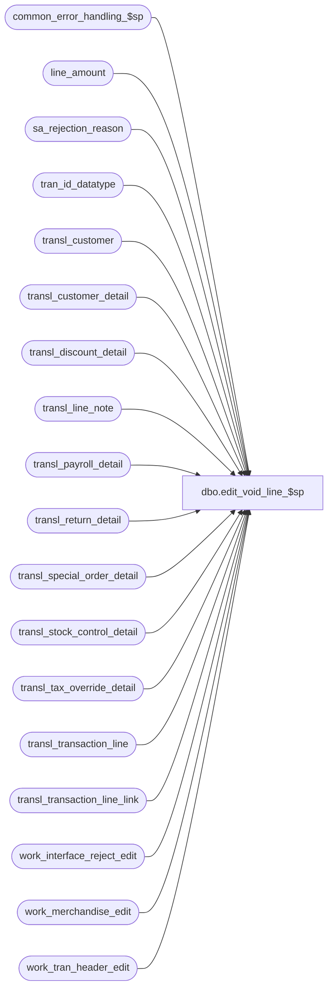

# dbo.edit_void_line_$sp

**Database:** auditworks_external  
**Server:** bedrockdb01  

## Architecture Diagram



## Table Dependencies

| Referenced Table |
|---|
| common_error_handling_$sp |
| line_amount |
| sa_rejection_reason |
| tran_id_datatype |
| transl_customer |
| transl_customer_detail |
| transl_discount_detail |
| transl_line_note |
| transl_payroll_detail |
| transl_return_detail |
| transl_special_order_detail |
| transl_stock_control_detail |
| transl_tax_override_detail |
| transl_transaction_line |
| transl_transaction_line_link |
| work_interface_reject_edit |
| work_merchandise_edit |
| work_tran_header_edit |

## Stored Procedure Code

```sql
create proc dbo.edit_void_line_$sp @store_no			int,
@register_no			smallint,
@entry_date_time		datetime,
@transaction_series		nchar(1),
@transaction_no			int,
@voiding_line_id		numeric(5,0),
@errmsg				nvarchar(2000) OUTPUT,
@void_discount_flag		tinyint OUTPUT,
@transaction_void_flag		smallint,
@voiding_disc_multiplier	smallint,
@edit_process_no		tinyint = 1

AS

/* Proc Name: edit_void_line_$sp

   Description: Look for a previous transaction line which matches the voiding
    line ( match on amount, discount, line_action, line_object_type and upc_no ).
    Can't match on line_object because register does not always log correct
    line_object on voiding lines.
    If a matching line is found then set it's line_void_flag to 1.
    If no match, then create sa rejection (type 13) unless transaction is void.
    Always deletes the voiding line. Allows a variation of + or - 4 cents in
    the discount_amount in order to allow for pro-rating rounding problems.
   Called from edit_lines_validation_$sp.

 HISTORY : 
DATE     NAME        DEFECT# DESC
Dec16,14 Paul      TFS-94103 use try catch
Aug05,13 Vicci/Phu  1-4B8OIE Add line_object to the search for the voided line.
May24,13 Vicci      1-4AF4NF It is not good enough to void all item-level discount lines immediately following the matched merch line, 
                             since as of S/A 5.0, markdown lines no longer necessarily immediately follow the merch, they may be positionned anywhere 
                             so long as they are attached to the merch line via a discount detail attachment.
Nov19,12 Vicci        139802 Handle voiding of a markdown line (without voiding of merch line) too.  
			     Remove temp tables that were not actually causing anything to be deleted.
Aug24,12 Vicci        137580 Correct join to transl_discount_detail in multiple-possible-match handling logic to include line_id and
                             since the tech ref manual tells clients to log mardowns on voiding reversal lines as markups and this code
                             multiplied (for applied markdowns) by a @voiding_disc_multiplier of -1 to compensate, do the same for expensed
                             markdowns.
Sep08,09 Paul         112565 Delete stock control attachments for voiding lines
Oct25,06 Phu           77931 Fix outer join for SQL 2005 Mode 90.
Feb07,06 Paul        DV-1328 apply 67019 to SA5
Sep09,05 Paul        DV-1312 apply 46963, DV-1298 to SA5
Apr28,05 Paul        DV-1234 expand transaction_id to use tran_id_datatype
Dec15,04 Maryam      DV-1191 Improve performance.
Sep02,04 David       DV-1129 apply 29561 to SA5
Feb07,06 Paul          67019 handle multiple gift certificate lines by matching on reference_no when not null
Jan11,05 Daphna        46963 When discounts expensed (not applied), ensure correct line is
                             voided
Jul15,04 Vicci         29561 Handling line_object_type 23 (PLU subtotal discounts)
Mar25,04 Daphna        26288 ensure transl_discount_detail deleted for all discount types, 
                             remove recalculation of discounts (done in edit_lines_validation_$sp)
Mar21,02 David C     1-BTT0H Recalculate pos_discount_amount in transaction_line
Nov26,01 Winnie      1-969YY Add logic for R3 error handling to pass @edit_process_no
Nov12,01 Sab            8900 TRANSL edit changes for Sybase
Jan22,01 Paul           7222 delete line_note for voiding line to avoid interface problems
May19,00 Henry          5938 To remove the voided line from return_detail table.
Mar16,00 Louise M.      6088 To properly void all markdowns (not just the first) following the 
				voided merch/non-merch line.
Jun25,99 Shapoor        4882 If_reject_reason = 7 were not getting reported correctly
                             if the the transaction had voided lines.
Jun22,99 Lousie M.          Added code to void lines that follow voided non-merch lines
Dec15,97 Paul S.  Author.

 */

DECLARE
	@applied_by_line_id		numeric(5,0),
	@counter			numeric(5,0),
	@cursor_open 			tinyint,
	@errmsg2			nvarchar(2000),
	@errline			int,
	@errno				int,
	@line_void_flag			tinyint,
	@match_line_id                  numeric(5,0),
	@match_line_disc		line_amount,
	@max_disc_amount		line_amount,
	@min_disc_amount		line_amount,
	@possible_matches               smallint,
	@rows				int,
	@updated_row			int,
	@voided_db_cr_none		smallint,
	@voided_disc_det_amount         line_amount,
	@voided_disc_det_level 		smallint,
	@voided_disc_det_type           smallint,
	@voided_line_action		tinyint,
	@voided_line_amount		line_amount,
	@voided_line_amount_sign 	smallint,
	@voided_line_id			numeric(5,0),
	@voided_line_object		smallint,
	@voided_object_type		tinyint,
	@voided_pos_disc_amount		line_amount,
	@voided_reference_no		nvarchar(20),
	@voided_upc_no			numeric(14,0),
	@transaction_id			tran_id_datatype,
	@message_id	        	int,	
	@object_name	         	nvarchar(255),	
	@operation_name	        	nvarchar(100),
	@process_name     		nvarchar(100); 		

SELECT @process_name = 'edit_void_line_$sp',
       @message_id = 201068,
       @cursor_open = 0;

BEGIN TRY

  SELECT @errmsg = 'OUTER joint to work_merchandise_edit',
         @object_name = 'transl_transaction_line',
         @operation_name = 'SELECT';
SELECT  @voided_line_object = tl.line_object,
	@voided_line_action = tl.line_action,
	@voided_line_amount = tl.gross_line_amount,
	@voided_db_cr_none = db_cr_none,
	@voided_pos_disc_amount = tl.pos_discount_amount * @voiding_disc_multiplier,  --note:  @voiding_disc_multiplier is hard-coded to -1 in the calling proc which makes this @voided_pos_disc_amount have the wrong sign which in turn was worked around in the Tech Ref Manual by telling clients to log the markdown as a markup (i.e. negative) on voiding reversal lines.
	@voided_object_type = line_object_type,
	@voided_upc_no = upc_no,
	@voided_reference_no = reference_no,
	@line_void_flag = line_void_flag,
	@void_discount_flag = 0,
	@transaction_id = tl.transaction_id
   FROM transl_transaction_line tl WITH (NOLOCK)
        LEFT JOIN work_merchandise_edit md WITH (NOLOCK) ON (tl.transaction_id = md.transaction_id AND tl.line_id = md.line_id)
  WHERE tl.transaction_no = @transaction_no
    AND tl.entry_date_time = @entry_date_time
    AND tl.store_no = @store_no
    AND tl.register_no = @register_no
    AND tl.transaction_series = @transaction_series
    AND tl.transaction_id IS NOT NULL   
    AND tl.line_id = @voiding_line_id;

SELECT @rows = @@rowcount;

IF @rows = 0
  RETURN;

IF @voided_pos_disc_amount = 0
  SELECT @min_disc_amount = 0,
	@max_disc_amount = 0;
ELSE
  SELECT @min_disc_amount = @voided_pos_disc_amount - .04,
	@max_disc_amount = @voided_pos_disc_amount + .04;

/* If voiding line is void, don't look for matching line or create sa reject */
IF @line_void_flag = 1
  SELECT @voided_upc_no = NULL,
 	 @transaction_void_flag = 8;

/*{ search for a matching line */

IF @voided_object_type = 1 AND @voided_upc_no IS NOT NULL /* mdse with upc_no */
 BEGIN
      SELECT @errmsg = ' MIN(line_id), COUNT(line_id) from work_merchandise_edit',
           @object_name = 'transl_transaction_line',
           @operation_name = 'SELECT';
   SELECT @voided_line_id = MAX( tl.line_id ),
          @possible_matches = COUNT(tl.line_id)
     FROM transl_transaction_line tl WITH (NOLOCK), work_merchandise_edit md WITH (NOLOCK)
    WHERE tl.transaction_no = @transaction_no
      AND tl.entry_date_time = @entry_date_time
      AND tl.store_no = @store_no
      AND tl.register_no = @register_no
      AND tl.transaction_series = @transaction_series
      AND tl.transaction_id IS NOT NULL   
      AND tl.line_id < @voiding_line_id
      AND line_void_flag = 0
      AND voiding_reversal_flag != 0 /* normal line - not a reversing line */
      AND line_object_type = @voided_object_type
     AND tl.line_action = @voided_line_action
      AND tl.gross_line_amount = @voided_line_amount
      AND pos_discount_amount >= @min_disc_amount
      AND pos_discount_amount <= @max_disc_amount
      AND db_cr_none = @voided_db_cr_none
      AND tl.transaction_id = md.transaction_id
      AND tl.line_id = md.line_id
      AND md.upc_no = @voided_upc_no;

  IF @possible_matches > 1   -- determine which is correct 
  BEGIN    
      SELECT @errmsg = ' @voided_disc_det_amount',
             @object_name = 'transl_discount_detail';
  SELECT @voided_disc_det_amount=  ISNULL(SUM(td.pos_discount_amount),0) * @voiding_disc_multiplier --note:  @voiding_disc_multiplier is hard-coded to -1 in the calling proc which makes this @voided_pos_disc_amount have the wrong sign which in turn was worked around in the Tech Ref Manual by telling clients to log the markdown as a markup (i.e. negative) on voiding reversal lines.
      FROM transl_transaction_line tl WITH (NOLOCK)
           LEFT JOIN transl_discount_detail td  WITH (NOLOCK) ON (tl.transaction_id = td.transaction_id AND tl.line_id = td.line_id)
     WHERE tl.transaction_no = @transaction_no
       AND tl.entry_date_time = @entry_date_time
       AND tl.store_no = @store_no
       AND tl.register_no = @register_no
       AND tl.transaction_series = @transaction_series
       AND tl.transaction_id IS NOT NULL   
       AND tl.line_id = @voiding_line_id;

      SELECT @errmsg = ' from transl_transaction_line, work_merchandise_edit',
             @object_name = 'match_disc_crsr',
             @operation_name = 'OPEN' ;
    DECLARE match_disc_crsr CURSOR FAST_FORWARD
    FOR
    SELECT tl.line_id
        FROM transl_transaction_line tl WITH (NOLOCK),
             work_merchandise_edit md WITH (NOLOCK)
       WHERE tl.transaction_no = @transaction_no
        AND tl.entry_date_time = @entry_date_time
        AND tl.store_no = @store_no
        AND tl.register_no = @register_no
        AND tl.transaction_series = @transaction_series
        AND tl.transaction_id IS NOT NULL   
        AND tl.line_id < @voiding_line_id
        AND line_void_flag = 0
        AND voiding_reversal_flag != 0 /* normal line - not a reversing line */
        AND line_object_type = @voided_object_type
        AND tl.line_action = @voided_line_action
        AND tl.gross_line_amount = @voided_line_amount
        AND tl.pos_discount_amount >= @min_disc_amount  --Note:  this only restricts the selection in the case of APPLIED markdowns (if they are expensed see below)
        AND tl.pos_discount_amount <= @max_disc_amount
        AND db_cr_none = @voided_db_cr_none
        AND tl.transaction_id = md.transaction_id
        AND tl.line_id = md.line_id
        AND md.upc_no = @voided_upc_no    
      ORDER BY tl.line_id;

    OPEN match_disc_crsr
    SELECT @cursor_open = 1,
           @errmsg = ' @match_line_disc where line_id = @match_line_id',
           @object_name = 'transl_discount_detail',
           @operation_name = 'SELECT';
   
    WHILE 1=1
    BEGIN
      FETCH match_disc_crsr
      INTO @match_line_id;
     
      IF @@fetch_status <> 0
        BREAK;
     
      SELECT @match_line_disc = 0;
     
      SELECT @match_line_disc = ISNULL(SUM(td.pos_discount_amount),0)
        FROM transl_transaction_line tl,
             transl_discount_detail td 
       WHERE tl.store_no = @store_no
         AND tl.register_no = @register_no
         AND tl.entry_date_time = @entry_date_time
         AND tl.transaction_series = @transaction_series
         AND tl.transaction_no = @transaction_no
         AND tl.transaction_id IS NOT NULL
         AND tl.transaction_id = td.transaction_id
         AND tl.line_id = @match_line_id
         AND tl.line_id = td.line_id
         GROUP BY tl.line_id;

      IF @voided_disc_det_amount = ISNULL(@match_line_disc,0)
      BEGIN
        SELECT @voided_line_id = @match_line_id;
        BREAK;
END;               
    END; -- while 1=1
   
   CLOSE match_disc_crsr;
    DEALLOCATE match_disc_crsr;
    SELECT @cursor_open = 0;
        
 END; -- @possible_matches > 1 
END;  -- with UPC 
ELSE -- either @voided_upc_no is null or @voided_object_type != 1
 BEGIN
   IF @line_void_flag = 1   --139802:  removed OR @voided_object_type IN (16,17,22)  since a markdown line can be voided without the merch line being voided.
      SELECT @voided_line_id = -1;
   ELSE
   BEGIN
     IF @voided_object_type NOT IN (16,17,22)
     BEGIN
         SELECT @errmsg = 'Failed to determine if matching (based on object and ref#) line exists in transl_transaction_line for voiding reversal',
                @object_name = 'transl_transaction_line',
                @operation_name = 'SELECT';
       SELECT @voided_line_id = MAX(line_id),  
              @possible_matches = COUNT(line_id)
         FROM transl_transaction_line WITH (NOLOCK)
        WHERE transaction_no = @transaction_no
          AND entry_date_time = @entry_date_time
          AND store_no = @store_no
          AND register_no = @register_no
          AND transaction_series = @transaction_series
          AND transaction_id IS NOT NULL
          AND line_id < @voiding_line_id
          AND line_void_flag = 0
          AND voiding_reversal_flag != 0 /* normal line - not a reversing line */
          AND line_object_type = @voided_object_type
          AND line_object = @voided_line_object
          AND ((reference_no IS NULL AND @voided_reference_no IS NULL) 
               OR reference_no = @voided_reference_no)
          AND line_action = @voided_line_action
          AND gross_line_amount = @voided_line_amount
          AND pos_discount_amount >= @min_disc_amount
          AND pos_discount_amount <= @max_disc_amount
          AND db_cr_none = @voided_db_cr_none;

       IF @voided_line_id IS NULL
       BEGIN
           SELECT @errmsg = 'Failed to determine if matching (based on object and only look at ref# for gift cert) line exists in transl_transaction_line for voiding reversal';
         SELECT @voided_line_id = MAX(line_id),  
                @possible_matches = COUNT(line_id)
           FROM transl_transaction_line WITH (NOLOCK)
          WHERE transaction_no = @transaction_no
            AND entry_date_time = @entry_date_time
            AND store_no = @store_no
            AND register_no = @register_no
            AND transaction_series = @transaction_series
            AND transaction_id IS NOT NULL   
            AND line_id < @voiding_line_id
            AND line_void_flag = 0
            AND voiding_reversal_flag != 0 /* normal line - not a reversing line */
            AND line_object_type = @voided_object_type
            AND line_object = @voided_line_object
            AND (@voided_object_type != 4 OR @voided_reference_no IS NULL OR (@voided_object_type = 4 AND reference_no = @voided_reference_no))
            AND line_action = @voided_line_action
            AND gross_line_amount = @voided_line_amount
            AND pos_discount_amount >= @min_disc_amount
            AND pos_discount_amount <= @max_disc_amount
            AND db_cr_none = @voided_db_cr_none;
       END;

       IF @voided_line_id IS NULL
       BEGIN
           SELECT @errmsg = 'Failed to determine if matching (regardless of object) line exists in transl_transaction_line for voiding reversal';
         SELECT @voided_line_id = MAX(line_id),  
                @possible_matches = COUNT(line_id)
           FROM transl_transaction_line WITH (NOLOCK)
          WHERE transaction_no = @transaction_no
            AND entry_date_time = @entry_date_time
            AND store_no = @store_no
            AND register_no = @register_no
            AND transaction_series = @transaction_series
            AND transaction_id IS NOT NULL   
            AND line_id < @voiding_line_id
            AND line_void_flag = 0
            AND voiding_reversal_flag != 0 /* normal line - not a reversing line */
            AND line_object_type = @voided_object_type
            AND (@voided_object_type != 4 OR @voided_reference_no IS NULL OR (@voided_object_type = 4 AND reference_no = @voided_reference_no))
            AND line_action = @voided_line_action
            AND gross_line_amount = @voided_line_amount
            AND pos_discount_amount >= @min_disc_amount
            AND pos_discount_amount <= @max_disc_amount
            AND db_cr_none = @voided_db_cr_none;
       END;
       
     END --IF @voided_object_type NOT IN (16,17,22)
     ELSE  --139802
     BEGIN
       --Note that if the markdown line in question is applied to merchandise which is also a voiding reversal, 
       --then we don't expect to find a match using the code below, which is only intended to handle the case of a void of a markdown applied to a VALID/NON-VOID item.
         SELECT @errmsg = 'Failed to determine if matching line exists in transl_transaction_line for markdown voiding reversal';
       SELECT @voided_line_id = MAX(tl.line_id) 
         FROM transl_discount_detail vd WITH (NOLOCK)
              INNER JOIN transl_discount_detail td WITH (NOLOCK)  --find another markdown line that was applied to the same item as the markdown which is a voiding reversal.
                 ON td.transaction_id = vd.transaction_id 
                AND td.line_id = vd.line_id
                AND td.applied_by_line_id < @voiding_line_id
                AND td.pos_discount_level = @voided_object_type
                AND td.pos_discount_type = @voided_line_object
              INNER JOIN transl_transaction_line tl WITH (NOLOCK)
                 ON tl.transaction_id = td.transaction_id 
                AND tl.line_id = td.applied_by_line_id
                AND tl.line_void_flag = 0
                AND tl.voiding_reversal_flag != 0 /* normal line - not a reversing line */
                AND tl.line_object_type = @voided_object_type
                AND tl.line_object = @voided_line_object
                AND tl.line_action = @voided_line_action
                AND tl.gross_line_amount = @voided_line_amount
                AND tl.db_cr_none = @voided_db_cr_none
        WHERE vd.transaction_no = @transaction_no
   	  AND vd.entry_date_time = @entry_date_time
          AND vd.store_no = @store_no
	  AND vd.register_no = @register_no
	  AND vd.transaction_series = @transaction_series
	  AND vd.applied_by_line_id = @voiding_line_id;         

     END;  --ELSE of IF @voided_object_type NOT IN (16,17,22)
   END;  -- ELSE OF: @line_void_flag = 1 OR @voided_object_type IN (16,17,22)      
END;  -- no UPC

/*} search for a matching line */

IF @voided_line_id >= 1
BEGIN
  /* flag matched line */
    SELECT @errmsg = 'Failed to update transl_transaction_line',
           @object_name = 'transl_transaction_line',
           @operation_name = 'UPDATE';
  UPDATE transl_transaction_line
     SET line_void_flag = 1,
	 interface_rejection_flag = 0
   WHERE transaction_no = @transaction_no
     AND entry_date_time = @entry_date_time
     AND store_no = @store_no
     AND register_no = @register_no
     AND transaction_series = @transaction_series
     AND transaction_id IS NOT NULL   
     AND line_id = @voided_line_id;

  /* Void all item-level discount lines associated with the voided merch line */
  /* Defect 1-4AF4NF it is not good enough to void all item-level discount lines immediately following the matched merch line, 
     since as of S/A 5.0, markdown lines no longer necessarily immediately follow the merch, they may be positionned anywhere so long as
     they are attached to the merch line via a discount detail attachment. */
  IF @voided_object_type IN (1,2)
  BEGIN    
      SELECT @errmsg = 'Failed to void markdown lines associated with merchandise line being voided.',
             @object_name = 'transl_transaction_line',
  @operation_name = 'UPDATE';
    UPDATE transl_transaction_line
       SET line_void_flag = 1,
  	   interface_rejection_flag = 0
     WHERE transl_transaction_line.transaction_no = @transaction_no
       AND transl_transaction_line.entry_date_time = @entry_date_time
       AND transl_transaction_line.store_no = @store_no
       AND transl_transaction_line.register_no = @register_no
       AND transl_transaction_line.transaction_series = @transaction_series
       AND transl_transaction_line.transaction_id IS NOT NULL   
       AND transl_transaction_line.line_object_type IN (16,17,22)
       AND transl_transaction_line.line_id IN (SELECT d.applied_by_line_id 
			                         FROM transl_discount_detail d
			                        WHERE d.transaction_no = @transaction_no
			                          AND d.entry_date_time = @entry_date_time
			                          AND d.store_no = @store_no
			                          AND d.register_no = @register_no
			                          AND d.transaction_series = @transaction_series
			                          AND d.line_id = @voided_line_id
			                          AND d.pos_discount_level IN (16,17,22));
    SELECT @updated_row = @@rowcount;
    
    IF @updated_row > 0   --Markdown lines associated with voided merch line were found and voided
    BEGIN
        SELECT @errmsg = 'Failed to delete discount_detail (voided markdown because of voided item)',
               @object_name = 'transl_discount_detail',
               @operation_name = 'DELETE';
      DELETE transl_discount_detail
       WHERE transl_discount_detail.transaction_no = @transaction_no
         AND entry_date_time = @entry_date_time
         AND store_no = @store_no
         AND register_no = @register_no
         AND transaction_series = @transaction_series
         AND line_id = @voided_line_id
         AND pos_discount_level IN (16,17,22);

    END; -- IF @updated_row > 0, markdown lines associated with voided merch line were found and voided
  END; -- @voided_object_type in (1,2)
  
  /* don't create if_rejects for voided lines */
     SELECT @errmsg = 'Failed to delete work_interface_reject_edit',
            @object_name = 'work_interface_reject_edit',
            @operation_name = 'DELETE';
  DELETE work_interface_reject_edit
   WHERE transaction_id = @transaction_id
     AND line_id = @voided_line_id;

END; /* IF @voided_line_id >= 1 */
ELSE
BEGIN
  IF @voided_line_id IS NULL -- no matching line found
     AND @transaction_void_flag = 0
     AND (@voided_object_type NOT IN (16,17,22)   --139802:  markdowns may have already been voided along with the merch/fee item if a reversal of a merch/fee item was received.
           OR NOT EXISTS (SELECT 1
           		    FROM transl_transaction_line WITH (NOLOCK)
		           WHERE transaction_no = @transaction_no
		   	     AND entry_date_time = @entry_date_time
		   	     AND store_no = @store_no
		   	     AND register_no = @register_no
		   	     AND transaction_series = @transaction_series
		   	     AND transaction_id IS NOT NULL   
		   	     AND line_id < @voiding_line_id
		   	     AND line_void_flag = 1	--139802:  markdowns may have already been voided along with the merch/fee item if a reversal of a merch/fee item was received.
		   	     AND voiding_reversal_flag != 0 /* normal line - not a reversing line */
		   	     AND line_object_type = @voided_object_type
		   	     AND line_action = @voided_line_action
		   	     AND gross_line_amount = @voided_line_amount
		   	     AND db_cr_none = @voided_db_cr_none))
  BEGIN
    IF NOT EXISTS ( SELECT transaction_id
		      FROM sa_rejection_reason
		     WHERE transaction_id = @transaction_id
		       AND line_id = 0
		       AND violated_sareject_rule = 13 )
    BEGIN
	SELECT @errmsg = 'Failed to insert sa_rejection_reason (reason=13)',
               @object_name = 'sa_rejection_reason',
               @operation_name = 'INSERT';
      INSERT sa_rejection_reason (
	     transaction_id,
	     line_id,
	     violated_sareject_rule )
      VALUES (@transaction_id,
	     0,
	     13 );

        SELECT @errmsg = 'Failed to update transaction_header (sa_rejection_flag)',
               @object_name = 'work_tran_header_edit',
               @operation_name = 'UPDATE';
      UPDATE work_tran_header_edit
	 SET sa_rejection_flag = 1
       WHERE transaction_id = @transaction_id
         AND sa_rejection_flag = 0;

    END; /* If not exists an S/A reject reason already.. */
  END; /* @voided_line_id is NULL and it is not a markdown that has an already matched void line*/
END; /* ELSE of IF @voided_line_id >= 1 */

-- If voiding a subtotal discount then delete pro-rated discounts.
-- In addition to Subtotal Discount:18, Employee Subtotal Discount:19, PLU Subtotal Discount:23,
-- PLU Markdown:22
-- Also include Item Markdown:16, Employee Item Markdown:17

IF @voided_object_type IN ( 16,17, 18, 19, 22, 23 )  
BEGIN
  SELECT @void_discount_flag = 1;
  IF @voided_line_id >= 1
  BEGIN
      SELECT @errmsg = 'Failed to delete discount_detail (voided subtotal)',
             @object_name = 'transl_discount_detail',
             @operation_name = 'DELETE';
    DELETE transl_discount_detail
     WHERE transaction_no = @transaction_no
       AND entry_date_time = @entry_date_time
       AND store_no = @store_no
       AND register_no = @register_no
       AND transaction_series = @transaction_series
       AND applied_by_line_id = @voided_line_id;
  END; --IF @voided_line_id >= 1

    SELECT @errmsg = 'Failed to delete discount_detail (voiding subtotal)',
           @object_name = 'transl_discount_detail',
           @operation_name = 'DELETE';
  DELETE transl_discount_detail
   WHERE transaction_no = @transaction_no
     AND entry_date_time = @entry_date_time
     AND store_no = @store_no
     AND register_no = @register_no
     AND transaction_series = @transaction_series
     AND applied_by_line_id = @voiding_line_id;
 
END; --IF @voided_object_type IN (16, 17, 18, 19, 22, 23 )

/* delete voiding line */
  SELECT @errmsg = 'Failed to delete transaction_line (voiding line)',
         @object_name = 'transl_transaction_line',
         @operation_name = 'DELETE';
DELETE transl_transaction_line
 WHERE transaction_no = @transaction_no
   AND entry_date_time = @entry_date_time
   AND store_no = @store_no
   AND register_no = @register_no
   AND transaction_series = @transaction_series
   AND line_id = @voiding_line_id;

  SELECT @errmsg = 'Failed to delete tax_override_detail (voiding line)',
         @object_name = 'transl_tax_override_detail';
DELETE transl_tax_override_detail
  FROM transl_tax_override_detail tt, transl_transaction_line tl WITH (NOLOCK)
 WHERE tt.transaction_no = @transaction_no
   AND tt.entry_date_time = @entry_date_time
   AND tt.store_no = @store_no
   AND tt.register_no = @register_no
   AND tt.transaction_series = @transaction_series
   AND tt.transaction_no = tl.transaction_no
   AND tt.entry_date_time = tl.entry_date_time
   AND tt.store_no = tl.store_no
   AND tt.register_no = tl.register_no
   AND tt.transaction_series = tl.transaction_series
   AND tt.line_id = tl.line_id
   AND tl.line_void_flag >= 1;

  SELECT @errmsg = 'Failed to delete discount_detail (voiding line)',
         @object_name = 'transl_discount_detail';
DELETE transl_discount_detail
 WHERE transaction_no = @transaction_no
   AND entry_date_time = @entry_date_time
   AND store_no = @store_no
   AND register_no = @register_no
   AND transaction_series = @transaction_series
   AND line_id = @voiding_line_id;

  SELECT @errmsg = 'Failed to delete work_merchandise_edit (voiding line)',
         @object_name = 'work_merchandise_edit';
DELETE work_merchandise_edit
 WHERE transaction_id = @transaction_id
   AND line_id = @voiding_line_id;

   SELECT @errmsg = 'Failed to delete return_detail (voiding line)',
      @object_name = 'transl_return_detail';
DELETE transl_return_detail
 WHERE transaction_no = @transaction_no
   AND entry_date_time = @entry_date_time
   AND store_no = @store_no
   AND register_no = @register_no
   AND transaction_series = @transaction_series
   AND line_id = @voiding_line_id

  SELECT @errmsg = 'Failed to delete line_note (voiding line)',
         @object_name = 'transl_line_note';
DELETE transl_line_note
 WHERE transaction_no = @transaction_no
   AND entry_date_time = @entry_date_time
   AND store_no = @store_no
   AND register_no = @register_no
   AND transaction_series = @transaction_series
   AND line_id = @voiding_line_id;

  SELECT @errmsg = 'Failed to delete stock_control_detail (voiding line)',
         @object_name = 'transl_stock_control_detail';
DELETE transl_stock_control_detail
 WHERE transaction_no = @transaction_no
   AND entry_date_time = @entry_date_time
   AND store_no = @store_no
   AND register_no = @register_no
   AND transaction_series = @transaction_series
   AND line_id = @voiding_line_id;

  SELECT @errmsg = 'Failed to delete stock_control_detail (voiding line)',
         @object_name = 'transl_stock_control_detail';
DELETE transl_payroll_detail
 WHERE transaction_no = @transaction_no
   AND entry_date_time = @entry_date_time
   AND store_no = @store_no
   AND register_no = @register_no
   AND transaction_series = @transaction_series
   AND line_id = @voiding_line_id;

  SELECT @errmsg = 'Failed to delete stock_control_detail (voiding line)',
         @object_name = 'transl_tax_override_detail',
         @operation_name = 'DELETE';
DELETE transl_tax_override_detail
 WHERE transaction_no = @transaction_no
   AND entry_date_time = @entry_date_time
   AND store_no = @store_no
   AND register_no = @register_no
   AND transaction_series = @transaction_series
   AND line_id = @voiding_line_id;

  SELECT @errmsg = 'Failed to delete transl_special_order_detail (voiding line)',
         @object_name = 'transl_special_order_detail';
DELETE transl_special_order_detail
 WHERE transaction_no = @transaction_no
   AND entry_date_time = @entry_date_time
   AND store_no = @store_no
   AND register_no = @register_no
   AND transaction_series = @transaction_series
   AND line_id = @voiding_line_id;

  SELECT @errmsg = 'Failed to delete transl_customer (voiding line)',
         @object_name = 'transl_customer';
DELETE transl_customer
 WHERE transaction_no = @transaction_no
   AND entry_date_time = @entry_date_time
   AND store_no = @store_no
   AND register_no = @register_no
   AND transaction_series = @transaction_series
   AND line_id = @voiding_line_id;

  SELECT @errmsg = 'Failed to delete transl_customer_detail (voiding line)',
         @object_name = 'transl_customer_detail';
DELETE transl_customer_detail
 WHERE transaction_no = @transaction_no
   AND entry_date_time = @entry_date_time
   AND store_no = @store_no
   AND register_no = @register_no
   AND transaction_series = @transaction_series
   AND line_id = @voiding_line_id;

  SELECT @errmsg = 'Failed to delete transaction_line_link (voiding line)',
         @object_name = 'transl_transaction_line_link',
         @operation_name = 'DELETE';
DELETE transl_transaction_line_link
 WHERE transaction_no = @transaction_no
   AND entry_date_time = @entry_date_time
   AND store_no = @store_no
   AND register_no = @register_no
   AND transaction_series = @transaction_series
   AND (line_id = @voiding_line_id OR linked_line_id = @voiding_line_id);


RETURN;


business_error:   /* Business Rule handler. */

	SELECT @errmsg2 = @errmsg;

	/* Could include similar cleanup code to system error trap when needed (example is from move_store_$sp).
	   However, could also exclude the cleanup code here since the outer system error catch should fire again after the exec below. */

	EXEC common_error_handling_$sp 4, @errno, @errmsg, 0, @message_id, 
	  @process_name, @object_name, @operation_name, 1, @edit_process_no;
	  /* Note: when the exec above raises an error, that action also fires the system error trap (below) */
	RETURN;
END TRY

BEGIN CATCH; -- trap system errors
    /* common error handling. Appending proc name here because a rollback could occur if called within a transaction. */

        SELECT @errno = ERROR_NUMBER(),
		@errline = ERROR_LINE();

        SELECT @errmsg = CONVERT(nvarchar, @errno) + ':' + @process_name + ':' + CONVERT(nvarchar, @errline) + ':'
               + COALESCE(@errmsg, ' ') + ':' + ERROR_MESSAGE();

	 /* this condition will only be true when raise error in traps above fire this general catch */
	IF @errmsg2 IS NOT NULL
	  SELECT @errmsg = @errmsg2;

	IF @cursor_open = 1 
	BEGIN
	  CLOSE match_disc_crsr;
	  DEALLOCATE match_disc_crsr;
	END;

	EXEC common_error_handling_$sp 4, @errno, @errmsg, 0, @message_id, 
	  @process_name, @object_name, @operation_name, 1, @edit_process_no;

	RETURN;
END CATCH;
```

