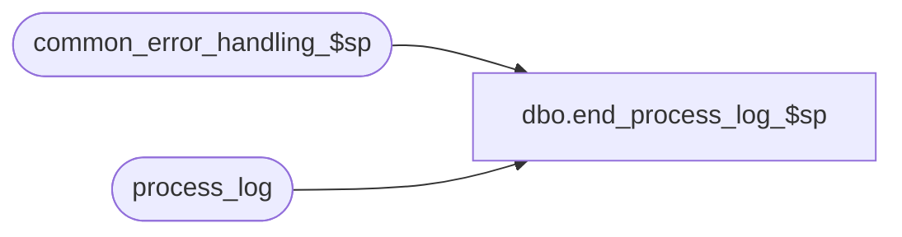

# dbo.end_process_log_$sp

**Database:** auditworks_external  
**Server:** bedrockdb01  

## Architecture Diagram



## Table Dependencies

| Referenced Table |
|---|
| common_error_handling_$sp |
| process_log |

## Stored Procedure Code

```sql
CREATE proc [dbo].[end_process_log_$sp] 


 ( @process_no 			smallint,
  @process_timestamp 		float,
  @transaction_count 		numeric(12,0) = 0,
  @batch_process_id		tinyint = null)

AS

/* Proc name: end_process_log_$sp   5.0/5.1
** Descr:   Logs ending time of a process.
**            Called from many posting procs.

HISTORY
Date     Name           Def# Desc
Jan27,14 Paul         147019 receive optional @batch_process_id (stream_no from multistream purge), and log it in error trap.
Aug12,13 Paul         145958 call common_error_handling_$sp, use try .. catch
Jan28,13 Vicci      1-4A7WED When no transaction count is provided (or 0) don't overlay the one that was already there.
Apr19,02 ShuZ        1-CD0IX Standardize  R3.5 Common error handling
Oct06,00 Paul           6820 Ensure @transaction_count is not null
         Phu                 author
*/

DECLARE
  @errmsg		nvarchar(1024),
  @errno 		int,
  @object_name          nvarchar(255),
  @process_name         nvarchar(100),
  @operation_name       nvarchar(100),
  @message_id		int

SELECT @process_name = 'end_process_log_$sp',
       @message_id = 201068,
       @transaction_count = ISNULL(@transaction_count, 0),
       @operation_name = 'UPDATE';

  SELECT @errmsg = 'Failed to update process_log.',
         @object_name = 'process_log';

BEGIN TRY

UPDATE process_log
   SET process_end_time = getdate(),
       process_status_flag = 2,
       transaction_count = CASE WHEN @transaction_count = 0 THEN transaction_count ELSE @transaction_count END 
 WHERE process_timestamp = @process_timestamp
   AND process_no = @process_no
   AND (batch_process_id = @batch_process_id OR @batch_process_id IS NULL);

/* ensure that elapsed time is at least one second so that
   it does not look like an aborted process */

SELECT @errmsg = 'Failed to update process_log ( add one second ).';

UPDATE process_log
  SET process_end_time = DATEADD (ss, 1, process_end_time)
WHERE process_no = @process_no
  AND process_timestamp = @process_timestamp
  AND process_start_time = process_end_time;

RETURN;

END TRY

BEGIN CATCH;

   /* Common error handler. Append proc name and
      pass abort_flag = 2 to avoid rollback since this proc is called by common_error_handling_$sp */

   SELECT @errno = ERROR_NUMBER(),
		@errmsg = 'end_process_log_$sp:' + COALESCE(@errmsg, ' ') + ERROR_MESSAGE();

   EXEC common_error_handling_$sp @process_no, @errno, @errmsg, 2, @message_id, 
	@process_name, @object_name, @operation_name, 0, @batch_process_id;
   RETURN;

END CATCH;
```

