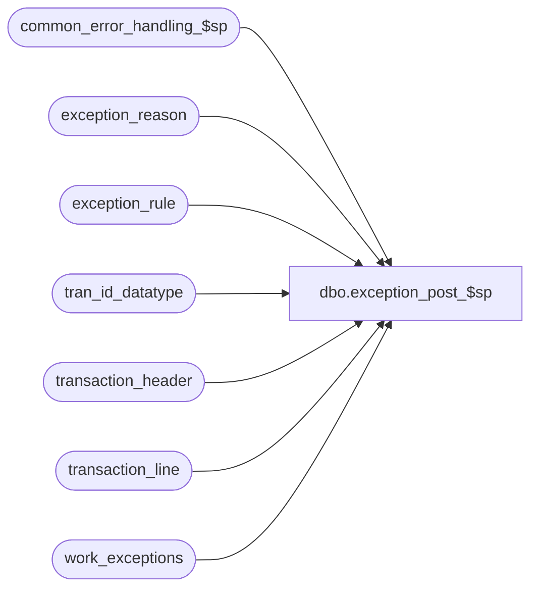

# dbo.exception_post_$sp

**Database:** auditworks_external  
**Server:** bedrockdb01  

## Architecture Diagram



## Table Dependencies

| Referenced Table |
|---|
| common_error_handling_$sp |
| exception_reason |
| exception_rule |
| tran_id_datatype |
| transaction_header |
| transaction_line |
| work_exceptions |

## Stored Procedure Code

```sql
create proc dbo.exception_post_$sp 
@process_id     binary(16), 
@user_id        int,
@errmsg         nvarchar(2000)            OUTPUT,
@transaction_id tran_id_datatype = NULL

AS

/* Procedure Name: exception_post_$sp
   Desc: Identify transactions that are exceptions. SQL_QRY is generated using metadata and maintained via tm.
   Called by edit_exceptions_$sp, edit_trickle_exceptions_$sp, move_register_$sp, transaction_add_$sp, transaction_modify_$sp

HISTORY
Date     Name            Defect Desc
Dec05,14 Paul             94103 use try catch
Jun20,14 Vicci        TFS-75582 Expand SQL_QRY datatype
Sep02,10 Paul            120676 corrected 110085 to avoid corrupting @process_id when it is not null
May06,09 Phu 		 110085 Fix exception count is not calculated.
Feb06,09 Paul		  81222 always update tran header so @rows will be correct
Jul11,07 Paul           DV-1363 uplift 88929 to SA5
Mar28,06 David          DV-1332 Change @SQL_QRY to nvarchar since it is used in sp_executesql.
Jul05,05 Paul           DV-1239 Use new sql column (only one sql query allowed per exception reason), receive @transaction_id
Mar24,05 Paul           DV-1218 removed reference to dropped column to support SA5 tm
Dec02,04 Paul           DV-1181 look at ACTV column in exception_rule, added nolock hints
Sep16,04 Maryam         DV-1146 Receive @user_id
Apr22,04 Maryam         DV-1071 Receive @process_id and pass it to common_error_handling_$sp
Jul05,07 Vicci            88929  Execute even when query id is null, i.e. when non-smartview generated query code
				     has been inserted into the exception_sql table.
Apr19,02 ShuZ           1-CD0IX Standardize  R3.5 Common error handling
Jul06,00 Phu               6428 Ported from Oracle for MS SQL

*/


DECLARE
        @cursor_open            tinyint,
	@errmsg2			nvarchar(2000),
	@errline			int,
        @errno                  int,
        @exception_rule         smallint,
	@object_name            nvarchar(255),
	@process_name           nvarchar(100),
	@operation_name         nvarchar(100),
	@message_id		int,
	@rows			int,
	@SQL_QRY		nvarchar(max);

SELECT @process_name = 'exception_post_$sp',
       @message_id = 201068,
       @cursor_open = 0;        

BEGIN TRY

IF @process_id IS NULL -- should never be true
  SELECT @process_id = @@spid;

IF @transaction_id IS NOT NULL -- modify and add
BEGIN
    SELECT @errmsg = 'Failed to cleanup work_exceptions',
           @object_name = 'work_exceptions',
           @operation_name = 'DELETE';
  DELETE work_exceptions
   WHERE process_id = @process_id;

    SELECT @errmsg = 'Failed to INSERT on work_exceptions',
         @object_name = 'work_exceptions',
         @operation_name = 'INSERT';
  INSERT work_exceptions (
	process_id,
	transaction_id)
  SELECT @process_id,
	@transaction_id;

END; -- If @transaction_id IS NOT NULL

  SELECT @errmsg         = 'Failed to open user_exception_crsr',
         @object_name    = 'user_exception_crsr',
         @operation_name = 'OPEN';
DECLARE user_exception_crsr CURSOR FAST_FORWARD
FOR
SELECT exception_rule,
       SQL_QRY
FROM exception_rule WITH (NOLOCK)
WHERE exception_type >= 1
  AND ACTV = 1
  AND SQL_QRY IS NOT NULL
ORDER BY exception_rule;

OPEN user_exception_crsr;
SELECT @cursor_open = 1,
       @object_name = 'sp_executesql',
       @operation_name = 'EXECUTE';

WHILE 1 = 1
  BEGIN
      FETCH user_exception_crsr INTO
        @exception_rule,
        @SQL_QRY;

      IF @@fetch_status <> 0
        BREAK;

         SELECT @errmsg = 'Failed to execute exception sql: ' + CONVERT(nvarchar,@exception_rule);
      EXEC sp_executesql @SQL_QRY, N'@process_id binary(16)', @process_id;

  END; -- while 1 = 1

CLOSE user_exception_crsr;
DEALLOCATE user_exception_crsr;
SELECT @cursor_open = 0;

/* Only exceptions where exception_type_flag = 1 (Guided Audit) will
   be reflected in the exception_qty in audit_status
*/

   SELECT @errmsg = 'Failed to set exception_flag in transaction_header.',
                @object_name = 'transaction_header',
                @operation_name = 'UPDATE';
UPDATE transaction_header
  SET exception_flag = 1
  FROM work_exceptions we WITH (NOLOCK),
         exception_reason er WITH (NOLOCK),
          exception_rule el WITH (NOLOCK),
          transaction_header h
 WHERE we.process_id = @process_id
   AND we.transaction_id = er.transaction_id
   AND we.transaction_id = h.transaction_id
   AND er.violated_exception_rule = el.exception_rule
   AND el.exception_type = 1
   AND el.ACTV = 1;

SELECT @rows = @@rowcount;

IF @rows > 0 -- if any type 1 exceptions were created above
  BEGIN
      SELECT @errmsg = 'Failed to set exception_flag in transaction_line.',
                @object_name = 'transaction_line',
                @operation_name = 'UPDATE';
   UPDATE transaction_line
     SET exception_flag = 1
     FROM work_exceptions we WITH (NOLOCK),
          exception_reason er WITH (NOLOCK),
          exception_rule el WITH (NOLOCK),
          transaction_line l
    WHERE we.process_id = @process_id
      AND we.transaction_id = er.transaction_id
      AND we.transaction_id = l.transaction_id
      AND er.violated_exception_rule = el.exception_rule
      AND el.exception_type = 1
      AND el.ACTV = 1
      AND er.line_id <> 0
      AND er.line_id = l.line_id
      AND l.exception_flag = 0;
  END; -- If @rows > 0

IF @transaction_id IS NOT NULL -- cleanup
BEGIN
    SELECT @errmsg = 'Failed to DELETE work_exceptions',
         @object_name = 'work_exceptions',
         @operation_name = 'DELETE';
  DELETE work_exceptions 
   WHERE process_id = @process_id;
END; -- cleanup

RETURN;


business_error:   /* Business Rule handler. */

	SELECT @errmsg2 = @errmsg;

	/* Could include similar cleanup code to system error trap when needed (example is from move_store_$sp).
	   However, could also exclude the cleanup code here since the outer system error catch should fire again after the exec below. */

	EXEC common_error_handling_$sp 5, @errno, @errmsg, 0, @message_id, @process_name,
	       @object_name, @operation_name, 1, 1, 0, null, 0, null, null, null, null, null,
	       null, 0, @process_id, @user_id;
	  /* Note: when the exec above raises an error, that action also fires the system error trap (below) */
	RETURN;
END TRY

BEGIN CATCH; -- trap system errors
    /* common error handling. Appending proc name here because a rollback could occur if called within a transaction. */

        SELECT @errno = ERROR_NUMBER(),
		@errline = ERROR_LINE();

        SELECT @errmsg = CONVERT(nvarchar, @errno) + ':' + @process_name + ':' + CONVERT(nvarchar, @errline) + ':'
               + COALESCE(@errmsg, ' ') + ':' + ERROR_MESSAGE();

	 /* this condition will only be true when raise error in traps above fire this general catch */
	IF @errmsg2 IS NOT NULL
	  SELECT @errmsg = @errmsg2;

	IF @cursor_open = 1
	  BEGIN
	    CLOSE user_exception_crsr;
	    DEALLOCATE user_exception_crsr;
	  END;

	EXEC common_error_handling_$sp 5, @errno, @errmsg, 0, @message_id, @process_name,
	       @object_name, @operation_name, 1, 1, 0, null, 0, null, null, null, null, null,
	       null, 0, @process_id, @user_id;

	RETURN;
END CATCH;
```

