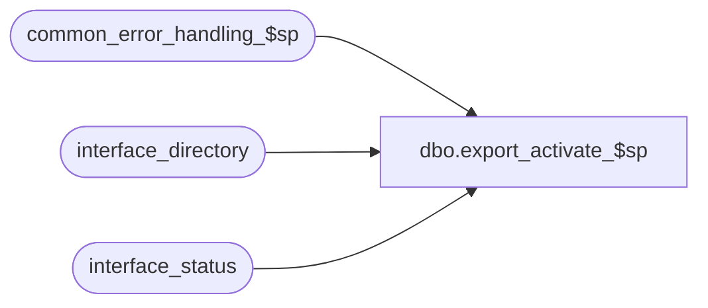

# dbo.export_activate_$sp

**Database:** auditworks_external  
**Server:** bedrockdb01  

## Architecture Diagram



## Table Dependencies

| Referenced Table |
|---|
| common_error_handling_$sp |
| interface_directory |
| interface_status |

## Stored Procedure Code

```sql
create proc dbo.export_activate_$sp @interface_id		smallint 

AS

/* Name: export_activate_$sp
** Desc: This procedure mimics the UI On-demand Interfaces execution request.
         Called by SUSM.

HISTORY:
Date     Name       Defect#  Desc
Jan31,14 Vicci      149709   Support activation of on-demand interfaces.

*/
   
DECLARE
	@errno				int,
	@errmsg				nvarchar(2000),
	@message_id			int,
	@object_name			nvarchar(255),
	@operation_name			nvarchar(100),
	@process_name			nvarchar(100),
	@process_no 			smallint

SELECT @process_no = 19,
       @process_name = 'export_activate_$sp',
       @message_id = 201068

IF NOT EXISTS (SELECT 1 FROM interface_directory d 
                WHERE d.interface_id = @interface_id
                  AND d.update_timing = 5)
BEGIN
  SELECT @message_id = 201684,
         @errno = 201684,
         @errmsg = 'Interface ' + convert(nvarchar, @interface_id) + ' is not an on-demand interface.'
  GOTO error
END
ELSE
BEGIN
  UPDATE interface_status 
     SET immediate_posting_requested = 1 
   WHERE interface_id = @interface_id
     AND immediate_posting_requested = 0 
  SELECT @errno = @@error
  IF @errno != 0 
  BEGIN
    SELECT @errmsg = 'Failed to place an on-demand interface execution request ',
           @object_name = 'interface_status',
           @operation_name = 'UPDATE'
    GOTO error
  END
END  


RETURN

error:

	EXEC common_error_handling_$sp @process_no, @errno, @errmsg, 0, @message_id, 
	@process_name, @object_name, @operation_name, 0

	RETURN
```

