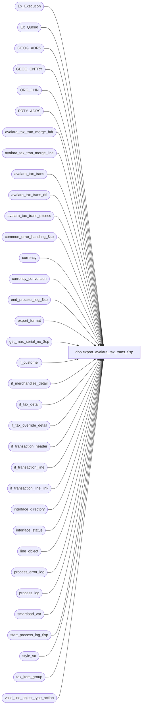

# dbo.export_avalara_tax_trans_$sp

**Database:** auditworks_external  
**Server:** bedrockdb01  

## Architecture Diagram



## Table Dependencies

| Referenced Table |
|---|
| Ex_Execution |
| Ex_Queue |
| GEOG_ADRS |
| GEOG_CNTRY |
| ORG_CHN |
| PRTY_ADRS |
| avalara_tax_tran_merge_hdr |
| avalara_tax_tran_merge_line |
| avalara_tax_trans |
| avalara_tax_trans_dtl |
| avalara_tax_trans_excess |
| common_error_handling_$sp |
| currency |
| currency_conversion |
| end_process_log_$sp |
| export_format |
| get_max_serial_no_$sp |
| if_customer |
| if_merchandise_detail |
| if_tax_detail |
| if_tax_override_detail |
| if_transaction_header |
| if_transaction_line |
| if_transaction_line_link |
| interface_directory |
| interface_status |
| line_object |
| process_error_log |
| process_log |
| smartload_var |
| start_process_log_$sp |
| style_sa |
| tax_item_group |
| valid_line_object_type_action |

## Stored Procedure Code

```sql
create proc dbo.export_avalara_tax_trans_$sp (@interface_id	tinyint
)
AS

DECLARE
@errmsg 			nvarchar(255),
@errno				int,
@process_log_entry 		tinyint,
@process_no 			smallint,
@process_timestamp 		float,
@process_start_time		datetime, 
@transaction_line_count		int,
@rows				int,
@message_id		        int,	
@object_name			nvarchar(255),
@operation_name			nvarchar(100),
@process_name		        nvarchar(100),
@immediate_posting_requested	tinyint,
@stream_no                      tinyint,
@batch_size			int,
@max_rows_avalara_accepts	int,
@export_format			tinyint,
@object_id			int,
@retrieval_in_progress          tinyint,
@current_db_name 		nvarchar(30),
@function_name 			varbinary(128),
@db_id                          int,
@last_posting_datetime          datetime,
@min_serial_no                	numeric(14,0),
@max_serial_no                	numeric(14,0),
@current_rows                 	int,
@excess_rows			int,
@avg_lines_per_trans  		float,
@one				float,
@excess_trans_estimate		int,
@excess_rows_deferred		int,
@transaction_count		int,
@company_code			nvarchar(25),
@aggregate			tinyint,
@cursor_open 			tinyint,
@Ref2				nvarchar(50),
@avalara_multi_cmp		tinyint  --0=use 012_company_code as Avalara company code, 1=use G/L company assigned to each store as Avalara company

/* Proc Name: export_avalara_tax_trans_$sp
   Desc: Export tax transaction to Avalara.
         Called by ICT_EXPORTXX.
         Dayend Post Audit feeds tax transactions to interface tables.
         Immediate_posting_requested is set assuming export-format "auto-set-posting request" is left active (value 2=Upon dayend post-audit interface posting).
         This triggers ICT_EXPORT01 to:
		a)  call the tax export proc specified in export format (e.g. export_avalara_tax_trans_$sp).
		b)  transfer it to Avalara via a call to their web-service (if export format configured with FTP flag = 2 
		    and export destination set to web-service-caller exe (AvalaraInterface.exe -E -S? -U? -P? -F? -C?
		    where -E indicates an export, -S the avalara web service URL without the https:// prefix, -U and -P are either the user-name/password
		    or the account/key depending on the avalara version used, -F is the name of the file to be transmitted (usually avalara_taxYYYYMMDDHHMMSS),
		    and -C is the avalara company code.  
		    The ? specifies that smartload will swap in the FTP Host, HostId, HostPassword, OutputFilePrefixAndTimestamp, and Smartload Var
		    012_company_code settings for -S, -U, -P, -F, -C respectively.
                or
		    copy it to OUTPUT directory (if export format configured with FTP flag = 0 and destination set to ../OUTPUT)
		c)  Note that if -I and -D? switches are added to the command (AvalaraInterface.exe -E -S? -U? -P? -F? -C? -D? -I)
		    then a request for Tax Import files generated since the last successful web-service call will be made prior to 
		    exporting the current tax transaction file.  The ? specifies that the interface_status.last_transfer_datetime 
		    will be swapped into the -D switch.

   Pre-requisites:  Interface 12 (Tax Tracking) must have an update-timing of 6 (Edit) and an ascii export selected.
   		    Interface 12 (Tax Tracking) must be registered in Smartview to avoids its interface table entries being cleaned up prematurely.
   		    Addresses (at least postal code and province/state) must be defined in CRDM for all stores.
   		    Default Tax Item Group IDs must have been assigned to all merch/feed/expense line objects that feed tax tracking (and ideally to merchandise items as well).
   		    Otherwise, the following defaults will be used:
   		    	S0000000 = Services
			P0000000 = Tangible Personal Property (TPP)
			O0000000 = Other
		    Avalara Company Code must have been set in Smartload Var table-maintenance under the variable named 012_company_code.
		    Aggregation may be disabled in Smartload Var table-maintenance under the variable named avalara_aggregate if desired.
		    Use of store G/L company instead of Avalara Company Code may be activated in Smartload Var table-maintenance under the variable named avalara_multi_cmp if desired,
		    but only if the company codes in Avalara (which are 25 characters) have been set to an integer value since the S/A G/L company number is an integer.
		    Sufficient space available in ICT_EXPORT01 directory to hold the number of days of BK (backup files) desired.
		    Avalara WebServiceURL(without the https:// prefix), Account and Key configured in export-format table-maintenance (under FTP Host, FTP Host Id and FTP Host Password) if web-service transfer is being used.

NOTE:  Although there is a minute possibility in a multi-stream dayend environment that the export might end up running concurrently with dayend post audit,
       the store/date should be posted to the I/F tables by the dayend in 1 statement which would not be visible until complete.

Unicode compliant version.

HISTORY:
Date     Name           Def# Desc
Mar06,14 Vicci         61711 Avoid pickup up new memo tax-detail entries for discounts.
Mar22,11 Vicci        125695 Provide option to support using G/L company as Avalara Company Code.
Feb21,11 Vicci        125013 Provide option to aggregate non-exception transactions into a single store/date/tax-item-code total under a dummy transaction number.
Feb18,11 Vicci        124917 Provide option to aggregate non-exception transactions into a single store/date/sku total under a dummy transaction number.
Feb11,11 Paul         105977 Uplift SA5 fixes to SA5.1 unicode
Feb11,11 Vicci        124506 Reset immediate_posting_requested.
Feb07,11 Vicci        120654 Read company code from replacement var_name.
Feb04,11 Vicci        120654 Handle possibility of rows being left behind in avalara_tax_trans as a result of prior run's
			     bcp or file-transfer having failed.  Note if bcp succeeding and exported file copied to .unsent
			     successfully, the rows will already have been cleaned up from avalara_tax_trans, so the .unsent
			     file must be transmitted manually.
Jan28,11 Vicci        120654 Retrieve company code from smartload_var var_value.
Jan07,11 Vicci        120654 Added limitation of maximum of 100000 rows to be exported to Avalara.
Jan06,11 Vicci        120654 Remove commas from any text string since output file is comma delimited.
Dec20,10 Vicci        120654 Author.


--Notes:  Avalara requires store addresses be maintained;  
	
--Questions:  
        --ProcessCode:  since POS/SA already computed tax (not Avalara) we will always set it to "1=New transaction without tax calculation", right?
--		[Rahul] If you plan to allow adjustments, send in processcode = 2, otherwise send it in as 1.

	--DocType for exchange based on net of transaction or each line?
--		Re. the "DocType" for exchange transactions (one in which the customer trades one item for another, in other words a transaction which includes some items being returned and some being sold with the customer paying or being refunded the difference in price).  To which value would you like the DocType to be set under those circumstances?
--		[Rahul] DocType could be set to Sales Invoice. Mark do you have additional input here ?
--		[Mark] I concur, Sales Invoice doc type.

	--CustomerCode:  why is it mandatory (not always available).
--		[Rahul] It's a required field in AvaTax. Is there any alternate field you can pass in here, e.g. Store No ?
--		[Vicci] Re."CustomerCode", yes, we can pass store where customer# is not available, or just the store# all the time, but just to confirm, that implies that you don't actually do anything with that field other than perhaps display it somewhere, correct?
--		[Rahul] Correct. Except if you use exemption certificates to exempt transactions, then we use the customer code to look up the exemption certificates.

	--EntityUseCode:  POS does not send us EntityUseCode, just tax-exempt number...
--		[Rahul] You can pass in the exemption number, EntityUseCode is an optional field.

	--Taxable:  since POS/SA already computed tax (not Avalara) do we provide it?
--		[Rahul] AvaTax recalculates this.
--		[Vicci] How would you list the Taxable amount for an item which was taxable for PST purpose but non-taxable GST purposes?
--		[Rahul] I am not sure, Mark ?
--		[Mark] There is not a method to do that.  However, that scenario would most likely be based upon a specific taxability rule for a product or an exemption rule for a customer.  Accordingly, the information passed to the AvaTax service, tax code, entity/use code, etc in the transaction import would drive the AvaTax service to identify the taxable vs. non-taxable jurisdiction (province vs. federal) and allocate the tax amount correctly.

	--Returns:  is it only Amount which is to be logged as negative?  What about Taxable, Discount and Total Tax
--		[Rahul] Set the DocType = 5 (Return Invoice). All amounts are sent in as negative.
	--Discount:  logged as absolute?  Negative for sales? Other?
--		[Rahul] Positive for invoices, negative for returns.
--			AvaTax handles discounts at the document header level.
--			However, the Transaction import functionality is designed to place discounts at the line level. During Transaction import, AvaTax treats discounts in the following manner:
--			Discounts applied at the line level in imported Transactions are accumulated for the total document.
--			AvaTax redistributes the total discount by prorating the document discount amount across all the lines that had a discount amount assigned to them.
--			Tax is calculated based upon the "new" prorated discount amount now found at the line level. Any lines on the document that did not have a discount remain at a $0 discount.
--		[Vicci] Re. Discounts, since allocating them evenly across all lines would produce incorrect results in the event that not all items in the transaction are taxable or not all taxable at the same rate, it sounds like the  best bet is for us to send you the net amount in the Amount field and a $0.00 in the Discount field, would you agree?
--		[Rahul] Yes sending the net amount would be the best way.


	--Country, State, City, etc taxes:  since POS/SA already computed tax (not Avalara) shouldn't we be providing this?
--		[Rahul] AvaTax reallocates the tax at the jurisdiction level and then distributes tax that is sent in proportionately across the jurisdictions.
--		[Vicci] I'm not clear on how that would work, could you elaborate?  Are you saying that we are supposed to sum up the PST/GST/Resort Tax amounts (for example) that we have in S/A for each transaction line-item and send you the sum under the TotalTax field and then you will split them back up again?
--		[Rahul] Yes, you need to send the TotalTax at the Line level, AvaTax will calculate the GST/PST then allocate the GST and PST proportionately based on the TotalTax that was sent in. So there could be a difference in Tax at jurisdiction level between what SA and AvaTax.
--		[Mark]  Since the tax allocation is based upon the tax rates and rules within the AvaTax service for the transaction import are the same rates and rules pushed to the Epicor SA application, the allocation of tax within the AvaTax service should match the tax contained in the SA application.

	--JURISSIGCODE why is this in the Excel layout but not in the HTML one?  Should it be there?
--		[Rahul] This is the Jurisdiction (4 character code)
*/

SET CONCAT_NULL_YIELDS_NULL OFF

SELECT @process_no = 39,  --tax transaction export
       @process_name = 'export_avalara_tax_trans_$sp',
       @message_id = 201068,
       @process_start_time = getdate(),
       @current_db_name = db_name(),
       @function_name = convert(varbinary(128), 'export_avalara_tax_trans_$sp'),
       @max_rows_avalara_accepts = 100000,
       @one = 1,
       @excess_rows_deferred = 0,
      @transaction_line_count = 0

/* immediate_posting_requested:  0=abort, 
				 1=populate work & copy to interface (ict will bcp and set to 0)
				 2=copy work to interface only (ict will bcp but not reset)
				 3=populate work & copy to interface (ict will bcp but not reset)
*/

IF @interface_id IS NULL OR @interface_id <> 12
BEGIN
  SELECT @message_id = 201684,
         @errno = 201684,
         @object_name = @process_name,
         @errmsg = 'Invalid Argument(s) passed to the stored procedure ' + @process_name + '. Unable to proceed.'
  GOTO error
END

SELECT @immediate_posting_requested = ISNULL(immediate_posting_requested,0),
       @retrieval_in_progress = retrieval_in_progress,
       @last_posting_datetime = last_posting_datetime
  FROM interface_status WITH (NOLOCK)
 WHERE interface_id = @interface_id
SELECT @errno = @@error
IF @errno <> 0
BEGIN
  SELECT @errmsg = 'Unable to select immediate_posting_request, retrieval_in_progress, last_posting_datetime from interface status',
         @object_name = 'interface_status',
         @operation_name = 'SELECT'      
  GOTO error
END

IF @immediate_posting_requested = 0  --abort requested
  RETURN

SET CONTEXT_INFO @function_name

IF @retrieval_in_progress <> 0
BEGIN
  SELECT @db_id = dbid
    FROM master..sysprocesses
   WHERE spid = @@spid
  SELECT @errno = @@error
  IF @errno != 0
  BEGIN
    SELECT @errmsg = 'Unable to select from master..sysprocesses',
           @object_name = 'master..sysprocesses',
           @operation_name = 'SELECT'
    GOTO error
  END

  IF EXISTS (SELECT 1
               FROM master..sysprocesses
              WHERE context_info = @function_name
                AND spid <> @@spid
                AND dbid = @db_id
                AND db_name(dbid) = @current_db_name)
  BEGIN
    SELECT @message_id = 201682,
           @errno = 201682,
           @object_name = @process_name,
           @errmsg = 'The stored procedure ' + @process_name + ' is currently running. Please verify.'
    GOTO error
  END
END

IF EXISTS (SELECT 1
  	     FROM smartload_var 
	    WHERE ict_name = 'export_info' 
	      AND var_name = 'avalara_aggregate'
	      AND var_value = '1')
  SELECT @aggregate = 1
ELSE
BEGIN
  IF EXISTS (SELECT 1
    	       FROM smartload_var 
	      WHERE ict_name = 'export_info' 
	        AND var_name = 'avalara_aggregate'
	        AND var_value = '2')
    SELECT @aggregate = 2
  ELSE 
    SELECT @aggregate = 0
END

IF EXISTS (SELECT 1
  	     FROM smartload_var 
	    WHERE ict_name = 'export_info' 
	      AND var_name = 'avalara_multi_cmp'
	      AND var_value = '1')
  SELECT @avalara_multi_cmp = 1
ELSE
  SELECT @avalara_multi_cmp = 0

SELECT @transaction_line_count = COUNT(*)
  FROM avalara_tax_trans
SELECT @errno = @@error
IF @errno != 0
BEGIN
  SELECT @errmsg = 'Failed to determine if rows requiring re-transmission left behind as a result of prior bcp/file-transfer failure.',
         @object_name = 'avalara_tax_trans',
         @operation_name = 'SELECT'
  GOTO error
END  

BEGIN TRANSACTION
  INSERT INTO avalara_tax_trans
  SELECT * 
    FROM avalara_tax_trans_excess
  SELECT @errno = @@error, @transaction_line_count = @transaction_line_count + @@rowcount
  IF @errno <> 0
  BEGIN
    SELECT @errmsg = 'Unable to copy left-over rows back in for export',
           @object_name = 'avalara_tax_trans',
           @operation_name = 'INSERT'
    GOTO error
  END
  DELETE avalara_tax_trans_excess
  SELECT @errno = @@error
  IF @errno <> 0
  BEGIN
    SELECT @errmsg = 'Unable to clean up left-over rows now fed back into export',
           @object_name = 'avalara_tax_trans_excess',
           @operation_name = 'DELETE'
    GOTO error
  END
COMMIT

IF @transaction_line_count > 0 OR (@aggregate > 0 AND EXISTS (SELECT 1 FROM avalara_tax_trans_dtl))
BEGIN
  EXEC start_process_log_$sp @process_no, @process_timestamp OUTPUT, @errmsg OUTPUT
  SELECT @errno = @@error
  IF @errno <> 0
  BEGIN
    SELECT @errmsg = @errmsg + ' Unable to execute start_process_log_$sp',
           @object_name = 'start_process_log_$sp',
           @operation_name = 'EXECUTE'
 GOTO error
  END
  SELECT @process_log_entry = 1
END

UPDATE interface_status
   SET retrieval_in_progress  = 1, last_retrieval_datetime = @process_start_time
 WHERE interface_id = @interface_id
SELECT @errno = @@error
IF @errno <> 0
BEGIN
  SELECT @errmsg = 'Unable to set last_retrieval_datetime in interface_status',
         @object_name = 'interface_status',
         @operation_name = 'UPDATE'
  GOTO error
END

SELECT @export_format = ascii_export, 
      @object_id = object_id 
  FROM interface_directory WITH (NOLOCK)
 WHERE interface_id = @interface_id
SELECT @errno = @@error 
IF @errno <> 0 
BEGIN
  SELECT @errmsg = 'Unable to select export format and object ID',
	 @object_name = 'interface_directory',
	 @operation_name = 'SELECT'
  GOTO error
END

IF @object_id IS NULL
  SELECT @object_id = @interface_id * -1
  
SELECT @batch_size = batch_size,
       @stream_no = stream_no 
  FROM export_format WITH (NOLOCK)
 WHERE interface_id = @interface_id
   AND export_format = @export_format
   AND copy_no = 1
SELECT @errno = @@error 
IF @errno <> 0 
BEGIN
  SELECT @errmsg = 'Unable to determine batch size and stream#',
	 @object_name = 'export_format',
	 @operation_name = 'SELECT'
  GOTO error
END

SELECT @company_code = substring(var_value, 1, 25) 
  FROM smartload_var 
 WHERE ict_name = 'export_info' 
  AND var_name = '012_company_code'
SELECT @errno = @@error
IF @errno <> 0
BEGIN
  SELECT @errmsg = 'Failed to determine which Avalara Company Code to use',
         @object_name = 'smartload_var',
         @operation_name = 'SELECT'
  GOTO error
END
  
IF @batch_size IS NULL
  SELECT @batch_size = 10000
IF @stream_no IS NULL
  SELECT @stream_no = 1
IF @company_code = '000'
  SELECT @company_code = NULL

WHILE 1 = 1
BEGIN
  IF @transaction_line_count >= @max_rows_avalara_accepts   --applies only if @aggregate = 0 
    BREAK
    
  SELECT @min_serial_no = MAX(to_serial_no)
    FROM Ex_Execution WITH (NOLOCK)
   WHERE queue_id = @interface_id
  SELECT @errno = @@error
  IF @errno <> 0
  BEGIN
    SELECT @errmsg = 'Unable to select last serial no already posted from Ex_Execution',
           @object_name = 'Ex_Execution',
           @operation_name = 'SELECT'
    GOTO error
  END

  SELECT @min_serial_no = COALESCE(@min_serial_no, 0) + 1

  EXEC get_max_serial_no_$sp @interface_id, @min_serial_no, @batch_size, @max_serial_no OUTPUT
  SELECT @errno = @@error
  IF @errno <> 0
  BEGIN
    SELECT @errmsg = 'Unable to execute get_max_serial_no_$sp',
           @object_name = 'get_max_serial_no_$sp',
           @operation_name = 'EXECUTE'
    GOTO error
  END

  IF @max_serial_no = 0
    BREAK

  IF @process_log_entry = 0
  BEGIN
    EXEC start_process_log_$sp @process_no, @process_timestamp OUTPUT, @errmsg OUTPUT
    SELECT @errno = @@error
    IF @errno <> 0
    BEGIN
      SELECT @errmsg = @errmsg + ' Unable to execute start_process_log_$sp',
             @object_name = 'start_process_log_$sp',
             @operation_name = 'EXECUTE'
      GOTO error
    END
    SELECT @process_log_entry = 1
  END

  IF @aggregate > 0
    BEGIN
    /* Note: same insert as in non-aggregate case but to _dtl table and with extra exception_flag field at end, and with different Ref1 and Ref2.
       Required because Avalara wants a single transaction-summary per store-date and our if-entry-no level batching may result in several.
    */    
    INSERT into avalara_tax_trans_dtl(  
         ProcessCode,
         DocCode,
         DocType,
         DocDate,
         CompanyCode,
         CustomerCode,
         EntityUseCode,
         LineNum,  --LineNo
         TaxCode,
         TaxDate,
   ItemCode,
         Description,
         Qty,
         Amount,
         Taxable,
         Discount,
         TotalTax,
         CountryTax,
         StateTax,
         CountyTax,
         CityTax,
         Other1Tax,
         Other2Tax,
         Ref1,
         Ref2,
         ExemptionNo,
         RevAcct,
         TaxType,
         DestAddress,
         DestCity,
         DestRegion,
         DestPostalCode,
         DestCountry,
         OrigAddress,
         OrigCity,
         OrigRegion,
         OrigPostalCode,
         OrigCountry,
         LocationCode,
         SalesPersonCode,
         PurchaseOrderNo,
         CurrencyCode,
         ExchangeRate,
         ExchangeRateEffDate,
         PaymentDate,
         TaxIncluded,
         DestTaxRegion,
         OrigTaxRegion,
         max_serial_no,
         transaction_id,
         line_id,
         exception_flag)
    SELECT 1 ProcessCode,
         CONVERT(nvarchar, h.store_no) + '-' + convert(nvarchar, h.register_no) + '-' + convert(nvarchar, h.transaction_no) + h.transaction_series + '-' + convert(nvarchar, h.transaction_id) DocCode,         
         MIN(CASE WHEN v.default_db_cr_none = 1 THEN 5 ELSE 1 END) DocType,  
         h.transaction_date DocDate,
         MAX(CASE WHEN @avalara_multi_cmp = 1 THEN COALESCE(convert(nvarchar, OC.GL_CMPNY_NUM), @company_code) ELSE @company_code END) CompanyCode,
         h.store_no CustomerCode,  --used instead of customer# since exemption certificates not used
         NULL EntityUseCode,  --since tax_override_detail.tax_exempt_no doesn't specify reason for exemption...
         CONVERT(nvarchar, l.line_id) LineNum,  --LineNo
         COALESCE(MAX(tg.tax_item_group_code), CASE l.line_object_type 
                                               WHEN 1 THEN 'P0000000' 
                                               WHEN 2 THEN 'S0000000' 
                                               ELSE 'O0000000' END) TaxCode,
         MAX(COALESCE(t.originating_date, h.transaction_date)) TaxDate,
         MAX(CASE WHEN m.sku_id IS NULL THEN 'O.' + convert(nvarchar, l.line_object) 
                  ELSE 'I.' + convert(nvarchar, m.sku_id) END) ItemCode,
         REPLACE(MAX(COALESCE(st.style_long_description, o.line_object_description)), ',', ' ') Description,
         MAX(COALESCE(m.units, 1)) Qty,
         MAX((t.taxable_amount + t.nontaxable_amount) * t.gl_effect) Amount,  --to avoid going to discount_detail to get expensed discounts
         MAX(t.taxable_amount * t.gl_effect) Taxable,  --since all tax levels are being grouped/total into 1 lump sum
         0 Discount,  --to avoid it getting allocated by Avalara to the wrong lines, Amount is logged net of discount instead 
         SUM(t.tax_amount) TotalTax,  --since all tax levels are being grouped/total into 1 lump sum
         NULL CountryTax,  --Could be provided using SUM(CASE WHEN combined_rate > 0 THEN federal_rate / combined_rate * t.tax_amount ELSE 0 END) 
         NULL StateTax,  
         NULL CountyTax,
         NULL CityTax,
         NULL Other1Tax,
         NULL Other2Tax,
         NULL Ref1, 
         convert(nvarchar, h.transaction_date, 112) + '-' + convert(nvarchar, h.store_no) Ref2,  --to be used as DocCode for aggregation.
         MAX(COALESCE(todl.tax_exempt_no, todll.tax_exempt_no, todh.tax_exempt_no)) ExemptionNo,
         NULL RevAcct,
         'S' TaxType,
         REPLACE(COALESCE(sndl.address_1, sndll.address_1, sndh.address_1), ',', ' ') DestAddress,
         REPLACE(COALESCE(sndl.city, sndll.city, sndh.city), ',', ' ') DestCity, 
         SUBSTRING(COALESCE(sndl.state, sndll.state, sndh.state, GA.TRTRY_CODE), 1, 2) DestRegion,
         REPLACE(SUBSTRING(COALESCE(sndl.post_code, sndll.post_code, sndh.post_code, GA.POST_CODE), 1, 10), ',', ' ') DestPostalCode,
         CASE WHEN COALESCE(sndl.if_entry_no, sndll.if_entry_no, sndh.if_entry_no) IS NULL THEN GC.CNTRY_CODE_ISO2 ELSE NULL END DestCountry,  --since we don't have ISO2 country  
         REPLACE(GA.ADRS_LINE_1, ',', ' ') OrigAddress,
         REPLACE(GA.CITY, ',', ' ') OrigCity,
         SUBSTRING(GA.TRTRY_CODE, 1, 2) OrigRegion,
         REPLACE(SUBSTRING(GA.POST_CODE, 1, 10), ',', ' ') OrigPostalCode,
         GC.CNTRY_CODE_ISO2 OrigCountry,
         convert(nvarchar, OC.ORG_CHN_NUM) LocationCode,
         convert(nvarchar, m.salesperson) SalesPersonCode,
         CASE WHEN (l.reference_type = 7) THEN REPLACE(l.reference_no, ',', ' ') ELSE NULL END PurchaseOrderNo,
         OC.DFLT_CRNCY_CODE CurrencyCode,
         COALESCE(cc.exchange_rate, 1) ExchangeRate,
         MAX(COALESCE(t.originating_date, h.transaction_date)) ExchangeRateEffDate,
         NULL PaymentDate,
         0 TaxIncluded,  --always false since we strip it first
         MAX(t.tax_jurisdiction),
         MAX(OC.TAX_JRSDCTN_CODE),  --what about in the case of a return originally bought elsewhere?
         @max_serial_no,         
         h.transaction_id,  	
         l.line_id,	
         MAX(CASE WHEN t.tax_category > 0 OR v.default_db_cr_none = 1 OR t.originating_date <> h.transaction_date THEN 1 ELSE 0 END)
      FROM Ex_Queue q
         INNER JOIN if_transaction_header h
            ON h.transaction_void_flag in (0, 8)
  	   AND q.key_1 = h.if_entry_no
         INNER JOIN if_transaction_line l
            ON h.if_entry_no = l.if_entry_no
           AND l.line_void_flag = 0
         INNER JOIN valid_line_object_type_action v
            ON l.line_object_type = v.line_object_type
           AND l.line_action = v.line_action 
         INNER JOIN if_tax_detail t
            ON l.if_entry_no = t.if_entry_no
           AND l.line_id = t.line_id 
           AND t.track_tax = 1
           AND t.applied_by_line_id IS NULL  --avoid picking up tax entries for discounts since tax on merch already net of disc.
         LEFT OUTER JOIN if_customer sndh
	   ON h.if_entry_no = sndh.if_entry_no
          AND sndh.line_id = 0
          AND sndh.customer_role = 2
         LEFT OUTER JOIN if_customer sndl
           ON l.if_entry_no = sndl.if_entry_no
          AND l.line_id = sndl.line_id
          AND sndl.customer_role = 2
         LEFT OUTER JOIN if_customer sndll
           ON l.if_entry_no = sndll.if_entry_no
          AND l.line_id <> sndll.line_id
          AND sndll.line_id <> 0
          AND sndll.customer_role = 2
          AND sndll.line_id IN (SELECT ll.linked_line_id
          			  FROM if_transaction_line_link ll
			         WHERE sndll.if_entry_no = ll.if_entry_no
			           AND sndll.line_id = ll.line_id) 
         LEFT OUTER JOIN if_tax_override_detail todh
           ON h.if_entry_no = todh.if_entry_no
          AND todh.line_id = 0
          AND (t.tax_level = todh.tax_level OR todh.tax_level = 0) 
         LEFT OUTER JOIN if_tax_override_detail todl
           ON l.if_entry_no = todl.if_entry_no
          AND l.line_id = todl.line_id
          AND (t.tax_level = todl.tax_level OR todl.tax_level = 0) 
         LEFT OUTER JOIN if_tax_override_detail todll
           ON l.if_entry_no = todll.if_entry_no
          AND l.line_id <> todll.line_id
          AND todll.line_id <> 0
          AND (t.tax_level = todll.tax_level OR todll.tax_level = 0) 
          AND todll.line_id IN (SELECT ll.linked_line_id
          			  FROM if_transaction_line_link ll
			         WHERE todll.if_entry_no = ll.if_entry_no
			           AND todll.line_id = ll.line_id) 
         INNER JOIN line_object o
            ON l.line_object = o.line_object
         LEFT OUTER JOIN if_merchandise_detail m
           ON l.if_entry_no = m.if_entry_no
          AND l.line_id = m.line_id 
         LEFT OUTER JOIN style_sa st
           ON m.upc_lookup_division = st.upc_lookup_division
          AND m.style_reference_id = st.style_reference_id
         LEFT OUTER JOIN tax_item_group tg
           ON t.tax_item_group_id = tg.tax_item_group_id
   INNER JOIN ORG_CHN OC
           ON COALESCE(t.fulfillment_store_no, h.store_no) = OC.ORG_CHN_NUM  
         LEFT OUTER JOIN PRTY_ADRS PA
           ON OC.PRTY_ID = PA.PRTY_ID
          AND OC.DFLT_ADRS_SEQ = PA.PRTY_ADRS_SEQ
          AND PA.EFCTV_STRT_DATE < GETDATE()
          AND (PA.EFCTV_END_DATE >= GETDATE() OR PA.EFCTV_END_DATE IS NULL)
  LEFT OUTER JOIN GEOG_ADRS GA
           ON PA.ADRS_ID = GA.ADRS_ID
        INNER JOIN GEOG_CNTRY GC
           ON GA.CNTRY_CODE_ISO3 = GC.CNTRY_CODE_ISO3
         LEFT OUTER JOIN currency crn
           ON OC.DFLT_CRNCY_CODE = crn.currency_code
         LEFT OUTER JOIN currency_conversion cc
           ON cc.currency_conversion_type_id = 1
          AND cc.currency_id = crn.currency_id
          AND cc.effective_date_from <= h.transaction_date 
          AND (cc.effective_date_to >= h.transaction_date OR cc.effective_date_to IS NULL)
    WHERE q.queue_id = @interface_id
      AND q.serial_no >= @min_serial_no
      AND q.serial_no <= @max_serial_no
    GROUP BY --all fields since tax_detail by level
        h.transaction_date, h.store_no, h.register_no, h.transaction_no, h.transaction_series, 
        h.transaction_id,
        l.line_id, l.line_object_type,
        REPLACE(COALESCE(sndl.address_1, sndll.address_1, sndh.address_1), ',', ' '),
        REPLACE(COALESCE(sndl.city, sndll.city, sndh.city), ',', ' '), 
        SUBSTRING(COALESCE(sndl.state, sndll.state, sndh.state, GA.TRTRY_CODE), 1, 2),
        REPLACE(SUBSTRING(COALESCE(sndl.post_code, sndll.post_code, sndh.post_code, GA.POST_CODE), 1, 10), ',', ' '),
        REPLACE(GA.ADRS_LINE_1, ',', ' '),
        REPLACE(GA.CITY, ',', ' '),
        SUBSTRING(GA.TRTRY_CODE, 1, 2),
        REPLACE(SUBSTRING(GA.POST_CODE, 1, 10), ',', ' '),
        sndl.if_entry_no, sndll.if_entry_no, sndh.if_entry_no,
        GC.CNTRY_CODE_ISO2,
        OC.ORG_CHN_NUM,
        m.salesperson,
    CASE WHEN (l.reference_type = 7) THEN REPLACE(l.reference_no, ',', ' ') ELSE NULL END,
        OC.DFLT_CRNCY_CODE,
        cc.exchange_rate
    SELECT @errno = @@error
    IF @errno <> 0
    BEGIN
      SELECT @errmsg = 'Unable to insert avalara_tax_trans_dtl',
             @object_name = 'avalara_tax_trans_dtl',
             @operation_name = 'INSERT'
      GOTO error
    END

  END
  ELSE -- of IF @aggregate > 0
  BEGIN
    INSERT into avalara_tax_trans(
         ProcessCode,
         DocCode,
         DocType,
         DocDate,
         CompanyCode,
         CustomerCode,
         EntityUseCode,
         LineNum,  --LineNo
         TaxCode,
         TaxDate,
         ItemCode,
         Description,
         Qty,
         Amount,
         Taxable,
         Discount,
         TotalTax,
         CountryTax,
         StateTax,
         CountyTax,
         CityTax,
         Other1Tax,
         Other2Tax,
         Ref1,
         Ref2,
         ExemptionNo,
         RevAcct,
         TaxType,
         DestAddress,
         DestCity,
         DestRegion,
         DestPostalCode,
         DestCountry,
         OrigAddress,
         OrigCity,
         OrigRegion,
         OrigPostalCode,
         OrigCountry,
         LocationCode,
         SalesPersonCode,
         PurchaseOrderNo,
         CurrencyCode,
         ExchangeRate,
         ExchangeRateEffDate,
         PaymentDate,
         TaxIncluded,
         DestTaxRegion,
         OrigTaxRegion,
         max_serial_no,
         transaction_id,
         line_id)
    SELECT 1 ProcessCode,
         CONVERT(nvarchar, h.store_no) + '-' + convert(nvarchar, h.register_no) + '-' + convert(nvarchar, h.transaction_no) + h.transaction_series + '-' + convert(nvarchar, h.transaction_id) DocCode,         
         MIN(CASE WHEN v.default_db_cr_none = 1 THEN 5 ELSE 1 END) DocType,  
         h.transaction_date DocDate,
         MAX(CASE WHEN @avalara_multi_cmp = 1 THEN COALESCE(convert(nvarchar, OC.GL_CMPNY_NUM), @company_code) ELSE @company_code END) CompanyCode,
         h.store_no CustomerCode,  --used instead of customer# since exemption certificates not used
         NULL EntityUseCode,  --since tax_override_detail.tax_exempt_no doesn't specify reason for exemption...
         CONVERT(nvarchar, l.line_id) LineNum,  --LineNo
         COALESCE(MAX(tg.tax_item_group_code), CASE l.line_object_type 
                         WHEN 1 THEN 'P0000000' 
                                               WHEN 2 THEN 'S0000000' 
       ELSE 'O0000000' END) TaxCode,
         MAX(COALESCE(t.originating_date, h.transaction_date)) TaxDate,
         MAX(CASE WHEN m.sku_id IS NULL THEN 'O.' + convert(nvarchar, l.line_object) 
                  ELSE 'I.' + convert(nvarchar, m.sku_id) END) ItemCode,
         REPLACE(MAX(COALESCE(st.style_long_description, o.line_object_description)), ',', ' ') Description,
         MAX(COALESCE(m.units, 1)) Qty,
         MAX((t.taxable_amount + t.nontaxable_amount) * t.gl_effect) Amount,  --to avoid going to discount_detail to get expensed discounts
         MAX(t.taxable_amount * t.gl_effect) Taxable,  --since all tax levels are being grouped/total into 1 lump sum
         0 Discount,  --to avoid it getting allocated by Avalara to the wrong lines, Amount is logged net of discount instead 
         SUM(t.tax_amount) TotalTax,  --since all tax levels are being grouped/totalled into 1 lump sum
         NULL CountryTax,  --Could be provided using SUM(CASE WHEN combined_rate > 0 THEN federal_rate / combined_rate * t.tax_amount ELSE 0 END) 
         NULL StateTax,  
         NULL CountyTax,
         NULL CityTax,
         NULL Other1Tax,
         NULL Other2Tax,
         'Trans.ID:  ' + CONVERT(nvarchar, h.transaction_id) Ref1,
         'Serial no range:  '+ CONVERT(nvarchar, @min_serial_no) + '-' + CONVERT(nvarchar, @max_serial_no) Ref2,
         MAX(COALESCE(todl.tax_exempt_no, todll.tax_exempt_no, todh.tax_exempt_no)) ExemptionNo,
         NULL RevAcct,
         'S' TaxType,
         REPLACE(COALESCE(sndl.address_1, sndll.address_1, sndh.address_1), ',', ' ') DestAddress,
         REPLACE(COALESCE(sndl.city, sndll.city, sndh.city), ',', ' ') DestCity, 
         SUBSTRING(COALESCE(sndl.state, sndll.state, sndh.state, GA.TRTRY_CODE), 1, 2) DestRegion,
         REPLACE(SUBSTRING(COALESCE(sndl.post_code, sndll.post_code, sndh.post_code, GA.POST_CODE), 1, 10), ',', ' ') DestPostalCode,
         CASE WHEN COALESCE(sndl.if_entry_no, sndll.if_entry_no, sndh.if_entry_no) IS NULL THEN GC.CNTRY_CODE_ISO2 ELSE NULL END DestCountry,  --since we don't have ISO2 country  
         REPLACE(GA.ADRS_LINE_1, ',', ' ') OrigAddress,
         REPLACE(GA.CITY, ',', ' ') OrigCity,
         SUBSTRING(GA.TRTRY_CODE, 1, 2) OrigRegion,
         REPLACE(SUBSTRING(GA.POST_CODE, 1, 10), ',', ' ') OrigPostalCode,
         GC.CNTRY_CODE_ISO2 OrigCountry,
         convert(nvarchar, OC.ORG_CHN_NUM) LocationCode,
         convert(nvarchar, m.salesperson) SalesPersonCode,
         CASE WHEN (l.reference_type = 7) THEN REPLACE(l.reference_no, ',', ' ') ELSE NULL END PurchaseOrderNo,
         OC.DFLT_CRNCY_CODE CurrencyCode,
         COALESCE(cc.exchange_rate, 1) ExchangeRate,
         MAX(COALESCE(t.originating_date, h.transaction_date)) ExchangeRateEffDate,
         NULL PaymentDate,
         0 TaxIncluded,  --always false since we strip it first
         MAX(t.tax_jurisdiction),
         MAX(OC.TAX_JRSDCTN_CODE),
         @max_serial_no,         
         h.transaction_id,
         l.line_id
      FROM Ex_Queue q
         INNER JOIN if_transaction_header h
            ON h.transaction_void_flag in (0, 8)
  	   AND q.key_1 = h.if_entry_no
         INNER JOIN if_transaction_line l
            ON h.if_entry_no = l.if_entry_no
           AND l.line_void_flag = 0
         INNER JOIN valid_line_object_type_action v
            ON l.line_object_type = v.line_object_type
           AND l.line_action = v.line_action 
         INNER JOIN if_tax_detail t
            ON l.if_entry_no = t.if_entry_no
           AND l.line_id = t.line_id 
           AND t.track_tax = 1
           AND t.applied_by_line_id IS NULL
         LEFT OUTER JOIN if_customer sndh
           ON h.if_entry_no = sndh.if_entry_no
          AND sndh.line_id = 0
          AND sndh.customer_role = 2
         LEFT OUTER JOIN if_customer sndl
           ON l.if_entry_no = sndl.if_entry_no
          AND l.line_id = sndl.line_id
          AND sndl.customer_role = 2
         LEFT OUTER JOIN if_customer sndll
           ON l.if_entry_no = sndll.if_entry_no
          AND l.line_id <> sndll.line_id
          AND sndll.line_id <> 0
          AND sndll.customer_role = 2
          AND sndll.line_id IN (SELECT ll.linked_line_id
          			  FROM if_transaction_line_link ll
			         WHERE sndll.if_entry_no = ll.if_entry_no
			           AND sndll.line_id = ll.line_id) 
         LEFT OUTER JOIN if_tax_override_detail todh
           ON h.if_entry_no = todh.if_entry_no
          AND todh.line_id = 0
          AND (t.tax_level = todh.tax_level OR todh.tax_level = 0) 
         LEFT OUTER JOIN if_tax_override_detail todl
           ON l.if_entry_no = todl.if_entry_no
          AND l.line_id = todl.line_id
          AND (t.tax_level = todl.tax_level OR todl.tax_level = 0) 
         LEFT OUTER JOIN if_tax_override_detail todll
           ON l.if_entry_no = todll.if_entry_no
          AND l.line_id <> todll.line_id
          AND todll.line_id <> 0
          AND (t.tax_level = todll.tax_level OR todll.tax_level = 0) 
          AND todll.line_id IN (SELECT ll.linked_line_id
          			  FROM if_transaction_line_link ll
			         WHERE todll.if_entry_no = ll.if_entry_no
			           AND todll.line_id = ll.line_id) 
         INNER JOIN line_object o
            ON l.line_object = o.line_object
         LEFT OUTER JOIN if_merchandise_detail m
           ON l.if_entry_no = m.if_entry_no
          AND l.line_id = m.line_id 
         LEFT OUTER JOIN style_sa st
           ON m.upc_lookup_division = st.upc_lookup_division
          AND m.style_reference_id = st.style_reference_id
         LEFT OUTER JOIN tax_item_group tg
           ON t.tax_item_group_id = tg.tax_item_group_id
        INNER JOIN ORG_CHN OC
           ON COALESCE(t.fulfillment_store_no, h.store_no) = OC.ORG_CHN_NUM  
         LEFT OUTER JOIN PRTY_ADRS PA
           ON OC.PRTY_ID = PA.PRTY_ID
          AND OC.DFLT_ADRS_SEQ = PA.PRTY_ADRS_SEQ
          AND PA.EFCTV_STRT_DATE < GETDATE()
          AND (PA.EFCTV_END_DATE >= GETDATE() OR PA.EFCTV_END_DATE IS NULL)
         LEFT OUTER JOIN GEOG_ADRS GA
           ON PA.ADRS_ID = GA.ADRS_ID
        INNER JOIN GEOG_CNTRY GC
           ON GA.CNTRY_CODE_ISO3 = GC.CNTRY_CODE_ISO3
         LEFT OUTER JOIN currency crn
           ON OC.DFLT_CRNCY_CODE = crn.currency_code
         LEFT OUTER JOIN currency_conversion cc
           ON cc.currency_conversion_type_id = 1
          AND cc.currency_id = crn.currency_id
          AND cc.effective_date_from <= h.transaction_date 
          AND (cc.effective_date_to >= h.transaction_date OR cc.effective_date_to IS NULL)
    WHERE q.queue_id = @interface_id
      AND q.serial_no >= @min_serial_no
      AND q.serial_no <= @max_serial_no
    GROUP BY --all fields since tax_detail by level
        h.transaction_date, h.store_no, h.register_no, h.transaction_no, h.transaction_series, 
        h.transaction_id,
        l.line_id, l.line_object_type,
        REPLACE(COALESCE(sndl.address_1, sndll.address_1, sndh.address_1), ',', ' '),
        REPLACE(COALESCE(sndl.city, sndll.city, sndh.city), ',', ' '), 
        SUBSTRING(COALESCE(sndl.state, sndll.state, sndh.state, GA.TRTRY_CODE), 1, 2),
        REPLACE(SUBSTRING(COALESCE(sndl.post_code, sndll.post_code, sndh.post_code, GA.POST_CODE), 1, 10), ',', ' '),
        REPLACE(GA.ADRS_LINE_1, ',', ' '),
        REPLACE(GA.CITY, ',', ' '),
        SUBSTRING(GA.TRTRY_CODE, 1, 2),
        REPLACE(SUBSTRING(GA.POST_CODE, 1, 10), ',', ' '),
        sndl.if_entry_no, sndll.if_entry_no, sndh.if_entry_no,
        GC.CNTRY_CODE_ISO2,
        OC.ORG_CHN_NUM,
        m.salesperson,
        CASE WHEN (l.reference_type = 7) THEN REPLACE(l.reference_no, ',', ' ') ELSE NULL END,
        OC.DFLT_CRNCY_CODE,
        cc.exchange_rate
    SELECT @errno = @@error, @current_rows = @@rowcount
    IF @errno <> 0
    BEGIN
      SELECT @errmsg = 'Unable to insert avalara_tax_trans',
             @object_name = 'avalara_tax_trans',
             @operation_name = 'INSERT'
      GOTO error
    END
    
    SELECT @transaction_line_count = @transaction_line_count + @current_rows
    
  END  --ELSE of IF @aggregate > 0
    
  BEGIN TRANSACTION

  INSERT Ex_Execution (queue_id, object_id, execution_id, from_serial_no, to_serial_no)
  VALUES (@interface_id, @object_id, 0, @min_serial_no, @max_serial_no)
  SELECT @errno = @@error
  IF @errno <> 0
  BEGIN
    IF @aggregate > 0
    BEGIN
      DELETE avalara_tax_trans_dtl
       WHERE max_serial_no = @max_serial_no
      SELECT @errmsg = 'Unable to insert Ex_Execution for queue_id ' + CONVERT(nvarchar, @interface_id),
            @object_name = 'Ex_Execution',
             @operation_name = 'INSERT'
      GOTO error
    END --ELSE of IF @aggregate = 1
    ELSE
    BEGIN
      DELETE avalara_tax_trans
       WHERE max_serial_no = @max_serial_no
      SELECT @errmsg = 'Unable to insert Ex_Execution for queue_id ' + CONVERT(nvarchar, @interface_id),
             @object_name = 'Ex_Execution',
             @operation_name = 'INSERT'
      GOTO error
    END --ELSE of IF @aggregate = 1
  END
  COMMIT

END -- while 1 = 1

IF @aggregate > 0   
BEGIN
  UPDATE avalara_tax_trans_dtl
     SET exception_flag = 1
   WHERE exception_flag = 0
     AND transaction_id in (SELECT DISTINCT transaction_id FROM avalara_tax_trans_dtl WHERE exception_flag = 1)
  SELECT @errno = @@error
  IF @errno <> 0
  BEGIN
    SELECT @errmsg = 'Failed to mark all lines in an exception transaction as being exceptional',
           @object_name = 'avalara_tax_trans_dtl',
           @operation_name = 'UPDATE'
    GOTO error
  END

  TRUNCATE TABLE avalara_tax_tran_merge_line  --Must be truncated to reset identity
  SELECT @errno = @@error
  IF @errno <> 0
  BEGIN
    SELECT @errmsg = 'Unable to truncate avalara_tax_tran_merge_line',
           @object_name = 'avalara_tax_tran_merge_line',
           @operation_name = 'TRUNCATE'
    GOTO error
  END

  TRUNCATE TABLE avalara_tax_tran_merge_hdr  
  SELECT @errno = @@error
  IF @errno <> 0
  BEGIN
    SELECT @errmsg = 'Unable to truncate avalara_tax_tran_merge_hdr',
           @object_name = 'avalara_tax_tran_merge_hdr',
           @operation_name = 'TRUNCATE'
    GOTO error
  END

  INSERT into avalara_tax_tran_merge_line(DocCode, ItemCode)  --LineNum is identity
  SELECT DISTINCT d.Ref2, CASE WHEN @aggregate = 2 THEN d.TaxCode ELSE d.ItemCode END
    FROM avalara_tax_trans_dtl d
   WHERE d.exception_flag = 0
   ORDER BY d.Ref2
  SELECT @errno = @@error
  IF @errno <> 0
  BEGIN
    SELECT @errmsg = 'Unable to populate list of store/date/item-codes that are not exceptions to obtain a line-id to use for merge purposes',
           @object_name = 'avalara_tax_tran_merge_line',
           @operation_name = 'INSERT'
    GOTO error
  END

  INSERT into avalara_tax_tran_merge_hdr(DocCode, first_LineNum)
  SELECT DocCode, MIN(LineNum)
    FROM avalara_tax_tran_merge_line
   GROUP BY DocCode
  SELECT @errno = @@error
  IF @errno <> 0
  BEGIN
    SELECT @errmsg = 'Unable to populate list of first line-item number per store/date',
           @object_name = 'avalara_tax_tran_merge_hdr',
           @operation_name = 'INSERT'
    GOTO error
  END

  DECLARE store_date_cursor CURSOR
      FOR
   SELECT DISTINCT Ref2   --contains date/store
     FROM avalara_tax_trans_dtl
  SELECT @errno = @@error
  IF @errno <> 0
  BEGIN
    SELECT @errmsg = 'Unable to get list of store/dates to be processed',
           @object_name = 'store_date_cursor',
           @operation_name = 'DECLARE'
    GOTO error
  END

  OPEN store_date_cursor

  SELECT @cursor_open = 1

   FETCH store_date_cursor
    INTO @Ref2

   WHILE @@fetch_status = 0 
   BEGIN
    BEGIN TRANSACTION 
    INSERT into avalara_tax_trans(
         ProcessCode,
         DocCode,
         DocType,
         DocDate,
         CompanyCode,
         CustomerCode,
         EntityUseCode,
         LineNum,  --LineNo
         TaxCode,
         TaxDate,
         ItemCode,
         Description,
         Qty,
         Amount,
         Taxable,
         Discount,
         TotalTax,
         CountryTax,
         StateTax,
         CountyTax,
         CityTax,
         Other1Tax,
         Other2Tax,
         Ref1,
         Ref2,
         ExemptionNo,
         RevAcct,
         TaxType,
         DestAddress,
         DestCity,
         DestRegion,
         DestPostalCode,
         DestCountry,
         OrigAddress,
         OrigCity,
         OrigRegion,
         OrigPostalCode,
         OrigCountry,
         LocationCode,
         SalesPersonCode,
         PurchaseOrderNo,
         CurrencyCode,
         ExchangeRate,
         ExchangeRateEffDate,
         PaymentDate,
         TaxIncluded,
         DestTaxRegion,
         OrigTaxRegion,
         max_serial_no,
         transaction_id,
         line_id)
    SELECT 1 ProcessCode,
         CASE WHEN d.exception_flag = 0 THEN d.Ref2 ELSE d.DocCode END DocCode, 
         MIN(d.DocType),
         d.DocDate,
         d.CompanyCode,
         d.CustomerCode,
         NULL EntityUseCode,
         CASE WHEN d.exception_flag = 0 THEN l.LineNum - h.first_LineNum + 1 ELSE d.LineNum END LineNum, 
         d.TaxCode,
         d.TaxDate,
         COALESCE(l.ItemCode, d.ItemCode),  --NOTE:  with @aggregate = 2 this is really just a repetition of the TaxCode
         MAX(CASE WHEN d.exception_flag = 0 THEN COALESCE(tg.tax_item_group_description, d.TaxCode) ELSE d.Description END),  --see ItemCode note 
         SUM(d.Qty),
         SUM(d.Amount),
         SUM(d.Taxable),
         SUM(d.Discount),
         SUM(d.TotalTax),
         SUM(d.CountryTax),
         SUM(d.StateTax),
         SUM(d.CountyTax),
         SUM(d.CityTax),
         SUM(d.Other1Tax),
         SUM(d.Other2Tax),
         'Trans.ID range:  ' + CONVERT(nvarchar, MIN(d.transaction_id)) + '-' + CONVERT(nvarchar, MAX(d.transaction_id)) Ref1,
         'Last batch serial no range:  '+ CONVERT(nvarchar, MIN(d.max_serial_no)) + '-' + CONVERT(nvarchar, MAX(d.max_serial_no)) Ref2,
         d.ExemptionNo,
         NULL RevAcct,
         'S' TaxType,
         d.DestAddress,
         d.DestCity,
         d.DestRegion,
         d.DestPostalCode,
         d.DestCountry,
         d.OrigAddress,
         d.OrigCity,
         d.OrigRegion,
         d.OrigPostalCode,
         d.OrigCountry,
         d.LocationCode,
         NULL SalesPersonCode,
         NULL PurchaseOrderNo,
         d.CurrencyCode,
         d.ExchangeRate,
         d.ExchangeRateEffDate,
         NULL PaymentDate,
         0 TaxIncluded,
         d.DestTaxRegion,
         d.OrigTaxRegion,
         MAX(d.max_serial_no),
         MAX(d.transaction_id),
         MAX(d.line_id)
    FROM avalara_tax_trans_dtl d
         LEFT OUTER JOIN avalara_tax_tran_merge_line l
           ON d.Ref2 = l.DocCode
          AND CASE WHEN @aggregate = 2 THEN d.TaxCode ELSE d.ItemCode END = l.ItemCode
         LEFT OUTER JOIN avalara_tax_tran_merge_hdr h
           ON l.DocCode = h.DocCode
         LEFT OUTER JOIN tax_item_group tg
           ON d.TaxCode = tg.tax_item_group_code
    WHERE Ref2 = @Ref2
    GROUP BY
         CASE WHEN d.exception_flag = 0 THEN d.Ref2 ELSE d.DocCode END, 
         d.DocDate,
         d.CompanyCode,
         d.CustomerCode,
         CASE WHEN d.exception_flag = 0 THEN l.LineNum - h.first_LineNum + 1 ELSE d.LineNum END, 
         d.TaxCode,
         d.TaxDate,
         COALESCE(l.ItemCode, d.ItemCode),  --NOTE:  with @aggregate = 2 this is really just a repetition of the TaxCode
         d.ExemptionNo,
         d.DestAddress,
         d.DestCity,
         d.DestRegion,
         d.DestPostalCode,
         d.DestCountry,
         d.OrigAddress,
         d.OrigCity,
         d.OrigRegion,
         d.OrigPostalCode,
         d.OrigCountry,
         d.LocationCode,
         d.CurrencyCode,
         d.ExchangeRate,
         d.ExchangeRateEffDate,
         d.DestTaxRegion,
         d.OrigTaxRegion
   ORDER BY
         CASE WHEN d.exception_flag = 0 THEN d.Ref2 ELSE d.DocCode END, 
         CASE WHEN d.exception_flag = 0 THEN l.LineNum - h.first_LineNum + 1 ELSE d.LineNum END
    SELECT @errno = @@error, @transaction_line_count = @transaction_line_count + @@rowcount
    IF @errno <> 0
    BEGIN
      SELECT @errmsg = 'Unable to insert avalara_tax_trans for aggregation method',
             @object_name = 'avalara_tax_trans',
             @operation_name = 'INSERT'
GOTO error
    END

    DELETE avalara_tax_trans_dtl  
     WHERE Ref2 = @Ref2
    SELECT @errno = @@error
    IF @errno <> 0
    BEGIN
      SELECT @errmsg = 'Unable to delete avalara_tax_trans_dtl',
             @object_name = 'avalara_tax_trans_dtl',
             @operation_name = 'DELETE'
      GOTO error
    END
    
    COMMIT TRANSACTION

    FETCH store_date_cursor
     INTO @Ref2
  END /* while not end of store_date_cursor */

  CLOSE store_date_cursor
  DEALLOCATE store_date_cursor
  SELECT @cursor_open = 0
  
  TRUNCATE TABLE avalara_tax_tran_merge_line  
  SELECT @errno = @@error
  IF @errno <> 0
  BEGIN
    SELECT @errmsg = 'Unable to truncate avalara_tax_tran_merge_line',
           @object_name = 'avalara_tax_tran_merge_line',
           @operation_name = 'TRUNCATE'
    GOTO error
  END

  TRUNCATE TABLE avalara_tax_tran_merge_hdr  
  SELECT @errno = @@error
  IF @errno <> 0
  BEGIN
    SELECT @errmsg = 'Unable to truncate avalara_tax_tran_merge_hdr',
           @object_name = 'avalara_tax_tran_merge_hdr',
           @operation_name = 'TRUNCATE'
    GOTO error
  END

END  --IF @aggregate = 1

IF @process_log_entry = 1
BEGIN
  EXEC end_process_log_$sp @process_no, @process_timestamp, @transaction_line_count
  SELECT @errno = @@error
  IF @errno <> 0
  BEGIN
    SELECT @errmsg = 'Unable to exec end_process_log_$sp',
           @object_name = 'end_process_log_$sp',
           @operation_name = 'EXECUTE'
    GOTO error
  END

  UPDATE process_error_log
     SET verified = 1,
         verified_by_user_id = null -- system
   WHERE process_no = @process_no
     AND verified = 0
  SELECT @errno = @@error
  IF @errno <> 0
  BEGIN
    SELECT @errmsg = 'Unable to update process_error_log',
	   @object_name = 'process_error_log',
   	   @operation_name = 'UPDATE'
    GOTO error
  END

  UPDATE process_log
     SET process_status_flag = 3
   WHERE process_start_time = process_end_time
     AND process_no = @process_no
     AND process_status_flag = 1
  SELECT @errno = @@error
  IF @errno <> 0
  BEGIN
    SELECT @errmsg = 'Unable to update process_log',
           @object_name = 'process_log',
           @operation_name = 'UPDATE'
    GOTO error
  END

END -- If @process_log_entry = 1  

SELECT @excess_rows = @transaction_line_count - @max_rows_avalara_accepts

IF @excess_rows > 0
BEGIN
  CREATE TABLE #excess_transactions (transaction_id numeric(14,0) not null)
  SELECT @errno = @@error
  IF @errno <> 0
  BEGIN
    SELECT @errmsg = 'Unable to create table to hold list of excess transactions',
           @object_name = '#excess_transactions',
           @operation_name = 'CREATE TABLE'
    GOTO error
  END
END

WHILE @excess_rows > 0
BEGIN
    SELECT @transaction_count = count(distinct transaction_id)
      FROM avalara_tax_trans
    SELECT @errno = @@error
    IF @errno <> 0
    BEGIN
      SELECT @errmsg = 'Unable to number of transactions to be exported',
             @object_name = 'avalara_tax_trans',
             @operation_name = 'SELECT'
      GOTO error
    END
  
    SELECT @avg_lines_per_trans = @one * @transaction_line_count / @transaction_count
  
    SELECT @excess_trans_estimate = CEILING(@one * @excess_rows / @avg_lines_per_trans)
  
    SET rowcount @excess_trans_estimate
      INSERT INTO #excess_transactions
      SELECT DISTINCT transaction_id
        FROM avalara_tax_trans
       ORDER BY transaction_id DESC
      SELECT @errno = @@error
      IF @errno <> 0
      BEGIN
        SELECT @errmsg = 'Unable to excess transactions to be deferred',
               @object_name = '#excess_transactions',
               @operation_name = 'INSERT'
        GOTO error
      END
    SET rowcount 0
  
    BEGIN TRANSACTION
      INSERT INTO avalara_tax_trans_excess
      SELECT t.*
        FROM #excess_transactions x, avalara_tax_trans t
       WHERE x.transaction_id = t.transaction_id
      SELECT @errno = @@error, @excess_rows_deferred = @@rowcount
      IF @errno <> 0
      BEGIN
        SELECT @errmsg = 'Unable to defer export of transactions in excess of max supported by Avalara until later',
               @object_name = 'avalara_tax_trans_excess',
               @operation_name = 'INSERT'
       GOTO error
      END
       
      DELETE avalara_tax_trans
        FROM #excess_transactions x
       WHERE avalara_tax_trans.transaction_id = x.transaction_id
      SELECT @errno = @@error
      IF @errno <> 0
      BEGIN
        SELECT @errmsg = 'Unable to remove list of deferred transactions from list of those to export immediately',
               @object_name = 'avalara_tax_trans',
               @operation_name = 'DELETE'
       GOTO error
 END           
    COMMIT

    TRUNCATE TABLE #excess_transactions
    SELECT @errno = @@error
    IF @errno <> 0
    BEGIN
      SELECT @errmsg = 'Unable to clean up working list of deferred transactions',
             @object_name = '#excess_transactions',
             @operation_name = 'TRUNCATE'
      GOTO error
    END
        
    SELECT @transaction_line_count = @transaction_line_count - @excess_rows_deferred,
           @excess_rows = @excess_rows - @excess_rows_deferred
    
END --WHILE @excess_rows > 0
 
-- Mark the interface as complete
BEGIN TRAN
  IF @excess_rows_deferred > 0 
  BEGIN
    SELECT @rows = 0
    DROP TABLE #excess_transactions
  END
  ELSE
  BEGIN
    UPDATE interface_status
       SET last_retrieval_datetime = getdate(),
           retrieval_in_progress = 0,
           immediate_posting_requested = 1  --in case the prior run bumped it to 2
     WHERE last_posting_datetime = @last_posting_datetime
       AND interface_id = @interface_id
    SELECT @errno = @@error, @rows = @@rowcount
    IF @errno <> 0
    BEGIN
      SELECT @errmsg = 'Unable to set retrieval_in_progress in interface_status for interface_id ' + CONVERT(nvarchar, @interface_id),
             @object_name = 'interface_status',
             @operation_name = 'UPDATE'
     GOTO error
    END
  END --ELSE of IF @excess_rows_deferred > 0 

  IF @rows = 0
  BEGIN
    UPDATE interface_status
       SET last_retrieval_datetime = getdate(),
           retrieval_in_progress = 0,
           immediate_posting_requested = 2
     WHERE interface_id = @interface_id
    SELECT @errno = @@error
    IF @errno <> 0
    BEGIN
      SELECT @errmsg = 'Unable to set immediate_posting_requested in interface_status for interface_id ' + CONVERT(nvarchar, @interface_id),
             @object_name = 'interface_status',
             @operation_name = 'UPDATE'
  GOTO error
    END
  END

COMMIT

SELECT @function_name = convert(varbinary(128), 'Unknown')
SET CONTEXT_INFO @function_name

RETURN 

error:   /* Common error handler */
         IF @@trancount > 0
           ROLLBACK -- need in order to update interface_status

         IF @cursor_open = 1
         BEGIN
           CLOSE store_date_cursor
           DEALLOCATE store_date_cursor
         END

         UPDATE interface_status
          SET last_retrieval_datetime = getdate(),
                retrieval_in_progress = 0
          WHERE interface_id = @interface_id

         SELECT @function_name = convert(varbinary(128), 'Unknown')
         SET CONTEXT_INFO @function_name
 
         EXEC common_error_handling_$sp @process_no, @errno, @errmsg, 0, @message_id, 
  	    @process_name, @object_name, @operation_name, 1, @stream_no, 
  	    @process_log_entry, @process_timestamp, @transaction_line_count	  

	RETURN
```

