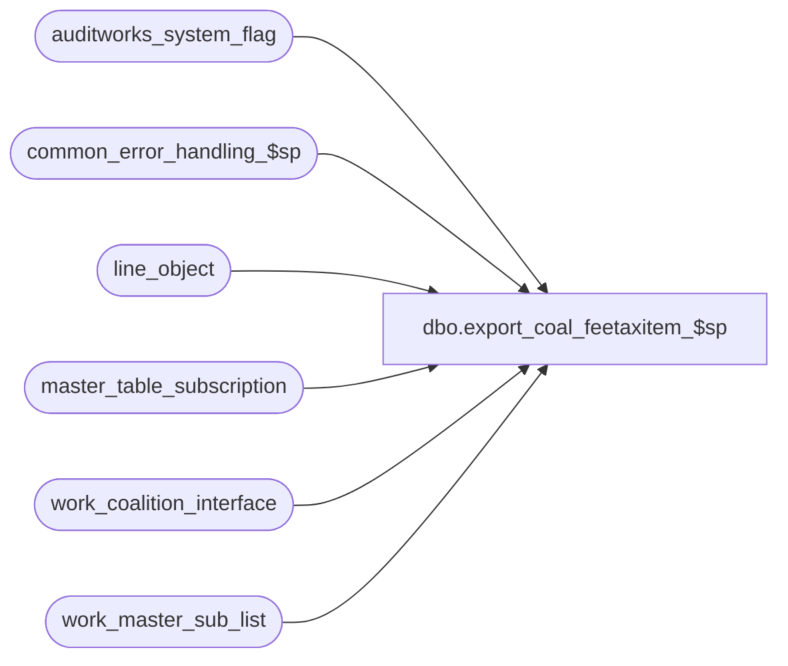

# dbo.export_coal_feetaxitem_$sp

**Database:** auditworks_external  
**Server:** bedrockdb01  

## Architecture Diagram



## Table Dependencies

| Referenced Table |
|---|
| auditworks_system_flag |
| common_error_handling_$sp |
| line_object |
| master_table_subscription |
| work_coalition_interface |
| work_master_sub_list |

## Stored Procedure Code

```sql
create proc dbo.export_coal_feetaxitem_$sp (@interface_id	tinyint,
 @process_no 	smallint,
 @task_server	nvarchar(255),
 @runtime_datetime	datetime,
 @export_status	tinyint,
 @task_no	int OUTPUT,
 @errmsg 	nvarchar(2000) OUTPUT
)
AS

DECLARE
@block_type			smallint,
@cursor_open			tinyint,
@data_header			nvarchar(255),
@errno				int,
@process_log_entry 		tinyint,
@record_sequence		int,
@sku_string                     nvarchar(500),
@sku_id                         nvarchar(500),
@table_name			nvarchar(30),
@table_key			nvarchar(255),
@task_module			nvarchar(255),
@task_header			nvarchar(255),
@task_operation 		nvarchar(255),
@tax_item_group_id		numeric(6,0),
@export_module_name		nvarchar(255),
@message_id		        int,	
@object_name			nvarchar(255),
@operation_name			nvarchar(100),
@process_name		        nvarchar(100),
@time_stamp			datetime,
@action				tinyint,
@posting_datetime		datetime,
@rows				int,
@entry_id			numeric(12,0),
@35commas                       nvarchar(100),
@32commas                       nvarchar(100),
@invalid_line_object_config     nvarchar(2000), 
@integrity_rows 		int,
@memo1				nvarchar(50),
@memo2				nvarchar(50)

/* Proc Name: export_coal_feetaxitem_$sp
   Desc: Coalition Tax Exports.
     Called by coalition_interface_main_$sp.

HISTORY:
Date     Name          Def#  Desc
Jan28,15 Vicci    TFS-102559 When configuration is invalid and cannot be exported, put list of line objects with invalid configuration 
                             (multiple line-objects with same non-merchandise SKU but different tax-item-group-id assignments) in error
                             message raised to facilitate troubleshooting.Recognize that multiple line objects for a given SKU with the 
                             SAME tax item-group is valid.
Mar17,14 Phu        1-4CDP8E Fix partial export that has result in the wrong order.
Feb26,13 Vicci        142088 To avoid deadlocks, lock a shared flag prior to work_master_sub_list deletions.
Feb22,13 Vicci        142020 Do not hold a lock on the work_master_sub_list table while reading it in a cursor, since this causes the 
                             audit_trail_header_$trI work_master_sub_list cleanup of prior configuration changes for the table/key upon 
                             additional change to the same table/key to die as victim of a deadlock.
Jul16,12 Paul         136951 use nolock hint on master_table_subscription to reduce deadlocking.         
Apr07,11 Vicci        126078 Take master_table_subscription active flag into account.
Jun07,06 Vicci        71631  Re-fix (was exporting sku as dx=# instead of # and was still skipping GC)
May03,06 Vicci	      71631  Do not export inactive line-objects, recognize the fact that for
			     gift-cert/gift-card the non-merch idx is in the lookup_pos_code 
			     as "IdxNonMds" instead since the Idx associated with them is their
			     tender Idx
Mar15,06 Vicci	      68918  Replace reference to @task_no_rule variable with @task_no since 
			     the former is never set. Remove reference to unused @rule_rows 
			     variable.  Do not update master-table-subscription entries for 
			     the tax_item_group_update table since it is processed by 
			     export_coal_merchtaxitem_$sp; Return if there is no work to do.
Jan18,06 Vicci	      66166  Do not use the cursor variable @table_name when deleting from
			     work_master_sub_list since this delete is outside the cursor
			     and when nothing has been fetched it is not set.
Aug03,05 Daphna       58339  author

*/


SELECT @process_name = 'export_coal_feetaxitem_$sp',
       @message_id = 201068,
       @task_module = 'Module=Item',
       @export_module_name = 'Item',
       @time_stamp = getdate(),
       @rows = 0,
       @35commas = ',,,,,,,,,,,,,,,,,,,,,,,,,,,,,,,,,,,',
       @32commas = ',,,,,,,,,,,,,,,,,,,,,,,,,,,,,,,,',
       @integrity_rows = 0

IF NOT EXISTS (SELECT 1
                 FROM master_table_subscription WITH (NOLOCK)
                WHERE export_module_name = @export_module_name 
        AND interface_id = @interface_id
                  AND table_name <> 'tax_item_group_update'
                  AND export_status IN (1, 2)
                  AND active_flag > 0)
  RETURN
        
IF @export_status = 2  -- full download
BEGIN

  SELECT @block_type = 2, 
         @task_no = @task_no + 1,
         @task_header = '[Task.' + CONVERT(nvarchar, @task_no) + ']',
         @task_operation = 'Operation=AddUpdate',
         @record_sequence = 0

  -- Build the reinsertion task
  INSERT work_coalition_interface
         (runtime_datetime, record_content, block_type,
         task_no, record_sequence_no, export_module_name)
  VALUES (@runtime_datetime, @task_header, @block_type,
         @task_no, @record_sequence, @export_module_name)                               

  SELECT @errno = @@error
  IF @errno <> 0
  BEGIN
    SELECT @errmsg = 'Failed to insert into work_coalition_interface with task_header for FeeTaxItem AddUpdate',
           @object_name = 'work_coalition_interface',
           @operation_name = 'INSERT'     
    GOTO error
  END             
                       
  SELECT @record_sequence = @record_sequence + 1      

  INSERT work_coalition_interface
         (runtime_datetime, record_content, block_type, 
         task_no, record_sequence_no, export_module_name)
  VALUES (@runtime_datetime, 'server=ITEM MASTER', @block_type, 
     @task_no, @record_sequence, @export_module_name)                               

  SELECT @errno = @@error
  IF @errno <> 0
  BEGIN
    SELECT @errmsg = 'Failed to insert into work_coalition_interface with task_server for FeeItemGroup AddUpdate',
     @object_name = 'work_coalition_interface',
           @operation_name = 'INSERT'      
    GOTO error
  END             
                       
  SELECT @record_sequence = @record_sequence + 1
 
  INSERT work_coalition_interface
         (runtime_datetime, record_content, block_type, 
         task_no, record_sequence_no, export_module_name)
  VALUES (@runtime_datetime, @task_module, @block_type, 
         @task_no, @record_sequence, @export_module_name)                               

  SELECT @errno = @@error
  IF @errno <> 0
  BEGIN
    SELECT @errmsg = 'Failed to insert into work_coalition_interface with task_module for FeeTaxItem AddUpdate',
           @object_name = 'work_coalition_interface',
           @operation_name = 'INSERT'      
    GOTO error
  END             
                       
  SELECT @record_sequence = @record_sequence + 1

  INSERT work_coalition_interface
         (runtime_datetime, record_content, block_type, 
         task_no, record_sequence_no, export_module_name)
  VALUES (@runtime_datetime, @task_operation, @block_type, 
         @task_no, @record_sequence, @export_module_name)                               

  SELECT @errno = @@error
  IF @errno <> 0
  BEGIN
    SELECT @errmsg = 'Failed to insert into work_coalition_interface with task_operation for FeeTaxItem AddUpdate',
           @object_name = 'work_coalition_interface',
           @operation_name = 'INSERT'      
    GOTO error
  END             
  
  -- Build the reinsertion data
  SELECT @data_header = '[Data.' + CONVERT(nvarchar, @task_no) + ']',
         @record_sequence = 0,
         @block_type = 3 -- Data

  INSERT work_coalition_interface
         (runtime_datetime, record_content, block_type, 
         task_no, record_sequence_no, export_module_name)
  VALUES (@runtime_datetime, @data_header, @block_type, 
         @task_no, @record_sequence, @export_module_name)                               

  SELECT @errno = @@error
  IF @errno <> 0
  BEGIN
    SELECT @errmsg = 'Failed to insert into work_coalition_interface with data_header for FeeTaxItem AddUpdate',
           @object_name = 'work_coalition_interface',
           @operation_name = 'INSERT'      
    GOTO error
  END             

  SELECT @record_sequence = @record_sequence + 1
    
  -- insert into temp table: string, start pos, end pos, taxitemgroup id
  CREATE TABLE #fees
  (sku_string nvarchar(500), 
  tax_item_group_id numeric(10,0), 
  start_pos tinyint, 
  end_pos tinyint,
  line_object smallint)
    
  INSERT INTO #fees
         (sku_string, tax_item_group_id,start_pos, end_pos, line_object)
  SELECT ISNULL(lookup_pos_code,object_export_code), tax_item_group_id,0,0, line_object
    FROM line_object
   WHERE line_object_type in (2, 4)  --- fees or gift certificates
     AND (CHARINDEX('Idx=',ISNULL(lookup_pos_code,object_export_code)) <> 0
          OR CHARINDEX('IdxNonMds=',ISNULL(lookup_pos_code,object_export_code)) <> 0)
     AND tax_item_group_id IS NOT NULL
     AND active_flag = 1
  SELECT @errno = @@error,
         @rows = @@rowcount
  IF @errno <> 0
  BEGIN
    SELECT @errmsg = 'Failed to insert from line_object',
           @object_name = '#fees',
           @operation_name = 'INSERT'      
    GOTO error
  END              

  IF @rows > 0  --- rows to export
  BEGIN
    
    UPDATE #fees
    SET start_pos = CHARINDEX('IdxNonMds=', sku_string) + 10  
    WHERE CHARINDEX('IdxNonMds=', sku_string) <> 0
    SELECT @errno = @@error
    IF @errno <> 0
    BEGIN
      SELECT @errmsg = 'Failed to determine start_pos (object-type 4)',
             @object_name = '#fees',
             @operation_name = 'UPDATE'      
      GOTO error
    END                    

    UPDATE #fees
    SET start_pos = CHARINDEX('Idx=', sku_string) + 4  
    WHERE start_pos = 0
    SELECT @errno = @@error
    IF @errno <> 0
    BEGIN
      SELECT @errmsg = 'Failed to determine start_pos',
             @object_name = '#fees',
             @operation_name = 'UPDATE'      
      GOTO error
    END                    
         
    UPDATE #fees
    SET end_pos = CHARINDEX('.', sku_string, start_pos)
    SELECT @errno = @@error
    IF @errno <> 0
    BEGIN
      SELECT @errmsg = 'Failed to determine end_pos',
             @object_name = '#fees',
             @operation_name = 'UPDATE'      
      GOTO error
    END           
                 
    UPDATE #fees
    SET end_pos = LEN(sku_string) + 1
    WHERE end_pos = 0
    SELECT @errno = @@error
    IF @errno <> 0
    BEGIN
      SELECT @errmsg = 'Failed to determine end_pos',
             @object_name = '#fees',
             @operation_name = 'UPDATE'      
      GOTO error
    END           
   
    --Put list of line objects (if any) with invalid configuration (multiple line-objects with same non-merchandise SKU but different tax-item-group-id assignments) into a variable
    SELECT @invalid_line_object_config = 'Invalid object/sku list:  '
    SELECT @invalid_line_object_config = @invalid_line_object_config + convert(nvarchar, line_object) + '/' + SUBSTRING(sku_string, start_pos, (end_pos - start_pos)) + ', '
      FROM #fees
     WHERE SUBSTRING(sku_string, start_pos, (end_pos - start_pos)) IN (SELECT SUBSTRING(sku_string, start_pos, (end_pos - start_pos)) non_mdse_sku
    									 FROM #fees
								        GROUP BY SUBSTRING(sku_string, start_pos, (end_pos - start_pos)) 
								       HAVING MIN(tax_item_group_id) <> MAX(tax_item_group_id))

    SELECT @errno = @@error, @integrity_rows = @@rowcount
    IF @errno <> 0
    BEGIN
      SELECT @errmsg = 'Failed to determine if integrities exist in line_object configuration.  ',
             @object_name = '#fees',
             @operation_name = 'SELECT'      
      GOTO error
    END                            
    IF @integrity_rows <> 0
    BEGIN
      SELECT @errmsg = 'Integrities exist in line_object configuration.  ',
             @object_name = '#fees',
             @operation_name = 'SELECT',
             @message_id = 203123,
             @memo1 = 'tax item group id'             
      SELECT @invalid_line_object_config = REVERSE(SUBSTRING(REVERSE(@invalid_line_object_config), 3, 2000))
      SELECT @memo2 = SUBSTRING(@invalid_line_object_config, 1, 50)
      SELECT @errmsg = @errmsg + @invalid_line_object_config
      GOTO error
    END                            
    
      --then insert into work_coalition_interface from temp table 
    INSERT work_coalition_interface
           (runtime_datetime,
            record_content,
            block_type,
            task_no,
            record_sequence_no,
            export_module_name)
    SELECT  @runtime_datetime,
            @export_module_name + ',' + SUBSTRING(sku_string, start_pos, (end_pos - start_pos)) 
            + @35commas + MAX(CONVERT(nvarchar, tax_item_group_id))+ @32commas,
            @block_type,
            @task_no,
            @record_sequence,
            @export_module_name                               
      FROM  #fees
      GROUP BY SUBSTRING(sku_string, start_pos, (end_pos - start_pos))
     HAVING MAX(CONVERT(nvarchar, tax_item_group_id)) = MIN(CONVERT(nvarchar, tax_item_group_id))
    SELECT @errno = @@error
    IF @errno <> 0
    BEGIN
      SELECT @errmsg = 'Failed to insert into work_coalition_interface from tax_item_group',
             @object_name = 'work_coalition_interface',
             @operation_name = 'INSERT'      
      GOTO error
    END                    
  END  -- rows > 0
  ELSE --- rows = 0
  BEGIN
    DELETE work_coalition_interface
      WHERE task_no = @task_no
        AND runtime_datetime = @runtime_datetime      
        AND export_module_name = @export_module_name

    SELECT @errno = @@error
    IF @errno <> 0
    BEGIN
      SELECT @errmsg = 'Failed to delete from  work_coalition_interface if no details for TaxItemGroup AddUpdate',
             @object_name = 'work_coalition_interface',
             @operation_name = 'DELETE'      
      GOTO error
    END
  END -- IF @rows = 0           
END  -- @export_status = 2  -- full download
ELSE  -- TM download
BEGIN

  DECLARE feetaxitem_crsr CURSOR FAST_FORWARD
      FOR 
  SELECT table_name, 
         table_key,
         action,
         posting_datetime,
         entry_id,
         ISNULL(lookup_pos_code,object_export_code),
         tax_item_group_id
    FROM work_master_sub_list w, line_object l
   WHERE interface_id = @interface_id
     AND table_name = 'line_object'
     AND posting_datetime <= @time_stamp
     AND w.table_key = l.line_object
     AND line_object_type in (2, 4) -- fees, gift cert
     AND l.tax_item_group_id IS NOT NULL
     AND (CHARINDEX('Idx=',ISNULL(lookup_pos_code,object_export_code)) <> 0
          OR CHARINDEX('IdxNonMds=',ISNULL(lookup_pos_code,object_export_code)) <> 0)
     AND tax_item_group_id IS NOT NULL
     AND active_flag = 1
   ORDER BY entry_id ASC

  SELECT @errno = @@error
  IF @errno <> 0
  BEGIN
    SELECT @errmsg = 'Unable to declare cursor feetaxitem_crsr',
           @object_name = 'feetaxitem_crsr',
           @operation_name = 'DECLARE'      
    GOTO error
  END

  OPEN feetaxitem_crsr
  SELECT @errno = @@error
  
  IF @errno <> 0
  BEGIN
    SELECT @errmsg = 'Unable to open cursor feetaxitem_crsr',
           @object_name = 'feetaxitem_crsr',
           @operation_name = 'OPEN'      
    GOTO error
  END

  SELECT  @cursor_open = 1

  WHILE 1 = 1
  BEGIN

    FETCH feetaxitem_crsr
     INTO @table_name,
          @table_key,
          @action,
          @posting_datetime,
          @entry_id,
          @sku_string,
          @tax_item_group_id

    IF @@fetch_status <> 0
      BREAK
   
   IF @action <> 3  -- add or update only
   BEGIN       
     SELECT @runtime_datetime = @posting_datetime,
           @rows  = 0,
           @task_no = @task_no + 1,
           @block_type = 2, 
           @task_header = '[Task.' + CONVERT(nvarchar, @task_no) + ']',
           @task_operation = 'Operation=AddUpdate',
           @record_sequence = 0  
      IF CHARINDEX('Idx=',@sku_string,1) <> 0
        SELECT @sku_id = SUBSTRING(@sku_string, (CHARINDEX('Idx=',@sku_string,1) +4), LEN(@sku_string))
      ELSE
        SELECT @sku_id = SUBSTRING(@sku_string, (CHARINDEX('IdxNonMds=', @sku_string) + 10), LEN(@sku_string))
      
      SELECT @sku_id = SUBSTRING(@sku_id, 0, charindex('.',@sku_id ))         

       -- Build the reinsertion task
      INSERT work_coalition_interface
             (runtime_datetime, record_content, block_type,
             task_no, record_sequence_no, export_module_name)
      VALUES (@runtime_datetime, @task_header, @block_type,
             @task_no, @record_sequence, @export_module_name)                               

      SELECT @errno = @@error
      IF @errno <> 0
      BEGIN
        SELECT @errmsg = 'Failed to insert into work_coalition_interface with task_header for FeeTaxItem AddUpdate (2)',
               @object_name = 'work_coalition_interface',
               @operation_name = 'INSERT'      
        GOTO error
      END             
                       
      SELECT @record_sequence = @record_sequence + 1      

      INSERT work_coalition_interface
             (runtime_datetime, record_content, block_type, 
             task_no, record_sequence_no, export_module_name)
      VALUES (@runtime_datetime, 'server=ITEM MASTER', @block_type, 
             @task_no, @record_sequence, @export_module_name)   

      SELECT @errno = @@error
      IF @errno <> 0
      BEGIN
        SELECT @errmsg = 'Failed to insert into work_coalition_interface with task_server for FeeTaxItem AddUpdate (2)',
               @object_name = 'work_coalition_interface',
               @operation_name = 'INSERT'      
        GOTO error
      END             
                        
      SELECT @record_sequence = @record_sequence + 1
 
      INSERT work_coalition_interface
             (runtime_datetime, record_content, block_type, 
             task_no, record_sequence_no, export_module_name)
      VALUES (@runtime_datetime, @task_module, @block_type, 
             @task_no, @record_sequence, @export_module_name)                               

      SELECT @errno = @@error
      IF @errno <> 0
      BEGIN
        SELECT @errmsg = 'Failed to insert into work_coalition_interface with task_module for FeeTaxItem AddUpdate (2)',
               @object_name = 'work_coalition_interface',
               @operation_name = 'INSERT'      
        GOTO error
      END             
                       
      SELECT @record_sequence = @record_sequence + 1

      INSERT work_coalition_interface
             (runtime_datetime, record_content, block_type, 
             task_no, record_sequence_no, export_module_name)
      VALUES (@runtime_datetime, @task_operation, @block_type, 
             @task_no, @record_sequence, @export_module_name)                               

      SELECT @errno = @@error
      IF @errno <> 0
      BEGIN
        SELECT @errmsg = 'Failed to insert into work_coalition_interface with task_operation for FeeTaxItem AddUpdate (2)',
               @object_name = 'work_coalition_interface',
               @operation_name = 'INSERT'      
        GOTO error
      END             
  
      -- Build the reinsertion data
      SELECT @data_header = '[Data.' + CONVERT(nvarchar, @task_no) + ']',
             @record_sequence = 0,
             @block_type = 3 -- Data

      INSERT work_coalition_interface
             (runtime_datetime, record_content, block_type, 
             task_no, record_sequence_no, export_module_name)
      VALUES (@runtime_datetime, @data_header, @block_type, 
             @task_no, @record_sequence, @export_module_name)                               

      SELECT @errno = @@error
      IF @errno <> 0
      BEGIN
        SELECT @errmsg = 'Failed to insert into work_coalition_interface with data_header for FeeTaxItem AddUpdate (2)',
               @object_name = 'work_coalition_interface',
       @operation_name = 'INSERT'      
        GOTO error
      END             

      SELECT @record_sequence = @record_sequence + 1

      INSERT work_coalition_interface
             (runtime_datetime, 
             record_content, 
             block_type, 
             task_no, record_sequence_no, export_module_name)
      VALUES (@runtime_datetime, 
             @export_module_name + ',' + @sku_id + @35commas + CONVERT(nvarchar, @tax_item_group_id)+ @32commas,
             @block_type, @task_no, @record_sequence, @export_module_name)
                
      SELECT @errno = @@error,
             @rows = @@rowcount
      IF @errno <> 0
      BEGIN
        SELECT @errmsg = 'Failed to insert into work_coalition_interface from line_object (2)',
               @object_name = 'work_coalition_interface',
       @operation_name = 'INSERT'      
        GOTO error
      END                    

      IF @rows = 0 
      BEGIN
        DELETE work_coalition_interface
         WHERE task_no = @task_no
           AND runtime_datetime = @posting_datetime      
           AND export_module_name = @export_module_name  

        SELECT @errno = @@error
        IF @errno <> 0
        BEGIN
           SELECT @errmsg = 'Failed to delete from  work_coalition_interface if no details for TaxItemGroup AddUpdate',
                  @object_name = 'work_coalition_interface',
                  @operation_name = 'DELETE'      
           GOTO error
        END
      END -- IF @rows = 0           

    END -- IF @action != 3       

  END  -- While 1 = 1                 

  CLOSE feetaxitem_crsr
  SELECT @errno = @@error
  IF @errno <> 0
  BEGIN
    SELECT @errmsg = 'Unable to close cursor feetaxitem_crsr',
           @object_name = 'feetaxitem_crsr',
           @operation_name = 'close'      
    GOTO error
  END

  DEALLOCATE feetaxitem_crsr

  SELECT @cursor_open = 0

BEGIN TRANSACTION  --142088
  /* Prevent possible deadlocks when audit trail published change retraction deletion and this export 
     simultaneously attempt to clean up the same work_master_sublist rows, by updating a shared system flag. */ 
  UPDATE auditworks_system_flag
     SET flag_datetime_value = getdate()
   WHERE flag_name = 'work_master_sublist_access'
  SELECT @errno = @@error
  IF @errno != 0 
  BEGIN
    SELECT @errmsg = 'Set flag to force concurrent processes to run sequentially',
           @object_name = 'auditworks_system_flag',
           @operation_name = 'UPDATE'
    GOTO error
  END

  DELETE work_master_sub_list
   WHERE interface_id = @interface_id
     AND table_name IN (SELECT table_name
                          FROM master_table_subscription WITH (NOLOCK)
                         WHERE interface_id = 16
   AND export_module_name = @export_module_name
                           AND active_flag > 0)                         
     AND posting_datetime <= @time_stamp 
  SELECT @errno = @@error
  IF @errno <> 0
  BEGIN
    SELECT @errmsg = 'Failed to delete from work_master_sub_list for TaxItemGroup',
           @object_name = 'work_master_sub_list',
           @operation_name = 'DELETE'                 
    GOTO error
  END    
COMMIT

END -- IF @export_status != 2

IF NOT EXISTS (SELECT export_module_name
                 FROM work_coalition_interface
                WHERE export_module_name = @export_module_name)
BEGIN               
  UPDATE master_table_subscription
     SET export_status = 0
   WHERE export_module_name = @export_module_name 
     AND interface_id = @interface_id
     AND table_name <> 'tax_item_group_update'
     AND active_flag > 0
  SELECT @errno = @@error
  IF @errno <> 0
  BEGIN
    SELECT @errmsg = 'Unable to update master_table_subscription',
           @object_name = 'master_table_subscription',
           @operation_name = 'UPDATE'      
    GOTO error
  END
END

RETURN 

error:   /* Common error handler */

     IF @cursor_open = 1
	  BEGIN
	   CLOSE feetaxitem_crsr
	   DEALLOCATE feetaxitem_crsr
	  END

	  EXEC common_error_handling_$sp @process_no, @errno, @errmsg, 0, @message_id, 
  	    @process_name, @object_name, @operation_name, 1, 1, 
  	    @process_log_entry, null, 0, @memo1, @memo2

	RETURN
```

