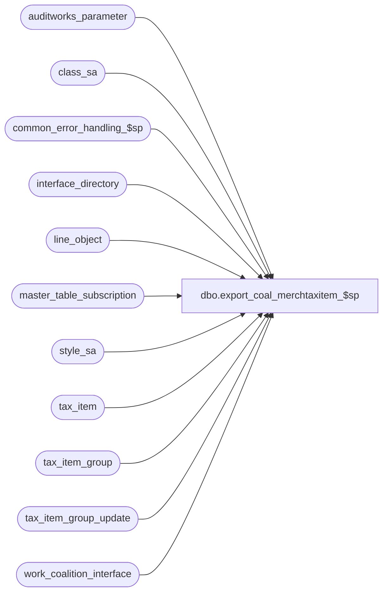

# dbo.export_coal_merchtaxitem_$sp

**Database:** auditworks_external  
**Server:** bedrockdb01  

## Architecture Diagram



## Table Dependencies

| Referenced Table |
|---|
| auditworks_parameter |
| class_sa |
| common_error_handling_$sp |
| interface_directory |
| line_object |
| master_table_subscription |
| style_sa |
| tax_item |
| tax_item_group |
| tax_item_group_update |
| work_coalition_interface |

## Stored Procedure Code

```sql
create proc [dbo].[export_coal_merchtaxitem_$sp] (@interface_id	tinyint,
 @process_no 	smallint,
 @runtime_datetime datetime,
 @export_status	tinyint,
 @task_no	int OUTPUT,
 @errmsg 	nvarchar(255) OUTPUT
)
AS

DECLARE
@block_type			smallint,
@data_header			nvarchar(255),
@default_tax_item_group_id	numeric(10,0),
@errno				int,
@record_sequence		int,
@task_server			nvarchar(255),
@task_module			nvarchar(255),
@task_header			nvarchar(255),
@task_operation 		nvarchar(255),
@export_module_name		nvarchar(255),
@line_object			smallint,
@message_id		        int,	
@object_name			nvarchar(255),
@operation_name			nvarchar(100),
@par_value			nvarchar(4), 
@process_name		        nvarchar(100),
@35commas                       nvarchar(100),
@32commas                       nvarchar(100),
@last_runtime_datetime		datetime

/* Proc Name: export_coal_merchtaxitem_$sp
   Desc: Coalition Tax Exports.
         Only applies if S/A tax-item-group auto-generation is active.
         Export tax-item-group-id assigned directly or indirectly (via class/style) to 
         merchandise SKU.  Only exports tax-item-group-id changes originating from S/A
         tax-item-group auto-generation.
         Also export tax-item-group-id corresponding to newly created SKUs
         Called by coalition_interface_main_$sp.

HISTORY:
Date     Name          Def#  Desc
Jul16,12 Paul         136951 use nolock hint on master_table_subscription to reduce deadlocking. 
Oct19,11 Vicci        130568 The ongoing (as opposed to full manually requested) Export from S/A to Coalition of the tax-item-group assigned with each SKU does not support a tax-item-group override at SKU, STYLE or CLASS level being removed. All is fine if it is modified,
			     therefore remove references to tax_item_group_update.tax_item_group_id since it is not set when an override has been removed.
Apr07,11 Vicci        126078 Take master_table_subscription active flag into account.
Jan30,06 Vicci	      68918  author

*/


SELECT @process_name = 'export_coal_merchtaxitem_$sp',
       @message_id = 201068,
       @par_value = null,
       @task_module = 'Module=Item',
       @export_module_name = 'Item',
       @35commas = ',,,,,,,,,,,,,,,,,,,,,,,,,,,,,,,,,,,',
       @32commas = ',,,,,,,,,,,,,,,,,,,,,,,,,,,,,,,,'
        
IF NOT EXISTS (SELECT 1
                 FROM master_table_subscription WITH (NOLOCK)
                WHERE export_module_name = @export_module_name 
                  AND interface_id = @interface_id
                  AND table_name = 'tax_item_group_update'
                  AND export_status IN (1, 2)
                  AND active_flag > 0)
  RETURN

/* Check if tax-item-group auto-generation is active.  If not, then S/A did not set the
   tax-item-group-id and so S/A will not download it either */
IF NOT EXISTS (SELECT 1
                 FROM interface_directory
                WHERE interface_id = 17 -- tax-item-group auto-generation
	          AND update_timing > 0)
  RETURN

SELECT @par_value = substring(par_value, 1, 4)
  FROM auditworks_parameter
 WHERE par_name = 'tax_item_group_auto_gen_object'
SELECT @errno = @@error
IF @errno != 0
BEGIN
  SELECT @errmsg = 'Failed to determine if a line-object has been defined to provide taxability defaults for the auto-gen process',
         @object_name = 'auditworks_parameter',
         @operation_name = 'SELECT'
  GOTO error
END

IF ISNUMERIC(@par_value) = 1 
  SELECT @line_object = convert(smallint, @par_value)

IF NOT EXISTS (SELECT 1 
                 FROM line_object o
                WHERE o.line_object = @line_object
                  AND o.line_object_type = 1)
BEGIN
  UPDATE master_table_subscription
     SET export_status = 0
   WHERE export_module_name = @export_module_name 
     AND interface_id = @interface_id
     AND table_name = 'tax_item_group_update'
     AND export_status <> 0
     AND active_flag > 0
     
  RETURN
END

SELECT @default_tax_item_group_id = o.tax_item_group_id
  FROM line_object o, tax_item_group t
 WHERE o.line_object = @line_object
   AND o.tax_item_group_id = t.tax_item_group_id
SELECT @errno = @@error
IF @errno <> 0
BEGIN
  SELECT @errmsg = 'Failed to determine the default tax-item-group for merchandise',
         @object_name = 'line_object',
         @operation_name = 'SELECT'      
  GOTO error
END             

SELECT @block_type = 2, 
       @task_no = @task_no + 1,
       @task_header = '[Task.' + CONVERT(nvarchar, @task_no) + ']',
       @task_operation = 'Operation=AddUpdate',
       @task_server = 'server=ITEM MASTER',
       @record_sequence = 0

SELECT @last_runtime_datetime = last_retrieval_datetime
  FROM master_table_subscription WITH (NOLOCK)
 WHERE interface_id = @interface_id
   AND table_name = 'tax_item_group_update'
   AND export_module_name = @export_module_name   
   AND active_flag > 0
SELECT @errno = @@error
IF @errno <> 0
BEGIN
  SELECT @errmsg = 'Failed to determine last time the export of this information ran',
         @object_name = 'master_table_subscription',
         @operation_name = 'SELECT'      
  GOTO error
END             
 
  -- Build the reinsertion task
  INSERT work_coalition_interface
         (runtime_datetime, record_content, block_type,
         task_no, record_sequence_no, export_module_name)
  VALUES (@runtime_datetime, @task_header, @block_type,
         @task_no, @record_sequence, @export_module_name)            
  SELECT @errno = @@error
  IF @errno <> 0
  BEGIN
    SELECT @errmsg = 'Failed to insert into work_coalition_interface with task_header for merchtaxItem AddUpdate',
           @object_name = 'work_coalition_interface',
           @operation_name = 'INSERT'      
    GOTO error
  END             
                       
  SELECT @record_sequence = @record_sequence + 1      

  INSERT work_coalition_interface
         (runtime_datetime, record_content, block_type, 
         task_no, record_sequence_no, export_module_name)
  VALUES (@runtime_datetime, @task_server, @block_type, 
         @task_no, @record_sequence, @export_module_name)                               
  SELECT @errno = @@error
  IF @errno <> 0
  BEGIN
    SELECT @errmsg = 'Failed to insert into work_coalition_interface with task_server for FeeItemGroup AddUpdate',
           @object_name = 'work_coalition_interface',
           @operation_name = 'INSERT'      
    GOTO error
  END             
                       
  SELECT @record_sequence = @record_sequence + 1
 
  INSERT work_coalition_interface
         (runtime_datetime, record_content, block_type, 
         task_no, record_sequence_no, export_module_name)
  VALUES (@runtime_datetime, @task_module, @block_type, 
         @task_no, @record_sequence, @export_module_name)                               
  SELECT @errno = @@error
  IF @errno <> 0
  BEGIN
    SELECT @errmsg = 'Failed to insert into work_coalition_interface with task_module for merchtaxItem AddUpdate',
           @object_name = 'work_coalition_interface',
           @operation_name = 'INSERT'      
    GOTO error
  END             
                       
  SELECT @record_sequence = @record_sequence + 1

  INSERT work_coalition_interface
         (runtime_datetime, record_content, block_type, 
         task_no, record_sequence_no, export_module_name)
  VALUES (@runtime_datetime, @task_operation, @block_type, 
         @task_no, @record_sequence, @export_module_name)                               
  SELECT @errno = @@error
  IF @errno <> 0
  BEGIN
    SELECT @errmsg = 'Failed to insert into work_coalition_interface with task_operation for merchtaxItem AddUpdate',
           @object_name = 'work_coalition_interface',
           @operation_name = 'INSERT'      
    GOTO error
  END             
  
  -- Build the reinsertion data
  SELECT @data_header = '[Data.' + CONVERT(nvarchar, @task_no) + ']',
    @record_sequence = 0,
         @block_type = 3 -- Data

  INSERT work_coalition_interface
         (runtime_datetime, record_content, block_type, 
         task_no, record_sequence_no, export_module_name)
  VALUES (@runtime_datetime, @data_header, @block_type, 
         @task_no, @record_sequence, @export_module_name)                               
  SELECT @errno = @@error
  IF @errno <> 0
  BEGIN
    SELECT @errmsg = 'Failed to insert into work_coalition_interface with data_header for merchtaxItem AddUpdate',
       @object_name = 'work_coalition_interface',
           @operation_name = 'INSERT'      
    GOTO error
  END             

  SELECT @record_sequence = @record_sequence + 1
    
IF @export_status = 2  -- full download
BEGIN
  INSERT work_coalition_interface
           (runtime_datetime,
            record_content,
            block_type,
            task_no,
            record_sequence_no,
            export_module_name)
  SELECT  @runtime_datetime,
          @export_module_name + ',' + convert(nvarchar, u.sku_id)
          + @35commas + CONVERT(nvarchar, IsNull(c.tax_item_group_id, @default_tax_item_group_id))+ @32commas,
          @block_type,
          @task_no,
          @record_sequence,
          @export_module_name                               
    FROM  class_sa c, style_sa s, tax_item u
   WHERE  c.upc_lookup_division = s.upc_lookup_division
     AND  c.class_code = s.class_code
     AND  s.tax_item_group_id IS NULL
     AND  s.style_reference_id = u.style_reference_id
     AND  u.tax_item_group_id IS NULL
  SELECT @errno = @@error
  IF @errno <> 0
  BEGIN
    SELECT @errmsg = 'Failed to insert into tax-item-group update for items using class default',
           @object_name = 'work_coalition_interface',
           @operation_name = 'INSERT'      
    GOTO error
  END                    

  INSERT work_coalition_interface
           (runtime_datetime,
            record_content,
            block_type,
            task_no,
            record_sequence_no,
            export_module_name)
  SELECT  DISTINCT @runtime_datetime,
          @export_module_name + ',' + convert(nvarchar, u.sku_id)
          + @35commas + CONVERT(nvarchar, s.tax_item_group_id)+ @32commas,
          @block_type,
          @task_no,
          @record_sequence,
          @export_module_name                               
    FROM  style_sa s, tax_item u
   WHERE  s.upc_lookup_division = u.upc_lookup_division
     AND  s.style_reference_id = u.style_reference_id
     AND  s.tax_item_group_id IS NOT NULL
     AND  u.tax_item_group_id IS NULL
  SELECT @errno = @@error
  IF @errno <> 0
  BEGIN
    SELECT @errmsg = 'Failed to insert into tax-item-group update for items using style default',
           @object_name = 'work_coalition_interface',
           @operation_name = 'INSERT'      
    GOTO error
  END                    

  INSERT work_coalition_interface
           (runtime_datetime,
            record_content,
            block_type,
            task_no,
            record_sequence_no,
            export_module_name)
  SELECT DISTINCT  @runtime_datetime,
          @export_module_name + ',' + convert(nvarchar, u.sku_id)
          + @35commas + CONVERT(nvarchar, u.tax_item_group_id)+ @32commas,
          @block_type,
          @task_no,
          @record_sequence,
          @export_module_name                 
    FROM  tax_item u
   WHERE  u.tax_item_group_id IS NOT NULL
  SELECT @errno = @@error
  IF @errno <> 0
  BEGIN
    SELECT @errmsg = 'Failed to insert into tax-item-group update for items with sku override',
           @object_name = 'work_coalition_interface',
           @operation_name = 'INSERT'      
    GOTO error
  END                    
END  -- @export_status = 2  -- full download
ELSE  -- TM download
BEGIN
  INSERT work_coalition_interface
           (runtime_datetime,
            record_content,
            block_type,
            task_no,
            record_sequence_no,
            export_module_name)
  SELECT  DISTINCT @runtime_datetime,
          @export_module_name + ',' + convert(nvarchar, w.sku_id)
          + @35commas + CONVERT(nvarchar, IsNull(c.tax_item_group_id, @default_tax_item_group_id))+ @32commas,
          @block_type,
          @task_no,
          @record_sequence,
          @export_module_name                               
    FROM  tax_item_group_update w, class_sa c, style_sa s, tax_item u
   WHERE  (w.last_modified_date_time > @last_runtime_datetime 
           OR @last_runtime_datetime IS NULL)
     AND  w.last_modified_date_time <= @runtime_datetime
     AND  w.table_name = 'user_upc'
     AND  w.upc_lookup_division = u.upc_lookup_division
     AND  w.sku_id = u.sku_id
     AND  u.tax_item_group_id IS NULL
     AND  u.upc_lookup_division = s.upc_lookup_division
     AND  u.style_reference_id = s.style_reference_id
     AND  s.tax_item_group_id IS NULL
     AND  s.upc_lookup_division = c.upc_lookup_division
     AND  s.class_code = c.class_code     
  SELECT @errno = @@error
  IF @errno <> 0
  BEGIN
    SELECT @errmsg = 'Failed to insert into export tax-item-group update for new items using class default',
           @object_name = 'work_coalition_interface',
           @operation_name = 'INSERT'      
    GOTO error
  END                    
  INSERT work_coalition_interface
           (runtime_datetime,
            record_content,
            block_type,
            task_no,
            record_sequence_no,
            export_module_name)
  SELECT  DISTINCT @runtime_datetime,
          @export_module_name + ',' + convert(nvarchar, w.sku_id)
          + @35commas + CONVERT(nvarchar, s.tax_item_group_id)+ @32commas,
          @block_type,
          @task_no,
          @record_sequence,
          @export_module_name                               
    FROM  tax_item_group_update w, style_sa s, tax_item u
   WHERE  (w.last_modified_date_time > @last_runtime_datetime 
           OR @last_runtime_datetime IS NULL)
     AND  w.last_modified_date_time <= @runtime_datetime
     AND  w.table_name = 'user_upc'
     AND  w.upc_lookup_division = u.upc_lookup_division
     AND  w.sku_id = u.sku_id
     AND  u.tax_item_group_id IS NULL
     AND  u.upc_lookup_division = s.upc_lookup_division
     AND  u.style_reference_id = s.style_reference_id
     AND  s.tax_item_group_id IS NOT NULL
  SELECT @errno = @@error
  IF @errno <> 0
  BEGIN
    SELECT @errmsg = 'Failed to insert into export tax-item-group update for new items using style default',
           @object_name = 'work_coalition_interface',
           @operation_name = 'INSERT'      
    GOTO error
  END                    
  INSERT work_coalition_interface
           (runtime_datetime,
            record_content,
            block_type,
            task_no,
            record_sequence_no,
            export_module_name)
  SELECT  DISTINCT @runtime_datetime,
          @export_module_name + ',' + convert(nvarchar, w.sku_id)
          + @35commas + CONVERT(nvarchar, u.tax_item_group_id)+ @32commas,
          @block_type,
          @task_no,
          @record_sequence,
          @export_module_name                               
    FROM  tax_item_group_update w, tax_item u
   WHERE  (w.last_modified_date_time > @last_runtime_datetime 
           OR @last_runtime_datetime IS NULL)
     AND  w.last_modified_date_time <= @runtime_datetime
     AND  w.table_name = 'user_upc'
     AND  w.upc_lookup_division = u.upc_lookup_division
     AND  w.sku_id = u.sku_id
     AND  u.tax_item_group_id IS NOT NULL
  SELECT @errno = @@error
  IF @errno <> 0
  BEGIN
    SELECT @errmsg = 'Failed to insert into export tax-item-group update for new items using sku override',
           @object_name = 'work_coalition_interface',
           @operation_name = 'INSERT'      
    GOTO error
  END   

  DELETE tax_item_group_update
   WHERE (last_modified_date_time > @last_runtime_datetime 
           OR @last_runtime_datetime IS NULL)
     AND  last_modified_date_time <= @runtime_datetime
     AND  table_name = 'user_upc'
  SELECT @errno = @@error
  IF @errno <> 0
  BEGIN
    SELECT @errmsg = 'Failed to remove listing of new created SKU from the tax-item-group-update table',
           @object_name = 'tax_item_group_update',
           @operation_name = 'DELETE'      
    GOTO error
  END                    
  
  INSERT work_coalition_interface
           (runtime_datetime,
            record_content,
            block_type,
            task_no,
            record_sequence_no,
            export_module_name)
  SELECT  DISTINCT @runtime_datetime,
          @export_module_name + ',' + convert(nvarchar, u.sku_id)
          + @35commas + CONVERT(nvarchar, IsNull(c.tax_item_group_id, @default_tax_item_group_id)) + @32commas,
          @block_type,
          @task_no,
          @record_sequence,
          @export_module_name                               
    FROM  tax_item_group_update w, class_sa c, style_sa s, tax_item u
   WHERE  (w.last_modified_date_time > @last_runtime_datetime 
           OR @last_runtime_datetime IS NULL)
     AND  w.last_modified_date_time <= @runtime_datetime
     AND  w.table_name = 'class_sa'
     AND  w.upc_lookup_division = c.upc_lookup_division
     AND  w.class_code = c.class_code
     AND  w.upc_lookup_division = s.upc_lookup_division
     AND  w.class_code = s.class_code
     AND  s.tax_item_group_id IS NULL
     AND  s.style_reference_id = u.style_reference_id
     AND  u.tax_item_group_id IS NULL
  SELECT @errno = @@error
  IF @errno <> 0
  BEGIN
    SELECT @errmsg = 'Failed to insert into tax-item-group update for items using class default',
           @object_name = 'work_coalition_interface',
           @operation_name = 'INSERT'      
    GOTO error
  END                    

  INSERT work_coalition_interface
           (runtime_datetime,
            record_content,
            block_type,
            task_no,
            record_sequence_no,
            export_module_name)
  SELECT  DISTINCT @runtime_datetime,
          @export_module_name + ',' + convert(nvarchar, u.sku_id)
          + @35commas + CONVERT(nvarchar, IsNull(s.tax_item_group_id, @default_tax_item_group_id)) + @32commas,
          @block_type,
          @task_no,
          @record_sequence,
          @export_module_name                               
    FROM  tax_item_group_update w, style_sa s, tax_item u
   WHERE  (w.last_modified_date_time > @last_runtime_datetime 
           OR @last_runtime_datetime IS NULL)
     AND  w.last_modified_date_time <= @runtime_datetime
     AND  w.table_name = 'style_sa'
     AND  w.upc_lookup_division = s.upc_lookup_division
     AND  w.style_reference_id = s.style_reference_id
     AND  w.upc_lookup_division = u.upc_lookup_division
     AND  w.style_reference_id = u.style_reference_id
     AND  u.tax_item_group_id IS NULL
  SELECT @errno = @@error
  IF @errno <> 0
  BEGIN
    SELECT @errmsg = 'Failed to insert into tax-item-group update for items using style default',
           @object_name = 'work_coalition_interface',
           @operation_name = 'INSERT'      
    GOTO error
  END                    

  INSERT work_coalition_interface
           (runtime_datetime,
            record_content,
            block_type,
            task_no,
            record_sequence_no,
            export_module_name)
  SELECT DISTINCT  @runtime_datetime,
          @export_module_name + ',' + convert(nvarchar, w.sku_id)
          + @35commas + CONVERT(nvarchar, IsNull(u.tax_item_group_id, @default_tax_item_group_id)) + @32commas,
          @block_type,
          @task_no,
          @record_sequence,
          @export_module_name                               
    FROM  tax_item_group_update w, tax_item u
WHERE  (w.last_modified_date_time > @last_runtime_datetime 
           OR @last_runtime_datetime IS NULL)
     AND  w.last_modified_date_time <= @runtime_datetime
     AND  w.upc_lookup_division = u.upc_lookup_division
     AND  w.sku_id = u.sku_id
     AND  w.table_name = 'tax_item'
  SELECT @errno = @@error
  IF @errno <> 0
  BEGIN
    SELECT @errmsg = 'Failed to insert into tax-item-group update for items with sku override',
           @object_name = 'work_coalition_interface',
           @operation_name = 'INSERT'      
    GOTO error
  END                    
END -- IF @export_status != 2

IF NOT EXISTS (SELECT export_module_name
                 FROM work_coalition_interface
                WHERE export_module_name = @export_module_name)
BEGIN               
  UPDATE master_table_subscription
     SET export_status = 0
   WHERE export_module_name = @export_module_name 
     AND interface_id = @interface_id
     AND table_name = 'tax_item_group_update'
     AND active_flag > 0

  SELECT @errno = @@error
  IF @errno <> 0
  BEGIN
    SELECT @errmsg = 'Unable to update master_table_subscription',
           @object_name = 'master_table_subscription',
           @operation_name = 'UPDATE'      
    GOTO error
  END
END

UPDATE master_table_subscription
   SET last_retrieval_datetime = @runtime_datetime
 WHERE interface_id = @interface_id
   AND table_name = 'tax_item_group_update'
   AND export_module_name = @export_module_name
   AND active_flag > 0
SELECT @errno = @@error
IF @errno <> 0
BEGIN
  SELECT @errmsg = 'Failed to mark last retrieval datetime for merch tax item export',
         @object_name = 'master_table_subscription',
         @operation_name = 'UPDATE'      
  GOTO error
END                    

RETURN 

error:   /* Common error handler */

	  EXEC common_error_handling_$sp @process_no, @errno, @errmsg, 0, @message_id, 
  	    @process_name, @object_name, @operation_name, 1, 1

	RETURN
```

