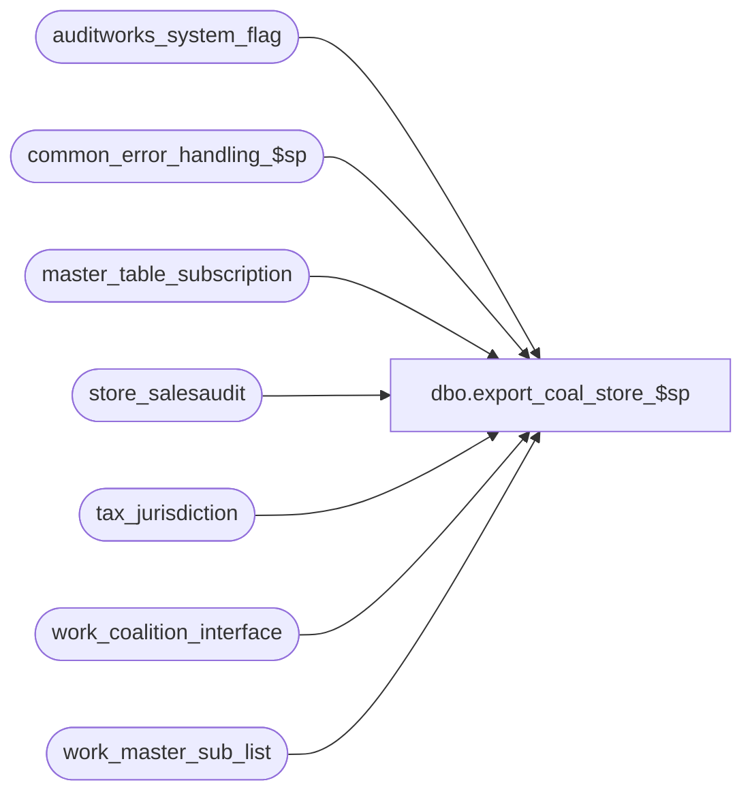

# dbo.export_coal_store_$sp

**Database:** auditworks_external  
**Server:** bedrockdb01  

## Architecture Diagram



## Table Dependencies

| Referenced Table |
|---|
| auditworks_system_flag |
| common_error_handling_$sp |
| master_table_subscription |
| store_salesaudit |
| tax_jurisdiction |
| work_coalition_interface |
| work_master_sub_list |

## Stored Procedure Code

```sql
create proc dbo.export_coal_store_$sp (@interface_id	tinyint,
 @process_no 	smallint,
 @task_server	nvarchar(255),
 @runtime_datetime	datetime,
 @export_status	tinyint,
 @task_no	int OUTPUT,
 @errmsg 	nvarchar(255) OUTPUT
)
AS

DECLARE
@block_type			smallint,
@cursor_open			tinyint,
@data_header			nvarchar(255),
@errno				int,
@process_log_entry 		tinyint,
@record_sequence		int,
@table_name			nvarchar(30),
@table_key			nvarchar(255),
@task_module			nvarchar(255),
@task_header			nvarchar(255),
@task_operation 		nvarchar(255),
@export_module_name		nvarchar(255),
@message_id		        int,	
@store_no			int,
@object_name			nvarchar(255),
@operation_name			nvarchar(100),
@process_name		        nvarchar(100),
@time_stamp			datetime,
@action				tinyint,
@posting_datetime		datetime,
@rows				int


/* Proc Name: export_coal_store_$sp
   Desc: Coalition Tax Exports.
     Called by coalition_interface_main_$sp.

HISTORY:
Date     Name           Def# Desc
Jul28,14 Vicci     TFS-79275 Read table_name from master_table_subscription instead of hard-coding it.
Mar17,14 Phu        1-4CDP8E Fix partial export that has result in the wrong order.
Feb26,13 Vicci        142088 To avoid deadlocks, lock a shared flag prior to work_master_sub_list deletions.
Feb22,13 Vicci        142020 Close the cursor immediately after use not after attempting to clean up work_master_sub_list.
Apr07,11 Vicci        126078 Take master_table_subscription active flag into account.
Nov19,04 Paul        DV-1167 remove unnecessary join to work_master_sub_list, simplify cursor, use CDM tables
Mar11,04 Daphna        25374 increment counter inside cursor loop to prevent multiple insert error
Nov12,02 Winnie         5124 update export_status to 0 if no data in work_coalition_interface
Aug06,02 Winnie      1-DZ2SY To support export_status = 1 (for coalition update/delete)
May02,02 Winnie	     1-CFFPT To standardize the coalition for Tax export.

*/


    SELECT @process_name = 'export_coal_store_$sp',
           @message_id = 201068,
           @task_module = 'Module=Store' ,
           @export_module_name = 'Store',
           @time_stamp = getdate(),
           @rows = 0

SELECT @table_name = MIN(table_name)
  FROM master_table_subscription
 WHERE interface_id = 16
   AND export_module_name = 'Store'
SELECT @errno = @@error
IF @errno <> 0
BEGIN
  SELECT @errmsg = 'Failed to determine name of table to which Coalition Store DCN module subscribes.  ',
         @object_name = 'master_table_subscription',
         @operation_name = 'SELECT'                      
  GOTO error
END  
IF @table_name IS NULL
  SELECT @table_name = 'ORG_CHN.TAX_JRSDCTN_CODE'

IF @export_status = 2 --full table export requested
  BEGIN
 
    SELECT @block_type = 2, 
           @task_no = @task_no + 1
    SELECT @task_header = '[Task.' + CONVERT(nvarchar, @task_no) + ']',
           @task_operation = 'Operation=AddUpdate',
           @record_sequence = 0

    -- Build the reinsertion task
    INSERT work_coalition_interface
           (runtime_datetime, record_content, block_type, 
            task_no, record_sequence_no, export_module_name)
    VALUES (@runtime_datetime, @task_header, @block_type, 
            @task_no, @record_sequence, @export_module_name)                               

    SELECT @errno = @@error
    IF @errno <> 0
      BEGIN
        SELECT @errmsg = 'Failed to insert into work_coalition_interface with task_header for Store AddUpdate',
               @object_name = 'work_coalition_interface',
               @operation_name = 'INSERT'                      
        GOTO error
      END             
                       
    SELECT @record_sequence = @record_sequence + 1      

    INSERT work_coalition_interface
           (runtime_datetime, record_content, block_type, 
            task_no, record_sequence_no, export_module_name)
    VALUES (@runtime_datetime, 'Server=Store', @block_type, 
            @task_no, @record_sequence, @export_module_name)                               

    SELECT @errno = @@error
    IF @errno <> 0
      BEGIN
        SELECT @errmsg = 'Failed to insert into work_coalition_interface with task_server for Store AddUpdate',
               @object_name = 'work_coalition_interface',
               @operation_name = 'INSERT'                      
        GOTO error
      END             
         
    SELECT @record_sequence = @record_sequence + 1

    INSERT work_coalition_interface
           (runtime_datetime, record_content, block_type, 
            task_no, record_sequence_no, export_module_name)
    VALUES (@runtime_datetime, @task_module, @block_type, 
            @task_no, @record_sequence, @export_module_name)                               

    SELECT @errno = @@error
    IF @errno <> 0
      BEGIN
        SELECT @errmsg = 'Failed to insert into work_coalition_interface with task_module for Store AddUpdate',
               @object_name = 'work_coalition_interface',
               @operation_name = 'INSERT'                      
        GOTO error
      END             
                       
 SELECT @record_sequence = @record_sequence + 1

    INSERT work_coalition_interface
           (runtime_datetime, record_content, block_type, 
            task_no, record_sequence_no, export_module_name)
    VALUES (@runtime_datetime, @task_operation, @block_type, 
            @task_no, @record_sequence, @export_module_name)                               

    SELECT @errno = @@error
    IF @errno <> 0
      BEGIN
        SELECT @errmsg = 'Failed to insert into work_coalition_interface with task_operation for Store AddUpdate',
               @object_name = 'work_coalition_interface',
               @operation_name = 'INSERT'                        
        GOTO error
      END             
  
    -- Build the reinsertion data
    SELECT @data_header = '[Data.' + CONVERT(nvarchar, @task_no) + ']',
           @record_sequence = 0,
           @block_type = 3 -- Data

    INSERT work_coalition_interface
          (runtime_datetime, record_content, block_type, 
           task_no, record_sequence_no, export_module_name)
    VALUES (@runtime_datetime, @data_header, @block_type, 
            @task_no, @record_sequence, @export_module_name)                               

    SELECT @errno = @@error
    IF @errno <> 0
      BEGIN
        SELECT @errmsg = 'Failed to insert into work_coalition_interface with data_header for Store AddUpdate',
               @object_name = 'work_coalition_interface',
               @operation_name = 'INSERT'      
        GOTO error
      END             

    SELECT @record_sequence = @record_sequence + 1

    INSERT work_coalition_interface
           (runtime_datetime,
            record_content,
            block_type, task_no, record_sequence_no, export_module_name)
    SELECT  @runtime_datetime,
            @export_module_name + ',' + CONVERT(nvarchar, ss.store_no) 
            + ',,,,,,,,,,,,,,,,,,,' + CONVERT(nvarchar(9), t.tax_jurisdiction_id) , 
            @block_type, @task_no, @record_sequence, @export_module_name                               
      FROM  store_salesaudit ss WITH (NOLOCK), tax_jurisdiction t WITH (NOLOCK) -- all valid stores
     WHERE  ss.tax_jurisdiction = t.tax_jurisdiction

    SELECT @errno = @@error, @rows = @@rowcount
    IF @errno <> 0
      BEGIN
        SELECT @errmsg = 'Failed to insert into work_coalition_interface from store_salesaudit for Store',
               @object_name = 'work_coalition_interface',
               @operation_name = 'INSERT'                      
        GOTO error
      END                    

      IF @rows = 0 
        BEGIN
          DELETE 
            FROM work_coalition_interface
           WHERE task_no = @task_no
             AND runtime_datetime = @runtime_datetime      
             AND export_module_name = @export_module_name  

          SELECT @errno = @@error
          IF @errno <> 0
            BEGIN
              SELECT @errmsg = 'Failed to delete from  work_coalition_interface if no details for Store AddUpdate',
                     @object_name = 'work_coalition_interface',
                     @operation_name = 'DELETE'      
              GOTO error
            END
        END -- IF @rows = 0 
  END

ELSE
  BEGIN
    DECLARE store_crsr CURSOR FAST_FORWARD
        FOR
     SELECT table_key,
            action,
            posting_datetime
       FROM work_master_sub_list 
      WHERE interface_id = @interface_id
        AND table_name = @table_name
        AND posting_datetime <= @time_stamp
 ORDER BY entry_id ASC

    SELECT @errno = @@error
      IF @errno <> 0
        BEGIN
          SELECT @errmsg = 'Unable to declare cursor store_crsr',
                 @object_name = 'store_crsr',
              @operation_name = 'DECLARE'      
          GOTO error
      END

    OPEN store_crsr
    SELECT @errno = @@error
    IF @errno <> 0
        BEGIN
          SELECT @errmsg = 'Unable to open cursor store_crsr',
                 @object_name = 'store_crsr',
                 @operation_name = 'OPEN'      
          GOTO error
        END

    SELECT  @cursor_open = 1

    WHILE 1 = 1
    BEGIN
      FETCH store_crsr
       INTO @table_key,
            @action,
            @posting_datetime

      IF @@fetch_status <> 0
        BREAK

     SELECT @runtime_datetime = @posting_datetime,
            @task_no = @task_no + 1

     IF @action = 3
     BEGIN

       SELECT @block_type = 2 -- Task
       SELECT @task_header = '[Task.' + CONVERT(nvarchar, @task_no) + ']',
              @task_operation = 'Operation=Delete',
              @record_sequence = 0
              

    -- Build the deletion task
        INSERT work_coalition_interface
               (runtime_datetime, record_content, block_type, 
                task_no, record_sequence_no, export_module_name)
        VALUES (@runtime_datetime, @task_header, @block_type, 
                @task_no, @record_sequence, @export_module_name)

        SELECT @errno = @@error
        IF @errno <> 0
          BEGIN
            SELECT @errmsg = 'Failed to insert into work_coalition_interface with task header for Store Delete',
                   @object_name = 'work_coalition_interface',
                   @operation_name = 'INSERT'      
            GOTO error
          END             
                       
        SELECT @record_sequence = @record_sequence + 1
 
        INSERT work_coalition_interface
               (runtime_datetime, record_content, block_type, 
                task_no, record_sequence_no, export_module_name)
        VALUES (@runtime_datetime, 'Server=Store', @block_type,  
                @task_no, @record_sequence, @export_module_name)                               

        SELECT @errno = @@error
        IF @errno <> 0
          BEGIN
            SELECT @errmsg = 'Failed to insert into work_coalition_interface with task_server for Store Delete',
                   @object_name = 'work_coalition_interface',
                   @operation_name = 'INSERT'      
            GOTO error
          END             
                       
        SELECT @record_sequence = @record_sequence + 1

        INSERT work_coalition_interface
               (runtime_datetime, record_content, block_type, 
                task_no, record_sequence_no, export_module_name)
        VALUES (@runtime_datetime, @task_module, @block_type, 
                @task_no, @record_sequence, @export_module_name)                               

        SELECT @errno = @@error
        IF @errno <> 0
          BEGIN
            SELECT @errmsg = 'Failed to insert into work_coalition_interface with task_module for Store Delete',
                   @object_name = 'work_coalition_interface',
                   @operation_name = 'INSERT'      
            GOTO error
          END             
                       
        SELECT @record_sequence = @record_sequence + 1
   
        INSERT work_coalition_interface
               (runtime_datetime, record_content, block_type, 
                task_no, record_sequence_no, export_module_name)
        VALUES (@runtime_datetime, @task_operation, @block_type, 
                @task_no, @record_sequence, @export_module_name)                               

        SELECT @errno = @@error
        IF @errno <> 0
          BEGIN
            SELECT @errmsg = 'Failed to insert into work_coalition_interface with task_operation for Store Delete',
        @object_name = 'work_coalition_interface',
                   @operation_name = 'INSERT'      
            GOTO error
          END             

        SELECT @data_header = '[Data.' + CONVERT(nvarchar, @task_no) + ']',
               @record_sequence = 0,
               @block_type = 3 -- Data

        INSERT work_coalition_interface
               (runtime_datetime, record_content, block_type, 
                task_no, record_sequence_no, export_module_name)
        VALUES (@runtime_datetime, @data_header, @block_type, 
                @task_no, @record_sequence, @export_module_name)                               

        SELECT @errno = @@error
        IF @errno <> 0
          BEGIN
            SELECT @errmsg = 'Failed to insert into work_coalition_interface with data_header for Store Delete',
                   @object_name = 'work_coalition_interface',
                   @operation_name = 'INSERT'      
            GOTO error
          END             

        SELECT @record_sequence = @record_sequence + 1

        INSERT work_coalition_interface
               (runtime_datetime,
                record_content,
                block_type, task_no, record_sequence_no, export_module_name)
        VALUES (@runtime_datetime,
                @export_module_name + ',' + @table_key ,
                @block_type, @task_no, @record_sequence, @export_module_name)

        SELECT @errno = @@error
        IF @errno <> 0
          BEGIN
            SELECT @errmsg = 'Failed to insert into work_coalition_interface from work_master_sub_list for Store Delete',
                   @object_name = 'work_coalition_interface',
                   @operation_name = 'INSERT'      
            GOTO error
          END

      END -- IF @action = 3
      ELSE

      BEGIN
        SELECT @block_type = 2, 
               @task_header = '[Task.' + CONVERT(nvarchar, @task_no) + ']',
               @task_operation = 'Operation=AddUpdate',
               @record_sequence = 0,
               @store_no = CONVERT(INT,@table_key)

        -- Build the reinsertion task
        INSERT work_coalition_interface
               (runtime_datetime, record_content, block_type, 
                task_no, record_sequence_no, export_module_name)
        VALUES (@runtime_datetime, @task_header, @block_type, 
                @task_no, @record_sequence, @export_module_name)                               

        SELECT @errno = @@error
        IF @errno <> 0
          BEGIN
            SELECT @errmsg = 'Failed to insert into work_coalition_interface with task_header for Store AddUpdate (2)',
                   @object_name = 'work_coalition_interface',
                   @operation_name = 'INSERT'                      
            GOTO error
          END             
                       
        SELECT @record_sequence = @record_sequence + 1      

        INSERT work_coalition_interface
               (runtime_datetime, record_content, block_type, 
                task_no, record_sequence_no, export_module_name)
        VALUES (@runtime_datetime, 'Server=Store', @block_type, 
                @task_no, @record_sequence, @export_module_name)       

SELECT @errno = @@error
        IF @errno <> 0
          BEGIN
            SELECT @errmsg = 'Failed to insert into work_coalition_interface with task_server for Store AddUpdate (2)',
                   @object_name = 'work_coalition_interface',
                   @operation_name = 'INSERT'                      
            GOTO error
          END             
         
        SELECT @record_sequence = @record_sequence + 1

        INSERT work_coalition_interface
               (runtime_datetime, record_content, block_type, 
       task_no, record_sequence_no, export_module_name)
        VALUES (@runtime_datetime, @task_module, @block_type, 
                @task_no, @record_sequence, @export_module_name)                               

        SELECT @errno = @@error
        IF @errno <> 0
          BEGIN
            SELECT @errmsg = 'Failed to insert into work_coalition_interface with task_module for Store AddUpdate (2)',
                   @object_name = 'work_coalition_interface',
                   @operation_name = 'INSERT'                      
            GOTO error
          END             
                       
        SELECT @record_sequence = @record_sequence + 1

        INSERT work_coalition_interface
               (runtime_datetime, record_content, block_type, 
                task_no, record_sequence_no, export_module_name)
        VALUES (@runtime_datetime, @task_operation, @block_type, 
                @task_no, @record_sequence, @export_module_name)                               

        SELECT @errno = @@error
        IF @errno <> 0
          BEGIN
            SELECT @errmsg = 'Failed to insert into work_coalition_interface with task_operation for Store AddUpdate (2)',
                   @object_name = 'work_coalition_interface',
                   @operation_name = 'INSERT'                        
            GOTO error
          END             
  
        -- Build the reinsertion data
        SELECT @data_header = '[Data.' + CONVERT(nvarchar, @task_no) + ']',
               @record_sequence = 0,
               @block_type = 3 -- Data

        INSERT work_coalition_interface
               (runtime_datetime, record_content, block_type, 
               task_no, record_sequence_no, export_module_name)
        VALUES (@runtime_datetime, @data_header, @block_type, 
                @task_no, @record_sequence, @export_module_name)                               

        SELECT @errno = @@error
        IF @errno <> 0
          BEGIN
            SELECT @errmsg = 'Failed to insert into work_coalition_interface with data_header for Store AddUpdate (2)',
                   @object_name = 'work_coalition_interface',
                   @operation_name = 'INSERT'      
            GOTO error
          END             

        SELECT @record_sequence = @record_sequence + 1
  
        INSERT work_coalition_interface
               (runtime_datetime,
                record_content,
                block_type, task_no, record_sequence_no, export_module_name)
        SELECT  @runtime_datetime,
                @export_module_name + ',' + CONVERT(nvarchar, @store_no) 
                + ',,,,,,,,,,,,,,,,,,,' + CONVERT(nvarchar(9), t.tax_jurisdiction_id) , 
                @block_type, @task_no, @record_sequence, @export_module_name                               
          FROM  store_salesaudit ss WITH (NOLOCK), tax_jurisdiction t WITH (NOLOCK)
         WHERE  ss.store_no = @store_no
           AND  ss.tax_jurisdiction = t.tax_jurisdiction

        SELECT @errno = @@error,
               @rows = @@rowcount
        IF @errno <> 0
          BEGIN
            SELECT @errmsg = 'Failed to insert into work_coalition_interface for Store AddUpdate (2)',
                   @object_name = 'work_coalition_interface',
                   @operation_name = 'INSERT'                      
            GOTO error
          END   

 IF @rows = 0 
          BEGIN
            DELETE 
              FROM work_coalition_interface
             WHERE task_no = @task_no
               AND runtime_datetime = @posting_datetime      
               AND export_module_name = @export_module_name  

            SELECT @errno = @@error
            IF @errno <> 0
              BEGIN
                SELECT @errmsg = 'Failed to delete from  work_coalition_interface if no details for Store AddUpdate (2)',
                       @object_name = 'work_coalition_interface',
                    @operation_name = 'DELETE'      
                GOTO error
              END
          END -- IF @rows = 0 
      END  -- IF @action != 3
   END -- WHILE 1 = 1

    CLOSE store_crsr
    SELECT @errno = @@error
    IF @errno <> 0
      BEGIN
        SELECT @errmsg = 'Unable to close cursor store_crsr',
               @object_name = 'store_crsr',
               @operation_name = 'close'      
        GOTO error
      END

    DEALLOCATE store_crsr

    SELECT @cursor_open = 0

BEGIN TRANSACTION  --142088
  /* Prevent possible deadlocks when audit trail published change retraction deletion and this export 
     simultaneously attempt to clean up the same work_master_sublist rows, by updating a shared system flag. */ 
  UPDATE auditworks_system_flag
     SET flag_datetime_value = getdate()
   WHERE flag_name = 'work_master_sublist_access'
  SELECT @errno = @@error
  IF @errno != 0 
  BEGIN
    SELECT @errmsg = 'Set flag to force concurrent processes to run sequentially'
    GOTO error
  END

    DELETE work_master_sub_list
          WHERE interface_id = @interface_id
            AND table_name = @table_name
            AND posting_datetime <= @time_stamp 

    SELECT @errno = @@error
    IF @errno <> 0
      BEGIN
        SELECT @errmsg = 'Failed to delete from work_master_sub_list',
               @object_name = 'work_master_sub_list',
               @operation_name = 'DELETE'                      
        GOTO error
      END                    
COMMIT

  END -- IF @export_status = 1

IF NOT EXISTS (SELECT export_module_name
                 FROM work_coalition_interface WITH (NOLOCK)
                WHERE export_module_name = @export_module_name)
  BEGIN               
    UPDATE master_table_subscription
       SET export_status = 0
     WHERE export_module_name = @export_module_name 
       AND interface_id = @interface_id
       AND active_flag > 0
    SELECT @errno = @@error
    IF @errno <> 0
      BEGIN
        SELECT @errmsg = 'Unable to update master_table_subscription',
               @object_name = 'master_table_subscription',
               @operation_name = 'UPDATE'      
        GOTO error
      END
  END
RETURN 

error:   /* Common error handler */


	  EXEC common_error_handling_$sp @process_no, @errno, @errmsg, 0, @message_id, 
  	    @process_name, @object_name, @operation_name, 1, 1

	RETURN
```

