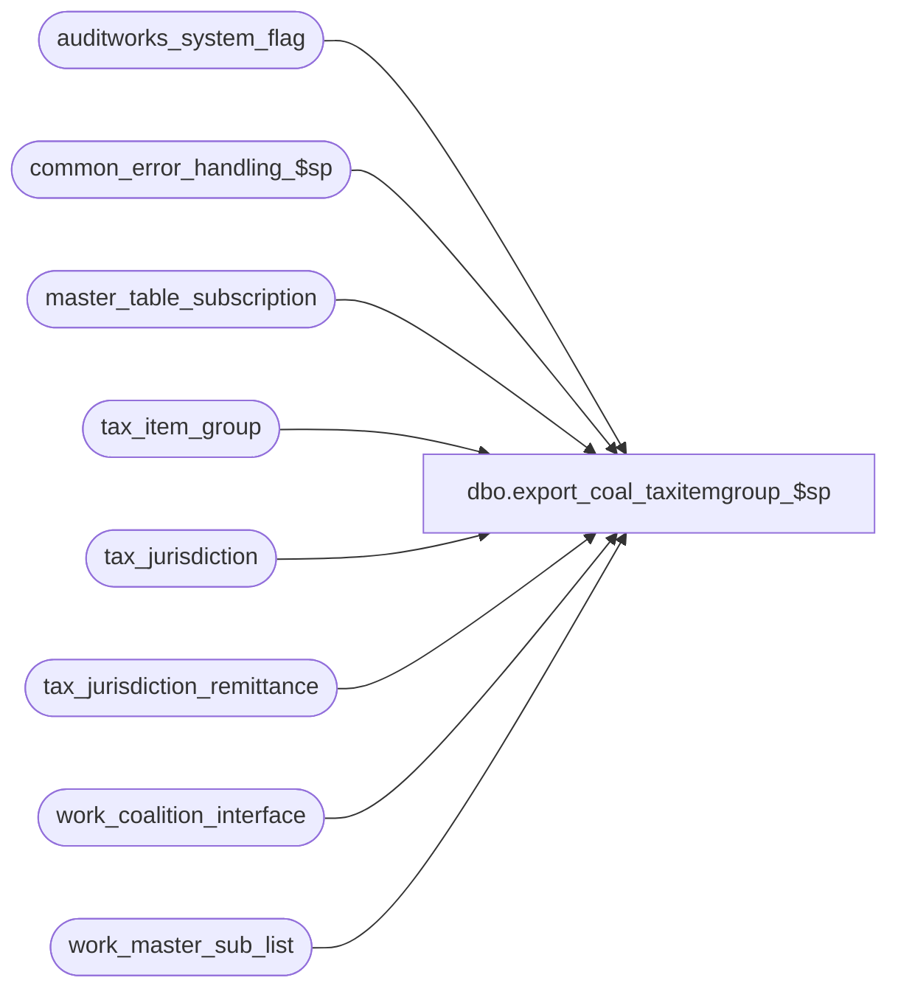

# dbo.export_coal_taxitemgroup_$sp

**Database:** auditworks_external  
**Server:** bedrockdb01  

## Architecture Diagram



## Table Dependencies

| Referenced Table |
|---|
| auditworks_system_flag |
| common_error_handling_$sp |
| master_table_subscription |
| tax_item_group |
| tax_jurisdiction |
| tax_jurisdiction_remittance |
| work_coalition_interface |
| work_master_sub_list |

## Stored Procedure Code

```sql
create proc dbo.export_coal_taxitemgroup_$sp (@interface_id	tinyint,
 @process_no 	smallint,
 @task_server	nvarchar(255),
 @runtime_datetime	datetime,
 @export_status	tinyint,
 @new_release	tinyint,
 @task_no	int OUTPUT,
 @errmsg 	nvarchar(255) OUTPUT
)
AS

DECLARE
@block_type			smallint,
@cursor_open			tinyint,
@data_header			nvarchar(255),
@errno				int,
@process_log_entry 		tinyint,
@record_sequence		int,
@table_name			nvarchar(30),
@table_key			nvarchar(255),
@task_module			nvarchar(255),
@task_module_rule		nvarchar(255),
@task_header			nvarchar(255),
@task_operation 		nvarchar(255),
@task_no_rule			int,
@tax_item_group_id		numeric(6,0),  --@tax_item_group_id should be numeric(10,0) not numeric(6,0) but ITEM dcn only accepts 6
@export_module_name		nvarchar(255),
@export_module_name_rule	nvarchar(255),
@message_id		        int,	
@object_name			nvarchar(255),
@operation_name			nvarchar(100),
@process_name		        nvarchar(100),
@time_stamp			datetime,
@action				tinyint,
@posting_datetime		datetime,
@rows				int,
@rule_rows			int,
@entry_id			numeric(12,0)

/* Proc Name: export_coal_taxitemgroup_$sp
   Desc: Coalition Tax Exports.
     Called by coalition_interface_main_$sp.

HISTORY:
Date     Name           Def# Desc
Mar17,14 Phu        1-4CDP8E Fix partial export that has result in the wrong order.
Feb07,14 Vicci        149810 Exclude inactive jurisdictions.
Feb26,13 Vicci        142088 To avoid deadlocks, lock a shared flag prior to work_master_sub_list deletions.
Feb22,13 Vicci        142020 Do not hold a lock on the work_master_sub_list table while reading it in a cursor, since this causes the 
                             audit_trail_header_$trI work_master_sub_list cleanup of prior configuration changes for the table/key upon 
                             additional change to the same table/key to die as victim of a deadlock 
                             and close the cursor immediately after use not after attempting to clean up work_master_sub_list (which also
                             likely contributed to the deadlock.
Jul16,12 Paul         136951 use nolock hint on master_table_subscription to reduce deadlocking.
Apr07,11 Vicci        126078 Take master_table_subscription active flag into account.
Nov09,09 Vicci        114073 Add double quotes around descriptions (since otherwise Coalition dies if they contain commas).
Jul11,06 Maryam        69746 delete work_coalition_interface with runtime_datetime = @runtime_datetime instead of @posting_datetime
Mar15,06 Vicci	       68918 If no rows for @task_no/@export_module_name created, 
			     remove @task_no/@export_module_name entries, 
	                     not @task_no_rule/@export_module_name_rule entries;
	                     Do not set @runtime_datetime = @posting_datetime when posting
	                     the audit-trail entries since otherwise the rule-assignments
	                     with early effective_from dates like 01/01/1970 end up being
	                     exported prior the tax-item-groups they are assigned to.
Jan19,06 Vicci	       66166 Do not use the cursor variable @table_name when deleting from
			     work_master_sub_list since this delete is outside the cursor
			     and when nothing has been fetched it is not set.
Mar11,04 Daphna        25374 increment counter inside cursor loop to prevent multiple insert error
Nov12,02 Winnie         5124 update export_status to 0 if no data in work_coalition_interface
Oct21,02 Winnie	     1-G3UJD Only check integrity when export_format = 1
Aug06,02 Winnie      1-DZ2SY To support export_status = 1 (for coalition update/delete)
May02,02 Winnie	     1-CFFPT To standardize the coalition for Tax export.

*/


SELECT @process_name = 'export_coal_taxitemgroup_$sp',
       @message_id = 201068,
       @task_module = 'Module=TaxItemGroup',
       @export_module_name = 'TaxItemGroup',
       @time_stamp = getdate(),
       @task_module_rule = 'Module=TaxRule' ,
       @export_module_name_rule = 'TaxRule',
   @rows = 0,
       @rule_rows = 0

        
IF @export_status = 2
BEGIN

    SELECT @block_type = 2, -- Task
           @task_no = @task_no + 1
    SELECT @task_header = '[Task.' + CONVERT(nvarchar, @task_no) + ']',
           @task_operation = 'Operation=DeleteAll',
           @record_sequence = 0

            -- Build the deletion task
    INSERT work_coalition_interface
           (runtime_datetime, record_content, block_type, 
            task_no, record_sequence_no, export_module_name)
    VALUES (@runtime_datetime, @task_header, @block_type, 
            @task_no, @record_sequence, @export_module_name)

    SELECT @errno = @@error
    IF @errno <> 0
      BEGIN
        SELECT @errmsg = 'Failed to insert into work_coalition_interface with task header for TaxItemGroup DeleteAll',
               @object_name = 'work_coalition_interface',
               @operation_name = 'INSERT'      
        GOTO error
      END             
                       
    SELECT @record_sequence = @record_sequence + 1
  
    INSERT work_coalition_interface
           (runtime_datetime, record_content, block_type, 
   task_no, record_sequence_no, export_module_name)
    VALUES (@runtime_datetime, @task_server, @block_type, 
            @task_no, @record_sequence, @export_module_name)

    SELECT @errno = @@error
    IF @errno <> 0
      BEGIN
        SELECT @errmsg = 'Failed to insert into work_coalition_interface with task_server for TaxItemGroup DeleteAll',
               @object_name = 'work_coalition_interface',
               @operation_name = 'INSERT'      
    GOTO error
      END             
                       
    SELECT @record_sequence = @record_sequence + 1

    INSERT work_coalition_interface
           (runtime_datetime, record_content, block_type, 
            task_no, record_sequence_no, export_module_name)
    VALUES (@runtime_datetime, @task_module, @block_type, 
            @task_no, @record_sequence, @export_module_name)

    SELECT @errno = @@error
    IF @errno <> 0
      BEGIN
        SELECT @errmsg = 'Failed to insert into work_coalition_interface with task_module for TaxItemGroup DeleteAll',
               @object_name = 'work_coalition_interface',
               @operation_name = 'INSERT'      
        GOTO error
      END             
                       
    SELECT @record_sequence = @record_sequence + 1
  
    INSERT work_coalition_interface
           (runtime_datetime, record_content, block_type, 
            task_no, record_sequence_no, export_module_name)
    VALUES (@runtime_datetime, @task_operation, @block_type, 
            @task_no, @record_sequence, @export_module_name)

    SELECT @errno = @@error
    IF @errno <> 0
      BEGIN
        SELECT @errmsg = 'Failed to insert into work_coalition_interface with task_operation for TaxItemGroup DeleteAll',
               @object_name = 'work_coalition_interface',
               @operation_name = 'INSERT'      
        GOTO error
      END             

    SELECT @data_header = '[Data.' + CONVERT(nvarchar, @task_no) + ']',
           @record_sequence = 0,
           @block_type = 3 -- Data

    INSERT work_coalition_interface
           (runtime_datetime, record_content, block_type, 
            task_no, record_sequence_no, export_module_name)
    VALUES (@runtime_datetime, @data_header, @block_type, 
            @task_no, @record_sequence, @export_module_name)                               

    SELECT @errno = @@error
    IF @errno <> 0
      BEGIN
        SELECT @errmsg = 'Failed to insert into work_coalition_interface with data_header for TaxItemGroup DeleteAll',
               @object_name = 'work_coalition_interface',
               @operation_name = 'INSERT'      
        GOTO error
      END             

    SELECT @record_sequence = @record_sequence + 1

    INSERT work_coalition_interface
           (runtime_datetime, record_content, block_type, 
 task_no, record_sequence_no, export_module_name)
    VALUES (@runtime_datetime, 'AllTaxItemGroups', @block_type, 
            @task_no, @record_sequence, @export_module_name)                               
             
    SELECT @errno = @@error
    IF @errno <> 0
      BEGIN
        SELECT @errmsg = 'Failed to insert into work_coalition_interface for TaxItemGroup DeleteAll',
               @object_name = 'work_coalition_interface',
               @operation_name = 'INSERT'      
        GOTO error
      END

    SELECT @block_type = 2, 
           @task_no = @task_no + 1
    SELECT @task_header = '[Task.' + CONVERT(nvarchar, @task_no) + ']',
           @task_operation = 'Operation=AddUpdate',
           @record_sequence = 0

    -- Build the reinsertion task
    INSERT work_coalition_interface
      (runtime_datetime, record_content, block_type,
            task_no, record_sequence_no, export_module_name)
    VALUES (@runtime_datetime, @task_header, @block_type,
 @task_no, @record_sequence, @export_module_name)                               

    SELECT @errno = @@error
  IF @errno <> 0
      BEGIN
        SELECT @errmsg = 'Failed to insert into work_coalition_interface with task_header for TaxItemGroup AddUpdate',
               @object_name = 'work_coalition_interface',
               @operation_name = 'INSERT'      
        GOTO error
      END             
                       
    SELECT @record_sequence = @record_sequence + 1      

    INSERT work_coalition_interface
           (runtime_datetime, record_content, block_type, 
            task_no, record_sequence_no, export_module_name)
    VALUES (@runtime_datetime, @task_server, @block_type, 
            @task_no, @record_sequence, @export_module_name)                      

    SELECT @errno = @@error
    IF @errno <> 0
      BEGIN
        SELECT @errmsg = 'Failed to insert into work_coalition_interface with task_server for TaxItemGroup AddUpdate',
   @object_name = 'work_coalition_interface',
               @operation_name = 'INSERT'      
   GOTO error
      END             
                       
    SELECT @record_sequence = @record_sequence + 1
 
    INSERT work_coalition_interface
           (runtime_datetime, record_content, block_type, 
            task_no, record_sequence_no, export_module_name)
    VALUES (@runtime_datetime, @task_module, @block_type, 
            @task_no, @record_sequence, @export_module_name)                               

    SELECT @errno = @@error
    IF @errno <> 0
      BEGIN
        SELECT @errmsg = 'Failed to insert into work_coalition_interface with task_module for TaxItemGroup AddUpdate',
               @object_name = 'work_coalition_interface',
               @operation_name = 'INSERT'      
        GOTO error
      END             
                       
    SELECT @record_sequence = @record_sequence + 1

    INSERT work_coalition_interface
           (runtime_datetime, record_content, block_type, 
            task_no, record_sequence_no, export_module_name)
    VALUES (@runtime_datetime, @task_operation, @block_type, 
            @task_no, @record_sequence, @export_module_name)                               

    SELECT @errno = @@error
    IF @errno <> 0
      BEGIN
        SELECT @errmsg = 'Failed to insert into work_coalition_interface with task_operation for TaxIrtemGroup AddUpdate',
               @object_name = 'work_coalition_interface',
               @operation_name = 'INSERT'      
        GOTO error
      END             
  
    -- Build the reinsertion data
    SELECT @data_header = '[Data.' + CONVERT(nvarchar, @task_no) + ']',
           @record_sequence = 0,
           @block_type = 3 -- Data

    INSERT work_coalition_interface
           (runtime_datetime, record_content, block_type, 
            task_no, record_sequence_no, export_module_name)
    VALUES (@runtime_datetime, @data_header, @block_type, 
  @task_no, @record_sequence, @export_module_name)                         

    SELECT @errno = @@error
    IF @errno <> 0
      BEGIN
     SELECT @errmsg = 'Failed to insert into work_coalition_interface with data_header for TaxItemGroup AddUpdate',
               @object_name = 'work_coalition_interface',
               @operation_name = 'INSERT'      
        GOTO error
      END             

    SELECT @record_sequence = @record_sequence + 1

    INSERT work_coalition_interface
           (runtime_datetime,
            record_content,
            block_type,
            task_no,
            record_sequence_no,
            export_module_name)
    SELECT  @runtime_datetime,
            @export_module_name + ',' + CONVERT(nvarchar, tax_item_group_id) 
            + ',' + tax_item_group_code + ',' + nchar(34) + SUBSTRING(tax_item_group_description, 1, 30)+ nchar(34) +
            ',' + nchar(34) + tax_item_group_description + nchar(34)  + ',', 
            @block_type,
            @task_no,
            @record_sequence,
            @export_module_name                               
      FROM  tax_item_group

    SELECT @errno = @@error,
           @rows = @@rowcount
    IF @errno <> 0
      BEGIN
        SELECT @errmsg = 'Failed to insert into work_coalition_interface from tax_item_group',
               @object_name = 'work_coalition_interface',
               @operation_name = 'INSERT'      
        GOTO error
      END                    

    IF @rows = 0 
      BEGIN
        DELETE FROM work_coalition_interface
         WHERE task_no = @task_no
           AND runtime_datetime = @runtime_datetime      
           AND export_module_name = @export_module_name  

        SELECT @errno = @@error
        IF @errno <> 0
        BEGIN
            SELECT @errmsg = 'Failed to delete from  work_coalition_interface if no details for TaxItemGroup AddUpdate',
                   @object_name = 'work_coalition_interface',
            @operation_name = 'DELETE'      
            GOTO error
          END
      END -- IF @rows = 0           
  END
ELSE
  BEGIN
    DECLARE taxitemgroup_crsr CURSOR FAST_FORWARD
        FOR
     SELECT table_name, 
            table_key,
            action,
            posting_datetime,
            entry_id
       FROM work_master_sub_list
      WHERE interface_id = @interface_id
        AND table_name = 'tax_item_group'
        AND posting_datetime <= @time_stamp
   ORDER BY entry_id ASC

    SELECT @errno = @@error
      IF @errno <> 0
        BEGIN
          SELECT @errmsg = 'Unable to declare cursor taxitemgroup_crsr',
                 @object_name = 'taxitemgroup_crsr',
                 @operation_name = 'DECLARE'      
          GOTO error
        END

    OPEN taxitemgroup_crsr
    SELECT @errno = @@error
      IF @errno <> 0
        BEGIN
          SELECT @errmsg = 'Unable to open cursor taxitemgroup_crsr',
                 @object_name = 'taxitemgroup_crsr',
                 @operation_name = 'OPEN'      
          GOTO error
        END

    SELECT  @cursor_open = 1

    WHILE 1 = 1
    BEGIN
      FETCH taxitemgroup_crsr
       INTO @table_name,
            @table_key,
            @action,
            @posting_datetime,
            @entry_id

      IF @@fetch_status <> 0
        BREAK

      SELECT @tax_item_group_id = CONVERT(NUMERIC, @table_key),
             @rows = 0,
             @rule_rows = 0,
             @task_no_rule = @task_no + 1,  
             @task_no = @task_no + 2  

      IF @action = 3
      BEGIN       

        SELECT @block_type = 2, -- Task
               @task_header = '[Task.' + CONVERT(nvarchar, @task_no) + ']',
               @task_operation = 'Operation=Delete',
               @record_sequence = 0

        -- Build the deletion task
        INSERT work_coalition_interface
               (runtime_datetime, record_content, block_type, 
task_no, record_sequence_no, export_module_name)
      VALUES (@runtime_datetime, @task_header, @block_type, 
                @task_no, @record_sequence, @export_module_name)

        SELECT @errno = @@error
        IF @errno <> 0
     BEGIN
            SELECT @errmsg = 'Failed to insert into work_coalition_interface with task header for TaxItemGroup Delete',
                   @object_name = 'work_coalition_interface',
                   @operation_name = 'INSERT'      
            GOTO error
          END             
                       
        SELECT @record_sequence = @record_sequence + 1
  
        INSERT work_coalition_interface
               (runtime_datetime, record_content, block_type, 
                task_no, record_sequence_no, export_module_name)
        VALUES (@runtime_datetime, @task_server, @block_type, 
                @task_no, @record_sequence, @export_module_name)

        SELECT @errno = @@error
        IF @errno <> 0
          BEGIN
           SELECT @errmsg = 'Failed to insert into work_coalition_interface with task_server for TaxItemGroup Delete',
                   @object_name = 'work_coalition_interface',
                   @operation_name = 'INSERT'      
            GOTO error
          END  
                       
        SELECT @record_sequence = @record_sequence + 1

        INSERT work_coalition_interface
               (runtime_datetime, record_content, block_type, 
                task_no, record_sequence_no, export_module_name)
        VALUES (@runtime_datetime, @task_module, @block_type, 
                @task_no, @record_sequence, @export_module_name)

        SELECT @errno = @@error
        IF @errno <> 0
          BEGIN
            SELECT @errmsg = 'Failed to insert into work_coalition_interface with task_module for TaxItemGroup Delete',
                   @object_name = 'work_coalition_interface',
                   @operation_name = 'INSERT'      
            GOTO error
          END             
        
        SELECT @record_sequence = @record_sequence + 1
   
        INSERT work_coalition_interface
               (runtime_datetime, record_content, block_type, 
                task_no, record_sequence_no, export_module_name)
        VALUES (@runtime_datetime, @task_operation, @block_type, 
                @task_no, @record_sequence, @export_module_name)

        SELECT @errno = @@error
        IF @errno <> 0
          BEGIN
            SELECT @errmsg = 'Failed to insert into work_coalition_interface with task_operation for TaxItemGroup Delete',
                   @object_name = 'work_coalition_interface',
                   @operation_name = 'INSERT'      
            GOTO error
          END             

        SELECT @data_header = '[Data.' + CONVERT(nvarchar, @task_no) + ']',
               @record_sequence = 0,
               @block_type = 3 -- Data

        INSERT work_coalition_interface
               (runtime_datetime, record_content, block_type, 
                task_no, record_sequence_no, export_module_name)
        VALUES (@runtime_datetime, @data_header, @block_type, 
                @task_no, @record_sequence, @export_module_name)                               

        SELECT @errno = @@error
        IF @errno <> 0
          BEGIN
            SELECT @errmsg = 'Failed to insert into work_coalition_interface with data_header for TaxItemGroup Delete',
                   @object_name = 'work_coalition_interface',
                   @operation_name = 'INSERT'      
            GOTO error
          END             

        SELECT @record_sequence = @record_sequence + 1

        INSERT work_coalition_interface
               (runtime_datetime, record_content, block_type, 
                task_no, record_sequence_no, export_module_name)
        VALUES (@runtime_datetime, @export_module_name + ',' + @table_key, @block_type,
                @task_no, @record_sequence, @export_module_name)

        SELECT @errno = @@error

     IF @errno <> 0
          BEGIN
            SELECT @errmsg = 'Failed to insert into work_coalition_interface from tax_item_group for Delete',
                   @object_name = 'work_coalition_interface',
                   @operation_name = 'INSERT'      
            GOTO error
          END                    
      END
      ELSE
      BEGIN
        SELECT @block_type = 2, 
               @task_header = '[Task.' + CONVERT(nvarchar, @task_no) + ']',
               @task_operation = 'Operation=AddUpdate',
               @record_sequence = 0

        -- Build the reinsertion task
        INSERT work_coalition_interface
               (runtime_datetime, record_content, block_type,
                task_no, record_sequence_no, export_module_name)
       VALUES (@runtime_datetime, @task_header, @block_type,
                @task_no, @record_sequence, @export_module_name)                               

        SELECT @errno = @@error
        IF @errno <> 0
          BEGIN
            SELECT @errmsg = 'Failed to insert into work_coalition_interface with task_header for TaxItemGroup AddUpdate (2)',
                   @object_name = 'work_coalition_interface',
  @operation_name = 'INSERT'      
            GOTO error
          END             
                       
        SELECT @record_sequence = @record_sequence + 1      

        INSERT work_coalition_interface
               (runtime_datetime, record_content, block_type, 
                task_no, record_sequence_no, export_module_name)
        VALUES (@runtime_datetime, @task_server, @block_type, 
                @task_no, @record_sequence, @export_module_name)   

        SELECT @errno = @@error
        IF @errno <> 0
          BEGIN
            SELECT @errmsg = 'Failed to insert into work_coalition_interface with task_server for TaxItemGroup AddUpdate (2)',
                @object_name = 'work_coalition_interface',
                   @operation_name = 'INSERT'      
            GOTO error
          END             
                        
        SELECT @record_sequence = @record_sequence + 1
 
        INSERT work_coalition_interface
               (runtime_datetime, record_content, block_type, 
                task_no, record_sequence_no, export_module_name)
        VALUES (@runtime_datetime, @task_module, @block_type, 
                @task_no, @record_sequence, @export_module_name)                               

        SELECT @errno = @@error
        IF @errno <> 0
          BEGIN
            SELECT @errmsg = 'Failed to insert into work_coalition_interface with task_module for TaxItemGroup AddUpdate (2)',
                   @object_name = 'work_coalition_interface',
                   @operation_name = 'INSERT'      
            GOTO error
          END             
                       
        SELECT @record_sequence = @record_sequence + 1

        INSERT work_coalition_interface
               (runtime_datetime, record_content, block_type, 
                task_no, record_sequence_no, export_module_name)
        VALUES (@runtime_datetime, @task_operation, @block_type, 
                @task_no, @record_sequence, @export_module_name)                               

        SELECT @errno = @@error
        IF @errno <> 0
          BEGIN
            SELECT @errmsg = 'Failed to insert into work_coalition_interface with task_operation for TaxIrtemGroup AddUpdate (2)',
                   @object_name = 'work_coalition_interface',
                   @operation_name = 'INSERT'      
            GOTO error
          END             
  
        -- Build the reinsertion data
        SELECT @data_header = '[Data.' + CONVERT(nvarchar, @task_no) + ']',
               @record_sequence = 0,
               @block_type = 3 -- Data

        INSERT work_coalition_interface
               (runtime_datetime, record_content, block_type, 
 task_no, record_sequence_no, export_module_name)
        VALUES (@runtime_datetime, @data_header, @block_type, 
                @task_no, @record_sequence, @export_module_name)                               

        SELECT @errno = @@error
        IF @errno <> 0
          BEGIN
            SELECT @errmsg = 'Failed to insert into work_coalition_interface with data_header for TaxItemGroup AddUpdate (2)',
                   @object_name = 'work_coalition_interface',
                   @operation_name = 'INSERT'      
            GOTO error
          END             

        SELECT @record_sequence = @record_sequence + 1

        INSERT work_coalition_interface
               (runtime_datetime,
                record_content,
                block_type,
                task_no,
  record_sequence_no,
                export_module_name)
        SELECT  @runtime_datetime,
             @export_module_name + ',' + CONVERT(nvarchar, tax_item_group_id) 
                + ',' + tax_item_group_code + ',' + nchar(34) + SUBSTRING(tax_item_group_description, 1, 30) + nchar(34) +
                ',' + nchar(34) + tax_item_group_description + nchar(34) + ',', 
                @block_type,
                @task_no,
                @record_sequence,
                @export_module_name                               
          FROM  tax_item_group 
         WHERE  tax_item_group_id = @tax_item_group_id

        SELECT @errno = @@error,
               @rows = @@rowcount
        IF @errno <> 0
          BEGIN
      SELECT @errmsg = 'Failed to insert into work_coalition_interface from tax_item_group (2)',
                   @object_name = 'work_coalition_interface',
                   @operation_name = 'INSERT'      
            GOTO error
          END                    

        IF @rows = 0 
          BEGIN
            DELETE FROM work_coalition_interface
             WHERE task_no = @task_no
               AND runtime_datetime = @runtime_datetime      
               AND export_module_name = @export_module_name  

            SELECT @errno = @@error
            IF @errno <> 0
              BEGIN
                SELECT @errmsg = 'Failed to delete from  work_coalition_interface if no details for TaxItemGroup AddUpdate',
                       @object_name = 'work_coalition_interface',
                       @operation_name = 'DELETE'      
                GOTO error
              END
          END -- IF @rows = 0           

        SELECT @block_type = 2,
               @task_header = '[Task.' + CONVERT(nvarchar, @task_no_rule) + ']',
               @task_operation = 'Operation=AddUpdate',
               @record_sequence = 0

        INSERT work_coalition_interface
               (runtime_datetime, record_content, block_type,
               task_no, record_sequence_no, export_module_name)
        VALUES (@runtime_datetime, @task_header, @block_type,
               @task_no_rule, @record_sequence, @export_module_name_rule)

        SELECT @errno = @@error
        IF @errno <> 0 AND @errno <> 2601
          BEGIN
            SELECT @errmsg = 'Failed to insert into work_coalition_interface with task_header for TaxRule AddUpdate (2)',
                   @object_name = 'work_coalition_interface',
                   @operation_name = 'INSERT'      
            GOTO error
          END             
                       
        SELECT @record_sequence = @record_sequence + 1      

        INSERT work_coalition_interface
               (runtime_datetime, record_content, block_type,
                task_no, record_sequence_no, export_module_name)
        VALUES (@runtime_datetime, @task_server, @block_type,
               @task_no_rule, @record_sequence, @export_module_name_rule)

        SELECT @errno = @@error
        IF @errno <> 0 AND @errno <> 2601
          BEGIN
            SELECT @errmsg = 'Failed to insert into work_coalition_interface with task_server for TaxRule AddUpdate (2)',
                   @object_name = 'work_coalition_interface',
                   @operation_name = 'INSERT' 
            GOTO error
          END             
                       
        SELECT @record_sequence = @record_sequence + 1

        INSERT work_coalition_interface
              (runtime_datetime, record_content, block_type,
               task_no, record_sequence_no, export_module_name)
        VALUES (@runtime_datetime, @task_module_rule, @block_type,
               @task_no_rule, @record_sequence, @export_module_name_rule)

        SELECT @errno = @@error
        IF @errno <> 0 AND @errno <> 2601
          BEGIN
            SELECT @errmsg = 'Failed to insert into work_coalition_interface with task_module for TaxRule AddUpdate (2)',
              @object_name = 'work_coalition_interface',
                   @operation_name = 'INSERT'      
              GOTO error
          END             
                 
        SELECT @record_sequence = @record_sequence + 1

        INSERT work_coalition_interface
              (runtime_datetime, record_content, block_type,
               task_no, record_sequence_no, export_module_name)
        VALUES (@runtime_datetime, @task_operation, @block_type,
               @task_no_rule, @record_sequence, @export_module_name_rule)
  
        SELECT @errno = @@error
        IF @errno <> 0 AND @errno <> 2601
          BEGIN
            SELECT @errmsg = 'Failed to insert into work_coalition_interface with task_operation for TaxRule AddUpdate (2)',
                   @object_name = 'work_coalition_interface',
                   @operation_name = 'INSERT'      
              GOTO error
          END             
  
        -- Build the reinsertion data
        SELECT @data_header = '[Data.' + CONVERT(nvarchar, @task_no_rule) + ']',
               @record_sequence = 0,
               @block_type = 3 -- Data

        INSERT work_coalition_interface
              (runtime_datetime, record_content, block_type,
               task_no, record_sequence_no, export_module_name)
        VALUES(@runtime_datetime, @data_header, @block_type,
               @task_no_rule, @record_sequence, @export_module_name_rule)

        SELECT @errno = @@error
        IF @errno <> 0 AND @errno <> 2601
          BEGIN
            SELECT @errmsg = 'Failed to insert into work_coalition_interface with data_header for TaxRule AddUpdate (2)',
                   @object_name = 'work_coalition_interface',
                   @operation_name = 'INSERT'      
            GOTO error
          END             

        SELECT @record_sequence = @record_sequence + 1

        IF @new_release = 0
          BEGIN

            INSERT work_coalition_interface
                   (runtime_datetime, 
                    record_content, 
                    block_type, 
                    task_no, 
                    record_sequence_no, 
                    export_module_name)
            SELECT DISTINCT @runtime_datetime, 
                   @export_module_name_rule + ',' + '0' + CONVERT(nvarchar,t.tax_item_group_id * 10000 
                   + j.tax_jurisdiction_id * 10 + r.tax_level)+',R,' + 
                   'Non Taxable' + ',' + 'Non Taxable' + ',' + 
                   CONVERT(nvarchar,datepart(yy, @runtime_datetime)) + '-' + 
                   RIGHT('00' + CONVERT(nvarchar,datepart(mm, @runtime_datetime)), 2) + '-' + 
                   RIGHT('00' + CONVERT(nvarchar,datepart(dd, @runtime_datetime)), 2) + 
                   ' 00:00:00,,ACTV,,HALF,' + 
                   '0.0000'+ ',,' , 
                   @block_type, 
                   @task_no_rule, 
                   @record_sequence, 
                   @export_module_name_rule 
              FROM tax_item_group t, tax_jurisdiction_remittance r, tax_jurisdiction j
             WHERE t.tax_item_group_id = @tax_item_group_id
               AND j.tax_jurisdiction = r.tax_jurisdiction
               AND j.active_flag = 1
            SELECT @errno = @@error,
                   @rule_rows = @@rowcount
            IF @errno <> 0 AND @errno <> 2601
              BEGIN
                SELECT @errmsg = 'Failed to insert into work_coalition_interface from for non taxable rate_code (1)',
                       @object_name = 'work_coalition_interface',
                       @operation_name = 'INSERT'      
                 GOTO error
              END                   
          END

        IF @rule_rows = 0 
          BEGIN
            DELETE FROM work_coalition_interface
             WHERE task_no = @task_no_rule
               AND runtime_datetime = @runtime_datetime      
               AND export_module_name = @export_module_name_rule  

            SELECT @errno = @@error
            IF @errno <> 0
              BEGIN
                SELECT @errmsg = 'Failed to delete from  work_coalition_interface if no details for TaxItemGroup AddUpdate',
                       @object_name = 'work_coalition_interface',
                       @operation_name = 'DELETE'      
                GOTO error
              END
          END -- IF @rule_rows = 0           

      END -- IF @action != 3       
    END  -- While 1 = 1

    CLOSE taxitemgroup_crsr
    SELECT @errno = @@error
    IF @errno <> 0
    BEGIN
      SELECT @errmsg = 'Unable to close cursor taxitemgroup_crsr',
             @object_name = 'taxitemgroup_crsr',
             @operation_name = 'close'      
      GOTO error
    END

    DEALLOCATE taxitemgroup_crsr

    SELECT @cursor_open = 0

BEGIN TRANSACTION  --142088
  /* Prevent possible deadlocks when audit trail published change retraction deletion and this export 
     simultaneously attempt to clean up the same work_master_sublist rows, by updating a shared system flag. */ 
  UPDATE auditworks_system_flag
     SET flag_datetime_value = getdate()
   WHERE flag_name = 'work_master_sublist_access'
  SELECT @errno = @@error
  IF @errno != 0 
  BEGIN
    SELECT @errmsg = 'Set flag to force concurrent processes to run sequentially',
           @object_name = 'auditworks_system_flag',
           @operation_name = 'UPDATE'
    GOTO error
  END

   DELETE work_master_sub_list
   WHERE interface_id = @interface_id
     AND table_name IN (SELECT table_name
                          FROM master_table_subscription WITH (NOLOCK)
                         WHERE interface_id = 16
                           AND export_module_name = @export_module_name
                           AND active_flag > 0)                         
     AND posting_datetime <= @time_stamp 

    SELECT @errno = @@error
    IF @errno <> 0
      BEGIN
        SELECT @errmsg = 'Failed to delete from work_master_sub_list for TaxItemGroup',
               @object_name = 'work_master_sub_list',
               @operation_name = 'DELETE'                 
        GOTO error
      END                    
COMMIT

  END -- IF @export_status != 2

IF NOT EXISTS (SELECT export_module_name
                 FROM work_coalition_interface
                WHERE export_module_name = @export_module_name)
  BEGIN               
    UPDATE master_table_subscription
       SET export_status = 0
     WHERE export_module_name = @export_module_name 
       AND interface_id = @interface_id
       AND active_flag > 0
    SELECT @errno = @@error
    IF @errno <> 0
      BEGIN
        SELECT @errmsg = 'Unable to update master_table_subscription',
               @object_name = 'master_table_subscription',
               @operation_name = 'UPDATE'      
        GOTO error
      END
    END

RETURN 

error:   /* Common error handler */

         IF @cursor_open = 1
	  BEGIN
	   CLOSE taxitemgroup_crsr
	   DEALLOCATE taxitemgroup_crsr
	  END

	  EXEC common_error_handling_$sp @process_no, @errno, @errmsg, 0, @message_id, 
  	    @process_name, @object_name, @operation_name, 1, 1, 
  	    @process_log_entry

	RETURN
```

