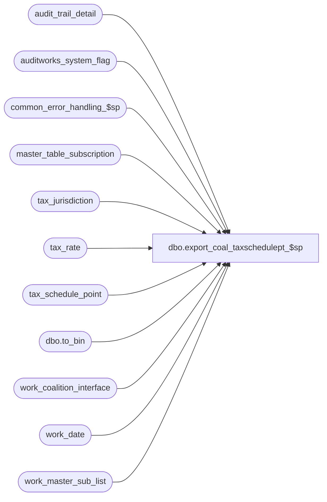

# dbo.export_coal_taxschedulept_$sp

**Database:** auditworks_external  
**Server:** bedrockdb01  

## Architecture Diagram



## Table Dependencies

| Referenced Table |
|---|
| audit_trail_detail |
| auditworks_system_flag |
| common_error_handling_$sp |
| master_table_subscription |
| tax_jurisdiction |
| tax_rate |
| tax_schedule_point |
| dbo.to_bin |
| work_coalition_interface |
| work_date |
| work_master_sub_list |

## Stored Procedure Code

```sql
create proc dbo.export_coal_taxschedulept_$sp (@interface_id	tinyint,
 @process_no 	smallint,
 @task_server	nvarchar(255),
 @runtime_datetime	datetime,
 @export_status	tinyint,
 @task_no	int OUTPUT,
 @errmsg 	nvarchar(255) OUTPUT,
 @tax_dcn_exp_hist int
)
AS

DECLARE
@block_type			smallint,
@cursor_open			int,
@data_header			nvarchar(255),
@errno				int,
@min_date			smalldatetime,
@record_sequence		int,
@table_name			nvarchar(30),
@table_key			nvarchar(255),
@task_module			nvarchar(255),
@task_header			nvarchar(255),
@task_operation 		nvarchar(255),
@export_module_name		nvarchar(255),
@length				smallint,
@message_id		        int,	
@object_name			nvarchar(255),
@operation_name			nvarchar(100),
@process_name		        nvarchar(100),
@action				tinyint,
@posting_datetime		datetime,
@rows				int,
@tax_jurisdiction		nchar(5),
@tax_level			tinyint,
@tax_rate_code			tinyint,
@effective_from_date		datetime,
@start_pos			tinyint,
@end_pos			tinyint,
@tax_rate_id 			numeric(10,0),
@entry_id			numeric(12,0),
@delete_task_no			int,
@tax_schedule_id		binary(16),
@point_no			smallint,
@today				datetime 

/* Proc Name: export_coal_taxschedulept_$sp
   Desc: Coalition Tax Exports.
     Called by coalition_interface_main_$sp.

HISTORY:
Date     Name           Def# Desc
Mar17,14 Phu        1-4CDP8E Fix partial export that has result in the wrong order.
Feb14,14 Vicci        149810 To avoid schedule point range being exported with 4 decimals as a result of MSSQL changing datatypes to handle the addition of the penny,
                             use CONVERT(money, t.threshold_amount+.01).
Feb07,14 Vicci        149810 Exclude inactive jurisdictions.
Feb26,13 Vicci        142088 To avoid deadlocks, lock a shared flag prior to work_master_sub_list deletions.
Feb22,13 Vicci        142020 Do not hold a lock on the work_master_sub_list table while reading it in a cursor, since this causes the 
                             audit_trail_header_$trI work_master_sub_list cleanup of prior configuration changes for the table/key upon 
                             additional change to the same table/key to die as victim of a deadlock.
Jan31,13 Vicci      1-4AB89T Allow tax schedule point tax amount to have more than 2 decimal places since for some schedules the amount associated
                             with the highest point is what is used as the multiplier of the taxable amount divided by the highest point.
Apr07,11 Vicci        126078 Take master_table_subscription active flag into account.
Feb20,09 Vicci         86072 Take into account parameter for whether or not to export expired information.
Apr18,08 Vicci      1-38MDAZ Include export from tax_schedule_point table.
Mar11,04 Daphna        25374 increment counter inside cursor loop to prevent multiple insert error
Jul17,03 Vicci   11567/11569 In the case of the full download only, include expired rates in the export
			     in order to avoid error whereby tax-rule-assign has earlier 
			     runtime than tax-rule
May26,03 Vicci	1-LMFGH/9130 Set HighThreshold to 99999999.99 when none applies (coalition requirement)
Apr10,03 Vicci          7544 send combined rate not below_threshhold rate when send above threshhold rule
Nov12,02 Winnie         5124 update export_status to 0 if no data in work_coalition_interface
Aug06,02 Winnie      1-DZ2SY To support export_status = 1 (for coalition update/delete)
Jun06,02 Winnie      1-DFWDF Only insert to work_coalition_interface when min_date is not null.
May02,02 Winnie	     1-CFFPT To standardize the coalition for Tax export.

*/


SELECT @process_name = 'export_coal_taxschedulept_$sp',
       @message_id = 201068,
       @task_module = 'Module=TaxSchedulePt',
       @export_module_name = 'TaxSchedulePt',
       @min_date = NULL,  --
       @today = convert(datetime, convert(nvarchar, getdate(), 101))
       
IF @export_status = 2 --full table export requested
  BEGIN

    SELECT @block_type = 2, -- Task
           @task_no = @task_no + 1
    SELECT @task_header = '[Task.' + CONVERT(nvarchar, @task_no) + ']',
           @task_operation = 'Operation=DeleteAll',
           @record_sequence = 0

    SELECT @min_date = MIN(CASE WHEN @tax_dcn_exp_hist = 0 AND t.effective_from_date <= @today THEN '01/01/1970' ELSE t.effective_from_date END)
      FROM tax_rate t
           INNER JOIN tax_jurisdiction j
              ON t.tax_jurisdiction = j.tax_jurisdiction
             AND j.active_flag = 1
     WHERE ISNULL(t.item_tax_strip_flag, 0) = 0 
       AND (t.threshold_amount > 0
            OR t.tax_schedule_id IS NOT NULL)
       AND (t.effective_until_date IS NULL 
            OR @tax_dcn_exp_hist = -1 
            OR t.effective_until_date >= dateadd(dd, -1 * @tax_dcn_exp_hist, @today))
    SELECT @errno = @@error
    IF @errno <> 0
      BEGIN
        SELECT @errmsg = 'Failed to select min_date for TaxSchedulePt DeleteAll',
               @object_name = 'tax_rate',
      @operation_name = 'SELECT'      
        GOTO error
      END             

    IF @min_date IS NOT NULL   
      BEGIN
            -- Build the deletion task
        INSERT work_coalition_interface
               (runtime_datetime, record_content, block_type, 
              task_no, record_sequence_no, export_module_name)
        VALUES (@min_date, @task_header, @block_type, 
               @task_no, @record_sequence, @export_module_name)

        SELECT @errno = @@error
        IF @errno <> 0
          BEGIN
            SELECT @errmsg = 'Failed to insert into work_coalition_interface with task header for TaxSchedulePt DeleteAll',
                   @object_name = 'work_coalition_interface',
                   @operation_name = 'INSERT'      
           GOTO error
          END             
     
        SELECT @record_sequence = @record_sequence + 1
   
        INSERT work_coalition_interface
               (runtime_datetime, record_content, block_type, 
                task_no, record_sequence_no, export_module_name)
        VALUES (@min_date, @task_server, @block_type,
                @task_no, @record_sequence, @export_module_name)

        SELECT @errno = @@error
        IF @errno <> 0
          BEGIN
            SELECT @errmsg = 'Failed to insert into work_coalition_interface with task_server for TaxSchedulePt DeleteAll',
                   @object_name = 'work_coalition_interface',
                   @operation_name = 'INSERT'      
            GOTO error
          END             
                       
        SELECT @record_sequence = @record_sequence + 1

        INSERT work_coalition_interface
               (runtime_datetime, record_content, block_type,
                task_no, record_sequence_no, export_module_name)
        VALUES (@min_date, @task_module, @block_type,
                @task_no, @record_sequence, @export_module_name)

        SELECT @errno = @@error
        IF @errno <> 0
          BEGIN
            SELECT @errmsg = 'Failed to insert into work_coalition_interface with task_module for TaxSchedulePt DeleteAll',
                   @object_name = 'work_coalition_interface',
                   @operation_name = 'INSERT'      
             GOTO error
          END             
                       
        SELECT @record_sequence = @record_sequence + 1
    
        INSERT work_coalition_interface
               (runtime_datetime, record_content, block_type,
                task_no, record_sequence_no, export_module_name)
        VALUES (@min_date, @task_operation, @block_type,
               @task_no, @record_sequence, @export_module_name)

        SELECT @errno = @@error
        IF @errno <> 0
          BEGIN
            SELECT @errmsg = 'Failed to insert into work_coalition_interface with task_operation for TaxSchedulePt DeleteAll',
                   @object_name = 'work_coalition_interface',
                   @operation_name = 'INSERT'      
            GOTO error
        END             

       SELECT @data_header = '[Data.' + CONVERT(nvarchar, @task_no) + ']',
               @record_sequence = 0,
               @block_type = 3 -- Data

        INSERT work_coalition_interface
               (runtime_datetime, record_content, block_type,
                task_no, record_sequence_no, export_module_name)
        VALUES (@min_date, @data_header, @block_type,
                @task_no, @record_sequence, @export_module_name)

        SELECT @errno = @@error
        IF @errno <> 0
          BEGIN
            SELECT @errmsg = 'Failed to insert into work_coalition_interface with data_header for TaxSchedulePt DeleteAll',
                   @object_name = 'work_coalition_interface',
                   @operation_name = 'INSERT'      
            GOTO error
          END             

        SELECT @record_sequence = @record_sequence + 1

        INSERT work_coalition_interface
               (runtime_datetime, record_content, block_type,
                task_no, record_sequence_no, export_module_name)
        VALUES (@min_date, 'AllTaxSchedulePts', @block_type,
                @task_no, @record_sequence, @export_module_name)
             
        SELECT @errno = @@error
        IF @errno <> 0
          BEGIN
             SELECT @errmsg = 'Failed to insert into work_coalition_interface for TaxSchedulePt DeleteAll',
                    @object_name = 'work_coalition_interface',
                    @operation_name = 'INSERT'      
             GOTO error
         END

        SELECT @block_type = 2, 
               @task_no = @task_no + 1
        SELECT @task_header = '[Task.' + CONVERT(nvarchar, @task_no) + ']',
               @task_operation = 'Operation=AddUpdate',
               @record_sequence = 0

       -- Build the reinsertion task
  
      TRUNCATE TABLE work_date
        SELECT @errno = @@error
        IF @errno <> 0
          BEGIN
            SELECT @errmsg = 'Failed to truncate work_date table for TaxSchedulePt AddUpdate',
                   @object_name = 'work_date',
                  @operation_name = 'TRUNCATE'      
           GOTO error
         END             

        INSERT work_date
              (effective_from_date)
        SELECT DISTINCT CASE WHEN @tax_dcn_exp_hist = 0 AND t.effective_from_date <= @today THEN '01/01/1970' ELSE t.effective_from_date END
          FROM tax_rate t
               INNER JOIN tax_jurisdiction j
                  ON t.tax_jurisdiction = j.tax_jurisdiction
                  AND j.active_flag = 1
         WHERE ISNULL(t.item_tax_strip_flag, 0) = 0 
           AND (t.threshold_amount > 0
                OR t.tax_schedule_id IS NOT NULL)
           AND (t.effective_until_date IS NULL 
                OR @tax_dcn_exp_hist = -1 
                OR t.effective_until_date >= dateadd(dd, -1 * @tax_dcn_exp_hist, @today))
        SELECT @errno = @@error
        IF @errno <> 0
        BEGIN
          SELECT @errmsg = 'Failed to insert into work_date  for TaxSchedulePt AddUpdate',
                 @object_name = 'work_date',
                 @operation_name = 'INSERT'      
          GOTO error
        END             

        INSERT work_coalition_interface
               (runtime_datetime, record_content, block_type,
                task_no, record_sequence_no, export_module_name)
        SELECT effective_from_date, @task_header, @block_type,
               @task_no, @record_sequence, @export_module_name
         FROM  work_date

        SELECT @errno = @@error
        IF @errno <> 0
          BEGIN
            SELECT @errmsg = 'Failed to insert into work_coalition_interface with task_header for TaxSchedulePt AddUpdate',
                   @object_name = 'work_coalition_interface',
                   @operation_name = 'INSERT'      
            GOTO error
          END             
                       
        SELECT @record_sequence = @record_sequence + 1      

        INSERT work_coalition_interface
              (runtime_datetime, record_content, block_type, 
               task_no, record_sequence_no, export_module_name)
        SELECT effective_from_date, @task_server, @block_type,
               @task_no, @record_sequence, @export_module_name
         FROM  work_date

        SELECT @errno = @@error
        IF @errno <> 0
          BEGIN
            SELECT @errmsg = 'Failed to insert into work_coalition_interface with task_server for TaxSchedulePt AddUpdate',
                   @object_name = 'work_coalition_interface',
                   @operation_name = 'INSERT'      
            GOTO error
          END             
                       
        SELECT @record_sequence = @record_sequence + 1
  
        INSERT work_coalition_interface
               (runtime_datetime, record_content, block_type,
                task_no, record_sequence_no, export_module_name)
        SELECT effective_from_date, @task_module, @block_type,
               @task_no, @record_sequence, @export_module_name
          FROM work_date

        SELECT @errno = @@error
        IF @errno <> 0
          BEGIN
            SELECT @errmsg = 'Failed to insert into work_coalition_interface with task_module for TaxSchedulePt AddUpdate',
                   @object_name = 'work_coalition_interface',
                   @operation_name = 'INSERT'      
            GOTO error
          END             
         
        SELECT @record_sequence = @record_sequence + 1

        INSERT work_coalition_interface
               (runtime_datetime, record_content, block_type,
                task_no, record_sequence_no, export_module_name)
         SELECT effective_from_date, @task_operation, @block_type,
                @task_no, @record_sequence, @export_module_name
           FROM  work_date

        SELECT @errno = @@error
        IF @errno <> 0
          BEGIN
            SELECT @errmsg = 'Failed to insert into work_coalition_interface with task_operation for TaxSchedulePt AddUpdate',
                   @object_name = 'work_coalition_interface',
                   @operation_name = 'INSERT'      
            GOTO error
        END             
  
 -- Build the reinsertion data
        SELECT @data_header = '[Data.' + CONVERT(nvarchar, @task_no) + ']',
               @record_sequence = 0,
               @block_type = 3 -- Data

        INSERT work_coalition_interface
               (runtime_datetime, record_content, block_type,
               task_no, record_sequence_no, export_module_name)
        SELECT effective_from_date, @data_header, @block_type,
               @task_no, @record_sequence, @export_module_name
          FROM  work_date

        SELECT @errno = @@error
        IF @errno <> 0
          BEGIN
            SELECT @errmsg = 'Failed to insert into work_coalition_interface with data_header for TaxSchedulePt AddUpdate',
                   @object_name = 'work_coalition_interface',
                   @operation_name = 'INSERT'      
            GOTO error
        END             

        SELECT @record_sequence = @record_sequence + 1

        INSERT work_coalition_interface
               (runtime_datetime, 
                record_content, 
                block_type, task_no, record_sequence_no, export_module_name)
        SELECT DISTINCT CASE WHEN @tax_dcn_exp_hist = 0 AND t.effective_from_date <= @today THEN '01/01/1970' ELSE t.effective_from_date END, 
               @export_module_name+ ',' + CONVERT(nvarchar, (tax_rate_id))+',1,0,' + 
               CONVERT(nvarchar,threshold_amount) + ',,' + 
               CONVERT(nvarchar, ISNULL(below_threshold_combined_rate, 0)), 
               @block_type, @task_no, @record_sequence, @export_module_name  
          FROM tax_rate t
               INNER JOIN tax_jurisdiction j
                  ON t.tax_jurisdiction = j.tax_jurisdiction
                 AND j.active_flag = 1
         WHERE ISNULL(t.item_tax_strip_flag, 0) = 0 
           AND t.threshold_amount > 0
           AND (t.effective_until_date IS NULL 
                OR @tax_dcn_exp_hist = -1 
                OR t.effective_until_date >= dateadd(dd, -1 * @tax_dcn_exp_hist, @today))
        SELECT @errno = @@error
        IF @errno <> 0
        BEGIN
          SELECT @errmsg = 'Failed to insert into work_coalition_interface from tax_rate for TaxSchedulePt(1)',
                 @object_name = 'work_coalition_interface',
                 @operation_name = 'INSERT'      
          GOTO error
        END                 

        INSERT work_coalition_interface
               (runtime_datetime, 
                record_content, 
                block_type, task_no, record_sequence_no, export_module_name)
        SELECT DISTINCT CASE WHEN @tax_dcn_exp_hist = 0 AND t.effective_from_date <= @today THEN '01/01/1970' ELSE t.effective_from_date END, 
               @export_module_name+ ','+ CONVERT(nvarchar, (t.tax_rate_id))+',2,' + 
               CONVERT(nvarchar,CONVERT(money, t.threshold_amount+.01)) + ',99999999.99,,' + 
               CONVERT(nvarchar, ISNULL(t.combined_rate, 0)), 
               @block_type, @task_no, @record_sequence, @export_module_name
          FROM tax_rate t
               INNER JOIN tax_jurisdiction j
                  ON t.tax_jurisdiction = j.tax_jurisdiction
                 AND j.active_flag = 1
         WHERE ISNULL(t.item_tax_strip_flag, 0) = 0  
           AND t.threshold_amount > 0
           AND (t.effective_until_date IS NULL 
                OR @tax_dcn_exp_hist = -1 
                OR t.effective_until_date >= dateadd(dd, -1 * @tax_dcn_exp_hist, @today))

        SELECT @errno = @@error
        IF @errno <> 0
          BEGIN
            SELECT @errmsg = 'Failed to insert into work_coalition_interface from tax_rate for TaxSchedulePt(2)',
                   @object_name = 'work_coalition_interface',
                   @operation_name = 'INSERT'      
             GOTO error
          END                 

        INSERT work_coalition_interface
               (runtime_datetime, 
                record_content, 
                block_type, task_no, record_sequence_no, export_module_name)
        SELECT DISTINCT CASE WHEN @tax_dcn_exp_hist = 0 AND r.effective_from_date <= @today THEN '01/01/1970' ELSE r.effective_from_date END, 
               @export_module_name+ ',' + CONVERT(nvarchar, (r.tax_rate_id))+ ',' + CONVERT(nvarchar, p.point_no) + ',' + 
               CONVERT(nvarchar, p.from_threshold_amount) + ',' + CONVERT(nvarchar,p.to_threshold_amount) + ',' + 
               CONVERT(nvarchar,p.tax_amount,2) + ',' + CONVERT(nvarchar, p.tax_rate, 0), 
               @block_type, @task_no, @record_sequence, @export_module_name  
          FROM tax_rate r
               INNER JOIN tax_jurisdiction j
                  ON r.tax_jurisdiction = j.tax_jurisdiction
                 AND j.active_flag = 1
               INNER JOIN tax_schedule_point p
                  ON r.tax_schedule_id = p.tax_schedule_id
         WHERE ISNULL(r.item_tax_strip_flag, 0) = 0 
           AND (r.effective_until_date IS NULL 
                OR @tax_dcn_exp_hist = -1 
                OR r.effective_until_date >= dateadd(dd, -1 * @tax_dcn_exp_hist, @today))
        SELECT @errno = @@error
        IF @errno <> 0
        BEGIN
          SELECT @errmsg = 'Failed to insert into work_coalition_interface from tax_schedule_point',
                 @object_name = 'work_coalition_interface',
                 @operation_name = 'INSERT'      
          GOTO error
        END                 


        TRUNCATE TABLE work_date
        SELECT @errno = @@error
        IF @errno <> 0
          BEGIN
            SELECT @errmsg = 'Failed to truncate work_date table for TaxSchedulePt',
                   @object_name = 'work_date',
                   @operation_name = 'TRUNCATE'      
            GOTO error
          END             
      END -- IF @min_date IS NOT NULL
  END -- IF @export_status = 2
ELSE
BEGIN
  DECLARE taxschedulept_crsr CURSOR FAST_FORWARD
      FOR
   SELECT table_name, 
          table_key,
          action,
          posting_datetime,
          entry_id
     FROM work_master_sub_list
    WHERE interface_id = @interface_id
      AND table_name in ('tax_rate', 'tax_schedule_point', 'tax_schedule_point_rule_xref')
      AND posting_datetime <= @runtime_datetime
    ORDER BY table_name, entry_id ASC --sequence by table name to ensure rule are created prior to points referencing them

  SELECT @errno = @@error
  IF @errno <> 0
  BEGIN
    SELECT @errmsg = 'Unable to declare cursor taxschedulept_crsr',
           @object_name = 'taxschedulept_crsr',
           @operation_name = 'DECLARE'      
    GOTO error
  END

  CREATE TABLE #check_tax_rate_id
         (tax_rate_id numeric(10,0))
  SELECT @errno = @@error
  IF @errno <> 0
  BEGIN
    SELECT @errmsg = 'Unable to create temp table #check_tax_rate_id',
           @object_name = '#check_tax_rate_id',
           @operation_name = 'CREATE'      
    GOTO error
  END

  OPEN taxschedulept_crsr
  SELECT @errno = @@error
  IF @errno <> 0
  BEGIN
    SELECT @errmsg = 'Unable to open cursor taxschedulept_crsr',
           @object_name = 'taxschedulept_crsr',
           @operation_name = 'OPEN'      
    GOTO error
  END

  SELECT  @cursor_open = 1

  WHILE 1 = 1
  BEGIN
    FETCH taxschedulept_crsr
     INTO @table_name,
          @table_key,
          @action,
          @posting_datetime,
          @entry_id

    IF @@fetch_status <> 0
      BREAK

    SELECT @length = LEN(@table_key),
           @start_pos = 1,
           @rows = 0,
           @delete_task_no = @task_no + 1,  
           @task_no = @task_no + 2 

    IF @table_name = 'tax_rate'
    BEGIN
      SELECT @end_pos = CHARINDEX('/',@table_key)
      SELECT @tax_jurisdiction = SUBSTRING(@table_key, 1, @end_pos -1 ),
             @start_pos = @end_pos + 1
      SELECT @end_pos = CHARINDEX('/', SUBSTRING(@table_key, @start_pos, @length))
      SELECT @tax_level = CONVERT(tinyint, SUBSTRING(@table_key,@start_pos, @end_pos -1)),
             @start_pos = @start_pos + @end_pos 
      SELECT @end_pos = CHARINDEX('/', SUBSTRING(@table_key, @start_pos, @length))
      SELECT @tax_rate_code = CONVERT(TINYINT,SUBSTRING(@table_key, @start_pos, @end_pos -1 )),
             @start_pos = @start_pos + @end_pos 
      SELECT @effective_from_date = CONVERT(DATETIME,SUBSTRING(@table_key, @start_pos, @length - @start_pos + 1))
      SELECT @point_no = 1    
      IF @action <> 3 AND 
        EXISTS (SELECT 1
                  FROM tax_jurisdiction t
                 WHERE @tax_jurisdiction = tax_jurisdiction
                   AND t.active_flag = 0)
        SELECT @action = 3
  
    END
    ELSE
    BEGIN
      IF @table_name = 'tax_schedule_point'  --only for add/update
      BEGIN
        SELECT @end_pos = CHARINDEX('/',@table_key)
        SELECT @tax_schedule_id = dbo.to_bin(SUBSTRING(@table_key, 1, @end_pos -1 )),
               @start_pos = @end_pos + 1
        SELECT @point_no = CONVERT(smallint,SUBSTRING(@table_key, @start_pos, @length - @start_pos + 1))
      END
      ELSE
      IF @table_name = 'tax_schedule_point_rule_xref'  --only for delete
      BEGIN
        SELECT @end_pos = CHARINDEX('/',@table_key)
        SELECT @tax_schedule_id = dbo.to_bin(SUBSTRING(@table_key, 1, @end_pos -1 )),
               @start_pos = @end_pos + 1
        SELECT @end_pos = CHARINDEX('/', SUBSTRING(@table_key, @start_pos, @length))
        SELECT @point_no = CONVERT(smallint, SUBSTRING(@table_key,@start_pos, @end_pos -1)),
               @start_pos = @start_pos + @end_pos 
        SELECT @end_pos = CHARINDEX('/', SUBSTRING(@table_key, @start_pos, @length))
        SELECT @tax_rate_id = CONVERT(numeric(10,0),SUBSTRING(@table_key, @start_pos, @end_pos -1)),
          @start_pos = @start_pos + @end_pos 
        SELECT @effective_from_date = CONVERT(DATETIME,SUBSTRING(@table_key, @start_pos, @length - @start_pos + 1))

      END
    END
    
    IF @action = 3
    BEGIN           
      SELECT @block_type = 2, -- Task
             @task_header = '[Task.' + CONVERT(nvarchar, @delete_task_no) + ']',
             @task_operation = 'Operation=Delete',
             @record_sequence = 0,
             @rows = 0

      IF @table_name = 'tax_rate'
      BEGIN
        SELECT @tax_rate_id = CONVERT(NUMERIC(10,0),before_value)
          FROM audit_trail_detail
         WHERE entry_id = @entry_id
           AND column_name = 'tax_rate_id'
        SELECT @errno = @@error
        IF @errno <> 0
        BEGIN
          SELECT @errmsg = 'Failed to select before_value from audit_trail_detail for TaxSchedulePt Delete',
                 @object_name = 'audit_trail_detail',
                 @operation_name = 'SELECT'      
          GOTO error
        END                 
        
        IF EXISTS (SELECT 1
                     FROM tax_rate r
                          INNER JOIN tax_jurisdiction j
                             ON r.tax_jurisdiction = j.tax_jurisdiction
                            AND j.active_flag = 1
                    WHERE r.tax_rate_id = @tax_rate_id)
          SELECT @rows = 1          
      END  --IF @table_name = 'tax_rate'

      IF @table_name = 'tax_schedule_point_rule_xref' 
      			    AND EXISTS (SELECT 1 
                                          FROM tax_rate r
                                               INNER JOIN tax_jurisdiction j
                                                  ON r.tax_jurisdiction = j.tax_jurisdiction
                                                 AND j.active_flag = 1
                                               INNER JOIN tax_schedule_point p
                                                  ON r.tax_schedule_id = p.tax_schedule_id
                                                 AND p.point_no = @point_no
                                         WHERE r.tax_rate_id = @tax_rate_id
                                           AND r.tax_schedule_id = @tax_schedule_id
                                           AND (   r.effective_until_date >= @today
                                                OR r.effective_until_date IS NULL)
                                       )
      BEGIN
        SELECT @rows = 1
      END
        
      IF @rows = 0 AND @table_name in ('tax_rate', 'tax_schedule_point_rule_xref')
      BEGIN
            -- Build the deletion task
        INSERT work_coalition_interface(
               runtime_datetime, record_content, block_type, 
               task_no, record_sequence_no, export_module_name)
        VALUES (@effective_from_date, @task_header, @block_type, 
               @delete_task_no, @record_sequence, @export_module_name)
        SELECT @errno = @@error
        IF @errno <> 0 
        BEGIN
          SELECT @errmsg = 'Failed to insert into work_coalition_interface with task header for TaxSchedulePt Delete',
                 @object_name = 'work_coalition_interface',
                 @operation_name = 'INSERT'      
          GOTO error
        END             
                       
        SELECT @record_sequence = @record_sequence + 1
 
        INSERT work_coalition_interface(
               runtime_datetime, record_content, block_type, 
               task_no, record_sequence_no, export_module_name)
        VALUES (@effective_from_date, @task_server, @block_type,
               @delete_task_no, @record_sequence, @export_module_name)
        SELECT @errno = @@error 
        IF @errno <> 0 
        BEGIN
          SELECT @errmsg = 'Failed to insert into work_coalition_interface with task_server for TaxSchedulePt Delete',
                 @object_name = 'work_coalition_interface',
   @operation_name = 'INSERT'      
          GOTO error
        END             
                       
        SELECT @record_sequence = @record_sequence + 1
  
        INSERT work_coalition_interface
               (runtime_datetime, record_content, block_type,
    task_no, record_sequence_no, export_module_name)
        VALUES (@effective_from_date, @task_module, @block_type,
               @delete_task_no, @record_sequence, @export_module_name)
        SELECT @errno = @@error 
        IF @errno <> 0 
        BEGIN
          SELECT @errmsg = 'Failed to insert into work_coalition_interface with task_module for TaxSchedulePt Delete',
                 @object_name = 'work_coalition_interface',
                 @operation_name = 'INSERT'      
          GOTO error
        END             
                       
        SELECT @record_sequence = @record_sequence + 1
   
        INSERT work_coalition_interface(
               runtime_datetime, record_content, block_type,
               task_no, record_sequence_no, export_module_name)
        VALUES (@effective_from_date, @task_operation, @block_type,
               @delete_task_no, @record_sequence, @export_module_name)
        SELECT @errno = @@error 
        IF @errno <> 0 
        BEGIN
          SELECT @errmsg = 'Failed to insert into work_coalition_interface with task_operation for TaxSchedulePt Delete',
                 @object_name = 'work_coalition_interface',
                 @operation_name = 'INSERT'      
          GOTO error
        END             

        SELECT @data_header = '[Data.' + CONVERT(nvarchar, @delete_task_no) + ']',
               @record_sequence = 0,
               @block_type = 3 -- Data

        INSERT work_coalition_interface(
               runtime_datetime, record_content, block_type,
               task_no, record_sequence_no, export_module_name)
        VALUES (@effective_from_date, @data_header, @block_type,
               @delete_task_no, @record_sequence, @export_module_name)
        SELECT @errno = @@error 
        IF @errno <> 0 
        BEGIN
          SELECT @errmsg = 'Failed to insert into work_coalition_interface with data_header for TaxSchedulePt Delete',
                @object_name = 'work_coalition_interface',
                 @operation_name = 'INSERT'      
          GOTO error
        END             

        SELECT @record_sequence = @record_sequence + 1
 
        INSERT work_coalition_interface(
               runtime_datetime, 
               record_content, 
               block_type, task_no, record_sequence_no, export_module_name)
        VALUES (@effective_from_date, 
               @export_module_name+ ',' + CONVERT(nvarchar, @tax_rate_id)+',' + convert(nvarchar, @point_no),  
               @block_type, @delete_task_no, @record_sequence, @export_module_name)   
        SELECT @errno = @@error
        IF @errno <> 0 
        BEGIN
          SELECT @errmsg = 'Failed to insert into work_coalition_interface from tax_rate for TaxSchedulePt DELETE',
                 @object_name = 'work_coalition_interface',
                 @operation_name = 'INSERT'      
          GOTO error
        END                 

        IF @table_name = 'tax_rate'
        BEGIN
          INSERT work_coalition_interface(
                 runtime_datetime, 
                 record_content, 
                 block_type, task_no, record_sequence_no, export_module_name)
          VALUES (@effective_from_date, 
                  @export_module_name+ ','+ CONVERT(nvarchar, @tax_rate_id)+',2', 
                  @block_type, @delete_task_no, @record_sequence, @export_module_name)
          SELECT @errno = @@error
          IF @errno <> 0 
          BEGIN
            SELECT @errmsg = 'Failed to insert into work_coalition_interface from tax_rate for TaxSchedulePt DELETE',
                   @object_name = 'work_coalition_interface',
                   @operation_name = 'INSERT'      
GOTO error
          END                 
        END  --IF @table_name = 'tax_rate'
      END -- IF @rows = 0 and @table_name in ('tax_rate', 'tax_schedule_point_rule_xref')
    END  --IF @action = 3, i.e. delete
    ELSE
    BEGIN 
SELECT @block_type = 2, 
             @task_header = '[Task.' + CONVERT(nvarchar, @task_no) + ']',
             @task_operation = 'Operation=AddUpdate',
             @record_sequence = 0,
             @rows = 0
      IF @table_name = 'tax_rate'
      BEGIN
        SELECT @tax_rate_id = CONVERT(NUMERIC(10,0),after_value)
          FROM audit_trail_detail
         WHERE entry_id = @entry_id
           AND column_name = 'tax_rate_id'
        SELECT @errno = @@error
        IF @errno <> 0
        BEGIN
          SELECT @errmsg = 'Failed to select after_value from audit_trail_detail for TaxSchedulePt AddUpdate',
                 @object_name = 'audit_trail_detail',
                 @operation_name = 'SELECT'      
          GOTO error
        END                 
 
        IF EXISTS (SELECT r.tax_rate_id 
                     FROM tax_rate r
                          INNER JOIN tax_jurisdiction j
                             ON r.tax_jurisdiction = j.tax_jurisdiction
                            AND j.active_flag = 1
                    WHERE r.tax_rate_id = @tax_rate_id
                      AND ISNULL(r.item_tax_strip_flag, 0) = 0 
	  	      AND (r.threshold_amount > 0 OR r.tax_schedule_id IS NOT NULL)
                      AND (r.effective_until_date >= @today
                           OR r.effective_until_date IS NULL))
        BEGIN
          IF EXISTS (SELECT tax_rate_id
                       FROM #check_tax_rate_id
                      WHERE tax_rate_id = @tax_rate_id)
            SELECT @rows = 2  
          ELSE 
          BEGIN
            SELECT @rows = 1
            INSERT INTO #check_tax_rate_id(tax_rate_id)
            VALUES (@tax_rate_id)
            SELECT @errno = @@error
            IF @errno <> 0 
            BEGIN
              SELECT @errmsg = 'Failed to insert into #check_tax_rate_id for TaxSchedulePt AddUpdate (2)',
                     @object_name = '#check_tax_rate_id',
                     @operation_name = 'INSERT'      
              GOTO error
            END             
          END  --else of IF @tax_rate_id exists in #check_tax_rate_id
        END  --IF @tax_rate_id exists in tax_rate
      END --IF @table_name = 'tax_rate' 
      ELSE
      BEGIN
        IF @table_name = 'tax_schedule_point' 
             AND EXISTS (SELECT 1 
                           FROM tax_rate r
                                INNER JOIN tax_jurisdiction j
                                   ON r.tax_jurisdiction = j.tax_jurisdiction
                                  AND j.active_flag = 1 
                          WHERE r.tax_schedule_id = @tax_schedule_id
                            AND r.tax_rate_id NOT IN (SELECT tax_rate_id 
                                                        FROM #check_tax_rate_id))
          SELECT @rows = 1
      END --ELSE of IF @table_name = 'tax_rate'

      IF @rows = 1
      BEGIN
          -- Build the reinsertion task
        INSERT work_coalition_interface(
               runtime_datetime, record_content, block_type,
               task_no, record_sequence_no, export_module_name)
        SELECT DISTINCT CASE WHEN @tax_dcn_exp_hist = 0 AND t.effective_from_date <= @today THEN '01/01/1970' ELSE t.effective_from_date END, @task_header, @block_type,
               @task_no, @record_sequence, @export_module_name
          FROM tax_rate t
               INNER JOIN tax_jurisdiction j
                  ON t.tax_jurisdiction = j.tax_jurisdiction
                 AND j.active_flag = 1
         WHERE ISNULL(item_tax_strip_flag, 0) = 0 
           AND ((t.tax_rate_id = @tax_rate_id AND @table_name = 'tax_rate'
                 AND (t.threshold_amount > 0 OR t.tax_schedule_id IS NOT NULL)) 
                OR
                (t.tax_schedule_id = @tax_schedule_id AND @table_name = 'tax_schedule_point'))
           AND (t.effective_until_date >= @today
                OR t.effective_until_date IS NULL)
           AND (@table_name = 'tax_rate' OR t.tax_rate_id NOT IN (SELECT tax_rate_id
                                                                    FROM #check_tax_rate_id))
        SELECT @errno = @@error
        IF @errno <> 0 
        BEGIN
          SELECT @errmsg = 'Failed to insert into work_coalition_interface with task_header for TaxSchedulePt AddUpdate (2)',
                 @object_name = 'work_coalition_interface',
                 @operation_name = 'INSERT'      
          GOTO error
        END             

        SELECT @record_sequence = @record_sequence + 1      

        INSERT work_coalition_interface
              (runtime_datetime, record_content, block_type, 
               task_no, record_sequence_no, export_module_name)
        SELECT DISTINCT CASE WHEN @tax_dcn_exp_hist = 0 AND t.effective_from_date <= @today THEN '01/01/1970' ELSE t.effective_from_date END, @task_server, @block_type,
               @task_no, @record_sequence, @export_module_name
          FROM tax_rate t
               INNER JOIN tax_jurisdiction j
                  ON t.tax_jurisdiction = j.tax_jurisdiction
                 AND j.active_flag = 1
         WHERE ISNULL(t.item_tax_strip_flag, 0) = 0 
           AND ((t.tax_rate_id = @tax_rate_id AND @table_name = 'tax_rate'
                 AND (t.threshold_amount > 0 OR t.tax_schedule_id IS NOT NULL)) 
                OR
                (t.tax_schedule_id = @tax_schedule_id AND @table_name = 'tax_schedule_point'))
           AND (t.effective_until_date >= @today
                OR t.effective_until_date IS NULL)
           AND (@table_name = 'tax_rate' OR t.tax_rate_id NOT IN (SELECT tax_rate_id
                                                                  FROM #check_tax_rate_id))
        SELECT @errno = @@error
        IF @errno <> 0 
        BEGIN
          SELECT @errmsg = 'Failed to insert into work_coalition_interface with task_server for TaxSchedulePt AddUpdate (2)',
                 @object_name = 'work_coalition_interface',
                 @operation_name = 'INSERT'      
          GOTO error
        END             
                       
        SELECT @record_sequence = @record_sequence + 1

        INSERT work_coalition_interface
               (runtime_datetime, record_content, block_type,
                task_no, record_sequence_no, export_module_name)
        SELECT DISTINCT CASE WHEN @tax_dcn_exp_hist = 0 AND t.effective_from_date <= @today THEN '01/01/1970' ELSE t.effective_from_date END, @task_module, @block_type,
                @task_no, @record_sequence, @export_module_name
          FROM tax_rate t 
               INNER JOIN tax_jurisdiction j
                  ON t.tax_jurisdiction = j.tax_jurisdiction
                 AND j.active_flag = 1
         WHERE ISNULL(t.item_tax_strip_flag, 0) = 0 
           AND ((t.tax_rate_id = @tax_rate_id AND @table_name = 'tax_rate'
                 AND (t.threshold_amount > 0 OR t.tax_schedule_id IS NOT NULL)) 
                OR
                (t.tax_schedule_id = @tax_schedule_id AND @table_name = 'tax_schedule_point'))
           AND (t.effective_until_date >= @today 
                OR t.effective_until_date IS NULL)
           AND (@table_name = 'tax_rate' OR t.tax_rate_id NOT IN (SELECT tax_rate_id
                                                                    FROM #check_tax_rate_id))
        SELECT @errno = @@error
        IF @errno <> 0 
        BEGIN
          SELECT @errmsg = 'Failed to insert into work_coalition_interface with task_module for TaxSchedulePt AddUpdate (2)',
                 @object_name = 'work_coalition_interface',
                 @operation_name = 'INSERT'      
          GOTO error
        END             
                       
        SELECT @record_sequence = @record_sequence + 1
  
        INSERT work_coalition_interface(
               runtime_datetime, record_content, block_type,
               task_no, record_sequence_no, export_module_name)
        SELECT DISTINCT CASE WHEN @tax_dcn_exp_hist = 0 AND t.effective_from_date <= @today THEN '01/01/1970' ELSE t.effective_from_date END, @task_operation, @block_type,
               @task_no, @record_sequence, @export_module_name
          FROM tax_rate t
               INNER JOIN tax_jurisdiction j
                  ON t.tax_jurisdiction = j.tax_jurisdiction
                 AND j.active_flag = 1
         WHERE ISNULL(t.item_tax_strip_flag, 0) = 0 
           AND ((t.tax_rate_id = @tax_rate_id AND @table_name = 'tax_rate'
                 AND (t.threshold_amount > 0 OR t.tax_schedule_id IS NOT NULL)) 
                OR
                (t.tax_schedule_id = @tax_schedule_id AND @table_name = 'tax_schedule_point'))
           AND (t.effective_until_date >= @today
                OR t.effective_until_date IS NULL)
             AND (@table_name = 'tax_rate' OR t.tax_rate_id NOT IN (SELECT tax_rate_id
                                                                      FROM #check_tax_rate_id))
        SELECT @errno = @@error
        IF @errno <> 0 
        BEGIN
          SELECT @errmsg = 'Failed to insert into work_coalition_interface with task_operation for TaxSchedulePt AddUpdate (2)',
                 @object_name = 'work_coalition_interface',
                 @operation_name = 'INSERT'      
          GOTO error
        END             
   
        -- Build the reinsertion data
        SELECT @data_header = '[Data.' + CONVERT(nvarchar, @task_no) + ']',
               @record_sequence = 0,
               @block_type = 3 -- Data

        INSERT work_coalition_interface
               (runtime_datetime, record_content, block_type,
                task_no, record_sequence_no, export_module_name)
        SELECT DISTINCT CASE WHEN @tax_dcn_exp_hist = 0 AND t.effective_from_date <= @today THEN '01/01/1970' ELSE t.effective_from_date END , @data_header, @block_type,
                @task_no, @record_sequence, @export_module_name
          FROM tax_rate t 
               INNER JOIN tax_jurisdiction j
                  ON t.tax_jurisdiction = j.tax_jurisdiction
                 AND j.active_flag = 1
         WHERE ISNULL(t.item_tax_strip_flag, 0) = 0 
           AND ((t.tax_rate_id = @tax_rate_id AND @table_name = 'tax_rate'
                 AND (t.threshold_amount > 0 OR t.tax_schedule_id IS NOT NULL)) 
                OR
                (t.tax_schedule_id = @tax_schedule_id AND @table_name = 'tax_schedule_point'))
           AND (t.effective_until_date >= @today 
                OR t.effective_until_date IS NULL)
           AND (@table_name = 'tax_rate' OR t.tax_rate_id NOT IN (SELECT tax_rate_id
                                                                  FROM #check_tax_rate_id))
        SELECT @errno = @@error
        IF @errno <> 0 
        BEGIN
          SELECT @errmsg = 'Failed to insert into work_coalition_interface with data_header for TaxSchedulePt AddUpdate (2)',
                 @object_name = 'work_coalition_interface',
                 @operation_name = 'INSERT'      
          GOTO error
        END             

     SELECT @record_sequence = @record_sequence + 1

        IF @table_name = 'tax_rate'
        BEGIN
          INSERT work_coalition_interface(
                 runtime_datetime, 
                 record_content, 
                 block_type, task_no, record_sequence_no, export_module_name)
          SELECT DISTINCT CASE WHEN @tax_dcn_exp_hist = 0 AND t.effective_from_date <= @today THEN '01/01/1970' ELSE t.effective_from_date END, 
                 @export_module_name+ ',' + CONVERT(nvarchar, t.tax_rate_id)+',1,0,' + 
                 CONVERT(nvarchar,t.threshold_amount) + ',,' + 
                 CONVERT(nvarchar, ISNULL(t.below_threshold_combined_rate, 0)), 
                 @block_type, @task_no, @record_sequence, @export_module_name  
            FROM tax_rate t 
                 INNER JOIN tax_jurisdiction j
                    ON t.tax_jurisdiction = j.tax_jurisdiction
                   AND j.active_flag = 1
           WHERE ISNULL(t.item_tax_strip_flag, 0) = 0 
             AND t.threshold_amount > 0
             AND t.tax_rate_id = @tax_rate_id
             AND (t.effective_until_date >= @today 
                  OR t.effective_until_date IS NULL)            
          SELECT @errno = @@error
          IF @errno <> 0 
          BEGIN
            SELECT @errmsg = 'Failed to insert into work_coalition_interface from tax_rate for TaxSchedulePt(2)',
                   @object_name = 'work_coalition_interface',
                   @operation_name = 'INSERT'      
             GOTO error
          END                 

          INSERT work_coalition_interface(
                 runtime_datetime, 
                 record_content, 
                 block_type, task_no, record_sequence_no, export_module_name)
          SELECT DISTINCT CASE WHEN @tax_dcn_exp_hist = 0 AND t.effective_from_date <= @today THEN '01/01/1970' ELSE t.effective_from_date END, 
                 @export_module_name+ ','+ CONVERT(nvarchar, t.tax_rate_id)+',2,' + 
                 CONVERT(nvarchar,CONVERT(money, t.threshold_amount+.01)) + ',99999999.99,,' + 
                 CONVERT(nvarchar, ISNULL(t.combined_rate, 0)), 
                 @block_type, @task_no, @record_sequence, @export_module_name
            FROM tax_rate t
                 INNER JOIN tax_jurisdiction j
                    ON t.tax_jurisdiction = j.tax_jurisdiction
                   AND j.active_flag = 1 
           WHERE ISNULL(t.item_tax_strip_flag, 0) = 0  
             AND t.threshold_amount > 0
             AND t.tax_rate_id = @tax_rate_id
             AND (t.effective_until_date >= @today 
                  OR t.effective_until_date IS NULL)                          
          SELECT @errno = @@error
          IF @errno <> 0 
          BEGIN
            SELECT @errmsg = 'Failed to insert into work_coalition_interface from tax_rate for TaxSchedulePt(2)',
                   @object_name = 'work_coalition_interface',
                   @operation_name = 'INSERT'      
            GOTO error
          END                 
          INSERT work_coalition_interface(
                 runtime_datetime, 
                 record_content, 
                 block_type, task_no, record_sequence_no, export_module_name)
          SELECT DISTINCT CASE WHEN @tax_dcn_exp_hist = 0 AND r.effective_from_date <= @today THEN '01/01/1970' ELSE r.effective_from_date END , 
                 @export_module_name+ ',' + CONVERT(nvarchar, r.tax_rate_id)+',' + convert(nvarchar, p.point_no) + ',' + 
                 CONVERT(nvarchar, p.from_threshold_amount) + ',' + CONVERT(nvarchar,p.to_threshold_amount) + ',' + 
                 CONVERT(nvarchar,p.tax_amount, 2) + ',' + 
                 CONVERT(nvarchar,p.tax_rate), 
                 @block_type, @task_no, @record_sequence, @export_module_name  
            FROM tax_rate r
                 INNER JOIN tax_jurisdiction j
                    ON r.tax_jurisdiction = j.tax_jurisdiction
                   AND j.active_flag = 1
                 INNER JOIN tax_schedule_point p
                    ON r.tax_schedule_id = p.tax_schedule_id
           WHERE ISNULL(r.item_tax_strip_flag, 0) = 0 
             AND r.tax_schedule_id IS NOT NULL
             AND r.tax_rate_id = @tax_rate_id
             AND (r.effective_until_date >= @today 
                  OR r.effective_until_date IS NULL)            
          SELECT @errno = @@error
          IF @errno <> 0 
          BEGIN
            SELECT @errmsg = 'Failed to insert into work_coalition_interface from tax_schedule_point/tax_rate',
                   @object_name = 'work_coalition_interface',
                   @operation_name = 'INSERT'      
             GOTO error
          END                 
        END --IF @table_name = 'tax_rate'
        ELSE
        BEGIN
          INSERT work_coalition_interface(
                 runtime_datetime, 
                 record_content, 
                 block_type, task_no, record_sequence_no, export_module_name)
          SELECT DISTINCT CASE WHEN @tax_dcn_exp_hist = 0 AND r.effective_from_date <= @today THEN '01/01/1970' ELSE r.effective_from_date END , 
                 @export_module_name+ ',' + CONVERT(nvarchar, r.tax_rate_id)+',' + convert(nvarchar, @point_no) + ',' + 
                 CONVERT(nvarchar, p.from_threshold_amount) + ',' + CONVERT(nvarchar,p.to_threshold_amount) + ',' + 
                 CONVERT(nvarchar,p.tax_amount, 2) + ',' + 
                 CONVERT(nvarchar,p.tax_rate), 
                 @block_type, @task_no, @record_sequence, @export_module_name  
            FROM tax_rate r
                 INNER JOIN tax_jurisdiction j
                    ON r.tax_jurisdiction = j.tax_jurisdiction
                   AND j.active_flag = 1
                 INNER JOIN tax_schedule_point p
                    ON r.tax_schedule_id = p.tax_schedule_id
                   AND p.point_no = @point_no
           WHERE ISNULL(r.item_tax_strip_flag, 0) = 0 
             AND r.tax_schedule_id = @tax_schedule_id
             AND (r.effective_until_date >= @today 
                  OR r.effective_until_date IS NULL)            
             AND r.tax_rate_id NOT IN (SELECT t.tax_rate_id
                                        FROM #check_tax_rate_id t)
          SELECT @errno = @@error
          IF @errno <> 0 
          BEGIN
            SELECT @errmsg = 'Failed to insert into work_coalition_interface from tax_schedule_point',
                   @object_name = 'work_coalition_interface',
                   @operation_name = 'INSERT'      
             GOTO error
          END                 
        END  -- ELSE of IF @table_name = 'tax_rate'
      END -- IF @rows = 1 
    END -- ELSE of IF @action = 3 i.e. delete
  END -- while

  CLOSE taxschedulept_crsr
  SELECT @errno = @@error
  IF @errno <> 0
  BEGIN
    SELECT @errmsg = 'Unable to close cursor taxschedulept_crsr',
           @object_name = 'taxschedulept_crsr',
           @operation_name = 'CLOSE'      
    GOTO error
  END

  DEALLOCATE taxschedulept_crsr

  SELECT @cursor_open = 0

  DROP table #check_tax_rate_id
  SELECT @errno = @@error
  IF @errno <> 0
    BEGIN
      SELECT @errmsg = 'Unable to drop table #check_tax_rate_id',
             @object_name = '#check_tax_rate_id',
             @operation_name = 'DROP'      
      GOTO error
    END

BEGIN TRANSACTION  --142088
  /* Prevent possible deadlocks when audit trail published change retraction deletion and this export 
     simultaneously attempt to clean up the same work_master_sublist rows, by updating a shared system flag. */ 
  UPDATE auditworks_system_flag
     SET flag_datetime_value = getdate()
   WHERE flag_name = 'work_master_sublist_access'
  SELECT @errno = @@error
  IF @errno != 0 
  BEGIN
    SELECT @errmsg = 'Set flag to force concurrent processes to run sequentially',
           @object_name = 'auditworks_system_flag',
           @operation_name = 'UPDATE'
    GOTO error
  END

  DELETE work_master_sub_list
   WHERE interface_id = @interface_id
     AND table_name in ('tax_schedule_point', 'tax_schedule_point_rule_xref')                         
     AND posting_datetime <= @runtime_datetime 
  SELECT @errno = @@error
  IF @errno <> 0
  BEGIN
   SELECT @errmsg = 'Failed to delete from work_master_sub_list for ValueAddedTax',
           @object_name = 'work_master_sub_list',
           @operation_name = 'DELETE'                      
    GOTO error
  END                       
COMMIT

END -- IF @export_status != 2

IF NOT EXISTS (SELECT export_module_name
                 FROM work_coalition_interface
                WHERE export_module_name = @export_module_name)
BEGIN               
  UPDATE master_table_subscription
     SET export_status = 0
   WHERE export_module_name = @export_module_name 
     AND interface_id = @interface_id
     AND active_flag > 0
  SELECT @errno = @@error
  IF @errno <> 0
  BEGIN
  SELECT @errmsg = 'Unable to update master_table_subscription',
           @object_name = 'master_table_subscription',
           @operation_name = 'UPDATE'      
    GOTO error
  END
END

RETURN 

error:   /* Common error handler */

         IF @cursor_open = 1
	 BEGIN
	   CLOSE taxschedulept_crsr
	   DEALLOCATE taxschedulept_crsr
	 END

	 EXEC common_error_handling_$sp @process_no, @errno, @errmsg, 0, @message_id, 
  	      @process_name, @object_name, @operation_name, 1, 1

 	 RETURN
```

