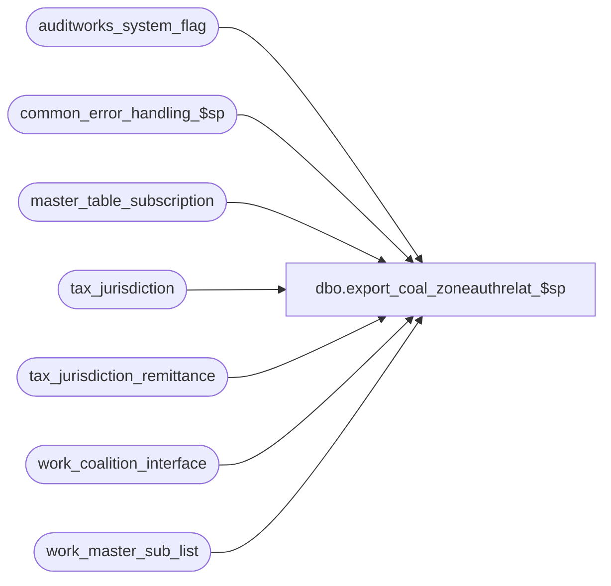

# dbo.export_coal_zoneauthrelat_$sp

**Database:** auditworks_external  
**Server:** bedrockdb01  

## Architecture Diagram



## Table Dependencies

| Referenced Table |
|---|
| auditworks_system_flag |
| common_error_handling_$sp |
| master_table_subscription |
| tax_jurisdiction |
| tax_jurisdiction_remittance |
| work_coalition_interface |
| work_master_sub_list |

## Stored Procedure Code

```sql
create proc dbo.export_coal_zoneauthrelat_$sp (@interface_id	tinyint,
 @process_no 	smallint,
 @task_server	nvarchar(255),
 @runtime_datetime	datetime,
 @export_status	tinyint,
 @task_no	int OUTPUT,
 @errmsg 	nvarchar(255) OUTPUT
)
AS

DECLARE
@block_type			smallint,
@cursor_open			tinyint,
@data_header			nvarchar(255),
@errno				int,
@length				smallint,
@process_log_entry 		tinyint,
@record_sequence		int,
@task_module			nvarchar(255),
@table_name			nvarchar(30),
@table_key			nvarchar(255),
@task_header			nvarchar(255),
@task_operation 		nvarchar(255),
@tax_jurisdiction		nchar(5),
@tax_level			tinyint,
@export_module_name		nvarchar(255),
@message_id		        int,	
@object_name			nvarchar(255),
@operation_name			nvarchar(100),
@process_name		        nvarchar(100),
@time_stamp			smalldatetime,
@action				tinyint,
@posting_datetime		datetime,
@insert_rows			int,
@delete_rows			int,
@entry_id			numeric(12,0)


/* Proc Name: export_coal_zoneauthrelat_$sp
   Desc: Coalition Tax Exports.
     Called by coalition_interface_main_$sp.

HISTORY:
Date     Name           Def# Desc
Mar17,14 Phu        1-4CDP8E Fix partial export that has result in the wrong order.
Feb10,14 Vicci        149810 Exclude inactive jurisdictions.
Feb26,13 Vicci        142088 To avoid deadlocks, lock a shared flag prior to work_master_sub_list deletions.
Feb22,13 Vicci        142020 Do not hold a lock on the work_master_sub_list table while reading it in a cursor, since this causes the 
                             audit_trail_header_$trI work_master_sub_list cleanup of prior configuration changes for the table/key upon 
                             additional change to the same table/key to die as victim of a deadlock 
                             and close the cursor immediately after use not after attempting to clean up work_master_sub_list (which also
                             likely contributed to the deadlock.
Apr07,11 Vicci        126078 Take master_table_subscription active flag into account.
Mar11,04 Daphna        25374 increment counter inside cursor loop to prevent multiple insert error
Nov12,02 Winnie         5124 update export_status to 0 if no data in work_coalition_interface
Aug06,02 Winnie      1-DZ2SY To support export_status = 1 (for coalition update/delete)
May02,02 Winnie	     1-CFFPT To standardize the coalition for Tax export.
*/


SELECT @process_name = 'export_coal_zoneauthrelat_$sp',
       @message_id = 201068,
       @task_module = 'Module=ZoneAuthRelation',
       @export_module_name = 'ZoneAuthRelation',
       @time_stamp = getdate(),
       @insert_rows = 0

IF @export_status = 2 --full table export requested           
  BEGIN

    SELECT @block_type = 2, -- Task
           @task_no = @task_no + 1
    SELECT @task_header = '[Task.' + CONVERT(nvarchar, @task_no) + ']',
           @task_operation = 'Operation=DeleteAll',
           @record_sequence = 0

    -- Build the deletion task
    INSERT work_coalition_interface
           (runtime_datetime, record_content, block_type, 
            task_no, record_sequence_no, export_module_name)
    VALUES (@runtime_datetime, @task_header, @block_type, 
            @task_no, @record_sequence, @export_module_name)

    SELECT @errno = @@error
    IF @errno <> 0
      BEGIN
        SELECT @errmsg = 'Failed to insert into work_coalition_interface with task header for ZoneAuthRelation DeleteAll',
               @object_name = 'work_coalition_interface',
               @operation_name = 'INSERT'      
        GOTO error
      END             
                       
    SELECT @record_sequence = @record_sequence + 1
  
    INSERT work_coalition_interface
           (runtime_datetime, record_content, block_type, 
            task_no, record_sequence_no, export_module_name)
    VALUES (@runtime_datetime, @task_server, @block_type, 
            @task_no, @record_sequence, @export_module_name)                               

    SELECT @errno = @@error
    IF @errno <> 0
      BEGIN
        SELECT @errmsg = 'Failed to insert into work_coalition_interface with task_server for ZoneAuthRelation DeleteAll',
               @object_name = 'work_coalition_interface',
               @operation_name = 'INSERT'      
         GOTO error
       END             
                       
    SELECT @record_sequence = @record_sequence + 1

    INSERT work_coalition_interface
           (runtime_datetime, record_content, block_type, 
            task_no, record_sequence_no, export_module_name)
     VALUES (@runtime_datetime, @task_module, @block_type, 
             @task_no, @record_sequence, @export_module_name)                               

    SELECT @errno = @@error
    IF @errno <> 0
      BEGIN
        SELECT @errmsg = 'Failed to insert into work_coalition_interface with task_module for ZoneAuthRelation DeleteAll',
               @object_name = 'work_coalition_interface',
            @operation_name = 'INSERT'      
        GOTO error
      END             
                       
    SELECT @record_sequence = @record_sequence + 1
  
    INSERT work_coalition_interface
           (runtime_datetime, record_content, block_type, 
            task_no, record_sequence_no, export_module_name)
    VALUES (@runtime_datetime, @task_operation, @block_type, 
            @task_no, @record_sequence, @export_module_name)                               

    SELECT @errno = @@error
    IF @errno <> 0
      BEGIN
        SELECT @errmsg = 'Failed to insert into work_coalition_interface with task_operation for ZoneAuthRelation DeleteAll',
               @object_name = 'work_coalition_interface',
               @operation_name = 'INSERT'      
        GOTO error
      END             

    SELECT @data_header = '[Data.' + CONVERT(nvarchar, @task_no) + ']',
           @record_sequence = 0,
           @block_type = 3 -- Data

    INSERT work_coalition_interface
           (runtime_datetime, record_content, block_type, 
            task_no, record_sequence_no, export_module_name)
    VALUES (@runtime_datetime, @data_header, @block_type, 
            @task_no, @record_sequence, @export_module_name)                               

    SELECT @errno = @@error
    IF @errno <> 0
      BEGIN
        SELECT @errmsg = 'Failed to insert into work_coalition_interface with data_header for ZoneAuthRelation DeleteAll',
               @object_name = 'work_coalition_interface',
               @operation_name = 'INSERT'      
        GOTO error
      END             

    SELECT @record_sequence = @record_sequence + 1

    INSERT work_coalition_interface
           (runtime_datetime, record_content, block_type, 
            task_no, record_sequence_no, export_module_name)
    VALUES (@runtime_datetime, 'AllZoneAuthRelations', @block_type, 
            @task_no, @record_sequence, @export_module_name)                               
              
    SELECT @errno = @@error
    IF @errno <> 0
      BEGIN
        SELECT @errmsg = 'Failed to insert into work_coalition_interface for ZoneAuthRelation DeleteAll',
               @object_name = 'work_coalition_interface',
               @operation_name = 'INSERT'      
        GOTO error
      END

    SELECT @block_type = 2, 
           @task_no = @task_no + 1
    SELECT @task_header = '[Task.' + CONVERT(nvarchar, @task_no) + ']',
           @task_operation = 'Operation=AddUpdate',
           @record_sequence = 0

    -- Build the reinsertion task
    INSERT work_coalition_interface
           (runtime_datetime, record_content, block_type, 
            task_no, record_sequence_no, export_module_name)
    VALUES (@runtime_datetime, @task_header, @block_type, 
            @task_no, @record_sequence, @export_module_name)                               

    SELECT @errno = @@error
    IF @errno <> 0
      BEGIN
        SELECT @errmsg = 'Failed to insert into work_coalition_interface with task_header for ZoneAuthRelation AddUpdate',
               @object_name = 'work_coalition_interface',
               @operation_name = 'INSERT'      
        GOTO error
      END             
                       
   SELECT @record_sequence = @record_sequence + 1      

    INSERT work_coalition_interface
           (runtime_datetime, record_content, block_type, 
            task_no, record_sequence_no, export_module_name)
    VALUES (@runtime_datetime, @task_server, @block_type, 
            @task_no, @record_sequence, @export_module_name)                               

    SELECT @errno = @@error
    IF @errno <> 0
      BEGIN
        SELECT @errmsg = 'Failed to insert into work_coalition_interface with task_server for ZoneAuthRelation AddUpdate',
               @object_name = 'work_coalition_interface',
               @operation_name = 'INSERT'      
        GOTO error
      END             
    
    SELECT @record_sequence = @record_sequence + 1

    INSERT work_coalition_interface
           (runtime_datetime, record_content, block_type, 
            task_no, record_sequence_no, export_module_name)
    VALUES (@runtime_datetime, @task_module, @block_type, 
            @task_no, @record_sequence, @export_module_name)                               

    SELECT @errno = @@error
    IF @errno <> 0
      BEGIN
        SELECT @errmsg = 'Failed to insert into work_coalition_interface with task_module for ZoneAuthRelation AddUpdate',
               @object_name = 'work_coalition_interface',
               @operation_name = 'INSERT'      
        GOTO error
      END             
                       
    SELECT @record_sequence = @record_sequence + 1

    INSERT work_coalition_interface
           (runtime_datetime, record_content, block_type, 
            task_no, record_sequence_no, export_module_name)
    VALUES (@runtime_datetime, @task_operation, @block_type, 
            @task_no, @record_sequence, @export_module_name)                               
    SELECT @errno = @@error
    IF @errno <> 0
      BEGIN
        SELECT @errmsg = 'Failed to insert into work_coalition_interface with task_operation for ZoneAuthRelation AddUpdate',
               @object_name = 'work_coalition_interface',
               @operation_name = 'INSERT'      
        GOTO error
      END             
  
    -- Build the reinsertion data
    SELECT @data_header = '[Data.' + CONVERT(nvarchar, @task_no) + ']',
           @record_sequence = 0,
           @block_type = 3 -- Data

    INSERT work_coalition_interface
           (runtime_datetime, record_content, block_type, 
            task_no, record_sequence_no, export_module_name)
    VALUES (@runtime_datetime, @data_header, @block_type, 
            @task_no, @record_sequence, @export_module_name)                               
    SELECT @errno = @@error
    IF @errno <> 0
      BEGIN
        SELECT @errmsg = 'Failed to insert into work_coalition_interface with data_header for ZoneAuthRelation AddUpdate',
               @object_name = 'work_coalition_interface',
               @operation_name = 'INSERT'      
          GOTO error
        END             

    SELECT @record_sequence = @record_sequence + 1

    INSERT work_coalition_interface
           (runtime_datetime,
            record_content,
            block_type, task_no, record_sequence_no, export_module_name)
    SELECT  @runtime_datetime,
            @export_module_name + ',' + CONVERT(nvarchar(9), tax_jurisdiction_id) 
            + ',' + CONVERT(nvarchar, tax_level), 
            @block_type, @task_no, @record_sequence, @export_module_name                               
      FROM  tax_jurisdiction_remittance r, tax_jurisdiction t
     WHERE  r.tax_jurisdiction = t.tax_jurisdiction
       AND  t.active_flag = 1 

    SELECT @errno = @@error,
           @insert_rows = @@rowcount
    IF @errno <> 0
      BEGIN
        SELECT @errmsg = 'Failed to insert into work_coalition_interface from tax_jurisdiction_remittance for ZoneAuthRelation',
               @object_name = 'work_coalition_interface',
              @operation_name = 'INSERT'      
         GOTO error
      END                    

    IF @insert_rows = 0 
      BEGIN
        DELETE 
          FROM work_coalition_interface
         WHERE task_no = @task_no
           AND runtime_datetime = @posting_datetime      
           AND export_module_name = @export_module_name  

        SELECT @errno = @@error
        IF @errno <> 0
          BEGIN
            SELECT @errmsg = 'Failed to delete from  work_coalition_interface if no details for ZoneAuthRelation AddUpdate (2)',
                   @object_name = 'work_coalition_interface',
                   @operation_name = 'DELETE'      
            GOTO error
          END
      END -- IF @insert_rows = 0 

  END -- IF @export_status = 2

ELSE
  BEGIN

 DECLARE zoneauthrelation_crsr CURSOR FAST_FORWARD
        FOR
     SELECT table_name, 
            table_key,
            action,
            posting_datetime,
            entry_id
       FROM work_master_sub_list
      WHERE interface_id = @interface_id
        AND table_name = 'tax_jurisdiction_remittance'
        AND posting_datetime <= @time_stamp
   ORDER BY entry_id ASC

    SELECT @errno = @@error
      IF @errno <> 0
        BEGIN
          SELECT @errmsg = 'Unable to declare cursor zoneauthrelation_crsr',
                 @object_name = 'zoneauthrelation_crsr',
                 @operation_name = 'DECLARE'      
          GOTO error
        END

    OPEN zoneauthrelation_crsr
    SELECT @errno = @@error
      IF @errno <> 0
        BEGIN
          SELECT @errmsg = 'Unable to open cursor zoneauthrelation_crsr',
                 @object_name = 'zoneauthrelation_crsr',
                 @operation_name = 'OPEN'      
          GOTO error
        END

    SELECT  @cursor_open = 1

    WHILE 1 = 1
    BEGIN
      FETCH zoneauthrelation_crsr
       INTO @table_name,
            @table_key,
            @action,
            @posting_datetime,
            @entry_id

      IF @@fetch_status <> 0
        BREAK

      SELECT @runtime_datetime = @posting_datetime,
             @length = LEN(@table_key),
             @insert_rows = 0,
             @delete_rows = 0,
             @task_no = @task_no + 1 
             
      SELECT @tax_jurisdiction = SUBSTRING(@table_key, 1, CHARINDEX('/', @table_key) -1 ),
             @tax_level = CONVERT(TINYINT,(SUBSTRING(@table_key, CHARINDEX('/', @table_key) + 1, @length)))

      --Jurisdiction deactivated
      IF @action <> 3 AND 
        EXISTS (SELECT 1
                  FROM  tax_jurisdiction t
                 WHERE  @tax_jurisdiction = tax_jurisdiction
                   AND  t.active_flag = 0)
        SELECT @action = 3

      IF @action = 3
      BEGIN       

        SELECT @block_type = 2, -- Task
               @task_header = '[Task.' + CONVERT(nvarchar, @task_no) + ']',
               @task_operation = 'Operation=Delete',
               @record_sequence = 0

        -- Build the deletion task
        INSERT work_coalition_interface
               (runtime_datetime, record_content, block_type, 
                task_no, record_sequence_no, export_module_name)
        VALUES (@runtime_datetime, @task_header, @block_type, 
                @task_no, @record_sequence, @export_module_name)
        SELECT @errno = @@error
        IF @errno <> 0
        BEGIN
          SELECT @errmsg = 'Failed to insert into work_coalition_interface with task header for ZoneAuthRelation Delete',
                 @object_name = 'work_coalition_interface',
                 @operation_name = 'INSERT'      
          GOTO error
        END             
                       
        SELECT @record_sequence = @record_sequence + 1
   
        INSERT work_coalition_interface
               (runtime_datetime, record_content, block_type, 
                task_no, record_sequence_no, export_module_name)
        VALUES (@runtime_datetime, @task_server, @block_type, 
                @task_no, @record_sequence, @export_module_name)                               
        SELECT @errno = @@error
        IF @errno <> 0
        BEGIN
          SELECT @errmsg = 'Failed to insert into work_coalition_interface with task_server for ZoneAuthRelation Delete',
                 @object_name = 'work_coalition_interface',
                 @operation_name = 'INSERT'      
          GOTO error
        END             
                       
        SELECT @record_sequence = @record_sequence + 1
 
        INSERT work_coalition_interface
               (runtime_datetime, record_content, block_type, 
                task_no, record_sequence_no, export_module_name)
        VALUES (@runtime_datetime, @task_module, @block_type, 
                 @task_no, @record_sequence, @export_module_name)                               
        SELECT @errno = @@error
        IF @errno <> 0
        BEGIN
          SELECT @errmsg = 'Failed to insert into work_coalition_interface with task_module for ZoneAuthRelation Delete',
                 @object_name = 'work_coalition_interface',
                 @operation_name = 'INSERT'      
          GOTO error
        END             
                       
        SELECT @record_sequence = @record_sequence + 1
   
        INSERT work_coalition_interface
               (runtime_datetime, record_content, block_type, 
                task_no, record_sequence_no, export_module_name)
        VALUES (@runtime_datetime, @task_operation, @block_type, 
                @task_no, @record_sequence, @export_module_name)                               
        SELECT @errno = @@error
        IF @errno <> 0
        BEGIN
          SELECT @errmsg = 'Failed to insert into work_coalition_interface with task_operation for ZoneAuthRelation Delete',
                 @object_name = 'work_coalition_interface',
                 @operation_name = 'INSERT'      
          GOTO error
        END             

        SELECT @data_header = '[Data.' + CONVERT(nvarchar, @task_no) + ']',
               @record_sequence = 0,
               @block_type = 3 -- Data

        INSERT work_coalition_interface
               (runtime_datetime, record_content, block_type, 
                task_no, record_sequence_no, export_module_name)
        VALUES (@runtime_datetime, @data_header, @block_type, 
                @task_no, @record_sequence, @export_module_name)                               
        SELECT @errno = @@error
        IF @errno <> 0
        BEGIN
          SELECT @errmsg = 'Failed to insert into work_coalition_interface with data_header for ZoneAuthRelation Delete',
                 @object_name = 'work_coalition_interface',
                 @operation_name = 'INSERT'      
          GOTO error
        END             

        SELECT @record_sequence = @record_sequence + 1
  
        IF EXISTS (SELECT table_key 
                     FROM work_master_sub_list
                    WHERE table_key = @table_key
                      AND posting_datetime = @posting_datetime
                      AND table_name = @table_name)
        BEGIN                       
          INSERT work_coalition_interface(
                 runtime_datetime,
                 record_content,
                 block_type, task_no, record_sequence_no, export_module_name)
          SELECT @runtime_datetime,
                 @export_module_name + ',' + CONVERT(nvarchar(9), tax_jurisdiction_id) 
                 + ',' + CONVERT(nvarchar, @tax_level), 
                 @block_type, @task_no, @record_sequence, @export_module_name                               
            FROM tax_jurisdiction   --need the tax_jurisdiction_id regardless of whether active or not to support the deletion
           WHERE tax_jurisdiction = @tax_jurisdiction
          SELECT @errno = @@error,
                 @delete_rows = @@rowcount
          IF @errno <> 0
          BEGIN
            SELECT @errmsg = 'Failed to insert into work_coalition_interface from work_master_sub_list for ZoneAuthRelation Delete',
                   @object_name = 'work_coalition_interface',
                   @operation_name = 'INSERT'      
            GOTO error
          END                    
        END  --IF EXISTS (SELECT table_key FROM work_master_sub_list...
        IF @delete_rows = 0 
        BEGIN
          DELETE 
            FROM work_coalition_interface
           WHERE task_no = @task_no
             AND runtime_datetime = @posting_datetime      
             AND export_module_name = @export_module_name  
          SELECT @errno = @@error
          IF @errno <> 0
          BEGIN
            SELECT @errmsg = 'Failed to delete from  work_coalition_interface if no details for ZoneAuthRelation Delete',
                   @object_name = 'work_coalition_interface',
                   @operation_name = 'DELETE'      
            GOTO error
          END
        END -- IF @rows = 0 
      END  --IF @action = 3
      ELSE
      BEGIN
        SELECT @block_type = 2, 
               @task_header = '[Task.' + CONVERT(nvarchar, @task_no) + ']',
               @task_operation = 'Operation=AddUpdate',
               @record_sequence = 0
   
        -- Build the reinsertion task
        INSERT work_coalition_interface
               (runtime_datetime, record_content, block_type, 
                task_no, record_sequence_no, export_module_name)
        VALUES (@runtime_datetime, @task_header, @block_type, 
                @task_no, @record_sequence, @export_module_name)                               

        SELECT @errno = @@error
        IF @errno <> 0
          BEGIN
            SELECT @errmsg = 'Failed to insert into work_coalition_interface with task_header for ZoneAuthRelation AddUpdate (2)',
                   @object_name = 'work_coalition_interface',
                   @operation_name = 'INSERT'      
            GOTO error
          END             
                       
        SELECT @record_sequence = @record_sequence + 1      
 
        INSERT work_coalition_interface
               (runtime_datetime, record_content, block_type, 
                task_no, record_sequence_no, export_module_name)
        VALUES (@runtime_datetime, @task_server, @block_type, 
                @task_no, @record_sequence, @export_module_name)                               
        SELECT @errno = @@error
        IF @errno <> 0
          BEGIN
            SELECT @errmsg = 'Failed to insert into work_coalition_interface with task_server for ZoneAuthRelation AddUpdate (2)',
                   @object_name = 'work_coalition_interface',
                   @operation_name = 'INSERT'      
            GOTO error
          END             
                       
        SELECT @record_sequence = @record_sequence + 1

        INSERT work_coalition_interface
               (runtime_datetime, record_content, block_type, 
                task_no, record_sequence_no, export_module_name)
        VALUES (@runtime_datetime, @task_module, @block_type, 
                @task_no, @record_sequence, @export_module_name)                               
        SELECT @errno = @@error
        IF @errno <> 0
          BEGIN
            SELECT @errmsg = 'Failed to insert into work_coalition_interface with task_module for ZoneAuthRelation AddUpdate (2)',
                   @object_name = 'work_coalition_interface',
                   @operation_name = 'INSERT'      
            GOTO error
          END             
                       
        SELECT @record_sequence = @record_sequence + 1

        INSERT work_coalition_interface
               (runtime_datetime, record_content, block_type, 
                task_no, record_sequence_no, export_module_name)
        VALUES (@runtime_datetime, @task_operation, @block_type, 
                @task_no, @record_sequence, @export_module_name)                               
        SELECT @errno = @@error
        IF @errno <> 0
          BEGIN
            SELECT @errmsg = 'Failed to insert into work_coalition_interface with task_operation for ZoneAuthRelation AddUpdate (2)',
                   @object_name = 'work_coalition_interface',
                   @operation_name = 'INSERT'      
            GOTO error
          END             
  
        -- Build the reinsertion data
        SELECT @data_header = '[Data.' + CONVERT(nvarchar, @task_no) + ']',
               @record_sequence = 0,
               @block_type = 3 -- Data

        INSERT work_coalition_interface
               (runtime_datetime, record_content, block_type, 
                task_no, record_sequence_no, export_module_name)
        VALUES (@runtime_datetime, @data_header, @block_type, 
                @task_no, @record_sequence, @export_module_name)                               
        SELECT @errno = @@error
        IF @errno <> 0
          BEGIN
            SELECT @errmsg = 'Failed to insert into work_coalition_interface with data_header for ZoneAuthRelation AddUpdate (2)',
                   @object_name = 'work_coalition_interface',
                   @operation_name = 'INSERT'      
              GOTO error
           END             

        SELECT @record_sequence = @record_sequence + 1
 
        INSERT work_coalition_interface
               (runtime_datetime,
                record_content,
                block_type, task_no, record_sequence_no, export_module_name)
        SELECT  @runtime_datetime,
                @export_module_name + ',' + CONVERT(nvarchar(9), tax_jurisdiction_id) 
                + ',' + CONVERT(nvarchar, tax_level), 
                @block_type, @task_no, @record_sequence, @export_module_name                               
          FROM  tax_jurisdiction_remittance r, tax_jurisdiction t
          WHERE r.tax_jurisdiction = t.tax_jurisdiction 
            AND r.tax_jurisdiction = @tax_jurisdiction
            AND r.tax_level = @tax_level
            AND t.active_flag = 1
        SELECT @errno = @@error,
               @insert_rows = @@rowcount
        IF @errno <> 0
          BEGIN
            SELECT @errmsg = 'Failed to insert into work_coalition_interface from tax_jurisdiction_remittance for ZoneAuthRelation (2)',
                   @object_name = 'work_coalition_interface',
                   @operation_name = 'INSERT'      
             GOTO error
          END                            
        IF @insert_rows = 0 
          BEGIN
            DELETE 
              FROM work_coalition_interface
             WHERE task_no = @task_no
               AND runtime_datetime = @posting_datetime      
               AND export_module_name = @export_module_name  

            SELECT @errno = @@error
            IF @errno <> 0
              BEGIN
                SELECT @errmsg = 'Failed to delete from  work_coalition_interface if no details for ZoneAuthRelation AddUpdate (2)',
                       @object_name = 'work_coalition_interface',
                       @operation_name = 'DELETE'      
                GOTO error
              END
          END -- IF @insert_rows = 0 

    END -- IF @action != 3       

  END  -- While 1 = 1
    
  CLOSE zoneauthrelation_crsr
  SELECT @errno = @@error
  IF @errno <> 0
    BEGIN
      SELECT @errmsg = 'Unable to close cursor zoneauthrelation_crsr',
             @object_name = 'zoneauthrelation_crsr',
             @operation_name = 'CLOSE'      
      GOTO error
    END

  DEALLOCATE zoneauthrelation_crsr

  SELECT @cursor_open = 0

  BEGIN TRANSACTION  --142088
  /* Prevent possible deadlocks when audit trail published change retraction deletion and this export 
     simultaneously attempt to clean up the same work_master_sublist rows, by updating a shared system flag. */ 
  UPDATE auditworks_system_flag
     SET flag_datetime_value = getdate()
   WHERE flag_name = 'work_master_sublist_access'
  SELECT @errno = @@error
  IF @errno != 0 
  BEGIN
    SELECT @errmsg = 'Set flag to force concurrent processes to run sequentially'
    GOTO error
  END

  DELETE work_master_sub_list
        WHERE interface_id = @interface_id
          AND table_name = 'tax_jurisdiction_remittance'
  AND posting_datetime <= @time_stamp 
  SELECT @errno = @@error
  IF @errno <> 0
    BEGIN
      SELECT @errmsg = 'Failed to delete from work_master_sub_list',
             @object_name = 'work_master_sub_list',
             @operation_name = 'DELETE'                      
      GOTO error
    END                    
  COMMIT
    
END -- IF @export_status != 2

IF NOT EXISTS (SELECT export_module_name
                 FROM work_coalition_interface
                WHERE export_module_name = @export_module_name)
  BEGIN               
    UPDATE master_table_subscription
       SET export_status = 0
     WHERE export_module_name = @export_module_name 
       AND interface_id = @interface_id
       AND active_flag > 0
    SELECT @errno = @@error
    IF @errno <> 0
      BEGIN
        SELECT @errmsg = 'Unable to update master_table_subscription',
               @object_name = 'master_table_subscription',
               @operation_name = 'UPDATE'      
        GOTO error
      END
    END

RETURN 

error:   /* Common error handler */

         IF @cursor_open = 1
	  BEGIN
	   CLOSE zoneauthrelation_crsr
	   DEALLOCATE zoneauthrelation_crsr
	  END

	  EXEC common_error_handling_$sp @process_no, @errno, @errmsg, 0, @message_id, 
  	    @process_name, @object_name, @operation_name, 1, 1
  	    
	RETURN
```

