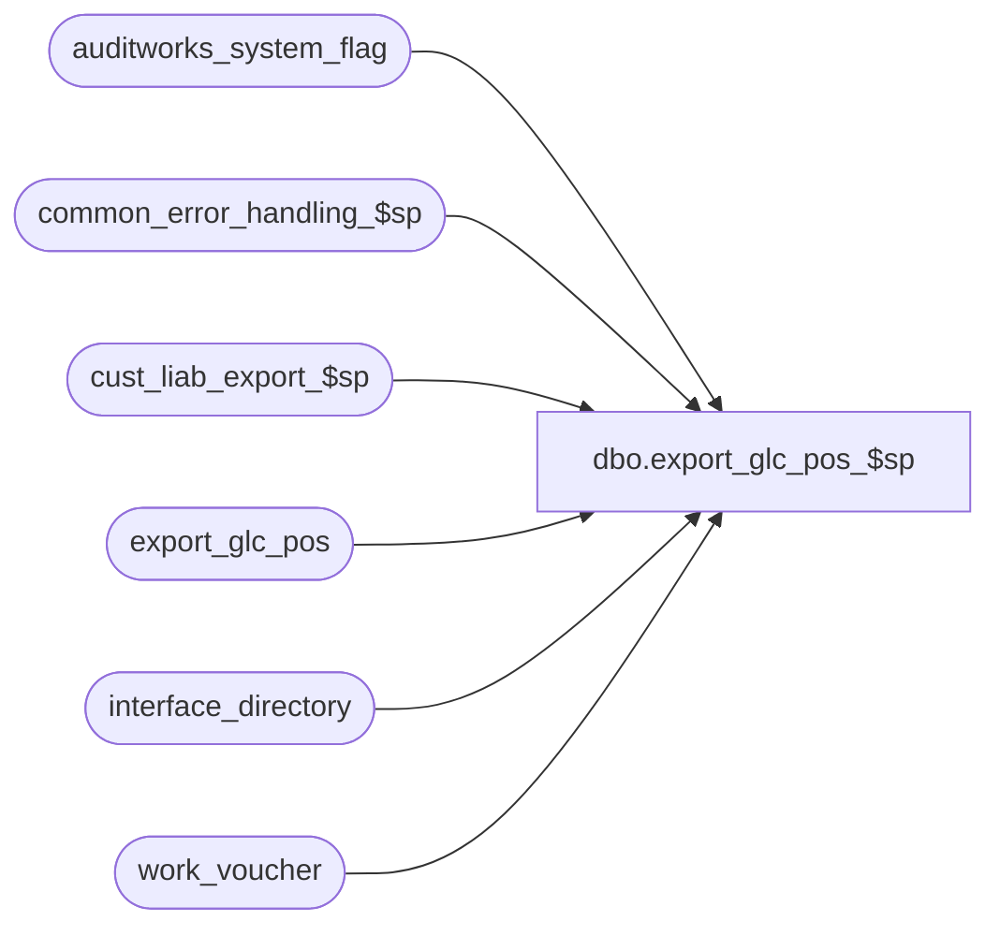

# dbo.export_glc_pos_$sp

**Database:** auditworks_external  
**Server:** bedrockdb01  

## Architecture Diagram



## Table Dependencies

| Referenced Table |
|---|
| auditworks_system_flag |
| common_error_handling_$sp |
| cust_liab_export_$sp |
| export_glc_pos |
| interface_directory |
| work_voucher |

## Stored Procedure Code

```sql
create proc [dbo].[export_glc_pos_$sp] 

@errmsg     nvarchar(255)  OUTPUT   

AS

/*
PROC NAME:   export_glc_pos_$sp
PROC DESC:   Update export_glc_pos table to be used to download liability data
             to the stores using smartload script export.ict which generates an
             ASCII file which will then be used by BASIX program to create:
             - Instore Tracking download file
             Table is built from customer_liability_pos table
HISTORY
Date      Name           Def# Desc
Aug08,07  Paul        DV-1363 Remove reference to obsolete customer liability data
Sep06,06  Tim           76719 Null Concatenation Fix.
Mar04,04  Phu         1-UN8TL voucher_export is not truncated causing duplicate in export_glc_pos_$sp and export_interstore_tracking_$sp.
Apr02,03  David       1-JVR21 format pos_amount_3 properly
APR05,02  Daphna      1-BMK21 Add conversion to numeric for comparison of amount field
FEB05/02  Daphna         8415 To integrate R3.5 Voucher Export
                              R3.0 Error Handling
Feb26/01  Phu            7371 Change double quotes to single quotes for MS SQL compatibility
Jan02/01  Louise M.      7154 Send the entry_date_time vs last_modified_by_aw to ISS
Sep22/00  Louise M       6732 To properly set the status for stocked/stolen documents
                              (60 -> 4, 61 -> 5, 62 -> 6)                                          
Oct28/99  Louise M.      5526 New enhancement : to support a declining (and increasing) balance
						on a voucher (gift cards)	
Nov10/98  Louise M        n/a author

*/

DECLARE
  @commit_flag                    tinyint,
  @current_export_time            datetime,
  @errno                          int,
  @log_error_flag                 tinyint,
  @message_id                     int,
  @object_name                    nvarchar(255),
  @operation_name                 nvarchar(100),
  @process_no                     int,
  @process_name                   nvarchar(100),
  @rows                           int
  
SET CONCAT_NULL_YIELDS_NULL OFF

SELECT @log_error_flag = 1, -- called by smartload
       @process_no = 239,
       @process_name = 'export_glc_pos_$sp',
       @message_id = 201068,
       @commit_flag = 0
       

IF EXISTS (select interface_id 
             from interface_directory 
            where interface_id = 28 and update_timing > 0)
BEGIN

  SELECT @current_export_time = getdate()

  -- to populate work_voucher table
  EXEC cust_liab_export_$sp @process_no
  
  SELECT @errno=@@error
  IF @errno != 0
  BEGIN
    SELECT @errmsg = 'Unable to populate work_voucher table',
           @operation_name = 'EXECUTE',
           @object_name = 'cust_liab_export_$sp'
    GOTO error
  END

  SELECT @rows = COUNT(*) 
  FROM work_voucher

  SELECT @errno=@@error
  IF @errno != 0
  BEGIN
    SELECT @errmsg = 'Unable to get count',
           @operation_name = 'SELECT',
           @object_name = 'work_voucher'
    GOTO error
  END
  
  IF @rows = 0
    RETURN
  
  CREATE TABLE #temp_export
   (record_type   	SMALLINT,
   account_number 	nvarchar(20),
   status         	TINYINT,
   customer_name	nvarchar(20),
   customer_phone	nvarchar(10), 
   transaction_date	nvarchar(6),
   store_no		nvarchar(3),       
   amount		nvarchar(10)) 
   
  SELECT @errno=@@error
  IF @errno != 0
  BEGIN
    SELECT @errmsg = 'Unable to create temp table',
           @operation_name = 'CREATE',
           @object_name = '#temp_export'
    GOTO error
  END   
  
  INSERT #temp_export(
	    record_type,      -- for Gift Cert = 2, Credit Note = 1
	    account_number,
	    status,  -- must = 1,3,4,5,6
	    customer_name,
	    customer_phone, 
	    transaction_date,
	    store_no,       
	    amount) 
  SELECT 6 - reference_type,  
         RIGHT('00000000000000000000'+LTRIM(reference_no),20),
         pos_status,  
         SUBSTRING(LTRIM((RTRIM(last_name)) + ', ' + LTRIM(RTRIM(first_name))),1,20),
         SUBSTRING(ISNULL(RTRIM(telephone_no1),'          '),1,10),
         convert(nvarchar,date_issued, 12),  -- FORMAT:  Feb05,2002 = '020205'
         RIGHT('000' + convert(nvarchar,issuing_store_no),3),   -- take RIGHTMOST 3 char 
         RIGHT('          ' + CONVERT(nvarchar(10), CONVERT(INTEGER,(pos_amount_1*100))),10)
           -- format = $17.50 = '      1750'        
    FROM work_voucher    
   WHERE reference_type IN (4,5)  -- Credit Notes and Gift Certificates
  
  SELECT @errno=@@error
  IF @errno != 0
  BEGIN
    SELECT @errmsg = 'Unable to insert from work_voucher',
           @operation_name = 'INSERT',
           @object_name = '#temp_export'
    GOTO error
  END

  /* set export status */  
  UPDATE #temp_export
     SET status = 4
   WHERE status =  10  -- stocked

  SELECT @errno=@@error
  IF @errno != 0
  BEGIN
    SELECT @errmsg = 'status = stocked',
           @operation_name = 'UPDATE',
           @object_name = '#temp_export'
    GOTO error
  END
    
  UPDATE #temp_export
     SET status = 5
   WHERE status =  20  -- stocked/stolen

  SELECT @errno=@@error
  IF @errno != 0
  BEGIN
    SELECT @errmsg = 'status = stocked/stolen',
           @operation_name = 'UPDATE',
           @object_name = '#temp_export'
    GOTO error
  END

  UPDATE #temp_export
     SET status = 6
   WHERE status =  40  -- stolen/lost by customer

  SELECT @errno=@@error
  IF @errno != 0
  BEGIN
    SELECT @errmsg = 'status = stolen/lost by customer',
           @operation_name = 'UPDATE',
           @object_name = '#temp_export'
    GOTO error
  END

  UPDATE #temp_export
     SET status = 3   -- not valid
   WHERE status =  50  -- forfeit

  SELECT @errno=@@error
  IF @errno != 0
  BEGIN
    SELECT @errmsg = 'status = forfeit',
           @operation_name = 'UPDATE',
           @object_name = '#temp_export'
    GOTO error
  END
     
  UPDATE #temp_export
     SET status = 1   -- (sold or issued)
   WHERE status =  30  -- valid 
     AND convert(numeric,amount) > 0   -- DEF 1-BMK21

  SELECT @errno=@@error
  IF @errno != 0
  BEGIN
    SELECT @errmsg = 'status = sold/issued',
           @operation_name = 'UPDATE',
           @object_name = '#temp_export'
    GOTO error
  END
  
  UPDATE #temp_export
     SET status = 3   -- (redeemed/cashed/returned)
   WHERE status =  30  -- valid 
     AND convert(numeric, amount) = 0   -- DEF 1-BMK21

  SELECT @errno=@@error
  IF @errno != 0
  BEGIN
    SELECT @errmsg = 'status = redeemed/cashed/returned',
           @operation_name = 'UPDATE',
           @object_name = '#temp_export'
    GOTO error
  END
   
  -- Some status remains 30 because amounts are negative due to integrities.
  -- Have to remove those entries because status has to be 1 char.
  DELETE FROM #temp_export
   WHERE status > 9
           
  SELECT @errno=@@error
  IF @errno != 0
  BEGIN
    SELECT @errmsg = 'Cleanup integrities',
           @operation_name = 'Delete',
           @object_name = '#temp_export'
    GOTO error
  END
  
  /* determine which amount is booked: ASSUME stocked amounts for status = 4,5 */
  
  UPDATE #temp_export
     SET amount = RIGHT('          ' + CONVERT(nvarchar(10), FLOOR(pos_amount_3*100)),10)
    FROM #temp_export t, work_voucher e
   WHERE t.status IN (4,5)
     AND t.account_number = e.reference_no
     AND t.record_type = e.reference_type

  SELECT @errno=@@error
  IF @errno != 0
  BEGIN
    SELECT @errmsg = 'amount = pos_amount_3 (stocked_amount)',
           @operation_name = 'UPDATE',
           @object_name = '#temp_export'
    GOTO error
  END     
     
  BEGIN TRAN
  INSERT export_glc_pos(
	    record_type,   
	    account_number,
	    status, 
	    customer_name,
	    customer_phone, 
	    transaction_date,
	    store_no,       
	    amount) 
  SELECT convert(nchar,record_type),
         account_number,
         convert(nchar,status),
         customer_name,
         customer_phone,
         transaction_date,
         store_no,
         amount
    FROM #temp_export    

  SELECT @errno=@@error
  IF @errno != 0
  BEGIN
    SELECT @errmsg = 'FROM #temp_export',
           @operation_name = 'INSERT',
           @object_name = 'export_glc_pos'
    GOTO error
  END  

  UPDATE auditworks_system_flag
  SET flag_datetime_value = @current_export_time       
  WHERE flag_name = 'voucher_last_exported'
 
  SELECT @errno = @@error
  IF @errno <> 0
  BEGIN
    SELECT @errmsg = 'Unable to set voucher_last_exported with current datetime in auditworks_system_flag',
           @object_name = 'auditworks_system_flag',
           @operation_name = 'UPDATE'
    GOTO error
  END

  COMMIT
  DROP TABLE #temp_export

END -- If exists

RETURN

error:

  EXEC common_error_handling_$sp @process_no, @errno, @errmsg, 0, @message_id, 
       @process_name, @object_name, @operation_name, @log_error_flag, 
       null, --@stream_no
       null, -- @process_log_entry
       null, -- @process_timestamp
       null, -- @transaction_count
       null, -- @memo1
       null, -- @memo2
       null, -- @memo3
       null, -- @memo_date
       null, -- @memo_date2
       null, -- @memo_date3
       @commit_flag  
  RETURN
```

