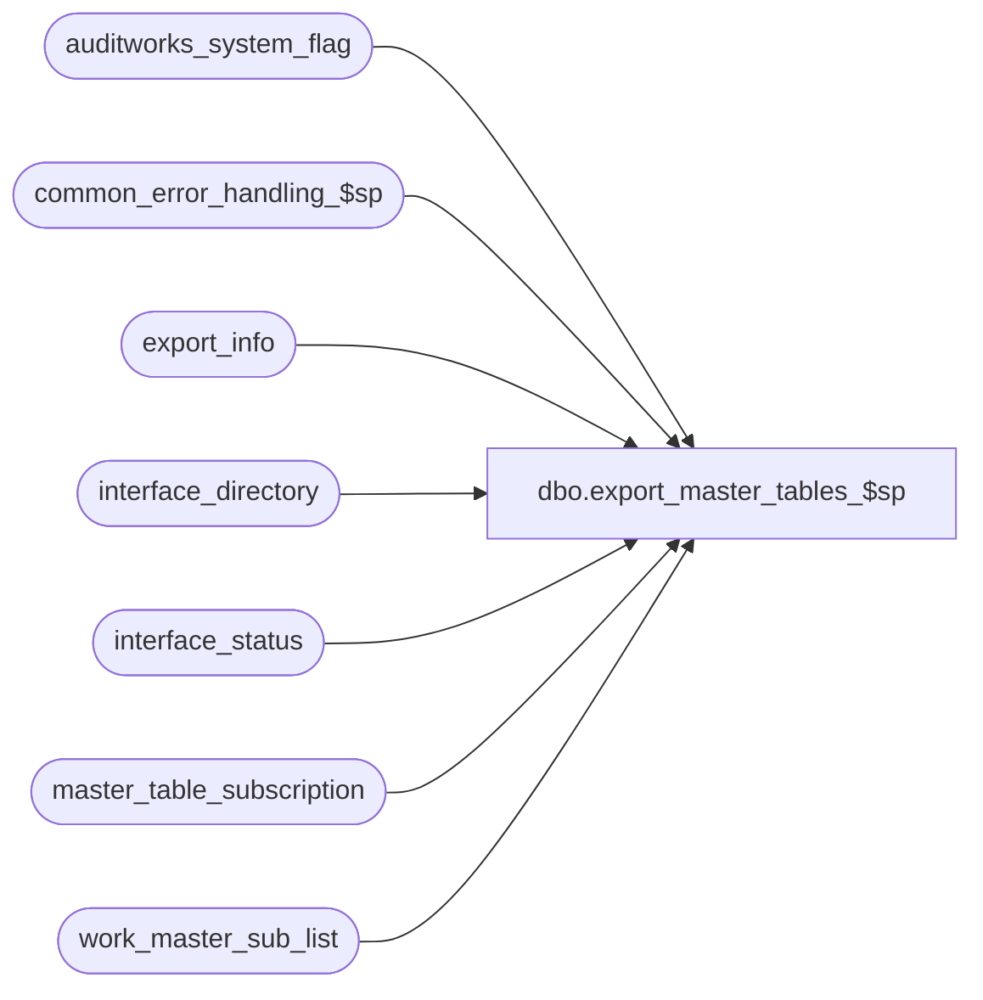

# dbo.export_master_tables_$sp

**Database:** auditworks_external  
**Server:** bedrockdb01  

## Architecture Diagram



## Table Dependencies

| Referenced Table |
|---|
| auditworks_system_flag |
| common_error_handling_$sp |
| export_info |
| interface_directory |
| interface_status |
| master_table_subscription |
| work_master_sub_list |

## Stored Procedure Code

```sql
create proc dbo.export_master_tables_$sp 

(@interface_id		tinyint)
AS
/* 
PROC NAME:   export_master_tables_$sp
PROC DESC:   Copies entire Master table into Export_Tables for BCP, FTP as required by export_format
             Called by ICT_EXPORT as an AD-HOC export for one interface at a time
             FOR LIST OF TABLES INCLUDED see master_table_subscription entries for interface_id in question (usually 32).
HISTORY
Date     Name           Def# Desc
Feb26,13 Vicci        142088 To avoid deadlocks, lock a shared flag prior to work_master_sub_list deletions.
Jul16,12 Paul         136951 use nolock hint on master_table_subscription to reduce deadlocking.
Apr07,11 Vicci        126078 Take master_table_subscription active flag into account.
Sep06,06  Tim          76719 Null Concatenation Fix.
Sep24/03 Vicci	     15326 Adjust to handle exporting all tables upon user 
                             request, and to reflect the fact that a single 
                             interface_id may now subscribe to multiple master
                             tables with different output formats and file names.
JAN13/02 Winnie      1-GCUAZ add the 2 new column for export_series
MAY10/02 Daphna      1-CYE1P author

*/

DECLARE @errmsg 			nvarchar(255),
	@errno				int,
	@immediate_posting_requested 	tinyint,
	@log_error_flag			tinyint,
	@message_id			int,
	@object_name			nvarchar(255),
	@operation_name     		nvarchar(100),
	@process_no			int,
	@process_name			nvarchar(100),
	@table_name			nvarchar(30),
	@sql_command                    nvarchar(2000),
	@export_table_name		nvarchar(30),
	@export_table_or_view_name	nvarchar(30),
	@view_suffix_pos 		tinyint

SET CONCAT_NULL_YIELDS_NULL OFF

SELECT @log_error_flag = 1, -- called by smartload
       @process_no = 240, -- Export to Separate Server
       @process_name = 'export_master_tables_$sp',
       @message_id = 201068

IF (SELECT applicability_method FROM interface_directory 
    WHERE interface_id = @interface_id) <> 5  
  RETURN

SELECT @immediate_posting_requested = ISNULL(immediate_posting_requested,0)
  FROM interface_status
 WHERE interface_id = @interface_id
SELECT @errno = @@error
IF @errno <> 0
  BEGIN
    SELECT @errmsg = 'Unable to select immediate_posting_request from interface status',
           @object_name = 'interface_status',
           @operation_name = 'SELECT'      
    GOTO error
  END

IF @immediate_posting_requested = 0
BEGIN
  UPDATE master_table_subscription 
     SET export_status = 0
   WHERE interface_id = @interface_id
     AND export_status = 2
     AND active_flag > 0
  SELECT @errno = @@error
  IF @errno <> 0
  BEGIN
    SELECT @errmsg = 'Unable to mark master table subscription entries for full download request as complete upon abort',
           @object_name = 'master_table_subscription',
           @operation_name = 'UPDATE'      
     GOTO error
  END
     
  RETURN
END

UPDATE interface_status
   SET retrieval_in_progress  = 1, last_retrieval_datetime = getdate()
 WHERE interface_id = @interface_id

SELECT @errno = @@error
IF @errno <> 0
BEGIN
  SELECT @errmsg = 'Unable to set last_retrieval_datetime in interface_status',
         @object_name = 'interface_status',
         @operation_name = 'UPDATE' 
  GOTO error
END

IF NOT EXISTS (SELECT export_status
                 FROM master_table_subscription WITH (NOLOCK)
                WHERE export_status IN (1, 2, 3)
                  AND interface_id = @interface_id
                  AND active_flag > 0)  
BEGIN
  UPDATE master_table_subscription
     SET export_status = 2
   WHERE interface_id = @interface_id
     AND active_flag > 0
     AND export_status NOT IN (1, 2, 3) /* avoid unnecessary updating */
  SELECT @errno = @@error
  IF @errno <> 0
  BEGIN
    SELECT @errmsg = 'Unable to update master_table_subscription export_status to 2 i.e. full-download requested',
           @object_name = 'master_table_subscription',
           @operation_name = 'UPDATE'      
    GOTO error
  END   
END -- if not exists master table subscription entries with export_status = 1 i.e. TM outstanding

SELECT @export_table_or_view_name = MAX(e.export_table_name), @table_name = MAX(m.table_name) --note the max is just a precaution:  there is only ever 1 row in export_info
FROM export_info e WITH (NOLOCK), master_table_subscription m WITH (NOLOCK)
WHERE e.interface_id = @interface_id
  AND e.interface_id = m.interface_id
  AND (e.export_table_name = m.export_table_name OR m.export_table_name IS NULL) 
  AND m.export_status IN (1, 2, 3)  --3, i.e. in-progress included since ict will re-attempt if fails
  AND m.active_flag > 0
SELECT @errno = @@error
IF @errno <> 0 OR @export_table_or_view_name IS NULL --
BEGIN
  SELECT @errmsg = 'Failed to determine which table to export',
         @object_name = 'master_table_subscription',
         @operation_name = 'SELECT'      
  GOTO error
END   

SELECT @view_suffix_pos = CHARINDEX('_vw', @export_table_or_view_name)

IF @view_suffix_pos > 0
  SELECT @export_table_name = SUBSTRING(@export_table_or_view_name, 1, @view_suffix_pos - 1)
ELSE
  SELECT @export_table_name = @export_table_or_view_name

SELECT @sql_command = 'INSERT INTO ' + @export_table_name  + ' SELECT * FROM ' + @table_name 

-- Record when the export was last run for the master table affected
UPDATE master_table_subscription
   SET last_export_datetime = getdate(), 
       export_status = 3
 WHERE interface_id = @interface_id
   AND table_name = @table_name
   AND (export_table_name = @export_table_or_view_name OR export_table_name IS NULL)
   AND active_flag > 0
SELECT @errno = @@error
IF @errno <> 0
BEGIN
  SELECT @errmsg = 'Unable to mark master_table_subscription entries as in progress',
         @object_name = 'master_table_subscription',
         @operation_name = 'UPDATE'                   
  GOTO error
END

EXEC sp_executesql @sql_command

SELECT @errno = @@error
IF @errno != 0
BEGIN
  SELECT @errmsg = 'Failed to insert ' + @export_table_name,
         @object_name = @export_table_name,
         @operation_name = 'DELETE'
  GOTO error
END

BEGIN TRANSACTION  --142088
  /* Prevent possible deadlocks when audit trail published change retraction deletion and this export 
     simultaneously attempt to clean up the same work_master_sublist rows, by updating a shared system flag. */ 
  UPDATE auditworks_system_flag
     SET flag_datetime_value = getdate()
   WHERE flag_name = 'work_master_sublist_access'
  SELECT @errno = @@error
  IF @errno != 0 
  BEGIN
    SELECT @errmsg = 'Set flag to force concurrent processes to run sequentially',
           @object_name = 'auditworks_system_flag',
           @operation_name = 'UPDATE'
    GOTO error
  END

  DELETE work_master_sub_list
   WHERE interface_id = @interface_id
     AND table_name = @table_name
  SELECT @errno = @@error
  IF @errno <> 0
  BEGIN
    SELECT @operation_name = 'DELETE',
           @object_name = 'work_master_sub_list',
           @errmsg = 'Failed to delete work_master_sublist entries for ' + @table_name
    GOTO error       
  END
COMMIT

-- Record when the export was last run for the master table affected
UPDATE master_table_subscription
   SET export_status = 0
 WHERE interface_id = @interface_id
   AND table_name = @table_name
   AND (export_table_name = @export_table_or_view_name OR export_table_name IS NULL)
   AND active_flag > 0
   AND export_status != 0 /* avoid unnecessary updating */
SELECT @errno = @@error
IF @errno <> 0
BEGIN
  SELECT @errmsg = 'Unable to mark master_table_subscription entries as complete',
         @object_name = 'master_table_subscription',
         @operation_name = 'UPDATE'                   
  GOTO error
END

--If another pass is required, set immediate_posting_requested to 2
IF EXISTS (SELECT table_name
             FROM master_table_subscription WITH (NOLOCK)
            WHERE export_status IN (1, 2)
              AND interface_id = @interface_id
              AND active_flag > 0)  
BEGIN
  UPDATE interface_status
     SET immediate_posting_requested = 2 --(ict will bcp but not reset, therefore another pass will occur)
   WHERE interface_id = @interface_id
     AND immediate_posting_requested != 2 /* avoid unnecessary updating */

  SELECT @errno = @@error
  IF @errno <> 0
  BEGIN
    SELECT @errmsg = 'Unable to request subsequent export pass',
           @object_name = 'interface_status',
           @operation_name = 'UPDATE'      
    GOTO error
  END   
END -- if exists more master table subscription entries to be processed
ELSE
BEGIN
  UPDATE interface_status
  SET immediate_posting_requested = 0, retrieval_in_progress = 0
   WHERE interface_id = @interface_id

  SELECT @errno = @@error
  IF @errno <> 0
  BEGIN
    SELECT @errmsg = 'Unable to mark immediate posting request as having been completed',
           @object_name = 'interface_status',
           @operation_name = 'UPDATE'      
    GOTO error
  END   
END --no more table to dump

RETURN

error:   /* Common error handler. */
  
  EXEC common_error_handling_$sp @process_no, @errno, @errmsg, 0, @message_id, 
       @process_name, @object_name, @operation_name, @log_error_flag 
  RETURN
```

