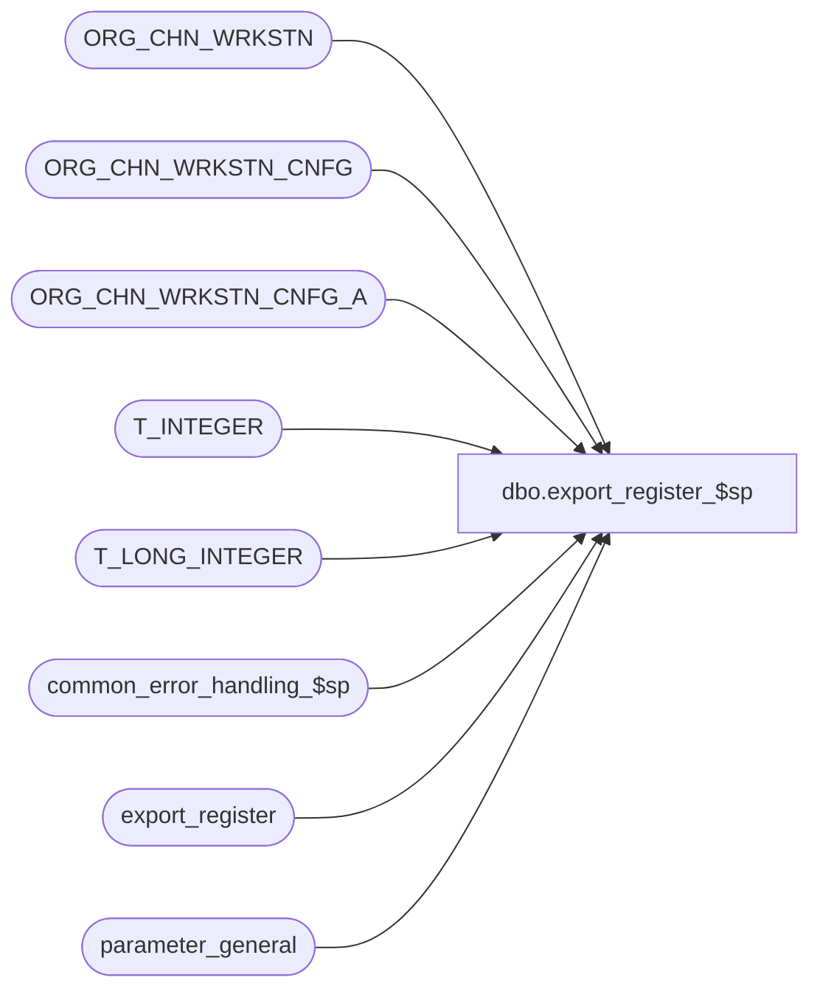

# dbo.export_register_$sp

**Database:** auditworks_external  
**Server:** bedrockdb01  

## Architecture Diagram



## Table Dependencies

| Referenced Table |
|---|
| ORG_CHN_WRKSTN |
| ORG_CHN_WRKSTN_CNFG |
| ORG_CHN_WRKSTN_CNFG_A |
| T_INTEGER |
| T_LONG_INTEGER |
| common_error_handling_$sp |
| export_register |
| parameter_general |

## Stored Procedure Code

```sql
create proc [dbo].[export_register_$sp] 
@interface_id    tinyint = NULL -- this parameter is required by export.ict
 AS

/* Proc Name: export_register_$sp
   Description: To export register definition table for use by the c translates.

Called from smartload script /ICT_EXPORT/export.ict

History:
Date	 Name		Def# Action
Jan18,12 Vicci        132439 Remove references to CRDM user-defined string datatypes from S/A since CRDM is not changing them to support unicode.
Apr03,07 Paul        DV-1356 standardized variables, added order by
Jun01,05 Paul        DV-1254 change datatype of @TRAN_TRNSLT_VRSN_NUM to T_INTEGER
Mar02,05 Paul        DV-1203 change datatype of @WRKSTN_NUM to match CDM datatype
Dec01,04 Maryam      DV-1181 Handle any char except the '|'as PLNG_FILE_NAME.
Nov10,04 Maryam      DV-1167 Add the active flag back for ORG_CHN_WRKSTN. Fix the where clause
Sep15,04 David       DV-1146 Remove reference to active flags.
Jun04,04 Maryam      DV-1071 Use ORG_CHN_WRKSTN instead of register.
Jul06,04 Maryam      1-UL01B pass @interface_id.
Apr19,02 ShuZ        1-CD0IX Standardize  R3.5 Common error handling
Jan10,01 Henry		7193 To Allow up to a 10 digit store_no field in the export_register table.

*/

DECLARE @cursor_open            tinyint,
        @errmsg 		nvarchar(255),
	@errno 			int,
	@sa_company_no 		int,
	@sa_company_string 	nvarchar(5),
	@register_poll_id       nvarchar(255),
	@ORG_CHN_NUM            T_LONG_INTEGER,
	@WRKSTN_NUM             T_INTEGER,
	@PLNG_FILE_NAME         nvarchar(255),
	@TRAN_TRNSLT_VRSN_NUM   T_INTEGER,
	@EXISTING_TRNSLT_VRSN_NUM T_INTEGER,
	@object_name            nvarchar(255),
	@process_name           nvarchar(100),
	@operation_name         nvarchar(100),
	@message_id		int,
	@message_id2		int,
	@current_date           datetime,
	@memo1                  nvarchar(50),
	@memo2                  nvarchar(50),
	@memo3                  nvarchar(50),
	@start_of_first_pipe    int,
        @start_of_second_pipe   int,
        @end_of_first_pipe      int,
        @end_of_second_pipe     int,
        @store_len              int,
        @loop_len               int,
        @am_i_s_or_l            nchar(1),
        @am_i_l_or_s            nchar(1)

IF @interface_id <> 45
  RETURN
  
SELECT @process_name = 'export_register_$sp',
       @message_id = 201068,
       @current_date = getdate()  	

SELECT @sa_company_no = sa_company_no
  FROM parameter_general
  
SELECT @errno = @@error
IF @errno != 0
  BEGIN
    SELECT @errmsg = 'Failed to SELECT from table parameter_general.',
           @object_name    = 'parameter_general',
           @operation_name = 'SELECT'
    GOTO error
  END

SELECT @sa_company_string = CONVERT( nvarchar(5), @sa_company_no )

TRUNCATE TABLE export_register

SELECT @errno = @@error
IF @errno != 0
  BEGIN
    SELECT @errmsg = 'Failed to truncate table export_register',
           @object_name    = 'export_register',
           @operation_name = 'TRUNCATE'
    GOTO error
  END

DECLARE export_crsr CURSOR FAST_FORWARD
    FOR
 SELECT	PLNG_FILE_NAME,
        R.ORG_CHN_NUM,
	R.WRKSTN_NUM,
        TRAN_TRNSLT_VRSN_NUM
  FROM 	ORG_CHN_WRKSTN R,
        ORG_CHN_WRKSTN_CNFG C,
        ORG_CHN_WRKSTN_CNFG_A A
  WHERE ISNULL(R.PRNT_WRKSTN_ID, R.WRKSTN_ID) = A.WRKSTN_ID
    AND A.WRKSTN_CNFG_CODE = C.WRKSTN_CNFG_CODE
    AND @current_date >= A.EFCTV_DATE
    AND (@current_date < A.EXPRTN_DATE OR A.EXPRTN_DATE IS NULL)
    AND ISNULL(C.TRAN_TRNSLT_VRSN_NUM,0) <> 0
    AND PLNG_FILE_NAME IS NOT NULL
    AND ISNULL(R.PRNT_WRKSTN_ID, R.WRKSTN_ID) = R.WRKSTN_ID
    AND R.ACTV = 1
  ORDER BY PLNG_FILE_NAME, R.ORG_CHN_NUM, R.WRKSTN_NUM, TRAN_TRNSLT_VRSN_NUM
    
  OPEN export_crsr

  SELECT @errno = @@error
  IF @errno != 0
  BEGIN
    SELECT @errmsg         = 'Failed to open export_crsr CURSOR',
           @object_name    = 'export_crsr',
           @operation_name = 'OPEN'
    GOTO error
  END

  SELECT @cursor_open = 1

  WHILE 1 = 1
  BEGIN

    FETCH export_crsr
     INTO @PLNG_FILE_NAME,
          @ORG_CHN_NUM,
          @WRKSTN_NUM,
          @TRAN_TRNSLT_VRSN_NUM


    IF @@fetch_status <> 0
      BREAK

    SELECT @start_of_first_pipe = 0,
           @start_of_second_pipe = 0,
           @end_of_first_pipe = 0,
           @end_of_second_pipe = 0,
           @store_len = 0,
           @loop_len =0,
           @register_poll_id = NULL,
           @am_i_s_or_l = null, @am_i_l_or_s = null
    
    SELECT @start_of_first_pipe = charindex('|', @PLNG_FILE_NAME)

    IF @start_of_first_pipe = 0
      SELECT @register_poll_id = @PLNG_FILE_NAME
    ELSE -- There is at least one mask
    BEGIN
      SELECT @end_of_first_pipe = charindex('|', @PLNG_FILE_NAME, @start_of_first_pipe + 1 )
      SELECT @am_i_s_or_l = SUBSTRING(@PLNG_FILE_NAME, @start_of_first_pipe+ 1, @end_of_first_pipe- @start_of_first_pipe-2)
      IF UPPER(@am_i_s_or_l) = 'S'
      BEGIN
        SELECT @store_len = CONVERT (int,SUBSTRING (@PLNG_FILE_NAME, @start_of_first_pipe+2, @end_of_first_pipe- @start_of_first_pipe-2) )
	SELECT @register_poll_id = SUBSTRING (@PLNG_FILE_NAME,1, @start_of_first_pipe - 1) + 
               RIGHT ('000000000' + convert(nvarchar,@ORG_CHN_NUM), @store_len)
      END --if @am_i_s_or_l = 'S'
      ELSE IF UPPER(@am_i_s_or_l) = 'L'
      BEGIN
        SELECT @loop_len = CONVERT (int,SUBSTRING (@PLNG_FILE_NAME, @start_of_first_pipe+2, @end_of_first_pipe - @start_of_first_pipe-2) )  
        SELECT @register_poll_id = SUBSTRING (@PLNG_FILE_NAME,1, @start_of_first_pipe - 1) + 
                                   RIGHT ('00000' + convert(nvarchar,@WRKSTN_NUM), @loop_len)
      END --if @am_i_s_or_l = 'L'
     
      SELECT @start_of_second_pipe =  charindex('|', @PLNG_FILE_NAME, @end_of_first_pipe + 1)
      
      IF @start_of_second_pipe = 0
        SELECT @register_poll_id = @register_poll_id + SUBSTRING (@PLNG_FILE_NAME, @end_of_first_pipe+ 1, len(@PLNG_FILE_NAME)- @end_of_first_pipe )

      ELSE --The second mask exist
      BEGIN
        SELECT @end_of_second_pipe = charindex('|', @PLNG_FILE_NAME, @start_of_second_pipe + 1)
        SELECT @am_i_l_or_s = SUBSTRING(@PLNG_FILE_NAME, @start_of_second_pipe+ 1, @end_of_second_pipe- @start_of_second_pipe-2)
        IF UPPER(@am_i_l_or_s) = 'S'
        BEGIN
          SELECT @store_len = CONVERT (int,SUBSTRING (@PLNG_FILE_NAME, @start_of_second_pipe+2, @end_of_second_pipe- @start_of_second_pipe-2) )
          SELECT @register_poll_id = @register_poll_id +  SUBSTRING(@PLNG_FILE_NAME, @end_of_first_pipe + 1, @start_of_second_pipe - @end_of_first_pipe - 1) + 
                       RIGHT ('0000000000' + convert(nvarchar,@ORG_CHN_NUM), @store_len) + 
                       SUBSTRING (@PLNG_FILE_NAME, @end_of_second_pipe + 1, len(@PLNG_FILE_NAME) - @end_of_second_pipe ) 
        END --if @am_i_l_or_s = 'S'
        ELSE IF UPPER(@am_i_l_or_s) = 'L' 
        BEGIN
          SELECT @loop_len = CONVERT (int,SUBSTRING (@PLNG_FILE_NAME, @start_of_second_pipe+2, @end_of_second_pipe - @start_of_second_pipe-2) )  
          SELECT @register_poll_id = @register_poll_id +  SUBSTRING(@PLNG_FILE_NAME, @end_of_first_pipe + 1, @start_of_second_pipe - @end_of_first_pipe - 1) + 
                       RIGHT ('00000' + convert(nvarchar,@WRKSTN_NUM), @loop_len) + 
                       SUBSTRING (@PLNG_FILE_NAME, @end_of_second_pipe + 1, len(@PLNG_FILE_NAME) - @end_of_second_pipe ) 
        END --if @am_i_l_or_s = 'L' 
      END-- The second mask exist
      
    END --There is at least one mask
        
      SELECT @EXISTING_TRNSLT_VRSN_NUM = NULL
      
      SELECT @EXISTING_TRNSLT_VRSN_NUM = translate_lookup_version
        FROM export_register
       WHERE register_poll_id = @register_poll_id
        
      IF @EXISTING_TRNSLT_VRSN_NUM IS NULL -- row doesn't exist
        BEGIN
          INSERT export_register(
                 register_poll_id,
                 store_no,
                 register_no,
                 register_type,
               translate_lookup_version,
                 sa_company_no)
          VALUES (@register_poll_id,
                 @ORG_CHN_NUM,
                 @WRKSTN_NUM,
                 1,
                 @TRAN_TRNSLT_VRSN_NUM,
                @sa_company_string)

          SELECT @errno = @@error
          IF @errno <> 0
          BEGIN
            SELECT @errmsg = 'Failed to insert into export_register.',
                   @object_name = 'export_register',
                   @operation_name = 'INSERT'
            GOTO error

          END        
        END     
      ELSE IF @EXISTING_TRNSLT_VRSN_NUM <> @TRAN_TRNSLT_VRSN_NUM
        BEGIN
          SELECT @errmsg = 'Configurations with different translate version no has been assigned to store |1 , register |2, for register_poll_id |3.',
  	         @object_name = 'ORG_CHN_WRKSTN_CNFG_A',
  	         @operation_name = 'SELECT',
  	         @message_id2 = 201688,
  	         @errno = 201688,
  	         @memo1 = convert(nvarchar,@ORG_CHN_NUM),
  	         @memo2 = convert(nvarchar,@WRKSTN_NUM),
  	         @memo3 = @register_poll_id

          EXEC common_error_handling_$sp 220, @errno, @errmsg, 3, @message_id2,
	       @process_name, @object_name, @operation_name, 1, NULL, NULL,NULL, NULL,
	       @memo1, @memo2, @memo3
     
        END
  
  END --WHILE 1 = 1
  
  CLOSE export_crsr
  DEALLOCATE export_crsr

  SELECT @cursor_open = 0 
 
RETURN

error:

  IF @cursor_open = 1
    BEGIN
      CLOSE export_crsr
   DEALLOCATE export_crsr
    END
    
  EXEC common_error_handling_$sp 220, @errno, @errmsg, 0, @message_id, 
                                 @process_name, @object_name, @operation_name, 1

RETURN
```

