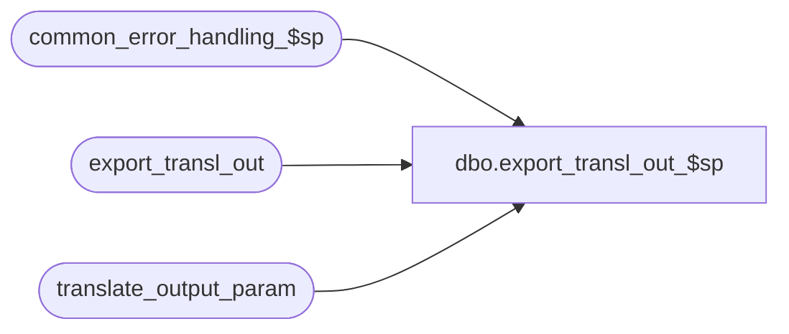

# dbo.export_transl_out_$sp

**Database:** auditworks_external  
**Server:** bedrockdb01  

## Architecture Diagram



## Table Dependencies

| Referenced Table |
|---|
| common_error_handling_$sp |
| export_transl_out |
| translate_output_param |

## Stored Procedure Code

```sql
create proc [dbo].[export_transl_out_$sp] 
@version_no  tinyint = 1
AS
/* Desc: to build temporary export table
   from the translate_output_param table.
   extracts parameters for specified version
   and adds trailing blanks to numeric fields. 
HISTORY     
DATE          NAME	DEF#	DESC
19-Apr-02     ShuZ   1-CD0IX    Standardize  R3.5 Common error handling

   */
DECLARE 
@errno			int,
@errmsg 		nvarchar(255),
@object_name            nvarchar(255),
@process_name           nvarchar(100),
@operation_name         nvarchar(100),
@message_id		int

SELECT @process_name = 'export_transl_out_$sp',
      @message_id = 201068     

TRUNCATE TABLE export_transl_out

SELECT @errno = @@error
IF @errno != 0
  BEGIN
    SELECT @errmsg = 'Failed to TRUNCATE export_transl_out',
           @object_name    = 'export_transl_out',
           @operation_name = 'TRUNCATE'
    GOTO error
  END
  
INSERT export_transl_out (
	output_file,
	output_column,
	output_datatype,
	column_max_length,
	column_mandatory_flag,
    multiple_row_flag,
    default_value )
SELECT 
	output_file,
	CONVERT( nchar(3), output_column ),
	output_datatype,
	CONVERT( nchar(3), column_max_length ),
	CONVERT( nchar(1), column_mandatory_flag ),
	CONVERT( nchar(1), multiple_row_flag ),
        default_value
  FROM translate_output_param

SELECT @errno = @@error
IF @errno != 0
  BEGIN
    SELECT @errmsg = 'Failed to INSERT export_transl_out',
           @object_name    = 'export_transl_out',
           @operation_name = 'INSERT'
    GOTO error
  END

RETURN

error:
  EXEC common_error_handling_$sp 220, @errno, @errmsg, 0, @message_id, 
                                 @process_name, @object_name, @operation_name, 1
RETURN
```

