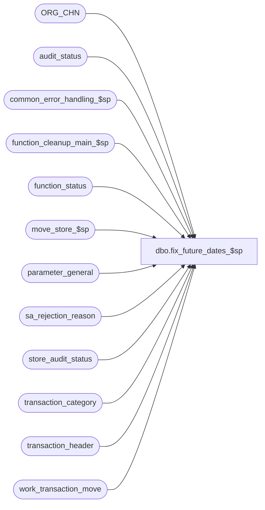

# dbo.fix_future_dates_$sp

**Database:** auditworks_external  
**Server:** bedrockdb01  

## Architecture Diagram



## Table Dependencies

| Referenced Table |
|---|
| ORG_CHN |
| audit_status |
| common_error_handling_$sp |
| function_cleanup_main_$sp |
| function_status |
| move_store_$sp |
| parameter_general |
| sa_rejection_reason |
| store_audit_status |
| transaction_category |
| transaction_header |
| work_transaction_move |

## Stored Procedure Code

```sql
create proc dbo.fix_future_dates_$sp @process_id binary(16),
@user_id    int,
@process_no smallint = 1  --1=Edit future date auto-revalidation, 68=Future date revalidation, 97=open date revalidation

AS

/*
PROC NAME: fix_future_dates_$sp
     DESC: Reprocess transactions that were originally rejected due to invalid (future) date for which the
           tran dates that are no longer in the future.
           Also revalidate transactions that were originally rejected due to a business date prior to the store's opening 
           or open to receive date.  Only corrects them if they are now valid from all date validation perspectives.
           Uses @move_flag 2 or 3 (Edit or Revalidate) but later calls move_register_$sp using @move_flag = 1 (emulating a move).
           Called once during Edit Phase2 to check for ALL invalid date entries if parameter is activated.
           May also be called from mass_auto_revalidate_$sp.

  HISTORY:
Date     Name		   Def# Desc
May05,15 Vicci       TFS-119660 Use same criteria as create_store_status_$sp (to avoid it creating a non-zero date reject).
Jun28,10 Vicci           118310 Since Move locks From store with function 182 (not 9) ensure BOTH halted process entries
			        are picked up by calling function_cleanup_main_$sp not function_cleanup_$sp.
Mar05,09 Vicci           106158 Option to revalidate date rejects for reason 10=business date prior to store opening or 
                                12=open to receive date as well and mark them as valid if all date-validations have now
                                been passed.
Feb28,06 Paul           DV-1328 Apply 1-36QREW to SA5, improve error recovery
Sep16,04 Maryam         DV-1146 use user_id.
Jul08,04 David          DV-1071 Remove parameter @move_all_transaction when calling move_store_$sp.
May05,04 Maryam         DV-1071 Receive @process_id and pass it to the sub procs.
Feb28,06 Paul          1-36QREW improve error recovery
May11,04 DaphnaF          28965 pass move_flag = 2 in call to move_store_$sp 
                                Check for transaction_series when looking for Duplicate txns
                                Fix error message for Duplicate txns
May27,03 Paul           1-KX549 remove username from call to verify_store_status_$sp
Nov07,02 HenryW         1-GIEAY To handle duplicate transactions, bypass the store/reg/date/date_rej_id.
Sep26,02 HenryW         1-EVLT5	To automatically revalidate future date rejections.

*/

DECLARE @cursor_open		int,
	@date_reject_id		tinyint,
	@errmsg			nvarchar(255),
	@errno			int,
	@abort_flag		tinyint, -- 1 = abort smartload, 2 = bypass rollback, 3 = bypass raise error
	@halted_process_id	binary(16),
	@sales_date 		smalldatetime,
	@object_name            nvarchar(255),
	@process_name           nvarchar(100),
	@operation_name         nvarchar(100),
	@message_id		int,
	@store_no		int,
	@register_no		smallint,
	@current_date		smalldatetime,
	@validate_flag		tinyint,
	@current_time		int,
	@prev_day_cutoff_time		smallint,
	@check_after_midnight_trans	tinyint,
	@dup_trans_exist	int,
	@memo1			nvarchar(50),
	@memo2			nvarchar(50),
	@memo_date		smalldatetime,
	@update_in_progress	smallint,
	@last_date_closed	smalldatetime,
	@period_end_date	smalldatetime,
	@frontend_populated	tinyint,
	@move_flag		tinyint,
	@trickle_in_progress_flag tinyint,
	@server_timezone_offset_min numeric(5,0)

SELECT	@process_name = 'fix_future_dates_$sp',
	@message_id = 201068,
	@cursor_open = 0,
	@validate_flag = 0,
	@current_date = getdate(),
	@frontend_populated = 0,
	@abort_flag = 0 

SELECT	@prev_day_cutoff_time = ISNULL(prev_day_cutoff_time,0),
	@check_after_midnight_trans = ISNULL(check_after_midnight_trans,0),
	@last_date_closed = last_date_closed,
	@period_end_date = period_end_date
  FROM	parameter_general

SELECT	@current_time = ( (DATEPART(hh,@current_date) * 100) + DATEPART(mi,@current_date) )

SELECT @server_timezone_offset_min = DATEDIFF(hh, getutcdate() , getdate()) * 60; -- GMT_OFST of SA server

/* SA5 error recovery since not handled by gui screen */

DECLARE cleanup_cursor CURSOR FAST_FORWARD
    FOR  
 SELECT process_id
   FROM function_status WITH (NOLOCK)
  WHERE function_no = 9
    AND move_flag in (2, 3) -- halted move called from fix_future_dates_$sp via edit or revalidate

OPEN cleanup_cursor

SELECT @errno = @@error, @cursor_open = 2
IF @errno !=0 
  BEGIN
      SELECT @errmsg = 'Failed to open cursor cleanup_cursor.',
             @object_name    = 'cleanup_cursor',
             @operation_name = 'OPEN'
      GOTO error
  END

WHILE 0=0
BEGIN

FETCH cleanup_cursor INTO
	@halted_process_id

IF @@fetch_status <> 0	/* no more data */
  BREAK

SELECT @errmsg = ' '

EXEC function_cleanup_main_$sp @halted_process_id, @user_id
SELECT @errno = @@error
IF @errno !=0 
  BEGIN
   IF @errmsg IS NULL /* then */
	SELECT @errmsg = 'Failed to execute function_cleanup_main_$sp'
   SELECT @object_name    = 'function_cleanup_main_$sp',
	  @operation_name = 'EXECUTE'
   GOTO error
  END

END /* While 0=0 */

CLOSE cleanup_cursor
DEALLOCATE cleanup_cursor
SELECT @cursor_open = 0

IF EXISTS( SELECT 1
           FROM function_status
           WHERE process_id = @process_id -- work tables are unique by process_id only
           AND function_no in (9, 109, 182))  --move, move-with-time-fix, lock-store-date
BEGIN
 SELECT @errmsg = 'Date Revalidation will be not be performed since previous move function did not complete normally and has not been recovered.',
        @errno = 201575,
        @message_id = 201575,
        @abort_flag = 3  --bypass raise error
 GOTO error
END

-- create #work table, to prevent row locking in MSSQL when the cursor is used.
CREATE TABLE #work_future_dates (
	store_no	int		NOT NULL,
	register_no	smallint	NOT NULL,
	sales_date	smalldatetime	NOT NULL,
	date_reject_id	tinyint		NOT NULL)

-- Only select invalid dates that have been Edited. 
-- If there are other reject reasons (e.g. invalid store or register), they will not be selected.
-- Check to make sure only have S/A reject reason of Future Dates.
-- Other S/A reject reason for Invalid dates, (e.g. Period Closed or Date Completed), will not be selected.

INSERT INTO #work_future_dates (
       store_no,
       register_no,
       sales_date,
       date_reject_id)
SELECT DISTINCT au.store_no,
       au.register_no,
       au.sales_date,
       au.date_reject_id
  FROM audit_status au WITH (NOLOCK)
       INNER JOIN transaction_header th WITH (NOLOCK)
          ON au.store_no = th.store_no
         AND au.register_no = th.register_no
         AND au.sales_date = th.transaction_date
         AND au.date_reject_id = th.date_reject_id
	LEFT OUTER JOIN transaction_category tc WITH (NOLOCK) 
          ON th.transaction_category = tc.transaction_category
        LEFT OUTER JOIN ORG_CHN s WITH (NOLOCK) 
          ON th.store_no = s.ORG_CHN_NUM
       INNER JOIN sa_rejection_reason sr
	  ON th.transaction_id = sr.transaction_id
         AND ((sr.violated_sareject_rule = 3  --Future date
               AND @process_no in (1, 68))  --Edit or Future Date revalidation
              OR
              (sr.violated_sareject_rule IN (10, 12) -- Future date, Business date prior to store open to receive date, Business date prior to store opening date rejects
               AND @process_no = 97)
              OR 
              (sr.violated_sareject_rule = 11 -- Already accepted
               AND @process_no = 97 AND EXISTS (SELECT 1 FROM audit_status aus WITH (NOLOCK)
                                                 WHERE au.store_no = aus.store_no
                                                   AND au.register_no = aus.register_no
                                                   AND au.sales_date = aus.sales_date
                                                   AND aus.date_reject_id = 0
                                                   AND (aus.audit_status in (5, 100, 200)
                                                        OR aus.audit_status >= 900)  )))
  WHERE	au.date_reject_id <> 0
    AND	au.audit_status = 100
    AND	au.sales_date <= @current_date
    AND au.sales_date >= @last_date_closed
    AND au.sales_date >= @period_end_date

    --Use same criteria as create_store_status_$sp to avoid it returning errors;  compare sales date with current date-time in the store's timezone plus 60 min. 
    AND au.sales_date <= DATEADD(mi,(COALESCE(s.GMT_OFST * 60, @server_timezone_offset_min) + 60),getutcdate())               

    AND au.sales_date >= COALESCE(CASE WHEN (tc.system_transaction_category IN (203, 204, 205, 206) 
                                             AND (s.OPEN_TO_RCV_DATE < s.OPEN_DATE OR s.OPEN_DATE IS NULL)) 
                                       THEN s.OPEN_TO_RCV_DATE 
                                       ELSE NULL
                                  END, s.OPEN_DATE, s.OPEN_TO_RCV_DATE, au.sales_date)
--BUT:  what if some receipts are now OK i.e. before open to receive but some sales for same store/date are still after 
--      open date...  cursor must handle that case later.
SELECT @errno = @@error
IF @errno != 0
BEGIN
  SELECT @errmsg = 'Failed to get invalid dates',
         @object_name = '#work_future_dates',
         @operation_name = 'INSERT'
  GOTO error
END

DECLARE future_dates_crsr CURSOR FAST_FORWARD
FOR
SELECT 	store_no,
	register_no,
	sales_date,
	date_reject_id
FROM	#work_future_dates WITH (NOLOCK)

OPEN future_dates_crsr
SELECT @errno = @@error
IF @errno != 0
  BEGIN
    SELECT @errmsg = 'Failed to open cursor for future dates.',
           @object_name    = 'future_dates_crsr ',
           @operation_name = 'OPEN'
    GOTO error
  END

SELECT	@cursor_open = 1

WHILE 1=1
BEGIN

  FETCH future_dates_crsr
   INTO @store_no,
	@register_no,
	@sales_date,
	@date_reject_id

  IF @@fetch_status <> 0 	/* no more data */
	BREAK

  SELECT @validate_flag = 0

  -- Check if sales date <= current date.
  IF CONVERT(smalldatetime, CONVERT(nchar(8),@sales_date,112)) <= CONVERT(smalldatetime, CONVERT(nchar(8),@current_date,112))

     SELECT @validate_flag = 1 -- no longer a future date. Ok to process.

  ELSE -- sales date must be > current date
   BEGIN

     -- Is sales date only 1 day greater than current date
     IF DATEDIFF(day,@sales_date,@current_date) = 1
      BEGIN
	-- check if Edit is running after midnight and before cutoff time, then still part of current day.
	IF (@check_after_midnight_trans = 1) AND (@current_time <= @prev_day_cutoff_time)
	  SELECT @validate_flag = 1 -- no longer a future date. Ok to process.
	ELSE   
	  SELECT @validate_flag = 0 -- sales date is still a future date. Do not process.
      END
     ELSE
	-- There is more than a one day difference between sales date and current date. Do not process.
	SELECT @validate_flag = 0

   END

  IF @validate_flag >= 1
  BEGIN
  
    --check if some stock transaction are now OK but some other transactions still aren't and a partial move is therefore required 
    IF EXISTS (SELECT 1  
                 FROM transaction_header th WITH (NOLOCK)
                 LEFT OUTER JOIN ORG_CHN s WITH (NOLOCK) 
                   ON th.store_no = s.ORG_CHN_NUM
                WHERE @store_no = th.store_no
                  AND @register_no = th.register_no
                  AND @sales_date = th.transaction_date
                  AND @date_reject_id = th.date_reject_id
                  AND th.transaction_category NOT IN (SELECT transaction_category
                                                        FROM transaction_category tc WITH (NOLOCK) 
                                                       WHERE tc.system_transaction_category IN (203, 204, 205, 206))
                  AND @sales_date < COALESCE(s.OPEN_DATE, s.OPEN_TO_RCV_DATE, @sales_date))
     BEGIN
       DELETE work_transaction_move 
        WHERE process_id = @process_id
       SELECT @errno = @@error
       IF @errno != 0
       BEGIN
         SELECT @errmsg = 'Failed to clean up work table.',
                @object_name = 'work_transaction_move',
                @operation_name = 'DELETE'
         GOTO error
       END

       INSERT into work_transaction_move(
              process_id,
              transaction_id,
              from_store_flag, other_store_flag, employee_flag,
employee_no,
              cashier_no,
              orig_sa_reject_flag, 
              till_no)
       SELECT @process_id,
              th.transaction_id,
     0, 0, 0, 
              th.employee_no,
              th.cashier_no,
              th.sa_rejection_flag,
              th.till_no
         FROM transaction_header th
        WHERE @store_no = th.store_no
          AND @register_no = th.register_no
          AND @sales_date = th.transaction_date
          AND @date_reject_id = th.date_reject_id
          AND th.transaction_category IN (SELECT transaction_category
                                            FROM transaction_category tc WITH (NOLOCK) 
                                           WHERE tc.system_transaction_category IN (203, 204, 205, 206))
       SELECT @errno = @@error, @frontend_populated = sign(@@rowcount)
       IF @errno != 0
       BEGIN
         SELECT @errmsg = 'Failed to list of transactions whose date has become valid.',
                @object_name = 'work_transaction_move',
                @operation_name = 'INSERT'
         GOTO error
       END

     END --if some stock transaction are now OK but some other transactions still aren't

    -- first check if the store/reg/date/trxns exist. If there are existing trxns, 
    -- then bypass the store/reg/date and log error message.

    SELECT @dup_trans_exist = 0

    IF EXISTS (SELECT 1
    		 FROM audit_status
    		WHERE store_no = @store_no
    		  AND register_no = @register_no
    		  AND sales_date = @sales_date
    		  AND date_reject_id = 0
    		  AND (audit_status < 300 OR
    		      audit_status >= 901)
    		  AND (valid_qty > 0 OR
    		       sa_reject_qty > 0) )
    BEGIN

      IF EXISTS (SELECT 1
		 FROM transaction_header th1 WITH (NOLOCK), transaction_header th2 WITH (NOLOCK)
		WHERE th1.store_no = @store_no
		  AND th1.register_no = @register_no
		  AND th1.transaction_date = @sales_date
		  AND th1.date_reject_id = @date_reject_id -- this should already be > 0
		  AND (@frontend_populated = 0 
		       OR th1.transaction_id IN (SELECT transaction_id 
		                                   FROM work_transaction_move 
		                                  WHERE process_id = @process_id))
		  AND th1.store_no = th2.store_no
		  AND th1.register_no = th2.register_no
		  AND th1.transaction_date = th2.transaction_date
		  AND th1.transaction_no = th2.transaction_no
		  AND th1.transaction_series = th2.transaction_series
		  AND th2.date_reject_id = 0 )
       BEGIN
	 SELECT @errno = 201753,
	        @message_id = 201753,
	        @dup_trans_exist = 1,
	        @memo1 = CONVERT(nvarchar,@store_no),
	        @memo2 = CONVERT(nvarchar,@register_no),
	        @memo_date = @sales_date,
      	        @errmsg = 'Unable to revalidate future dates, as DUPLICATE trxns would occur. For Store |1, Reg |2, Date |d1. Please verify the store/reg/date'

	 EXEC common_error_handling_$sp 5, @errno, @errmsg, 3, @message_id, @process_name,
	      @object_name, @operation_name, 0, 1, 0, NULL, 0, @memo1, @memo2, NULL, @memo_date,
	     null, null, 0, @process_id, @user_id
	 SELECT @message_id = 201068
       END
     END

    IF @dup_trans_exist = 0
    BEGIN
      SELECT @update_in_progress = 0, @trickle_in_progress_flag = 0

      SELECT @update_in_progress = update_in_progress, @trickle_in_progress_flag = trickle_in_progress_flag
        FROM store_audit_status
       WHERE store_no = @store_no
         AND sales_date = @sales_date
         AND date_reject_id = @date_reject_id

      IF (@trickle_in_progress_flag > 0 AND @process_no <> 1) OR (@update_in_progress > 0 AND (@update_in_progress <> 1 OR @process_no <> 1)) -- skip if store-date is locked (by a function other than the Edit when the Edit is running the revalidation)
        CONTINUE

      SELECT @update_in_progress = 0, @trickle_in_progress_flag = 0

      SELECT @update_in_progress = update_in_progress, @trickle_in_progress_flag = trickle_in_progress_flag
        FROM store_audit_status
       WHERE store_no = @store_no
         AND sales_date = @sales_date
         AND date_reject_id = 0

      IF (@trickle_in_progress_flag > 0 AND @process_no <> 1) OR (@update_in_progress > 0 AND (@update_in_progress <> 1 OR @process_no <> 1)) -- skip if store-date is locked (by a function other than the Edit when the Edit is running the revalidation)
        CONTINUE

      SELECT @move_flag = CASE WHEN @process_no = 1 THEN 2 ELSE 3 END

      EXEC move_store_$sp
                @process_id		= @process_id,
                @user_id		= @user_id,
		@from_store_no 		= @store_no,
		@from_register_no 	= @register_no,
		@from_sales_date	= @sales_date,
		@date_reject_id		= @date_reject_id,
		@from_transaction_no	= -1,
		@to_store_no		= @store_no,
		@to_register_no		= @register_no,
		@to_sales_date		= @sales_date,
		@to_transaction_no	= -1,
		@move_flag		= @move_flag, 
		@errmsg 		= @errmsg OUTPUT,
		@frontend_populated	= @frontend_populated,
		@transaction_series	= ' '

      SELECT @errno = @@error
      IF @errno !=0
      BEGIN
	IF @errmsg IS NULL /* then */
	  SELECT @errmsg = 'Failed to execute move_store_$sp'
	SELECT @object_name    = 'move_store_$sp',
	       @operation_name = 'EXECUTE'

	IF @errno <> 201550  AND @errno <> 201575  -- skip to next date if store-date is locked or halted process exists
	  GOTO error
	  
        EXEC function_cleanup_main_$sp @process_id, @user_id     
        
	CONTINUE
      END

     IF @frontend_populated = 1
     BEGIN
       DELETE work_transaction_move 
        WHERE process_id = @process_id
       SELECT @errno = @@error
       IF @errno != 0
       BEGIN
         SELECT @errmsg = 'Failed to clean up work table after using it.',
                @object_name = 'work_transaction_move',
                @operation_name = 'DELETE'
         GOTO error
       END
     END

    END -- IF @dup_trans_exist = 0

  END -- IF @validate_flag >= 1

END -- WHILE 1=1

CLOSE future_dates_crsr 
DEALLOCATE future_dates_crsr 

DROP TABLE #work_future_dates

SELECT @cursor_open = 0

RETURN 

error:

  IF @cursor_open = 1
    BEGIN
      CLOSE future_dates_crsr 
      DEALLOCATE future_dates_crsr 
    END

  IF @cursor_open = 2
    BEGIN
      CLOSE cleanup_cursor 
      DEALLOCATE cleanup_cursor
    END

  EXEC common_error_handling_$sp 5, @errno, @errmsg, @abort_flag, @message_id, @process_name,
       @object_name, @operation_name, 0, 1, 0, null, 0, null, null, null, null, null,
       null, 0, @process_id, @user_id

  RETURN
```

