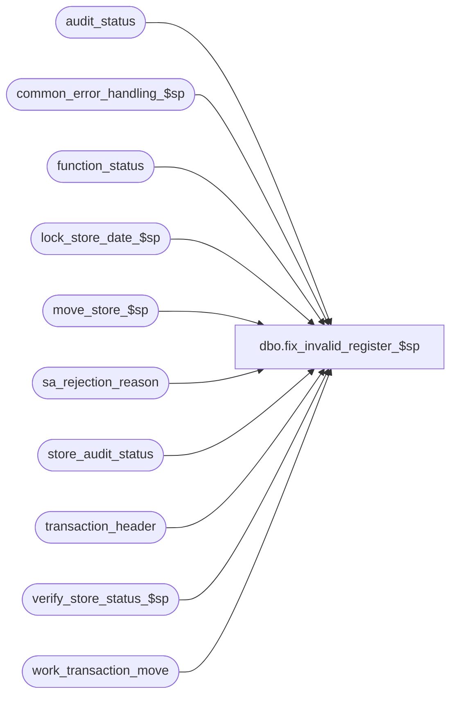

# dbo.fix_invalid_register_$sp

**Database:** auditworks_external  
**Server:** bedrockdb01  

## Architecture Diagram



## Table Dependencies

| Referenced Table |
|---|
| audit_status |
| common_error_handling_$sp |
| function_status |
| lock_store_date_$sp |
| move_store_$sp |
| sa_rejection_reason |
| store_audit_status |
| transaction_header |
| verify_store_status_$sp |
| work_transaction_move |

## Stored Procedure Code

```sql
CREATE proc [dbo].[fix_invalid_register_$sp] 
( @process_id			binary(16), 
  @user_id			int,
  @store_no			int,
  @register_no			int,
  @to_transaction_date		smalldatetime = null,
  @to_till_no			smallint = null,
  @to_cashier_no		int = null,
  @function_status		tinyint = 0,
  @rec_process_id		numeric(12,0) = null,
  @date_reject_id		tinyint = null
)

AS

/*
PROC NAME: fix_invalid_register_$sp
     DESC: Reprocess transactions rejected due to invalid registers by moving them.
           Called by fix_invalid_store_$sp.

  HISTORY:
Date     Name		   Def#  Desc
Mar26,14 Vicci        150934 When a store with a bad register exists for more than one sales date, ensure that when recovering
                             we start with the date that is locked by the function status entry being recovered, not one of the
                             other dates (otherwise dup key on insert to function status results).  Also, ensure transaction_date is 
                             populated in work_transaction_move since it is needed by move_verify_emp_attribute_$sp
Sep25,09 Vicci        113168 handle scenario when called from function cleanup with status 9 (i.e. after audit_status
                             has already been set to 100 but before media rec has been done).
Mar15,06 Paul        DV-1331 apply 67999 to SA5, delete work_fix_register after error recovery
Mar23,05 Paul        DV-1218 updated comments
Sep17,04 Maryam      DV-1146 replace user_name with user_id.
Jul08,04 David       DV-1071 Add rollforward logic.
Apr22,04 Maryam      DV-1071 Receive @process_id and @user_name and pass it to the sub procs.
Mar02,06 Vicci	       67999 Remove logical trading date handling since it was already done
                             by the edit and since the code introduced in 1-FC32T never even
                             looked at the pre/post midnight parameters from the register
                             master that the Edit did not originally have access to, and since
                             even if the logic had looked at the register master it was only
                             attempt to handle 1 out of many cases (case where the post-midnight
                             time at the register-level was earlier than the default), and 
                             since it is not reasonable to expect the system to retroactively
                             apply parameter changes, and since it is simple for the auditor
                             to manually move the transactions after closeout if they so choose.
Nov10,03 Winnie	       17882 Use work table to store all the store date for the cursor. 	
Jan02,03 Sab	     1-FC32T To recalculate logical trading dates ONLY when fixing invalid registers.
Dec12,02 Winnie	     1-G4RBY No need to delete transaction range. 
OCT22,02 Daphna      1-G1GCP Delete transaction range for SRD that are getting revalidated
Sep17,02 Paul S      1-FE0R5 for invalid dates, set audit status to edited
Apr19,02 ShuZ        1-CD0IX Standardize  R3.5 Common error handling
Sep19,01 Paul		8753 clean up code, add read only to cursor
Sep29,00 Paul		6778 If store-date is locked then skip to next date
Mar01,00 Phu		5900 Change @@fetch_status > 0 to @@fetch_status <> 0 for MS SQL compatibility
May05,99 Daphna		4528 not required in Sybase  
Dec10,98 Paul S			
Jul28,98 Paul S		n/a  author version 1.02

*/

DECLARE @cursor_open			tinyint,
	@errmsg				nvarchar(255),
	@errno				int,
	@invalid_dates_flag		tinyint,
	@sales_date			smalldatetime,
	@object_name			nvarchar(255),
	@process_name			nvarchar(100),
	@operation_name			nvarchar(100),
	@message_id			int,
	@first_time			tinyint,
	@cursor_open1			tinyint,
	@error_code			int,
	@sa_reject_qty			smallint,
	@valid_qty			smallint,
	@if_reject_qty			smallint,
	@exception_qty			smallint,
	@audit_status			smallint 

SELECT @process_name = 'fix_invalid_register_$sp',
	@message_id = 201068

SELECT @cursor_open = 0,
	@cursor_open1 = 0
	
SELECT transaction_date = a.sales_date, a.date_reject_id, a.audit_status, CASE WHEN s.update_in_progress = 9 THEN @function_status ELSE 0 END function_status
  INTO #work_audit_status_flags
  FROM audit_status a
       INNER JOIN store_audit_status s
          ON a.store_no = s.store_no
         AND a.sales_date = s.sales_date
         AND a.date_reject_id = s.date_reject_id
        LEFT OUTER JOIN (SELECT DISTINCT h.store_no, h.register_no, h.transaction_date, h.date_reject_id, r.violated_sareject_rule
                           FROM sa_rejection_reason r
                                INNER JOIN transaction_header h
                                   ON r.transaction_id = h.transaction_id
                                  AND h.store_no = @store_no
                                  AND h.register_no = @register_no
                          WHERE r.line_id = 0
                            AND r.violated_sareject_rule = 1) q
          ON a.store_no = q.store_no
         AND a.sales_date = q.transaction_date
         AND a.date_reject_id = q.date_reject_id
 WHERE a.store_no = @store_no
   AND a.register_no = @register_no
   AND (a.sales_date >= @to_transaction_date OR @to_transaction_date IS NULL)
   AND a.audit_status IN (8, 100)
   AND ((a.audit_status = 8 AND a.sa_reject_qty > 0)
        OR
        (@function_status > 0 AND a.audit_status = 100 
         AND a.sales_date = @to_transaction_date AND a.date_reject_id = @date_reject_id 
         AND s.update_in_progress = 9)		--recovery scenario
        OR 
        (a.sa_reject_qty > 0 AND q.violated_sareject_rule = 1))  --new data trickling in after register created but before revalidate run scenario
ORDER BY CASE WHEN s.update_in_progress = 9 THEN @function_status ELSE 0 END DESC  --needed to ensure recovery is done before proceeding with rest

SELECT @errno = @@error
IF @errno != 0
  BEGIN
    SELECT @errmsg = 'Failed to create table #work_audit_status_flags',
           @object_name = '#work_audit_status_flags',
           @operation_name = 'INSERT'
    GOTO error
  END

DECLARE registers_crsr CURSOR
FOR
SELECT transaction_date, date_reject_id, audit_status, function_status
  FROM #work_audit_status_flags
 ORDER BY function_status DESC
FOR READ ONLY

OPEN registers_crsr
SELECT @errno = @@error
IF @errno != 0
  BEGIN
    SELECT @errmsg = 'Failed to open cursor registers_crsr',
           @object_name    = 'registers_crsr',
           @operation_name = 'OPEN'
    GOTO error
  END

SELECT @cursor_open = 1

      WHILE 1=1
      BEGIN
	FETCH registers_crsr 
	 INTO @sales_date,
	      @date_reject_id,
	      @audit_status,
	      @function_status 

	IF @@fetch_status <> 0 /* no more data */
	  BREAK

	/* skip any registers with invalid dates */
	IF @date_reject_id != 0
	BEGIN
	  UPDATE audit_status
	     SET audit_status = 100
	   WHERE sales_date = @sales_date
	     AND store_no = @store_no
	     AND date_reject_id = @date_reject_id
	     AND audit_status = 8 -- safety check to ensure unchanged since fetch
	  SELECT @errno = @@error
	  IF @errno !=0
	  BEGIN
	    SELECT @errmsg = 'Failed to update audit_status',
		   @object_name = 'audit_status',
		   @operation_name = 'UPDATE'
	    GOTO error
	  END

          EXEC verify_store_status_$sp @process_id, NULL, @store_no, @sales_date, @date_reject_id, @errmsg OUTPUT
	  SELECT @errno = @@error
	  IF @errno !=0
	  BEGIN
	    IF @errmsg IS NULL /* then */
	      SELECT @errmsg = 'Failed to execute verify_store_status_$sp'
	    SELECT @object_name = 'verify_store_status_$sp',
		   @operation_name = 'EXECUTE'
            GOTO error
	  END
	END -- @date_reject_id != 0
	ELSE
	BEGIN -- @date_reject_id = 0
	  DELETE FROM work_transaction_move
	   WHERE process_id = @process_id
	  SELECT @errno = @@error
	  IF @errno != 0
	  BEGIN
	    SELECT @errmsg = 'Failed to delete work_transaction_move',
		   @object_name = 'work_transaction_move',
		   @operation_name = 'DELETE'
	     GOTO error
	  END

	  INSERT INTO work_transaction_move (
		  process_id,
		  transaction_id,
		  employee_no,
		  cashier_no,
		  orig_sa_reject_flag,
		  transaction_date)
           SELECT @process_id,
		  th.transaction_id,
		  th.employee_no,
		  th.cashier_no,
		  th.sa_rejection_flag,
		  th.transaction_date
	     FROM transaction_header th
	    WHERE th.transaction_date = @sales_date
	      AND th.date_reject_id = @date_reject_id
	      AND th.store_no = @store_no
	      AND th.register_no = @register_no
	      AND (th.sa_rejection_flag = 1 OR @function_status > 0)
	   SELECT @errno = @@error
	   IF @errno != 0
	   BEGIN
	     SELECT @errmsg = 'Failed to insert work_transaction_move',
		    @object_name = 'work_transaction_move',
		    @operation_name = 'INSERT'
             GOTO error
	   END

	   IF @function_status = 0
	   BEGIN
	     INSERT INTO function_status (
		    user_id,
		    process_id,
		    function_no,
		    status,
		    entry_date,
		    store_no,
		    register_no,
		    transaction_date,
		    date_reject_id,
		    from_transaction_no,
		    to_store_no,
		    to_register_no,
		    to_transaction_date,
		    to_transaction_no,
		    move_flag,
		    transaction_series,
		    frontend_populated,
		    reference_type) -- initialize all_server_reg to 0
	     VALUES (@user_id,
		    @process_id,
		    9,
		    0,
		    getdate(),
		    @store_no,
		    @register_no,
		    @sales_date,
		    @date_reject_id,
		    -2,
		    @store_no,
		    @register_no,
		    @sales_date,
		    -1,
		    0,
		    ' ',
		    1,
		    0)
	     SELECT @errno = @@error
	     IF @errno != 0
	     BEGIN
	       SELECT @errmsg = 'Failed to insert function_status',
	              @object_name = 'function_status',
	              @operation_name = 'INSERT'
	       GOTO error
	     END

	     /* Lock store_audit_status (from_date) */
	     EXEC lock_store_date_$sp @process_id, @user_id, @store_no,@sales_date,@date_reject_id, 9, @error_code OUTPUT
	     SELECT @errno = @@error
             IF @errno != 0
	     BEGIN
	       SELECT @errmsg = 'Failed to lock store/date for FROM store_no',
		      @object_name = 'lock_store_date_$sp',
		      @operation_name = 'EXECUTE'   
	       GOTO error
             END
	     IF @error_code != 0
	     BEGIN
	       SELECT @errno = @error_code, 
	              @errmsg = 'Failed to lock store/date for FROM store_no'
	       GOTO error
	     END
	   END --IF i_function_status = 0
           
	   EXEC move_store_$sp
		@process_id             = @process_id,
		@user_id                = @user_id,		 
		@from_store_no 		= @store_no,
		@from_register_no 	= @register_no,
		@from_sales_date	= @sales_date,
		@date_reject_id		= @date_reject_id,
		@from_transaction_no	= -2,
		@to_store_no		= @store_no,
		@to_register_no		= @register_no,
		@to_sales_date		= @sales_date,
		@to_transaction_no	= -1,
		@move_flag		= 0, 
		@errmsg 		= @errmsg OUTPUT,
		@frontend_populated	= 1,
		@transaction_series	= ' ',
		@to_till_no		= @to_till_no, 
		@to_cashier_no		= @to_cashier_no, 
		@function_status	= @function_status,
		@rec_process_id		= @rec_process_id 
           SELECT @errno = @@error
	   IF @errno !=0
	   BEGIN
	     IF @errmsg IS NULL /* then */
	       SELECT @errmsg='Failed to execute move_store_$sp'
	     SELECT @object_name    = 'move_store_$sp',
		    @operation_name = 'EXECUTE'
	     IF @errno <> 201550 -- skip to next date if store-date is locked
	       GOTO error
	   END

	   SELECT @sa_reject_qty = ISNULL(SUM(CONVERT(smallint,sa_rejection_flag)),0),
		  @valid_qty = ISNULL(SUM(1 - CONVERT(smallint,sa_rejection_flag)),0),
		  @if_reject_qty = ISNULL(SUM(CONVERT(smallint,if_rejection_flag)),0),
		  @exception_qty = ISNULL(SUM(CONVERT(smallint,exception_flag)),0)
	     FROM transaction_header
	    WHERE transaction_date = @sales_date
	      AND store_no = @store_no
	      AND register_no = @register_no
	      AND date_reject_id = @date_reject_id

	   UPDATE audit_status
	      SET sa_reject_qty = @sa_reject_qty,
		  valid_qty = @valid_qty,
		  if_reject_qty = @if_reject_qty,
		  exception_qty = @exception_qty
	    WHERE sales_date = @sales_date
	      AND date_reject_id = @date_reject_id
	      AND store_no = @store_no
	      AND register_no = @register_no
	   SELECT @errno = @@error
	   IF @errno != 0
	   BEGIN
	     SELECT @errmsg = 'Failed to UPDATE audit_status (FROM store)',
	            @object_name = 'audit_status',
		    @operation_name = 'UPDATE'   
	     GOTO error
	   END

	   UPDATE store_audit_status
	      SET update_in_progress = 0 
	    WHERE store_no = @store_no
	      AND sales_date = @sales_date
	      AND date_reject_id = @date_reject_id
	   SELECT @errno = @@error
	   IF @errno != 0
	   BEGIN
	     SELECT @errmsg = 'Failed to UPDATE store_audit_status (FROM Store)',
		    @object_name = 'store_audit_status',
		    @operation_name = 'UPDATE'   
	     GOTO error
	   END

	   DELETE function_status
	    WHERE user_id = @user_id
	      AND function_no = 9
	      AND process_id = @process_id
	   SELECT @errno = @@error
	   IF @errno != 0
	   BEGIN
	     SELECT @errmsg = 'Failed to DELETE function_status',
		    @object_name = 'function_status',
		    @operation_name = 'DELETE'   
	     GOTO error
	   END

	END -- IF @date_reject_id != 0
      END -- WHILE 1=1

CLOSE registers_crsr
DEALLOCATE registers_crsr

SELECT @cursor_open = 0

DROP TABLE #work_audit_status_flags

DELETE FROM work_transaction_move
     WHERE process_id = @process_id

  -- SA5: removed warning message since no longer called directly by gui

RETURN 

error:

  IF @cursor_open = 1
    BEGIN
     CLOSE registers_crsr
     DEALLOCATE registers_crsr
    END

  EXEC common_error_handling_$sp 9, @errno, @errmsg, 0, @message_id, @process_name,
       @object_name, @operation_name, 0, 1, 0, null, 0, null, null, null, null, null,
       null, 0, @process_id, @user_id

  RETURN
```

