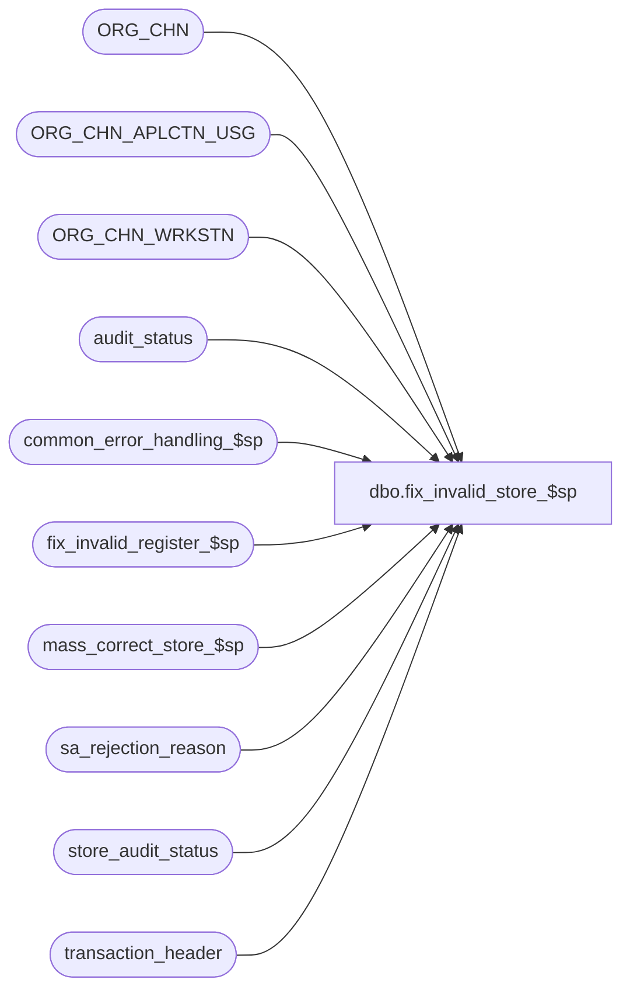

# dbo.fix_invalid_store_$sp

**Database:** auditworks_external  
**Server:** bedrockdb01  

## Architecture Diagram



## Table Dependencies

| Referenced Table |
|---|
| ORG_CHN |
| ORG_CHN_APLCTN_USG |
| ORG_CHN_WRKSTN |
| audit_status |
| common_error_handling_$sp |
| fix_invalid_register_$sp |
| mass_correct_store_$sp |
| sa_rejection_reason |
| store_audit_status |
| transaction_header |

## Stored Procedure Code

```sql
create proc [dbo].[fix_invalid_store_$sp] 
( 
  @process_id			binary(16), 
  @user_id			int
)

AS

/*
PROC NAME: fix_invalid_store_$sp
DESC: 	This proc will search for any invalid store S/A rejects for which the store is now valid. 
	For any such store, set the status to 8 (invalid register), and revalidate all the Invalid register rejects. 
	For each store/register/date that is now fixed, correct the transactions by moving them (fix_invalid_register_$sp).
	Also call mass_correct_store_$sp to fix I/F rejects involving bad stores. Rollforward logic is unnecessary
	because the calling procedure will retry the job whenever a job aborts.
	
	Called by mass_auto_revalidate_$sp.

  HISTORY:
Date     Name           Defect#  Description
Aug08,05 Paul           DV-1312  look at ACTV flag
Mar23,05 Paul           DV-1218  reordered statements inside begin tran to reduce chance of deadlocks, added comments
Nov22,04 David          DV-1181  New.

*/

DECLARE @cursor_open			tinyint,
	@errmsg				nvarchar(255),
	@errno				int,
	@function_no			smallint,
	@message_id			int,
	@object_name			nvarchar(255),
	@operation_name			nvarchar(100),
	@process_name			nvarchar(100),
	@register_no			int,
	@rows				int,
	@store_no			int

SELECT  @process_name = 'fix_invalid_store_$sp',
	@message_id = 201068,
	@cursor_open = 0, 
	@function_no = 95


-- Create a list of rejected stores that can now be corrected.
SELECT DISTINCT u.ORG_CHN_NUM
  INTO #fixed_invalid_store
  FROM ORG_CHN_APLCTN_USG u, ORG_CHN c, store_audit_status s 
 WHERE u.APLCTN_ID = 300
   AND u.VLDTY = 1 -- now valid for sa
   AND u.ORG_CHN_NUM = c.ORG_CHN_NUM
   AND c.ACTV = 1
   AND s.store_no = c.ORG_CHN_NUM
   AND s.store_audit_status = 7

SELECT @errno = @@error, @rows = @@rowcount
IF @errno != 0
BEGIN
  SELECT @errmsg = 'Failed to create #valid_stores',
          @object_name = '#valid_stores',
          @operation_name = 'SELECT'
  GOTO error
END

IF @rows > 0 -- some sa rejects can be corrected
BEGIN  

  UPDATE sa_rejection_reason
     SET violated_sareject_rule = 1  -- Invalid Register no.
    FROM sa_rejection_reason r, transaction_header h, #fixed_invalid_store t
   WHERE violated_sareject_rule = 7  -- Invalid Store no.               
     AND h.transaction_id = r.transaction_id
     AND h.store_no = t.ORG_CHN_NUM

  SELECT @errno = @@error
  IF @errno != 0
  BEGIN
    SELECT @errmsg = 'Failed to change violated_sareject_rule from 7 to 1.',
           @object_name = 'sa_rejection_reason',
           @operation_name = 'UPDATE'
    GOTO error
  END

  BEGIN TRAN

  UPDATE audit_status
     SET audit_status = 8
    FROM #fixed_invalid_store t, audit_status s
   WHERE s.store_no = t.ORG_CHN_NUM
     AND s.audit_status = 7
  
  SELECT @errno = @@error
  IF @errno != 0
  BEGIN
    SELECT @errmsg = 'Failed to set audit_status to 8.',
           @object_name = 'audit_status',
           @operation_name = 'UPDATE'
    GOTO error
  END

  UPDATE store_audit_status
     SET store_audit_status = 8
    FROM #fixed_invalid_store t, store_audit_status s
   WHERE s.store_no = t.ORG_CHN_NUM
     AND s.store_audit_status = 7
  
  SELECT @errno = @@error
  IF @errno != 0
  BEGIN
    SELECT @errmsg = 'Failed to set store_audit_status to 8.',
           @object_name = 'store_audit_status',
           @operation_name = 'UPDATE'
    GOTO error
  END

  COMMIT TRAN

END -- IF @rows > 0

DROP TABLE #fixed_invalid_store


-- Check if registers are now valid, and 'move' them.
DECLARE fixed_register_crsr CURSOR FAST_FORWARD
    FOR
 SELECT DISTINCT store_no, register_no
   FROM audit_status s WITH (NOLOCK) -- no other function looks at status 8
  WHERE audit_status = 8
    AND EXISTS (SELECT 1
                  FROM ORG_CHN_WRKSTN -- register now exists
                 WHERE ORG_CHN_NUM = s.store_no
                   AND WRKSTN_NUM = s.register_no
                   AND ACTV = 1)
 ORDER BY store_no, register_no

OPEN fixed_register_crsr

SELECT @errno = @@error
IF @errno != 0
  BEGIN
    SELECT @errmsg = 'Failed to open cursor fixed_register_crsr',
           @object_name    = 'fixed_register_crsr',
           @operation_name = 'OPEN'
    GOTO error
  END

SELECT @cursor_open = 1

WHILE 1=1
BEGIN

  FETCH fixed_register_crsr 
   INTO @store_no, @register_no

  IF @@fetch_status <> 0 
    BREAK

  EXEC fix_invalid_register_$sp 
  	@process_id  = @process_id, 
  	@user_id     = @user_id,
  	@store_no    = @store_no,
  	@register_no = @register_no
  
  SELECT @errno = @@error
  IF @errno !=0
  BEGIN
    IF @errmsg IS NULL 
      SELECT @errmsg = 'Failed to execute fix_invalid_register_$sp.'
    SELECT @object_name = 'fix_invalid_register_$sp',
           @operation_name = 'EXEC'
    GOTO error
  END

END -- while 1=1

CLOSE fixed_register_crsr
DEALLOCATE fixed_register_crsr

SELECT @cursor_open = 0


-- Fix bad store I/F rejects.
EXEC mass_correct_store_$sp 
	@process_id = @process_id, 
	@user_id    = @user_id
  
  SELECT @errno = @@error
  IF @errno !=0
  BEGIN
    IF @errmsg IS NULL 
      SELECT @errmsg = 'Failed to execute mass_correct_store_$sp.'
    SELECT @object_name = 'mass_correct_store_$sp',
           @operation_name = 'EXEC'
    GOTO error
  END


RETURN 


error:

  IF @cursor_open = 1
  BEGIN
    CLOSE fixed_register_crsr
    DEALLOCATE fixed_register_crsr
  END

  EXEC common_error_handling_$sp @function_no, @errno, @errmsg, 0, @message_id, @process_name,
       @object_name, @operation_name, 0, 1, 0, null, 0, null, null, null, null, null,
       null, 0, @process_id, @user_id

  RETURN
```

