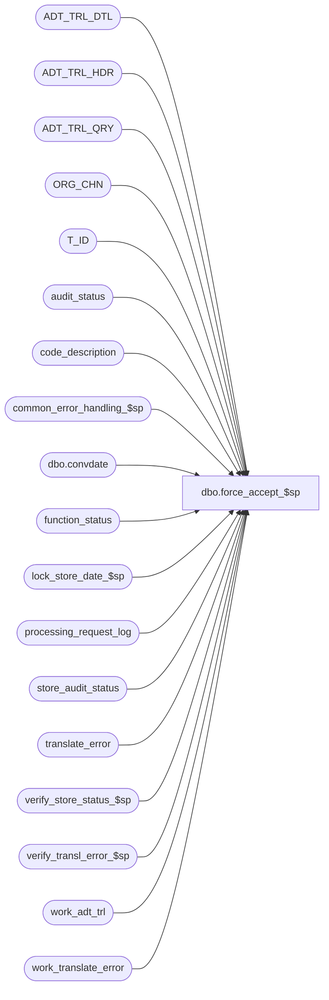

# dbo.force_accept_$sp

**Database:** auditworks_external  
**Server:** bedrockdb01  

## Architecture Diagram



## Table Dependencies

| Referenced Table |
|---|
| ADT_TRL_DTL |
| ADT_TRL_HDR |
| ADT_TRL_QRY |
| ORG_CHN |
| T_ID |
| audit_status |
| code_description |
| common_error_handling_$sp |
| dbo.convdate |
| function_status |
| lock_store_date_$sp |
| processing_request_log |
| store_audit_status |
| translate_error |
| verify_store_status_$sp |
| verify_transl_error_$sp |
| work_adt_trl |
| work_translate_error |

## Stored Procedure Code

```sql
create proc [dbo].[force_accept_$sp] 
 @process_id     binary(16), 
 @user_id        int,
 @datetime_of_request datetime

AS

/* Proc name : force_accept_$sp
   Description: Sets audit_status to accepted = 300 if the only auditing concerns are
     related to media rec. Sets store_audit_status to the min audit_status.
   Called by frontend.

HISTORY
Date     Author	       Def# Description
Jan18,12 Vicci       132439 Remove references to CRDM user-defined string datatypes from S/A since CRDM is not changing them to support unicode.
Dec01,10 Paul        120661 Set missing_verified = 1 and translate_error_verified = 1 when force accepting (SA5 gui requirement)
Mar15,10 Vicci       115428 Don't call translate error verification if there are no translate errors;  use correct date
                            when determining if translate errors exist; obtain "before" values from audit status for 
                            audit-trail logging purposes BEFORE audit status is updated instead of after;  don't try to handle
                            an all regist case since the store level entries are always replaced by register level ones in the
                            accept_stores_$sp function;  since the cursor and processing status updates are by register, also 
                            limit the audit-status updates (which occur in the loop) to the current register.
                            Make @datetime_of_request a datetime to match UI.
Mar07,07 Phu    75035/75036 Set auto_accepted = 1 when store-dates are auto-accepted by edit/manual functions.
Nov17,05 Paul       DV-1323 applied 63241 to SA5, drop temp table, minimize begin tran, added nolock hints
Jun08,05 Paul       DV-1273 corrected audit trail
Sep17,04 Maryam     DV-1146 replace user name with user_id.
Aug30,04 Maryam     DV-1120 Use convdate function for dates when logging the audit trail.
Jul27,04 Maryam     DV-1071 receive @process_id, use ORG_CHN_WRKSTN instead of register table.
May20,04 David      DV-1071 Use ORG_CHN table as the new Store table, Use new audit trail tables.
Nov15,05 Daphna       63241 do verify_transl_error BEFORE setting audit_status = 300
                            to avoid having audit_status reset to 200 
Dec17,02 Paul       1-HCTFY pass in action + 10 to verify_transl_error_$sp,
				set @before, @after description to match Oracle.
Nov22,02 HenryW        5206 To call verify_transl_error_$sp.
Oct29,02 Winnie	    1-FGESD Add logic for moving Invalid Register.
Sep18,02 HenryW	    1-EWT2T To verify remaining translate errors.
Mar07,02 Daphna     AW-8467 update function_status set entry_date = datetime of request
Dec11,01 Daphna     1-9I4IJ Remove deletion of function status, now done by Front End (03.00)
                            Added R3 Error Handling
Aug10,01 Daphna        8466 Insert/Update/Delete function status for recovery
                            process status 200 renamed 47                             
                            Ignore requests for invalid store, reg or date
Jun14,01 Winnie	       8085 correct audit trail logic
Feb05,01 Phu           7324 select min(audit_status) to avoid error 1422
Dec21,00 Winnie        6791 Audit trail enchancements.
May31,00 Paul          6394 pass flag to verify_store_status_$sp to avoid checking store level over/short.
May12,00 Paul          6302 Do not call request_registers_$sp since registers were already
		             inserted by accept_register_$sp. Call verify_store_status_$sp.
Mar01,00 Phu           5900 Change @@fetch_status > 0 to @@fetch_status <> 0 for MS SQL compatibility
Sep27,99 Paul          5409 Allow forceaccept of store
Jun15,99 Shapoor       4799 The store/date was being left LOCKED
Mar23,99 Paul          4351 Check store level over/short
         Phu           Author
*/

DECLARE
	@after_description		nvarchar(255),
	@current_date 			smalldatetime,
	@cursor_open 			tinyint,
	@date_reject_id 		tinyint,
	@errmsg 			nvarchar(255),
	@errno 				int,
	@errnum 			int,
	@min_audit_status 		smallint,
	@process_no 			smallint,
	@processing_status 		smallint,
	@sales_date 			smalldatetime,
	@sep				nchar(1),
	@store_name			nvarchar(255),
	@store_no 			int,
	@rows				int,
	@rows_accepted			int,
	-- error handling 
	@process_name 			nvarchar(100),
	@object_name			nvarchar(255),
	@operation_name			nvarchar(100),
	@message_id			int,
	@log_error_flag			tinyint,
	-- new audit trail tables
	@ENTRY_ID			T_ID,
	@TBL_NAME			nvarchar(255),
	@TBL_KEY			nvarchar(255),
	@TBL_KEY_RSRC_NAME		nvarchar(255),
	@TBL_KEY_RSRC_PRMS		nvarchar(255),
	@transl_error_rows		int,
	@rows_to_be_closed		int,
	@after_description_closed	nvarchar(255)


SET NOCOUNT ON

SELECT	@current_date = getdate(),
		@cursor_open = 0,
		@process_no = 76,
		@process_name = 'force_accept',
		@message_id = 201068,
		@log_error_flag = 0,  -- not called by smartload
		@sep = nchar(12) -- audit trail seperator

IF  @datetime_of_request IS NULL /* then */
BEGIN
  SELECT @errno = 201510,
         @message_id = 201510,
         @errmsg = 'Invalid passing arguments',
         @object_name = 'force_accept',
  @operation_name = 'EXECUTE PROCEDURE'
  GOTO error
END

CREATE TABLE #register_status (
	store_no		int not null,
	register_no		smallint not null,
	sales_date		smalldatetime not null,
	date_reject_id		tinyint not null,
	processing_status	smallint not null,
	audit_status		smallint not null,
	missing_qty		numeric(12,0) not null,
	translate_error_qty	smallint not null )

SELECT @errno = @@error
IF @errno <> 0
BEGIN
  SELECT @errmsg = 'Failed to create temp table #register_status',
         @object_name = '#register_status',
         @operation_name = 'CREATE TEMP TABLE'
  GOTO error
END

CREATE TABLE #store_list (
	store_no		int not null,
	sales_date		smalldatetime not null,
	date_reject_id		tinyint not null)

SELECT @errno = @@error
IF @errno <> 0
BEGIN
  SELECT @errmsg = 'Failed to create temp table #store_list',
         @object_name = '#store_list',
         @operation_name = 'CREATE TEMP TABLE'
  GOTO error
END

SELECT @after_description = code_display_descr
  FROM code_description
 WHERE code_type = 13 -- audit_status
   AND code = 300

SELECT @errno = @@error
IF @errno <> 0
BEGIN
  SELECT @errmsg = 'set @after_description',
     @object_name = 'code_description',
         @operation_name = 'SELECT'
  GOTO error
END

IF @after_description IS NULL -- then
  SELECT @after_description = 'Accepted'

SELECT @after_description_closed = code_display_descr
  FROM code_description
 WHERE code_type = 13 -- audit_status
   AND code = 901
SELECT @errno = @@error
IF @errno <> 0
BEGIN
  SELECT @errmsg = 'set @after_description_closed',
     @object_name = 'code_description',
         @operation_name = 'SELECT'
  GOTO error
END

IF @after_description_closed IS NULL -- then
  SELECT @after_description_closed = 'Closed' 

INSERT INTO #store_list (
	store_no,
	sales_date,
	date_reject_id)
SELECT DISTINCT store_no,
	sales_date,
	date_reject_id
  FROM processing_request_log WITH (NOLOCK)
 WHERE user_id = @user_id
   AND request_datetime = @datetime_of_request
   AND processing_status != 0
   AND processing_status <= 20

SELECT @errno = @@error
IF @errno <> 0
BEGIN
  SELECT @errmsg = 'Unable to insert #store_list',
         @object_name = '#store_list',
         @operation_name = 'INSERT'
  GOTO error
END

SELECT @cursor_open = 1

DECLARE process_force_accept_crsr CURSOR FAST_FORWARD
FOR
SELECT 	store_no,
	sales_date,
	date_reject_id
FROM #store_list WITH (NOLOCK)

OPEN process_force_accept_crsr

SELECT @errno = @@error
IF @errno <> 0
BEGIN
  SELECT @errmsg = 'Unable to open cursor process_force_accept_crsr',
         @object_name = 'process_force_accept_crsr',
         @operation_name = 'OPEN'
  GOTO error
END

SELECT @cursor_open = 2

WHILE 1 = 1
BEGIN
  FETCH process_force_accept_crsr INTO
   	@store_no,
	@sales_date,
	@date_reject_id

  IF @@fetch_status <> 0
    BREAK

  SELECT @errno = 0
      
  UPDATE function_status
     SET store_no = @store_no,
	  transaction_date = @sales_date,
         date_reject_id = @date_reject_id,
         status = 1,
         entry_date = @datetime_of_request    -- def 8467
   WHERE user_id = @user_id
     AND function_no = @process_no
     AND process_id = @process_id
     
  SELECT @errno = @@error,
         @rows = @@rowcount
  IF @errno <> 0
  BEGIN
    SELECT @errmsg = 'store_no, date, status = 1', 
           @object_name = 'function_status',
           @operation_name = 'UPDATE'
    GOTO error
  END
  
  IF @rows = 0 -- no status row
  BEGIN
    INSERT function_status
           (user_id, process_id, function_no, status, entry_date, store_no,
            register_no, transaction_date, date_reject_id)
    VALUES (@user_id, @process_id, @process_no, 1,@datetime_of_request, @store_no,
              0, @sales_date, @date_reject_id)
  
    SELECT @errno = @@error
    IF @errno <> 0
    BEGIN
      SELECT @errmsg = 'Failed to INSERT function_status', 
             @object_name = 'function_status',
             @operation_name = 'INSERT'
      GOTO error
    END          
  END -- @rows = 0:  no status row       

  EXEC lock_store_date_$sp @process_id, @user_id, @store_no, @sales_date, @date_reject_id,
      @process_no, @message_id OUTPUT

  SELECT @errno = @@error
  IF @errno <> 0 AND @errno <> 201550
  BEGIN
     SELECT @errmsg = 'Unable to execute lock_store_date_$sp', 
            @operation_name = 'EXECUTE',
            @object_name = 'lock_store_date_$sp'
     GOTO error
  END

  IF @message_id = 201550 /* store_date currently in use. bypass it. */
  BEGIN
    UPDATE processing_request_log
       SET processing_status = 47
     WHERE user_id = @user_id
       AND request_datetime = @datetime_of_request
       AND store_no = @store_no
       AND sales_date = @sales_date
       AND date_reject_id = @date_reject_id
 
 SELECT @errno = @@error
  IF @errno <> 0
    BEGIN
      SELECT @errmsg = 'processing_status = 47', 
	  @operation_name = 'UPDATE',
	  @object_name = 'processing_request_log',
	  @message_id = 201068 -- database error
      GOTO error
    END

    SELECT @message_id = 201068
 
    CONTINUE
 
  END -- @message_id = 201550 : store_date currently in use. bypass it. 

  INSERT #register_status (
	    store_no,
	    register_no,
	    sales_date,
	    date_reject_id,
	    processing_status,
	    audit_status,
	    missing_qty,
	    translate_error_qty )
  SELECT rl.store_no,
	    rl.register_no,
	    rl.sales_date,
	    rl.date_reject_id,
	    rl.processing_status,
	    st.audit_status,
	    st.missing_qty,
	    st.translate_error_qty
    FROM processing_request_log rl WITH (NOLOCK), audit_status st WITH (NOLOCK)
   WHERE rl.user_id = @user_id
     AND request_datetime = @datetime_of_request
     AND rl.store_no = @store_no
     AND rl.sales_date = @sales_date
     AND rl.date_reject_id = @date_reject_id
     AND rl.processing_status != 0
     AND rl.processing_status <= 20
     AND rl.store_no = st.store_no
     AND rl.sales_date = st.sales_date
     AND rl.date_reject_id = st.date_reject_id
     AND rl.register_no = st.register_no

  SELECT @errno = @@error
  IF @errno <> 0
  BEGIN
    SELECT @errmsg = 'FROM processing_request_log rl, audit_status st', 
             @operation_name = 'INSERT',
             @object_name = '#register_status'
    GOTO error
  END

  UPDATE #register_status
     SET processing_status = 41 -- Ignored -Store/Register closed/unused
   WHERE audit_status IN (900,901)

  SELECT @errno = @@error
  IF @errno <> 0
  BEGIN
    SELECT @errmsg = 'processing_status = 41', 
             @operation_name = 'UPDATE',
             @object_name = '#register_status'
    GOTO error
  END
  
  UPDATE #register_status
     SET processing_status = 42 -- Ignored -Transactions deleted
   WHERE audit_status IN (902,904)

  SELECT @errno = @@error
  IF @errno <> 0
  BEGIN
    SELECT @errmsg = 'processing_status = 42', 
             @operation_name = 'UPDATE',
           @object_name = '#register_status'
    GOTO error
  END

  UPDATE #register_status
     SET processing_status = 43 -- Ignored -Transactions moved
   WHERE audit_status IN (903,905,906)

  SELECT @errno = @@error
  IF @errno <> 0
  BEGIN
    SELECT @errmsg = 'processing_status = 43', 
             @operation_name = 'UPDATE',
             @object_name = '#register_status'
    GOTO error
  END
  
  UPDATE #register_status
     SET processing_status = 44 -- Ignored -Invalid Store
   WHERE audit_status = 7

  SELECT @errno = @@error
  IF @errno <> 0
  BEGIN
    SELECT @errmsg = 'processing_status = 44', 
             @operation_name = 'UPDATE',
             @object_name = '#register_status'
    GOTO error
  END
  
  UPDATE #register_status
     SET processing_status = 45 -- Ignored -Invalid Register
   WHERE audit_status = 8

  SELECT @errno = @@error
  IF @errno <> 0
  BEGIN
    SELECT @errmsg = 'processing_status = 45', 
             @operation_name = 'UPDATE',
             @object_name = '#register_status'
    GOTO error
  END
  
  UPDATE #register_status
     SET processing_status = 46 -- Ignored - Invalid Date
   WHERE date_reject_id != 0

  SELECT @errno = @@error
  IF @errno <> 0
  BEGIN
    SELECT @errmsg = 'processing_status = 46', 
             @operation_name = 'UPDATE',
             @object_name = '#register_status'
    GOTO error
  END
  
  UPDATE processing_request_log
     SET processing_status = rs.processing_status
    FROM #register_status rs, processing_request_log rl
   WHERE rl.user_id = @user_id
     AND rl.request_datetime = @datetime_of_request
     AND rs.processing_status >= 41
     AND rs.store_no = rl.store_no
     AND rs.register_no = rl.register_no
     AND rs.sales_date = rl.sales_date
     AND rs.date_reject_id = rl.date_reject_id

  SELECT @errno = @@error
  IF @errno <> 0
  BEGIN
    SELECT @errmsg = 'closed',
      @object_name = 'processing_request_log',
           @operation_name = 'UPDATE'
    GOTO error
  END


/* log information into Audit trail header and audit trail detail if the audit status changes */

  UPDATE processing_request_log
    SET processing_status = 50
   FROM processing_request_log rl, audit_status st WITH (NOLOCK)
  WHERE rl.user_id = @user_id
    AND rl.request_datetime = @datetime_of_request
    AND rl.processing_status < 20
    AND rl.store_no = @store_no
    AND rl.sales_date = @sales_date
    AND rl.date_reject_id = @date_reject_id
    AND st.store_no = rl.store_no
    AND st.register_no = rl.register_no
    AND st.sales_date = rl.sales_date
    AND st.date_reject_id = rl.date_reject_id
    AND st.audit_status IN (100, 200)
  SELECT @errno = @@error, 
         @rows_accepted = @@rowcount
  IF @errno <> 0
  BEGIN
      SELECT @errmsg = 'processing_status = 50',
             @object_name = 'processing_request_log',
             @operation_name = 'UPDATE'
      GOTO error
  END
  
  IF EXISTS (SELECT 1
               FROM processing_request_log
              WHERE user_id = @user_id
                AND request_datetime = @datetime_of_request
                AND store_no = @store_no
                AND sales_date = @sales_date
                AND date_reject_id = @date_reject_id
                AND processing_status = 20) -- Cannot be Accepted -Missing Store/Reg
    SELECT @rows_to_be_closed = 1
  ELSE
    SELECT @rows_to_be_closed = 0
    
  IF @rows_to_be_closed = 1 OR @rows_accepted > 0
  BEGIN
    --log audit trail now to get right before values
      SELECT @store_name = SUBSTRING(ORG_CHN_NAME,1,30)
        FROM ORG_CHN
       WHERE ORG_CHN_NUM = @store_no
      IF @errno <> 0
      BEGIN
        SELECT @errmsg = '@store_name',
               @object_name = 'ORG_CHN',
               @operation_name = 'SELECT'
        GOTO error
      END

      IF @store_name IS NULL
        SELECT @store_name = '  '
        
      SELECT @TBL_NAME = 'AUDIT_STATUS',
             @TBL_KEY_RSRC_NAME = 'TK_STOR_TRAN_DATE_REGI_DATE_REJE_ID'

      /* Use a work table to avoid multiple joins to get entry_id */
      DELETE work_adt_trl 
       WHERE process_id = @process_id
      SELECT @errno = @@error
      IF @errno !=0
      BEGIN
        SELECT @errmsg = 'Failed to clean up work_adt_trl',
	       @operation_name = 'DELETE',
	       @object_name = 'work_adt_trl'
        GOTO error
      END       

      INSERT INTO work_adt_trl (
		  process_id,
		  entry_id,
		  entry_date,
		  register_no, 
		  processing_status)
      SELECT @process_id,
	     newid(),
	     getdate(),
	     register_no,
	     processing_status
	FROM processing_request_log
       WHERE user_id = @user_id
         AND request_datetime = @datetime_of_request
         AND store_no = @store_no
         AND sales_date = @sales_date
         AND date_reject_id = @date_reject_id
         AND processing_status in (20, 50)
      SELECT @errno = @@error
      IF @errno !=0
      BEGIN
        SELECT @errmsg = 'Failed to populate work_adt_trl',
		@operation_name = 'INSERT',
		@object_name = 'work_adt_trl'
        GOTO error
      END       
             
      INSERT INTO ADT_TRL_HDR (
	     ENTRY_ID,
	     ENTRY_DATE_TIME,
	     USER_ID,
	     APP_ID,
	     ROOT_TBL_NAME,
	     ROOT_TBL_KEY,
	     ROOT_TBL_KEY_RSRC_NAME,
	     ROOT_TBL_KEY_RSRC_PRMS,
	     FNCTN_NUM)
      SELECT w.entry_id,
	     getdate(), 
	     @user_id,
	     300,
	     @TBL_NAME,
	     convert(nvarchar, @store_no) + @sep + dbo.convdate(@sales_date) + @sep + convert(nvarchar, w.register_no) + @sep + convert(nvarchar, @date_reject_id),
	     @TBL_KEY_RSRC_NAME,
	     convert(nvarchar, @store_no) + ' - ' + @store_name + @sep + dbo.convdate(@sales_date) + @sep + convert(nvarchar, w.register_no) + @sep + convert(nvarchar, @date_reject_id),
	     @process_no
        FROM work_adt_trl w
       WHERE process_id = @process_id 
      SELECT @errno = @@error 
      IF @errno !=0
      BEGIN
        SELECT @errmsg = 'Failed to log execution of Force Accept in audit trail',
               @operation_name ='INSERT',
               @object_name = 'ADT_TRL_HDR' 
        GOTO error
      END   
      
      INSERT INTO  ADT_TRL_DTL (
	     ENTRY_ID,
	     TBL_NAME,
	     TBL_KEY,
	     TBL_KEY_RSRC_NAME,
	     TBL_KEY_RSRC_PRMS,
	     ACTN_CODE,
	     CLMN_NAME,
	     OLD_VAL,
	     NEW_VAL)
      SELECT w.entry_id,
	     @TBL_NAME,
	     convert(nvarchar, @store_no) + @sep + dbo.convdate(@sales_date) + @sep + convert(nvarchar, w.register_no) + @sep + convert(nvarchar, @date_reject_id),
	     @TBL_KEY_RSRC_NAME,
	     convert(nvarchar, @store_no) + ' - ' + @store_name + @sep + dbo.convdate(@sales_date) + @sep + convert(nvarchar, w.register_no) + @sep + convert(nvarchar, @date_reject_id),
	     'M',
	     @TBL_NAME,
	     cd.code_display_descr,
	     CASE WHEN w.processing_status = 20 THEN @after_description_closed ELSE @after_description END
	FROM work_adt_trl w, audit_status ast, code_description cd
       WHERE w.process_id = @process_id
         AND ast.store_no = @store_no
	 AND ast.sales_date = @sales_date
	 AND ast.date_reject_id = @date_reject_id
	 AND ast.register_no = w.register_no
	 AND ast.audit_status = cd.code
	 AND cd.code_type = 13
      SELECT @errno = @@error 
      IF @errno !=0
      BEGIN
        SELECT @errmsg = 'Failed to indicate prior audit status in Audit Trail Detail',
               @operation_name ='INSERT',
               @object_name = 'ADT_TRL_DTL' 
        GOTO error
      END
         
      INSERT INTO ADT_TRL_QRY (
	     ENTRY_ID,
	     QRY_KEY_NUM,
	     KEY_PART_VAL_1,
	     KEY_PART_VAL_2,
	     KEY_PART_VAL_3)
      SELECT w.entry_id,
	     301,
	     @store_no,
	     w.register_no,
	     dbo.convdate(@sales_date)
	FROM work_adt_trl w
       WHERE w.process_id = @process_id
      SELECT @errno = @@error 
     IF @errno !=0
      BEGIN
        SELECT @errmsg = 'Unable to log query keys for force-accepted store/reg/date',
               @operation_name ='INSERT',
               @object_name = 'ADT_TRL_QRY' 
        GOTO error
      END
  END  --if audit status about to be updated
    
  --NOTE:  This code will never run because UI doesn't call force-accept for flag as unused rows; it updates them directly.
  IF @rows_to_be_closed = 1
  BEGIN
    UPDATE audit_status
       SET audit_status = 901,  --closed
           status_date = @current_date,
          status_set_by_user_id = @user_id
      FROM work_adt_trl w
   WHERE w.process_id = @process_id       
       AND w.processing_status = 20  -- Cannot be Accepted -Missing Store/Reg
       AND @store_no = audit_status.store_no
       AND w.register_no = audit_status.register_no
       AND @sales_date = audit_status.sales_date
       AND @date_reject_id = audit_status.date_reject_id
       AND audit_status.audit_status = 5; 
    SELECT @errno = @@error 
    IF @errno !=0
    BEGIN
      SELECT @errmsg = 'audit_status = 901',
             @operation_name ='UPDATE',
             @object_name = 'audit_status' 
      GOTO error
    END
  END  --IF @rows_to_be_closed = 1

  DELETE work_adt_trl 
   WHERE process_id = @process_id
  SELECT @errno = @@error
  IF @errno !=0
  BEGIN
    SELECT @errmsg = 'Failed to clean up work_adt_trl after using it',
	   @operation_name = 'DELETE',
	   @object_name = 'work_adt_trl'
    GOTO error
  END       

  IF @rows_accepted > 0 
  BEGIN
    -- Verify outstanding translate errors for this store/reg/date

    INSERT INTO work_translate_error (
    		process_id,
    		translate_error_id)
    SELECT @process_id, 
	   te.translate_error_id
      FROM #register_status rs, translate_error te WITH (NOLOCK)
     WHERE rs.store_no = te.store_no
       AND rs.register_no = te.register_no
       AND COALESCE(te.transaction_date, CONVERT(smalldatetime, CONVERT(nchar(8),te.entry_date_time,112))) = rs.sales_date
    SELECT @errno = @@error, @transl_error_rows = @@rowcount
    IF @errno <> 0
    BEGIN
   	  SELECT @errmsg = 'Verify remaining translate errors',
   	         @object_name = 'work_translate_error',
   	         @operation_name = 'INSERT'
  	  GOTO error
    END

    IF @transl_error_rows > 0
    BEGIN
      EXEC verify_transl_error_$sp @process_id, @user_id, 11
      SELECT @errno = @@error
      IF @errno <> 0
      BEGIN
   	  SELECT @errmsg = 'Verify remaining translate errors',
   	         @object_name = 'verify_transl_error_$sp',
   	         @operation_name = 'EXEC'
  	  GOTO error
      END
    END

    /* set missing_verified = 1 and translate_error_verified = 1 for registers that will be force-accepted
       since the SA5 gui requires this for display functionality */

    UPDATE audit_status
      SET missing_verified = 1
     FROM #register_status rs, audit_status st
    WHERE rs.missing_qty > 0
      AND rs.store_no = st.store_no
      AND rs.register_no = st.register_no
      AND rs.sales_date = st.sales_date
      AND rs.date_reject_id = st.date_reject_id
      AND st.missing_verified = 0
      AND st.audit_status IN (100, 200)
      AND st.store_no = @store_no
      AND st.sales_date = @sales_date

    SELECT @errno = @@error
    IF @errno <> 0
    BEGIN
   	  SELECT @errmsg = 'set missing_verified = 1',
   	         @object_name = 'audit_status',
   	         @operation_name = 'UPDATE'
  	  GOTO error
    END      

    UPDATE audit_status
      SET translate_error_verified = 1
     FROM #register_status rs, audit_status st
    WHERE rs.translate_error_qty > 0
      AND rs.store_no = st.store_no
      AND rs.register_no = st.register_no
      AND rs.sales_date = st.sales_date
      AND rs.date_reject_id = st.date_reject_id
      AND st.translate_error_verified = 0
      AND st.audit_status IN (100, 200)
      AND st.store_no = @store_no
      AND st.sales_date = @sales_date

    SELECT @errno = @@error
    IF @errno <> 0
    BEGIN
   	  SELECT @errmsg = 'set translate_error_verified = 1',
   	         @object_name = 'audit_status',
   	         @operation_name = 'UPDATE'
  	  GOTO error
    END  

  END -- If @rows_accepted > 0

  BEGIN TRAN

  IF @rows_accepted > 0
  BEGIN
    UPDATE audit_status
     SET audit_status = 300,
         status_date = @current_date,
         status_set_by_user_id = @user_id
      FROM #register_status rs, audit_status st
     WHERE rs.store_no = st.store_no
       AND rs.register_no = st.register_no
       AND rs.sales_date = st.sales_date
       AND rs.date_reject_id = st.date_reject_id
       AND st.audit_status IN (100, 200)
       AND st.store_no = @store_no
       AND st.sales_date = @sales_date

    SELECT @errno = @@error
    IF @errno <> 0
    BEGIN
   	  SELECT @errmsg = 'audit_status = 300',
   	         @object_name = 'audit_status',
   	         @operation_name = 'UPDATE'
  	  GOTO error
    END
  END -- If @rows_accepted > 0

  SELECT @errmsg = 'force accept' -- flag to avoid checking store-level over/short
  
  EXEC verify_store_status_$sp @process_id, @user_id, @store_no, @sales_date, @date_reject_id, @errmsg OUTPUT, 1, 2

  SELECT @errno = @@error
  IF @errno != 0
  BEGIN
    SELECT @errmsg = 'Unable to exec verify_store_status_$sp',
           @object_name = 'verify_store_status_$sp',
           @operation_name = 'EXECUTE'
    GOTO error
  END	

  UPDATE store_audit_status
    SET store_status_date = @current_date,
        status_set_by_user_id = @user_id,
        update_in_progress = 0  /* Unlock store_date */
  WHERE store_no = @store_no
    AND sales_date = @sales_date
    AND date_reject_id = @date_reject_id

  SELECT @errno = @@error
  IF @errno <> 0
  BEGIN
    SELECT @errmsg = 'unlock',
	@object_name = 'store_audit_status',
	@operation_name = 'UPDATE'
    GOTO error
  END

  COMMIT TRAN

  TRUNCATE TABLE #register_status

  SELECT @errno = @@error
  IF @errno <> 0
  BEGIN
	SELECT @errmsg = 'Unable to truncate table #register_status',
	  @object_name = '#register_status',
	     @operation_name = 'TRUNCATE TEMP TABLE'
	GOTO error
  END

END /* While 1=1 */

CLOSE process_force_accept_crsr
DEALLOCATE process_force_accept_crsr

DROP TABLE #register_status
DROP TABLE #store_list

SET NOCOUNT OFF

RETURN


error:   /* Common error handler */

	IF @@trancount > 0
		ROLLBACK TRANSACTION

	IF @cursor_open = 2
	  BEGIN
		CLOSE process_force_accept_crsr
		DEALLOCATE process_force_accept_crsr
	  END

	IF @cursor_open >= 1
	  BEGIN
		DROP TABLE #register_status
		DROP TABLE #store_list
	  END

	EXEC common_error_handling_$sp @process_no, @errno, @errmsg, 0, @message_id,
             @process_name, @object_name, @operation_name, @log_error_flag, 1, 0, null,
             0, null, null, null, null, null, null, 0, @process_id, @user_id
	RETURN
```

