# dbo.function_cleanup_$sp

**Database:** auditworks_external  
**Server:** bedrockdb01  

## Architecture Diagram

```mermaid
flowchart LR
    SP["dbo.function_cleanup_$sp"]
    ORG_CHN_WRKSTN(["ORG_CHN_WRKSTN"]) --> SP
    T_ID(["T_ID"]) --> SP
    audit_status(["audit_status"]) --> SP
    auditworks_system_flag(["auditworks_system_flag"]) --> SP
    clean_input__sp(["clean_input_$sp"]) --> SP
    common_error_handling__sp(["common_error_handling_$sp"]) --> SP
    cust_liab_pos_update__sp(["cust_liab_pos_update_$sp"]) --> SP
    cust_liability_edit__sp(["cust_liability_edit_$sp"]) --> SP
    cust_liability_revalidate__sp(["cust_liability_revalidate_$sp"]) --> SP
    day_end_cleanup__sp(["day_end_cleanup_$sp"]) --> SP
    dayend_workload(["dayend_workload"]) --> SP
    defer_transaction__sp(["defer_transaction_$sp"]) --> SP
    delete_details__sp(["delete_details_$sp"]) --> SP
    delete_if_details__sp(["delete_if_details_$sp"]) --> SP
    delete_store_reg_date__sp(["delete_store_reg_date_$sp"]) --> SP
    delete_transaction__sp(["delete_transaction_$sp"]) --> SP
    fix_invalid_register__sp(["fix_invalid_register_$sp"]) --> SP
    function_status(["function_status"]) --> SP
    function_status_rec(["function_status_rec"]) --> SP
    if_entry_datatype(["if_entry_datatype"]) --> SP
    if_rejection_reason(["if_rejection_reason"]) --> SP
    input_processing_status(["input_processing_status"]) --> SP
    interface_control(["interface_control"]) --> SP
    interface_status(["interface_status"]) --> SP
    mass_correct_employee__sp(["mass_correct_employee_$sp"]) --> SP
    mass_correct_tax__sp(["mass_correct_tax_$sp"]) --> SP
    mass_glc_post__sp(["mass_glc_post_$sp"]) --> SP
    move_store__sp(["move_store_$sp"]) --> SP
    process_error_log(["process_error_log"]) --> SP
    processing_request_log(["processing_request_log"]) --> SP
    rec_verification__sp(["rec_verification_$sp"]) --> SP
    reconciliation__sp(["reconciliation_$sp"]) --> SP
    recovery_rec_audit_status(["recovery_rec_audit_status"]) --> SP
    restore_original_trans__sp(["restore_original_trans_$sp"]) --> SP
    restore_tran_add__sp(["restore_tran_add_$sp"]) --> SP
    store_audit_status(["store_audit_status"]) --> SP
    tran_id_datatype(["tran_id_datatype"]) --> SP
    transaction_add__sp(["transaction_add_$sp"]) --> SP
    transaction_header(["transaction_header"]) --> SP
    transaction_line(["transaction_line"]) --> SP
    transaction_modify__sp(["transaction_modify_$sp"]) --> SP
    transaction_void__sp(["transaction_void_$sp"]) --> SP
    trno(["trno"]) --> SP
    update_chng_rspns_queue__sp(["update_chng_rspns_queue_$sp"]) --> SP
    verify_audit_status_flags__sp(["verify_audit_status_flags_$sp"]) --> SP
    verify_store_status__sp(["verify_store_status_$sp"]) --> SP
    verify_transl_error__sp(["verify_transl_error_$sp"]) --> SP
    work_audit_status_flags(["work_audit_status_flags"]) --> SP
    work_cust_liab_ref_list(["work_cust_liab_ref_list"]) --> SP
    work_delete_detail(["work_delete_detail"]) --> SP
    work_fix_register(["work_fix_register"]) --> SP
    work_if_header(["work_if_header"]) --> SP
    work_transaction_list(["work_transaction_list"]) --> SP
    work_transaction_move(["work_transaction_move"]) --> SP
```



## Table Dependencies

| Referenced Table |
|---|
| ORG_CHN_WRKSTN |
| T_ID |
| audit_status |
| auditworks_system_flag |
| clean_input_$sp |
| common_error_handling_$sp |
| cust_liab_pos_update_$sp |
| cust_liability_edit_$sp |
| cust_liability_revalidate_$sp |
| day_end_cleanup_$sp |
| dayend_workload |
| defer_transaction_$sp |
| delete_details_$sp |
| delete_if_details_$sp |
| delete_store_reg_date_$sp |
| delete_transaction_$sp |
| fix_invalid_register_$sp |
| function_status |
| function_status_rec |
| if_entry_datatype |
| if_rejection_reason |
| input_processing_status |
| interface_control |
| interface_status |
| mass_correct_employee_$sp |
| mass_correct_tax_$sp |
| mass_glc_post_$sp |
| move_store_$sp |
| process_error_log |
| processing_request_log |
| rec_verification_$sp |
| reconciliation_$sp |
| recovery_rec_audit_status |
| restore_original_trans_$sp |
| restore_tran_add_$sp |
| store_audit_status |
| tran_id_datatype |
| transaction_add_$sp |
| transaction_header |
| transaction_line |
| transaction_modify_$sp |
| transaction_void_$sp |
| trno |
| update_chng_rspns_queue_$sp |
| verify_audit_status_flags_$sp |
| verify_store_status_$sp |
| verify_transl_error_$sp |
| work_audit_status_flags |
| work_cust_liab_ref_list |
| work_delete_detail |
| work_fix_register |
| work_if_header |
| work_transaction_list |
| work_transaction_move |

## Stored Procedure Code

```sql
create proc dbo.function_cleanup_$sp @process_id      binary(16), -- guid
@lock_by_user_id int, -- user_id of the process calling the cleanup
@function_no     tinyint,
@errmsg          nvarchar(2000) OUTPUT

AS

/* 
PROC NAME: function_cleanup_$sp
     DESC: called by function_cleanup_main_$sp and by Archive Transaction Modification if the user cancels their modification instead of saving it.
           calls appropriate cleanup program based on function_no and status.

REMINDER TO CC: When manually recovering halted processes in SA5, it is recommended to use function_cleanup_main_$sp
                     (pass in the process_id including the 0x) instead of this proc.

  HISTORY: 
Date     Name        Defect# Desc
May05,15 Vicci    TFS-119660 for function 109 also clean up the "overall store/date lock" function status entry under 182 when call by fix future date.
Apr28,15 Vicci    TFS-118970 for function 82 (mass correct line object) also clean up the "overall store/date lock" function status entry under 182.
                             for function 112 (translate error verification trans add failure), release 140 or 117 for cleanup once done.
                             for function 117 cleanups also verify the errors under function 140.
Jan23,15 Vicci    TFS-101649 For function 70 (Media Rec), don't unlock unless 70 had the lock (which would be unusual). 
                             The call to reconciliation_$sp should already have unlocked the store/date itself if it was now able to lock and recover the store/date that it could not previously do.
                             Remember that reconciliation_$sp doesn't return an error if the store/date store_audit_status entry is still in use by another function, it just logs a new function status entry and skips it, 
                             so function cleanup should NOT be unlocking something that another process still has locked.
Jun25,14 Vicci     TFS-75199 Handle function 113 (mass_correct_emp_attribute_$sp).
Jan23,14 Vicci        149479 Use TRY/CATCH logic, since otherwise errors such as Error:8114 Message:Error converting data type nvarchar to numeric are not caught nor reported in any way.
Sep23,13 Vicci        146826 Expand @errmsg since expanded in transaction_add_$sp, transaction_modify_$ps, etc.
Jan21,13 Vicci      1-4A7WED Correct logic for Transaction Modify:  if a corresponding C/L halted
                             process exists with a status >=10, transaction has already been partially 
                             posted to C/L or has been rejected, so C/L halt must be recovered first to determine which.
                             If a corresponding C/L halted process exists with a status < 10, transaction can be
                             rolled back, but C/L halt must be recovered first so that I/F entry for both OUT and IN 
                             get marked as no longer outstanding and C/L work tables are cleaned up and C/L (228) halt
                             entry is removed.  Also, @date_reject_id which holds calling function for C/L entry was being
                             overlayed with transaction's date reject id, so use separate variable.
Mar11,11 Vicci         64852 Cleanup function 89 (mass revalidation of Tax I/F rejects).
Jan05,11 Vicci      1-464I90 Cleanup function 117 (translate error verification) to avoid work-table entries being left behind
                             when translate errors without store/reg/date/trans# were involved.
Nov10,10 Phu          122528 Cleanup any incomplete transactions created/reserved during transaction add.
Jun14,10 Paul       1-44YOPF Prevent cleaning up media rec 70 entries when dayend is still running for those store-dates
					because dayend will also try a cleanup of type 70 entries. ported 115882.
Mar29,10 Vicci        115375 ported from Oracle
Mar16,10 Vicci        115428 Recognize that processing_request_log.request_datetime is a datetime whereas entry_date is a smalldatetime.
Mar12,10 Vicci        115703 Set released_to_cleanup = 1 to marked the function as a halted process since the fact 
		             that the UI called function cleanup indicates that it detected that the function had failed.
		             Also, unlock function status record if error occurs.
Mar05,10 Vicci        115599 Pass @rec_process_id to transaction_add_$sp to allow for status 35 recovery.
Feb10,10 Vicci        115882 Recover function 67 (Mass Revalidate Missing Registers).
Feb15,10 Vicci        115915 Recover verification functions 115,223,224 correctly (first populate work_audit_status_flags)
Jan14,10 Vicci        115375 Recover function 140 Translate Error Verify
Dec10,09 Vicci        114698 If attempt to recover function 70 fails at status > 40 (after recovery_rec_audit_status
                             has already been deleted) still need to recover, so get status from function_status_rec
                             and don't delete just because recovery_rec_audit_status is empty.
Nov10,09 Paul         113168 If fixing invalid reg, then unlock store if status = 0.
Sep25,09 Vicci        113168 Pass date_reject_id to fix_invalid_register_$sp
Jul21,09 Vicci        109078 Clean up and restart Standard Import from Pre-loaded input
Oct16,08 Paul       1-3YDOA1 allow recovery attempt if lock_flag = 0 or if the last recovery attempt was over 30 min ago
Jul31,08 Paul          87777 corrected logic for function 78
Apr08,08 Paul          97584 Uplift 1-3QXQI6 to SA5
Jun19,07 Phu         DV-1364 Apply 85598 to SA5. Add logic for process 51 (ECP hours import via input cleanup)
Jan17,07 Tim         DV-1351 apply 78783 to SA5, 81391 is not applicable to SA5
Sep05,06 Tim         DV-1342 apply 73555 and 73485 to SA5
Mar15,06 Paul        DV-1331 apply 67999 to SA5
Feb20,06 Paul        DV-1328 delete work tables when recovering for fix_invalid_register_$sp
Nov15,05 Paul        DV-1321 add functions 91,96,115,223,224
Sep06,05 Paul        DV-1312 apply SA4 defects to SA5, defect 42946 not needed for SA5. 
Aug03,05 Paul        DV-1295 fix recovery logic for function 82
Jun21,05 Paul        DV-1282 pass back 'ROLLBACK' in @errmsg when cleanup succeeds but the user's work has been reversed.
Apr28,05 Paul        DV-1234 expand transaction_id to use tran_id_datatype
Mar07,05 Paul        DV-1216 apply 47977 to SA5
Dec01,04 David       DV-1181 Handle function 95 - mass correct store.
Nov19,04 Maryam      DV-1167 check the active flag for ORG_CHN_WRKSTN, remove obsolete reference to cashier (Paul)
Oct07,04 Paul        DV-1146 remove obsolete logic, pass user_id to sub procs
Jul30,04 David/Paul  DV-1071 Remove rollforward procs, pass entry_id to procs.
         Maryam      DV-1071 Use ORG_CHN_WRKSTN instead of register table. change the order of passing parameters for some procs,
                             pass @process_id to the sub procs.
Apr07,04 Sab	     DV-1068 SA 5 changes. Remove old glc, old media rec, pass in guid, remove user name from joins
Apr08,08 Paul       1-3QXQI6 Pass 237 as function_no when calling cust_liab_pos_update_$sp
Dec18.06 Daphna        81391 Use @legacy_media_rec_active to determine whether old or new media rec for Function70 recovery
Oct23.06 Daphna        78783 Ensure work_transaction_move is cleaned up in rollback scenario
Jun14,06 Vicci         73555 Don't try to clean up recovery_rec_audit_status entries 
                             locked by the edit
Jun13,06 Vicci         73485 Correctly determine whether old or new media rec applies; only delete function status entries
                             for the move when recovering the move.
Mar10,06 Vicci	       67999 Remove logical trading date handling rollforward associated with 
                             fix_invalid_register_$sp (superceded by SA5 changes)
Jan31,05 Daphna        47977 Recovery logic New media rec incomplete (function_no = 70)
Oct19,04 Daphna   42946 superceded by SA5 changes
Oct06,04 Vicci	       24301 Handle function 16 like 18
Oct17,03 Paul          16706 Don't unlock store if still locked by edit (phase2 not run yet or wierd concurrent edit, audit scenarios).
Jun20,03 Paul        1-KX549 remove username from call to verify_store_status_$sp, correctly account for defered i/f rejects,
				always call move_store_cleanup_$sp when cleaning up the move. Read tran header at begin
				of proc. also handle function 71 & 72 (verified/unverified media rec).
Apr15,03 Vicci	     7439    Handle function 73 (Initial Float load)
Mar27,03 Maryam      6248    Handle function_no 241 (C/L Balance Adjustment)  
Jan03,03 Sab	     1-FC32T To recalculate logical trading dates ONLY when fixing invalid registers.
Sep30,02 Paul S      1-FP17D handle no data found on register table (not all fn set register)
Sep27,02 David C     1-FKYLN Specify parameters when calling cust_liability_edit_$sp
Aug28,02 David C     1-EXXLD Update audit_status when cleaning up archived transaction modification.
MAY06,02 Daphna	     1-BMK21 Cleanup logic for CL Synchronization (process no = 237)	
Mar14,02 Henry	     1-A8XPT Add cleanup logic for mass correct translate (function 112).
Jan30,02 David C     1-9DI2T Lay foundation for archive transaction modification.
Jan22,02 Paul S      1-ADCGO correct cleanup logic for accept store
Dec04,01 David C     1-9ATXP Add cleanup logic for c/l revalidate (78), function no 242-249 and 
                             change code for delete transaction AND new error handling.
Sep17,01 David C        8742 Change 'if' statement to call restore_original_trans_$sp
AUG10,01 Daphna         8466 Add cleanup logic for accept/forceaccept/unaccept (function 75,76,77)
Sep17,01 David C        8747 Retrofit 8742 for version 2.46.25
Jul10,01 Paul	        8277 pass in media_rec_tran_id to rollforward_tran_modify_$sp
Jun15,01 Paul	        8082 Add cleanup logic for function 79 (mass correct credit card)
May18,01 Henry	        7369 Allows cleanup of user-defined IF rejection reasons.
May04,01 ShuZ	        7562 Add exception handler so as to return when no data found in function_status
Apr05,01 Bayani	        7376 Remove lines which accesses HO tables and proc.
Sep12,00 Paul S		6718 pass var by position when calling delete_store_reg_date_$sp.
Aug29,00 Paul S		6651 Pass function_no when calling rollforward_tran_modify_$sp.
May25,00 John G		5864 Change '= NULL' to 'IS NULL' where applicable to mirror Oracle.
May16,00 John G		6305 Change @tracking_id datatype from tinyint to smallint.
Apr03,00 Paul S		6149 Correct bad recovery logic in glc_mass_writeoff_$sp.
Mar06,00 John G 	6064 for glc_cleanup enlarge range of applicable function statuses.
Feb11,00 Daphna		5904 include function 109 (txn move to fix incorrect POS date-time)
			       in cleanup of halted move (9)
Dec13,99 Paul		5716 Handle function 152 as a transaction_add (function 150)
                      but do not delete transaction_header when rolling back.
Oct13,99 Daphna/Paul	5299 ensured TO and FROM stores unlocked after cleanup 
			       completed, or if move not yet started	
Jul28,99 Daphna F	5026 added call to delete_if_detail_$sp instead of deleting
			       if_transaction_header and setting off trigger
			     added call to delete_ho_detail_$sp instead of deleting
			       ho_transaction_header and setting off trigger
Jun11,99 Paul		4864 Correctly unlock store after add
Apr23,99 Daphna F	4475 for function_no = 9 (move) do unlock logic for status <= 1 
			       before calling move_store_cleanup_$sp
Feb25,99 Andrew V
Jan20,99 Mat C
Jan15,97 Sebastiano V	n/a  Author					

*/

DECLARE
  @all_registers		tinyint,
  @all_server_reg		tinyint,
  @assigned_register_group	smallint,
  @cleanup_flag			tinyint,
  @date_reject_id		tinyint,
  @dayend_in_progress		tinyint,
  @edit_timestamp		float,
  @employee_no			int,
  @errno			int,
  @entry_date			smalldatetime,
  @from_transaction_no		trno,
  @if_entry_no			if_entry_datatype,
  @in_out_both_flag		tinyint,
  @frontend_populated		tinyint,
  @immediate_dayend_requested	tinyint,
  @message_id			int,
  @move_flag			tinyint,
  @object_name			nvarchar(255),
  @operation_name		nvarchar(100),
  @process_name			nvarchar(100),
  @process_no 			smallint,
  @rec_process_id		numeric(12,0),
  @reference_type		tinyint,
  @register_no			smallint,
  @register_no_cursor		smallint,
  @reverse_flag			smallint,
  @rows				int,
  @status			tinyint,
  @rec_status			tinyint,
  @store_no			int,
  @too_late			tinyint,
  @to_cashier_no		int,
  @to_register_no		smallint,
  @to_store_no			int,
  @to_till_no			smallint,
  @to_transaction_date		smalldatetime,
  @to_transaction_no		trno,
  @tracking_id			smallint,
  @transaction_date		smalldatetime,
  @transaction_id		tran_id_datatype,
  @transaction_series		nchar(1),
  @open_cursor			tinyint,
  @error_code 			int,
  @user_id			int,
  @verified			tinyint,
  @source_function_no		tinyint,
  @ENTRY_ID			T_ID,
  @PRNT_WRKSTN_ID               binary(16),
  @errmsg2		        nvarchar(2000);

SELECT @open_cursor = 0,
	@cleanup_flag = 1,
	@process_no = 99,
	@process_name = 'function_cleanup_$sp',
	@message_id = 201068;

BEGIN TRY

IF @function_no = 152 -- called from front-end (tran add)
  SELECT @cleanup_flag = 2, -- partial cleanup (do not delete tran header)
         @function_no = 150;

/* Allow cleaning up if another user has not already locked function_status
   or if function_status was last locked more than one hour ago, i.e. when the previous recovery attempt failed. */
SELECT @errmsg = 'Unable to lock function_status. ',
       @object_name = 'function_status',
       @operation_name = 'UPDATE';
UPDATE function_status
  SET lock_flag = 1,
      lock_by_user_id = @lock_by_user_id,
      lock_date = getdate(),
      released_to_cleanup = 1
WHERE process_id = @process_id
  AND function_no = @function_no
  AND (lock_by_user_id IS NULL OR lock_by_user_id = @lock_by_user_id 
        OR lock_flag = 0 OR DATEDIFF(mi,lock_date,getdate()) > 30); -- > 30 min ago

SELECT @errmsg = 'Unable to verify prior errors for the function. ',
       @object_name = 'process_error_log',
       @operation_name = 'UPDATE';
UPDATE process_error_log
   SET verified = 1,
       verified_by_user_id = @lock_by_user_id
 WHERE process_no = CONVERT (smallint , @function_no)
   AND process_id = @process_id
   AND verified = 0;

IF @function_no = 117
BEGIN
SELECT @errmsg = 'Unable to verify prior errors for the function for Translate Error Verification which uses 2 function numbers. ',
       @object_name = 'process_error_log',
       @operation_name = 'UPDATE';
UPDATE process_error_log
   SET verified = 1,
       verified_by_user_id = @lock_by_user_id
 WHERE process_no = 140
   AND process_id = @process_id
   AND verified = 0;
END

SELECT @errmsg = 'Unable to determine current status of halted process. ',
       @object_name = 'function_status',
       @operation_name = 'SELECT';
SELECT @status = status,
       @transaction_id = transaction_id,
       @store_no = store_no,
       @transaction_date = transaction_date,
       @date_reject_id = date_reject_id,
       @register_no = register_no,
       @entry_date = entry_date,
       @rec_process_id = rec_process_id,
       @source_function_no = CASE WHEN @function_no = 228 THEN date_reject_id ELSE NULL END,  --1-4A7WED
       @ENTRY_ID = ENTRY_ID,
       @user_id = user_id -- user_id of halted process
  FROM function_status
 WHERE process_id = @process_id
   AND function_no = @function_no
   AND lock_flag = 1
   AND lock_by_user_id = @lock_by_user_id; -- prevent two users from cleaning up the same halted process simultaneously

IF @@rowcount = 0 -- 7562 if no row found (timing issue or locked by another user) then return
  RETURN;
  
IF @transaction_id > 0
BEGIN
  SELECT @errmsg = 'Unable to look up transaction information. ',
         @object_name = 'transaction_header',
         @operation_name = 'SELECT';
  SELECT @if_entry_no = copy_transaction_id,
	 @store_no = store_no,
	 @register_no = register_no,
	 @transaction_date = transaction_date,
	 @date_reject_id = date_reject_id
   FROM transaction_header
  WHERE transaction_id = @transaction_id;
END;

SELECT @errmsg = 'Unable to select the parent workstation id. ',
       @object_name = 'ORG_CHN_WRKSTN',
       @operation_name = 'SELECT';
SELECT @PRNT_WRKSTN_ID = ISNULL(PRNT_WRKSTN_ID,WRKSTN_ID)
  FROM ORG_CHN_WRKSTN
 WHERE ORG_CHN_NUM = @store_no
 AND WRKSTN_NUM = @register_no;

SELECT @errmsg = 'Unable to select the register number of the parent worksation. ';
SELECT @assigned_register_group = WRKSTN_NUM
  FROM ORG_CHN_WRKSTN
 WHERE WRKSTN_ID = @PRNT_WRKSTN_ID;
SELECT @rows = @@rowcount;
  
IF @rows = 0
  SELECT @assigned_register_group = @register_no;  -- defect 1-FP17D

IF @function_no IN (9,109) /* move , move to fix incorrect POS date-time */
BEGIN
  SELECT @errmsg = 'Unable to look up function information. ',
         @object_name = 'function_status',
         @operation_name = 'SELECT';
  SELECT @store_no = store_no,
	 @register_no = register_no,
	 @transaction_date = transaction_date,
	 @date_reject_id = date_reject_id,
	 @to_store_no = to_store_no,
	 @to_register_no = to_register_no,
	 @to_transaction_date = to_transaction_date,
	 @from_transaction_no = from_transaction_no,
	 @to_transaction_no = to_transaction_no,
	 @move_flag = move_flag,
	 @transaction_series = transaction_series,
	 @frontend_populated = frontend_populated,
	 @register_no_cursor = register_no_cursor,
	 @to_till_no = to_till_no,
	 @to_cashier_no	= to_cashier_no,
	 @in_out_both_flag = glc_type,
	 @all_server_reg = reference_type
   FROM function_status
   WHERE process_id = @process_id
     AND function_no = @function_no;

  IF @from_transaction_no <> -2 -- not fix invalid reg
  BEGIN
    IF @status >= 2  -- rollforward the move
    BEGIN
      SELECT @errmsg = 'Unable to execute procedure move_store_$sp (reg). ',
             @object_name = 'move_store_$sp',
             @operation_name = 'EXECUTE';
      EXEC move_store_$sp 
	@process_id             = @process_id,
	@user_id                = @user_id,		 
	@from_store_no 		= @store_no,
	@from_register_no 	= @register_no,
	@from_sales_date	= @transaction_date,
	@date_reject_id		= @date_reject_id,
	@from_transaction_no	= @from_transaction_no,
	@to_store_no		= @to_store_no,
	@to_register_no		= @to_register_no,
	@to_sales_date		= @to_transaction_date,
	@to_transaction_no	= @to_transaction_no,
	@move_flag		= @move_flag, 
	@errmsg 		= @errmsg OUTPUT,
	@frontend_populated	= @frontend_populated,
	@transaction_series	= @transaction_series,
	@to_till_no		= @to_till_no, 
	@to_cashier_no		= @to_cashier_no, 
	@function_no		= @function_no, 
	@register_no_cursor 	= @register_no_cursor,
	@function_status	= @status,
	@rec_process_id		= @rec_process_id, 
	@in_out_both_flag	= @in_out_both_flag, 
	@all_server_reg		= @all_server_reg;
    END; /*   IF @status >= 2 */
    ELSE  -- rollback
    BEGIN
      SELECT @errmsg = 'Unable to delete work_transaction_move. ',
             @object_name = 'work_transaction_move',
             @operation_name = 'DELETE';
      DELETE FROM work_transaction_move
       WHERE process_id = @process_id;
    END;  -- rollback
           
  END; /* @from_tran_no <> -2 */
  ELSE
  BEGIN -- @from_tran_no = -2 (fix invalid reg)
    IF @status > 0  /* fix invalid reg and work has been done, then try again */ 
    BEGIN
       SELECT @errmsg = 'Unable to execute procedure fix_invalid_register_$sp. ',
              @object_name = 'fix_invalid_register_$sp',
              @operation_name = 'EXECUTE';
       EXEC fix_invalid_register_$sp 
	@process_id            = @process_id,
	@user_id                = @user_id,		 
	@store_no 		= @store_no,
	@register_no 		= @register_no,
	@to_transaction_date	= @to_transaction_date,
	@to_till_no		= @to_till_no, 
	@to_cashier_no		= @to_cashier_no, 
	@function_status	= @status,
	@rec_process_id		= @rec_process_id,
	@date_reject_id		= @date_reject_id;
    END; -- If @status > 0
  END; -- else of if @from_tran_no <> -2 (fix_invalid_reg)

  /*  if move not started (@status <= 1) or cleanup completed:
      unlock stores, delete halted process, return to front end */
      
  SELECT @errmsg = 'Failed to unlock store_audit_status (MOVE). ',
         @object_name = 'store_audit_status',
         @operation_name = 'UPDATE';
  UPDATE store_audit_status
    SET update_in_progress = 0
   WHERE store_no = @store_no
     AND sales_date = @transaction_date
     AND date_reject_id = @date_reject_id
     AND update_in_progress > 4; -- don't unlock if still locked by edit

  SELECT @errmsg = 'Failed to unlock store_audit_status (to date). ',
         @object_name = 'store_audit_status',
         @operation_name = 'UPDATE';
  UPDATE store_audit_status
     SET update_in_progress = 0
   WHERE store_no = @to_store_no
     AND sales_date = @to_transaction_date
     AND date_reject_id = 0
     AND update_in_progress > 4; -- don't unlock if still locked by edit

  -- clean up rows for fix invalid reg
  SELECT @errmsg = 'Failed to delete work_transaction_move. ',
         @object_name = 'work_transaction_move',
         @operation_name = 'DELETE';
  DELETE FROM work_transaction_move
   WHERE process_id = @process_id;
	     
  SELECT @errmsg = 'Failed to delete work_fix_register. ',
         @object_name = 'work_fix_register';
  DELETE FROM work_fix_register
   WHERE process_id = @process_id;

  SELECT @errmsg = 'Failed to delete function_status (MOVE). ',
         @object_name = 'function_status';
  DELETE function_status
   WHERE process_id = @process_id
     AND (   function_no = @function_no  --defect 73485
          OR (function_no = 182 AND @move_flag in (2, 3)) --since fix future date creates 182 entry for lock
         );

  IF @status <= 1
     SELECT @errmsg = 'ROLLBACK';

  RETURN;
END; /* @function = 9,109 */

IF @function_no IN (16, 18) /* dayend housekeeping, dayend main */
BEGIN
  SELECT @immediate_dayend_requested = 0;

  SELECT @errmsg = 'Unable to execute procedure day_end_cleanup_$sp. ',
         @object_name = 'day_end_cleanup_$sp',
         @operation_name = 'EXECUTE';
  EXEC day_end_cleanup_$sp @process_id, 1, 1, @immediate_dayend_requested;
  
  RETURN;
END;

IF @function_no = 35 /* single delete transaction */
BEGIN
  IF @status = 1
  BEGIN
	-- Cleanup changes made in cust_liab_reject_$sp
    SELECT @errmsg='Cannot set interface_status_flag = 1. ',
           @object_name = 'interface_control',
           @operation_name = 'UPDATE';
    UPDATE interface_control
       SET interface_status_flag = 1
     WHERE transaction_id = @transaction_id
       AND interface_id = 28;
	
    SELECT @errmsg='Cannot set interface_rejection_flag = 0. ',
           @object_name = 'transaction_line',
           @operation_name = 'UPDATE';
    UPDATE transaction_line
       SET interface_rejection_flag = 0
	  FROM if_rejection_reason i, transaction_line tl
	 WHERE i.if_reject_reason = 100
	   AND i.transaction_id = @transaction_id
	   AND i.transaction_id = tl.transaction_id
	   AND tl.interface_rejection_flag != 0
	   AND i.line_id = tl.line_id
	   AND i.line_id NOT IN (SELECT line_id FROM if_rejection_reason ifr
	                          WHERE ifr.if_reject_reason != 100
				    AND ifr.transaction_id = @transaction_id);
	   -- Do not reset flag if if_rejects other than 100 exists for that line_id

    SELECT @errmsg='Cannot set if_rejection_flag = 0. ',
           @object_name = 'transaction_header',
           @operation_name = 'UPDATE';
    UPDATE transaction_header
       SET if_rejection_flag = 0
      FROM if_rejection_reason i, transaction_header th
	 WHERE th.if_rejection_flag != 0
	   AND th.transaction_id = i.transaction_id
	   AND i.if_reject_reason = 100
	  AND i.transaction_id = @transaction_id
	   AND NOT EXISTS (SELECT 1 FROM if_rejection_reason ifr
			    WHERE ifr.if_reject_reason != 100
			      AND ifr.transaction_id = @transaction_id);
	   -- Do not reset flag if if_rejects other than 100 exists for that transaction_id

        -- Remove if rejects created by cust_liab_reject_$sp
    SELECT @errmsg = 'Cannot delete if_rejects 100 from if_rejection_reason. ',
	   @object_name = 'if_rejection_reason',
	   @operation_name = 'DELETE';
    DELETE if_rejection_reason
     WHERE transaction_id = @transaction_id
       AND if_reject_reason = 100;
     
	/* Unlock store-date */
    SELECT @errmsg = 'Failed to unlock store_audit_status. ',
	   @object_name = 'store_audit_status',
	   @operation_name = 'UPDATE';
    UPDATE store_audit_status
       SET update_in_progress = 0
     WHERE store_no = @store_no
	   AND sales_date = @transaction_date
	   AND date_reject_id = @date_reject_id
	   AND update_in_progress > 4; -- don't unlock if still locked by edit

    SELECT @errmsg = 'Unable to delete function_status. ',
	   @object_name = 'function_status',
	   @operation_name = 'DELETE';
    DELETE function_status
     WHERE process_id = @process_id
       AND function_no = @function_no;

    SELECT @errmsg = 'ROLLBACK';

    RETURN;
  END;
  ELSE
    IF @status > 1
      BEGIN
        SELECT @errmsg = 'Unable to execute procedure delete_transaction_$sp. ',
	       @object_name = 'delete_transaction_$sp',
	       @operation_name = 'EXECUTE';
	EXEC delete_transaction_$sp @process_id, @user_id, @transaction_id, @ENTRY_ID, @status, @errmsg OUTPUT;	

	RETURN;
    END;
  END; /* if @function_no = 35 */

IF @function_no = 40 /* one valid/invalid store_date or store_reg_date */
BEGIN

  IF @status = 1
BEGIN

    SELECT @all_registers = 0;

    IF @register_no <= 0
    BEGIN

      SELECT @all_registers = 1;

      IF @register_no = 0 -- determine whether intent is all registers
      BEGIN
        SELECT @errmsg = 'Failed to determine if store/date has status >= 6. ',
	       @object_name = 'audit_status',
	       @operation_name = 'SELECT';
        IF EXISTS (SELECT 1
                     FROM audit_status
                    WHERE sales_date = @transaction_date
                      AND store_no = @store_no
                      AND register_no = 0
                      AND date_reject_id = @date_reject_id
                      AND audit_status >= 6)
          SELECT @all_registers = 0;
      END; -- @register_no = 0
    END; -- @register_no <= 0

    -- Cleanup changes made by cust_liability_reject_$sp
    SELECT @errmsg = 'Unable to SELECT INTO #work_if_reject_reason. ',
           @object_name = '#temp_if_reject',
           @operation_name = 'CREATE TABLE';
    SELECT i.transaction_id, i.line_id, i.if_reject_reason
      INTO #work_if_reject_reason
      FROM if_rejection_reason i, transaction_header t
     WHERE i.transaction_id = t.transaction_id
       AND i.process_id = @process_id -- set in cust_liability_reject_$sp
       AND t.store_no = @store_no
       AND t.transaction_date = @transaction_date
       AND t.date_reject_id = @date_reject_id
       AND (t.register_no = @register_no OR @all_registers = 1);

    --Remove lines that have IF rejects other 100 for the same transaction_id/line_id
    SELECT @errmsg = 'Unable to delete #work_if_reject_reason. ',
           @object_name = '#temp_if_reject',
           @operation_name = 'DELETE';
    DELETE #work_if_reject_reason
      FROM if_rejection_reason ir
     WHERE #work_if_reject_reason.transaction_id = ir.transaction_id
       AND #work_if_reject_reason.line_id = ir.line_id
       AND ir.if_reject_reason <> 100;

    SELECT @errmsg='Cannot set interface_status_flag = 1 (mass delete). ',
           @object_name = 'interface_control',
           @operation_name = 'UPDATE';
    UPDATE interface_control
       SET interface_status_flag = 1
      FROM interface_control i, #work_if_reject_reason t
     WHERE i.transaction_id = t.transaction_id
       AND i.interface_id = 28;
	
    SELECT @errmsg='Cannot set interface_rejection_flag = 0 (mass delete). ',
           @object_name = 'transaction_line'; 
    UPDATE transaction_line
       SET interface_rejection_flag = 0
      FROM #work_if_reject_reason i, transaction_line tl
     WHERE i.transaction_id = tl.transaction_id
       AND i.line_id = tl.line_id
       AND tl.interface_rejection_flag != 0;

    SELECT @errmsg='Cannot SET if_rejection_flag = 0. ',
           @object_name = 'transaction_header';
    UPDATE transaction_header
SET if_rejection_flag = 0
      FROM #work_if_reject_reason i, transaction_header th
     WHERE th.if_rejection_flag != 0
      AND th.transaction_id = i.transaction_id;

    -- Remove if rejects created by cust_liab_reject_$sp
    SELECT @errmsg = 'Cannot delete if_rejects 100 from if_rejection_reason (mass delete). ',
           @object_name = 'if_rejection_reason',
           @operation_name = 'DELETE';
    DELETE if_rejection_reason
      FROM #work_if_reject_reason t
     WHERE if_rejection_reason.transaction_id = t.transaction_id
       AND if_rejection_reason.line_id = t.line_id;

    SELECT @errmsg = 'Failed to DROP #work_if_reject_reason. ',
           @object_name = '#work_if_reject_reason',
           @operation_name = 'DROP TABLE';
    DROP table #work_if_reject_reason;
    
    /* Unlock store-date */
    SELECT @errmsg = 'Unable to update store_audit_status. ',
           @object_name = 'store_audit_status',
           @operation_name = 'UPDATE';
    UPDATE store_audit_status
     SET update_in_progress = 0
     WHERE store_no = @store_no
       AND sales_date = @transaction_date
       AND date_reject_id = @date_reject_id
       AND update_in_progress > 4; -- don't unlock if still locked by edit

    IF @rec_process_id > 0
    BEGIN
      SELECT @errmsg = 'Unable to delete work_transaction_list (40). ',
	     @object_name = 'work_transaction_list',
             @operation_name = 'DELETE';
      DELETE work_transaction_list
       WHERE rec_process_id = @rec_process_id;
    END;

    SELECT @errmsg = 'Unable to delete function_status. ',
           @object_name = 'function_status',
           @operation_name = 'DELETE';
    DELETE function_status
     WHERE process_id = @process_id
       AND function_no = @function_no;

    SELECT @errmsg = 'ROLLBACK';
    RETURN;

  END; --@status = 1
  ELSE
  IF @status > 1
    BEGIN
    SELECT @errmsg = 'Unable to execute procedure delete_store_reg_date_$sp. ',
           @object_name = 'delete_store_reg_date_$sp',
           @operation_name = 'EXECUTE';
      EXEC delete_store_reg_date_$sp @process_id, @user_id, @store_no, @transaction_date, @date_reject_id,
				 @register_no, @status, @errmsg OUTPUT;
  END; --@status > 1

  RETURN;
END; /* if @function_no = 40 */


IF @function_no = 70 /* media_reconciliation (always rolls forward) audit status update */
  BEGIN
   /* cursor is only for recovering new media rec.
     It will only pick up function_no = 70 because the passed in @process_id would be for function_no = 70 */
     SELECT @errmsg = 'Failed to process cursor recover_media_rec_crsr',
	    @object_name = 'recover_media_rec_crsr';

     SELECT @operation_name = 'DECLARE';
     DECLARE recover_media_rec_crsr CURSOR FAST_FORWARD FOR
      SELECT DISTINCT r.rec_process_id, f.status
       FROM function_status f
            INNER JOIN recovery_rec_audit_status r
               ON f.process_id = r.process_id
              AND IsNull(r.locked_by_edit,0) = 0  -- defect 73555
      WHERE f.process_id = @process_id
      UNION
      SELECT DISTINCT fsr.rec_process_id, fsr.rec_status
        FROM function_status f
             INNER JOIN function_status_rec fsr
                ON f.process_id = fsr.process_id
               AND fsr.function_no = 70
               AND fsr.rec_status > 40 --already successfully locked by rec_update_audit_status_$sp
               AND fsr.rec_process_id NOT IN (SELECT rec_process_id FROM recovery_rec_audit_status)
       WHERE f.process_id = @process_id;

     SELECT @operation_name = 'OPEN';
     OPEN recover_media_rec_crsr

     WHILE 2=2 
     BEGIN
     
       SELECT @operation_name = 'FETCH';
       FETCH recover_media_rec_crsr 
        INTO @rec_process_id, @rec_status;

       IF @@fetch_status <> 0	/* no more data */
         BREAK;

	/* Do not attempt recovery if dayend is processing a related store-date */

	SELECT @dayend_in_progress = 0;
	SELECT @errmsg = 'Failed to determine if dayend in progress. ',
	       @object_name = 'recovery_rec_audit_status',
	       @operation_name = 'SELECT';
	IF EXISTS( SELECT 1
			FROM dayend_workload d, recovery_rec_audit_status r
			WHERE d.store_no = r.store_no
			 AND d.sales_date = r.transaction_date
			  AND d.date_reject_id = 0
			  AND r.rec_process_id = @rec_process_id)
		SELECT @dayend_in_progress = 1;

	IF @dayend_in_progress = 0 -- THEN
 	BEGIN
   	  SELECT @errmsg = 'Failed to recover rec_process_id = ' + CONVERT(nvarchar, @rec_process_id) + '. ',
	         @object_name = 'reconciliation_$sp',
	         @operation_name = 'EXECUTE';
	   EXEC reconciliation_$sp @function_no, @process_id, @rec_process_id,
	              @rec_status, @errmsg OUTPUT, @user_id;
	END; -- If @dayend_in_progress = 0

     END; -- WHILE 2=2 	

     SELECT @errmsg = 'Failed to complete cursor recover_media_rec_crsr. ',
	    @object_name = 'recover_media_rec_crsr';
     SELECT @operation_name = 'CLOSE';
     CLOSE recover_media_rec_crsr;
     SELECT @operation_name = 'DEALLOCATE';
     DEALLOCATE recover_media_rec_crsr;

     -- delete function status if no rows remaining in recovery table for process_id     
     SELECT @errmsg = 'Failed to determine if any media-rec audit status locks remain to be recovered. ',
  	    @object_name = 'recovery_rec_audit_status',
	    @operation_name = 'SELECT';
     SELECT @rows = COUNT(process_id)
       FROM recovery_rec_audit_status
      WHERE process_id = @process_id
        AND IsNull(locked_by_edit, 0) = 0; -- defect 73555

     IF @rows = 0
     BEGIN
       SELECT @errmsg = 'Failed to determine if any media-rec audit status updates remain to be recovered. ',
  	      @object_name = 'function_status_rec',
	      @operation_name = 'SELECT';
       SELECT @rows = COUNT(process_id)
         FROM function_status_rec fsr
        WHERE fsr.process_id = @process_id
          AND fsr.function_no = 70
          AND fsr.rec_status > 40
          AND fsr.rec_process_id NOT IN (SELECT rec_process_id FROM recovery_rec_audit_status);

       IF @rows = 0
       BEGIN
         SELECT @errmsg = 'Unable to delete function_status. ',
                @object_name = 'function_status',
                @operation_name = 'DELETE';
         DELETE function_status
         WHERE process_id = @process_id
            AND function_no = @function_no;
       END; -- no rows left in function_status_rec table  
     END;  -- no rows left in recovery table

   /* Unlock store-date */
   SELECT @errmsg = 'Unable to update store_audit_status. ',
          @object_name = 'store_audit_status',
          @operation_name = 'UPDATE';
   UPDATE store_audit_status
     SET update_in_progress = 0
    WHERE store_no = @store_no
      AND sales_date = @transaction_date
      AND date_reject_id = @date_reject_id
      AND update_in_progress = 70; -- don't unlock unless 70 had the lock (which would be unusual). 
      --The call to reconciliation_$sp should already have unlocked the store/date itself if it was now able to lock and recover the store/date that it could not previously do.
      --Remember that reconciliation_$sp doesn't return an error if the store/date store_audit_status entry is still in use by another function, it just logs a new function status entry and skips it, 
      --so function cleanup should NOT be unlocking something that another process has locked.

   SELECT @errmsg = 'Unable to delete function_status. ',
          @object_name = 'function_status',
          @operation_name = 'DELETE';
   DELETE function_status
    WHERE process_id = @process_id
      AND function_no = @function_no;

 RETURN;
END; /* if @function_no = 70 */

/* Accept - Force Accept - Unaccept */

IF @function_no IN (75,76,77)
BEGIN
    IF @store_no IS NOT NULL  -- store being processed 
    BEGIN
      SELECT @errmsg = 'Unable to unlock store for functions 75,76,77. ',
             @object_name = 'store_audit_status',
             @operation_name = 'UPDATE';
      UPDATE store_audit_status
         SET update_in_progress = 0
       WHERE store_no = @store_no
         AND sales_date = @transaction_date
         AND date_reject_id = @date_reject_id
         AND update_in_progress IN (75,76,77);
    END;  -- @store_no NOT NULL.
        
    SELECT @errmsg = 'Unable to DELETE processing_request_log. ',
           @object_name = 'processing_request_log',
           @operation_name = 'DELETE';  
    DELETE processing_request_log
     WHERE user_id = @user_id
       AND convert(smalldatetime, request_datetime) = @entry_date;
      
    SELECT @errmsg = 'Unable to DELETE function_status functions 75,76,77. ',
           @object_name = 'function_status';
    DELETE function_status
     WHERE process_id = @process_id
       AND function_no = @function_no;
    
    RETURN;
    
END; -- @function_no IN (75,76,77)

/* mass revalidate cust liability */
IF @function_no = 78 
BEGIN

  IF @status < 3 /* cleanup dead records */
  BEGIN

    SELECT @errmsg = 'Unable to DELETE work_delete_detail. ',
           @object_name = 'work_delete_detail',
           @operation_name = 'DELETE'; 
    DELETE work_delete_detail
     WHERE process_id = @process_id;

    SELECT @errmsg = 'Failed to populate work_delete_detail (i/f mass). ',
           @object_name = 'work_delete_detail',
           @operation_name = 'INSERT';
    INSERT work_delete_detail (process_id ,transaction_id)
    SELECT @process_id, if_entry_no
      FROM work_if_header
     WHERE process_id = @process_id;

    SELECT @errmsg = 'Failed to execute delete_if_details_$sp (i/f mass).  ',
           @object_name = 'delete_if_details_$sp',
           @operation_name = 'EXECUTE';  
    EXEC delete_if_details_$sp @process_id, @user_id;

    SELECT @errmsg = 'Unable to DELETE work_if_header (i/f mass). ',
           @object_name = 'work_if_header',
           @operation_name = 'DELETE';  
    DELETE work_if_header
     WHERE process_id = @process_id;

  END; /* @status < 3 */

  IF @status >= 2 -- rollforward when possible and then unlock store-dates
  BEGIN
    SELECT @errmsg = 'Failed to recover cust liability. ',
           @object_name = 'cust_liability_revalidate_$sp',
           @operation_name = 'EXECUTE';
    EXEC cust_liability_revalidate_$sp @process_id, @user_id, 78, null, 1, 1, @status;
  END; -- @status >= 2

  SELECT @errmsg = 'Failed to DELETE function_status (i/f mass). ',
         @object_name = 'function_status',
         @operation_name = 'DELETE';
  DELETE function_status
   WHERE process_id = @process_id
     AND function_no = @function_no;

  IF @status < 3
     SELECT @errmsg = 'ROLLBACK';

  RETURN;
END; /* @function_no = 78 */


IF @function_no = 89 --mass-correct tax i/f rejects
BEGIN
  SELECT @errmsg = 'Failed to execute mass_correct_tax_$sp. ',
	 @object_name = 'mass_correct_tax_$sp',
	 @operation_name = 'EXECUTE';
  EXEC mass_correct_tax_$sp @process_id, @user_id, null, 1, @status;

  RETURN;
END; --IF @function_no = 89 (mass-correct tax i/f rejects)

IF @function_no IN (79,80,81,91,95,96,111,113) /* mass_correct credit card, upc, employee, store, user i/f rejects, empl attributes */
BEGIN

  IF @status = 2 /* cleanup dead records */
  BEGIN
      
    SELECT @errmsg = 'Failed to delete work_delete_detail (i/f mass). ',
           @object_name = 'work_delete_detail',
           @operation_name = 'DELETE';
    DELETE work_delete_detail
     WHERE process_id = @process_id;

    SELECT @errmsg = 'Failed to populate work_delete_detail (i/f mass). ',
           @object_name = 'work_delete_detail',
           @operation_name = 'INSERT';
    INSERT work_delete_detail (process_id ,transaction_id)
    SELECT @process_id, if_entry_no
      FROM work_if_header
     WHERE process_id = @process_id;

    SELECT @errmsg = 'Failed to execute delete_if_details_$sp (i/f mass). ',
           @object_name = 'delete_if_details_$sp',
           @operation_name = 'EXECUTE';
    EXEC delete_if_details_$sp @process_id, @user_id;

    SELECT @errmsg = 'Failed to delete work_if_header (i/f mass). ',
         @object_name = 'work_if_header',
           @operation_name = 'DELETE';
    DELETE work_if_header
     WHERE process_id = @process_id;

  END; /* @status = 2 */

  IF @status = 3 /* roll forward */
    BEGIN
       SELECT @errmsg = 'Failed EXEC mass_glc_post_$sp (i/f mass). ',
              @object_name = 'mass_glc_post_$sp',
              @operation_name = 'EXECUTE';
       EXEC mass_glc_post_$sp @function_no, @process_id, @user_id, 1, @errmsg OUTPUT;

     IF @function_no = 81 /* rollforward succeeded so remove rollforward flag */
     BEGIN
       SELECT @errmsg = 'Failed DELETE function_status for 83. ',
              @object_name = 'function_status',
              @operation_name = 'DELETE';
       DELETE function_status
        WHERE process_id = @process_id
          AND function_no = 83
      END;
    END; -- If @status = 3

  SELECT @errmsg = 'Failed to update (unlock) store_audit_status (i/f mass). ',
         @object_name = 'store_audit_status',
         @operation_name = 'UPDATE';
  UPDATE store_audit_status
    SET update_in_progress = 0
   WHERE store_no = @store_no
     AND sales_date = @transaction_date
     AND date_reject_id = @date_reject_id
     AND update_in_progress > 4; -- don't unlock if still locked by edit

  SELECT @errmsg = 'Failed to DELETE function_status (i/f mass). ',
   @object_name = 'function_status',
         @operation_name = 'DELETE'
  DELETE function_status
   WHERE process_id = @process_id
     AND function_no = @function_no;

  IF @status <= 2
     SELECT @errmsg = 'ROLLBACK';

  RETURN;
END; /* @function_no IN (79,80,81,91,95,96,111, 113) */


IF @function_no = 83 /* mass_correct_employee - always rolls forward */
BEGIN
  SELECT @errmsg = 'Failed to look up function_status. ',
         @object_name = 'function_status',
         @operation_name = 'SELECT';
  IF NOT EXISTS ( SELECT status
		    FROM function_status
	 	   WHERE process_id = @process_id
	             AND function_no = 81 )
  BEGIN /* can't rollforward if previous run (function_no 81) has not yet been cleaned up - leave halted process */
    SELECT @errmsg = 'Failed to rollforward mass_correct_employee. ',
           @object_name = 'mass_correct_employee_$sp',
           @operation_name = 'EXECUTE';
     EXEC mass_correct_employee_$sp @process_id, @user_id;

    SELECT @errmsg = 'Failed to DELETE function_status. ',
           @object_name = 'function_status',
           @operation_name = 'DELETE';
     DELETE function_status
      WHERE process_id = @process_id
        AND function_no = @function_no;

    END;
RETURN;
END; /* @function_no = 83 */

IF @function_no = 100 OR @function_no = 101 /* transaction modify */
BEGIN
  IF @status <= 1
  BEGIN
    --1-4A7WED
    SELECT @errmsg = 'Failed to look up function_status 228. ',
           @object_name = 'function_status',
       @operation_name = 'SELECT';
    IF EXISTS ( SELECT 1 FROM function_status 
    		 WHERE process_id = @process_id
    		   AND function_no = 228
    	           AND date_reject_id = @function_no
    	           AND transaction_id = @transaction_id)
    		--i.e. Transaction modify failed because C/L posting failed, so it must be recovered first.
    BEGIN

      SELECT @errmsg = 'Unable to lock function_status. ',
             @object_name = 'function_status',
             @operation_name = 'UPDATE';
      UPDATE function_status
         SET lock_flag = 1,
             lock_by_user_id = @lock_by_user_id,
             lock_date = getdate(),
             released_to_cleanup = 1
       WHERE process_id = @process_id
         AND function_no = 228
         AND date_reject_id = @function_no
         AND transaction_id = @transaction_id
         AND (lock_by_user_id IS NULL OR lock_by_user_id = @lock_by_user_id 
              OR lock_flag = 0 OR DATEDIFF(mi,lock_date,getdate()) > 30); -- > 30 min ago
      SELECT @rows = @@rowcount;
      
    IF @rows < 1
        RETURN;  --can't clean up trans mod without first cleaning up corresponding failed C/L process, but someone else is in the midst of recovering it

      SELECT @errmsg = 'Failed to recover cust_liability_edit_$sp that caused transaction modify to fail. ',
             @object_name = 'cust_liability_edit_$sp',
             @operation_name = 'EXECUTE';
      --Note, if error returned is just a Would-cause-I/F-Reject notification, next cleanup attempt will rollback changes and succeed.
      EXEC cust_liability_edit_$sp @process_id = @process_id,
				   @current_user_id = @user_id,
				   @function_no = @process_no, --i.e. 99:  to avoid any exec_again, cust_liability_edit_$sp will determine real function from function status
				   @transaction_id = @transaction_id,				  
				   @errmsg = @errmsg OUTPUT;
      SELECT @status = 10;

      SELECT @errmsg = 'Failed to set status to 10 for Transaction Modify. ',
             @object_name = 'function_status',
             @operation_name = 'UPDATE';
      UPDATE function_status
         SET status = @status
       WHERE process_id = @process_id
         AND function_no = @function_no;
    
    END;  --IF EXISTS ( SELECT 1 FROM function_status WHERE function_no = 228 for same transaction

    IF @status = 1
    BEGIN
      SELECT @errmsg = 'Failed to execute stored procedure restore_original_trans_$sp. ',
             @object_name = 'restore_original_trans_$sp',
             @operation_name = 'EXECUTE';
      EXEC restore_original_trans_$sp @process_id, @user_id, @transaction_id, @if_entry_no, @errmsg OUTPUT;
    END; -- if status = 1

    IF @status < 10
    BEGIN
      SELECT @errmsg = 'Failed to UPDATE on store_audit_status (100). ',
             @object_name = 'store_audit_status',
             @operation_name = 'UPDATE';
      UPDATE store_audit_status
         SET update_in_progress = 0
       WHERE store_no = @store_no
         AND sales_date = @transaction_date
         AND date_reject_id = @date_reject_id
         AND update_in_progress > 4; -- don't unlock if still locked by edit

      SELECT @errmsg = 'Failed to DELETE on function_status (100). ',
             @object_name = 'function_status',
             @operation_name = 'DELETE';
      DELETE FROM function_status
       WHERE process_id = @process_id
         AND function_no = @function_no;

      SELECT @errmsg = 'ROLLBACK';
      RETURN;
    END; --IF @status < 10 (still)
  END; /* If status <= 1 */

  -- roll forward the changes

  SELECT @errmsg = 'Failed to execute stored procedure transaction_modify_$sp. ',
         @object_name = 'transaction_modify_$sp',
         @operation_name = 'EXECUTE';
  EXEC transaction_modify_$sp @process_id, @user_id, @transaction_id, @errmsg OUTPUT, @ENTRY_ID,
                              @function_no, @status, @rec_process_id;

  RETURN;
END;  /* @function_no 100 or 101 */


IF @function_no = 110
BEGIN
  IF @status = 1
  BEGIN
    IF @if_entry_no IS NOT NULL /* then */
    BEGIN
      SELECT @errmsg = 'Failed to execute stored procedure restore_original_trans_$sp. ',
             @object_name = 'restore_original_trans_$sp',
             @operation_name = 'EXECUTE';
      EXEC restore_original_trans_$sp @process_id, @user_id, @transaction_id, @if_entry_no, @errmsg OUTPUT;
    END;
    
    SELECT @errmsg = 'Failed to DELETE on function_status. ',
           @object_name = 'function_status',
           @operation_name = 'DELETE';
    DELETE function_status
     WHERE process_id = @process_id
       AND function_no = @function_no;

    SELECT @errmsg = 'Failed to UPDATE on store_audit_status. ',
 @object_name = 'store_audit_status',
           @operation_name = 'UPDATE';
    UPDATE store_audit_status
       SET update_in_progress = 0
     WHERE store_no = @store_no
       AND sales_date = @transaction_date
       AND date_reject_id = @date_reject_id
     AND update_in_progress > 4; -- don't unlock if still locked by edit
  END; /* IF status = 1 */

  IF @status > 1
  BEGIN
    SELECT @errmsg = 'Failed to execute stored procedure transaction_void_$sp. ',
           @object_name = 'transaction_void_$sp',
           @operation_name = 'EXECUTE';
    EXEC transaction_void_$sp @process_id, @user_id, @transaction_id, @errmsg OUTPUT, @ENTRY_ID, @status, @rec_process_id;
  END; -- IF @status > 1

  IF @status <= 1
    SELECT @errmsg = 'ROLLBACK';
    
  RETURN;
END; -- IF @function_no = 110


IF @function_no = 120 /* defer transaction - always rolls forward */
BEGIN
  IF @status >= 1
   BEGIN
     SELECT @reverse_flag = @register_no;
 
     SELECT @errmsg = 'Failed to execute stored procedure defer_transaction_$sp. ',
            @object_name = 'defer_transaction_$sp',
            @operation_name = 'EXECUTE';
     EXEC defer_transaction_$sp @process_id, @user_id, @status, @reverse_flag, @errmsg OUTPUT;
   END;
  RETURN;
END;

IF @function_no in (117, 140) -- translate error verification (note:  status holds action) 117=general, 140=with locked store/date.
BEGIN
  SELECT @errmsg = 'Failed to update (unlock) store_audit_status for function_no 140. ',
         @object_name = 'store_audit_status',
         @operation_name = 'UPDATE';
  UPDATE store_audit_status
     SET update_in_progress = 0  --unlock since call to proc will re-lock.
   WHERE store_no = @store_no
     AND sales_date = @transaction_date
     AND date_reject_id = @date_reject_id
     AND update_in_progress = 140;

  SELECT @errmsg = 'Failed to recover translate error verification for function_no ' + convert(nvarchar, @function_no) + '. ',
         @object_name = 'verify_transl_error_$sp',
         @operation_name = 'EXECUTE';
  EXEC verify_transl_error_$sp @process_id, @user_id, @status
END; -- 117, 140

IF @function_no IN (150, 82, 112, 124) /* transaction_add or mass_correct functions */
BEGIN

  IF @status <= 1  
  BEGIN
    IF @store_no >= 1
       BEGIN
         SELECT @errmsg = 'Failed determine if transaction_id exists. ',
		@object_name = 'transaction_header',
		@operation_name = 'SELECT';
        SELECT @rows = COUNT(transaction_id)
          FROM transaction_header
         WHERE transaction_id = @transaction_id;
       END
     ELSE
       BEGIN
         SELECT @errmsg = 'Failed determine store/date of transaction_id. ',
		@object_name = 'transaction_header',
		@operation_name = 'SELECT';
        SELECT @store_no = store_no,
		@transaction_date = transaction_date,
		@date_reject_id = date_reject_id
          FROM transaction_header
         WHERE transaction_id = @transaction_id;

        SELECT @rows = @@rowcount;
       END;

     IF @rows > 0
     BEGIN
       SELECT @errmsg = 'Failed to recover restore_tran_add_$sp for function_no ' + convert(nvarchar, @function_no) + '. ',
  @object_name = 'restore_tran_add_$sp',
              @operation_name = 'EXECUTE';
       EXEC restore_tran_add_$sp @process_id, @user_id, @transaction_id, @errmsg OUTPUT, @cleanup_flag;  --WIP:  This should ONLY be done for 150!!
     END;  -- If @rows > 0 

     SELECT @errmsg = 'Failed to UPDATE on store_audit_status (150 or 82 or 112). ',
            @object_name = 'store_audit_status',
            @operation_name = 'UPDATE';
     UPDATE store_audit_status
       SET update_in_progress = 0
      WHERE store_no = @store_no
        AND sales_date = @transaction_date
        AND date_reject_id = @date_reject_id
        AND update_in_progress > 4; -- don't unlock if still locked by edit

     SELECT @errmsg = 'Failed to DELETE function_status (150 or 82/182 or 112). ',
            @object_name = 'function_status',
            @operation_name = 'DELETE';
     DELETE FROM function_status
      WHERE process_id = @process_id
	AND (   function_no = @function_no
	     OR (function_no = 182 AND @function_no = 82));

    SELECT @errmsg = 'ROLLBACK';
  END; /* @status <= 1 */
  ELSE
  BEGIN
  --rollforward the changes
       SELECT @errmsg = 'Failed to recover transaction_add_$sp for function_no ' + convert(nvarchar, @function_no) + '. ',
              @object_name = 'transaction_add_$sp',
              @operation_name = 'EXECUTE';
    EXEC transaction_add_$sp  @process_id, @user_id, @transaction_id, @errmsg OUTPUT, @ENTRY_ID, @function_no, @status, @rec_process_id 
    --Note, transaction add cleans up store_audit_status lock.
    
    IF @function_no = 82
    BEGIN
      --Note, function status entry for 82 (which is the one that holds the lock) is cleaned up by transaction add but the overall 182 entry needs to be removed too.
      SELECT @errmsg = 'Failed to DELETE function status entry for overall store/date lock done by mass_correct_line_object_$sp. ',
             @object_name = 'function_status',
             @operation_name = 'DELETE';
      DELETE FROM function_status
       WHERE process_id = @process_id
  	 AND user_id = @user_id
  	 AND function_no = 182;
    END;
    
  END;

  IF @function_no = 112
  BEGIN
    UPDATE function_status
       SET released_to_cleanup = 1
     WHERE function_no = 140
       AND process_id = @process_id
       AND user_id = @user_id;
    SELECT @rows = @@rowcount;

    IF @rows < 1
    BEGIN
      UPDATE function_status
         SET released_to_cleanup = 1
       WHERE function_no = 117
         AND process_id = @process_id
         AND user_id = @user_id;
    END;
  END;
  
  -- Remove incomplete transaction header that are pre-populated by front end in trans add.
  IF @function_no = 150
  BEGIN
    SELECT @errmsg = 'Failed to delete incomplete transaction header. ',
           @object_name = 'transaction_header',
           @operation_name = 'DELETE';
    DELETE transaction_header
    WHERE store_no = @store_no
    AND transaction_date = @transaction_date
    AND register_no = @register_no
    AND date_reject_id = @date_reject_id
    AND edit_progress_flag = @function_no;
  END; -- IF @function_no = 150

  RETURN;
  
END; --@function_no IN (150, 82, 112, 124) 


-- archive transaction modification
IF @function_no = 154
BEGIN

  --av_transaction_modify_$sp inserts status 1 and then FE 
  --calls transaction_add_$sp which inserts status 10 and up.
  IF @status > 1
  BEGIN
    SELECT @errmsg = 'Failed to execute stored procedure transaction_add_$sp (archive trnx mod). ',
           @object_name = 'transaction_add_$sp',
           @operation_name = 'EXECUTE';
    EXEC transaction_add_$sp  @process_id, @user_id, @transaction_id, @errmsg OUTPUT, @ENTRY_ID, @function_no, @status, @rec_process_id; 
				
  END; --@status > 1

  IF @status = 1
  BEGIN
    SELECT @errmsg = 'Unable to DELETE work_delete_detail. ',
           @object_name = 'work_delete_detail',
           @operation_name = 'DELETE';
    DELETE work_delete_detail
     WHERE process_id = @process_id;

    SELECT @errmsg = 'Failed to populate work_delete_detail (archive trnx mod). ',
           @object_name = 'work_delete_detail',
           @operation_name = 'INSERT';
    INSERT work_delete_detail (process_id ,transaction_id)
    SELECT @process_id, @transaction_id;
    
    SELECT @errmsg = 'Failed to execute stored procedure delete_details_$sp (archive trnx mod). ',
           @object_name = 'delete_details_$sp',
           @operation_name = 'EXECUTE';
    EXEC delete_details_$sp @process_id = @process_id, @user_id = @user_id, @process_no = 99;

    SELECT @status = 0;
    
  END; /* @status = 1 */
  
  IF @status = 0
  BEGIN
    SELECT @errmsg = 'Failed to UPDATE on store_audit_status (154). ',
           @object_name = 'store_audit_status',
           @operation_name = 'UPDATE';
    UPDATE store_audit_status
       SET update_in_progress = 0
     WHERE store_no = @store_no
       AND sales_date = @transaction_date
       AND date_reject_id = @date_reject_id
       AND update_in_progress > 4; -- don't unlock if still locked by edit

    SELECT @errmsg = 'Failed to determine if transactions exist. ',
           @object_name = 'transaction_header',
           @operation_name = 'SELECT';
    IF NOT EXISTS (SELECT 1
	   FROM transaction_header th, ORG_CHN_WRKSTN rg
	  WHERE th.store_no = @store_no
	    AND th.date_reject_id = @date_reject_id
	    AND th.transaction_date = @transaction_date
	    AND th.store_no = rg.ORG_CHN_NUM
	    AND th.register_no = rg.WRKSTN_NUM
	    AND ISNULL(PRNT_WRKSTN_ID,WRKSTN_ID) = @PRNT_WRKSTN_ID
	    AND ACTV = 1)
    BEGIN  -- no remaining transactions in S/R/D
      SELECT @errmsg = 'Failed to update audit_status for audit_status = 902. ',
             @object_name = 'audit_status',
             @operation_name = 'UPDATE';
      UPDATE audit_status
         SET audit_status = 902,
             translate_error_qty = 0,
             translate_error_verified = 0,
             status_set_by_user_id = null,
             status_date = getdate()
       WHERE store_no = @store_no
         AND register_no = @assigned_register_group
       AND sales_date = @transaction_date
         AND date_reject_id = @date_reject_id;

      SELECT @errmsg = 'Failed to execute stored procedure verify_store_status_$sp. ',
             @object_name = 'verify_store_status_$sp',
             @operation_name = 'EXECUTE';
      EXEC verify_store_status_$sp @process_id, null, @store_no, @transaction_date, @date_reject_id, @errmsg OUTPUT;
    END;  -- no remaining transactions in S/R/D

    SELECT @errmsg = 'Failed to DELETE on function_status (154). ',
           @object_name = 'function_status',
           @operation_name = 'DELETE';
    DELETE FROM function_status
     WHERE process_id = @process_id
       AND function_no = @function_no;
       
    SELECT @errmsg = 'ROLLBACK';
  END; --@status = 0

  RETURN;
END; --@function_no = 154

IF @function_no = 67 -- mass revalidate missing registers (unlock store_audit_status)
    BEGIN
     SELECT @too_late = 0;

     SELECT @errmsg = 'Failed to determine if too late to recover mass-reval missing reg. ',
            @object_name = 'store_audit_status',
            @operation_name = 'SELECT';
      SELECT @too_late = 1
FROM store_audit_status
       WHERE store_no = @store_no
         AND sales_date = @transaction_date
      AND date_reject_id = 0
         AND ((store_audit_status >= 301 AND store_audit_status <= 500)
              OR update_in_progress IN (1, 2, 4));

     IF @too_late = 0                 
     BEGIN
       SELECT @errmsg = 'Failed to clean up halted missing-reg mass revalidation via verify_store_status_$sp. ',
              @object_name = 'verify_store_status_$sp',
              @operation_name = 'EXECUTE';
       EXEC verify_store_status_$sp @process_id, @user_id, @store_no, @transaction_date, 0, @errmsg, 3, 0;  --will unlock too

     END; -- If @too_late = 0
    
     SELECT @errmsg = 'Failed to issue request for missing register statuses to be re-evaluated again. ',
            @object_name = 'update_chng_rspns_queue_$sp',
            @operation_name = 'EXECUTE';
EXEC update_chng_rspns_queue_$sp 'ORG_CHN';
    
     SELECT @errmsg = 'Failed to remove halted process entry for function 67 Mass Reval Missing Reg. ',
            @object_name = 'function_status',
            @operation_name = 'DELETE';
     DELETE FROM function_status
      WHERE process_id = @process_id
        AND function_no = @function_no;

     RETURN;
    END; --IF @function_no = 67


IF @function_no = 182 /* move / mass_correct (unlock store_audit_status) */
  BEGIN
    SELECT @errmsg = 'Failed to update (unlock) store_audit_status (function_no = 182). ',
           @object_name = 'store_audit_status',
           @operation_name = 'UPDATE';
   UPDATE store_audit_status
     SET update_in_progress = 0
    WHERE store_no = @store_no
      AND sales_date = @transaction_date
      AND date_reject_id = @date_reject_id
      AND update_in_progress > 4; -- don't unlock if still locked by edit 

   SELECT @errmsg = 'Failed to DELETE on function_status 182. ',
          @object_name = 'function_status',
	  @operation_name = 'DELETE';
   DELETE function_status
    WHERE process_id = @process_id
      AND function_no = @function_no;

    RETURN;
  END; /* function_no = 182 */

/* removed code for halted process in glc_mass_writeoff_$sp function_no 226 */

IF @function_no IN (115,223,224) -- rolls forward setting of verified flags in audit_status
BEGIN
  SELECT @errmsg = 'Failed to list store/reg/dates to be cleaned up. ',
    	 @object_name = 'work_audit_status_flags',
         @operation_name = 'INSERT';
  INSERT INTO work_audit_status_flags(store_no, register_no, transaction_date, function_no, date_reject_id, process_id)
  SELECT @store_no, @register_no, @transaction_date, @function_no, @date_reject_id, @process_id
   WHERE NOT EXISTS (SELECT 1
                       FROM work_audit_status_flags
                      WHERE store_no = @store_no
   	   	AND register_no = @register_no
         	   	AND transaction_date = @transaction_date
         	   	AND function_no = @function_no
         	   	AND date_reject_id = @date_reject_id
         	   	AND process_id = @process_id);

  SELECT @errmsg = 'Failed to execute cleanup routine verify_audit_status_flags_$sp. ',
         @object_name = 'verify_audit_status_flags_$sp',
         @operation_name = 'EXECUTE';
  EXEC verify_audit_status_flags_$sp @process_id, @user_id, @function_no, 1;

  RETURN;
END; --IF @function_no IN (115,223,224), roll forward setting of verified flags in audit_status

IF @function_no = 228 --cust_liability_edit_$sp
BEGIN
  IF @source_function_no IN (4,5)
  BEGIN
  /* If error occured in Edit then don't do cleanup.
     Run phase 2 instead.
  */
    SELECT @errmsg = 'Failed to unlock function_status. ',
           @object_name = 'function_status',
           @operation_name = 'UPDATE';
    UPDATE function_status
       SET lock_flag = 0, lock_by_user_id = NULL -- unlock
     WHERE process_id = @process_id
       AND function_no = @function_no;
  END; --IF @source_function_no IN (4,5)
  ELSE
  BEGIN --IF @source_function_no NOT IN (4,5)
    SELECT @errmsg = 'Failed to EXECUTE cust_liability_edit_$sp. ',
           @object_name = 'cust_liability_edit_$sp',
           @operation_name = 'EXECUTE';
    EXEC cust_liability_edit_$sp @process_id = @process_id,
				 @current_user_id = @user_id,
				 @function_no = @process_no, --i.e. 99
				 @transaction_id = @transaction_id,
				 @store_no = @store_no,
				 @transaction_date = @transaction_date,				  
				 @errmsg = @errmsg OUTPUT;
    
    --1-4A7WED
    SELECT @errmsg = 'Failed to check for existence of function status entry for 100 or 101. ',
       @object_name = 'function_status',
           @operation_name = 'SELECT';
    IF @source_function_no IN (100, 101) AND 
       EXISTS ( SELECT 1 FROM function_status 
    		 WHERE function_no = @source_function_no 
    	           AND transaction_id = @transaction_id
 	           AND process_id = @process_id
    	           AND status < 10)
    		--i.e. Transaction modify failed because C/L posting failed, so its status must be bumped to show that C/L posting has now gone through.
    BEGIN
      SELECT @errmsg = 'Failed to set status to 10 for Transaction Modify following C/L posting cleanup. ',
             @object_name = 'function_status',
             @operation_name = 'UPDATE';
      UPDATE function_status
         SET status = 10	--Status 10 for Transaction Modify entry indicates C/L posting completed
       WHERE process_id = @process_id
         AND function_no = @source_function_no
         AND transaction_id = @transaction_id
         AND status < 10;
    END;  --IF EXISTS ( SELECT 1 FROM function_status WHERE function_no = @source_function_no for same transaction
    
  END; --ELSE of IF @source_function_no IN (4,5), i.e. if not the Edit.
   
  RETURN;
END; --IF @function_no = 228 

IF @function_no = 237 -- CL Synchronization
BEGIN
  SELECT @errmsg = 'cl_synch_in_progress = 2. ',
         @object_name = 'auditworks_system_flag',
         @operation_name = 'UPDATE';
  UPDATE auditworks_system_flag
     SET flag_numeric_value = 2  -- recovery
   WHERE flag_name = 'cl_synch_in_progress'
     AND flag_numeric_value = 1;
  
  SELECT @errmsg = 'Recovery of Halted Process. ',
         @object_name = 'cust_liab_pos_update_$sp',
         @operation_name = 'EXECUTE';
  EXEC cust_liab_pos_update_$sp @process_id, @user_id, @function_no, NULL, NULL, NULL, @errmsg OUTPUT;
  
  RETURN;
END; -- @function_no = 237

IF (@function_no >= 241 AND @function_no <= 249) OR @function_no = 73 OR @function_no = 51
BEGIN

  IF @status = 1 
  BEGIN
  
    BEGIN TRANSACTION
  
    SELECT @errmsg = 'Failed to execute stored proc clean_input_$sp. ',
           @object_name = 'clean_input_$sp',
           @operation_name = 'EXECUTE';
    EXEC clean_input_$sp @process_id, @user_id, @transaction_id, @errmsg OUTPUT;
-- reserve_input_$sp inserts @input_id into transaction_id column of function_status

   SELECT @status = 0;
   
   SELECT @errmsg = 'Failed to UPDATE function_status (241). ',
          @object_name = 'function_status',
          @operation_name = 'UPDATE';
    UPDATE function_status 
       SET status = @status 
     WHERE process_id = @process_id 
       AND function_no = @function_no;

    COMMIT TRANSACTION;
  END; --@status = 1

  IF @status = 0
  BEGIN

    BEGIN TRANSACTION

    IF @function_no NOT IN (51, 73)
    BEGIN
      SELECT @errmsg = 'Failed to DELETE work_cust_liab_ref_list. ',
             @object_name = 'work_cust_liab_ref_list',
             @operation_name = 'DELETE';
      DELETE work_cust_liab_ref_list 
       WHERE input_id = @transaction_id;
    END;
    
    SELECT @errmsg = 'Failed to DELETE input_processing_status. ',
           @object_name = 'input_processing_status',
           @operation_name = 'DELETE';
    DELETE input_processing_status 
     WHERE input_id = @transaction_id;

    SELECT @errmsg = 'Failed to DELETE function_status. ',
           @object_name = 'function_status',
 @operation_name = 'DELETE';
    DELETE function_status 
     WHERE process_id = @process_id 
    AND function_no = @function_no;

    COMMIT TRANSACTION;
    
    IF @function_no = 242  --C/L import
    BEGIN
      SELECT @rows = 0;
      BEGIN TRANSACTION

      SELECT @errmsg = 'Failed to update process_error_log for process 7. ',
             @object_name = 'process_error_log',
             @operation_name = 'UPDATE';
      UPDATE process_error_log 
         SET verified = 1, verified_by_user_id = @lock_by_user_id
       WHERE verified = 0 
         AND process_no = 7 
         AND object_name = 'import_preloaded_input_$sp';
      SELECT @rows = @@rowcount;
      
      IF @rows > 0
      BEGIN
        SELECT @errmsg = 'Failed to activate interface 25 standard import request. ',
               @object_name = 'interface_status',
               @operation_name = 'UPDATE';
        UPDATE interface_status
           SET immediate_posting_requested = 1
         WHERE interface_id = 25  --Standard Import activation
           AND immediate_posting_requested = 0;
      END;
      COMMIT TRANSACTION;
    END;  --IF @function_no = 242
  END; --@status = 0

RETURN;
END; -- @function_no 241 to 249 or 73 or 51

IF @function_no IN (71,72) -- rollforward of media rec verification
  BEGIN
    IF @function_no = 71 
      SELECT @verified = 1;
    ELSE 
      SELECT @verified = 0;  

    SELECT @errmsg = 'Failed to execute stored proc rec_verification_$sp. ',
           @object_name = 'rec_verification_$sp',
           @operation_name = 'EXECUTE';
    EXEC rec_verification_$sp  @process_id, @user_id, @verified, null, @errmsg OUTPUT, @status;

    RETURN;
  END;

RETURN;
business_rule_error:

  SELECT @message_id = @errno;
  SELECT @errmsg2 = @process_name + ':  ' + COALESCE(@errmsg, '');
  SELECT @errmsg = @errmsg2;

  EXEC common_error_handling_$sp @process_no, @errno, @errmsg2, 0, @message_id, 
                                 @process_name, @object_name, @operation_name, 
                                 0, 1, 0, null, 0, null, null, null,
	                         null, null, null, 0, @process_id, @lock_by_user_id;
  RETURN;

END TRY

BEGIN CATCH
  SELECT @errno = ERROR_NUMBER();
  IF @errmsg2 IS NULL
  BEGIN
    SELECT @errmsg2 = @process_name + ':  ' + COALESCE(@errmsg, '') + ERROR_MESSAGE() + ' Line: ' + CONVERT(nvarchar, ERROR_LINE());
  END;
  SELECT @errmsg = @errmsg2;  
  
  UPDATE function_status
     SET lock_flag = 0,
      	 lock_by_user_id = NULL,
      	 lock_date = NULL
   WHERE process_id = @process_id
     AND function_no = @function_no
     AND lock_by_user_id = @lock_by_user_id 
     AND lock_flag = 1

  IF @function_no = 100 
    UPDATE function_status
       SET lock_flag = 0,
           lock_by_user_id = NULL,
           lock_date = NULL
     WHERE process_id = @process_id
       AND function_no = 228 
       AND date_reject_id = @function_no
       AND transaction_id = @transaction_id
       AND lock_by_user_id = @lock_by_user_id 
       AND lock_flag = 1

  EXEC common_error_handling_$sp @process_no, @errno, @errmsg2, 0, @message_id, 
                                 @process_name, @object_name, @operation_name, 
                                 0, 1, 0, null, 0, null, null, null,
	                         null, null, null, 0, @process_id, @lock_by_user_id;
	                           
  RETURN;
END CATCH;
```

