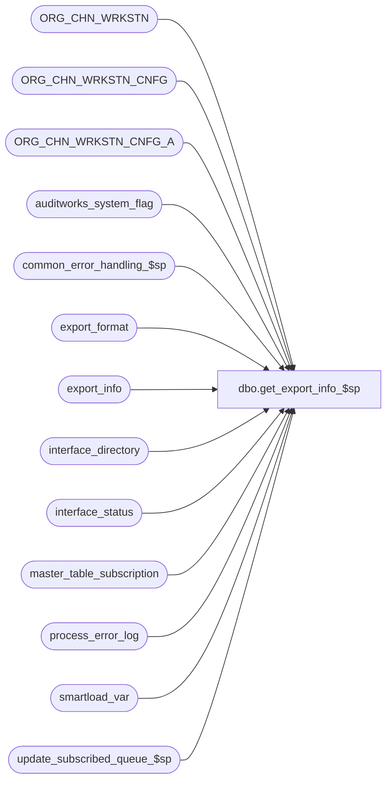

# dbo.get_export_info_$sp

**Database:** auditworks_external  
**Server:** bedrockdb01  

## Architecture Diagram



## Table Dependencies

| Referenced Table |
|---|
| ORG_CHN_WRKSTN |
| ORG_CHN_WRKSTN_CNFG |
| ORG_CHN_WRKSTN_CNFG_A |
| auditworks_system_flag |
| common_error_handling_$sp |
| export_format |
| export_info |
| interface_directory |
| interface_status |
| master_table_subscription |
| process_error_log |
| smartload_var |
| update_subscribed_queue_$sp |

## Stored Procedure Code

```sql
create proc dbo.get_export_info_$sp 
(@stream_no                      tinyint = 1)

AS

/*
Proc name: get_export_info_$sp
     Desc: To copy one row of export details into export_info to be used by ICT_EXPORT.
           Called from ICT_EXPORTxx to search for ad-hoc exports.
 
HISTORY:
Date      Name    Defect   Desc
Jan21,14  Paul    147019   Use try catch, use TOP command for SQL 2014 compatability
Jul16,12  Paul    136951   use nolock hint on master_table_subscription to reduce deadlocking.
Apr07,11  Vicci   126078   Take master_table_subscription active flag into account.
Feb07,11  Vicci   124506   Retrieve dest_company_code from smartload_var XXX_company_code where XXX is interface_id.
Feb01,11  Vicci   124506   Don't retry forever if failure is in BCP/FTP/CP/MV/TRF (as opposed to proc
                           where ICT was already handling the bumping of the current_retry).
Oct25,06  Phu      77931   Fix outer join for SQL 2005 Mode 90.
Sep11,06  Tim      70648   Apply defect 68918 to SA5
Sep01,06  Phu      76719   Want a non-null string when it's concatenated with null string.
Feb 21,05 David  DV-1206   Export multiple files to multiple destinations.
Nov 11,04 Maryam DV-1167   Join to ORG_CHN_WRKSTN to pick only active workstations when setting min of effective date.
Jul 20,04 Maryam DV-1071   Set immediate_posting_requested flag to 1 for interface_id = 45 
                           and update auditworks_system_flag to set the first future effective date.
Mar 17,06 Vicci    68918   Do not run Coalition export if tax-item-group auto-generation is
                           in-progress;  Do not run any interface if it has been placed on
                           hold via the front-end (BatchProcess/Interfaces/Ad-hoc execution)
Jun 28,04 Maryam 1-UL01B   export the same file to multiple destinations
Feb 23,04 Phu      24432   Log object name, max retry to process_error_log
Oct 02,03 Phu      15801   Limit the number of retries in case of error, process interfaces per stream no
Sep 25,03 Vicci    15326   Support single interface with multiple files to export.
Apr 19,02 ShuZ   1-CD0IX   Standardize  R3.5 Common error handling
Jul 18,01 Phu       7816   Author
*/

DECLARE
  @autogen_inprogress	        int,
  @autogen_inprogress_since     datetime,
  @current_retry                tinyint,
  @errline			int,
  @errmsg                       nvarchar(2000),
  @errmsg2                      nvarchar(2000),
  @errno                        int,
  @interface_id                 tinyint,
  @rows                         int,
  @object_name                  nvarchar(255),
  @operation_name               nvarchar(100),
  @process_name                 nvarchar(100),
  @process_no                   int,
  @max_retry                    tinyint,
  @message_id                   int,
  @current_copy                 tinyint,
  @copy_qty_required            tinyint,
  @export_completed             tinyint,
  @today_datetime               datetime;

SELECT @process_name = 'get_export_info_$sp',
       @process_no = 209,
       @message_id = 201068,
       @operation_name = 'Validate',
       @today_datetime = getdate(),
       @autogen_inprogress = 0;

BEGIN TRY

SET CONCAT_NULL_YIELDS_NULL OFF;
       
IF EXISTS (SELECT 1
             FROM auditworks_system_flag
            WHERE flag_name = 'first_future_effective_date'
              AND flag_datetime_value <= @today_datetime)
BEGIN              
    SELECT @errmsg = 'Unable to call update_subscribed_queue_$sp.',
           @object_name = 'update_subscribed_queue_$sp',
           @operation_name = 'EXEC';
  EXEC update_subscribed_queue_$sp 'export_register', '1', 1;
  
    SELECT @errmsg = 'Unable to delete export_info for interface_id = 45 (S/A Translate).',
           @object_name = 'export_info',
           @operation_name = 'DELETE';
  DELETE export_info
   WHERE stream_no = @stream_no
     AND interface_id = 45;
    
    SELECT @errmsg = 'Unable to set the first future effective date.',
           @object_name = 'auditworks_system_flag',
           @operation_name = 'UPDATE';
  UPDATE auditworks_system_flag 
     SET flag_datetime_value = (SELECT MIN(EFCTV_DATE)
                                  FROM ORG_CHN_WRKSTN_CNFG_A A, ORG_CHN_WRKSTN_CNFG C, ORG_CHN_WRKSTN O
       WHERE A.WRKSTN_CNFG_CODE = C.WRKSTN_CNFG_CODE
                                   AND ISNULL(C.TRAN_TRNSLT_VRSN_NUM, 0) <> 0
                                   AND C.PLNG_FILE_NAME IS NOT NULL
                                   AND A.EFCTV_DATE > @today_datetime
                                   AND A.WRKSTN_ID = O.WRKSTN_ID
                                   AND O.ACTV = 1)
   WHERE flag_name = 'first_future_effective_date';
  
END; -- IF EXISTS
              
  SELECT @errmsg = 'Unable to select max_retry from export_info',
         @object_name = 'export_info',
         @operation_name = 'SELECT';
SELECT @current_retry = current_retry,
       @interface_id = interface_id,
       @max_retry = max_retry,
       @current_copy = current_copy,
       @copy_qty_required = copy_qty_required,
       @export_completed = export_completed 
  FROM export_info
 WHERE stream_no = @stream_no;

SELECT @rows = @@rowcount;

IF @rows > 0
BEGIN
  IF @current_retry >= @max_retry
  BEGIN
    SELECT @errmsg = 'Maximum number of retries (' + CONVERT(VARCHAR, @max_retry) + 
                     ') has been reached. Skipping interface id ' + CONVERT(VARCHAR, @interface_id),
           @errno = 201685,
           @message_id = 201685,
           @object_name = @process_name;
    
    EXEC common_error_handling_$sp @process_no, @errno, @errmsg, 3, @message_id, @process_name,
                                   @object_name, @operation_name, 1, @stream_no, 0, NULL, 0,
                                   @max_retry, @interface_id;

      SELECT @errmsg = 'Unable to delete from export_info',
             @object_name = 'export_info',
             @operation_name = 'DELETE';
    DELETE FROM export_info
    WHERE stream_no = @stream_no;

-- Reset status to skip this interface
      SELECT @errmsg = 'Unable to set immediate_posting_requested in interface_status',
             @object_name = 'interface_status',
             @operation_name = 'UPDATE';
    UPDATE interface_status
    SET immediate_posting_requested = 0,
        retrieval_in_progress = 0
    WHERE interface_id = @interface_id;

  END; -- @current_retry > @max_retry
  ELSE 
    IF @export_completed = 0 --Previous attempt failed so try again.
    BEGIN
        SELECT @errmsg = 'Unable to bump up current retry in export_info',
               @object_name = 'export_info',
               @operation_name = 'UPDATE';
      UPDATE export_info
         SET current_retry = current_retry + 1
       WHERE stream_no = @stream_no;

      RETURN;
    END;
    ELSE 
    BEGIN
        SELECT @errmsg = 'Unable to update export_info for the next copy.',
               @object_name = 'export_info',
               @operation_name = 'UPDATE';
      UPDATE export_info 
         SET export_procedure_name = LTRIM(RTRIM(e.export_procedure_name)),
             export_table_name = LTRIM(RTRIM(e.export_table_name)),
             export_file_suffix = LTRIM(RTRIM(e.export_file_suffix)),
             export_destination_path = LTRIM(RTRIM(e.export_destination_path)),
             ftp_flag = LTRIM(RTRIM(e.ftp_flag)),
             ftp_host = LTRIM(RTRIM(e.ftp_host)),
             ftp_hid = LTRIM(RTRIM(e.ftp_hid)),
             ftp_HPWD = LTRIM(RTRIM(e.ftp_HPWD)),
             include_timestamp = e.include_timestamp,
             current_copy = current_copy + 1,
             export_completed = 0,
             current_retry = 0
        FROM export_info i, export_format e
       WHERE i.interface_id = e.interface_id
         AND i.export_format = e.export_format
         AND i.current_copy + 1 = e.copy_no
         AND i.stream_no = @stream_no;
    
      IF NOT EXISTS (SELECT 1 
                       FROM master_table_subscription m WITH (NOLOCK), export_info x WITH (NOLOCK)
                      WHERE m.interface_id = x.interface_id
                        AND m.export_status > 0
                        AND m.active_flag > 0)
      BEGIN
          SELECT @errmsg = 'Unable to set the immediate_posting_requested flag to 1.',
                 @object_name = 'interface_status',
                 @operation_name = 'UPDATE';
        UPDATE interface_status
           SET immediate_posting_requested = 1
          FROM interface_status s, export_info x
         WHERE s.interface_id = x.interface_id
           AND x.current_copy = x.copy_qty_required
           AND x.stream_no = @stream_no;
    
      END; -- IF NOT EXISTS (M_T_S)
    END; -- ELSE @export_completed <> 0

END; -- @rows > 0
ELSE -- @rows < 0
BEGIN 
  SELECT @errmsg = 'Unable to determine if tax-item-group auto-generation is in progress',
         @object_name = 'interface_status',
         @operation_name = 'SELECT';
SELECT @autogen_inprogress = retrieval_in_progress, 
       @autogen_inprogress_since = last_retrieval_datetime  
  FROM interface_status
 WHERE interface_id = 17; -- tax-item-group auto-generation

IF @autogen_inprogress > 0 
   AND @autogen_inprogress_since < dateadd(dd, -1, getdate())
   AND NOT EXISTS (SELECT 1 
                     FROM process_error_log
                    WHERE error_timestamp > @autogen_inprogress_since
                      AND message_id = 202511
                      AND memo_date = @autogen_inprogress_since)
 BEGIN
    SELECT @errmsg = 'Unable to inform user about tax-item-group auto-generation in-progress',
           @object_name = 'interface_status',
           @operation_name = 'SELECT';
  INSERT into process_error_log(process_no,
                                error_code,
                                error_timestamp,
                                process_id,
                                verified,
                                error_msg,
                                user_id,
                                process_name,
                                object_name,
                                operation_name,
                                message_id,
                                memo_date)
  VALUES(@process_no,
         0,
         getdate(),
         @@spid,
         0,
         'Warning:  tax-item-group auto-generation has been in progress since ' + convert(varchar, @autogen_inprogress_since) + '!  Export to NSB POS (Coalition) will be held as a result.  Please verify.',
         null,
         @process_name,
         'interface_status',
         'SELECT',
         202511,
         @autogen_inprogress_since);
 END;

/* Warn if any ad-hoc interfaces have been on hold for more than a day */
    SELECT @errmsg = 'Unable to inform user about held interfaces',
           @object_name = 'interface_status',
           @operation_name = 'SELECT';
INSERT into process_error_log(process_no,
                                error_code,
                                error_timestamp,
                                process_id,
                                verified,
                                error_msg,
                                user_id,
                                process_name,
                                object_name,
                                operation_name,
                                message_id,
                                memo_date,
                                memo1)
SELECT @process_no,
         0,
         getdate(),
         @@spid,
         0,
         'Warning:  interface ' + d.interface_description + ' (' + convert(varchar, s.interface_id) + ') export has been placed on hold since ' + convert(varchar, @autogen_inprogress_since) + ' !',
 null,
         @process_name,
         'interface_status',
         'SELECT',
         202512,
         s.hold_datetime,
         d.interface_description + ' (' + convert(varchar, s.interface_id) + ')'
FROM interface_status s, interface_directory d
WHERE s.hold_datetime < dateadd(dd, -1, getdate())
AND s.interface_id = d.interface_id
AND d.update_timing <> 0
AND d.interface_description + ' (' + convert(varchar, s.interface_id) + ')' NOT IN 
               (SELECT memo1
                  FROM process_error_log
                 WHERE error_timestamp > s.hold_datetime
                   AND message_id = 202512);

-- SELECT TOP (1) returns one row 
    SELECT @errmsg = 'Unable to insert into export_info',
           @object_name = 'export_info',
           @operation_name = 'INSERT';
INSERT INTO export_info (
  stream_no,
  interface_id,
  export_procedure_name,
  export_table_name,
  export_table_reclen,
  export_bcp_fmt_name,
  export_file_prefix,
  export_file_suffix,
  export_destination_path,
  ftp_flag,
  ftp_host,
  ftp_hid,
  ftp_HPWD,
  max_retry,
  current_retry,
  include_timestamp,
  current_copy,
  copy_qty_required,
  export_completed,
  export_format,
  dest_company_code)
SELECT TOP (1)
  @stream_no,
  f.interface_id,
  LTRIM(RTRIM(f.export_procedure_name)),
  LTRIM(RTRIM(ISNULL(m.export_table_name, f.export_table_name))),
  f.export_table_reclen,
  LTRIM(RTRIM(ISNULL(m.export_bcp_fmt_name, f.export_bcp_fmt_name))),
  LTRIM(RTRIM(ISNULL(m.export_file_prefix,f.export_file_prefix))),
  LTRIM(RTRIM(ISNULL(m.export_file_suffix,f.export_file_suffix))),
  LTRIM(RTRIM(f.export_destination_path)),
  f.ftp_flag,
  LTRIM(RTRIM(f.ftp_host)),
  LTRIM(RTRIM(f.ftp_hid)),
  LTRIM(RTRIM(f.ftp_HPWD)),
  ISNULL(f.max_retry_qty, 3),
  0,
  include_timestamp,
  1,
  1,
  0, --ICT_EXPORT will set export_complete = 1 if multi copy and current copy completed is OK
  f.export_format,
  LTRIM(RTRIM(v.var_value)) dest_company_code
FROM interface_status s
     INNER JOIN interface_directory d ON (s.interface_id = d.interface_id)
     INNER JOIN export_format f ON (d.interface_id = f.interface_id AND d.ascii_export = f.export_format)
     LEFT JOIN master_table_subscription m WITH (NOLOCK) ON (f.interface_id = m.interface_id
                                               AND 0 <> m.export_status
                                               AND ISNULL(m.export_bcp_fmt_name, f.export_bcp_fmt_name) IS NOT NULL  --
                                               AND ISNULL(m.export_table_name, f.export_table_name) IS NOT NULL
                                               AND m.active_flag > 0)
     LEFT OUTER JOIN smartload_var v
       ON v.ict_name = 'export_info'
      AND SUBSTRING(v.var_name, 1, 3) = RIGHT('000' + CONVERT(VARCHAR, f.interface_id), 3)
      AND v.var_name LIKE '%_company_code'
WHERE s.immediate_posting_requested >= 1
AND d.ascii_export > 0
AND f.copy_no = 1
AND f.export_procedure_name IS NOT NULL  --
AND ISNULL(f.stream_no, 1) = @stream_no
AND (s.interface_id NOT IN (16, 17) OR IsNull(@autogen_inprogress, 0) = 0)
AND s.hold_datetime IS NULL --
ORDER BY f.interface_id;

SELECT @rows = @@rowcount;

IF @rows = 0
  RETURN;

    SELECT @errmsg = 'Unable to set copy_qty_required.',
           @object_name = 'export_info',
           @operation_name = 'UPDATE';
UPDATE export_info
   SET copy_qty_required = (SELECT MAX(copy_no)
                  FROM export_format e
                            WHERE export_info.interface_id = e.interface_id
                              AND export_info.export_format = e.export_format)
 WHERE stream_no = @stream_no;

IF EXISTS (SELECT 1
             FROM export_info i
            WHERE stream_no = @stream_no
              AND copy_qty_required > 1 )
 BEGIN
      SELECT @errmsg = 'Unable to set the immediate_posting_requested flag to 2.',
             @object_name = 'interface_status';
  UPDATE interface_status
     SET immediate_posting_requested = 2
    FROM interface_status s, export_info i
   WHERE s.interface_id = i.interface_id 
     AND i.stream_no = @stream_no;

 END; -- IF EXISTS

END; -- @rows < 0


  SELECT @errmsg = 'Unable to set export_destination_path in export_info (1)',
         @object_name = 'export_info',
         @operation_name = 'UPDATE';
UPDATE export_info
SET export_destination_path = v.var_value
FROM export_info i, smartload_var v
WHERE i.stream_no = @stream_no
AND i.export_destination_path IS NULL --
AND v.ict_name = 'export_ict'
AND v.var_name = 'hpath';

  SELECT @errmsg = 'Unable to set export_destination_path in export_info (2)';
UPDATE export_info
SET export_destination_path = v.var_value
FROM export_info i, smartload_var v
WHERE i.stream_no = @stream_no
AND i.export_destination_path IS NULL --
AND v.ict_name = 'DEFAULT'
AND v.var_name = 'hpath';

  SELECT @errmsg = 'Unable to set set ftp_host in export_info (1)';
UPDATE export_info
SET ftp_host = v.var_value
FROM export_info i, smartload_var v
WHERE i.stream_no = @stream_no
AND i.ftp_host IS NULL --
AND v.ict_name = 'export_ict'
AND v.var_name = 'host';

  SELECT @errmsg = 'Unable to set set ftp_host in export_info (2)';
UPDATE export_info
SET ftp_host = v.var_value
FROM export_info i, smartload_var v
WHERE i.stream_no = @stream_no
AND i.ftp_host IS NULL --
AND v.ict_name = 'DEFAULT'
AND v.var_name = 'host';

  SELECT @errmsg = 'Unable to set set ftp_hid in export_info (1)';
UPDATE export_info
SET ftp_hid = v.var_value
FROM export_info i, smartload_var v
WHERE i.stream_no = @stream_no
AND i.ftp_hid IS NULL --
AND v.ict_name = 'export_ict'
AND v.var_name = 'hid';

  SELECT @errmsg = 'Unable to set ftp_hid in export_info (2)';
UPDATE export_info
SET ftp_hid = v.var_value
FROM export_info i, smartload_var v
WHERE i.stream_no = @stream_no
AND i.ftp_hid IS NULL --
AND v.ict_name = 'DEFAULT'
AND v.var_name = 'hid';

  SELECT @errmsg = 'Unable to set ftp_HPWD in export_info (1)';
UPDATE export_info
SET ftp_HPWD = v.var_value
FROM export_info i, smartload_var v
WHERE i.stream_no = @stream_no
AND i.ftp_HPWD IS NULL --
AND v.ict_name = 'export_ict'
AND v.var_name = 'HPWD';

  SELECT @errmsg = 'Unable to set ftp_HPWD in export_info (2)';
UPDATE export_info
SET ftp_HPWD = v.var_value
FROM export_info i, smartload_var v
WHERE i.stream_no = @stream_no
AND i.ftp_HPWD IS NULL --
AND v.ict_name = 'DEFAULT'
AND v.var_name = 'HPWD';


RETURN;


business_error:   /* Business Rule handler. */

	SELECT @errmsg2 = @errmsg;

	/* Could include similar cleanup code to system error trap when needed (example is from move_store_$sp).
	   However, could also exclude the cleanup code here since the outer system error catch should fire again after the exec below. */

	EXEC common_error_handling_$sp @process_no, @errno, @errmsg, 0, @message_id, 
                                @process_name, @object_name, @operation_name, 1;
	  /* Note: when the exec above raises an error, that action also fires the system error trap (below) */
	RETURN;
END TRY

BEGIN CATCH; -- trap system errors
    /* common error handling. Appending proc name here because a rollback could occur if called within a transaction. */

        SELECT @errno = ERROR_NUMBER(),
		@errline = ERROR_LINE();

        SELECT @errmsg = CONVERT(nvarchar, @errno) + ':' + @process_name + ':' + CONVERT(nvarchar, @errline) + ':'
               + COALESCE(@errmsg, ' ') + ':' + ERROR_MESSAGE();

	 /* this condition will only be true when raise error in traps above fire this general catch */
	IF @errmsg2 IS NOT NULL
	  SELECT @errmsg = @errmsg2;

  
	EXEC common_error_handling_$sp @process_no, @errno, @errmsg, 0, @message_id, 
                                @process_name, @object_name, @operation_name, 1;

	RETURN;
END CATCH;
```

