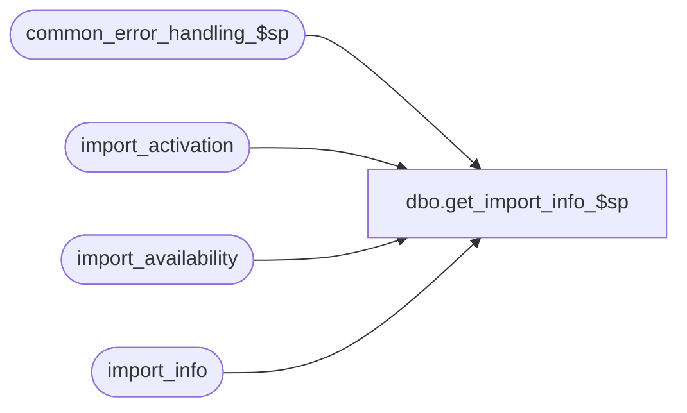

# dbo.get_import_info_$sp

**Database:** auditworks_external  
**Server:** bedrockdb01  

## Architecture Diagram



## Table Dependencies

| Referenced Table |
|---|
| common_error_handling_$sp |
| import_activation |
| import_availability |
| import_info |

## Stored Procedure Code

```sql
CREATE proc [dbo].[get_import_info_$sp] 

@import_name nvarchar(60) = NULL

AS

/*
PROC NAME: get_import_info_$sp
     Desc: To copy one row of import_availability into import_info to be used by ICT_IMPORT.

  Can use the same version for SA 5.0 and SA 5.1 because file names will always use only english characters.

  HISTORY:
Date     Name           Def#  Desc
Apr22,15 Phu           99863  Allow timestamp / sequence id to be optionally suffixed to the import file name
Jan23,14 Paul         147019  Use try catch, use default collation of current db
Jan17,12 Paul       1-4660VV  added collation to where clause to support mixed case import file names
Sep01,06 Phu           76719  Want a non-null string when it's concatenated with null string.
Mar14,03 Phu            5425  Standardize import

*/

DECLARE
  @cl_type                         tinyint,
  @cur_date                        nvarchar(30),
  @employee_type                   tinyint,
  @errline                         int,
  @errno                           int,
  @errmsg                          nvarchar(2000),
  @errmsg2                         nvarchar(2000),
  @import_control_file             nvarchar(60),
  @import_id                       numeric(5,0),
  @import_file_prefix              nvarchar(30),
  @import_time_stamp               nvarchar(30),
  @message_id                      int,
  @not_active                      nvarchar(5),
  @object_name                     nvarchar(255),
  @operation_name                  nvarchar(100),
  @process_name                    nvarchar(100),
  @process_no                      int,
  @rows                            int,
  @row_available                   int,
  @store_schedule                  tinyint,
  @tax_class                       tinyint,
  @tax_item_group                  tinyint,
  @tax_style                       tinyint;

SET CONCAT_NULL_YIELDS_NULL OFF;

IF @import_name IS NULL --
  RETURN;

SELECT @message_id = 201068,
       @process_name = 'get_import_info_$sp',
       @cur_date = convert(varchar, getdate(), 112) + convert(varchar, getdate(), 108),
       @cl_type = 0, @employee_type = 0, @process_no = 7,
       @store_schedule = 0, @tax_item_group = 0, @tax_class = 0, @tax_style = 0,
       @errmsg = 'Unable to select from import_info.',
       @object_name = 'import_info',
       @operation_name = 'SELECT';

BEGIN TRY

SELECT @import_time_stamp = '_' + SUBSTRING(@cur_date, 1, 10) + SUBSTRING(@cur_date, 12, 2) + SUBSTRING(@cur_date, 15, 2);

IF CHARINDEX('employee_type', @import_name) > 0
  SELECT @employee_type = 1;

IF CHARINDEX('store_schedule', @import_name) > 0
  SELECT @store_schedule = 1;

IF CHARINDEX('tax_item_group', @import_name) > 0
  SELECT @tax_item_group = 1;

IF CHARINDEX('tax_class', @import_name) > 0
  SELECT @tax_class = 1;

IF CHARINDEX('tax_style', @import_name) > 0
  SELECT @tax_style = 1;

IF CHARINDEX('CL', @import_name) > 0 AND ( LEN(@import_name) = 2 OR (LEN(@import_name) > 2 AND SUBSTRING(@import_name, 3, 1) <> 'a' ) )
  SELECT @cl_type = 1;

-- Don't populate import info if row already existed for current import file
IF EXISTS (SELECT import_id
           FROM import_info
           WHERE CHARINDEX(import_file_prefix, @import_name) = 1
           AND ((import_file_prefix NOT IN ('class', 'employee', 'store', 'style', 'tax_item', 'N/A'))
                OR (import_file_prefix = 'class' AND @tax_class = 0)
                OR (import_file_prefix = 'employee' AND @employee_type = 0)
                OR (import_file_prefix = 'store' AND @store_schedule = 0)
                OR (import_file_prefix = 'style' AND @tax_style = 0)
                OR (import_file_prefix = 'tax_item' AND @tax_item_group = 0)
                OR (import_file_prefix = 'CL' AND @cl_type = 1)
               )
           AND import_time_stamp = SUBSTRING(@import_name, LEN(import_file_prefix) + 1, LEN(@import_name) - LEN(import_file_prefix))
          )
  RETURN;

  SELECT @errmsg = 'Unable to truncate table import_info.',
         @object_name = 'import_info',
         @operation_name = 'TRUNCATE';
  TRUNCATE TABLE import_info;

  SELECT @errmsg = 'Unable to select import_id from import_activation (1).',
         @object_name = 'import_activation',
         @operation_name = 'SELECT';
SELECT @import_id = import_id
  FROM import_activation
WHERE RTRIM(STUFF(import_control_file, CHARINDEX('.GO', import_control_file), 3, '   ')) = @import_name;

SELECT @rows = @@rowcount;

IF @rows = 0
BEGIN
  SELECT @errmsg = 'Unable to select import_id from import_activation (2).',
         @object_name = 'import_activation',
         @operation_name = 'SELECT';
  SELECT @import_id = import_id
  FROM import_activation
  WHERE LEN(@import_name) >= LEN(RTRIM(STUFF(import_control_file, CHARINDEX('.GO', import_control_file), 3, '   ')))
  AND CHARINDEX(RTRIM(STUFF(import_control_file, CHARINDEX('.GO', import_control_file), 3, '   ')), @import_name) = 1
           AND ((RTRIM(STUFF(import_control_file, CHARINDEX('.GO', import_control_file), 3, '   ')) NOT IN ('class', 'employee', 'store', 'style', 'tax_item', 'N/A', 'CL'))
                OR (RTRIM(STUFF(import_control_file, CHARINDEX('.GO', import_control_file), 3, '   ')) = 'class' AND @tax_class = 0)
                OR (RTRIM(STUFF(import_control_file, CHARINDEX('.GO', import_control_file), 3, '   ')) = 'employee' AND @employee_type = 0)
                OR (RTRIM(STUFF(import_control_file, CHARINDEX('.GO', import_control_file), 3, '   ')) = 'store' AND @store_schedule = 0)
                OR (RTRIM(STUFF(import_control_file, CHARINDEX('.GO', import_control_file), 3, '   ')) = 'style' AND @tax_style = 0)
                OR (RTRIM(STUFF(import_control_file, CHARINDEX('.GO', import_control_file), 3, '   ')) = 'tax_item' AND @tax_item_group = 0)
                OR (RTRIM(STUFF(import_control_file, CHARINDEX('.GO', import_control_file), 3, '   ')) = 'CL' AND @cl_type = 1)
               );

  SELECT @rows = @@rowcount;
END;

IF @rows = 1
BEGIN
    SELECT @errmsg = 'Unable to insert import_info from import_availability (1).',
           @object_name = 'import_info',
           @operation_name = 'INSERT';
  INSERT INTO import_info (
    import_id,
    import_file_prefix,
    import_file_suffix,
    import_description,
    import_table_name,
    import_procedure_name,
    import_format_name,
    import_time_stamp,
    load_data_via_secondary_db,
    preprocessing_command )
  SELECT
    import_id,
    SUBSTRING(import_control_file, 1, CHARINDEX('.', import_control_file) - 1), -- remove anything after period
    ISNULL(import_file_suffix, '.dummy'),
    import_description,
    ISNULL(import_table_name, 'N/R'),
    import_procedure_name,
    ISNULL(import_format_name, 'N/R'),
    @import_time_stamp,
    load_data_via_secondary_db,
    preprocessing_command
  FROM import_availability
  WHERE import_id = @import_id;

  SELECT @row_available = @@rowcount;

  IF @row_available = 0
    GOTO not_found;

    SELECT @errmsg = 'Unable to set import_file_suffix in import_info (1).',
           @object_name = 'import_info',
           @operation_name = 'UPDATE';
  UPDATE import_info
    SET import_file_suffix = '.' + import_file_suffix
  WHERE SUBSTRING(import_file_suffix, 1, 1) <> '.';

    SELECT @errmsg = 'Unable to set import_time_stamp in import_info (2).';
  UPDATE import_info
  SET import_time_stamp = SUBSTRING(@import_name, LEN(import_file_prefix) + 1, LEN(@import_name) - LEN(import_file_prefix))
  WHERE LEN(@import_name) > LEN(import_file_prefix);

  RETURN;
END;

/* Check for possible case sensitive import file name using collation setting.
    Note: import_control_file must contain uppercase .GO due to smartload requirements.
    Older sites may be using a case-sensitive collation and using collate DATABASE_DEFAULT (as below) will retain case-sensitive
      string matching functionality for those sites while supporting case-insensitive collation at newer sites.  */

    SELECT @errmsg = 'Unable to select import_id from import_activation (3).',
           @object_name = 'import_activation',
           @operation_name = 'SELECT';
  SELECT @import_id = import_id
  FROM import_activation
  WHERE LEN(@import_name) >= LEN(RTRIM(STUFF(import_control_file, CHARINDEX('.GO', import_control_file), 3, '   ')))
  AND CHARINDEX(RTRIM(STUFF(import_control_file, CHARINDEX('.GO', import_control_file), 3, '   ')), @import_name COLLATE DATABASE_DEFAULT) = 1
  AND ((RTRIM(STUFF(import_control_file, CHARINDEX('.GO', import_control_file), 3, '   ')) NOT IN ('class', 'employee', 'store', 'style', 'tax_item', 'N/A', 'CL'))
       OR (RTRIM(STUFF(import_control_file, CHARINDEX('.GO', import_control_file), 3, '   ')) = 'class' AND @tax_class = 0)
       OR (RTRIM(STUFF(import_control_file, CHARINDEX('.GO', import_control_file), 3, '   ')) = 'employee' AND @employee_type = 0)
       OR (RTRIM(STUFF(import_control_file, CHARINDEX('.GO', import_control_file), 3, '   ')) = 'store' AND @store_schedule = 0)
       OR (RTRIM(STUFF(import_control_file, CHARINDEX('.GO', import_control_file), 3, '   ')) = 'style' AND @tax_style = 0)
       OR (RTRIM(STUFF(import_control_file, CHARINDEX('.GO', import_control_file), 3, '   ')) = 'tax_item' AND @tax_item_group = 0)
       OR (RTRIM(STUFF(import_control_file, CHARINDEX('.GO', import_control_file), 3, '   ')) = 'CL' AND @cl_type = 1)
      );

SELECT @rows = @@rowcount;

IF @rows = 1
BEGIN
-- remove everything after period
    SELECT @errmsg = 'Unable to select import_control_file from import_availability.',
           @object_name = 'import_availability',
           @operation_name = 'SELECT';
  SELECT @import_file_prefix = SUBSTRING(import_control_file, 1, CHARINDEX('.', import_control_file) - 1)
    FROM import_availability
   WHERE import_id = @import_id;

  SELECT @row_available = @@rowcount;

  IF @row_available = 0
    GOTO not_found;

  SELECT @import_time_stamp = SUBSTRING(@import_name, LEN(@import_file_prefix) + 1, LEN(@import_name) - LEN(@import_file_prefix));

    SELECT @errmsg = 'Unable to insert import_info from import_availability (2).',
           @object_name = 'import_info',
           @operation_name = 'INSERT';
  INSERT INTO import_info (
    import_id,
    import_file_prefix,
    import_file_suffix,
    import_description,
    import_table_name,
    import_procedure_name,
    import_format_name,
    import_time_stamp,
    load_data_via_secondary_db,
    preprocessing_command )
  SELECT
    import_id,
    @import_file_prefix,
    ISNULL(import_file_suffix, '.dummy'),
    import_description,
    ISNULL(import_table_name, 'N/R'),
    import_procedure_name,
    ISNULL(import_format_name, 'N/R'),
    @import_time_stamp,
    load_data_via_secondary_db,
    preprocessing_command
  FROM import_availability
  WHERE import_id = @import_id;

    SELECT @errmsg = 'Unable to set import_file_suffix in import_info (2).',
           @object_name = 'import_info',
           @operation_name = 'UPDATE';
  UPDATE import_info
  SET import_file_suffix = '.' + import_file_suffix
  WHERE SUBSTRING(import_file_suffix, 1, 1) <> '.';

  RETURN;
END; -- if @rows = 1


not_found:

IF @rows = 0 OR @row_available = 0
BEGIN
  SELECT @not_active = 'N/A',
         @errmsg = 'Unable to insert import_info from import_availability (3).',
         @object_name = 'import_info',
         @operation_name = 'INSERT';

  INSERT INTO import_info (
    import_id,
    import_file_prefix,
    import_file_suffix,
    import_description,
    import_table_name,
    import_procedure_name,
    import_format_name,
    import_time_stamp,
    load_data_via_secondary_db,
    preprocessing_command )
  VALUES (
    0,
    @not_active,
    @not_active,
    @not_active,
    @not_active,
    @not_active,
    @not_active,
    @not_active,
    '0',
    @not_active );

END; -- if @rows = 0 or @row_available = 0

RETURN;


business_error:   /* Business Rule handler. */

	SELECT @errmsg2 = @errmsg;

	/* Could include similar cleanup code to system error trap when needed (example is from move_store_$sp).
	   However, could also exclude the cleanup code here since the outer system error catch should fire again after the exec below. */

	EXEC common_error_handling_$sp @process_no, @errno, @errmsg, 0, @message_id, 
	       @process_name, @object_name, @operation_name, 1;
	  /* Note: when the exec above raises an error, that action also fires the system error trap (below) */
	RETURN;
END TRY

BEGIN CATCH; -- trap system errors
    /* common error handling. Appending proc name here because a rollback could occur if called within a transaction. */

        SELECT @errno = ERROR_NUMBER(),
		@errline = ERROR_LINE();

        SELECT @errmsg = CONVERT(nvarchar, @errno) + ':' + @process_name + ':' + CONVERT(nvarchar, @errline) + ':'
               + COALESCE(@errmsg, ' ') + ':' + ERROR_MESSAGE();

	 /* this condition will only be true when raise error in traps above fire this general catch */
	IF @errmsg2 IS NOT NULL
	  SELECT @errmsg = @errmsg2;

	EXEC common_error_handling_$sp @process_no, @errno, @errmsg, 0, @message_id, 
	       @process_name, @object_name, @operation_name, 1;

	RETURN;
END CATCH;
```

