# dbo.if_error_$sp

**Database:** auditworks_external  
**Server:** bedrockdb01  

## Architecture Diagram

```mermaid
flowchart LR
    SP["dbo.if_error_$sp"]
    audit_status(["audit_status"]) --> SP
    av_if_rejection_reason(["av_if_rejection_reason"]) --> SP
    av_stock_control_detail(["av_stock_control_detail"]) --> SP
    av_transaction_header(["av_transaction_header"]) --> SP
    av_transaction_line(["av_transaction_line"]) --> SP
    common_error_handling__sp(["common_error_handling_$sp"]) --> SP
    edit_status(["edit_status"]) --> SP
    export_format(["export_format"]) --> SP
    if_error(["if_error"]) --> SP
    if_rejection_reason(["if_rejection_reason"]) --> SP
    interface_control(["interface_control"]) --> SP
    interface_directory(["interface_directory"]) --> SP
    interface_status(["interface_status"]) --> SP
    lock_store_date__sp(["lock_store_date_$sp"]) --> SP
    oim_in_xfer(["oim_in_xfer"]) --> SP
    oim_in_xfer_detail(["oim_in_xfer_detail"]) --> SP
    oim_inv_count(["oim_inv_count"]) --> SP
    oim_inv_count_detail(["oim_inv_count_detail"]) --> SP
    oim_out_xfer(["oim_out_xfer"]) --> SP
    oim_out_xfer_detail(["oim_out_xfer_detail"]) --> SP
    oim_po_receipt(["oim_po_receipt"]) --> SP
    oim_po_receipt_detail(["oim_po_receipt_detail"]) --> SP
    oim_rtv(["oim_rtv"]) --> SP
    oim_rtv_detail(["oim_rtv_detail"]) --> SP
    oim_store_ship_rcpt(["oim_store_ship_rcpt"]) --> SP
    oim_store_ship_rcpt_dtl(["oim_store_ship_rcpt_dtl"]) --> SP
    oim_uda(["oim_uda"]) --> SP
    oim_uda_detail(["oim_uda_detail"]) --> SP
    parameter_general(["parameter_general"]) --> SP
    process_error_log(["process_error_log"]) --> SP
    reserve_transaction_no__sp(["reserve_transaction_no_$sp"]) --> SP
    stock_control_detail(["stock_control_detail"]) --> SP
    store_audit_status(["store_audit_status"]) --> SP
    tran_id_datatype(["tran_id_datatype"]) --> SP
    transaction_generation_source(["transaction_generation_source"]) --> SP
    transaction_header(["transaction_header"]) --> SP
    transaction_line(["transaction_line"]) --> SP
    verify_store_status__sp(["verify_store_status_$sp"]) --> SP
```



## Table Dependencies

| Referenced Table |
|---|
| audit_status |
| av_if_rejection_reason |
| av_stock_control_detail |
| av_transaction_header |
| av_transaction_line |
| common_error_handling_$sp |
| edit_status |
| export_format |
| if_error |
| if_rejection_reason |
| interface_control |
| interface_directory |
| interface_status |
| lock_store_date_$sp |
| oim_in_xfer |
| oim_in_xfer_detail |
| oim_inv_count |
| oim_inv_count_detail |
| oim_out_xfer |
| oim_out_xfer_detail |
| oim_po_receipt |
| oim_po_receipt_detail |
| oim_rtv |
| oim_rtv_detail |
| oim_store_ship_rcpt |
| oim_store_ship_rcpt_dtl |
| oim_uda |
| oim_uda_detail |
| parameter_general |
| process_error_log |
| reserve_transaction_no_$sp |
| stock_control_detail |
| store_audit_status |
| tran_id_datatype |
| transaction_generation_source |
| transaction_header |
| transaction_line |
| verify_store_status_$sp |

## Stored Procedure Code

```sql
create proc [dbo].[if_error_$sp] 
( @reject_handler_interface_id    tinyint = NULL )

AS

/*
PROCNAME: if_error_$sp
    DESC: Log externally detected I/F rejections into Sales Audit.
          Called by multi stream ICT_EXPORT.

 HISTORY:
Date     Name             Defect  Desc
Jan19,12 Vicci            132481  Remove usage of data length function for substring extraction from unicode strings since it returns a length
                                  of double that corresponding to the character positions within the string in the case of nvarchar and nchar data types.
Dec30,10 Phu              123814  Avoid error 'An expression of non-boolean type specified ...' due to dynamic SQL syntax was badly formed.
Apr09,09 Vicci          1-3ZOOS1  Avoid getting stuck in a loop when more errors arrive while the current batch is still 
				  being processed.
Nov26,08 Paul             104990  uplift 1-3YPO7R to SA5, populate transaction_date column in av_if_rejection_reason
Apr09,08 Paul              97584  update remarks to match SA4.1
Oct25,06 Phu               77931  Fix outer join for SQL 2005 Mode 90.
Sep21,06 Paul              76719  apply 75320 to SA5
Jul10,06 Tim		 DV-1340  apply 72947 and 74457 to SA5
Mar09,06 Paul            DV-1328  apply 68027 to SA5
Jan31,06 Paul            DV-1329  apply 66785 to SA5
Sep19,05 Paul              60575  apply 60574 to SA5
Sep06,05 Paul            DV-1312  apply 57137 to SA5
Jul08,05 Paul            DV-1295  expand reference_no to 80 characters
Jun28,05 Paul            DV-1286  ignore interface_status_flag = 98, added NOLOCK hints
Jun20,05 Paul            54934    apply 55155 to SA5
May27,05 Paul            DV-1254  apply 54184, 48946 defects to SA5
Apr28,05 Paul            DV-1234  expand transaction_id to use tran_id_datatype
Feb10,05 David           DV-1206  Expand column reference_no.
Sep17,04 Maryam          DV-1146  Use user_id, apply 42301 to SA5
Sep07,04 Maryam          DV-1120  apply 38567,31466 to SA5
May07,04 Maryam          DV-1071  pass @process_id to the sub procs. Changed resource_id to nvarchar(255).
Sep23,08 Paul           1-3YPO7R  avoid dup error on insert to transaction_line, improved store-date locking logic
Sep13,07 Vicci          1-3U5PLO  user name of 30 char too big to fit in process error log.
Sep21,06 Paul             75320   avoid possible concat null problem
Jul07,06 Maryam           74457   set immediate_posting_requested to 2 if there are sill rows in if_error.    
Jun01,06 Vicci            72947   Resource_id update should be based on token subtring starting
                                  with start position for a length of end minus start position,
                                  not for a length of end pos
Feb22,06 Vicci		  68027	  When in trickle edit mode store will be locked all day, so
				  still allow I/F rejection to be recorded.
Jan31,06 Vicci		  66785   When scanning token to find transaction id the not found 
			          test should be resource_start_pos = 1 not 
			          resource_start_pos = 0 (since it had been set to pos+1).
Sep16,05 Vicci		  60574  when logging new transaction with transaction line subset
			          of rejected portion of inventory trans the new trans is 
			          logged to the remark instead of the original trans.
Jul14,05 Daphna           57137   find Shipping Info Recorded line for Invalid Carrier Code, Invalid Weight Code
May31,05 Daphna           55155   correct calculation start_carton_pos and end_carton_pos
May16,05 Daphna           54184   set @total_table = 15 to include 2 new tables for UDA
Feb08,05 Daphna           48946   process errors for entity 160 = User Defined Adjustments
Oct06,04 Vicci		  42301   Check context_info instead of login-name since users 
				  assigned to run smartload processes are user-defined 
				  in Smartload Var table maintenance.
Jul14,04 Phu              38567   Partial inventory count rejection is not reflected in I/F reject quantity
Jun30,04 Phu              31466   Ignore non-provided carton numbers to avoid I/F rejects not posted to SA
Apr02,04 Phu              27391   Differentiate between negative entity code in memo1 and interface id
Feb23,04 Phu              24432   Keep oim transaction in case of termination
Jan12,04 Phu              21459   Clean up oim_message table
Sep09,03 Phu              15801   Initial development

*** must script with ANSI_NULLS ON, ANSI_WARNINGS ON due to scaleout

*/

DECLARE
  @and_clause                  nvarchar(500),
  @archive_rows                int,
  @column_name                 nvarchar(500),
  @common_clause           nvarchar(200),
  @current_archive_flag        tinyint,
  @current_db_name             nvarchar(30),
  @current_rows                int,
  @cursor_open                 tinyint,
  @db_id                       int,
  @entity_code                 smallint,
  @entity_code_str             nvarchar(200),
  @errmsg                      nvarchar(255),
  @errno                       int,
  @function_name	       varbinary(128),
  @if_error_rows               int,
  @if_rejection_flag           tinyint,
  @if_reject_qty_adj           int, 
  @if_reject_qty_adj_occurred  tinyint, 
  @index_entity                smallint,
  @index_tb                    smallint,
  @last_posting_datetime       datetime,
  @locked_by_edit_phase1       tinyint,
  @locked_by_process_id        int,
  @log_error_for_archived      tinyint,
  @max_tran_no                 int,
  @message_id                  int,
  @new_transaction_id          tran_id_datatype,
  @next_tran_no                int,
  @object_name                 nvarchar(255),
  @operation_name              nvarchar(100),
  @partial_reject_count        int,
  @process_name                nvarchar(100),
  @process_id                  binary(16),
  @process_no                  tinyint,
  @process_timestamp           float,
  @register_no                 smallint,
  @ret                         int,
  @retrieval_in_progress       tinyint,
  @rows                        int,
  @sql_command                 nvarchar(2000),
  @store_no                    int,
  @stream_no                   tinyint,
  @table_count                 tinyint,
  @table_name                  nvarchar(500),
  @total_table                 tinyint,
  @transaction_date            smalldatetime,
  @transaction_id              tran_id_datatype,
  @transaction_series          nchar(1),
  @update_in_progress          int


IF @reject_handler_interface_id IS NULL --
  RETURN

SET ANSI_NULLS ON
SET ANSI_WARNINGS ON

SELECT @archive_rows = 0,
       @common_clause = ' IN (SELECT transaction_id FROM #if_error WHERE entity_code = ',
       @current_db_name = db_name(),
       @cursor_open = 0,
       @entity_code_str = '10  10  50  50  60  60  120 120 130 130 140 140 150 160 160 ',
       @function_name = convert(varbinary(128), 'auditworks_external_if_reject'),
       @log_error_for_archived = 0,
       @message_id = 201068,
       @process_name = 'if_error_$sp',
       @process_no = 93,
       @stream_no = 1,
       @total_table = 15,
       @process_id = @@spid,
       @process_timestamp =  DATEPART ( mm, getdate() ) * 100000000000.0
                           + DATEPART ( dd, getdate() ) * 1000000000.0
                           + DATEPART ( hh, getdate() ) * 10000000.0
                           + DATEPART ( mi, getdate() ) * 100000.0
                           + DATEPART ( ss, getdate() ) * 1000.0
                           + DATEPART ( ms, getdate() )

SET CONTEXT_INFO @function_name

SELECT @table_name = 'oim_po_receipt                oim_po_receipt_detail         oim_out_xfer                  '
SELECT @table_name = @table_name + 'oim_out_xfer_detail           oim_rtv                       oim_rtv_detail                '
SELECT @table_name = @table_name + 'oim_inv_count                 oim_inv_count_detail          oim_in_xfer                   '
SELECT @table_name = @table_name + 'oim_in_xfer_detail            oim_store_ship_rcpt           oim_store_ship_rcpt_dtl       '
SELECT @table_name = @table_name + 'oim_message                   '
SELECT @table_name = @table_name + 'oim_uda                       oim_uda_detail'

SELECT @column_name = 'oim_po_receipt_id             oim_po_receipt_id             oim_out_xfer_id               '
SELECT @column_name = @column_name + 'oim_out_xfer_id               oim_rtv_id                    oim_rtv_id                    '
SELECT @column_name = @column_name + 'oim_inv_count_id              oim_inv_count_id              oim_in_xfer_id                '
SELECT @column_name = @column_name + 'oim_in_xfer_id                oim_store_ship_rcpt_id        oim_store_ship_rcpt_id        '
SELECT @column_name = @column_name + 'entity_id                     '
SELECT @column_name = @column_name + 'oim_uda_id                    oim_uda_id'

SELECT @stream_no = e.stream_no
FROM export_format e, interface_directory i
WHERE i.interface_id = @reject_handler_interface_id
AND i.interface_id = e.interface_id
AND i.ascii_export = e.export_format

SELECT @errno = @@error
IF @errno <> 0
BEGIN
  SELECT @errmsg = 'Unable to select stream_no from export_format',
         @object_name = 'export_format',
         @operation_name = 'SELECT'
  GOTO error
END

CREATE TABLE #if_error (
  if_error_id           numeric(13,0) not null,
  transaction_id        numeric(14,0) not null, -- tran_id_datatype
  line_id               numeric(5,0)      null,
  interface_id          tinyint       not null,
  if_reject_reason      smallint      not null,
  resource_id           int       null,
  token                 nvarchar(255)      null,
  resource_string       nvarchar(255)      null,
  exception_type        smallint      not null,
  entity_code           smallint          null,
  object_key            nvarchar(200)      null,
  sys_code          int               null,
  sys_message           nvarchar(255)      null,
  internal_class_name   nvarchar(100)      null,
  method_name           nvarchar(100)      null,
  store_no              int           not null,
  transaction_date      smalldatetime not null,
  register_no           smallint      not null,
  transaction_no        int           not null,
  if_rejection_flag     tinyint       not null,
  reference_no          nvarchar(80)       null,
  carton_start_pos      smallint          null,
  carton_end_pos        smallint          null,
  audit_status          smallint      not null,
  current_archive_flag  tinyint       not null )

SELECT @errno = @@error
IF @errno <> 0
BEGIN
  SELECT @errmsg = 'Unable to create temp table #if_error',
         @object_name = '#if_error',
         @operation_name = 'CREATE'
  GOTO error
END

SELECT @retrieval_in_progress = retrieval_in_progress,
       @last_posting_datetime = last_posting_datetime
FROM interface_status
WHERE interface_id = @reject_handler_interface_id

SELECT @errno = @@error
IF @errno <> 0
BEGIN
  SELECT @errmsg = 'Unable to select retrieval_in_progress from interface_status',
         @object_name = 'interface_status',
         @operation_name = 'SELECT'
  GOTO error
END

-- Find out if this proc (based on user name) is current running,
-- if yes, log to process_error_log, else continue

IF @retrieval_in_progress <> 0
BEGIN
  SELECT @db_id = dbid
  FROM master..sysprocesses
  WHERE spid = @process_id

  SELECT @errno = @@error
  IF @errno !=0
  BEGIN
    SELECT @errmsg = 'Unable to select from master..sysprocesses',
           @object_name = 'master..sysprocesses',
           @operation_name = 'SELECT'
    GOTO error
  END

  IF EXISTS (SELECT 1
             FROM master..sysprocesses
             WHERE context_info = @function_name
             AND spid <> @process_id
             AND dbid = @db_id
             AND db_name(dbid) = @current_db_name)
  BEGIN
    SELECT @message_id = 201682,
           @errno = 201682,
           @object_name = @process_name,
           @operation_name = 'Validate',
           @errmsg = 'The stored procedure ' + @process_name + ' is currently running. Please verify.'
    GOTO error
  END
END

SELECT if_error_id
INTO #if_error_list
FROM if_error
WHERE exception_type <> 99

SELECT @errno = @@error, @if_error_rows = @@rowcount
IF @errno <> 0
BEGIN
  SELECT @errmsg = 'Unable to select into (create) #if_error_list from if_error',
         @object_name = '#if_error_list',
         @operation_name = 'SELECT_INTO'
  GOTO error
END

IF @if_error_rows = 0
BEGIN
  UPDATE interface_status
  SET retrieval_in_progress = 0
  WHERE interface_id = @reject_handler_interface_id

  SELECT @errno = @@error
  IF @errno <> 0
  BEGIN
    SELECT @errmsg = 'Unable to set retrieval_in_progress to 0 in interface_status',
           @object_name = 'interface_status',
           @operation_name = 'UPDATE'
  GOTO error
  END
  RETURN
END

CREATE TABLE #if_error_line (
  detail_flag        tinyint       not null,
  store_no           int           not null,
  register_no        smallint      not null,
  transaction_date   smalldatetime not null,
  transaction_id     numeric(14,0) not null, -- tran_id_datatype
  resource_id        numeric(12,0)     null,
  reference_no       nvarchar(80)       null,
  resource_string    nvarchar(255)      null,
  line_id            numeric(5,0)  not null )

SELECT @errno = @@error
IF @errno <> 0
BEGIN
  SELECT @errmsg = 'Unable to create table #if_error_line',
         @object_name = '#if_error_line',
         @operation_name = 'CREATE'
  GOTO error
END

UPDATE interface_status
SET retrieval_in_progress = 1, last_retrieval_datetime = getdate()
WHERE interface_id = @reject_handler_interface_id

SELECT @errno = @@error
IF @errno <> 0
BEGIN
  SELECT @errmsg = 'Unable to set retrieval_in_progress to 1 in interface_status',
         @object_name = 'interface_status',
         @operation_name = 'UPDATE'
  GOTO error
END

SELECT @transaction_series = transaction_series
FROM transaction_generation_source
WHERE process_no = @process_no

SELECT @errno = @@error
IF @errno <> 0
BEGIN
  SELECT @errmsg = 'Unable to select transaction_series from transaction_generation_source for entity_code 120',
         @object_name = 'transaction_generation_source',
         @operation_name = 'SELECT'
  GOTO error
END

IF @transaction_series IS NULL --
  SELECT @transaction_series = 'E'

INSERT INTO #if_error (
  if_error_id, transaction_id, line_id, interface_id, if_reject_reason,
  resource_id, token, resource_string, exception_type, entity_code, object_key,
  sys_code, sys_message, internal_class_name, method_name,
  store_no, transaction_date, register_no, transaction_no, if_rejection_flag,
  reference_no, carton_start_pos, carton_end_pos, audit_status, current_archive_flag )
SELECT DISTINCT
  ie.if_error_id, ie.transaction_id, ie.line_id, ie.interface_id, ie.if_reject_reason,
  ie.resource_id, ie.token, ie.resource_string, ie.exception_type, ie.entity_code, ie.object_key,
  ie.sys_code, ie.sys_message, ie.internal_class_name, ie.method_name, 
  h.store_no, h.transaction_date, h.register_no, h.transaction_no, h.if_rejection_flag,
    NULL, 3, 198, a.audit_status, 1 -- from current
FROM #if_error_list t, if_error ie, transaction_header h WITH (NOLOCK), audit_status a WITH (NOLOCK)
WHERE t.if_error_id = ie.if_error_id
AND ie.transaction_id = h.transaction_id
AND h.store_no = a.store_no
AND h.transaction_date = a.sales_date
AND h.register_no = a.register_no
AND h.date_reject_id = a.date_reject_id

SELECT @errno = @@error, @current_rows = @@rowcount
IF @errno <> 0
BEGIN
  SELECT @errmsg = 'Unable to insert #if_error from transaction_header',
         @object_name = '#if_error',
         @operation_name = 'INSERT'
  GOTO error
END

IF @current_rows <> @if_error_rows
BEGIN
  INSERT INTO #if_error (
    if_error_id, transaction_id, line_id, interface_id, if_reject_reason,
    resource_id, token, resource_string, exception_type, entity_code, object_key,
    sys_code, sys_message, internal_class_name, method_name,
    store_no, transaction_date, register_no, transaction_no, if_rejection_flag,
    reference_no, carton_start_pos, carton_end_pos, audit_status, current_archive_flag )
  SELECT DISTINCT
    ie.if_error_id, ie.transaction_id, ie.line_id, ie.interface_id, ie.if_reject_reason,
    ie.resource_id, ie.token, ie.resource_string, ie.exception_type, ie.entity_code, ie.object_key,
    ie.sys_code, ie.sys_message, ie.internal_class_name, ie.method_name, 
    h.store_no, h.transaction_date, h.register_no, h.transaction_no, h.if_rejection_flag,
    NULL, 3, 198, 400, 2 -- from archive
  FROM #if_error_list t, if_error ie, av_transaction_header h WITH (NOLOCK)
 WHERE t.if_error_id = ie.if_error_id
  AND ie.transaction_id = h.av_transaction_id

  SELECT @errno = @@error, @archive_rows = @@rowcount
  IF @errno <> 0
  BEGIN
    SELECT @errmsg = 'Unable to insert #if_error from av_transaction_header',
           @object_name = '#if_error',
           @operation_name = 'INSERT'
    GOTO error
  END
END -- if @current_rows <> @if_error_rows

IF (@current_rows + @archive_rows) <> @if_error_rows
BEGIN
  BEGIN TRAN
  UPDATE if_error
  SET exception_type = 99
  WHERE if_error_id IN (SELECT if_error_id FROM #if_error_list)
  AND if_error_id NOT IN (SELECT if_error_id FROM #if_error)
 
  SELECT @errno = @@error
  IF @errno <> 0
  BEGIN
    SELECT @errmsg = 'Unable to set exception_type to 99 in if_error (1)',
           @object_name = 'if_error',
           @operation_name = 'UPDATE'
    GOTO error
  END

  INSERT INTO process_error_log (
    process_no,
    error_code,
    error_timestamp,
    process_id,
    verified,
    error_msg,
    message_id,
    process_name,
    object_name,
    operation_name,
    memo1,
    memo2,
    memo3,
    memo_date,
    memo_date2,
    memo_date3,
    stream_no)
  VALUES (
    @process_no,
    201683,
    getdate(),
    @process_id,
    0,
    'Externally detected I/F rejection transaction(s) not found in Sales Audit. Please resolve transaction(s) having exception type 99 in if_error table.',
    201683,
    @process_name,
    'if_error',
    'Validate',
    NULL, -- memo1,
    NULL, -- memo2,
    NULL, -- memo3,
    NULL, -- memo_date,
    NULL, -- memo_date2,
    NULL, -- memo_date3,
    @stream_no)

  SELECT @errno = @@error
  IF @errno <> 0
  BEGIN
    SELECT @errmsg = 'Unable to insert process_error_log (1)',
           @object_name = 'process_error_log',
           @operation_name = 'INSERT'
    GOTO error
  END
  COMMIT
END -- if (@current_rows + @archive_rows) <> @if_error_rows

BEGIN TRAN
  UPDATE if_error
  SET exception_type = 99
  WHERE exception_type <> 99
  AND if_error_id IN (SELECT if_error_id
                        FROM #if_error
  WHERE audit_status > 300
                        AND audit_status < 400)
 
  SELECT @errno = @@error, @rows = @@rowcount
  IF @errno <> 0
  BEGIN
    SELECT @errmsg = 'Unable to set exception_type to 99 in if_error (2)',
           @object_name = 'if_error',
           @operation_name = 'UPDATE'
    GOTO error
  END

  IF @rows > 0
  BEGIN
    INSERT INTO process_error_log (
      process_no,
      error_code,
      error_timestamp,
      process_id,
      verified,
      error_msg,
      message_id,
      process_name,
      object_name,
      operation_name,
      memo1,
      memo2,
      memo3,
      memo_date,
      memo_date2,
      memo_date3,
      stream_no)
    VALUES (
      @process_no,
      201689,
      getdate(),
      @@spid,
      0,
      'Externally detected I/F rejection transaction(s) currently dayended. Please resolve transaction(s) having exception type 99 in if_error table.',
      201689,
      @process_name,
      'if_error',
      'Validate',
      NULL, -- memo1,
      NULL, -- memo2,
      NULL, -- memo3,
      NULL, -- memo_date,
      NULL, -- memo_date2,
      NULL, -- memo_date3,
      @stream_no)

    SELECT @errno = @@error
    IF @errno <> 0
    BEGIN
      SELECT @errmsg = 'Unable to insert process_error_log (2)',
             @object_name = 'process_error_log',
             @operation_name = 'INSERT'
      GOTO error
    END
  END -- if @rows > 0
COMMIT

IF @rows > 0
BEGIN
  DELETE FROM #if_error
  WHERE audit_status > 300
  AND audit_status < 400

  SELECT @errno = @@error
  IF @errno <> 0
  BEGIN
    SELECT @errmsg = 'Unable to delete rows from #if_error',
           @object_name = '#if_error',
           @operation_name = 'DELETE'
    GOTO error
  END
END

DECLARE entity_code_crsr CURSOR FAST_FORWARD
FOR
SELECT DISTINCT entity_code
FROM #if_error
WHERE entity_code IS NOT NULL
AND if_reject_reason in (105, 106, 109)

SELECT @errno = @@error
IF @errno <> 0
BEGIN
   SELECT @errmsg = 'Unable to declare cursor from #if_error',
          @object_name = 'entity_code_crsr',
          @operation_name = 'DECLARE_CURSOR'
   GOTO error
END

OPEN entity_code_crsr
SELECT @cursor_open = 1

WHILE 1 = 1
BEGIN
  FETCH entity_code_crsr
  INTO @entity_code

  IF @@fetch_status <> 0
    BREAK

  IF @entity_code = 10
  BEGIN
    UPDATE #if_error
    SET reference_no = oim.document_no,
        line_id = oim.line_id
    FROM #if_error t, oim_po_receipt oim
    WHERE t.entity_code = @entity_code
    AND t.transaction_id = oim.oim_po_receipt_id

    SELECT @errno = @@error
    IF @errno <> 0
    BEGIN
       SELECT @errmsg = 'Unable to set reference_no in #if_error for entity_code 10',
              @object_name = '#if_error',
              @operation_name = 'UPDATE'
       GOTO error
    END

    UPDATE #if_error
    SET carton_start_pos =  (charindex(nchar(9), object_key,charindex(nchar(9), object_key, charindex(nchar(9), object_key,  charindex(nchar(9), object_key, 3) + 1) +1) +1) + 1),
        carton_end_pos =  (charindex(nchar(9), object_key, charindex(nchar(9), object_key,charindex(nchar(9), object_key, charindex(nchar(9), object_key,  charindex(nchar(9), object_key, 3) + 1) +1) +1) + 1) - 1)   
    WHERE entity_code = @entity_code
    AND SUBSTRING(object_key, 1, 1) = '5'

    SELECT @errno = @@error, @rows = @@rowcount
    IF @errno <> 0
    BEGIN
       SELECT @errmsg = 'Unable to set carton_start_pos in #if_error for entity_code 10',
              @object_name = '#if_error',
              @operation_name = 'UPDATE'
       GOTO error
    END
    
    IF @rows > 0
    BEGIN
      UPDATE #if_error
      SET carton_end_pos = NULL --
      WHERE entity_code = @entity_code
      AND SUBSTRING(object_key, 1, 1) = '5'
      AND carton_end_pos = -1

      SELECT @errno = @@error
      IF @errno <> 0
      BEGIN
         SELECT @errmsg = 'Unable to set carton_end_pos to NULL in #if_error for entity_code 10',
                @object_name = '#if_error',
      @operation_name = 'UPDATE'
         GOTO error
      END
    END
    
     UPDATE #if_error
    SET line_id = oim.line_id
    FROM #if_error t, oim_po_receipt_detail oim
    WHERE t.entity_code = @entity_code
    AND SUBSTRING(t.object_key, 1, 1) = '5'
    AND t.transaction_id = oim.oim_po_receipt_id
    AND oim.sku_id = CONVERT(NUMERIC(13,0), SUBSTRING(t.object_key, 3, CHARINDEX(nchar(9), t.object_key, 3) - 3))
    AND (ISNULL(oim.carton_no, 'n/a') = ISNULL(SUBSTRING(t.object_key, t.carton_start_pos, (t.carton_end_pos - t.carton_start_pos + 1)), 'n/a')
         OR (oim.carton_no IS NULL AND (SUBSTRING(t.object_key, t.carton_start_pos, (t.carton_end_pos - t.carton_start_pos + 1)) = ''
                                        OR SUBSTRING(t.object_key, t.carton_start_pos, (t.carton_end_pos - t.carton_start_pos + 1)) IS NULL
                                       )
            ))

    SELECT @errno = @@error
    IF @errno <> 0
    BEGIN
       SELECT @errmsg = 'Unable to set line_id in #if_error from oim_po_receipt_detail for entity_code 10',
              @object_name = '#if_error',
              @operation_name = 'UPDATE'
       GOTO error
    END
  END -- if entity_code = 10
  ELSE IF @entity_code IN (50, 150)
  BEGIN
    UPDATE #if_error
    SET reference_no = oim.document_no,
        line_id = oim.line_id
    FROM #if_error t, oim_out_xfer oim
    WHERE t.entity_code = @entity_code
    AND t.transaction_id = oim.oim_out_xfer_id

    SELECT @errno = @@error
    IF @errno <> 0
    BEGIN
       SELECT @errmsg = 'Unable to set reference_no from oim_out_xfer for entity_code ' + convert(nvarchar, @entity_code),
              @object_name = '#if_error',
              @operation_name = 'UPDATE'
       GOTO error
    END

    UPDATE #if_error
    SET carton_start_pos =  (charindex(nchar(9), object_key,charindex(nchar(9), object_key, charindex(nchar(9), object_key,  charindex(nchar(9), object_key, 3) + 1) +1) +1) + 1),
        carton_end_pos = LEN(object_key)
    WHERE entity_code = @entity_code
    AND SUBSTRING(object_key, 1, 1) = '5'

    SELECT @errno = @@error, @rows = @@rowcount
    IF @errno <> 0
    BEGIN
       SELECT @errmsg = 'Unable to set carton_start_pos in #if_error for entity_code ' + convert(nvarchar, @entity_code),
		@object_name = '#if_error',
		@operation_name = 'UPDATE'
       GOTO error
    END

    IF @rows > 0
    BEGIN
      UPDATE #if_error
         SET carton_start_pos = NULL --
       WHERE entity_code = @entity_code
       AND SUBSTRING(object_key, 1, 1) = '5'
         AND carton_start_pos = -1

      SELECT @errno = @@error
      IF @errno <> 0
      BEGIN
         SELECT @errmsg = 'Unable to set carton_start_pos to NULL in #if_error for entity_code ' + convert(nvarchar, @entity_code),
                @object_name = '#if_error',
                @operation_name = 'UPDATE'
         GOTO error
      END
    END
    
    UPDATE #if_error
       SET line_id = oim.line_id
      FROM #if_error t, oim_out_xfer_detail oim
     WHERE t.entity_code = @entity_code
       AND SUBSTRING(t.object_key, 1, 1) = '5'
       AND t.transaction_id = oim.oim_out_xfer_id
       AND oim.sku_id = CONVERT(NUMERIC(13,0), SUBSTRING(t.object_key, 3, CHARINDEX(nchar(9), t.object_key, 3) - 3))
       AND (ISNULL(oim.carton_no, 'n/a') = ISNULL(SUBSTRING(t.object_key, t.carton_start_pos, (t.carton_end_pos - t.carton_start_pos + 1)), 'n/a')
         OR (oim.carton_no IS NULL AND (SUBSTRING(t.object_key, t.carton_start_pos, (t.carton_end_pos - t.carton_start_pos + 1)) = ''
                                        OR SUBSTRING(t.object_key, t.carton_start_pos, (t.carton_end_pos - t.carton_start_pos + 1)) IS NULL
                        )
            ))

    SELECT @errno = @@error
    IF @errno <> 0
    BEGIN
       SELECT @errmsg = 'Unable to set line_id in #if_error from oim_out_xfer_detail for entity_code ' + convert(nvarchar, @entity_code),
              @object_name = '#if_error',
              @operation_name = 'UPDATE'
       GOTO error
    END
  END -- if entity_code = 50
  ELSE IF @entity_code = 60
  BEGIN
    UPDATE #if_error
    SET reference_no = oim.document_no,
        line_id = oim.line_id
    FROM #if_error t, oim_rtv oim
    WHERE t.entity_code = @entity_code
    AND t.transaction_id = oim.oim_rtv_id

    SELECT @errno = @@error
    IF @errno <> 0
    BEGIN
       SELECT @errmsg = 'Unable to set reference_no from oim_rtv for entity_code 60',
              @object_name = '#if_error',
              @operation_name = 'UPDATE'
       GOTO error
    END

    UPDATE #if_error
    SET carton_start_pos =  (charindex(nchar(9), object_key,charindex(nchar(9), object_key, charindex(nchar(9), object_key,  charindex(nchar(9), object_key, 3) + 1) +1) +1) + 1),
        carton_end_pos =  (charindex(nchar(9), object_key, charindex(nchar(9), object_key,charindex(nchar(9), object_key, charindex(nchar(9), object_key,  charindex(nchar(9), object_key, 3) + 1) +1) +1) + 1) - 1)
    WHERE entity_code = @entity_code
      AND SUBSTRING(object_key, 1, 1) = '5'

    SELECT @errno = @@error, @rows = @@rowcount
    IF @errno <> 0
    BEGIN
       SELECT @errmsg = 'Unable to set carton_start_pos in #if_error for entity_code 60',
              @object_name = '#if_error',
              @operation_name = 'UPDATE'
       GOTO error
    END

    IF @rows > 0
    BEGIN
      UPDATE #if_error
         SET carton_end_pos = NULL --
       WHERE entity_code = @entity_code
         AND SUBSTRING(object_key, 1, 1) = '5'
         AND carton_end_pos = -1

      SELECT @errno = @@error
      IF @errno <> 0
      BEGIN
         SELECT @errmsg = 'Unable to set carton_end_pos to NULL in #if_error for entity_code 60',
                @object_name = '#if_error',
         @operation_name = 'UPDATE'
         GOTO error
      END
    END
    
    UPDATE #if_error
       SET line_id = oim.line_id
      FROM #if_error t, oim_rtv_detail oim
     WHERE t.entity_code = @entity_code
       AND SUBSTRING(t.object_key, 1, 1) = '5'
       AND t.transaction_id = oim.oim_rtv_id
       AND oim.sku_id = CONVERT(NUMERIC(13,0), SUBSTRING(t.object_key, 3, CHARINDEX(nchar(9), t.object_key, 3) - 3))
       AND (ISNULL(oim.carton_no, 'n/a') = ISNULL(SUBSTRING(t.object_key, t.carton_start_pos, (t.carton_end_pos - t.carton_start_pos + 1)), 'n/a')
         OR (oim.carton_no IS NULL AND (SUBSTRING(t.object_key, t.carton_start_pos, (t.carton_end_pos - t.carton_start_pos + 1)) = ''
                                        OR SUBSTRING(t.object_key, t.carton_start_pos, (t.carton_end_pos - t.carton_start_pos + 1)) IS NULL
                                       )
            ))

    SELECT @errno = @@error
IF @errno <> 0
    BEGIN
       SELECT @errmsg = 'Unable to set line_id in #if_error for entity_code 60',
              @object_name = '#if_error',
              @operation_name = 'UPDATE'
       GOTO error
    END
  END -- if entity_code = 60
  ELSE IF @entity_code = 120 -- inventory count
  BEGIN
    UPDATE #if_error
    SET reference_no = oim.inventory_control_no,
        line_id = oim.line_id
    FROM #if_error t, oim_inv_count oim
    WHERE t.entity_code = @entity_code
    AND t.transaction_id = oim.oim_inv_count_id

    SELECT @errno = @@error
    IF @errno <> 0
    BEGIN
       SELECT @errmsg = 'Unable to set reference_no from oim_inv_count for entity_code 120',
              @object_name = '#if_error',
              @operation_name = 'UPDATE'
       GOTO error
    END

    UPDATE #if_error
    SET carton_start_pos = CHARINDEX(nchar(9), object_key, 3) + 1
    WHERE entity_code = @entity_code
    AND SUBSTRING(object_key, 1, 1) = '5'

    SELECT @errno = @@error, @rows = @@rowcount
    IF @errno <> 0
    BEGIN
       SELECT @errmsg = 'Unable to set carton_start_pos in #if_error for entity_code 120',
              @object_name = '#if_error',
              @operation_name = 'UPDATE'
       GOTO error
    END

    IF @rows > 0
    BEGIN
      UPDATE #if_error
         SET carton_start_pos = NULL --
       WHERE entity_code = @entity_code
         AND SUBSTRING(object_key, 1, 1) = '5'
         AND carton_start_pos = -1

      SELECT @errno = @@error
      IF @errno <> 0
    BEGIN
         SELECT @errmsg = 'Unable to set carton_start_pos to NULL in #if_error for entity_code 120',
                @object_name = '#if_error',
                @operation_name = 'UPDATE'
         GOTO error
      END
    END

    UPDATE #if_error -- set line(s) to be reported as i/f reject
    SET line_id = (SELECT MIN(oim.line_id)
                   FROM oim_inv_count_detail oim
       WHERE t.transaction_id = oim.oim_inv_count_id
                   AND oim.sku_id = CONVERT(NUMERIC(13,0), SUBSTRING(t.object_key, 3, t.carton_start_pos - 4))
                   AND (ISNULL(oim.zone_label, 'n/a') = ISNULL(SUBSTRING(t.object_key, t.carton_start_pos, 15), 'n/a')
                        OR (oim.zone_label IS NULL AND SUBSTRING(t.object_key, t.carton_start_pos, 15) = '')
                       ))
    FROM #if_error t, oim_inv_count_detail oim
    WHERE t.entity_code = @entity_code
    AND SUBSTRING(t.object_key, 1, 1) = '5'
    AND t.if_reject_reason <> 109
    AND t.transaction_id = oim.oim_inv_count_id
    AND oim.sku_id = CONVERT(NUMERIC(13,0), SUBSTRING(t.object_key, 3, t.carton_start_pos - 4))
    AND (ISNULL(oim.zone_label, 'n/a') = ISNULL(SUBSTRING(t.object_key, t.carton_start_pos, 15), 'n/a')
         OR (oim.zone_label IS NULL AND (SUBSTRING(t.object_key, t.carton_start_pos, 15) = ''
                                         OR SUBSTRING(t.object_key, t.carton_start_pos, 15) IS NULL
                                        )
            ))
    SELECT @errno = @@error
    IF @errno <> 0
    BEGIN
     SELECT @errmsg = 'Unable to set line_id in #if_error from oim_inv_count_detail for entity_code 120',
              @object_name = '#if_error',
              @operation_name = 'UPDATE'
       GOTO error
    END

    -- insert only the count lines that were rejected. Detail_flag column is used to flag rejected lines in tran line.

    INSERT INTO #if_error_line (
      detail_flag, store_no, register_no, transaction_date,
      transaction_id, resource_id, reference_no,
      resource_string, line_id )
    SELECT DISTINCT
      1, t.store_no, t.register_no, t.transaction_date,
      t.transaction_id, t.resource_id, ISNULL(t.reference_no, t.object_key),
      t.resource_string, ISNULL(oim.line_id, 0)
    FROM #if_error t, oim_inv_count_detail oim
    WHERE t.current_archive_flag = 1
   AND t.entity_code = @entity_code
    AND t.if_reject_reason = 109
    AND SUBSTRING(t.object_key, 1, 1) = '5' -- detail
    AND oim.oim_inv_count_id = t.transaction_id
    AND oim.sku_id = CONVERT(NUMERIC(13,0), SUBSTRING(t.object_key, 3, t.carton_start_pos - 4))
    AND (ISNULL(oim.zone_label, 'n/a') = ISNULL(SUBSTRING(t.object_key, t.carton_start_pos, 15), 'n/a')
         OR (oim.zone_label IS NULL AND (SUBSTRING(t.object_key, t.carton_start_pos, 15) = ''
                                         OR SUBSTRING(t.object_key, t.carton_start_pos, 15) IS NULL
                                        )
            ))
    
    SELECT @errno = @@error, @rows = @@rowcount
    IF @errno <> 0
    BEGIN
       SELECT @errmsg = 'Unable to insert #if_error_line from oim_inv_count_detail for entity_code 120',
              @object_name = '#if_error_line',
              @operation_name = 'INSERT'
       GOTO error
    END

    IF @rows > 0 -- insert header level using oim_inv_count
    BEGIN
      INSERT INTO #if_error_line (
        detail_flag, store_no, register_no, transaction_date,
        transaction_id, resource_id, reference_no, resource_string, line_id)
      SELECT DISTINCT
        0, t.store_no, t.register_no, t.transaction_date,
        t.transaction_id, NULL, NULL, NULL, ISNULL(oim.line_id, 0)
      FROM #if_error_line t, oim_inv_count oim
      WHERE t.transaction_id = oim.oim_inv_count_id

      SELECT @errno = @@error
      IF @errno <> 0
      BEGIN
        SELECT @errmsg = 'Unable to insert #if_error_line from oim_inv_count for entity_code 120',
               @object_name = '#if_error_line',
               @operation_name = 'INSERT'
        GOTO error
      END
    END -- if @rows > 0
  END -- if entity_code = 120
 ELSE IF @entity_code = 130
  BEGIN
    UPDATE #if_error
    SET reference_no = oim.document_no,
        line_id = oim.line_id
    FROM #if_error t, oim_in_xfer oim
    WHERE t.entity_code = @entity_code
    AND t.transaction_id = oim.oim_in_xfer_id

    SELECT @errno = @@error
    IF @errno <> 0
    BEGIN
       SELECT @errmsg = 'Unable to set reference_no from oim_in_xfer for entity_code 130',
    @object_name = '#if_error',
              @operation_name = 'UPDATE'
       GOTO error
    END

    UPDATE #if_error
    SET carton_start_pos =  (charindex(nchar(9), object_key,charindex(nchar(9), object_key, charindex(nchar(9), object_key,  charindex(nchar(9), object_key, 3) + 1) +1) +1) + 1),
        carton_end_pos = LEN(object_key)
    WHERE entity_code = @entity_code
    AND SUBSTRING(object_key, 1, 1) = '5'

    SELECT @errno = @@error, @rows = @@rowcount
    IF @errno <> 0
   BEGIN
       SELECT @errmsg = 'Unable to set carton_start_pos in #if_error for entity_code 130',
     @object_name = '#if_error',
              @operation_name = 'UPDATE'
       GOTO error
    END
    
    IF @rows > 0
    BEGIN
      UPDATE #if_error
      SET carton_start_pos = NULL --
      WHERE entity_code = @entity_code
      AND SUBSTRING(object_key, 1, 1) = '5'
      AND carton_start_pos = -1

      SELECT @errno = @@error
      IF @errno <> 0
      BEGIN
         SELECT @errmsg = 'Unable to set carton_start_pos to NULL in #if_error for entity_code 130',
                @object_name = '#if_error',
      @operation_name = 'UPDATE'
         GOTO error
      END
    END
    
    UPDATE #if_error
    SET line_id = oim.line_id
    FROM #if_error t, oim_in_xfer_detail oim
    WHERE t.entity_code = @entity_code
    AND SUBSTRING(t.object_key, 1, 1) = '5'
    AND t.transaction_id = oim.oim_in_xfer_id
    AND oim.sku_id = CONVERT(NUMERIC(13,0), SUBSTRING(t.object_key, 3, CHARINDEX(nchar(9), t.object_key, 3) - 3))
    AND (ISNULL(oim.carton_no, 'n/a') = ISNULL(SUBSTRING(t.object_key, t.carton_start_pos, (t.carton_end_pos - t.carton_start_pos + 1)), 'n/a')
         OR (oim.carton_no IS NULL AND (SUBSTRING(t.object_key, t.carton_start_pos, (t.carton_end_pos - t.carton_start_pos + 1)) = ''
                                        OR SUBSTRING(t.object_key, t.carton_start_pos, (t.carton_end_pos - t.carton_start_pos + 1)) IS NULL
                                       )
            ))

    SELECT @errno = @@error
    IF @errno <> 0
    BEGIN
       SELECT @errmsg = 'Unable to set line_id in #if_error for entity_code 130',
              @object_name = '#if_error',
              @operation_name = 'UPDATE'
       GOTO error
    END
  END -- if entity_code = 130
  ELSE IF @entity_code = 140
  BEGIN
    UPDATE #if_error
    SET reference_no = oim.document_no,
        line_id = oim.line_id
    FROM #if_error t, oim_store_ship_rcpt oim
    WHERE t.entity_code = @entity_code
    AND t.transaction_id = oim.oim_store_ship_rcpt_id

    SELECT @errno = @@error
    IF @errno <> 0
    BEGIN
       SELECT @errmsg = 'Unable to set reference_no from oim_store_ship_rcpt for entity_code 140',
              @object_name = '#if_error',
              @operation_name = 'UPDATE'
       GOTO error
    END

    UPDATE #if_error
    SET carton_start_pos =  (charindex(nchar(9), object_key,charindex(nchar(9), object_key, charindex(nchar(9), object_key,  charindex(nchar(9), object_key, 3) + 1) +1) +1) + 1),
        carton_end_pos =  (charindex(nchar(9), object_key, charindex(nchar(9), object_key,charindex(nchar(9), object_key, charindex(nchar(9), object_key,  charindex(nchar(9), object_key, 3) + 1) +1) +1) + 1) - 1)
    WHERE entity_code = @entity_code
    AND SUBSTRING(object_key, 1, 1) = '5'

    SELECT @errno = @@error, @rows = @@rowcount
    IF @errno <> 0
    BEGIN
       SELECT @errmsg = 'Unable to set carton_start_pos in #if_error for entity_code 140',
              @object_name = '#if_error',
              @operation_name = 'UPDATE'
       GOTO error
    END
 
    IF @rows > 0
    BEGIN
      UPDATE #if_error
         SET carton_end_pos = NULL --
       WHERE entity_code = @entity_code
         AND SUBSTRING(object_key, 1, 1) = '5'
  AND carton_end_pos = -1

      SELECT @errno = @@error
      IF @errno <> 0
      BEGIN
         SELECT @errmsg = 'Unable to set carton_end_pos to NULL in #if_error for entity_code 140',
                @object_name = '#if_error',
                @operation_name = 'UPDATE'
         GOTO error
      END
    END

    UPDATE #if_error
    SET line_id = oim.line_id
    FROM #if_error t, oim_store_ship_rcpt_dtl oim
    WHERE t.entity_code = @entity_code
    AND SUBSTRING(t.object_key, 1, 1) = '5'
    AND t.transaction_id = oim.oim_store_ship_rcpt_id
    AND oim.sku_id = CONVERT(NUMERIC(13,0), SUBSTRING(t.object_key, 3, CHARINDEX(nchar(9), t.object_key, 3) - 3))
    AND (ISNULL(oim.carton_no, 'n/a') = ISNULL(SUBSTRING(t.object_key, t.carton_start_pos, (t.carton_end_pos - t.carton_start_pos + 1)), 'n/a')
         OR (oim.carton_no IS NULL AND (SUBSTRING(t.object_key, t.carton_start_pos, (t.carton_end_pos - t.carton_start_pos + 1)) = ''
                                        OR SUBSTRING(t.object_key, t.carton_start_pos, (t.carton_end_pos - t.carton_start_pos + 1)) IS NULL
                                       )
            ))

    SELECT @errno = @@error
    IF @errno <> 0
    BEGIN
       SELECT @errmsg = 'Unable to set line_id from oim_store_ship_rcpt_dtl for entity_code 140',
              @object_name = '#if_error',
              @operation_name = 'UPDATE'
       GOTO error
    END
  END -- if entity_code = 140
  ELSE IF @entity_code = 160
  BEGIN
    UPDATE #if_error
    SET reference_no = oim.document_no,
        line_id = oim.line_id
    FROM #if_error t, oim_uda oim
    WHERE t.entity_code = @entity_code
    AND t.transaction_id = oim.oim_uda_id

    SELECT @errno = @@error
    IF @errno <> 0
    BEGIN
       SELECT @errmsg = 'Unable to set reference_no from oim_uda for entity_code 160',
              @object_name = '#if_error',
 @operation_name = 'UPDATE'
       GOTO error
    END

    UPDATE #if_error
    SET carton_start_pos =  (charindex(nchar(9), object_key,charindex(nchar(9), object_key, charindex(nchar(9), object_key,  charindex(nchar(9), object_key, 3) + 1) +1) +1) + 1),
        carton_end_pos =  (charindex(nchar(9), object_key, charindex(nchar(9), object_key,charindex(nchar(9), object_key, charindex(nchar(9), object_key,  charindex(nchar(9), object_key, 3) + 1) +1) +1) + 1) - 1)
    WHERE entity_code = @entity_code
    AND SUBSTRING(object_key, 1, 1) = '5'

    SELECT @errno = @@error, @rows = @@rowcount
    IF @errno <> 0
    BEGIN
      SELECT @errmsg = 'Unable to set carton_start_pos in #if_error for entity_code 160',
             @object_name = '#if_error',
             @operation_name = 'UPDATE'
      GOTO error
    END

    IF @rows > 0
    BEGIN
      UPDATE #if_error
      SET carton_end_pos = NULL --
      WHERE entity_code = @entity_code
      AND SUBSTRING(object_key, 1, 1) = '5'
      AND carton_end_pos = -1

      SELECT @errno = @@error
      IF @errno <> 0
      BEGIN
         SELECT @errmsg = 'Unable to set carton_end_pos to NULL in #if_error for entity_code 160',
                @object_name = '#if_error',
                @operation_name = 'UPDATE'
         GOTO error
     END
    END

    UPDATE #if_error
    SET line_id = oim.line_id
    FROM #if_error t, oim_uda_detail oim
    WHERE t.entity_code = @entity_code
    AND SUBSTRING(t.object_key, 1, 1) = '5'
    AND t.transaction_id = oim.oim_uda_id
    AND oim.sku_id = CONVERT(NUMERIC(13,0), SUBSTRING(t.object_key, 3, CHARINDEX(nchar(9), t.object_key, 3) - 3))

    SELECT @errno = @@error
    IF @errno <> 0
    BEGIN
       SELECT @errmsg = 'Unable to set line_id from oim_uda_detail for entity_code 160',
              @object_name = '#if_error',
              @operation_name = 'UPDATE'
       GOTO error
    END

  
  END  -- @entity_code = 160
END -- while 1 = 1

CLOSE entity_code_crsr
DEALLOCATE entity_code_crsr
SELECT @cursor_open = 0

UPDATE #if_error
SET resource_id = 621,
    resource_string = SUBSTRING(convert(nvarchar, sys_code) + ': ' + sys_message + ' class/method: ' + internal_class_name + '/' + method_name + ' ' + resource_string, 1, 255)
WHERE if_reject_reason = 107

SELECT @errno = @@error
IF @errno <> 0
BEGIN
  SELECT @errmsg = 'Unable to set resource_id to 621 in #if_error',
         @object_name = '#if_error',
         @operation_name = 'UPDATE'
  GOTO error
END

---  find line_id for shipping info where applicable
          
CREATE TABLE #if_error_header (
  if_error_id           numeric(13,0) not null,
  transaction_id        numeric(12,0) not null,
  line_id               numeric(5,0)      null,
  resource_id           int               null,
  token                 nvarchar(255)      null,
  resource_start_pos    smallint          null,
  resource_end_pos      smallint          null,
  current_archive_flag  tinyint       not null )

SELECT @errno = @@error
IF @errno <> 0
BEGIN
  SELECT @errmsg = 'Unable to create temp table #if_error_header',
         @object_name = '#if_error_header',
         @operation_name = 'CREATE'
  GOTO error
END
                   
INSERT INTO #if_error_header   
       (if_error_id, transaction_id, line_id, token, current_archive_flag)
SELECT if_error_id, transaction_id, line_id, token, current_archive_flag       
  FROM #if_error
 WHERE SUBSTRING(object_key, 1, 1) = '1'
 
SELECT @errno = @@error
IF @errno <> 0
BEGIN
  SELECT @errmsg = 'Unable to populate from #if_error',
         @object_name = '#if_error_header',
         @operation_name = 'INSERT'
  GOTO error
END

UPDATE #if_error_header
SET resource_start_pos = CHARINDEX('|', token) + 1

SELECT @errno = @@error, @rows = @@rowcount
IF @errno <> 0
BEGIN
  SELECT @errmsg = 'Unable to set resource_start_pos',
         @object_name = '#if_error_header',
         @operation_name = 'UPDATE'
  GOTO error
END

IF @rows > 0
BEGIN
  DELETE #if_error_header
  WHERE resource_start_pos < 2  -- not found

  SELECT @errno = @@error
  IF @errno <> 0
  BEGIN
    SELECT @errmsg = 'Where resource_start_pos <2',
           @object_name = '#if_error_header',
           @operation_name = 'DELETE'
    GOTO error
  END
  
  UPDATE #if_error_header
  SET resource_end_pos = CHARINDEX( nchar(9), token, resource_start_pos)  

  SELECT @errno = @@error
  IF @errno <> 0
  BEGIN
    SELECT @errmsg = 'Unable to set resource_end_pos = next tab',
           @object_name = '#if_error_header',
           @operation_name = 'UPDATE'
    GOTO error
  END

  UPDATE #if_error_header
  SET resource_end_pos = resource_start_pos + LEN(token)    --in case this token was the only one and there's no tab after
  WHERE resource_end_pos = 0
  
  
  SELECT @errno = @@error
  IF @errno <> 0
  BEGIN
    SELECT @errmsg = 'Unable to set resource_end_pos = length of token',
           @object_name = '#if_error_header',
           @operation_name = 'UPDATE'
    GOTO error
  END


  UPDATE #if_error_header
  SET resource_id = SUBSTRING(token, resource_start_pos, resource_end_pos - resource_start_pos)


  SELECT @errno = @@error
  IF @errno <> 0
  BEGIN
    SELECT @errmsg = 'Unable to populated resource_id',
           @object_name = '#if_error_header',
           @operation_name = 'UPDATE'
    GOTO error
  END

  DELETE #if_error_header
  WHERE resource_id NOT IN (9295,11440)  -- invalid carrier code, unit weight code
  
  SELECT @errno = @@error
  IF @errno <> 0
  BEGIN
    SELECT @errmsg = 'Where resource_id NOT 9295,11440',
           @object_name = '#if_error_header',
           @operation_name = 'DELETE'
    GOTO error
  END
  
  SELECT @rows = COUNT(transaction_id)  
  FROM #if_error_header
  WHERE current_archive_flag = 1
  
  IF @rows > 0  -- there are some shipping errors in current txns
  BEGIN
    UPDATE #if_error
       SET line_id = s.line_id
    FROM #if_error e, #if_error_header h, stock_control_detail s WITH (NOLOCK)
    WHERE e.if_error_id = h.if_error_id
      AND h.transaction_id = s.transaction_id
      AND s.display_def_id = 37  -- shipping info

    SELECT @errno = @@error
    IF @errno <> 0
    BEGIN
      SELECT @errmsg = 'set line_id from stock_control_detail (shipping info)',
             @object_name = '#if_error',
             @operation_name = 'UPDATE'
      GOTO error
    END     
  END   -- shipping info errors in current txns
  
  SELECT @rows = COUNT(transaction_id)  
  FROM #if_error_header
  WHERE current_archive_flag <> 1
  
  IF @rows > 0  -- there are some shipping errors in archived txns
  BEGIN
    UPDATE #if_error
       SET line_id = s.line_id
    FROM #if_error e, #if_error_header h, av_stock_control_detail s WITH (NOLOCK)
    WHERE e.if_error_id = h.if_error_id
      AND h.transaction_id = s.av_transaction_id
      AND s.display_def_id = 37  -- shipping info

    SELECT @errno = @@error
    IF @errno <> 0
    BEGIN
      SELECT @errmsg = 'set line_id from av_stock_control_detail (shipping info)',
             @object_name = '#if_error',
             @operation_name = 'UPDATE'
      GOTO error
    END     
  END   -- shipping info errors in current txns

  
END -- no PIPE '|' found in token  

DECLARE if_reject_crsr CURSOR FAST_FORWARD
FOR
SELECT DISTINCT store_no, register_no, transaction_date, 
       current_archive_flag, if_rejection_flag
FROM #if_error
ORDER BY current_archive_flag, if_rejection_flag, store_no, register_no, transaction_date

SELECT @errno = @@error
IF @errno <> 0
BEGIN
  SELECT @errmsg = 'Unable to declare cursor from #if_error',
         @object_name = 'if_reject_crsr',
         @operation_name = 'DECLARE_CURSOR'
  GOTO error
END

OPEN if_reject_crsr
SELECT @cursor_open = 2

WHILE 2 = 2
BEGIN
  FETCH if_reject_crsr
  INTO @store_no, @register_no, @transaction_date, @current_archive_flag, @if_rejection_flag

  IF @@fetch_status <> 0
    BREAK

  SELECT @if_reject_qty_adj_occurred = 0

  IF @current_archive_flag = 1 -- transactions in current tables
  BEGIN
     -- check for previous aborts of this proc
     SELECT @update_in_progress = update_in_progress,
	 @locked_by_process_id = process_id
        FROM store_audit_status
       WHERE store_no = @store_no
         AND sales_date = @transaction_date
         AND date_reject_id = 0

    SELECT @errno = @@error
    IF @errno <> 0
      BEGIN
        SELECT @errmsg = 'Unable to determine if store-date is already locked',
               @object_name = 'store_audit_status',
               @operation_name = 'SELECT'
        GOTO error
      END

    IF @update_in_progress = 93 AND @locked_by_process_id <> @process_id
      BEGIN -- unlock if a previous run of this proc aborted on a different spid
	UPDATE store_audit_status
	  SET update_in_progress = 0
	WHERE store_no = @store_no
	  AND sales_date = @transaction_date
	  AND date_reject_id = 0
	  AND update_in_progress = 93 -- safety check for timing issues

	SELECT @errno = @@error
	IF @errno <> 0
	BEGIN
	 SELECT @errmsg = 'Unable to unlock',
		@object_name = 'store_audit_status',
		@operation_name = 'UPDATE'
	  GOTO error
	END

      END

    SELECT @locked_by_edit_phase1 = 0
    /* Since in trickle edit mode the Edit will be holding its lock all day, and since even
       in batch mode it will hold the lock until phase2, allow the 
       IF Reject logging to proceed;  the edit will unlock and count I/F rejects 
       later on in phase2 */
    IF EXISTS (SELECT 1
      		 FROM parameter_general
     	        WHERE trickle_polling_flag = 1 OR trickle_polling_flag = 0)
    BEGIN
      IF @update_in_progress = 1 -- locked by edit
        SELECT @locked_by_edit_phase1 = 1

	-- If edit phase2 is not in progress, then no need to lock because edit phase2 will recalc if_reject_qty later

      IF @locked_by_edit_phase1 = 1 
BEGIN
        IF EXISTS (SELECT 1
                     FROM edit_status
                    WHERE edit_function_no = 5
                      AND edit_status <> 0 -- phase2 in progress
                      AND edit_process_no = 1)
          SELECT @locked_by_edit_phase1 = 0 -- need to try to lock to avoid possible conflict with phase2 logic
       END
    END  --IF trickle edit

    IF @if_rejection_flag = 0 AND @locked_by_edit_phase1 = 0
    BEGIN
      EXEC lock_store_date_$sp @process_id, null, @store_no, @transaction_date, 0, @process_no, @ret OUTPUT

      SELECT @errno = @@error
      IF @errno != 0
      BEGIN
        IF @errno = 201550
          SELECT @ret = 1
        ELSE
        BEGIN
          SELECT @errmsg = 'Unable to execute lock_store_date_$sp',
                 @object_name = 'lock_store_date_$sp',
                 @operation_name = 'EXEC'
          GOTO error
        END
      END

     IF @ret <> 0 -- unable to lock, skip all transactions for store-date
     BEGIN
	    SELECT @errno = 201571,
      @errmsg = 'Store ' + convert(nvarchar,@store_no) + ', Date ' + CONVERT(nvarchar(11),@transaction_date) + ' is currently locked. Please verify.',
               @object_name = 'lock_store_date_$sp',
               @operation_name = 'EXECUTE',
               @message_id = 201571

        EXEC common_error_handling_$sp @process_no, @errno, @errmsg, 0, @message_id, 
             @process_name, @object_name, @operation_name, 0, 1, 0, null, 0, null, 
             null, null, null, null, null, 0, @process_id

       CONTINUE
      END
    END -- if if_rejection_flag = 0 and locked_by_edit_phase1 = 0

    SELECT @partial_reject_count = COUNT(transaction_id)
    FROM #if_error_line
    WHERE store_no = @store_no
    AND register_no = @register_no
    AND transaction_date = @transaction_date
    AND detail_flag = 0

    SELECT @errno = @@error
    IF @errno <> 0
    BEGIN
      SELECT @errmsg = 'Unable to select count from #if_error_line',
             @object_name = '#if_error_line',
             @operation_name = 'SELECT'
      GOTO error
    END

    IF @partial_reject_count > 0
    BEGIN
      SELECT @if_reject_qty_adj = 0
      
      DECLARE if_error_line_crsr CURSOR FAST_FORWARD
      FOR SELECT DISTINCT transaction_id
      FROM #if_error_line
      WHERE store_no = @store_no
      AND register_no = @register_no
      AND transaction_date = @transaction_date
      AND detail_flag = 0

      SELECT @errno = @@error
      IF @errno <> 0
      BEGIN
        SELECT @errmsg = 'Unable to declare cursor if_error_line_crsr',
		@object_name = 'if_error_line_crsr',
		@operation_name = 'DECLARE_CURSOR'
        GOTO error
      END

      OPEN if_error_line_crsr
      SELECT cursor_open = 3

      WHILE 3 = 3
      BEGIN
        FETCH if_error_line_crsr
        INTO @transaction_id

        IF @@fetch_status <> 0
          BREAK

        EXEC reserve_transaction_no_$sp @process_id, null, @process_no, @store_no, @register_no, @transaction_series,
                                        1, @max_tran_no OUTPUT, @next_tran_no OUTPUT, @errmsg OUTPUT
        SELECT @errno = @@error
        IF @errno <> 0
        BEGIN
          SELECT @errmsg = 'Unable to execute stored procedure reserve_transaction_no_$sp',
                 @object_name = 'reserve_transaction_no_$sp',
                 @operation_name = 'EXECUTE'
          GOTO error
        END

        INSERT transaction_header (
          store_no,
          register_no,
          transaction_date,
          date_reject_id,
          transaction_series,
          transaction_no,
          entry_date_time,
          cashier_no,
          transaction_category,
          tender_total,
          transaction_void_flag,
          customer_info_exists,
          exception_flag,
          sa_rejection_flag,
          if_rejection_flag,
          deposit_declaration_flag,
          closeout_flag,
          media_count_flag,
          customer_modified_flag,
          tax_override_flag,
          pos_tax_jurisdiction,
          edit_progress_flag,
          edit_timestamp, 
          employee_no,
          transaction_remark,
          copy_transaction_id,
          last_modified_date_time,
          in_use_timestamp,
          updated_by_user_id,
          till_no )
        SELECT
          store_no,
          register_no,
          transaction_date,
          date_reject_id,
          @transaction_series,
          @next_tran_no,
          entry_date_time,
          cashier_no,
          transaction_category,
          tender_total,
          transaction_void_flag,
          customer_info_exists,
         exception_flag,
          sa_rejection_flag,
          1, --if_rejection_flag
          deposit_declaration_flag,
          closeout_flag,
          media_count_flag,
          customer_modified_flag,
          tax_override_flag,
          pos_tax_jurisdiction,
          edit_progress_flag,
          @process_timestamp, -- edit_timestamp
          employee_no,
          convert(nvarchar, transaction_no) + ' ' + ISNULL(transaction_remark,' '),
          NULL, -- copy_transaction_id
          NULL, -- last_modified_date_time
          NULL, -- in_use_timestamp
          null,
          till_no
     FROM transaction_header WITH (NOLOCK)
    WHERE transaction_id = @transaction_id

        SELECT @errno = @@error
        IF @errno <> 0
        BEGIN
          SELECT @errmsg = 'Unable to insert transaction_header from transaction_header',
           @object_name = 'transaction_header',
           @operation_name = 'INSERT'
          GOTO error
        END

        SELECT @new_transaction_id = @@identity,
               @if_reject_qty_adj = @if_reject_qty_adj + 1,
               @if_reject_qty_adj_occurred = 1

        INSERT INTO transaction_line (
          transaction_id,
          line_id,
          line_sequence,
          line_object_type,
          line_object,
          line_action,
          gross_line_amount,
          pos_discount_amount,
          db_cr_none,
          attachment_qty,
          exception_flag,
          interface_rejection_flag,
          line_void_flag,
          voiding_reversal_flag,
          line_modified_flag,
          edit_timestamp,
          reference_type,
          discountable_group,
          reference_no )
        SELECT
          @new_transaction_id,
          t.line_id,
          line_sequence,
          line_object_type,
          line_object,
          line_action,
          gross_line_amount,
          pos_discount_amount,
          db_cr_none,
          attachment_qty,
          exception_flag,
          t.detail_flag, -- interface_rejection_flag
          line_void_flag,
          voiding_reversal_flag,
          line_modified_flag,
          edit_timestamp,
          reference_type,
          discountable_group,
          l.reference_no
        FROM #if_error_line t, transaction_line l WITH (NOLOCK)
        WHERE t.transaction_id = @transaction_id
        AND t.transaction_id = l.transaction_id
        AND t.line_id = l.line_id

        SELECT @errno = @@error
        IF @errno <> 0
        BEGIN
          SELECT @errmsg = 'Unable to insert transaction_line from transaction_line',
                 @object_name = 'transaction_line',
                 @operation_name = 'INSERT'
          GOTO error
        END

        INSERT INTO stock_control_detail (
          transaction_id,
          line_id,
          upc_no,
          upc_on_file_flag,
          store_on_file_flag,
          merchandise_key,
          initiated_by_host,
          units,
          other_store_no,
          location_no,
          vendor_no,
          count_date,
          pos_identifier,
          pos_identifier_type,
          pos_deptclass,
    upc_lookup_division,
          originating_store_no,
          display_def_id,
          sku_id,
          reason,
          imrd,
          style_reference_id )
        SELECT
          @new_transaction_id,
          t.line_id,
          upc_no,
          upc_on_file_flag,
          store_on_file_flag,
          merchandise_key,
          initiated_by_host,
          units,
          other_store_no,
          location_no,
          vendor_no,
          count_date,
          pos_identifier,
        pos_identifier_type,
          pos_deptclass,
          upc_lookup_division,
          originating_store_no,
          display_def_id,
          sku_id,
          reason,
          imrd,
          style_reference_id
        FROM #if_error_line t, stock_control_detail s WITH (NOLOCK)
        WHERE t.transaction_id = @transaction_id
        AND t.transaction_id = s.transaction_id
        AND t.line_id = s.line_id

        SELECT @errno = @@error
        IF @errno <> 0
        BEGIN
 SELECT @errmsg = 'Unable to insert stock_control_detail from stock_control_detail',
         @object_name = 'stock_control_detail',
          @operation_name = 'INSERT'
          GOTO error
        END

        INSERT INTO interface_control (
          transaction_id,
          interface_id,
          interface_status_flag,
          if_rejection_rules_overriden )
        SELECT
          @new_transaction_id,
          interface_id,
          (interface_status_flag * SIGN(ABS(43 - interface_id))) + (99 * (1 - SIGN(ABS(43 - interface_id)))),
          if_rejection_rules_overriden
        FROM interface_control WITH (NOLOCK)
        WHERE transaction_id = @transaction_id
        AND interface_status_flag <> 99

        SELECT @errno = @@error
        IF @errno <> 0
        BEGIN
          SELECT @errmsg = 'Unable to insert interface_control from interface_control',
                 @object_name = 'interface_control',
                 @operation_name = 'INSERT'
          GOTO error
        END

        INSERT INTO if_rejection_reason (
          transaction_id, line_id, if_reject_reason, 
          memo1,
          memo2, memo3,
          lookup_key1, 
          other_information, tab_delimited_token_list)
        SELECT
          @new_transaction_id, t.line_id, 109,
          -120,
          t.resource_id, ISNULL(t.reference_no, ' '),
          (l.line_object * 1000) + l.line_action,
          t.resource_string, NULL --
        FROM #if_error_line t, transaction_line l WITH (NOLOCK)
        WHERE t.transaction_id = @transaction_id
        AND t.detail_flag = 1
        AND l.transaction_id = @new_transaction_id
        AND t.line_id = l.line_id

        SELECT @errno = @@error
        IF @errno <> 0
        BEGIN
	   SELECT @errmsg = 'Unable to insert if_rejection_reason from if_rejection_reason',
		@object_name = 'if_rejection_reason',
		@operation_name = 'INSERT'
          GOTO error
        END

      END -- while 3 = 3

      CLOSE if_error_line_crsr
      DEALLOCATE if_error_line_crsr
      SELECT @cursor_open = 2

      BEGIN TRAN
        DELETE if_error
        WHERE if_error_id IN (SELECT if_error_id
                              FROM #if_error
                              WHERE current_archive_flag = @current_archive_flag
                              AND if_reject_reason = 109
                              AND store_no = @store_no
                              AND register_no = @register_no
                              AND transaction_date = @transaction_date
                              AND entity_code = 120)

        SELECT @errno = @@error
        IF @errno <> 0
        BEGIN
          SELECT @errmsg = 'Unable to delete if_error for if_reject_reason 109, entity_code 120',
                 @object_name = 'if_error',
                 @operation_name = 'DELETE'
          GOTO error
        END

        DELETE oim_inv_count_detail
        WHERE oim_inv_count_id IN (SELECT transaction_id
                                   FROM #if_error
                                   WHERE current_archive_flag = @current_archive_flag
                                   AND if_reject_reason = 109
                                   AND store_no = @store_no
                                   AND register_no = @register_no
                                   AND transaction_date = @transaction_date
                                   AND entity_code = 120)

        SELECT @errno = @@error
        IF @errno <> 0
        BEGIN
          SELECT @errmsg = 'Unable to delete oim_inv_count_detail for if_reject_reason 109, entity_code 120',
                 @object_name = 'oim_inv_count_detail',
                 @operation_name = 'DELETE'
          GOTO error
        END

        DELETE oim_inv_count
        WHERE oim_inv_count_id IN (SELECT transaction_id
				    FROM #if_error
				   WHERE current_archive_flag = @current_archive_flag
				    AND if_reject_reason = 109
				     AND store_no = @store_no
				     AND register_no = @register_no
				     AND transaction_date = @transaction_date
				     AND entity_code = 120)
        SELECT @errno = @@error
        IF @errno <> 0
        BEGIN
           SELECT @errmsg = 'Unable to delete oim_inv_count for if_reject_reason 109, entity_code 120',
                  @object_name = 'oim_inv_count',
                  @operation_name = 'DELETE'
           GOTO error
        END

        IF @locked_by_edit_phase1 = 0
        BEGIN
          UPDATE audit_status
            SET if_reject_qty = if_reject_qty + @if_reject_qty_adj,
               audit_status = 100
           WHERE store_no = @store_no
             AND register_no = @register_no
             AND sales_date = @transaction_date
             AND date_reject_id = 0
             AND audit_status >= 100
             AND audit_status <= 300

          SELECT @errno = @@error
          IF @errno <> 0
          BEGIN
            SELECT @errmsg = 'Unable to set if_reject_qty in audit_status (1)',
                 @object_name = 'audit_status',
                 @operation_name = 'UPDATE'
            GOTO error
          END
        
          EXEC verify_store_status_$sp @process_id, null, @store_no, @transaction_date, 0, @errmsg OUTPUT, 3
          SELECT @errno = @@error
          IF @errno <> 0
          BEGIN
            SELECT @errmsg = ISNULL(@errmsg, 'Unable to execute stored proc verify_store_status_$sp') + ' (1)',
               @object_name = 'verify_store_status_$sp',
                 @operation_name = 'EXECUTE'
            GOTO error
          END

        END --IF @locked_by_edit_phase1 = 0

      COMMIT

      DELETE FROM #if_error
      WHERE current_archive_flag = @current_archive_flag
      AND if_reject_reason = 109
      AND store_no = @store_no
      AND register_no = @register_no
      AND transaction_date = @transaction_date
      AND entity_code = 120

      SELECT @errno = @@error
      IF @errno <> 0
      BEGIN
        SELECT @errmsg = 'Unable to delete #if_error',
               @object_name = '#if_error',
               @operation_name = 'DELETE'
        GOTO error
      END

      DELETE FROM #if_error_line
      WHERE store_no = @store_no
      AND register_no = @register_no
      AND transaction_date = @transaction_date

      SELECT @errno = @@error
      IF @errno <> 0
      BEGIN
        SELECT @errmsg = 'Unable to delete #if_error_line',
               @object_name = '#if_error_line',
               @operation_name = 'DELETE'
        GOTO error
      END
    END -- if @partial_reject_count > 0

    INSERT INTO if_rejection_reason (
      transaction_id, line_id, if_reject_reason, 
      memo1,
      memo2, memo3,
      lookup_key1, 
      other_information, tab_delimited_token_list)
    SELECT
      w.transaction_id, ISNULL(w.line_id, 0), w.if_reject_reason,
      convert(nvarchar, ISNULL(w.entity_code * -1, w.interface_id)),
      w.resource_id, ISNULL(w.reference_no, w.object_key),
      (l.line_object * 1000) + l.line_action,
      w.resource_string, w.token
    FROM #if_error w
         LEFT JOIN transaction_line l WITH (NOLOCK) ON (w.transaction_id = l.transaction_id AND w.line_id = l.line_id)
    WHERE w.current_archive_flag = @current_archive_flag
    AND w.if_rejection_flag = @if_rejection_flag
    AND w.store_no = @store_no
    AND w.register_no = @register_no
    AND w.transaction_date = @transaction_date

    SELECT @errno = @@error
    IF @errno <> 0
    BEGIN
      SELECT @errmsg = 'Unable to insert if_rejection_reason from #if_error',
             @object_name = 'if_rejection_reason',
             @operation_name = 'INSERT'
      GOTO error
    END

    UPDATE transaction_line
    SET interface_rejection_flag = 1
    FROM #if_error w, transaction_line l
    WHERE w.current_archive_flag = @current_archive_flag
 AND w.if_rejection_flag = @if_rejection_flag
    AND w.store_no = @store_no
    AND w.register_no = @register_no
    AND w.transaction_date = @transaction_date
    AND w.transaction_id = l.transaction_id
    AND w.line_id = l.line_id

    SELECT @errno = @@error
    IF @errno <> 0
    BEGIN
      SELECT @errmsg = 'Unable to set interface_rejection_flag in transaction_line',
		@object_name = 'transaction_line',
		@operation_name = 'UPDATE'
      GOTO error
    END

    SELECT @and_clause = ' AND current_archive_flag = ' + convert(nvarchar, @current_archive_flag) +
	  ' AND if_rejection_flag = ' + convert(nvarchar, @if_rejection_flag) +
	  ' AND store_no = ' + convert(nvarchar, @store_no) +
	  ' AND register_no = ' + convert(nvarchar, @register_no) +
	  ' AND transaction_date = ''' + convert(nvarchar, @transaction_date, 101) + ''''

    SELECT @table_count = 1

    BEGIN TRAN
      WHILE @table_count <= @total_table
      BEGIN
        SELECT @index_tb = ((@table_count - 1) * 30) + 1,
               @index_entity = ((@table_count - 1) * 4) + 1
        SELECT @sql_command = 'DELETE ' + RTRIM(SUBSTRING(@table_name, @index_tb, 30)) +
                              ' WHERE ' + RTRIM(SUBSTRING(@column_name, @index_tb, 30)) +
                              @common_clause + RTRIM(SUBSTRING(@entity_code_str, @index_entity, 4)) +
                              @and_clause + ')'

        IF @table_count IN (3, 4)
          SELECT @sql_command = 'DELETE ' + RTRIM(SUBSTRING(@table_name, @index_tb, 30)) +
		' WHERE ' + RTRIM(SUBSTRING(@column_name, @index_tb, 30)) +
		SUBSTRING(@common_clause, 1, 60) + 'IN (50, 150)' +
		@and_clause + ')'
        ELSE
        IF @table_count = 13
          SELECT @sql_command = 'DELETE ' + RTRIM(SUBSTRING(@table_name, @index_tb, 30)) +
                                ' WHERE ' + RTRIM(SUBSTRING(@column_name, @index_tb, 30)) +
                                SUBSTRING(@common_clause, 1, 60) + 'IN (50, 60, 130, 150, 160)' +
                                @and_clause + ')'

        EXEC sp_executesql @sql_command

        SELECT @errno = @@error
        IF @errno != 0
        BEGIN
          SELECT @errmsg = 'Unable to delete ' + RTRIM(SUBSTRING(@table_name, @index_tb, 30)),
                 @object_name = RTRIM(SUBSTRING(@table_name, @index_tb, 30)),
                 @operation_name = 'DELETE'
          GOTO error
        END
    
        SELECT @table_count = @table_count + 1
      END -- while @table_count < @total_table

      DELETE if_error
      WHERE if_error_id IN (SELECT if_error_id
                            FROM #if_error
                            WHERE current_archive_flag = @current_archive_flag
                            AND if_rejection_flag = @if_rejection_flag
                            AND store_no = @store_no
                            AND register_no = @register_no
                            AND transaction_date = @transaction_date)

      SELECT @errno = @@error
      IF @errno <> 0
      BEGIN
        SELECT @errmsg = 'Unable to delete if_error from #if_error (1)',
               @object_name = 'if_error',
               @operation_name = 'DELETE'
        GOTO error
      END

      UPDATE interface_control
      SET interface_status_flag = 99
      FROM #if_error w, interface_control i
      WHERE w.current_archive_flag = @current_archive_flag
      AND w.if_rejection_flag = @if_rejection_flag
      AND w.store_no = @store_no
      AND w.register_no = @register_no
      AND w.transaction_date = @transaction_date
      AND w.transaction_id = i.transaction_id
      AND w.interface_id = i.interface_id

      SELECT @errno = @@error
      IF @errno <> 0
      BEGIN
        SELECT @errmsg = 'Unable to set interface_status_flag in interface_control',
               @object_name = 'interface_control',
               @operation_name = 'UPDATE'
        GOTO error
      END

      IF @if_rejection_flag = 0
      BEGIN
        UPDATE transaction_header
        SET if_rejection_flag = 1
        FROM #if_error w, transaction_header h
        WHERE w.current_archive_flag = @current_archive_flag
        AND w.if_rejection_flag = @if_rejection_flag
        AND w.store_no = @store_no
        AND w.register_no = @register_no
        AND w.transaction_date = @transaction_date
        AND w.transaction_id = h.transaction_id
        AND h.if_rejection_flag = 0

        SELECT @errno = @@error, @if_reject_qty_adj = @@rowcount
        IF @errno <> 0
        BEGIN
          SELECT @errmsg = 'Unable to set if_rejection_flag in transaction_header',
                 @object_name = 'transaction_header',
                 @operation_name = 'UPDATE'
          GOTO error
        END

        IF @if_reject_qty_adj > 0
        BEGIN
          SELECT @if_reject_qty_adj_occurred = 1
          IF @locked_by_edit_phase1 = 0
          BEGIN
            UPDATE audit_status
             SET if_reject_qty = if_reject_qty + @if_reject_qty_adj,
                 audit_status = 100
             WHERE store_no = @store_no
               AND register_no = @register_no
               AND sales_date = @transaction_date
               AND date_reject_id = 0          
               AND audit_status >= 100
               AND audit_status <= 300

            SELECT @errno = @@error
            IF @errno <> 0
            BEGIN
              SELECT @errmsg = 'Unable to set if_reject_qty in audit_status (2)',
		   @object_name = 'audit_status',
		   @operation_name = 'UPDATE'
              GOTO error
            END
          END -- if @locked_by_edit_phase1 = 0
        END -- if @if_reject_qty_adj > 0
      END -- if @if_rejection_flag = 0
    COMMIT

    IF @locked_by_edit_phase1 = 0
    BEGIN
      EXEC verify_store_status_$sp @process_id, null, @store_no, @transaction_date, 0, @errmsg OUTPUT, 3
      SELECT @errno = @@error
      IF @errno <> 0
      BEGIN
        SELECT @errmsg = ISNULL(@errmsg, 'Unable to execute stored proc verify_store_status_$sp') + ' (2)',
               @object_name = 'verify_store_status_$sp',
               @operation_name = 'EXECUTE'
        GOTO error
      END
    END --IF @locked_by_edit_phase1 = 0

    IF @if_reject_qty_adj_occurred = 1
       AND @locked_by_edit_phase1 = 1 
       AND NOT EXISTS (SELECT 1 
    			 FROM store_audit_status
    			WHERE store_no = @store_no
    			  AND sales_date = @transaction_date 
    			  AND date_reject_id = 0
    			  AND update_in_progress = 1)
    BEGIN
      EXEC lock_store_date_$sp @process_id, null, @store_no, @transaction_date, 0, @process_no, @ret OUTPUT

      SELECT @errno = @@error
      IF @errno != 0
      BEGIN
        IF @errno = 201550
          SELECT @ret = 1
       ELSE
        BEGIN
          SELECT @errmsg = 'Unable to execute lock_store_date_$sp for store/date just released by Edit',
                 @object_name = 'lock_store_date_$sp',
                 @operation_name = 'EXEC'
          GOTO error
        END
      END

      IF @ret <> 0 -- unable to lock, skip audit-status update and go to next store/date (leaves audit-status in dubious state)
      BEGIN
        SELECT @errno = 201571,
               @errmsg = 'Store ' + convert(nvarchar,@store_no) + ', Date ' + CONVERT(nvarchar(11),@transaction_date) + ' is currently locked. Please verify.',
               @object_name = 'lock_store_date_$sp',
        @operation_name = 'EXECUTE',
               @message_id = 201571

        EXEC common_error_handling_$sp @process_no, @errno, @errmsg, 0, @message_id, 
             @process_name, @object_name, @operation_name

       CONTINUE
 END

      SELECT @if_reject_qty_adj = COUNT(DISTINCT ir.transaction_id)
        FROM transaction_header th WITH (NOLOCK), 
             if_rejection_reason ir WITH (NOLOCK)
       WHERE th.store_no = @store_no
         AND th.register_no = @register_no
         AND th.transaction_date = @transaction_date
         AND th.date_reject_id = 0
         AND th.if_rejection_flag = 1
         AND th.transaction_id    = ir.transaction_id
         AND ir.deferred = 0

      SELECT @errno = @@error
      IF @errno <> 0
      BEGIN
        SELECT @errmsg = 'Unable to determine number of non-deferred I/F rejections',
               @object_name = 'if_rejection_reason',
               @operation_name = 'SELECT'
         GOTO error
      END

      BEGIN TRAN
      UPDATE audit_status
         SET if_reject_qty = IsNull(@if_reject_qty_adj, 0),
             audit_status = 100
       WHERE store_no = @store_no
         AND register_no = @register_no
         AND sales_date = @transaction_date
         AND date_reject_id = 0
         AND audit_status >= 100
         AND audit_status <= 300
      SELECT @errno = @@error
      IF @errno <> 0
      BEGIN
        SELECT @errmsg = 'Unable to set audit_status I/F Reject qty',
               @object_name = 'audit_status',
               @operation_name = 'UPDATE'
        GOTO error
      END

      EXEC verify_store_status_$sp @process_id, null, @store_no, @transaction_date, 0, @errmsg OUTPUT, 3
      SELECT @errno = @@error
      IF @errno <> 0
      BEGIN
        SELECT @errmsg = @errmsg + ' -Unable to verify store status for store/date newly released by edit',
               @object_name = 'verify_store_status_$sp',
               @operation_name = 'EXECUTE'
        GOTO error
      END
      
      COMMIT      
    END -- if @if_reject_qty_adj_occurred = 1 and locked_by_edit_phase1 = 1 and store/date no longer locked by edit

  END -- if @current_archive_flag = 1
  ELSE
  BEGIN -- @current_archive_flag = 2
    BEGIN TRAN
    DELETE if_error
    WHERE if_error_id IN (SELECT if_error_id
              FROM #if_error
                          WHERE current_archive_flag = @current_archive_flag
                          AND if_rejection_flag = @if_rejection_flag
                          AND store_no = @store_no
                          AND register_no = @register_no
                          AND transaction_date = @transaction_date)

    SELECT @errno = @@error
    IF @errno <> 0
    BEGIN
      SELECT @errmsg = 'Unable to delete if_error from #if_error (2)',
             @object_name = 'if_error',
             @operation_name = 'DELETE'
      GOTO error
    END

    INSERT INTO av_if_rejection_reason (
      av_transaction_id, line_id, if_reject_reason, 
      deferred, memo1,
      memo2, memo3,
      lookup_key1, 
      other_information, tab_delimited_token_list,
      transaction_date)
    SELECT
      w.transaction_id, ISNULL(w.line_id, 0), w.if_reject_reason,
      1, convert(nvarchar, ISNULL(w.entity_code * -1, w.interface_id)),
      w.resource_id, ISNULL(w.reference_no, w.object_key),
      (l.line_object * 1000) + l.line_action,
 w.resource_string, w.token,
      w.transaction_date
    FROM #if_error w
         LEFT JOIN av_transaction_line l WITH (NOLOCK)
           ON (w.transaction_id = l.av_transaction_id AND w.line_id = l.line_id)
    WHERE w.current_archive_flag = @current_archive_flag
    AND w.if_rejection_flag = @if_rejection_flag
    AND w.store_no = @store_no
    AND w.register_no = @register_no
    AND w.transaction_date = @transaction_date

    SELECT @errno = @@error
    IF @errno <> 0
    BEGIN
      SELECT @errmsg = 'Unable to insert av_if_rejection_reason from #if_error',
           @object_name = 'av_if_rejection_reason',
             @operation_name = 'INSERT'
      GOTO error
    END

    UPDATE av_transaction_line
    SET interface_rejection_flag = 1
    FROM #if_error w, av_transaction_line l
    WHERE w.current_archive_flag = @current_archive_flag
    AND w.if_rejection_flag = @if_rejection_flag
    AND w.store_no = @store_no
    AND w.register_no = @register_no
    AND w.transaction_date = @transaction_date
    AND w.transaction_id = l.av_transaction_id
    AND w.line_id = l.line_id

    SELECT @errno = @@error
    IF @errno <> 0
    BEGIN
      SELECT @errmsg = 'Unable to set interface_rejection_flag in av_transaction_line',
             @object_name = 'av_transaction_line',
             @operation_name = 'UPDATE'
      GOTO error
    END

    UPDATE av_transaction_header
    SET if_rejection_flag = 1
    FROM #if_error w, av_transaction_header h
    WHERE w.current_archive_flag = @current_archive_flag
    AND w.if_rejection_flag = @if_rejection_flag
    AND w.store_no = @store_no
    AND w.register_no = @register_no
    AND w.transaction_date = @transaction_date
    AND w.transaction_id = h.av_transaction_id

    SELECT @errno = @@error
    IF @errno <> 0
    BEGIN
      SELECT @errmsg = 'Unable to set if_rejection_flag in av_transaction_header',
             @object_name = 'av_transaction_header',
             @operation_name = 'UPDATE'
      GOTO error
    END
        IF @log_error_for_archived = 0
    BEGIN
      SELECT @log_error_for_archived = 1
      INSERT INTO process_error_log (
        process_no,
        error_code,
        error_timestamp,
        process_id,
        verified,
        error_msg,
        message_id,
        process_name,
        object_name,
        operation_name,
        memo1,
        memo2,
        memo3,
        memo_date,
        memo_date2,
        memo_date3,
        stream_no)
      VALUES (
        @process_no,
        201690,
        getdate(),
        @@spid,
        0,
        'Externally detected I/F rejection transaction(s) already archived. Please see View - Deferred I/F Rejects - Archived.',
        201690,
        @process_name,
        'if_error',
        'Validate',
        NULL, -- memo1,
        NULL, -- memo2,
        NULL, -- memo3,
        NULL, -- memo_date,
        NULL, -- memo_date2,
        NULL, -- memo_date3,
        @stream_no)

      SELECT @errno = @@error
      IF @errno <> 0
      BEGIN
        SELECT @errmsg = 'Unable to insert process_error_log (3)',
               @object_name = 'process_error_log',
               @operation_name = 'INSERT'
        GOTO error
      END
    END

    COMMIT TRAN
  END -- else of if @current_archive_flag = 1
END -- while 2 = 2

CLOSE if_reject_crsr
DEALLOCATE if_reject_crsr
SELECT @cursor_open = 0

BEGIN TRAN
UPDATE interface_status
SET retrieval_in_progress = 0, last_retrieval_datetime = getdate()
WHERE interface_id = @reject_handler_interface_id
AND last_posting_datetime = @last_posting_datetime

SELECT @errno = @@error, @rows = @@rowcount
IF @errno <> 0
BEGIN
  SELECT @errmsg = 'Unable to set last_posting_datetime in interface_status',
         @object_name = 'interface_status',
         @operation_name = 'UPDATE'
  GOTO error
END

IF @rows = 0
BEGIN
  UPDATE interface_status
  SET retrieval_in_progress = 0, last_retrieval_datetime = getdate()
  WHERE interface_id = @reject_handler_interface_id

  SELECT @errno = @@error
  IF @errno <> 0
  BEGIN
    SELECT @errmsg = 'Unable to set retrieval_in_progress in interface_status',
           @object_name = 'interface_status',
           @operation_name = 'UPDATE'
    GOTO error
  END

  IF EXISTS (SELECT 1
             FROM if_error
            WHERE interface_id = @reject_handler_interface_id)
  BEGIN            
    UPDATE interface_status
       SET immediate_posting_requested = 2
     WHERE interface_id = @reject_handler_interface_id
    SELECT @errno = @@error
    IF @errno <> 0
    BEGIN
      SELECT @errmsg = 'Unable to set immediate_posting_requested to 2 in interface_status',
             @object_name = 'interface_status',
             @operation_name = 'UPDATE'
      GOTO error
    END
  END
  ELSE
  BEGIN
    UPDATE interface_status
       SET immediate_posting_requested = 1
     WHERE interface_id = @reject_handler_interface_id
       AND immediate_posting_requested = 2
    SELECT @errno = @@error
    IF @errno <> 0
    BEGIN
      SELECT @errmsg = 'Unable to reset immediate_posting_requested to 2 in interface_status',
             @object_name = 'interface_status',
             @operation_name = 'UPDATE'
      GOTO error
    END  
  END

END
COMMIT TRAN

DROP TABLE #if_error

RETURN

error:
  IF @cursor_open = 3
  BEGIN
    CLOSE if_error_line_crsr
    DEALLOCATE if_error_line_crsr
    SELECT @cursor_open = 2
  END

  IF @cursor_open = 2
  BEGIN
    CLOSE if_reject_crsr
    DEALLOCATE if_reject_crsr
  END

  IF @cursor_open = 1
  BEGIN
    CLOSE entity_code_crsr
    DEALLOCATE entity_code_crsr
  END

  IF @@trancount > 0
    ROLLBACK TRANSACTION

  EXEC common_error_handling_$sp @process_no, @errno, @errmsg, 0, @message_id, @process_name,
       @object_name, @operation_name, 0, 1, 0, null, 0, null, null, null, null, null, null,
       0, @process_id

  RETURN
```

