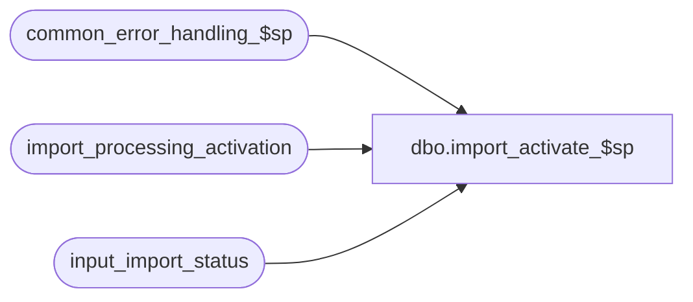

# dbo.import_activate_$sp

**Database:** auditworks_external  
**Server:** bedrockdb01  

## Architecture Diagram



## Table Dependencies

| Referenced Table |
|---|
| common_error_handling_$sp |
| import_processing_activation |
| input_import_status |

## Stored Procedure Code

```sql
create proc [dbo].[import_activate_$sp]  
@interface_id		smallint 

AS

/* Name: import_activate_$sp
** Desc: This procedure inserts into import_processing_activation to support the generation of a flag-file to be
         sent to the ICT_IMPORT to "wake it up".
         Called by export.ict. Set up in export_format interface_id 25.

HISTORY:
Date     Name       Defect#  Desc
Mar30,09 Vicci       109078  Author

*/

   
DECLARE
	@errno				int,
	@errmsg				nvarchar(255),
	@message_id			int,
	@object_name			nvarchar(255),
	@operation_name			nvarchar(100),
	@process_name			nvarchar(100),
	@process_no 			smallint

SELECT @process_no = 19,
       @process_name = 'import_activate_$sp',
       @message_id = 201068

INSERT INTO import_processing_activation (import_batch_id)
SELECT import_batch_id
  FROM input_import_status
 WHERE status = 1

SELECT @errno = @@error
IF @errno != 0 
BEGIN
  SELECT @errmsg = 'Failed to insert import_processing_activation',
         @object_name = 'import_processing_activation',
         @operation_name = 'INSERT'
  GOTO error
END  


RETURN

error:

	EXEC common_error_handling_$sp @process_no, @errno, @errmsg, 0, @message_id, 
	@process_name, @object_name, @operation_name, 0

	RETURN
```

