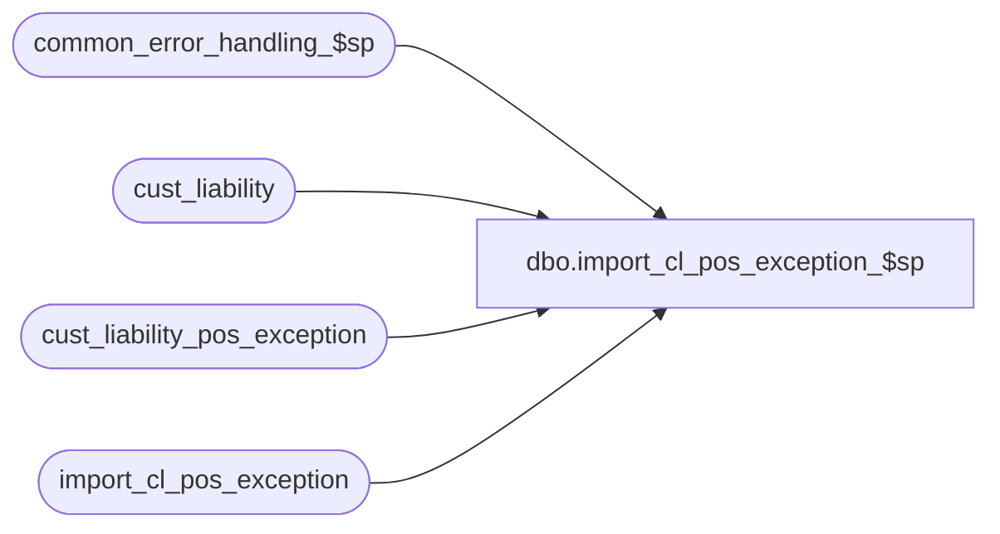

# dbo.import_cl_pos_exception_$sp

**Database:** auditworks_external  
**Server:** bedrockdb01  

## Architecture Diagram



## Table Dependencies

| Referenced Table |
|---|
| common_error_handling_$sp |
| cust_liability |
| cust_liability_pos_exception |
| import_cl_pos_exception |

## Stored Procedure Code

```sql
create proc [dbo].[import_cl_pos_exception_$sp] AS


/*
PROC NAME:   import_cl_pos_exception_$sp
PROC DESC:   CALLED BY  import.ict
             Imports exception table from POS server for exception report
 		
HISTORY
Date      Name	      Def#   Desc
JAN30,03  Daphna       5857  delete import when synchdate is null and matched to exception
JUN05,02  Daphna    1-CYE1P  author
*/
 
DECLARE
     @count			int,
     @current_export_time	smalldatetime,
     @errmsg     	        nvarchar(255),
     @errno			int,
     @last_export_time 		smalldatetime,
     @last_modified_time	smalldatetime,				 
     @log_error_flag		tinyint,
     @message_id		int,
     @object_name		nvarchar(255),
     @operation_name		nvarchar(100),
     @process_name		nvarchar(100),
     @process_no		tinyint,
     @rows			int

SELECT @current_export_time = getdate()

SELECT @process_name = 'import_cl_pos_exception_$sp',
       @message_id = 201068,
       @log_error_flag = 1,  -- called by smartload
       @process_no = 7 -- standard import
  
SELECT @count = COUNT(reference_no) 
FROM import_cl_pos_exception

IF @count = 0
BEGIN
  SELECT @errno = 201045,
         @message_id = 201045,
         @errmsg = 'import table has no rows',
         @object_name = 'import_cl_pos_exception',
         @operation_name = 'COUNT'
  GOTO error       
END

-- update exceptions from import
UPDATE cust_liability_pos_exception
   SET pos_amount_1 = i.pos_amount_1,
       pos_amount_2 = i.pos_amount_2,
       pos_amount_3 = i.pos_amount_3,
       pos_status = i.pos_status,
       aw_amount_1 = i.aw_amount_1,
       aw_amount_2 = i.aw_amount_2,
       aw_amount_3 = i.aw_amount_3,
       aw_status = i.aw_status,
       last_synched_date = i.last_synched_date,
       synch_flag = i.synch_flag,
       user_name = NULL,
       verified = 0,   -- not verified
       last_modified = i.last_modified
  FROM import_cl_pos_exception i, cust_liability_pos_exception c
 WHERE i.reference_type = c.reference_type
   AND i.reference_no = c.reference_no
   AND i.key_store_no = c.key_store_no
   AND c.synch_flag > 0  -- not previously synched

SELECT @errno = @@error, @rows = @@rowcount
IF @errno <> 0
BEGIN
  SELECT @errmsg = 'modify exceptions from POS server',
         @object_name = 'cust_liability_pos_exception',
         @operation_name = 'UPDATE'
  GOTO error       
END

IF @count <> @rows -- need to insert some import rows
BEGIN
-- delete import where matched to exception
-- DEF 5857: allow delete when synched_date IS NULL   
  DELETE import_cl_pos_exception
    FROM import_cl_pos_exception i, cust_liability_pos_exception c
   WHERE i.reference_type = c.reference_type
     AND i.reference_no = c.reference_no
     AND i.key_store_no = c.key_store_no
     AND i.synch_flag = c.synch_flag 
     AND (i.last_synched_date = c.last_synched_date OR i.last_synched_date IS NULL)

  SELECT @errno = @@error
  IF @errno <> 0
  BEGIN
    SELECT @errmsg = 'exceptions already updated',
           @object_name = 'import_cl_pos_exception',
           @operation_name = 'DELETE'
    GOTO error       
  END
  
  -- insert remaining from import
  INSERT INTO cust_liability_pos_exception
       (reference_type,
       reference_no,
       key_store_no,
       issuing_store_no,
       insert_date,
       pos_amount_1,
       pos_amount_2,
       pos_amount_3,
       pos_status,
       aw_amount_1,
       aw_amount_2,
       aw_amount_3,
       aw_status,
       last_synched_date,
       synch_flag,
       user_name,
       verified,
       last_modified)
  SELECT reference_type,
       reference_no,
       key_store_no,
       issuing_store_no,
       insert_date,
       pos_amount_1,
       pos_amount_2,
       pos_amount_3,
       pos_status,
       aw_amount_1,
       aw_amount_2,
       aw_amount_3,
       aw_status,
       last_synched_date,
       synch_flag,
       user_name,
   verified,
       last_modified
    FROM import_cl_pos_exception 

  SELECT @errno = @@error
  IF @errno <> 0
  BEGIN
    SELECT @errmsg = 'new exceptions from POS server',
           @object_name = 'cust_liability_pos_exception',
           @operation_name = 'INSERT'
    GOTO error       
  END
END -- need to insert some import rows

-- delete exceptions that were naturally synched in POS server
-- note that cust_liability's pos cols contain the values that are imported to POS
-- and compared against POS exception table's pos cols to determine natural synch


DELETE cust_liability_pos_exception
  FROM cust_liability_pos_exception e, cust_liability c
 WHERE e.reference_type = c.reference_type
   AND e.reference_no = c.reference_no
   AND e.key_store_no = c.key_store_no
   AND ((e.pos_status = c.pos_status AND e.pos_amount_1 = c.pos_amount_1 
         AND e.pos_amount_2 = c.pos_amount_2 AND e.pos_amount_3 = c.pos_amount_3) 
       OR (e.pos_status = c.pos_status AND e.synch_flag = 1))

SELECT @errno = @@error
IF @errno <> 0
BEGIN
  SELECT @errmsg = 'exceptions naturally synched on POS server',
         @object_name = 'cust_liability_pos_exception',
         @operation_name = 'DELETE'
  GOTO error       
END


RETURN

error:  
	
	EXEC common_error_handling_$sp @process_no, @errno, @errmsg, 0, @message_id, 
	@process_name, @object_name, @operation_name, @log_error_flag

	RETURN
```

