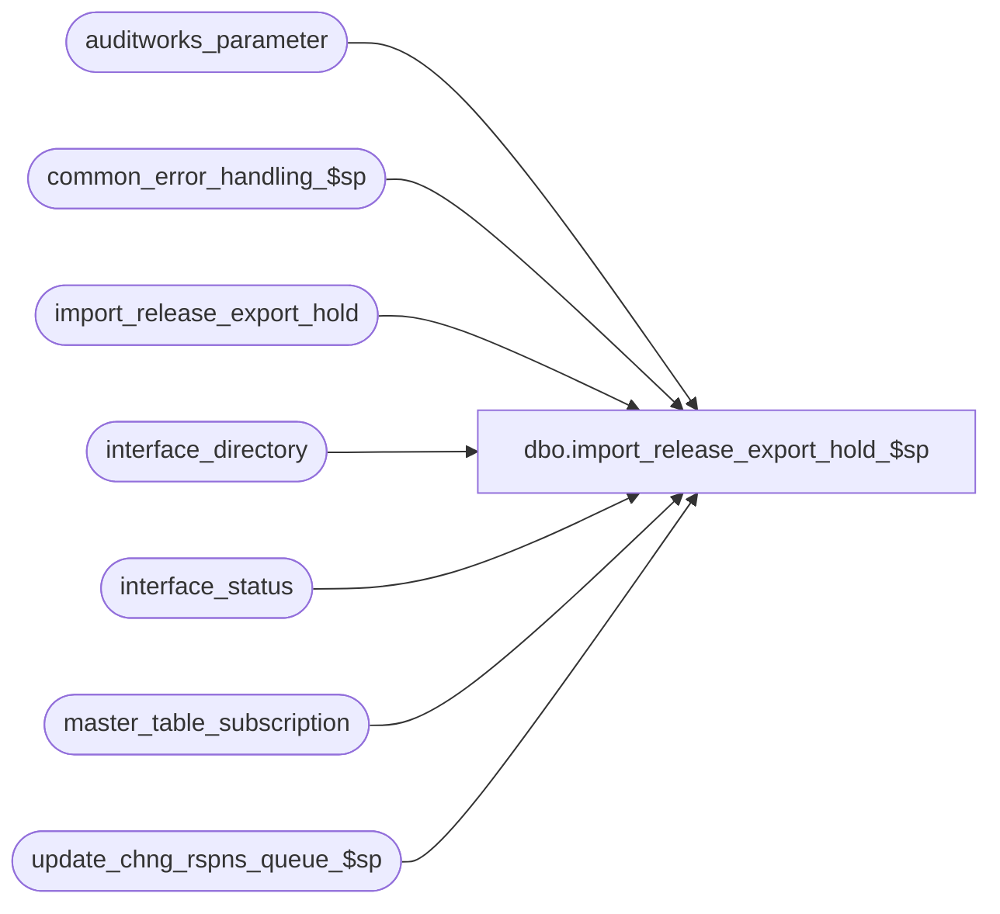

# dbo.import_release_export_hold_$sp

**Database:** auditworks_external  
**Server:** bedrockdb01  

## Architecture Diagram



## Table Dependencies

| Referenced Table |
|---|
| auditworks_parameter |
| common_error_handling_$sp |
| import_release_export_hold |
| interface_directory |
| interface_status |
| master_table_subscription |
| update_chng_rspns_queue_$sp |

## Stored Procedure Code

```sql
create proc dbo.import_release_export_hold_$sp AS

/* Proc Name: import_release_export_hold_$sp
   DESC: To release an ad-hoc interface after the import has placed it on hold
         Called by ICT_IMPORT
   

HISTORY
Date     Name    Defect# Desc
Oct07,14 Vicci TFS-87015 Since 'TAX_DEFAULT_EXCEPT_MERGE' reference is too big to fit in code_description.alpha_code, use 'TAX_DFLT_EXCPT_MERGE' instead.
Jun16,14 Vicci TFS-75199 If Edit execution of tax default exception merge has been disabled and we are releasing a hold of an interface that subscribes 
                         to taxability changes and interface 16 (Coalition) is not active (to do the merge itself), then request a merge execution (note that the merge will simply return if no taxability changes were
                         actually made).
Mar18,13 Vicci    142035 Author.
*/


DECLARE
@errmsg				nvarchar(2000),
@errno				INT,
@process_no			int,
@process_name		        nvarchar(100),
@message_id		        int,	
@object_name			nvarchar(255),
@operation_name			nvarchar(255),
@sql_command 			nvarchar(2000),
@rows				int,
@interface_id			tinyint,
@hold_datetime			datetime,
@process_id                     binary(16),
@user_id                        int,
@cursor_open			tinyint

SET CONCAT_NULL_YIELDS_NULL OFF

SELECT @process_name = 'import_release_export_hold_$sp',
       @process_no = 0,
       @message_id = 201068,
       @process_id = @@spid,
       @object_name = 'unknown',
       @operation_name = 'unknown',
       @cursor_open = 0

SET NOCOUNT ON

DECLARE release_hold_cursor CURSOR FAST_FORWARD
    FOR
 SELECT interface_id, hold_datetime
   FROM import_release_export_hold
SELECT @errno = @@error
IF @errno <> 0
BEGIN
  SELECT @errmsg = 'Unable to declare release_hold_cursor',
         @object_name = 'release_hold_cursor',
         @operation_name = 'DECLARE'
  GOTO error
END    


OPEN release_hold_cursor
SELECT @cursor_open = 1

FETCH release_hold_cursor
 INTO @interface_id, @hold_datetime

WHILE @@fetch_status = 0 
BEGIN
  UPDATE interface_status
     SET hold_datetime = null
   WHERE interface_id = @interface_id
     AND hold_datetime = @hold_datetime
  SELECT @errno = @@error, @rows = @@rowcount
  SET NOCOUNT OFF
  IF @errno <> 0
  BEGIN
    SELECT @errmsg = 'Unable to cancel hold',
           @object_name = 'interface_status',
           @operation_name = 'UPDATE'
    GOTO error
  END    
  
  IF @rows > 0
  BEGIN
    PRINT NCHAR(13) + NCHAR(10) + ':LOG ==> Hold held on interface_id: ' + convert(nvarchar, @interface_id) + ' since: ' + convert(nvarchar, @hold_datetime) + ' released.'
    IF EXISTS (SELECT 1
	         FROM auditworks_parameter
	        WHERE par_name = 'disable_edit_tax_merge'
	          AND par_value = '1') 
       AND
       EXISTS (SELECT 1
	         FROM master_table_subscription  --i.e. the interface being released subscribes to items affecting the tax default exception merge
	        WHERE interface_id = @interface_id
	          AND table_name IN ('line_object.tax_item_group_id', 'tax_default', 'tax_item_group.line_object', 'taxability_by_item_group')) 
       AND (   @interface_id <> 16  --i.e. will not be running the merge itself since only Coalition does
            OR EXISTS (SELECT 1
	                 FROM interface_directory  --i.e. the interface being released is not active and will therefore not be running the merge itself
	                WHERE interface_id = @interface_id
	                  AND update_timing = 0)
	   )
    BEGIN
      PRINT NCHAR(13) + NCHAR(10) + ':LOG ==> Request for execution of tax_default_exception_merge issued to mass auto revalidation process.' 
      EXEC update_chng_rspns_queue_$sp 'TAX_DFLT_EXCPT_MERGE'   --ask the revalidation process to run the merge.
      SELECT @errno = @@error
      IF @errno != 0
      BEGIN
	SELECT @errmsg = 'Unable to execute update_chng_rspns_queue_$sp.'  
	GOTO error
END
    END
  END
  ELSE
  BEGIN
    PRINT NCHAR(13) + NCHAR(10) + ':LOG ==> Hold placed on interface_id: ' + convert(nvarchar, @interface_id) + ' on: ' + convert(nvarchar, @hold_datetime) + ' not longer existed and could not be released.'
  END

  DELETE import_release_export_hold
   WHERE interface_id = @interface_id
     AND hold_datetime = @hold_datetime
  SELECT @errno = @@error
  IF @errno <> 0
  BEGIN
    SELECT @errmsg = 'Unable to remove released hold from list of those outstanding.',
           @object_name = 'import_release_export_hold',
           @operation_name = 'DELETE'
    GOTO error
  END    

  FETCH release_hold_cursor
  INTO @interface_id, @hold_datetime
 END /* while not end of release_hold_cursor */

CLOSE release_hold_cursor
DEALLOCATE release_hold_cursor
SELECT @cursor_open = 0

SET NOCOUNT OFF

RETURN

error:

	    IF @cursor_open = 1
	    BEGIN
	      CLOSE release_hold_cursor
	      DEALLOCATE release_hold_cursor
	    END

            EXEC common_error_handling_$sp @process_no, @errno, @errmsg, 0, @message_id,
            @process_name, @object_name, @operation_name, 0, 1, 0, null, 0, null, null, null,
            null, null, null, 0, @process_id, @user_id
            RETURN
```

