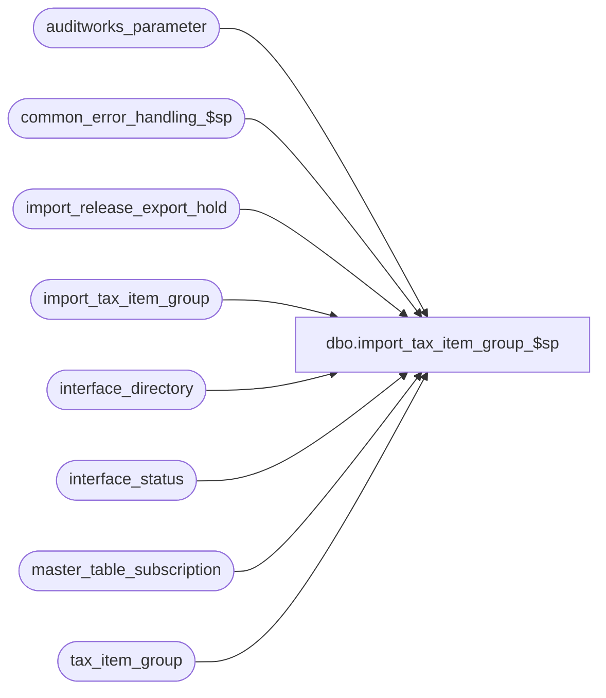

# dbo.import_tax_item_group_$sp

**Database:** auditworks_external  
**Server:** bedrockdb01  

## Architecture Diagram



## Table Dependencies

| Referenced Table |
|---|
| auditworks_parameter |
| common_error_handling_$sp |
| import_release_export_hold |
| import_tax_item_group |
| interface_directory |
| interface_status |
| master_table_subscription |
| tax_item_group |

## Stored Procedure Code

```sql
create proc dbo.import_tax_item_group_$sp AS

/* Version:1.00 Date:Nov,07,2002 */
/* Author:Maryam Saleh-Taleghani */
/* Description: This program posts imported tax_item_group rows to the tax_item_group table. 

HISTORY
Date     Name		Def#  Desc
Sep29,14 Vicci         86335  Remove reliance on SET ANSI_NULLS being ON.
Jun17,14 Vicci     TFS-75199  If no hold was placed (because Coalition is inactive and there is no other interface subscribing to tax config) 
                              and the Edit won't be running the merge, then put the Coalition interface on hold anyway so that when all the files
                              to be imported have been brought in and the hold is released this will launch a merge request.
Mar18,13 Vicci        142035  Put export on hold until import completes. Don't apply changes that are already reflected in master table.
Sep06,06 Tim           76719  Null Concatenation Fix.
Nov07,02 Maryam      1-G4Q91  Author

*/


DECLARE
  @errno			int,
  @errmsg		        nvarchar(2000),
  @entry_type			nchar(1),
  @tax_item_group_id		numeric(10,0),
  @tax_item_group_code          nvarchar(10),   
  @tax_item_group_description	nvarchar(50),
  @rows				int,
  @cursor_open			int,
-- used for common error handling.
  @process_no			smallint,
  @log_flag			tinyint,
  @object_name			nvarchar(255),
  @process_name			nvarchar(100),
  @operation_name		nvarchar(100),
  @message_id			int,
  @message_id2			int,
  @memo1			nvarchar(50),
  @hold_datetime		datetime,
  @hold_placed			tinyint

SET CONCAT_NULL_YIELDS_NULL OFF

SELECT @cursor_open = 0,
       @process_name = 'import_tax_item_group_$sp',
       @message_id = 201068,
       @log_flag = 1,  -- called from smartload
       @process_no = 7, -- standard import
       @hold_datetime = getdate()

BEGIN TRY
UPDATE interface_status
   SET hold_datetime = @hold_datetime
  FROM master_table_subscription m WITH (NOLOCK)
 WHERE m.table_name = 'tax_item_group'
   AND m.update_timing = 5
   AND m.interface_id =  interface_status.interface_id
   AND interface_status.hold_datetime IS NULL
SELECT @hold_placed = sign(@@rowcount)
END TRY
BEGIN CATCH
  SELECT @errno = ERROR_NUMBER(), @errmsg = ERROR_MESSAGE()
IF @errno != 0
BEGIN
  SELECT @errmsg = @errmsg + ' -Failed to place exports to interfaces subscribing to tax_item_group changes on hold while import runs',
         @object_name = 'interface_status',
         @operation_name = 'UPDATE'
  GOTO error
END
END CATCH

--If no hold was placed (because Coalition is inactive and there is no other interface subscribing to tax config) and the Edit won't be running the merge,
--then put the Coalition interface on hold anyway so that when all the files to be imported have been brought in and the hold is release this will launch a merge request
IF @hold_placed = 0  AND EXISTS (SELECT 1
	                           FROM auditworks_parameter
                	          WHERE par_name = 'disable_edit_tax_merge'
                	            AND par_value = '1') 
BEGIN
  BEGIN TRY
  UPDATE interface_status
     SET hold_datetime = @hold_datetime
    FROM interface_directory d WITH (NOLOCK)
   WHERE d.interface_id = 16
     AND d.update_timing = 0
     AND d.interface_id =  interface_status.interface_id
     AND interface_status.hold_datetime IS NULL
  SELECT @hold_placed = sign(@@rowcount)
  END TRY
  BEGIN CATCH
    SELECT @errno = ERROR_NUMBER(), @errmsg = ERROR_MESSAGE()
  IF @errno != 0
  BEGIN
    SELECT @errmsg = @errmsg + ' -Failed to place Coalition export on hold while import runs even though it is inactive.  ',
           @object_name = 'interface_status',
           @operation_name = 'UPDATE'
    GOTO error
  END
  END CATCH
END


BEGIN TRY
DELETE import_tax_item_group
  FROM tax_item_group g WITH (NOLOCK)
 WHERE import_tax_item_group.entry_type <> 'D'
   AND import_tax_item_group.tax_item_group_id = g.tax_item_group_id 
   AND import_tax_item_group.tax_item_group_code = g.tax_item_group_code
   AND import_tax_item_group.tax_item_group_description = g.tax_item_group_description
END TRY
BEGIN CATCH
  SELECT @errno = ERROR_NUMBER(), @errmsg = ERROR_MESSAGE()
IF @errno != 0
BEGIN
  SELECT @errmsg = @errmsg + ' -Failed to remove import_tax_item_group rows which are already reflected in tax_item_group.',
         @object_name = 'import_tax_item_group',
         @operation_name = 'DELETE'
  GOTO error
END
END CATCH

  DECLARE tax_item_crsr CURSOR
  FOR
  SELECT entry_type,
         tax_item_group_id,
         tax_item_group_code,
         tax_item_group_description
    FROM import_tax_item_group

	
  OPEN tax_item_crsr

  SELECT @errno = @@error
  IF @errno != 0
    BEGIN
      SELECT @errmsg = 'Failed to open cursor tax_item_crsr.',
	     @object_name = 'tax_item_crsr',
	     @operation_name = 'OPEN'
      GOTO error
    END

  SELECT @cursor_open = 1

  WHILE 1=1
  BEGIN

  FETCH tax_item_crsr INTO
	@entry_type,
	@tax_item_group_id,
      @tax_item_group_code,
      @tax_item_group_description
        
  IF @@fetch_status <> 0
    BREAK

  IF UPPER(@entry_type) NOT IN ('I', 'D', 'U')
    BEGIN

      SELECT @errmsg = 'An invalid entry-type was encountered in the import file. Please verify the |1 table.',
	     @errno =  201735,
	     @message_id2 = 201735,
	     @memo1 = 'import_tax_item_group'

      EXEC common_error_handling_$sp @process_no, @errno, @errmsg, 3, @message_id2, 
	   @process_name, @object_name, @operation_name, @log_flag, NULL, NULL,NULL, NULL, @memo1

    END
    
  IF UPPER(@entry_type) = 'D'
  BEGIN
    BEGIN TRY
  DELETE tax_item_group
     WHERE tax_item_group_id = @tax_item_group_id
    END TRY
    BEGIN CATCH
      SELECT @errno = ERROR_NUMBER(), @errmsg = ERROR_MESSAGE()
    IF @errno != 0
    BEGIN
      SELECT @errmsg = @errmsg + ' -Failed to DELETE from tax_item_group table',
	     @object_name = 'tax_item_group',
	     @operation_name = 'DELETE'
      GOTO error
    END
    END CATCH

  END --IF @entry_type = 'D'

  IF UPPER(@entry_type) IN ('I', 'U')
  BEGIN
    BEGIN TRY
    UPDATE tax_item_group
       SET tax_item_group_code = @tax_item_group_code,
           tax_item_group_description = @tax_item_group_description
     WHERE tax_item_group_id = @tax_item_group_id       
    SELECT @rows = @@rowcount
    END TRY
    BEGIN CATCH
      SELECT @errno = ERROR_NUMBER(), @errmsg = ERROR_MESSAGE()
    IF @errno != 0
    BEGIN
      SELECT @errmsg = @errmsg + ' -Failed to UPDATE tax_item_group from import_tax_item_group',
	     @object_name = 'tax_item_group',
	     @operation_name = 'UPDATE'
      GOTO error
    END
    END CATCH
  
    IF @rows = 0 
    BEGIN 
      BEGIN TRY
      INSERT tax_item_group (
             tax_item_group_id,
             tax_item_group_code,
             tax_item_group_description)
      VALUES (@tax_item_group_id,
             @tax_item_group_code,
             @tax_item_group_description)
      END TRY
      BEGIN CATCH
        SELECT @errno = ERROR_NUMBER(), @errmsg = ERROR_MESSAGE()
      IF @errno != 0
      BEGIN
        SELECT @errmsg = @errmsg + ' -Fail to INSERT imported exceptions for tax_item_group_id = ' +
                              CONVERT(nvarchar, @tax_item_group_id) +', tax_item_group_code = ' + @tax_item_group_code +
                             ', tax_item_group_description = ' + @tax_item_group_description + 
                             ' into the tax_item_group table ',
	       @object_name = 'tax_item_group',
	       @operation_name = 'INSERT'
        GOTO error
      END
      END CATCH

    END -- IF @rows = 0 
  END --IF @entry_type IN ('I', 'U')
END /* WHILE 1=1 */

CLOSE tax_item_crsr
SELECT @errno = @@error
IF @errno != 0
  BEGIN
    SELECT @errmsg = 'Failed to CLOSE cursor tax_item_crsr.',
           @object_name = 'tax_item_crsr',
   @operation_name = 'CLOSE'
    GOTO error
  END

DEALLOCATE tax_item_crsr
    
IF @hold_placed = 1
BEGIN
  INSERT INTO import_release_export_hold(
         interface_id,
         hold_datetime)
  SELECT DISTINCT interface_id, hold_datetime
    FROM interface_status i WITH (NOLOCK)
   WHERE i.hold_datetime = @hold_datetime
  SELECT @errno = @@error
  IF @errno != 0
  BEGIN
    SELECT @errmsg = 'Failed to create entries that ICT_IMPORT will export as interface hold release requests and process once done importing other files.',
           @object_name = 'import_release_export_hold',
           @operation_name = 'INSERT'
    GOTO error
  END

  --Note: when this line is printed, the import ICT will drop a release_export_hold.GO file into the directory with priority 9999 to cause release to be placed last on TO-Do list.  
  PRINT ':LOG ReleaseExportHold'  
END  --IF @hold_placed = 1

RETURN


error:   /* Common error handler. */

	IF @hold_placed = 1
	BEGIN
	  INSERT INTO import_release_export_hold(
	         interface_id,
	         hold_datetime)
	  SELECT DISTINCT interface_id, hold_datetime
	    FROM interface_status i WITH (NOLOCK)
	   WHERE i.hold_datetime = @hold_datetime

	  --Note: when this line is printed, the import ICT will drop a release_export_hold.GO file into the directory with priority 9999 to cause release to be placed last on TO-Do list.  
	  PRINT ':LOG ReleaseExportHold'  
	END  --IF @hold_placed = 1

	IF @cursor_open = 1
	  BEGIN
	   CLOSE tax_item_crsr
	   DEALLOCATE tax_item_crsr
	  END

	EXEC common_error_handling_$sp @process_no, @errno, @errmsg, 0, @message_id, 
	@process_name, @object_name, @operation_name, @log_flag

        RETURN
```

