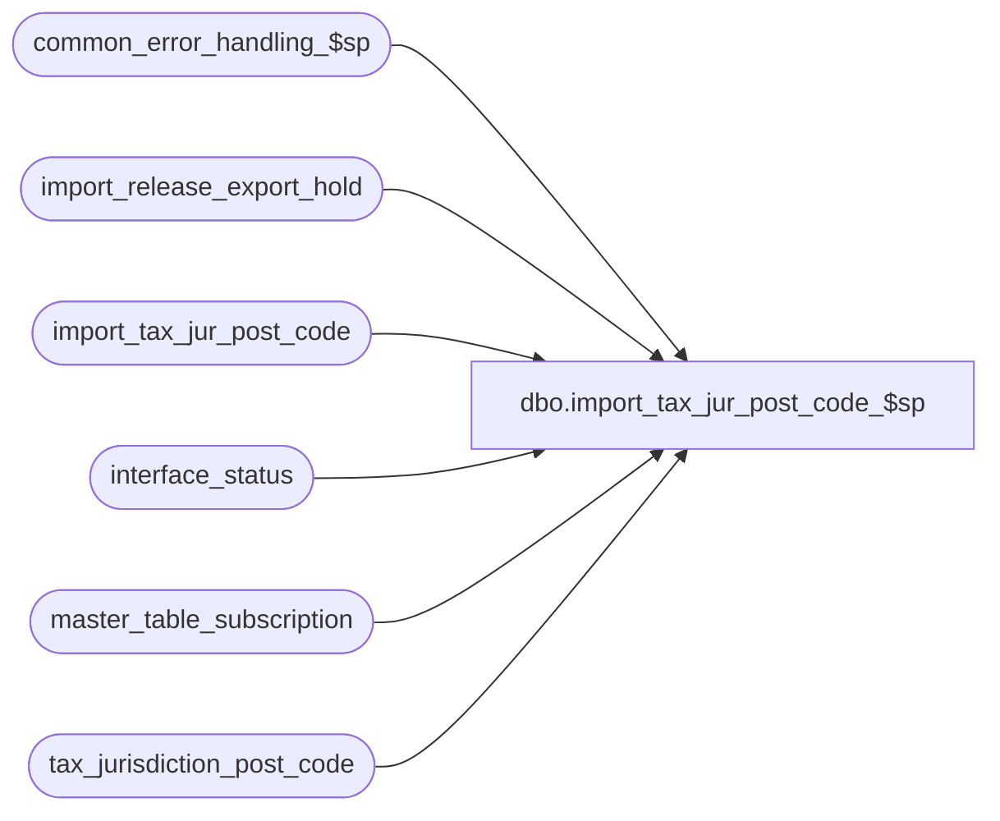

# dbo.import_tax_jur_post_code_$sp

**Database:** auditworks_external  
**Server:** bedrockdb01  

## Architecture Diagram



## Table Dependencies

| Referenced Table |
|---|
| common_error_handling_$sp |
| import_release_export_hold |
| import_tax_jur_post_code |
| interface_status |
| master_table_subscription |
| tax_jurisdiction_post_code |

## Stored Procedure Code

```sql
create proc dbo.import_tax_jur_post_code_$sp AS

/* 
DESCRIPTION: This program posts data from import_tax_jur_post_code to the 
             tax_jurisdiction_post_code table based on the I'nsert and D'elete-file entry_type.
HISTORY
Date     Name              Def#  Desc
Oct17,13 Vicci           147424  Remove pre-validation (already done in triggers) and handle business rules in try-catch instead.
Mar18,13 Vicci           142035  Put export on hold until import completes.
Aug14,12 Vicci           137565  Add warning to process error log if conflicting entries for same key have been imported and order by entry_id.
Jul14,08 Vicci         1-3WYFUI  Handle updating tax-jurisdiction assigned to a particular zip-code range.
Sep06,06 Tim/Paul   75320/76719  Null Concatenation Fix.
Jan27,04 David    22555/1-QGRMC  Validate entries before trying to Insert. Add memo fields in error msgs.
Nov07,02 Maryam         1-G2KUX  Author

*/

DECLARE
  @errno		int,
  @errmsg		nvarchar(2000),
  @errmsg2		nvarchar(2000),
  @entry_type		nchar(1),
  @tax_jurisdiction	nchar(5),
  @from_post_code       nvarchar(20),
  @to_post_code         nvarchar(20),
  @cursor_open		int,
-- used for common error handling.
  @row_exist		int,
  @process_no		smallint,
  @log_flag		tinyint,
  @object_name		nvarchar(255),
  @process_name		nvarchar(100),
  @operation_name	nvarchar(100),
  @message_id		int,
  @message_id2		int,
  @memo1 		nvarchar(300),
  @hold_datetime	datetime,
  @hold_placed		tinyint;

SELECT @row_exist = 0,
       @cursor_open = 0,
       @process_name = 'import_tax_jur_post_code_$sp',
       @message_id = 201068,
       @log_flag = 1,  -- called from smartload
       @process_no = 7, -- standard import
       @hold_datetime = getdate(),
       @errno = 0,
       @operation_name = 'SELECT';

BEGIN TRY

SELECT @errmsg = 'Failed to place exports to interfaces subscribing to tax_jurisdiction_post_code changes on hold while import runs. ',
       @object_name = 'interface_status',
       @operation_name = 'UPDATE';
UPDATE interface_status
   SET hold_datetime = @hold_datetime
  FROM master_table_subscription m WITH (NOLOCK)
 WHERE m.table_name = 'tax_jurisdiction_post_code'
   AND m.update_timing = 5
   AND m.interface_id =  interface_status.interface_id
   AND interface_status.hold_datetime IS NULL;
SELECT @hold_placed = sign(@@rowcount);
      
SELECT @errmsg = 'Failed to determine if any conflicting entries were imported. ',
       @object_name = 'import_tax_jur_post_code',
       @operation_name = 'SELECT';
SELECT @memo1 = MIN(q.entry_key)
  FROM (SELECT tax_jurisdiction + '/' + from_post_code + '/' + to_post_code entry_key, 
               count(1) conflicting_entry_count
          FROM import_tax_jur_post_code
         GROUP BY tax_jurisdiction, from_post_code, to_post_code
        HAVING count(1) > 1) q;

IF @memo1 IS NOT NULL
BEGIN
  SELECT @errmsg = ':LOG EXECWARN: WARNING!!  Multiple entries for the same key were imported. Please verify (for example) tax jurisdiction/post-code range:  ' + @memo1 + ' in the import_tax_jur_post_code table.'
  PRINT @errmsg

  SELECT @errmsg = 'Multiple entries for the same key were imported. Please verify key tax jurisdiction/post-code range:  ' + @memo1 + ' in the import_tax_jur_post_code table. ',
	 @object_name = 'import_tax_jur_post_code',
	 @operation_name = 'SELECT',
	 @errno =  201736,
	 @message_id2 = 201736
  EXEC common_error_handling_$sp @process_no, @errno, @errmsg, 3, @message_id2, @process_name, @object_name, @operation_name, 
                                 @log_flag, 1, 0, NULL, 0, @memo1, 'import_tax_jur_post_code';
  SELECT @errno = 0;
END
  
SELECT @errmsg = 'Failed to define cursor tax_jur_post_crsr. ',
       @object_name = 'tax_jur_post_crsr',
       @operation_name = 'DECLARE'; 
DECLARE tax_jur_post_crsr CURSOR
    FOR
 SELECT entry_type,
	tax_jurisdiction,
	from_post_code,
	to_post_code
   FROM import_tax_jur_post_code
  ORDER BY entry_id;
 
SELECT @operation_name = 'OPEN'; 
OPEN tax_jur_post_crsr;
SELECT @cursor_open = 1;

WHILE 1=1
BEGIN
  SELECT @row_exist = 0;
  
  SELECT @errmsg = 'Failed to fetch cursor tax_jur_post_crsr. ',
         @object_name = 'tax_jur_post_crsr',
         @operation_name = 'FETCH'; 
  FETCH tax_jur_post_crsr INTO
	@entry_type,
	@tax_jurisdiction,
	@from_post_code,
	@to_post_code;

  IF @@fetch_status <> 0
    BREAK;

  IF UPPER(@entry_type) NOT IN ('I', 'D')
    BEGIN
      SELECT @errmsg = 'An invalid entry-type (' +  UPPER(@entry_type) + ') was encountered in the import file. Please verify the import_tax_jur_post_code table. ',
	     @errno =  201074,
	     @message_id2 = 201074,
	     @memo1 = 'import_tax_jur_post_code';
      EXEC common_error_handling_$sp @process_no, @errno, @errmsg, 3, @message_id2, 
		@process_name, @object_name, @operation_name, @log_flag, NULL, NULL,NULL, NULL, @memo1;
      SELECT @errno = 0;
      CONTINUE;
  END;

  IF UPPER(@entry_type) = 'D'
  BEGIN
    SELECT @errmsg = 'Failed to DELETE from tax_jurisdiction_post_code. ',
	   @object_name = 'tax_jurisdiction_post_code',
	   @operation_name = 'DELETE';
    DELETE tax_jurisdiction_post_code
     WHERE from_post_code = @from_post_code
       AND to_post_code = @to_post_code;
  END; --IF @entry_type = 'D'

  IF UPPER(@entry_type) = 'I'
  BEGIN
    SELECT @errmsg = 'Failed to determine if post-code range already exists. ',
	   @object_name = 'tax_jurisdiction_post_code',
	   @operation_name = 'SELECT';
    IF EXISTS (SELECT 1
                 FROM tax_jurisdiction_post_code
                WHERE from_post_code = @from_post_code
                  AND to_post_code = @to_post_code)
      SELECT @row_exist = 1;
      
    SELECT @object_name = 'tax_jurisdiction_post_code'
    IF @row_exist = 0
    BEGIN
      BEGIN TRY
        SELECT @errmsg = 'Unable to INSERT into the tax_jurisdiction_post_code table for tax_jurisdiction = ' + @tax_jurisdiction +
                         ', from_post_code = ' +  @from_post_code + ', to_post_code = ' + @to_post_code + '. ',
	       @operation_name = 'INSERT';
        INSERT tax_jurisdiction_post_code (
               tax_jurisdiction,
               from_post_code,
               to_post_code)
        VALUES(@tax_jurisdiction,
               @from_post_code,
               @to_post_code);
      END TRY
      BEGIN CATCH
        SELECT @errno = ERROR_NUMBER(), 
               @errmsg2 = ERROR_MESSAGE();
        IF @errno IN (201671, 201672, 201673)
        BEGIN
          EXEC common_error_handling_$sp @process_no, @errno, @errmsg2, 3, @errno, @process_name, @object_name, @operation_name, @log_flag, NULL,NULL,NULL,NULL, @tax_jurisdiction;
          SELECT @errno = 0;
        END;
        ELSE
          GOTO general_error;
      END CATCH;      
    END; --IF @row_exist = 0
    ELSE
    BEGIN
      BEGIN TRY
        SELECT @errmsg = 'Unable to modify the tax-jurisdiction assigned to the post-code range from ' + @from_post_code + ' to ' + @to_post_code +
                         ' to be ' + @tax_jurisdiction + '. ',
               @operation_name = 'UPDATE';
        UPDATE tax_jurisdiction_post_code
           SET tax_jurisdiction = @tax_jurisdiction
         WHERE from_post_code = @from_post_code
           AND to_post_code = @to_post_code
           AND tax_jurisdiction <> @tax_jurisdiction;
      END TRY
      BEGIN CATCH
        SELECT @errno = ERROR_NUMBER(), 
               @errmsg2 = ERROR_MESSAGE();
        IF @errno IN (201672, 201673)
        BEGIN
          EXEC common_error_handling_$sp @process_no, @errno, @errmsg2, 3, @errno, @process_name, @object_name, @operation_name, @log_flag, NULL,NULL,NULL,NULL, @tax_jurisdiction;
          SELECT @errno = 0;
        END;
        ELSE
          GOTO general_error;
      END CATCH;      

    END;
  END; --IF @entry_type = 'I'
END; /* WHILE 1=1 */

SELECT @errmsg = 'Failed to close and deallocate cursor tax_jur_post_crsr. ',
       @object_name = 'tax_jur_post_crsr',
       @operation_name = 'CLOSE';
CLOSE tax_jur_post_crsr;
SELECT @operation_name = 'DEALLOCATE';
DEALLOCATE tax_jur_post_crsr;
SELECT @cursor_open = 0;

IF @hold_placed = 1
BEGIN
  SELECT @errmsg = 'Failed to create entries that ICT_IMPORT will export as interface hold release requests and process once done importing other files. ',
         @object_name = 'import_release_export_hold',
         @operation_name = 'INSERT';  
  INSERT INTO import_release_export_hold(
         interface_id,
         hold_datetime)
  SELECT DISTINCT interface_id, hold_datetime
    FROM interface_status i WITH (NOLOCK)
   WHERE i.hold_datetime = @hold_datetime;

  --Note: when this line is printed, the import ICT will drop a release_export_hold.GO file into the directory with priority 9999 to cause release to be placed last on TO-Do list.  
  PRINT ':LOG ReleaseExportHold';
END;  --IF @hold_placed = 1

RETURN;

general_error:
  SELECT @errno = ERROR_NUMBER(),
         @errmsg2 = @process_name + ':  ' + COALESCE(@errmsg, '') + ' Line: ' + CONVERT(nvarchar, ERROR_LINE()) + ', ' + ERROR_MESSAGE() ;

  IF @hold_placed = 1
  BEGIN
    INSERT INTO import_release_export_hold(
	   interface_id,
	   hold_datetime)
    SELECT DISTINCT interface_id, hold_datetime
      FROM interface_status i WITH (NOLOCK)
     WHERE i.hold_datetime = @hold_datetime;
    --Note: when this line is printed, the import ICT will drop a release_export_hold.GO file into the directory with priority 9999 to cause release to be placed last on TO-Do list.  
    PRINT ':LOG ReleaseExportHold';
  END;  --IF @hold_placed = 1
  
  IF @cursor_open = 1
  BEGIN
    CLOSE tax_jur_post_crsr;
    DEALLOCATE tax_jur_post_crsr;
    SELECT @cursor_open = 0;
  END;

  EXEC common_error_handling_$sp @process_no, @errno, @errmsg2, 0, @message_id, @process_name, @object_name, @operation_name, @log_flag;
  RETURN;

END TRY

BEGIN CATCH
  SELECT @errno = ERROR_NUMBER();
  IF @errmsg2 IS NULL  --i.e. not already set by general_error
  BEGIN
    SELECT @errmsg2 = @process_name + ':  ' + COALESCE(@errmsg, '') + ' Line: ' + CONVERT(nvarchar, ERROR_LINE()) + ', ' + ERROR_MESSAGE();
  END;
  SELECT @errmsg = @errmsg2;  
  
  IF @hold_placed = 1
  BEGIN
    INSERT INTO import_release_export_hold(
	   interface_id,
	   hold_datetime)
    SELECT DISTINCT interface_id, hold_datetime
      FROM interface_status i WITH (NOLOCK)
     WHERE i.hold_datetime = @hold_datetime;
    --Note: when this line is printed, the import ICT will drop a release_export_hold.GO file into the directory with priority 9999 to cause release to be placed last on TO-Do list.  
    PRINT ':LOG ReleaseExportHold';
  END;  --IF @hold_placed = 1
  
  IF @cursor_open = 1
  BEGIN
    CLOSE tax_jur_post_crsr;
    DEALLOCATE tax_jur_post_crsr;
    SELECT @cursor_open = 0;
  END;

  EXEC common_error_handling_$sp @process_no, @errno, @errmsg2, 0, @message_id, @process_name, @object_name, @operation_name, @log_flag;
  
  RETURN;
END CATCH;
```

