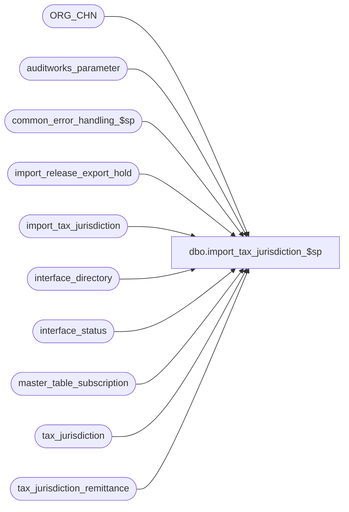

# dbo.import_tax_jurisdiction_$sp

**Database:** auditworks_external  
**Server:** bedrockdb01  

## Architecture Diagram



## Table Dependencies

| Referenced Table |
|---|
| ORG_CHN |
| auditworks_parameter |
| common_error_handling_$sp |
| import_release_export_hold |
| import_tax_jurisdiction |
| interface_directory |
| interface_status |
| master_table_subscription |
| tax_jurisdiction |
| tax_jurisdiction_remittance |

## Stored Procedure Code

```sql
create proc dbo.import_tax_jurisdiction_$sp AS

/* 
PROC NAME: import_tax_jurisdiction_$sp
     DESC: This program posts imported tax jurisdiction data to the tax_jurisdiction table. 
           It also inserts/updates the tax_jurisdiction_remittance table and updates the 
  	   ORG_CHN table. Uniqueness is enforced on tax_jurisdiction and on pos_tax_jurisdiction_code.
	Note: When interface_id 16 is active, the pos_tax_jurisdiction_code is set by the insert trigger
	      on tax_jurisdiction to the value from identity column tax_jurisdiction_id.

HISTORY:
Date     Name           Def# Desc
Jun17,14 Vicci     TFS-75199 If no hold was placed (because Coalition is inactive and there is no other interface subscribing to tax config) 
                             and the Edit won't be running the merge, then put the Coalition interface on hold anyway so that when all the files
                             to be imported have been brought in and the hold is released this will launch a merge request.
Oct21,13 Vicci        147424 Use standard SQL2012 approach for error trapping (changing order of message appending to avoid loss of message portion following memos),
				added comments re handling a possible error 2601 on pos_tax_jurisdiction_code.
Mar18,13 Vicci        142035 Put export on hold until import completes.  Don't apply changes that are already reflected in master table.
May01,09 Vicci        109972 Avoid errors when different jurisdiction names are accidentally assigned to the same 
                             jurisdiction for insert (can happen in multi-level environment) by using greatest of
                             names provided (to match existing update functionality under those circumstances).
Jan31,08 Paul          97584 Uplift 97686 to SA5
Sep06,06 Tim           76719 Apply 75320 to SA5
Jul27,06 Tim           69753 Uplift defect 1-391397 to SA5
May25,04 David       DV-1071 Use ORG_CHN table as the new Store table.
Jan30,08 Paul          97686 allow modifying jurisdiction_name and remit_to_location_code
Sep06,06 Tim           75320 Null Concatenation Fix.
Feb14,06 Shapoor    1-391397 Use a Cursor to do the INSERT one row at a time.  This will ensure that the INSERT trigger 
                             will correctly handle the update of pos_tax_jurisdiction_code column.
Mar18,03 Phu            5425 Remove @errmsg from parameter list to standardize import
May16,02 Henry	     1-CD0IX Add R3.5 standardized common error handling
Jun27,01 Maryam         8090 Populate pos_tax_jurisdiction_code when it is provided
                             otherwise set it to tax_jurisdiction.
May03,01 Bayani D       7719 Included pos_tax_jurisdiction_code column in the insert
			     rows from import_tax_jurisdiction into tax_jurisdiction  
Mar30,00 Phu            6158 Remove alias name attached to column being updated for MS SQL compatibility
Sep28,99 Daphna F	5411 delete from import_tax_jurisdictions where already exist in
			     tax jurisdiction, remove clause from update and insert statements
			     delete from import_tax_jurisdiction where already exist
			     in tax_jurisdiction_remittance remove clause from insert
Oct07,97 Brent B        n/a  author version 1.00  

*/

DECLARE
  @errno		int,
  @errmsg		nvarchar(2000),
  @errmsg2		nvarchar(2000),
-- used for common error handling.
	@process_no			smallint,
	@log_flag			tinyint,
	@object_name			nvarchar(255),
	@process_name			nvarchar(100),
	@operation_name			nvarchar(100),
	@message_id			int,
-- For the cursor insert into tax_jurisdiction DEFECT 1-391397
	@cursor_open			tinyint,
	@rows				int,
	@tax_jurisdiction		nchar(5),
        @jurisdiction_name		nvarchar(50),
        @pos_tax_jurisdiction_code	nvarchar(20),
        @hold_datetime			datetime,
        @hold_placed			tinyint;		
	
SET CONCAT_NULL_YIELDS_NULL OFF;

SELECT @process_name = 'import_tax_jurisdiction_$sp',
       @message_id = 201068,
       @log_flag = 1,  -- called from smartload
       @process_no = 7, -- standard import
       @hold_datetime = getdate(),
       @errno = 0,
       @operation_name = 'SELECT';

BEGIN TRY

SELECT @errmsg = 'Failed to place exports to interfaces subscribing to tax_jurisdiction and indirectly impacted changes on hold while import runs. ',
       @object_name = 'interface_status',
       @operation_name = 'UPDATE';
UPDATE interface_status
   SET hold_datetime = @hold_datetime
  FROM master_table_subscription m WITH (NOLOCK)
 WHERE m.table_name IN ('tax_jurisdiction_remittance', 'tax_jurisdiction', 'tax_rate', 'tax_default', 'store_salesaudit')
   AND m.update_timing = 5
   AND m.interface_id =  interface_status.interface_id
   AND interface_status.hold_datetime IS NULL;
SELECT @hold_placed = sign(@@rowcount);

--If no hold was placed (because Coalition is inactive and there is no other interface subscribing to tax config) and the Edit won't be running the merge,
--then put the Coalition interface on hold anyway so that when all the files to be imported have been brought in and the hold is release this will launch a merge request
IF @hold_placed = 0  AND EXISTS (SELECT 1
	                           FROM auditworks_parameter
                	          WHERE par_name = 'disable_edit_tax_merge'
                	            AND par_value = '1') 
BEGIN
  SELECT @errmsg = @errmsg + ' -Failed to place Coalition export on hold while import runs even though it is inactive.  ';
  UPDATE interface_status
     SET hold_datetime = @hold_datetime
    FROM interface_directory d WITH (NOLOCK)
   WHERE d.interface_id = 16
     AND d.update_timing = 0
     AND d.interface_id =  interface_status.interface_id
     AND interface_status.hold_datetime IS NULL;
  SELECT @hold_placed = sign(@@rowcount);
END

/* First pass through the import_tax_jurisdiction table is to set the tax_jurisdiction
	to remit_to_location_code + store_no if it is NULL. */
SELECT @errmsg = 'Failed to generate tax_jurisdiction from remit_to_location_code and store_no. ',
       @object_name = 'import_tax_jurisdiction';
UPDATE import_tax_jurisdiction 
   SET tax_jurisdiction = (remit_to_location_code + RIGHT('00' + LTRIM(STR(store_no,3)),3))
 WHERE tax_jurisdiction IS NULL;  

-- Allow updating only the remit_to_location_code if the row the already exists.
-- cannot modify other columns without adversely impacting existing store tax configuration.
SELECT @errmsg = 'Failed to update location_code. ',
       @object_name = 'tax_jurisdiction_remittance';
UPDATE tax_jurisdiction_remittance
   SET location_code = (SELECT MIN(itj.remit_to_location_code)
			  FROM import_tax_jurisdiction itj
			 WHERE itj.tax_jurisdiction = tr.tax_jurisdiction
			   AND itj.tax_level = tr.tax_level)
  FROM tax_jurisdiction_remittance tr
 WHERE EXISTS (SELECT 1
		FROM import_tax_jurisdiction itj
		WHERE itj.tax_jurisdiction = tr.tax_jurisdiction
		  AND itj.tax_level = tr.tax_level
		  AND itj.remit_to_location_code <> tr.location_code);

-- Allow updating the jurisdiction_name because no harm can be done.
-- cannot modify other columns without adversely impacting existing store tax configuration.
-- no need to update the audit trail if the import changes only the jurisdiction_name

SELECT @errmsg = 'Failed to update jurisdiction_name. ',
       @object_name = 'tax_jurisdiction';
UPDATE tax_jurisdiction
  SET jurisdiction_name = (SELECT MIN(itj.jurisdiction_name)
			     FROM import_tax_jurisdiction itj
			    WHERE itj.tax_jurisdiction = tj.tax_jurisdiction)
  FROM tax_jurisdiction tj
 WHERE EXISTS (SELECT 1
		FROM import_tax_jurisdiction itj
		WHERE itj.tax_jurisdiction = tj.tax_jurisdiction
		  AND itj.jurisdiction_name <> tj.jurisdiction_name);

SELECT @errmsg = 'Failed to update the ORG_CHN table from the import_tax_jurisdiction table. ',
       @object_name = 'ORG_CHN';
UPDATE ORG_CHN 
   SET TAX_JRSDCTN_CODE = itj.tax_jurisdiction
  FROM import_tax_jurisdiction itj, ORG_CHN ss
 WHERE ss.ORG_CHN_NUM = itj.store_no 	
   AND (ss.TAX_JRSDCTN_CODE IS NULL OR ss.TAX_JRSDCTN_CODE <> itj.tax_jurisdiction);

SELECT @errmsg = 'Failed to insert the tax_jurisdiction_remittance table for pre-existing jurisdictions. ',
       @object_name = 'tax_jurisdiction_remittance',
       @operation_name = 'INSERT';
INSERT tax_jurisdiction_remittance (
       tax_jurisdiction, 
       tax_level, 
       location_type,
       location_code)
SELECT DISTINCT
       i.tax_jurisdiction, 
       i.tax_level, 
       i.remit_to_location_type,
       i.remit_to_location_code
  FROM import_tax_jurisdiction i
       INNER JOIN tax_jurisdiction j 
          ON i.tax_jurisdiction = j.tax_jurisdiction
 WHERE NOT EXISTS (SELECT 1 FROM tax_jurisdiction_remittance r 
                    WHERE i.tax_jurisdiction = r.tax_jurisdiction and i.tax_level = r.tax_level);

/* remove tax jurisdictions that already exist */
SELECT @errmsg = 'Failed to delete import_tax_jurisdiction if exist in tax_jurisdiction. ',
       @object_name = 'import_tax_jurisdiction',
       @operation_name = 'DELETE';
DELETE import_tax_jurisdiction 
  FROM import_tax_jurisdiction itj, tax_jurisdiction tj
 WHERE itj.tax_jurisdiction = tj.tax_jurisdiction;

/* Add rows from import_tax_jurisdiction into tax_jurisdiction */

--Use a Cursor to do the INSERT one row at a time.  This will ensure that the INSERT trigger will correctly handle 
--the update of pos_tax_jurisdiction_code column.
--DEFECT 1-391397 

SELECT @errmsg = 'Failed to define cursor insert_tax_jurisdiction_crsr. ',
       @object_name = 'insert_tax_jurisdiction_crsr',
       @operation_name = 'DECLARE';
DECLARE insert_tax_jurisdiction_crsr CURSOR FAST_FORWARD
FOR
SELECT tax_jurisdiction,
       MIN(jurisdiction_name),
       MIN(pos_tax_jurisdiction_code)
  FROM import_tax_jurisdiction
 GROUP BY tax_jurisdiction;

SELECT @operation_name = 'OPEN';
OPEN insert_tax_jurisdiction_crsr;
SELECT @cursor_open = 1;

WHILE 1=1
BEGIN
  SELECT @errmsg = 'Failed to fetch cursor insert_tax_jurisdiction_crsr. ',
         @object_name = 'insert_tax_jurisdiction_crsr',
         @operation_name = 'FETCH';
  FETCH insert_tax_jurisdiction_crsr
   INTO @tax_jurisdiction,
        @jurisdiction_name,
        @pos_tax_jurisdiction_code;

  IF @@fetch_status <> 0 
    BREAK;

  /* If @pos_tax_jurisdiction_code is null, i.e. was not available in the import file, and if Coalition is being used, then
      the insert trigger on tax_jurisdiction will populate pos_tax_jurisdiction_code by setting it to the generated 
      identity value of tax_jurisdiction_id. The index tax_jurisdiction_x1 is unique on pos_tax_jurisdiction_code.
      If an error 2601 occurs (below) due to index tax_jurisdiction_x1, then that could be a symptom of an uncommon data
      conflict such as importing a file without specifying pos_tax_jurisdiction_code, yet having some pre-existing rows in 
      tax_jurisdiction that have an overlapping range of values of pos_tax_jurisdiction_code. That should not occur in the
      field because tax data is usually imported in a consistent manner from the same data source.
      A possible workaround for such a scenario would be to increment the identity column to a higher value.
     */
  SELECT @errmsg = 'Failed to insert into the tax_jurisdiction table. ',
	 @object_name = 'tax_jurisdiction',
	 @operation_name = 'INSERT';
  INSERT tax_jurisdiction (
         tax_jurisdiction,
         jurisdiction_name,
         pos_tax_jurisdiction_code)
  SELECT @tax_jurisdiction,
         @jurisdiction_name,
         @pos_tax_jurisdiction_code;
  
END; --WHILE 1=1

SELECT @errmsg = 'Failed to close and deallocate cursor insert_tax_jurisdiction_crsr. ',
       @object_name = 'insert_tax_jurisdiction_crsr',
       @operation_name = 'CLOSE';
CLOSE insert_tax_jurisdiction_crsr;
SELECT @operation_name = 'DEALLOCATE';
DEALLOCATE insert_tax_jurisdiction_crsr;
SELECT @cursor_open = 0;

/* Add entry to the tax_jurisdiction_remittance table only if that tax_jurisdiction and
   tax_level do not exist, and only if the tax_jurisidiction does not exist in the
	tax_jurisdiction table. */

SELECT @errmsg = 'Failed to delete import_tax_jurisdiction if exist in tax_jurisdiction_remittance. ',
       @object_name = 'import_tax_jurisdiction',
       @operation_name = 'DELETE';
DELETE import_tax_jurisdiction
  FROM import_tax_jurisdiction itj, tax_jurisdiction_remittance tjr
 WHERE itj.tax_jurisdiction = tjr.tax_jurisdiction
   AND itj.tax_level = tjr.tax_level;

SELECT @errmsg = 'Failed to insert the tax_jurisdiction_remittance table. ',
       @object_name = 'tax_jurisdiction_remittance',
       @operation_name = 'INSERT';
INSERT tax_jurisdiction_remittance (
       tax_jurisdiction, 
       tax_level, 
       location_type,
       location_code)
SELECT DISTINCT
       tax_jurisdiction, 
       tax_level, 
       remit_to_location_type,
       remit_to_location_code
  FROM import_tax_jurisdiction;

IF @hold_placed = 1
BEGIN
  SELECT @errmsg = 'Failed to create entries that ICT_IMPORT will export as interface hold release requests and process once done importing other files. ',
         @object_name = 'import_release_export_hold',
         @operation_name = 'INSERT';
  INSERT INTO import_release_export_hold(
         interface_id,
         hold_datetime)
  SELECT DISTINCT interface_id, hold_datetime
    FROM interface_status i WITH (NOLOCK)
   WHERE i.hold_datetime = @hold_datetime;

  --Note: when this line is printed, the import ICT will drop a release_export_hold.GO file into the directory with priority 9999 to cause release to be placed last on TO-Do list.  
  PRINT ':LOG ReleaseExportHold'; 
END;  --IF @hold_placed = 1

RETURN;

general_error:
  SELECT @errno = ERROR_NUMBER(),
         @errmsg2 = @process_name + ':  ' + COALESCE(@errmsg, '') + ' Line: ' + CONVERT(nvarchar, ERROR_LINE()) + ', ' + ERROR_MESSAGE() ;

  EXEC common_error_handling_$sp @process_no, @errno, @errmsg2, 0, @message_id, @process_name, @object_name, @operation_name, @log_flag;
  RETURN;

END TRY

BEGIN CATCH
  SELECT @errno = ERROR_NUMBER();
  IF @errmsg2 IS NULL  --i.e. not already set by general_error
  BEGIN
    SELECT @errmsg2 = @process_name + ':  ' + COALESCE(@errmsg, '') + ' Line: ' + CONVERT(nvarchar, ERROR_LINE()) + ', ' + ERROR_MESSAGE();
  END;
  SELECT @errmsg = @errmsg2;  
  
  IF @hold_placed = 1
  BEGIN
    INSERT INTO import_release_export_hold(
	   interface_id,
	   hold_datetime)
    SELECT DISTINCT interface_id, hold_datetime
      FROM interface_status i WITH (NOLOCK)
     WHERE i.hold_datetime = @hold_datetime;
    --Note: when this line is printed, the import ICT will drop a release_export_hold.GO file into the directory with priority 9999 to cause release to be placed last on TO-Do list.  
    PRINT ':LOG ReleaseExportHold';
  END;  --IF @hold_placed = 1
  
  IF @cursor_open = 1
  BEGIN
    CLOSE insert_tax_jurisdiction_crsr;
    DEALLOCATE insert_tax_jurisdiction_crsr;
    SELECT @cursor_open = 0;
  END;

  EXEC common_error_handling_$sp @process_no, @errno, @errmsg2, 0, @message_id, @process_name, @object_name, @operation_name, @log_flag;
  
  RETURN;
END CATCH;
```

