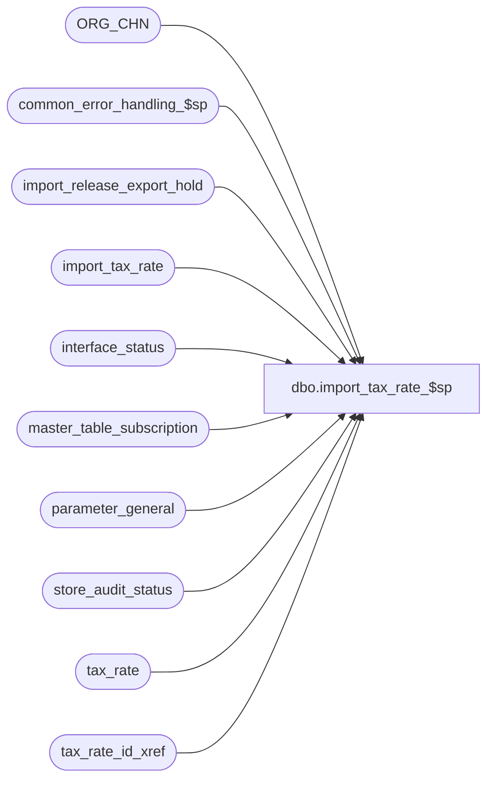

# dbo.import_tax_rate_$sp

**Database:** auditworks_external  
**Server:** bedrockdb01  

## Architecture Diagram



## Table Dependencies

| Referenced Table |
|---|
| ORG_CHN |
| common_error_handling_$sp |
| import_release_export_hold |
| import_tax_rate |
| interface_status |
| master_table_subscription |
| parameter_general |
| store_audit_status |
| tax_rate |
| tax_rate_id_xref |

## Stored Procedure Code

```sql
create proc dbo.import_tax_rate_$sp 
AS
/* Version:1.00 Date:1997/10/03 */
/* Author:Vicci de Takacsy */
/* Description: This program posts new tax-rate rows to the tax_rate table. If
                a row-key is already there then it set the to-date of the old row
                and adds the new row. 

HISTORY
Date     Name		Def#  Desc
Oct23,13 Vicci        147525  Add exemption_tax_rate_code to data imported.  Note that to avoid overlaying a manually (via TM) set 
                              exemption_tax_rate_code, a NULL exemption_tax_rate_code received in the import will be ignored.
                              To update the exemption_tax_rate_code to null for an existing row where it is non-null, the import file
                              must set the exemption tax rate code to be the same as the tax rate code.
Oct22,13 Vicci        147424  Use standard SQL2012 approach for error trapping (changing order of message appending to avoid loss of message portion following memos).
Mar18,13 Vicci        142035  Issue an export hold release request (that ICT will perform after the rest of the files present in the directory 
                              have been imported) instead of releasing the hold immediately.
Feb25,13 Vicci        142072  To avoid poor performance and deadlocks with exports insert tax_rate with correct effective_until_date
			      and tax_rate_id rather than correcting it after the fact, and don't update it needlessly.
			      Put export on hold while import is running if possible.
Aug14,12 Vicci        137565  Add warning to process error log if conflicting entries for same key have been imported and order by entry_id.
Sep07,11 Vicci        129626  Avoid multiple non-expired entries following attempt to delete non-existent entry when prior expired entry exists.
Aug31,11 Vicci        129426  Avoid overlapping effective-dates when the tax rate import is aborted.
Mar12,08 Vicci      1-38MDAZ  Add new tax-schedule and calc method fields.
Sep06,06 Tim           76719  Null Concatenation Fix.
May25,04 David       DV-1071  Use ORG_CHN table as new the Store table.
Mar18,03 Phu            5425  Remove @errmsg from parameter list to standardize import
Dec04,02 Maryam	     1-G4Q91  Change the data type of threshold amount to be numeric(10,4).
May16,02 Henry	     1-CD0IX  Add R3.5 standardized common error handling
Jun27,01 Maryam         8090  Modified based on release 3 import layout.
May22,01 Maryam         7977  Properly set the effective_until_date.

*/

DECLARE
  @errmsg			nvarchar(2000),
  @errmsg2		        nvarchar(2000),
  @errno			int,
  @sales_date			smalldatetime,
  @entry_type			nchar(1),
  @store_no			int,
  @tax_jurisdiction		nchar(5),
  @tax_level			tinyint,
  @tax_rate_code		tinyint,   
  @effective_from_date		smalldatetime,
  @tax_rate_code_description	nvarchar(30),
  @combined_rate		numeric(6,4),
  @federal_rate			numeric(6,4),
  @state_rate			numeric(6,4),
  @county_rate			numeric(6,4),
  @city_rate			numeric(6,4),
  @district_rate		numeric(6,4),
  @threshold_amount		numeric(10,4),
  @tax_on_threshold_excess	tinyint,
  @tax_on_tax_level		tinyint,
  @below_threshold_combined_rate numeric(6,4),
  @below_federal_rate		numeric(6,4),
  @below_state_rate		numeric(6,4),
  @below_county_rate		numeric(6,4),
  @below_city_rate		numeric(6,4),
  @below_district_rate		numeric(6,4),       
  @item_tax_strip_flag		tinyint,   
  @effective_until_date		smalldatetime,
  @max_effective_from_date	smalldatetime,
  @max_date			smalldatetime,
  @min_date			smalldatetime,
  @rows				int,
  @cursor_open			int,
-- used for common error handling.
  @process_no			smallint,
  @log_flag			tinyint,
  @object_name			nvarchar(255),
  @process_name			nvarchar(100),
  @operation_name		nvarchar(100),
  @message_id			int,
  @message_id2			int,
  @memo1			nvarchar(50),
  @memo2			nvarchar(50),
  @tax_schedule_id 		binary(16),
  @transaction_level_tax_calc   tinyint,
  @tax_rate_id			numeric(10,0),
  @hold_datetime		datetime,
  @hold_placed			tinyint,
  @exemption_tax_rate_code	tinyint;

SELECT @cursor_open = 0,
       @process_name = 'import_tax_rate_$sp',
       @message_id = 201068,
       @log_flag = 1,  -- called from smartload
       @process_no = 7, -- standard import
       @hold_datetime = getdate(),
       @errno = 0,
       @operation_name = 'SELECT';

BEGIN TRY

SELECT @errmsg = 'Failed to place exports to interfaces subscribing to tax_rate changes on hold while import runs. ',
       @object_name = 'interface_status',
       @operation_name = 'UPDATE';
UPDATE interface_status
   SET hold_datetime = @hold_datetime
  FROM master_table_subscription m WITH (NOLOCK)
 WHERE m.table_name IN ('tax_rate', 'tax_schedule_point_rule_xref')
   AND m.update_timing = 5
   AND m.interface_id =  interface_status.interface_id
   AND interface_status.hold_datetime IS NULL;
SELECT @hold_placed = sign(@@rowcount);

SELECT @errmsg = 'Failed to select from store_audit_status. ',
       @object_name = 'store_audit_status',
       @operation_name = 'SELECT'; 
SELECT @sales_date = MAX(sales_date)
  FROM store_audit_status 
 WHERE store_audit_status IN (400, 500)
   AND sales_date > (SELECT last_date_closed
                       FROM parameter_general);
                         
IF @sales_date IS NULL --
BEGIN
  SELECT @errmsg = 'Failed to select last_date_closed parameter_general. ',
         @object_name = 'parameter_general';
  SELECT @sales_date = last_date_closed
    FROM parameter_general;
END;

SELECT @sales_date = DATEADD(dd, 1, @sales_date);

SELECT @errmsg = 'Failed to set effective_from_date. ',
       @object_name = 'import_tax_rate',
       @operation_name = 'UPDATE';
UPDATE import_tax_rate
   SET effective_from_date = @sales_date
 WHERE effective_from_date IS NULL -- 
   AND UPPER(entry_type) IN ('I', 'U', 'R');

SELECT @errmsg = 'Failed to set tax-jurisdiction for import_tax_rate rows of type S. ',
       @object_name = 'import_tax_rate',
       @operation_name = 'UPDATE';
  UPDATE import_tax_rate
     SET tax_jurisdiction = s.TAX_JRSDCTN_CODE
    FROM import_tax_rate bcp, ORG_CHN s 
   WHERE bcp.store_no = s.ORG_CHN_NUM
     AND UPPER (bcp.entry_subtype) = 'S';

IF EXISTS(SELECT entry_type
            FROM import_tax_rate
           WHERE UPPER(entry_type) = 'R')
BEGIN
  SELECT @errmsg = 'Failed to truncate tax_rate table in preparation for replacement. ',
	 @object_name = 'tax_rate',
	 @operation_name = 'TRUNCATE';
  TRUNCATE TABLE tax_rate;
END;

SELECT @memo1 = NULL;
SELECT @errmsg = 'Failed to determine if any conflicting entries were imported. ',
       @object_name = 'import_tax_rate',
       @operation_name = 'SELECT';
SELECT @memo1 = MIN(q.entry_key)
  FROM (SELECT CASE WHEN tax_jurisdiction IS NULL THEN '' ELSE tax_jurisdiction + '/' END + convert(nvarchar, tax_level) + '/' + convert(nvarchar, tax_rate_code) + '/' + convert(nvarchar, effective_from_date) entry_key, 
               count(1) conflicting_entry_count
          FROM import_tax_rate
         WHERE UPPER (entry_subtype) <> 'S'
         GROUP BY tax_jurisdiction, tax_level, tax_rate_code, effective_from_date
        HAVING count(1) > 1) q; 

IF @memo1 IS NOT NULL
BEGIN
  SELECT @errmsg = ':LOG EXECWARN: WARNING!!  Multiple entries for the same key were imported. Please verify (for example) key ' + @memo1 + ' in the import_tax_rate table.';
  PRINT @errmsg;

  SELECT @errmsg = 'Multiple entries for the same key were imported. Please verify key ' + @memo1 + ' in the import_tax_rate table.',
	 @object_name = 'import_tax_rate',
	 @operation_name = 'SELECT',
	 @errno =  201736,
	 @message_id2 = 201736,
	 @memo2 = 'import_tax_rate'
  EXEC common_error_handling_$sp @process_no, @errno, @errmsg, 3, @message_id2, @process_name, @object_name, @operation_name, 
                                 @log_flag, 1, 0, NULL, 0, @memo1, @memo2
  SELECT @errno = 0, @memo1 = NULL, @memo2 = NULL
END

SELECT @errmsg = 'Failed to create tax_rate_id for new jur/level/rate combination. ',
       @object_name = 'tax_rate_id_xref',
       @operation_name = 'INSERT';
INSERT INTO tax_rate_id_xref (tax_jurisdiction, tax_level, tax_rate_code)
SELECT DISTINCT i.tax_jurisdiction, i.tax_level, i.tax_rate_code
  FROM import_tax_rate i
 WHERE NOT EXISTS (SELECT 1 FROM tax_rate_id_xref x
                    WHERE x.tax_jurisdiction = i.tax_jurisdiction
                      AND x.tax_level = i.tax_level
                      AND x.tax_rate_code = i.tax_rate_code);

SELECT @errmsg = 'Failed to define cursor tax_rate_crsr. ',
       @object_name = 'tax_rate_crsr',
       @operation_name = 'DECLARE';
DECLARE tax_rate_crsr CURSOR FAST_FORWARD
    FOR
 SELECT i.entry_type,
        i.store_no,
        i.tax_jurisdiction,
        i.tax_level,
        i.tax_rate_code,
        i.effective_from_date,
        i.tax_rate_code_description,
        i.combined_rate,
        i.federal_rate,
        i.state_rate,
        i.county_rate,
        i.city_rate,
        i.district_rate,
        i.threshold_amount,
        i.tax_on_threshold_excess,
        i.tax_on_tax_level,
        i.below_threshold_combined_rate,
        i.below_federal_rate,
        i.below_state_rate,
        i.below_county_rate,
        i.below_city_rate,
        i.below_district_rate,
        i.item_tax_strip_flag,
        i.tax_schedule_id,
  	i.transaction_level_tax_calc,
  	x.tax_rate_id,
  	i.exemption_tax_rate_code
   FROM import_tax_rate i
        LEFT OUTER JOIN tax_rate_id_xref x WITH (NOLOCK)
  	  ON i.tax_jurisdiction = x.tax_jurisdiction
  	 AND i.tax_level = x.tax_level
  	 AND i.tax_rate_code = x.tax_rate_code
  ORDER BY i.effective_from_date, i.entry_id;
	
  SELECT @operation_name = 'OPEN';
  OPEN tax_rate_crsr;
  SELECT @cursor_open = 1;

  WHILE 1=1
  BEGIN
    SELECT @errmsg = 'Failed to fetch cursor tax_rate_crsr. ',
           @object_name = 'tax_rate_crsr',
           @operation_name = 'FETCH';
    FETCH tax_rate_crsr INTO
  	  @entry_type,
  	  @store_no,
  	  @tax_jurisdiction,
  	  @tax_level,
  	  @tax_rate_code,
  	  @effective_from_date,
  	  @tax_rate_code_description,
  	  @combined_rate,
  	  @federal_rate,
  	  @state_rate,
  	  @county_rate,
  	  @city_rate,
  	  @district_rate,
  	  @threshold_amount,
  	  @tax_on_threshold_excess,
  	  @tax_on_tax_level,
  	  @below_threshold_combined_rate,
  	  @below_federal_rate,
  	  @below_state_rate,
  	  @below_county_rate,
  	  @below_city_rate,
  	  @below_district_rate,
  	  @item_tax_strip_flag,
  	  @tax_schedule_id,
  	  @transaction_level_tax_calc,
  	  @tax_rate_id,
  	  @exemption_tax_rate_code;

    IF @@fetch_status <> 0
      BREAK;

    IF UPPER(@entry_type) NOT IN ('I', 'R', 'D', 'U')
    BEGIN
      SELECT @errmsg = 'An invalid entry-type was encountered in the import file. Please verify the import_tax_rate table. ',
	     @object_name = 'tax_rate_crsr',
	     @operation_name = 'FETCH',
	     @errno =  201735,
	     @message_id2 = 201735,
	     @memo1 = 'import_tax_rate'
      EXEC common_error_handling_$sp @process_no, @errno, @errmsg, 3, @message_id2, @process_name, @object_name, @operation_name, @log_flag, NULL, NULL,NULL, NULL, @memo1;

      SELECT @errno = 0, @memo1 = NULL;
    END;
    
    IF UPPER(@entry_type) = 'D'
    BEGIN
      SELECT @errmsg = 'Failed to select effective_from_date of the row before that being deleted. ',
	     @object_name = 'tax_rate',
	     @operation_name = 'SELECT';
      SELECT @max_effective_from_date = MAX(effective_from_date)
        FROM tax_rate
       WHERE tax_jurisdiction = @tax_jurisdiction 
         AND tax_level = @tax_level
         AND tax_rate_code = @tax_rate_code
         AND effective_from_date < @effective_from_date;

      SELECT @errmsg = 'Failed to select effective_until_date of the row being deleted. ',
	     @object_name = 'tax_rate',
	     @operation_name = 'SELECT';
      SELECT @effective_until_date = effective_until_date
        FROM tax_rate
       WHERE tax_jurisdiction = @tax_jurisdiction 
         AND tax_level = @tax_level
         AND tax_rate_code = @tax_rate_code
         AND effective_from_date = @effective_from_date;
      SELECT @rows = @@rowcount;

      IF @rows > 0 --row to be deleted exists
      BEGIN
	BEGIN TRANSACTION;
      
        SELECT @errmsg = 'Failed to DELETE from tax_rate table. ',
               @object_name = 'tax_rate',
               @operation_name = 'DELETE';
        DELETE tax_rate
         WHERE tax_jurisdiction = @tax_jurisdiction 
           AND tax_level = @tax_level
           AND tax_rate_code = @tax_rate_code
           AND effective_from_date = @effective_from_date;

        IF @max_effective_from_date IS NOT NULL --
        BEGIN
          SELECT @errmsg = @errmsg + 'Failed to set effective_until_date of the row before that being deleted. ',
		 @object_name = 'tax_rate',
		 @operation_name = 'UPDATE';
          UPDATE tax_rate
             SET effective_until_date = @effective_until_date
           WHERE tax_jurisdiction = @tax_jurisdiction
             AND tax_level = @tax_level 
             AND tax_rate_code = @tax_rate_code
             AND effective_from_date = @max_effective_from_date;
        END; --IF @min_effective_from_date != @effective_from_date
      
        COMMIT TRANSACTION;
    END; --IF @rows > 0 --row to be deleted exists        
  END; --IF @entry_type = 'D'

  IF UPPER(@entry_type) IN ('I', 'U', 'R')
  BEGIN
    SELECT @errmsg = @errmsg + 'Failed to UPDATE tax_rate from import_tax_rate. ',
	   @object_name = 'tax_rate',
	   @operation_name = 'UPDATE'; 
    UPDATE tax_rate
       SET combined_rate = @combined_rate,
           federal_rate = @federal_rate,
           state_rate = @state_rate,
           county_rate = @county_rate,
           city_rate = @city_rate,
           district_rate = @district_rate,
           threshold_amount = @threshold_amount,
           tax_on_threshold_excess = @tax_on_threshold_excess,
           tax_on_tax_level = @tax_on_tax_level,
           below_threshold_combined_rate = @below_threshold_combined_rate,
           below_federal_rate = @below_federal_rate,
           below_state_rate = @below_state_rate,
           below_county_rate = @below_county_rate,
           below_city_rate = @below_city_rate,
           below_district_rate = @below_district_rate,
           item_tax_strip_flag = @item_tax_strip_flag,
           tax_schedule_id = @tax_schedule_id,
           transaction_level_tax_calc = @transaction_level_tax_calc,
           exemption_tax_rate_code = CASE WHEN @exemption_tax_rate_code IS NOT NULL 
  	                                      THEN CASE WHEN @exemption_tax_rate_code = @tax_rate_code
  	                                                THEN NULL
  	                                                ELSE @exemption_tax_rate_code
  	                                           END
  	                                      ELSE exemption_tax_rate_code END  --to avoid overlaying manually set exemption_tax_rate_code upon import. 
     WHERE tax_jurisdiction = @tax_jurisdiction
       AND tax_level = @tax_level 
       AND tax_rate_code = @tax_rate_code
       AND effective_from_date = @effective_from_date;
    SELECT @rows = @@rowcount;
    
    IF @rows = 0 
    BEGIN
      SELECT @errmsg = 'Failed to select effective_from_date of the row before that being inserted. ',
	     @object_name = 'tax_rate',
	     @operation_name = 'SELECT';
      SELECT @max_date = MAX(effective_from_date)
        FROM tax_rate
       WHERE tax_jurisdiction = @tax_jurisdiction
         AND tax_rate_code = @tax_rate_code
         AND tax_level = @tax_level
         AND effective_from_date < @effective_from_date;

      SELECT @errmsg = 'Failed to select effective_from_date of the row after that being inserted. ',
	     @object_name = 'tax_rate',
	     @operation_name = 'SELECT';
      SELECT @min_date = MIN(effective_from_date)
        FROM tax_rate
       WHERE tax_jurisdiction = @tax_jurisdiction
         AND tax_rate_code = @tax_rate_code
         AND tax_level = @tax_level
         AND effective_from_date > @effective_from_date;

      BEGIN TRANSACTION;
      
      SELECT @errmsg = 'Failed to INSERT imported exceptions for store_no = ' + CONVERT(nvarchar, COALESCE(@store_no, '')) 
                       + ', tax_jurisdiction = ' + COALESCE(@tax_jurisdiction, '') 
                       + ', tax_level = ' + CONVERT(nvarchar, @tax_level) 
                       + ', tax_tax_rate_code = ' + CONVERT(nvarchar,@tax_rate_code) 
                       + ', effective_from_date = ' + CONVERT(nvarchar(11), @effective_from_date)
                       + ' into the tax_rate table. ',
             @object_name = 'tax_rate',
             @operation_name = 'INSERT';
      INSERT tax_rate (
             tax_jurisdiction,
             tax_level,
             tax_rate_code, 
             effective_from_date, 
             tax_rate_code_description,
             combined_rate,
             federal_rate, 
             state_rate,
             county_rate,
             city_rate,
             district_rate, 
             threshold_amount,
             tax_on_threshold_excess,
             tax_on_tax_level,
             below_threshold_combined_rate,
             below_federal_rate,
             below_state_rate,
             below_county_rate,
             below_city_rate,
             below_district_rate,
             item_tax_strip_flag,
             tax_schedule_id,
             transaction_level_tax_calc,
             effective_until_date,
             tax_rate_id,
             exemption_tax_rate_code )
      VALUES(@tax_jurisdiction,
             @tax_level,
             @tax_rate_code,
             @effective_from_date,
             @tax_rate_code_description,
             @combined_rate,
             @federal_rate,
             @state_rate,
             @county_rate,
             @city_rate,
             @district_rate,
             @threshold_amount,
             @tax_on_threshold_excess,
             @tax_on_tax_level,
             @below_threshold_combined_rate,
             @below_federal_rate,
             @below_state_rate,
             @below_county_rate,
             @below_city_rate,
             @below_district_rate,
             @item_tax_strip_flag,
             @tax_schedule_id, 
             @transaction_level_tax_calc,
             DATEADD(dd, -1, @min_date),
             @tax_rate_id,
             CASE WHEN @exemption_tax_rate_code = @tax_rate_code THEN NULL ELSE @exemption_tax_rate_code END);
            
      IF @max_date IS NOT NULL
      BEGIN
        SELECT @errmsg = 'Failed to UPDATE effective_until_date of the row before that being inserted. ',
	       @object_name = 'tax_rate',
	       @operation_name = 'UPDATE';
        UPDATE tax_rate
           SET effective_until_date = DATEADD(dd, -1, @effective_from_date)
         WHERE tax_jurisdiction = @tax_jurisdiction 
           AND tax_rate_code = @tax_rate_code
           AND tax_level = @tax_level
           AND effective_from_date = @max_date;
      END; --IF @max_date IS NOT NULL
          
      COMMIT TRANSACTION;

    END; -- IF @rows = 0 
  END; --IF @entry_type IN ('I', 'U', 'R')
END; /* WHILE 1=1 */

SELECT @errmsg = 'Failed to close and deallocate cursor tax_rate_crsr. ',
       @object_name = 'tax_rate_crsr',
       @operation_name = 'CLOSE';
CLOSE tax_rate_crsr;
SELECT @operation_name = 'DEALLOCATE';
DEALLOCATE tax_rate_crsr;
SELECT @cursor_open = 0;

IF @hold_placed = 1
BEGIN
  SELECT @errmsg = 'Failed to create entries that ICT_IMPORT will export as interface hold release requests and process once done importing other files. ',
         @object_name = 'import_release_export_hold',
         @operation_name = 'INSERT'; 
  INSERT INTO import_release_export_hold(
         interface_id,
         hold_datetime)
  SELECT DISTINCT interface_id, hold_datetime
    FROM interface_status i WITH (NOLOCK)
   WHERE i.hold_datetime = @hold_datetime;

  --Note: when this line is printed, the import ICT will drop a release_export_hold.GO file into the directory with priority 9999 to cause release to be placed last on TO-Do list.  
  PRINT ':LOG ReleaseExportHold';
END;  --IF @hold_placed = 1
    
RETURN;

general_error:
  SELECT @errno = ERROR_NUMBER(),
         @errmsg2 = @process_name + ':  ' + COALESCE(@errmsg, '') + ' Line: ' + CONVERT(nvarchar, ERROR_LINE()) + ', ' + ERROR_MESSAGE() ;

  EXEC common_error_handling_$sp @process_no, @errno, @errmsg2, 0, @message_id, @process_name, @object_name, @operation_name, @log_flag, NULL, NULL,NULL, NULL, @memo1;;
  RETURN;

END TRY

BEGIN CATCH
  SELECT @errno = ERROR_NUMBER();
  IF @errmsg2 IS NULL  --i.e. not already set by general_error
  BEGIN
    SELECT @errmsg2 = @process_name + ':  ' + COALESCE(@errmsg, '') + ' Line: ' + CONVERT(nvarchar, ERROR_LINE()) + ', ' + ERROR_MESSAGE();
  END;
  SELECT @errmsg = @errmsg2;  
  
  IF @hold_placed = 1
  BEGIN
    INSERT INTO import_release_export_hold(
	   interface_id,
	   hold_datetime)
    SELECT DISTINCT interface_id, hold_datetime
      FROM interface_status i WITH (NOLOCK)
     WHERE i.hold_datetime = @hold_datetime;
    --Note: when this line is printed, the import ICT will drop a release_export_hold.GO file into the directory with priority 9999 to cause release to be placed last on TO-Do list.  
    PRINT ':LOG ReleaseExportHold';
  END;  --IF @hold_placed = 1
  
  IF @cursor_open = 1
  BEGIN
    CLOSE tax_rate_crsr;
    DEALLOCATE tax_rate_crsr;
    SELECT @cursor_open = 0;
  END;

  EXEC common_error_handling_$sp @process_no, @errno, @errmsg2, 0, @message_id, @process_name, @object_name, @operation_name, @log_flag, NULL, NULL,NULL, NULL, @memo1;;
  
  RETURN;
END CATCH;
```

