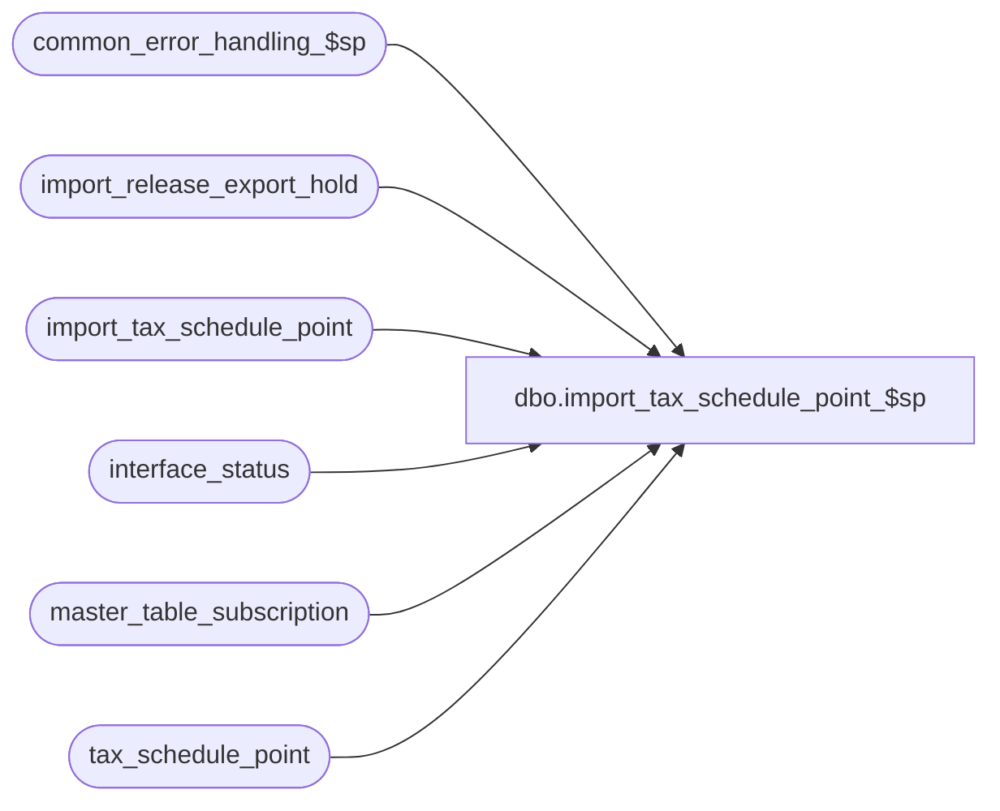

# dbo.import_tax_schedule_point_$sp

**Database:** auditworks_external  
**Server:** bedrockdb01  

## Architecture Diagram



## Table Dependencies

| Referenced Table |
|---|
| common_error_handling_$sp |
| import_release_export_hold |
| import_tax_schedule_point |
| interface_status |
| master_table_subscription |
| tax_schedule_point |

## Stored Procedure Code

```sql
create proc dbo.import_tax_schedule_point_$sp  
AS

/* 
PROC NAME: import_tax_schedule_point_$sp
     DESC: This program posts imported tax schedule point data to the tax_schedule_point table.
           Data integrity is assumed to be the responsibility of the provider. 


HISTORY:
Date     Name       Def# Desc
Sep29,14 Vicci     86335 Remove reliance on SET ANSI_NULLS being ON.
Mar18,13 Vicci    142035 Put export on hold until import completes. 
Mar12,08 Vicci  1-38MDAZ Author

*/

DECLARE
	@errmsg				nvarchar(2000),
	@errno				int,
	@process_no			smallint,
	@log_flag			tinyint,
	@object_name			nvarchar(255),
	@process_name			nvarchar(100),
	@operation_name			nvarchar(100),
	@message_id			int,
	@hold_datetime			datetime,
	@hold_placed			tinyint

SET CONCAT_NULL_YIELDS_NULL OFF	

SELECT @process_name = 'import_tax_schedule_point_$sp',
       @message_id = 201068,
       @log_flag = 1,  -- called from smartload
       @process_no = 7, -- standard import
       @hold_datetime = getdate()

BEGIN TRY
UPDATE interface_status
   SET hold_datetime = @hold_datetime
  FROM master_table_subscription m WITH (NOLOCK)
 WHERE m.table_name  = 'tax_schedule_point'
   AND m.update_timing = 5
   AND m.interface_id =  interface_status.interface_id
   AND interface_status.hold_datetime IS NULL
SELECT @hold_placed = sign(@@rowcount)          
END TRY
BEGIN CATCH
  SELECT @errno = ERROR_NUMBER(), @errmsg = ERROR_MESSAGE()
IF @errno != 0
BEGIN
  SELECT @errmsg = @errmsg + ' -Failed to place exports to interfaces subscribing to tax_schedule_point changes on hold while import runs',
         @object_name = 'interface_status',
         @operation_name = 'UPDATE'
  GOTO error
END      
END CATCH

BEGIN TRY
DELETE tax_schedule_point
  FROM import_tax_schedule_point i
 WHERE tax_schedule_point.tax_schedule_id = i.tax_schedule_id
   AND tax_schedule_point.from_threshold_amount = i.from_threshold_amount
   AND i.entry_type = 'D'
END TRY
BEGIN CATCH
  SELECT @errno = ERROR_NUMBER(), @errmsg = ERROR_MESSAGE()
IF @errno != 0
BEGIN
  SELECT @errmsg = @errmsg + ' -Failed to remove tax schedule points to be deleted',
	 @object_name = 'tax_schedule_point',
	 @operation_name = 'DELETE'
  GOTO error
END
END CATCH

--Keep only the last instructions concerning a given schedule point
BEGIN TRY
DELETE import_tax_schedule_point
  FROM (SELECT tax_schedule_id, from_threshold_amount, max(entry_id) max_entry_id
          FROM import_tax_schedule_point
         GROUP BY tax_schedule_id, from_threshold_amount
        HAVING count(entry_id) > 1) q
 WHERE import_tax_schedule_point.tax_schedule_id = q.tax_schedule_id
   AND import_tax_schedule_point.from_threshold_amount = q.from_threshold_amount
   AND import_tax_schedule_point.entry_id < q.max_entry_id
END TRY
BEGIN CATCH
  SELECT @errno = ERROR_NUMBER(), @errmsg = ERROR_MESSAGE()
IF @errno != 0
BEGIN
  SELECT @errmsg = @errmsg + ' -Failed to remove superceded entries from import table',
	 @object_name = 'import_tax_schedule_point',
	 @operation_name = 'DELETE'
  GOTO error
END
END CATCH

BEGIN TRY
UPDATE tax_schedule_point
   SET to_threshold_amount = i.to_threshold_amount,
       tax_amount = i.tax_amount,
       tax_rate = i.tax_rate
  FROM import_tax_schedule_point i
 WHERE tax_schedule_point.tax_schedule_id = i.tax_schedule_id
   AND tax_schedule_point.from_threshold_amount = i.from_threshold_amount
   AND i.entry_type <> 'D'
END TRY
BEGIN CATCH
  SELECT @errno = ERROR_NUMBER(), @errmsg = ERROR_MESSAGE()
IF @errno != 0
BEGIN
  SELECT @errmsg = @errmsg + ' -Failed to update tax schedule points',
	 @object_name = 'tax_schedule_point',
	 @operation_name = 'UDPATE'
  GOTO error
END
END CATCH

BEGIN TRY
INSERT into tax_schedule_point(
       tax_schedule_id,
       from_threshold_amount,
       to_threshold_amount,
       tax_amount,
       tax_rate,
       point_no)
SELECT tax_schedule_id,
       from_threshold_amount,
       to_threshold_amount,
       tax_amount,
  tax_rate,
       (entry_id - convert(int, entry_id / 10000) * 10000) * -1  --dummy value to avoid dup key on insert until trigger sets point_no properly
  FROM import_tax_schedule_point i
 WHERE i.entry_type <> 'D'
   AND 1 NOT IN (SELECT 1
                   FROM tax_schedule_point s
                  WHERE i.tax_schedule_id = s.tax_schedule_id
                    AND i.from_threshold_amount = s.from_threshold_amount)
END TRY
BEGIN CATCH
  SELECT @errno = ERROR_NUMBER(), @errmsg = ERROR_MESSAGE()
IF @errno != 0
BEGIN
  SELECT @errmsg = @errmsg + ' -Failed to create new tax schedule points',
	 @object_name = 'tax_schedule_point',
	 @operation_name = 'INSERT'
  GOTO error
END
END CATCH

IF @hold_placed = 1
BEGIN
  INSERT INTO import_release_export_hold(
         interface_id,
         hold_datetime)
  SELECT DISTINCT interface_id, hold_datetime
    FROM interface_status i WITH (NOLOCK)
   WHERE i.hold_datetime = @hold_datetime
  SELECT @errno = @@error
  IF @errno != 0
  BEGIN
    SELECT @errmsg = 'Failed to create entries that ICT_IMPORT will export as interface hold release requests and process once done importing other files.',
           @object_name = 'import_release_export_hold',
           @operation_name = 'INSERT'
    GOTO error
  END

  --Note: when this line is printed, the import ICT will drop a release_export_hold.GO file into the directory with priority 9999 to cause release to be placed last on TO-Do list.  
  PRINT ':LOG ReleaseExportHold'  
END  --IF @hold_placed = 1

RETURN

error:   /* Common error handler. */

	IF @hold_placed = 1
	BEGIN
	  INSERT INTO import_release_export_hold(
	         interface_id,
	         hold_datetime)
	  SELECT DISTINCT interface_id, hold_datetime
	    FROM interface_status i WITH (NOLOCK)
	   WHERE i.hold_datetime = @hold_datetime

	  --Note: when this line is printed, the import ICT will drop a release_export_hold.GO file into the directory with priority 9999 to cause release to be placed last on TO-Do list.  
	  PRINT ':LOG ReleaseExportHold'  
	END  --IF @hold_placed = 1


	EXEC common_error_handling_$sp @process_no, @errno, @errmsg, 0, @message_id, 
	@process_name, @object_name, @operation_name, @log_flag

	RETURN
```

