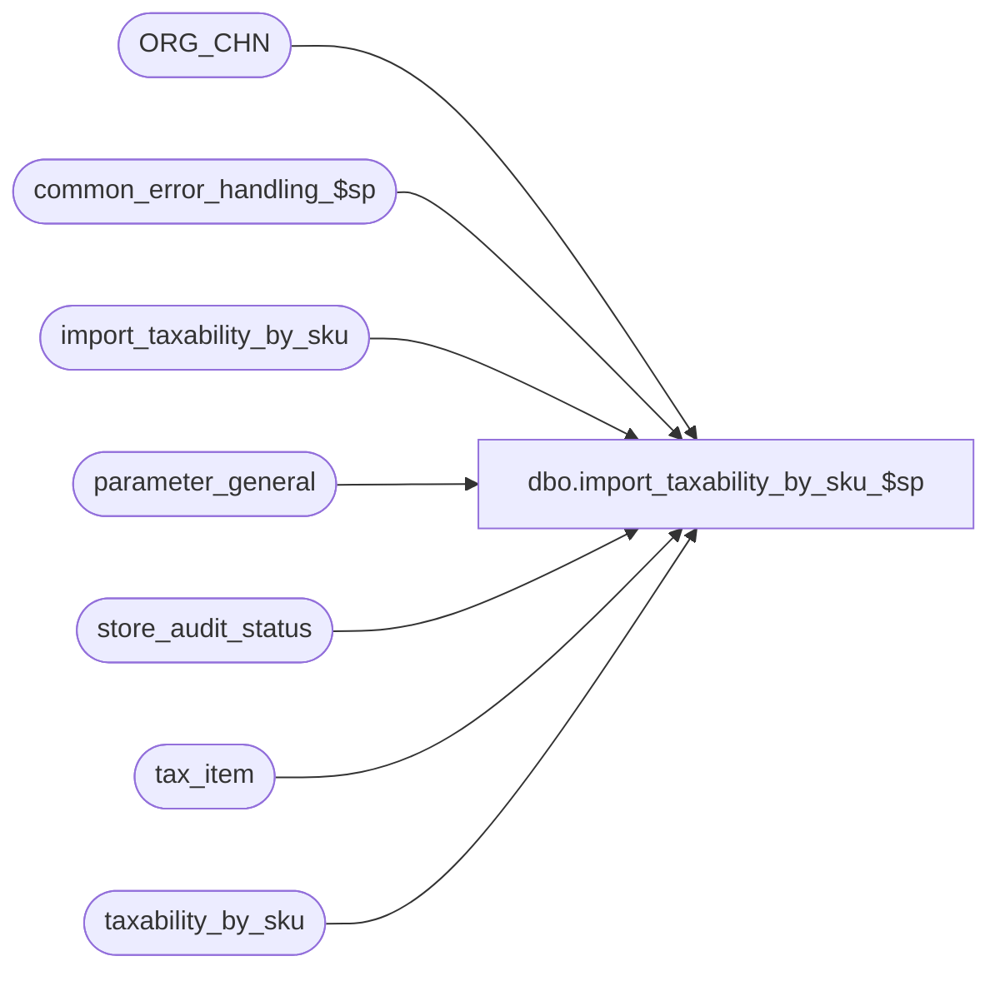

# dbo.import_taxability_by_sku_$sp

**Database:** auditworks_external  
**Server:** bedrockdb01  

## Architecture Diagram



## Table Dependencies

| Referenced Table |
|---|
| ORG_CHN |
| common_error_handling_$sp |
| import_taxability_by_sku |
| parameter_general |
| store_audit_status |
| tax_item |
| taxability_by_sku |

## Stored Procedure Code

```sql
create proc [dbo].[import_taxability_by_sku_$sp] 

AS

/* Description: This program posts updates to taxability exceptions by sku
		received from a client OR 3rd party to the AW taxability_by_sku
		table based on the I'nsert U'pdate D'elete R'eplacement-file entry_type. 
History:
Date	 Name		Def#	Action
Sep07,11 Vicci        129626    Avoid multiple non-expired entries following attempt to delete non-existent entry when prior expired entry exists.
                                Avoid overlapping effective-dates when the taxability by sku import is aborted.
Sep06,06  Tim           76719 Null Concatenation Fix.
May25,04 David          DV-1071 Use ORG_CHN table as new the Store table.
Mar18,03 Phu              5425  Remove @errmsg from parameter list to standardize import
May16,02 Henry		1-CD0IX Add R3.5 standardized common error handling
Jun27/01 Maryam           8090 	Modified based on release 3 import layout.
Feb26/01 Phu              7371 	Change double quotes to single quotes for MS SQL compatibility
Sep19/00 Phu		  6726 	item_no is now an user-defined datatype whose maximum size is up to numeric(16,0)
Aug11/99 Paul		  4522 	avoid = null
Apr13/99 Mat Carson	  4452 	Got rid of the count(*) in the IF EXISTS at the end so not always true
Apr14/98 Vicci de Takacsy n/a  	Creation
*/

DECLARE
  @item_datatype 	nvarchar(255),
  @errmsg		nvarchar(255),
  @errno		int,
  @sales_date		smalldatetime,
  @entry_type		char,
  @store_no		int,
  @tax_jurisdiction	nchar(5),
  @tax_level		tinyint,
  @sku_id		numeric(14,0),
  @tax_rate_code	tinyint,   
  @effective_from_date	smalldatetime,
  @effective_until_date	smalldatetime,
  @max_effective_from_date  smalldatetime,
  @max_date		smalldatetime,
  @min_date		smalldatetime,
  @upc_lookup_division	tinyint,
  @rows			int,
  @cursor_open		int,
-- used for common error handling.
  @process_no		smallint,
  @log_flag		tinyint,
  @object_name		nvarchar(255),
  @process_name		nvarchar(100),
  @operation_name	nvarchar(100),
  @message_id		int,
  @message_id2		int,
  @memo1 		nvarchar(50)
  
SET CONCAT_NULL_YIELDS_NULL OFF

SELECT @process_name = 'import_taxability_by_sku_$sp',
       @message_id = 201068,
       @log_flag = 1,  -- called from smartload
       @process_no = 7, -- standard import
       @cursor_open = 0,
       @effective_from_date = NULL
  
 
SELECT @sales_date = MAX(sales_date)
    FROM store_audit_status 
   WHERE store_audit_status IN (400, 500)
     AND sales_date > (SELECT last_date_closed
                       FROM parameter_general)
  SELECT @errno = @@error
  IF @errno !=0 
    BEGIN
      SELECT @errmsg='Failed to select from store_audit_status',
	     @object_name = 'store_audit_status',
	     @operation_name = 'SELECT'
      GOTO error
    END
                  
  IF @sales_date IS NULL --
  BEGIN
      SELECT @sales_date = last_date_closed
        FROM parameter_general
      
      SELECT @errno = @@error
      IF @errno !=0 
        BEGIN
          SELECT @errmsg='Failed to select last_date_closed',
	         @object_name = 'parameter_general',
	         @operation_name = 'SELECT'
          GOTO error
        END
    END

  SELECT @sales_date = DATEADD(dd, 1, @sales_date) 

  UPDATE import_taxability_by_sku
     SET effective_from_date = @sales_date
   WHERE effective_from_date IS NULL --
   AND UPPER(entry_type) IN ('I', 'U', 'R')

  SELECT @errno = @@error
  IF @errno != 0
    BEGIN
      SELECT @errmsg = 'Failed to set effective_from_date.',
	     @object_name = 'import_taxability_by_sku',
	     @operation_name = 'UPDATE'
      GOTO error
    END

  IF EXISTS (SELECT item_id 
               FROM tax_item
	      WHERE item_id IS NULL)
    SELECT @item_datatype = 'numeric'
  ELSE
    SELECT @item_datatype = 'varchar'

  SELECT @errno = @@error
  IF @errno != 0
    BEGIN
      SELECT @errmsg = 'Failed to determine datatype of item_id used',
	     @object_name = 'tax_item',
	     @operation_name = 'SELECT'
      GOTO error
    END

  IF @item_datatype = 'varchar'
    BEGIN
      UPDATE import_taxability_by_sku
         SET sku_id = t.sku_id
        FROM import_taxability_by_sku bcp, tax_item t
       WHERE bcp.item_id = t.item_id 

      SELECT @errno = @@error
      IF @errno != 0
        BEGIN
        SELECT @errmsg = 'Failed to set sku_id in import_taxability_by_sku (1)',
		 @object_name = 'import_taxability_by_sku',
		 @operation_name = 'UPDATE'
          GOTO error
        END
    END
  ELSE
    BEGIN
      UPDATE import_taxability_by_sku
         SET item_no = CONVERT(NUMERIC(16,0), item_id)

      SELECT @errno = @@error
      IF @errno != 0
        BEGIN
          SELECT @errmsg = 'Failed to set item_no in import_taxability_by_sku',
		 @object_name = 'import_taxability_by_sku',
		 @operation_name = 'UPDATE'
          GOTO error
        END

      UPDATE import_taxability_by_sku
         SET sku_id = t.sku_id
        FROM import_taxability_by_sku bcp, tax_item t
       WHERE bcp.item_no = t.item_no 

      SELECT @errno = @@error
      IF @errno != 0
        BEGIN
          SELECT @errmsg = 'Failed to set sku_id in import_taxability_by_sku (2)',
		 @object_name = 'import_taxability_by_sku',
		 @operation_name = 'UPDATE'
          GOTO error
        END
    END

  UPDATE import_taxability_by_sku
     SET tax_jurisdiction = s.TAX_JRSDCTN_CODE
    FROM import_taxability_by_sku bcp, ORG_CHN s 
   WHERE bcp.store_no = s.ORG_CHN_NUM
     AND UPPER(bcp.entry_subtype) = 'S'

  SELECT @errno = @@error
  IF @errno != 0
    BEGIN
      SELECT @errmsg = 'Failed to set tax-jurisdiction fOR import_taxability_by_sku rows of subtype S',
	     @object_name = 'import_taxability_by_sku',
	     @operation_name = 'UPDATE'
      GOTO error
    END

  IF EXISTS(SELECT entry_type
              FROM import_taxability_by_sku
             WHERE UPPER(entry_type) = 'R')
    TRUNCATE TABLE taxability_by_sku

  SELECT @errno = @@error
  IF @errno != 0
    BEGIN
      SELECT @errmsg = 'Failed to truncate taxability_by_sku table in preparation fOR replacement',
	     @object_name = 'taxability_by_sku',
	     @operation_name = 'TRUNCATE'
      GOTO error
    END

  DECLARE tax_sku_crsr CURSOR
  FOR
  SELECT entry_type,
         store_no,
         tax_jurisdiction,
         sku_id,
         tax_level,
         tax_rate_code,
         effective_from_date,
         upc_lookup_division
    FROM import_taxability_by_sku
ORDER BY effective_from_date   
	
  OPEN tax_sku_crsr

  SELECT @errno = @@error
  IF @errno != 0
    BEGIN
      SELECT @errmsg = 'Failed to open cursor tax_sku_crsr.',
	     @object_name = 'tax_sku_crsr',
	     @operation_name = 'OPEN'
      GOTO error
    END

  SELECT @cursor_open = 1

  WHILE 1=1
  BEGIN

  FETCH tax_sku_crsr INTO
	@entry_type,
	@store_no,
        @tax_jurisdiction,
        @sku_id,
        @tax_level,
        @tax_rate_code,
        @effective_from_date,
        @upc_lookup_division

  IF @@fetch_status <> 0
    BREAK

  IF UPPER(@entry_type) NOT IN ('I', 'R', 'D', 'U')
    BEGIN
      SELECT @errmsg = 'Invalid entry_type in tax_sku data file. Please verify the |1 table.',
	     @errno = 201065,
	     @message_id2 = 201065,
	     @object_name = 'tax_sku_crsr',
	     @memo1 = 'tax_sku_crsr',
	     @operation_name = 'SELECT'

      EXEC common_error_handling_$sp @process_no, @errno, @errmsg, 0, @message_id2, 
		@process_name, @object_name, @operation_name, @log_flag, NULL, NULL,NULL, NULL, @memo1

      SELECT @errno = 0
    END
    
  IF UPPER(@entry_type) = 'D'
    BEGIN
      SELECT @max_effective_from_date = MAX(effective_from_date)
        FROM taxability_by_sku
       WHERE tax_jurisdiction = @tax_jurisdiction 
         AND sku_id = @sku_id
         AND tax_level = @tax_level
         AND upc_lookup_division = @upc_lookup_division
        AND effective_from_date < @effective_from_date
      SELECT @errno = @@error
      IF @errno != 0
        BEGIN
          SELECT @errmsg = 'Failed to select effective_from_date of the row before that being deleted.',
		 @object_name = 'taxability_by_sku',
		 @operation_name = 'SELECT'
          GOTO error
        END

      SELECT @effective_until_date = effective_until_date
        FROM taxability_by_sku
       WHERE tax_jurisdiction = @tax_jurisdiction 
         AND sku_id = @sku_id
         AND tax_level = @tax_level
         AND upc_lookup_division = @upc_lookup_division
         AND (effective_from_date = @effective_from_date OR @effective_from_date IS NULL)  --note:  import table allows null effective_from_date meaning all effective dates      
      SELECT @errno = @@error, @rows = @@rowcount 
      IF @errno != 0
        BEGIN
          SELECT @errmsg = 'Failed to select effective_until_date of the row being deleted.',
		 @object_name = 'taxability_by_sku',
		 @operation_name = 'SELECT'
          GOTO error
        END

      IF @rows > 0  --i.e. row to be deleted exists
      BEGIN
        BEGIN TRANSACTION
        
        DELETE taxability_by_sku
         WHERE tax_jurisdiction = @tax_jurisdiction 
           AND sku_id = @sku_id
           AND tax_level = @tax_level
           AND (effective_from_date = @effective_from_date OR @effective_from_date IS NULL)
           AND upc_lookup_division = @upc_lookup_division
        SELECT @errno = @@error
        IF @errno != 0
        BEGIN
          SELECT @errmsg = 'Failed to DELETE from taxability_by_sku',
		 @object_name = 'taxability_by_sku',
		 @operation_name = 'DELETE'
          GOTO error
        END

        IF @max_effective_from_date IS NOT NULL AND @rows = 1  --  Note:  if @rows > 1 all effective dates have already been deleted
        BEGIN
          UPDATE taxability_by_sku
             SET effective_until_date = @effective_until_date
           WHERE tax_jurisdiction = @tax_jurisdiction 
             AND sku_id = @sku_id
             AND tax_level = @tax_level
             AND effective_from_date = @max_effective_from_date
             AND upc_lookup_division = @upc_lookup_division
          SELECT @errno = @@error
          IF @errno != 0
            BEGIN
              SELECT @errmsg = 'Failed to set effective_until_date of the row before that being deleted.',
		     @object_name = 'taxability_by_sku',
		     @operation_name = 'UPDATE'
              GOTO error
            END
      END --IF @max_effective_from_date IS NOT NULL  
      
      COMMIT TRANSACTION 
    END --IF @rows > 0  --i.e. row to be deleted exists
  END --IF @entry_type = 'D'

  IF UPPER(@entry_type) IN ('I', 'U', 'R')
    BEGIN
      UPDATE taxability_by_sku
         SET tax_rate_code = @tax_rate_code
       WHERE tax_jurisdiction = @tax_jurisdiction 
         AND sku_id = @sku_id
         AND tax_level = @tax_level
         AND effective_from_date = @effective_from_date
         AND upc_lookup_division = @upc_lookup_division       
      SELECT @rows = @@rowcount,
             @errno = @@error
      IF @errno != 0
        BEGIN
          SELECT @errmsg = 'Failed to UPDATE taxability_by_sku from import_taxability_by_sku',
		 @object_name = 'taxability_by_sku',
		 @operation_name = 'UPDATE'
          GOTO error
        END

      IF @rows = 0 
      BEGIN 
        SELECT @max_date = MAX(effective_from_date)
          FROM taxability_by_sku
         WHERE tax_jurisdiction = @tax_jurisdiction
           AND sku_id = @sku_id
           AND tax_level = @tax_level
           AND upc_lookup_division = @upc_lookup_division
           AND effective_from_date < @effective_from_date
        SELECT @errno = @@error
        IF @errno != 0
        BEGIN
              SELECT @errmsg = 'Failed to select effective_from_date of the row before that being inserted.',
		     @object_name = 'taxability_by_sku',
		     @operation_name = 'SELECT'
              GOTO error
        END
        
        SELECT @min_date = MIN(effective_from_date)
          FROM taxability_by_sku
         WHERE tax_jurisdiction = @tax_jurisdiction
           AND sku_id = @sku_id
           AND tax_level = @tax_level
           AND upc_lookup_division = @upc_lookup_division
           AND effective_from_date > @effective_from_date
        SELECT @errno = @@error
        IF @errno != 0
        BEGIN
              SELECT @errmsg = 'Failed to select effective_from_date of the row after that being inserted.',
		     @object_name = 'taxability_by_sku',
		     @operation_name = 'SELECT'
              GOTO error
        END

        BEGIN TRANSACTION
          INSERT taxability_by_sku (
                 tax_jurisdiction,
                 sku_id,
                 upc_lookup_division,
                 tax_level,
                 tax_rate_code,
                 effective_from_date)
          VALUES (@tax_jurisdiction,
                 @sku_id,
                 @upc_lookup_division,
                 @tax_level,
                 @tax_rate_code,
                 @effective_from_date)          
          SELECT @errno = @@error
          IF @errno != 0
            BEGIN
              SELECT @errmsg = 'Failed to INSERT newly imported exceptions for store_no = ' +
				convert(nvarchar, @store_no) +', tax_jurisdiciton = ' + @tax_jurisdiction +
				', sku_id = ' + convert(nvarchar, @sku_id) + ', tax_level = ' + convert(nvarchar, @tax_level)+
				', tax_rate_code = ' + convert(nvarchar,@tax_rate_code) + ', upc_lookup_division = ' + convert(nvarchar,@upc_lookup_division) + ', effective_from_date = '
				+ CONVERT(nvarchar(11), @effective_from_date)+' into the taxability_by_sku table ',
		     @object_name = 'taxability_by_sku',
		     @operation_name = 'INSERT'
              GOTO error
            END

          UPDATE taxability_by_sku
             SET effective_until_date = DATEADD(dd, -1, @effective_from_date)
           WHERE tax_jurisdiction = @tax_jurisdiction 
             AND sku_id = @sku_id
             AND tax_level = @tax_level
             AND effective_from_date = @max_date
             AND upc_lookup_division = @upc_lookup_division       
          SELECT @errno = @@error
          IF @errno != 0
            BEGIN
              SELECT @errmsg = 'Failed to UPDATE effective_until_date of the row before that being inserted',
		     @object_name = 'taxability_by_sku',
		     @operation_name = 'UPDATE'
              GOTO error
            END

          UPDATE taxability_by_sku
             SET effective_until_date = DATEADD(dd, -1, @min_date)
           WHERE tax_jurisdiction = @tax_jurisdiction 
             AND sku_id = @sku_id
             AND tax_level = @tax_level
             AND effective_from_date = @effective_from_date
             AND upc_lookup_division = @upc_lookup_division       
        SELECT @errno = @@error
        IF @errno != 0
          BEGIN
            SELECT @errmsg = 'Failed to UPDATE effective_until_date of the row being inserted.',
		   @object_name = 'taxability_by_sku',
		   @operation_name = 'UPDATE'
            GOTO error
          END
          
        COMMIT TRANSACTION
        
      END -- IF @rows = 0 
    END --IF @entry_type IN ('I', 'U', 'R')
  END /* WHILE 1=1 */

CLOSE tax_sku_crsr
SELECT @errno = @@error
IF @errno != 0
  BEGIN
    SELECT @errmsg = 'Failed to CLOSE cursor tax_sku_crsr.',
           @object_name = 'tax_sku_crsr',
           @operation_name = 'CLOSE'
    GOTO error
  END

DEALLOCATE tax_sku_crsr
    
RETURN


error:   /* Common error handler. */

	IF @cursor_open = 1
	  BEGIN
	   CLOSE tax_sku_crsr
	   DEALLOCATE tax_sku_crsr
	  END

	EXEC common_error_handling_$sp @process_no, @errno, @errmsg, 0, @message_id, 
	@process_name, @object_name, @operation_name, @log_flag

	RETURN
```

