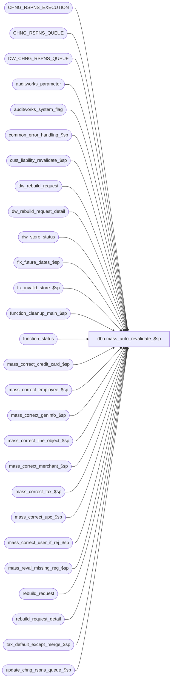

# dbo.mass_auto_revalidate_$sp

**Database:** auditworks_external  
**Server:** bedrockdb01  

## Architecture Diagram



## Table Dependencies

| Referenced Table |
|---|
| CHNG_RSPNS_EXECUTION |
| CHNG_RSPNS_QUEUE |
| DW_CHNG_RSPNS_QUEUE |
| auditworks_parameter |
| auditworks_system_flag |
| common_error_handling_$sp |
| cust_liability_revalidate_$sp |
| dw_rebuild_request |
| dw_rebuild_request_detail |
| dw_store_status |
| fix_future_dates_$sp |
| fix_invalid_store_$sp |
| function_cleanup_main_$sp |
| function_status |
| mass_correct_credit_card_$sp |
| mass_correct_employee_$sp |
| mass_correct_geninfo_$sp |
| mass_correct_line_object_$sp |
| mass_correct_merchant_$sp |
| mass_correct_tax_$sp |
| mass_correct_upc_$sp |
| mass_correct_user_if_rej_$sp |
| mass_reval_missing_reg_$sp |
| rebuild_request |
| rebuild_request_detail |
| tax_default_except_merge_$sp |
| update_chng_rspns_queue_$sp |

## Stored Procedure Code

```sql
create proc dbo.mass_auto_revalidate_$sp @stream_no tinyint = 1
AS

/*
Proc Name : mass_auto_revalidate_$sp
Desc : To re-evaluate most types of I/F rejects and to also revalidate some types of sa rejects. For i/f and
       sa rejects that can be corrected by table maintenance (or by importing or replicating master table data
       from other apps), those types of rejects will be revalidated when corresponding entries exist in table
       CHNG_RSPNS_QUEUE or when a user manually requests a revalidate for all types.
       
       To revalidate reject types that are not caught/corrected by table maintenance triggers, the user may request 
       a revalide.  When a user manually requests a revalidate, the gui/n-tier will populate a row in CHNG_RSPNS_QUEUE
       with ENTY_TYPE = 'ALL' or that corresponding to the reason selected (depending on user's selection).

       NOTE:  UI determines what ENTY_TYPE to use in the request based on code_description for S/A rejects and Dayend Issues
              or if_rejection_rule for I/F Rejects when the user doesn't pick ALL so to add a new ENTY_TYPE for S/A rejects do:
              UPDATE code_description  (see if_rejection_rule too)
                 SET alpha_code = 'TheNewOneBeingImplemented'
               WHERE code_type = 9 (see 209 too)
                 AND code = 'TheSARejectReasonToBeRevalidated'
       
       Triggers on master tables will populate specific values (not 'ALL') in ENTY_TYPE.


    Called by SRMain as a background job that cycles every 5 minutes. In a non-scaleout configuration there
    will be only one job running. In a scaleout configuration, there will be one job running on each peripheral server (not on consolidated).
    
    Same version can be used for SA 5.0 and SA 5.1

History:
Date     Name           Defect#  Description
Apr28,15 Vicci           118970  Release mass_correct_line_object_$sp to cleanup if it fails.
Apr07,15 Phu/Vicci       115922  Don't try to execute the mass_correct_line_object_$sp (function 82) while it is in 
                                 the middle of being executed by the Edit phase 2 or cust_liability_revalidate_$sp.
Mar03,15 Vicci       TFS-108714  Add function 124 (mass correct GENINFO) to mass correction list.
Oct07,14 Vicci        TFS-87015  Since 'TAX_DEFAULT_EXCEPT_MERGE' reference is too big to fit in code_description.alpha_code, use 'TAX_DFLT_EXCPT_MERGE' instead.
Jul10,14 Vicci        TFS-74694  Move function cleanup to be first, since when a request fails it is left outstanding and if not recovered first, 
                                 attempting to run it again will just result in a failed lock attempt.
                                 If function cleanup or any other revalidation failes, log the error but continue on to the next revalidation since
                                 they are largely independent of each other.
                                 Handle possibility of multiple CHNG_RSPNS_QUEUE entries for same ENTY_TYPE existing (can happen when triggers fire
                                 and work not committed until later in processing).
Jun19,14 Vicci        TFS-75199  Allow a stream# to be passed in and only process those ENTY_TYPE assigned to the stream (note:  by default
                                 all ENTY_TYPE are assumed to be assigned to stream 1 unless a stream override has been specified in the 
                                 auditworks_parameter table).
                                 Add function 113 (Mass Correct Employee attribute I/F Rejects) to list of mass correct halted processes to recover.
Sep23,13 Vicci           146826  Expand @errmsg since expanded in mass_correct_xxx_$sp
Jul10,13 Vicci           145144  Recognize 'TAX_DFLT_EXCPT_MERGE' request (issued by CRDM via tax_dflt_except_merge_ui_$sp to avoid timeouts).
Jan18,12 Vicci           132439  Remove references to CRDM user-defined string datatypes from S/A since CRDM is not changing them to support unicode.
Jan10,12 Vicci         1-47GP4M  Since rebuild requests must be executed on the peripherals to ensure their copy of the tax tracking and subledger is 
                                 updated, copy rebuild requests that were automatically created upon tax TM on the consolidated to peripherals.  
                                 Note that manually issued rebuild requests are already issued directly on the peripherals by the UI.
                                 To support pre-audit environments, call mass_correct_tax_$sp for tax-rebuilds requested for current store/dates.
Mar11,11 Vicci            64852  Support mass revalidation of tax I/F rejects.  Ensure that a new process ID is set for each revalidation performed
                                 since several share work tables with other functions.
Jan21,11 Vicci           124247  Correct function number (was previously set to Externally Detected I/F Reject validation).
Sep09,10 Vicci           120764  Don't try to execute the Customer Liability Revalidation (function 78) while it is in 
				 the middle of being executed by the Edit. Assign a new guid to @process_id.
Jun14,10 Paul            117766  ported 113433 from Oracle
Mar25,10 Vicci           116766  Use guid not spid as process id to avoid losing function status and work table entries
                                 for halted processes.
Mar02,10 Vicci 106158  Support mass revalidation of invalid business dates (future dates, before store open date, before open-to-receive date).
Feb24,10 Vicci           115882  Recognize function 67 for recovery purposes (mass_reval_missing_reg_$sp),
				 check for null in CHNG_DATE_TIME on peripheral.
Jan25,10 Vicci           115566	 Repeat revalidation request for 5 minutes if in scaleout environment to give replication time to complete.
Dec09,09 Paul    113433  Call mass_reval_missing_reg_$sp, re-try for 5 minutes (waiting for replication to occur) if scaleout.
Nov30,09 Paul            113408  If scaleout, then also look for rows in chng_rspns_queue on peripheral.
Jul22,09 Paul            111550  Use dw_chng_rspns_queue view to handle scaleout environment
Mar13,09 Vicci           106158  Support mass revalidation of invalid business dates (future dates, before store open date, before open-to-receive date).
Dec21,05 Paul           DV-1325  added nolock hints
May17,05 Paul           DV-1234  add call to mass_correct_merchant_$sp
Mar21,05 Paul           DV-1218  New.

*/

DECLARE @cursor_open		tinyint,
	@errmsg			nvarchar(2000),
	@errno			int,
	@function_no		tinyint,
	@halted_process_id	binary(16),
	@job_complete		tinyint,
	@job_start_time		datetime,
	@message_id		int,
	@operation_name		nvarchar(100),
	@object_name		nvarchar(255),
	@process_id		binary(16),
	@process_name		nvarchar(100),
	@rows			int,
	@recovery_rows		int,
	@stream_overrides	int,
	@scaleout_flag		int,
	@user_id		int,
	@ENTY_TYPE		nvarchar(50),
	@scaleout_delay		int,
	@revalidation_type	tinyint,
	@instance_id	        int,
	@function_name	        varbinary(128),
	@current_db_name        nvarchar(30),
        @db_id                  int,
        @ENTY_ALL_explosion_required tinyint

 SELECT @function_no = 66,
	@cursor_open = 0,
	@process_name = 'mass_auto_revalidate_$sp',
	@message_id = 201068,
	@process_id = newid(),
	@user_id = -1, -- system
	@scaleout_delay = 0,
	@job_start_time = getdate(),       
	@current_db_name = db_name(),
	@stream_no = COALESCE(@stream_no, 1),
	@stream_overrides = 0,
	@ENTY_ALL_explosion_required = 0
	
SELECT @function_name = convert(varbinary(128), @process_name + convert(nvarchar, @stream_no))

SET CONTEXT_INFO @function_name

CREATE TABLE #stream_assignment(
       ENTY_TYPE nvarchar(50) NOT NULL,
       stream_no tinyint not null)
SELECT @errno = @@error
IF @errno != 0
BEGIN
  SELECT @errmsg = 'Failed to create temp table to hold list of override stream assignments for revalidation entities.',
         @object_name = '#stream_assignment',
         @operation_name = 'CREATE TABLE'
  GOTO error
END

SELECT @db_id = dbid
  FROM master..sysprocesses
 WHERE spid = @@spid
SELECT @errno = @@error
IF @errno != 0
BEGIN
  SELECT @errmsg = 'Unable to select from master..sysprocesses',
  @object_name = 'master..sysprocesses',
         @operation_name = 'SELECT'
  GOTO error
END

IF EXISTS (SELECT 1
             FROM master..sysprocesses
            WHERE context_info = @function_name
              AND spid <> @@spid
              AND dbid = @db_id
              AND db_name(dbid) = @current_db_name)
BEGIN
  SELECT @message_id = 201682,
         @errno = 201682,
         @object_name = @process_name,
         @errmsg = 'The stored procedure ' + @process_name + ' is already running for stream ' + convert(nvarchar, @stream_no) + '.  Please verify.'
  GOTO error
END


SELECT @scaleout_flag = CONVERT(int,flag_numeric_value)
  FROM auditworks_system_flag
 WHERE flag_name = 'scaleout_flag'
SELECT @rows = @@rowcount, @errno = @@error
IF @errno != 0 OR @rows = 0
BEGIN
  SELECT @errmsg = 'Failed to select scaleout_flag from auditworks_system_flag',
         @object_name = 'auditworks_system_flag',
         @operation_name = 'SELECT'
  GOTO error
END
SELECT @instance_id = CONVERT(int,flag_numeric_value)
  FROM auditworks_system_flag
 WHERE flag_name = 'instance_id'
SELECT @rows = @@rowcount, @errno = @@error
IF @errno != 0 or @rows = 0
BEGIN
  SELECT @errmsg = 'Failed to select instance_id from auditworks_system_flag',
         @object_name = 'auditworks_system_flag',
         @operation_name = 'SELECT'
  GOTO error
END

/* If non-scaleout, then dw_rebuild_request and dw_rebuild_request_detail are dummy views 
   pointing to rebuild_request and rebuild_request_detail on local server and are not used.
   If scaleout, then dw_rebuild_request and dw_rebuild_request_detail 
   points to rebuild_request and rebuild_request_detail on the consolidated.
   If scaleout, gui rebuild functions will update rebuild_request and rebuild_request_detail on the peripherals
   while tax tm triggers will update rebuild_request and rebuild_request_detail on consolidated, 
   therefore the consolidated's rebuild requests need to be copied over to the peripherals to be processed by dayend. */
IF @scaleout_flag = 1 AND @instance_id <> 0 AND @stream_no = 1
BEGIN 
    
  INSERT into rebuild_request(
         rebuild_type,
         request_datetime,
         user_name,
         rebuild_from_date,
         rebuild_to_date,
         rebuild_from_store,
         rebuild_to_store,
         tax_jurisdiction,
         user_id,
         copied_from_request_id)
  SELECT r.rebuild_type,
         r.request_datetime,
         r.user_name,
         r.rebuild_from_date,
         r.rebuild_to_date,
         r.rebuild_from_store,
         r.rebuild_to_store,
         r.tax_jurisdiction,
         r.user_id,
         r.request_id
    FROM dw_rebuild_request r
   WHERE r.request_datetime <= @job_start_time
     AND EXISTS (SELECT 1 
     FROM dw_rebuild_request_detail rd
                        INNER JOIN dw_store_status ss
                           ON ss.sales_date = rd.transaction_date
                          AND ss.store_no = rd.store_no
                          AND ss.store_status >= 1
                          AND ss.instance_id = @instance_id
                  WHERE r.request_id = rd.request_id)
     AND NOT EXISTS (SELECT 1 FROM rebuild_request pr WHERE pr.copied_from_request_id = r.request_id)
  SELECT @errno = @@error
  IF @errno != 0
  BEGIN
    SELECT @errmsg = 'Failed to copy rebuild request headers for store/date which belong to the peripheral from consolidated to peripheral',
           @object_name = 'rebuild_request',
           @operation_name = 'INSERT'
    GOTO error
  END

  INSERT into rebuild_request_detail(
         request_id,
      rebuild_type,
         store_no,
         transaction_date,
         request_status,
         process_id,
         copied_from_request_id)
  SELECT pr.request_id,
         rd.rebuild_type,
         rd.store_no,
         rd.transaction_date,
         rd.request_status,
         rd.process_id,
  rd.request_id
    FROM dw_rebuild_request r
         INNER JOIN dw_rebuild_request_detail rd
            ON rd.request_id = r.request_id
         INNER JOIN dw_store_status ss
            ON ss.sales_date = rd.transaction_date
           AND ss.store_no = rd.store_no
           AND ss.store_status >= 1
           AND ss.instance_id = @instance_id
         INNER JOIN rebuild_request pr
            ON pr.copied_from_request_id = r.request_id
   WHERE r.request_datetime <= @job_start_time
     AND NOT EXISTS (SELECT 1 
                       FROM rebuild_request_detail prd
                      WHERE prd.copied_from_request_id = rd.request_id)
  SELECT @errno = @@error
  IF @errno != 0
  BEGIN
    SELECT @errmsg = 'Failed to copy rebuild request details for store/date which belong to the peripheral from consolidated to peripheral',
           @object_name = 'rebuild_request_detail',
          @operation_name = 'INSERT'
    GOTO error
  END

  DELETE dw_rebuild_request_detail
    FROM rebuild_request_detail prd
   WHERE prd.copied_from_request_id = dw_rebuild_request_detail.request_id
     AND prd.store_no = dw_rebuild_request_detail.store_no
     AND prd.transaction_date = dw_rebuild_request_detail.transaction_date
  SELECT @errno = @@error
  IF @errno != 0
  BEGIN
    SELECT @errmsg = 'Failed to remove rebuild request details on consolidated for store/date which where copied to the peripheral',
           @object_name = 'dw_rebuild_request_detail',
   @operation_name = 'DELETE'
    GOTO error
  END

  DELETE dw_rebuild_request
   WHERE dw_rebuild_request.request_datetime <= @job_start_time
     AND NOT EXISTS (SELECT 1 FROM dw_rebuild_request_detail rd WHERE dw_rebuild_request.request_id = rd.request_id)
  SELECT @errno = @@error
  IF @errno != 0
  BEGIN
    SELECT @errmsg = 'Failed to remove rebuild request headers on consolidated for which no details exist',
           @object_name = 'dw_rebuild_request',
          @operation_name = 'DELETE'
    GOTO error
  END
    
END  --IF @scaleout_flag = 1 AND @instance_id <> 0 AND @stream_no = 1

IF @stream_no = 1 AND 
   EXISTS (SELECT 1 
            FROM rebuild_request r
                 INNER JOIN rebuild_request_detail rd
                    ON r.request_id = rd.request_id
                   AND rd.request_status = 10
            WHERE r.request_datetime <= @job_start_time
              AND r.rebuild_type = 4)  --current transaction tax-detail rebuild
BEGIN 
  EXEC update_chng_rspns_queue_$sp 'TAX_REBUILD'
  SELECT @errno = @@error
  IF @errno != 0
  BEGIN
    SELECT @errmsg = 'Failed to recognize request for current transaction tax-details to be re-evaluated again',
           @object_name = 'update_chng_rspns_queue_$sp',
           @operation_name = 'EXECUTE'
    GOTO error
  END
  
  SELECT @job_start_time = getdate()
END  --IF outstanding current transaction tax-detail rebuild requests exist

INSERT INTO #stream_assignment(ENTY_TYPE, stream_no)       
SELECT SUBSTRING(par_name, 1, CHARINDEX('stream', par_name) - 1) ENTY_TYPE, MAX(CONVERT(tinyint, par_value)) stream_no
  FROM auditworks_parameter
 WHERE par_name LIKE '%stream'
   AND IsNumeric(par_value) = 1
   AND LTRIM(RTRIM(par_value)) <> '1'  --assignment to stream 1 are not considered overrides since that is the default
   AND SUBSTRING(par_name, 1, CHARINDEX('stream', par_name) - 1) IN ('FUTURE_DATE', 'GENINFO', 'TAX_DFLT_EXCPT_MERGE', 'BUSINESS_DATE', 'CARD_TYPE', 'CUST_LIAB', 'EMPLY', 'LINE_OBJECT', 'ORG_CHN', 'SETTLE', 'TAX', 'TAX_ISSUE', 'TAX_REBUILD', 'UPC', 'USER_DEFINED')
 GROUP BY SUBSTRING(par_name, 1, CHARINDEX('stream', par_name) - 1) 
SELECT @errno = @@error, @stream_overrides = @@rowcount
IF @errno != 0
BEGIN
  SELECT @errmsg = 'Failed to populate temp table to hold list of override stream assignments for revalidation entities.',
         @object_name = '#stream_assignment',
         @operation_name = 'INSERT'
  GOTO error
END

/* If non-scaleout, then DW_CHNG_RSPNS_QUEUE points to CHNG_RSPNS_QUEUE on local server.
   If scaleout, then DW_CHNG_RSPNS_QUEUE points to CHNG_RSPNS_QUEUE on the consolidated.
   If scaleout, gui revalidate functions will update CHNG_RSPNS_QUEUE on the peripheral
   while tm triggers will update CHNG_RSPNS_QUEUE on consolidated. */

IF @stream_overrides = 0
BEGIN
  SELECT @rows = COUNT(q.ENTY_TYPE)
    FROM DW_CHNG_RSPNS_QUEUE q WITH (NOLOCK)
   WHERE q.ENTY_TYPE IS NOT NULL
  SELECT @errno = @@error
  IF @errno != 0
  BEGIN
    SELECT @errmsg = 'Failed to count total no of rows from CHNG_RSPNS_QUEUE',
           @object_name = 'DW_CHNG_RSPNS_QUEUE',
          @operation_name = 'SELECT'
    GOTO error
  END

  IF @rows = 0 AND @scaleout_flag = 1 -- then check CHNG_RSPNS_QUEUE on peripheral
  BEGIN
    SELECT @rows = COUNT(q.ENTY_TYPE)
      FROM CHNG_RSPNS_QUEUE q WITH (NOLOCK)
     WHERE q.ENTY_TYPE IS NOT NULL
    SELECT @errno = @@error
    IF @errno != 0
    BEGIN
      SELECT @errmsg = 'Failed to count total no of rows from CHNG_RSPNS_QUEUE',
     @object_name = 'CHNG_RSPNS_QUEUE',
            @operation_name = 'SELECT'
      GOTO error
    END
  END
END  --IF @stream_overrides = 0, i.e. no stream overrides exist.
ELSE
BEGIN
  --If any of the ENTY that can be run from the ALL option (i.e. all except 'FUTURE_DATE', 'GENINFO', 'TAX_DFLT_EXCPT_MERGE') have been reassigned to a another stream, then any ALL request will have to be split into individual requests
  IF EXISTS (SELECT 1 FROM #stream_assignment WHERE ENTY_TYPE NOT IN ('FUTURE_DATE', 'GENINFO', 'TAX_DFLT_EXCPT_MERGE'))
  BEGIN
    SELECT @ENTY_ALL_explosion_required = 1
    INSERT INTO CHNG_RSPNS_EXECUTION (ENTY_TYPE)  --make sure all entities corresponding to the ALL option exist
    SELECT a.ENTY_TYPE
      FROM (SELECT 'BUSINESS_DATE' ENTY_TYPE
            UNION
            SELECT 'CARD_TYPE' ENTY_TYPE
            UNION
            SELECT 'CUST_LIAB' ENTY_TYPE
            UNION
            SELECT 'EMPLY' ENTY_TYPE
            UNION
            SELECT 'LINE_OBJECT' ENTY_TYPE
            UNION
            SELECT 'ORG_CHN' ENTY_TYPE
            UNION
            SELECT 'SETTLE' ENTY_TYPE
            UNION
            SELECT 'TAX' ENTY_TYPE
            UNION
            SELECT 'TAX_ISSUE' ENTY_TYPE
            UNION
            SELECT 'TAX_REBUILD' ENTY_TYPE
            UNION
            SELECT 'UPC' ENTY_TYPE
            UNION
            SELECT 'USER_DEFINED' ENTY_TYPE) a
      WHERE NOT EXISTS (SELECT 1 FROM CHNG_RSPNS_EXECUTION e WHERE e.ENTY_TYPE = a.ENTY_TYPE)
    SELECT @errno = @@error
    IF @errno != 0
    BEGIN
      SELECT @errmsg = 'Failed to ensure all entities corresonding to ALL option exist in execution table.  ',
             @object_name = 'CHNG_RSPNS_EXECUTION',
             @operation_name = 'INSERT'
      GOTO error
    END
      
    SELECT @rows = COUNT(q.ENTY_TYPE)
      FROM DW_CHNG_RSPNS_QUEUE q WITH (NOLOCK)
           LEFT OUTER JOIN CHNG_RSPNS_EXECUTION e WITH (NOLOCK)
             ON     e.ENTY_TYPE <> 'ALL'
                AND (   q.ENTY_TYPE = e.ENTY_TYPE
                     OR (q.ENTY_TYPE = 'ALL' AND e. ENTY_TYPE NOT IN ('FUTURE_DATE', 'GENINFO', 'TAX_DFLT_EXCPT_MERGE')))
           LEFT OUTER JOIN #stream_assignment s
             ON COALESCE(e.ENTY_TYPE, q.ENTY_TYPE) = s.ENTY_TYPE
     WHERE q.ENTY_TYPE IS NOT NULL
       AND COALESCE(s.stream_no, 1) = @stream_no
    SELECT @errno = @@error
    IF @errno != 0
    BEGIN
      SELECT @errmsg = 'Failed to count total no of rows from CHNG_RSPNS_QUEUE taking stream assignment into account.',
             @object_name = 'DW_CHNG_RSPNS_QUEUE',
             @operation_name = 'SELECT'
      GOTO error
    END

    IF @rows = 0 AND @scaleout_flag = 1 -- then check CHNG_RSPNS_QUEUE on peripheral
    BEGIN
      SELECT @rows = COUNT(q.ENTY_TYPE)
        FROM CHNG_RSPNS_QUEUE q WITH (NOLOCK)
           LEFT OUTER JOIN CHNG_RSPNS_EXECUTION e WITH (NOLOCK)
             ON     e.ENTY_TYPE <> 'ALL'
                AND (   q.ENTY_TYPE = e.ENTY_TYPE
                     OR (q.ENTY_TYPE = 'ALL' AND e. ENTY_TYPE NOT IN ('FUTURE_DATE', 'GENINFO', 'TAX_DFLT_EXCPT_MERGE')))
           LEFT OUTER JOIN #stream_assignment s
             ON COALESCE(e.ENTY_TYPE, q.ENTY_TYPE) = s.ENTY_TYPE
       WHERE q.ENTY_TYPE IS NOT NULL
         AND COALESCE(s.stream_no, 1) = @stream_no
      SELECT @errno = @@error
      IF @errno != 0
      BEGIN
        SELECT @errmsg = 'Failed to count total no of rows from CHNG_RSPNS_QUEUE taking stream assignment into account.',
               @object_name = 'CHNG_RSPNS_QUEUE',
              @operation_name = 'SELECT'
        GOTO error
      END
    END
  END  --IF stream overrides for entities processed by the 'ALL' option exist
  ELSE
  BEGIN
    SELECT @rows = COUNT(q.ENTY_TYPE)
      FROM DW_CHNG_RSPNS_QUEUE q WITH (NOLOCK)
           LEFT OUTER JOIN #stream_assignment s
             ON q.ENTY_TYPE = s.ENTY_TYPE
     WHERE q.ENTY_TYPE IS NOT NULL
       AND COALESCE(s.stream_no, 1) = @stream_no
    SELECT @errno = @@error
    IF @errno != 0
    BEGIN
      SELECT @errmsg = 'Failed to count total no of rows from CHNG_RSPNS_QUEUE taking stream assignment into account.',
             @object_name = 'DW_CHNG_RSPNS_QUEUE',
             @operation_name = 'SELECT'
      GOTO error
    END

    IF @rows = 0 AND @scaleout_flag = 1 -- then check CHNG_RSPNS_QUEUE on peripheral
    BEGIN
      SELECT @rows = COUNT(q.ENTY_TYPE)
        FROM CHNG_RSPNS_QUEUE q WITH (NOLOCK)
             LEFT OUTER JOIN #stream_assignment s
               ON q.ENTY_TYPE = s.ENTY_TYPE
       WHERE q.ENTY_TYPE IS NOT NULL
         AND COALESCE(s.stream_no, 1) = @stream_no
      SELECT @errno = @@error
      IF @errno != 0
      BEGIN
        SELECT @errmsg = 'Failed to count total no of rows from CHNG_RSPNS_QUEUE taking stream assignment into account.',
               @object_name = 'CHNG_RSPNS_QUEUE',
              @operation_name = 'SELECT'
        GOTO error
      END
    END
  END
END  --ELSE of IF @stream_overrides = 0, i.e. stream overrides exist

--Check for halted revalidations regardless of whether or any requests are outstanding (since if there is a halted revalidation then there will also be an outstanding request.
SELECT @recovery_rows = COUNT(process_id)
  FROM function_status WITH (NOLOCK)
 WHERE (   function_no IN (66,78,79,80,81,82,83,88,89,91,93,94,95,96,113,124) -- mass correct functions
          OR (function_no = 9 AND move_flag = 3) --function_no 97 (revalidate dates) and 68 (revalidate future dates) logs as a move.
          OR (function_no = 9 AND move_flag = 0 AND from_transaction_no = -2)) --fix invalid register logs as a move
   AND user_id = -1 -- excludes upc reassign
   AND (function_no NOT IN (78, 82) OR released_to_cleanup = 1)

/*	Check for previously aborted processes for this background job.
	If any rows exist in table function_status for this function, then they are presumed to be aborted processes since
	only one background job can run per SA database.
	Fn 78 will only be picked up after this proc has previously encountered an error and set released_to_cleanup = 1.
	If recovery fails, then susm should still sleep before calling this proc again. */
IF @recovery_rows > 0
BEGIN
  IF @stream_no <> 1 --Wait until stream 1 does the recovery before proceeding with any new revalidation attempts
  BEGIN
    SELECT @function_name = convert(varbinary(128), 'Unknown')
    SET CONTEXT_INFO @function_name
    DROP TABLE #stream_assignment
    RETURN
  END
  ELSE
  BEGIN
    DECLARE error_recovery_crsr CURSOR FAST_FORWARD
        FOR
     SELECT process_id
       FROM function_status WITH (NOLOCK)
      WHERE (   function_no IN (66,78,79,80,81,82,83,88,89,91,93,94,95,96,113,124) -- mass correct functions
              OR (function_no = 9 AND move_flag = 3) --function_no 97 (revalidate dates) and 68 (revalidate future dates) logs as a move.
              OR (function_no = 9 AND move_flag = 0 AND from_transaction_no = -2)) --fix invalid register logs as a move
        AND user_id = -1 -- excludes upc reassign
        AND (function_no NOT IN (78, 82) OR released_to_cleanup = 1)
      ORDER BY entry_date, function_no

    OPEN error_recovery_crsr
    SELECT @errno = @@error
    IF @errno != 0
    BEGIN
      SELECT @errmsg = 'Failed to open cursor error_recovery_crsr',
             @object_name = 'error_recovery_crsr',
             @operation_name = 'OPEN'
      GOTO error
    END

    SELECT @cursor_open = 1

    WHILE 1 = 1
    BEGIN
      FETCH error_recovery_crsr INTO
            @halted_process_id

      IF @@fetch_status <> 0
        BREAK

      BEGIN TRY
        SELECT @errmsg = 'Failed to execute error recovery. ',
	       @object_name = 'function_cleanup_main_$sp',
	       @operation_name = 'EXECUTE';
        EXEC function_cleanup_main_$sp @halted_process_id, -1 -- system
      END TRY
      BEGIN CATCH
      SELECT @errno = ERROR_NUMBER();
      SELECT @errmsg = @process_name + ':  ' + COALESCE(@errmsg, '') + ERROR_MESSAGE() + ' Line: ' + CONVERT(nvarchar, ERROR_LINE());
      
      IF @@trancount > 0 ROLLBACK TRANSACTION  --Since bypass raise error below also bypass the rollback

      EXEC common_error_handling_$sp @function_no, @errno, @errmsg, 
                                     3,  --bypass raise error 
                                     @message_id, @process_name, @object_name, @operation_name, 
                                     0, @stream_no, 0, null, 0, null, null, null, null, null, null, 0, @process_id, @user_id;

      CONTINUE;
      END CATCH;
    END -- while 1 = 1

    CLOSE error_recovery_crsr
    SELECT @errno = @@error
    IF @errno != 0
    BEGIN
      SELECT @errmsg = 'Failed to close cursor error_recovery_crsr',
             @object_name = 'error_recovery_crsr',
             @operation_name = 'CLOSE'
      GOTO error
    END

    DEALLOCATE error_recovery_crsr
    SELECT @cursor_open = 0

    /* end of error recovery logic */
    
  END  --ELSE of IF @stream_no <> 1
END  --IF @recovery_rows > 0

IF @rows = 0 --no outstanding requests to process
BEGIN
  SELECT @function_name = convert(varbinary(128), 'Unknown')
  SET CONTEXT_INFO @function_name
  DROP TABLE #stream_assignment
  RETURN
END
  
/*  populate execution table as a copy of DW_CHNG_RSPNS_QUEUE.
    Used as a cursor work table and to handle the scaleout environment.
    Will be left populated, i.e. not deleted, in order to handle scaleout. */

IF @ENTY_ALL_explosion_required = 0
BEGIN
--Take a snapshot of any existing rows in DW_CHNG_RSPNS_QUEUE
  UPDATE CHNG_RSPNS_EXECUTION
     SET CHNG_DATE_TIME = rq.CHNG_DATE_TIME
    FROM CHNG_RSPNS_EXECUTION ce
         INNER JOIN (SELECT q.ENTY_TYPE, MAX(q.CHNG_DATE_TIME) CHNG_DATE_TIME, MIN(COALESCE(s.stream_no, 1)) stream_no
                       FROM DW_CHNG_RSPNS_QUEUE q
                            LEFT OUTER JOIN #stream_assignment s
                              ON q.ENTY_TYPE = s.ENTY_TYPE
                      GROUP BY q.ENTY_TYPE) rq
            ON ce.ENTY_TYPE = rq.ENTY_TYPE
           AND (rq.CHNG_DATE_TIME > ce.CHNG_DATE_TIME OR ce.CHNG_DATE_TIME IS NULL)
           AND rq.stream_no = @stream_no
  SELECT @errno = @@error
  IF @errno != 0
  BEGIN
    SELECT @errmsg = 'Failed to populate CHNG_RSPNS_EXECUTION',
	   @object_name = 'CHNG_RSPNS_EXECUTION',
	   @operation_name = 'UPDATE'
    GOTO error
  END

  -- insert any new rows
  INSERT INTO CHNG_RSPNS_EXECUTION (ENTY_TYPE, STS, CHNG_DATE_TIME)
  SELECT q.ENTY_TYPE, MIN(q.STS), MAX(q.CHNG_DATE_TIME)
    FROM DW_CHNG_RSPNS_QUEUE q
         LEFT OUTER JOIN #stream_assignment s
           ON q.ENTY_TYPE = s.ENTY_TYPE
   WHERE COALESCE(s.stream_no, 1) = @stream_no
     AND q.ENTY_TYPE NOT IN (SELECT ENTY_TYPE FROM CHNG_RSPNS_EXECUTION)
   GROUP BY q.ENTY_TYPE
  SELECT @errno = @@error
  IF @errno != 0
  BEGIN
    SELECT @errmsg = 'Failed to populate CHNG_RSPNS_EXECUTION',
	   @object_name = 'CHNG_RSPNS_EXECUTION',
	   @operation_name = 'INSERT'
    GOTO error
  END

  IF @scaleout_flag = 1 -- peripheral
  BEGIN
    SELECT @scaleout_delay = -5 -- 5 min
    
    UPDATE CHNG_RSPNS_EXECUTION
       SET CHNG_DATE_TIME = rq.CHNG_DATE_TIME
      FROM CHNG_RSPNS_EXECUTION ce
           INNER JOIN (SELECT q.ENTY_TYPE, MAX(q.CHNG_DATE_TIME) CHNG_DATE_TIME, MIN(COALESCE(s.stream_no, 1)) stream_no
                         FROM CHNG_RSPNS_QUEUE q
			      LEFT OUTER JOIN #stream_assignment s
			        ON q.ENTY_TYPE = s.ENTY_TYPE
			GROUP BY q.ENTY_TYPE) rq
              ON ce.ENTY_TYPE = rq.ENTY_TYPE
             AND (rq.CHNG_DATE_TIME > ce.CHNG_DATE_TIME OR ce.CHNG_DATE_TIME IS NULL)
	     AND  rq.stream_no = @stream_no
    SELECT @errno = @@error
    IF @errno != 0
    BEGIN
      SELECT @errmsg = 'Failed to populate CHNG_RSPNS_EXECUTION (2)',
             @object_name = 'CHNG_RSPNS_EXECUTION',
             @operation_name = 'UPDATE'
      GOTO error
    END
    
    -- insert any new rows
    INSERT INTO CHNG_RSPNS_EXECUTION (ENTY_TYPE, STS, CHNG_DATE_TIME)
    SELECT q.ENTY_TYPE, MIN(q.STS), MAX(q.CHNG_DATE_TIME)
      FROM CHNG_RSPNS_QUEUE q
           LEFT OUTER JOIN #stream_assignment s
             ON q.ENTY_TYPE = s.ENTY_TYPE
     WHERE COALESCE(s.stream_no, 1) = @stream_no
       AND q.ENTY_TYPE NOT IN (SELECT ENTY_TYPE FROM CHNG_RSPNS_EXECUTION)
     GROUP BY q.ENTY_TYPE
    SELECT @errno = @@error
    IF @errno != 0
    BEGIN
      SELECT @errmsg = 'Failed to populate CHNG_RSPNS_EXECUTION (2)',
             @object_name = 'CHNG_RSPNS_EXECUTION',
             @operation_name = 'INSERT'
      GOTO error
    END
  END -- @scaleout_flag = 1
END  --IF @ENTY_ALL_explosion_required = 0
ELSE
BEGIN
--Take a snapshot of any existing rows in DW_CHNG_RSPNS_QUEUE
  UPDATE CHNG_RSPNS_EXECUTION
     SET CHNG_DATE_TIME = q.CHNG_DATE_TIME
    FROM (SELECT ce.ENTY_TYPE, MAX(rq.CHNG_DATE_TIME) CHNG_DATE_TIME
            FROM CHNG_RSPNS_EXECUTION ce
           INNER JOIN DW_CHNG_RSPNS_QUEUE rq
              ON rq.CHNG_DATE_TIME IS NOT NULL
             AND (rq.CHNG_DATE_TIME > ce.CHNG_DATE_TIME OR ce.CHNG_DATE_TIME IS NULL)
             AND (   ce.ENTY_TYPE = rq.ENTY_TYPE
                  OR (ce.ENTY_TYPE NOT IN ('FUTURE_DATE', 'GENINFO', 'TAX_DFLT_EXCPT_MERGE') AND rq.ENTY_TYPE = 'ALL'))
	    LEFT OUTER JOIN #stream_assignment s
              ON rq.ENTY_TYPE = s.ENTY_TYPE
           WHERE ce.ENTY_TYPE <> 'ALL'
             AND COALESCE(s.stream_no, 1) = @stream_no
           GROUP BY ce.ENTY_TYPE) q
   WHERE CHNG_RSPNS_EXECUTION.ENTY_TYPE = q.ENTY_TYPE
  SELECT @errno = @@error
  IF @errno != 0
  BEGIN
    SELECT @errmsg = 'Failed to populate CHNG_RSPNS_EXECUTION in @ENTY_ALL_explosion_required case',
	   @object_name = 'CHNG_RSPNS_EXECUTION',
	   @operation_name = 'UPDATE'
    GOTO error
  END

  -- insert already done earlier in this case

  IF @scaleout_flag = 1 -- peripheral
  BEGIN
    SELECT @scaleout_delay = -5 -- 5 min
    
    UPDATE CHNG_RSPNS_EXECUTION
       SET CHNG_DATE_TIME = q.CHNG_DATE_TIME
      FROM (SELECT ce.ENTY_TYPE, MAX(rq.CHNG_DATE_TIME) CHNG_DATE_TIME
              FROM CHNG_RSPNS_EXECUTION ce
             INNER JOIN CHNG_RSPNS_QUEUE rq
                ON rq.CHNG_DATE_TIME IS NOT NULL
               AND (rq.CHNG_DATE_TIME > ce.CHNG_DATE_TIME OR ce.CHNG_DATE_TIME IS NULL)
               AND (   ce.ENTY_TYPE = rq.ENTY_TYPE
                    OR (ce.ENTY_TYPE NOT IN ('FUTURE_DATE', 'GENINFO', 'TAX_DFLT_EXCPT_MERGE') AND rq.ENTY_TYPE = 'ALL'))
	      LEFT OUTER JOIN #stream_assignment s
                ON rq.ENTY_TYPE = s.ENTY_TYPE
             WHERE ce.ENTY_TYPE <> 'ALL'
    AND COALESCE(s.stream_no, 1) = @stream_no
             GROUP BY ce.ENTY_TYPE) q
     WHERE CHNG_RSPNS_EXECUTION.ENTY_TYPE = q.ENTY_TYPE
    SELECT @errno = @@error
    IF @errno != 0
    BEGIN
      SELECT @errmsg = 'Failed to populate CHNG_RSPNS_EXECUTION (2) in @ENTY_ALL_explosion_required case',
             @object_name = 'CHNG_RSPNS_EXECUTION',
             @operation_name = 'UPDATE'
      GOTO error
    END
    
    -- insert already done earlier in this case
    
  END -- @scaleout_flag = 1
END  --ELSE of IF @ENTY_ALL_explosion_required = 0 

/******** REVALIDATE sa rejects and i/f rejects ************************/
  
SELECT @job_complete = 0

  DECLARE revalidation_crsr CURSOR FAST_FORWARD
  FOR
  SELECT DISTINCT CASE WHEN q.ENTY_TYPE IN ('FUTURE_DATE', 'GENINFO', 'TAX_DFLT_EXCPT_MERGE') THEN ' ' + q.ENTY_TYPE ELSE q.ENTY_TYPE END
    FROM CHNG_RSPNS_EXECUTION q WITH (NOLOCK)
         LEFT OUTER JOIN #stream_assignment s
           ON q.ENTY_TYPE = s.ENTY_TYPE
   WHERE COALESCE(s.stream_no, 1) = @stream_no
     AND q.CHNG_DATE_TIME <= @job_start_time
     AND q.ENTY_TYPE IS NOT NULL /* should always be not null */
     AND (q.EXEC_DATE_TIME IS NULL OR q.EXEC_DATE_TIME < CHNG_DATE_TIME)
     AND (@ENTY_ALL_explosion_required = 0 OR q.ENTY_TYPE <> 'ALL')
   ORDER BY CASE WHEN q.ENTY_TYPE IN ('FUTURE_DATE', 'GENINFO', 'TAX_DFLT_EXCPT_MERGE') THEN ' ' + q.ENTY_TYPE ELSE q.ENTY_TYPE END /* to ensure that ENTY_TYPEs not processed by 'ALL' option are done before the 'ALL' which ends the loop.*/

  OPEN revalidation_crsr
  SELECT @errno = @@error
  IF @errno != 0
  BEGIN
    SELECT @errmsg = 'Failed to open cursor revalidation_crsr',
          @object_name = 'revalidation_crsr',
       @operation_name = 'OPEN'
    GOTO error
  END

  SELECT @cursor_open = 2

  WHILE @job_complete = 0
  BEGIN
   FETCH revalidation_crsr INTO @ENTY_TYPE

    IF @@fetch_status <> 0
      BREAK

   SELECT @process_id = newid()

   SELECT @ENTY_TYPE = LTRIM(@ENTY_TYPE)  --to remove leading blank forced in to control order by
   
   /* When all is requested, revalidate sa rejects first since this may generate additional i/f rejects */
   
   BEGIN TRY
   SELECT @operation_name = 'EXECUTE';

   IF @ENTY_TYPE IN ('BUSINESS_DATE', 'ALL')
     BEGIN
        SELECT @errmsg = 'Failed to revalidate business dates previously rejected as prior to store open or open-to-receive dates. ',
 	   @object_name = 'fix_future_dates_$sp';
      EXEC fix_future_dates_$sp @process_id, @user_id, 97;
     END -- store open date and open-to-receive date

   IF LTRIM(@ENTY_TYPE) = 'FUTURE_DATE'  
   --ALL purposefully excluded since it would be dangerous to mark a business date that was future at the time 
   --it was received as being OK now simply because of the passage of time;  the auditor must specifically request this.
     BEGIN
      SELECT @errmsg = 'Failed to revalidate business dates previously rejected as future. ',
	   @object_name = 'fix_future_dates_$sp';
      EXEC fix_future_dates_$sp @process_id, @user_id, 68;
     END -- future dates

   IF @ENTY_TYPE IN ('LINE_OBJECT', 'ALL')
     BEGIN
        SELECT @errmsg = 'Failed to execute mass_correct_line_object_$sp. ',
	   @object_name = 'mass_correct_line_object_$sp';
      EXEC mass_correct_line_object_$sp @process_id, @user_id;
     END -- line object

   IF LTRIM(@ENTY_TYPE) = 'GENINFO'
     BEGIN
        SELECT @errmsg = 'Failed to execute mass_correct_geninfo_$sp. ',
	   @object_name = 'mass_correct_geninfo_$sp';
      EXEC mass_correct_geninfo_$sp @process_id, @user_id;
     END -- gen info

IF @ENTY_TYPE IN ('ORG_CHN', 'ALL')
     BEGIN
        SELECT @errmsg = 'Failed to execute fix_invalid_store_$sp. ',
	   @object_name = 'fix_invalid_store_$sp';

      EXEC fix_invalid_store_$sp @process_id, @user_id

        SELECT @errmsg = 'Failed to execute mass_reval_missing_reg_$sp. ',
	   @object_name = 'mass_reval_missing_reg_$sp';
      EXEC mass_reval_missing_reg_$sp @process_id, @user_id
     END -- org_chn


   /* now revalidate i/f rejects */

   IF @ENTY_TYPE IN ('EMPLY', 'ALL')
     BEGIN
        SELECT @errmsg = 'Failed to execute mass_correct_employee_$sp. ',
	   @object_name = 'mass_correct_employee_$sp';
      EXEC mass_correct_employee_$sp @process_id, @user_id, null

     END -- emply

   IF @ENTY_TYPE IN ('UPC', 'ALL')
     BEGIN
        SELECT @errmsg = 'Failed to execute mass_correct_upc_$sp. ',
	   @object_name = 'mass_correct_upc_$sp';
      EXEC mass_correct_upc_$sp @process_id, @user_id, 0, null

     END -- upc

   IF @ENTY_TYPE IN ('CARD_TYPE', 'ALL')
     BEGIN
        SELECT @errmsg = 'Failed to execute mass_correct_credit_card_$sp. ',
	   @object_name = 'mass_correct_credit_card_$sp'; 
      EXEC mass_correct_credit_card_$sp @process_id, @user_id, null; 
     END -- card_type

   IF @ENTY_TYPE IN ('SETTLE', 'ALL')
     BEGIN
        SELECT @errmsg = 'Failed to execute mass_correct_merchant_$sp. ',
	   @object_name = 'mass_correct_merchant_$sp';

      EXEC mass_correct_merchant_$sp @process_id, @user_id;
     END -- settle

   IF @ENTY_TYPE IN ('CUST_LIAB', 'ALL')
     BEGIN -- revalidate customer liabilty rejects
        SELECT @errmsg = 'Failed to execute cust_liability_revalidate_$sp. ',
	   @object_name = 'cust_liability_revalidate_$sp';
      EXEC cust_liability_revalidate_$sp @process_id, @user_id, 78, null, 1, 1, 0;
     END -- cust_liab

   IF @ENTY_TYPE IN ('USER_DEFINED', 'ALL')
     BEGIN
      -- revalidate user-defined i/f rejections
        SELECT @errmsg = 'Failed to execute mass_correct_user_if_rej_$sp. ',
  	   @object_name = 'mass_correct_user_if_rej_$sp'; 
      EXEC mass_correct_user_if_rej_$sp @process_id, @user_id, null;
     END -- user-defined I/F Rejections

   IF @ENTY_TYPE IN ('TAX', 'TAX_ISSUE', 'TAX_REBUILD', 'ALL')
     BEGIN
      -- 'TAX' = revalidate Tax i/f rejections
      -- 'TAX_ISSUE' = revalidate Tax Expected vs Collected variance issues
      -- 'TAX_REBUILD' = rebuild tax_detail for current transactions for manually requested store/dates
      SELECT @errmsg = 'Failed to execute mass_correct_tax_$sp. ',
	     @object_name = 'mass_correct_tax_$sp';
      SELECT @revalidation_type = CASE @ENTY_TYPE WHEN 'TAX' THEN 1 WHEN 'TAX_ISSUE' THEN 2 WHEN 'TAX_REBUILD' THEN 4 ELSE 3 END
      EXEC mass_correct_tax_$sp @process_id, @user_id, null, @revalidation_type;
     END -- Tax I/F Rejections and/or Expected vs Collected variance issues

   IF LTRIM(@ENTY_TYPE)  = 'TAX_DFLT_EXCPT_MERGE'
   BEGIN
     SELECT @errmsg = 'Failed to determine taxability of tax-item-groups and populate work_tax_item_group_taxability. ',
            @object_name = 'tax_default_except_merge_$sp';
     EXEC tax_default_except_merge_$sp @errmsg OUTPUT, -1, null, 1;
   END -- TAX_DFLT_EXCPT_MERGE

   IF @ENTY_TYPE = 'ALL'
     SELECT @job_complete = 1 -- no need to look for further requests (except those not processed by the 'ALL' option) since all was requested

   END TRY
   BEGIN CATCH
     SELECT @errno = ERROR_NUMBER();
     
     SELECT @errmsg = @process_name + ':  ' + COALESCE(@errmsg, '') + ERROR_MESSAGE() + ' Line: ' + CONVERT(nvarchar, ERROR_LINE());
     
     IF @@trancount > 0 ROLLBACK TRANSACTION  --Since bypass raise error below also bypass the rollback
     
     EXEC common_error_handling_$sp @function_no, @errno, @errmsg, 
                                    3,  --bypass raise error 
                                    @message_id, @process_name, @object_name, @operation_name, 
                           0, @stream_no, 0, null, 0, null, null, null, null, null, null, 0, @process_id, @user_id;
     UPDATE CHNG_RSPNS_EXECUTION
        SET CHNG_DATE_TIME = dateadd(mi, @scaleout_delay, @job_start_time)  --to avoid it being marked as done when the loop is done
      WHERE ENTY_TYPE = @ENTY_TYPE
        AND CHNG_DATE_TIME < dateadd(mi, @scaleout_delay, @job_start_time);

     IF @object_name = 'cust_liability_revalidate_$sp'
     BEGIN
       UPDATE function_status
          SET released_to_cleanup = 1
        WHERE function_no = 78
          AND process_id = @process_id
          AND user_id = @user_id;
     END;
     IF @object_name = 'mass_correct_line_object_$sp'
     BEGIN
       UPDATE function_status
          SET released_to_cleanup = 1
        WHERE function_no = 82
          AND process_id = @process_id
          AND user_id = @user_id;
     END;

     CONTINUE;
   END CATCH;

  END -- while @job_complete = 0

  CLOSE revalidation_crsr

  SELECT @errno = @@error
  IF @errno != 0
  BEGIN
    SELECT @errmsg = 'Failed to close cursor revalidation_crsr',
           @object_name = 'revalidation_crsr',
           @operation_name = 'CLOSE'
    GOTO error
  END

  DEALLOCATE revalidation_crsr
  SELECT @cursor_open = 0

  /* Flag rows as posted to keep track of last execution datetime on each peripheral
     For scaleout, each peripheral has its own copy of CHNG_RSPNS_EXECUTION.
     For scaleout, only set EXEC_DATE_TIME to system time when CHNG_DATE_TIME is more than 5 minutes ago. This will
     ensure that the revalidate will try again for 5 minutes so that the tm tables that are needed for revalidation
     will have a chance to be replicated before revalidation is flagged as complete.
     For non-scaleout, the @scaleout_delay value is zero seconds. */

  UPDATE CHNG_RSPNS_EXECUTION
     SET EXEC_DATE_TIME = @job_start_time
    FROM CHNG_RSPNS_EXECUTION q
         LEFT OUTER JOIN #stream_assignment s
           ON q.ENTY_TYPE = s.ENTY_TYPE
   WHERE COALESCE(s.stream_no, 1) = @stream_no
     AND q.CHNG_DATE_TIME < dateadd(mi, @scaleout_delay, @job_start_time)  --
  SELECT @errno = @@error
  IF @errno != 0
  BEGIN
    SELECT @errmsg = 'Failed to set EXEC_DATE_TIME',
           @object_name = 'CHNG_RSPNS_EXECUTION',
           @operation_name = 'UPDATE'
    GOTO error
  END

  -- delete all local queue entries that have been processed by this job

  DELETE CHNG_RSPNS_QUEUE
    FROM CHNG_RSPNS_QUEUE q
         LEFT OUTER JOIN #stream_assignment s
           ON q.ENTY_TYPE = s.ENTY_TYPE
   WHERE COALESCE(s.stream_no, 1) = @stream_no
     AND q.CHNG_DATE_TIME <= @job_start_time
  SELECT @errno = @@error
  IF @errno != 0
  BEGIN
    SELECT @errmsg = 'Failed to delete CHNG_RSPNS_QUEUE',
	   @object_name = 'CHNG_RSPNS_QUEUE',
	   @operation_name = 'DELETE'
     GOTO error
  END 

SELECT @function_name = convert(varbinary(128), 'Unknown')
SET CONTEXT_INFO @function_name
DROP TABLE #stream_assignment
RETURN

error:
        SELECT @function_name = convert(varbinary(128), 'Unknown')
        SET CONTEXT_INFO @function_name

	IF @cursor_open = 1
	BEGIN
	  CLOSE error_recovery_crsr
	  DEALLOCATE error_recovery_crsr
	END
	
	IF @cursor_open = 2
	BEGIN
	  CLOSE revalidation_crsr
	  DEALLOCATE revalidation_crsr
	END

        DROP TABLE #stream_assignment

	EXEC common_error_handling_$sp @function_no, @errno, @errmsg, 0, @message_id, 
	@process_name, @object_name, @operation_name, 0, 1, 0, null, 0, null, null, null,
	                         null, null, null, 0, @process_id, @user_id

	RETURN
```

